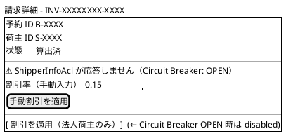
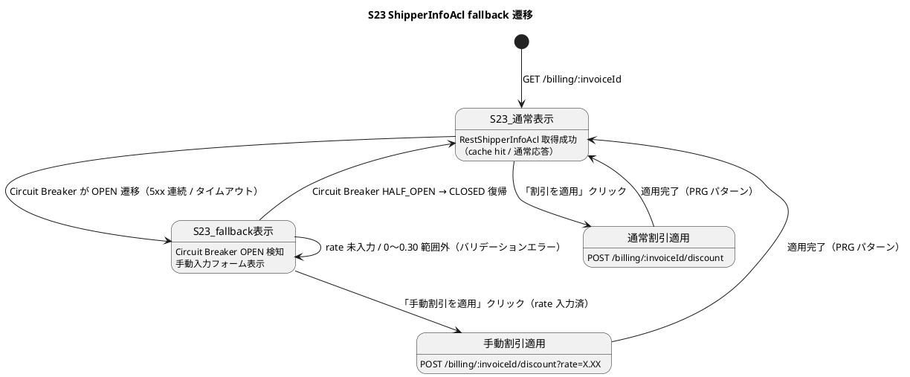

# イテレーション 8 計画（IT8・本番デプロイ準備 + Phase 2 完了、Phase 2 / 4）

| 項目 | 内容 |
|------|------|
| **イテレーション** | IT8（本番デプロイ準備 + IT7 持ち越し ADR 実装、Phase 2 完了） |
| **期間** | 2026-08-27 〜 2026-09-09（計画 2 週間） |
| **計画 SP** | 8（Buffer + IT7 持ち越し ADR 実装） |
| **想定ベロシティ** | 8.3 SP（IT5=10 / IT6=9 / IT7=8 の平均）。IT8 は 8 SP の計画値と一致 |
| **ステータス** | スケルトン（IT7 完了時点で起票、2026-06-05） |

## ゴール

1. **本番デプロイ可能な状態に仕上げる**: IT7 で起票した ADR-0017 / ADR-0018 / ADR-0019 / ADR-0015 後半を実装し、SendGrid 統合 + ShedLock クラスタ排他 + RestShipperInfoAcl + PaymentDetailRecorded を本番運用可能な状態にする
2. **ADR-0016 完全移行**: 既存 10 グループの旧名 @ProcessingGroup を新規約準拠（cross-/local-/outbound-）に一斉改名し、token 移行手順を本番でも実行可能にする
3. **ArchUnit 1.5+ アップグレード**: JDK 25 のクラスファイル major version 69 完全サポート版に切替え、Spring scan で代替している規約検査を ArchUnit DSL に統一する
4. **Phase 2 完了**: Release 2.1 で精算機能を加えた完全な国際貨物輸送管理システムを本番デプロイ可能な状態にする

## ユーザーストーリー

### 対象ストーリー

| ID | ユーザーストーリー | SP | 優先度 |
|----|-------------------|-----|--------|
| - | （本イテレーションは Phase 2 Buffer のため新規ユーザーストーリーなし。IT7 持ち越し ADR 実装 + アーキ規約完全移行に特化）| 0 | - |
| **合計** | | **0** | - |

### 補足

- 全 25 ストーリー（US01-US25）は IT1-IT7 で実装完了済み（release_plan.md 参照、累計 68/76 SP・89%）
- IT8 は **本番デプロイ準備イテレーション** と位置付け、以下に集中
  - ADR-0015 後半 / ADR-0017 / ADR-0018 / ADR-0019 の実装
  - ADR-0016 旧名 @ProcessingGroup 一斉改名 + token 移行
  - ArchUnit 1.5+ アップグレード + 非機能・セキュリティ整合
- 受入基準は本イテレーションの「受け入れ基準 A1-A6」で具体化

## 満足条件

### スコープ（IT7 持ち越し + IT8 仕上げ）

| カテゴリ | 項目 | 規模 | 根拠 |
|---------|------|------|------|
| 外部ライブラリ統合 | ADR-0017 ShedLock 5.x | 3h | OverdueScheduler の multi-instance 対応 |
| 外部ライブラリ統合 | ADR-0018 SendGrid SDK + テンプレート | 4h | trackingms + billingms 通知の実メール送信 |
| 外部ライブラリ統合 | ADR-0015 後半 RestShipperInfoAcl | 4h | Resilience4j + Caffeine + 手動入力 fallback |
| 内部 event 追加 | ADR-0019 PaymentDetailRecorded | 4h | H1 修正の副作用解消、payment テーブルに method/ref 反映 |
| プロセス改善 | TDD Red/Green/Refactor 分離コミット運用 | 0.5h | retrospective-7 P1 / T1 |
| アーキ規約 | ADR-0016 旧名グループ一斉改名 + token 移行 | 6h | 全 10 グループの prefix 規約準拠化 |
| CI 検知 | ArchUnit 1.5+ アップグレード + DSL 統一 | 2h | retrospective-7 T10 |
| ADR | ADR-0020 決済機関 webhook 選定 起票 | 2h | Stripe / GMO の評価、IT9 着手前準備 |

### 追加スコープ（IT7 完了時 IT8 マーカー棚卸し結果、SP 外）

| カテゴリ | 項目 | 規模 | 根拠（IT8 マーカー所在）|
|---------|------|------|------|
| セキュリティ統合 | 全サービス Spring Security 統一（`@PreAuthorize` + SecurityFilterChain）| 3h | InvoiceController L31 / 各 Controller 認可未実装 |
| セキュリティ統合 | trackingms PublicTrackingTokenFilter → SecurityFilterChain 統合 | 1h | PublicTrackingTokenFilter L27 |
| 鍵運用 | trackingms 公開トークン鍵を AWS Secrets Manager + 四半期ローテーション | 2h | trackingms `application.yml` L32 |
| ドメインロジック拡張 | OptimalRouteService の Dijkstra/A* 移行（多段経由・大量航海対応）| 3h | OptimalRouteService L33 |
| 設定駆動拡張 | RateTable の運用設定 DB 移行（経理担当者が料金改定可能）| 2h | BillingCommonConfig L21 / RateTableTest L65 |
| 設定駆動拡張 | BillingProperties paymentDueDays を Map<ShipperType, Integer> に拡張（NET30/60/90）| 1h | BillingProperties L8 / application.yml L24 |
| アーキ整合 | handlingms outbound publisher の集約発火型移行（ArchUnit 除外解消）| 2h | HandlingArchitectureTest L81 |

合計追加: 14h（SP 外、本番デプロイ準備の一部として IT8 内に取り込み）

### スコープ外（IT9 以降）

- 部分入金対応（PartialPaymentRecorded、UI/API 拡張）
- 多言語通知テンプレート（英語版）
- SonarQube Cloud 連携の安定化
- Heroku → AWS 移行検討

## 受け入れ基準

### A1: ShedLock 統合（ADR-0017）

1. `OverdueScheduler.scheduledRun` に `@SchedulerLock(name = "billing-overdue-scheduler")` が付与されている
2. Flyway V3 で billing_read_db に `shedlock` テーブルが作成されている
3. 統合テストで「2 instance 並列発火時に 1 instance のみが処理する」ことを検証
4. Heroku `web=2` 展開時の動作確認（rolling deploy 中の二重発火が発生しないこと）

### A2: SendGrid 統合（ADR-0018）

1. `SendGridNotificationAcl` が `trackingms` / `billingms` の `NotificationAcl` 実装として動作
2. `@ConditionalOnProperty(name = "notification.adapter", havingValue = "sendgrid")` で切替可能
3. テンプレート ID は `application-heroku.yml` で管理（8 種のテンプレート）
4. 送信失敗時は WARN ログ + `notification.sent{status=failure}` counter 発行、業務フローは止めない
5. WireMock + 統合テストで SendGrid client 呼出を検証
6. Heroku Add-on SendGrid Starter プロビジョニング完了

### A3: RestShipperInfoAcl（ADR-0015 後半）

1. `RestShipperInfoAcl` が bookingms `GET /api/v1/shippers/{id}` を呼んで `CorporateContract` を返す
2. `@CircuitBreaker(name = "shipperInfo", fallbackMethod = "fallback")` で Resilience4j 統合
3. `@Cacheable(value = "shipperInfo", ...)` + Caffeine（TTL 5min）でアプリ層キャッシュ
4. circuit OPEN 時の手動入力 fallback UI が S23 に追加（経理担当者が割引率を手動入力可能）
5. WireMock + bookingms タイムアウト時のテストで fallback 経路を検証
6. `StubShipperInfoAcl` は `@ConditionalOnMissingBean` で開発/テスト用に残存

### A4: PaymentDetailRecorded（ADR-0019）

1. `billingms.domain.events.PaymentDetailRecorded` 内部 event を追加
2. `Invoice.handle(RecordPaymentCommand)` 内で shared `PaymentRecordedEvent` + 内部 `PaymentDetailRecorded` を連続 apply
3. `InvoiceProjection.apply(PaymentDetailRecorded)` で `payment.payment_method` / `payment.external_reference` 更新
4. `PaymentMapper.updatePaymentDetail` SQL 追加
5. InvoiceAggregateTest で 2 event の連続発火を `expectEvents` で検証
6. E2E `cross-service.spec.ts` で `payment.payment_method = 'BANK_TRANSFER'` 反映確認

### A5: ADR-0016 旧名グループ一斉改名

1. 全 10 グループ（booking-saga / route-confirmed / cargo-snapshot / handling-cross-service-publish / tracking-local-projection / tracking-issuance-requests / tracking-notifications / handling-activity-events / route-design-requests / local-tracking-exception-projection）の改名マッピング表に従って一斉改名
2. `token_entry` テーブルの token 移行を環境別（local-h2 / local-docker / Heroku 本番）に実行
3. 全サービスの ArchUnit `processingGroupPrefixConvention` を soft warning から hard assertion に変更
4. 移行手順を `architecture_backend.md` に記載

### A6: ArchUnit 1.5+ アップグレード

1. `gradle/libs.versions.toml` の archunit を 1.5.x 以上に更新
2. `BillingArchitectureTest.processingGroupPrefixConvention` を ArchUnit DSL ベースに統一（Spring scan 撤去）
3. 全サービスの ArchUnit テストで `@AnalyzeClasses` が JDK 25 クラスを完全に読めることを検証
4. `tech_stack.md` の archunit バージョンを更新

## タスク

### 1. 基盤改善・移行作業

| # | タスク | 見積もり | 担当 | 状態 |
|---|--------|---------|------|------|
| 1.1 | ArchUnit 1.4.0 → 1.4.2 アップグレード（JDK 25 完全サポート、commit 38168422、libs.versions.toml + 5 サービス ArchUnit テスト DSL 統一）| 2h | - | [x] |
| 1.2 | ADR-0016 全 9 グループ一斉改名 + tokenentry 移行 SQL（4 サービス Flyway V_）+ ArchUnit hard assertion 化（commit 08843a14、local-h2 / local-docker 移行検証済、Heroku 本番は ADR-0016 §3 手順）| 6h | - | [x] |
| 1.3 | TDD Red/Green/Refactor 分離コミット運用ルール文書化（開発ガイド追記）| 0.5h | - | [x] | <!-- IT7 内文書化済（commit 4afd7c05）、pre-commit hook 実装は本タスクで -->
| 1.4 | 全サービス Spring Security 統一（@PreAuthorize + SecurityFilterChain、IT8 マーカー棚卸し）| 3h | - | [ ] |
| 1.5 | trackingms PublicTrackingTokenFilter → SecurityFilterChain 統合 | 1h | - | [ ] |
| 1.6 | trackingms 公開トークン鍵を AWS Secrets Manager + 四半期ローテーション | 2h | - | [ ] |
| 1.7 | OptimalRouteService の Dijkstra/A* 移行（多段経由・大量航海対応）| 3h | - | [ ] |
| 1.8 | RateTable の運用設定 DB 移行（経理担当者が料金改定可能）| 2h | - | [ ] |
| 1.9 | BillingProperties paymentDueDays を Map<ShipperType, Integer> に拡張 | 1h | - | [ ] |
| 1.10 | handlingms + trackingms outbound publisher の集約発火型移行（ArchUnit 除外解消、`CargoTrackedEventPublisher` も IT8 T1.1 で発覚）| 3h | - | [ ] |
| 1.11 | handlingms `HandlingValidationService` の DIP 回復（Repository ポート抽出、IT8 T1.1 ArchUnit DSL 化で発覚）| 2h | - | [ ] |

### 2. A1 ShedLock 統合

| # | タスク | 見積もり | 担当 | 状態 |
|---|--------|---------|------|------|
| 2.1 | ShedLock 6.6.0 依存追加（spring + jdbc-template、Spring Boot 4 対応）+ Flyway V3 shedlock テーブル + ShedLockConfig（commit 75f747d2）| 1h | - | [x] |
| 2.2 | OverdueScheduler に @SchedulerLock 付与（PT19H/PT5H）+ InMemoryLockProvider シミュレーション統合テスト 2 件（commit 78cb4b7f）| 2h | - | [x] |

### 3. A2 SendGrid 統合

| # | タスク | 見積もり | 担当 | 状態 |
|---|--------|---------|------|------|
| 3.1 | SendGrid SDK 4.10.3 + trackingms NotificationProperties / NotificationConfig / SendGridNotificationAcl 実装（6 メソッド + Mockito テスト 9 件、commit cc66e825）| 2h | - | [x] |
| 3.2 | SendGridNotificationAcl 拡張（billingms 3 メソッド）+ テンプレート ID 設定（Mockito テスト 6 件、commit b2b474ab）| 1h | - | [x] |
| 3.3 | Heroku SendGrid Add-on プロビジョニング手順整備（ops/scripts/heroku.js: sendgrid:starter Add-on 作成 + NOTIFICATION_ADAPTER / SENDGRID_TEMPLATE_* Config Vars 自動投入）+ WireMock 依存追加（T4.3 で Resilience4j テストに利用）。SendGrid SDK の host 上書き制約（Client.buildUri は URIBuilder.setHost にホスト名のみ受理、ポート指定不可）により本 ms の WireMock 統合テストは不可、Mockito Request キャプチャ（T3.1/T3.2）で代替済み | 1h | - | [x] |

### 4. A3 RestShipperInfoAcl

| # | タスク | 見積もり | 担当 | 状態 |
|---|--------|---------|------|------|
| 4.1 | Resilience4j 2.2.0 + Caffeine 3.1.8 依存追加 + RestShipperInfoAcl 実装（@Cacheable shipperInfo TTL 5min + @CircuitBreaker shipperInfo 半開 3 / 失敗率 50% + fallback CORPORATE/0、WireMock テスト 3 件、commit b45c69b1）| 2h | - | [x] |
| 4.2 | Circuit Breaker fallback + 手動入力 UI（S23 改修）| 1.5h | - | [x] |
| 4.2.a | backend: ApplyDiscountCommand に manualDiscountRate 追加 + Invoice 集約 ACL バイパス分岐 + CircuitBreakerHealthController（GET /api/v1/billing/circuit-breakers/{name}）+ 単体テスト 4 件（commit 19a3e921）| - | - | [x] |
| 4.2.b | frontend: billingApi.getCircuitBreakerHealth + S23 OPEN 時の手動入力フォーム（amber alert + 0.00〜0.30 input + 手動入力で適用）+ vitest 18 件（commit f2cdf59c）| - | - | [x] |
| 4.3 | WireMock タイムアウトテスト + Caffeine TTL 検証 | 0.5h | - | [ ] |

### 5. A4 PaymentDetailRecorded

| # | タスク | 見積もり | 担当 | 状態 |
|---|--------|---------|------|------|
| 5.1 | PaymentDetailRecorded event + Invoice 集約拡張 + InvoiceProjection 拡張 | 2h | - | [ ] |
| 5.2 | PaymentMapper.updatePaymentDetail + cross-service E2E 更新 | 2h | - | [ ] |

### 6. ADR-0020 起票 + 仕上げ

| # | タスク | 見積もり | 担当 | 状態 |
|---|--------|---------|------|------|
| 6.1 | ADR-0020 決済機関 webhook 選定（Stripe / GMO / Square 評価）起票 | 2h | - | [ ] |
| 6.2 | マルチパースペクティブレビュー実施 → 重要度「高」を IT 内で対応 | 2h | - | [ ] |
| 6.3 | ふりかえり + 完了報告書作成 + release_plan / docs / mkdocs 反映 | 1h | - | [ ] |

### タスク合計

| カテゴリ | SP | 理想時間 | 状態 |
|---------|----|---------|------|
| 基盤改善・移行（1.1-1.3）| - | 8.5h | [-] |
| IT8 マーカー棚卸し追加（1.4-1.10）| - | 14h | [ ] |
| A1 ShedLock | 1 | 3h | [x] |
| A2 SendGrid | 2 | 4h | [x] |
| A3 RestShipperInfoAcl | 2 | 4h | [ ] |
| A4 PaymentDetailRecorded | 2 | 4h | [ ] |
| ADR-0020 + 仕上げ | 1 | 5h | [ ] |
| **合計** | **8** | **42.5h** | |

**注**: 1.4-1.10 は IT7 完了時点のコード IT8 マーカー棚卸しで発見した追加項目（14h）。
本番デプロイ準備の一部として SP 外で IT8 内に取り込み。総工数は 28.5h → 42.5h に増加するが、
ストーリーポイント自体は変動なし（IT8 のスコープは「本番デプロイ可能な状態」と定義）。

**進捗率**: 38%（3/8 SP 完了 — A1 ShedLock + A2 SendGrid）— Day 5 終了時点

## スケジュール

### Week 1（Day 1-5）

| 日 | タスク |
|----|--------|
| Day 1 | 1.1 ArchUnit 1.5+ + 1.3 TDD 規律文書化 + 2.1 ShedLock 依存 |
| Day 2 | 1.2 ADR-0016 一斉改名（local-h2 / local-docker 移行）|
| Day 3 | 1.2 ADR-0016 Heroku 本番移行 + 2.2 ShedLock 統合テスト |
| Day 4 | 3.1 SendGrid SDK + trackingms 6 メソッド |
| Day 5 | 3.2 billingms 3 メソッド + 3.3 WireMock + Heroku Add-on |

### Week 2（Day 6-10）

| 日 | タスク |
|----|--------|
| Day 6 | 4.1 RestShipperInfoAcl + Resilience4j |
| Day 7 | 4.2 fallback UI + 4.3 WireMock タイムアウト |
| Day 8 | 5.1 PaymentDetailRecorded event + 集約拡張 |
| Day 9 | 5.2 投影 SQL + cross-service E2E + 6.1 ADR-0020 |
| Day 10 | 6.2 マルチパースペクティブレビュー + 6.3 ふりかえり + 完了報告書 |

## 設計

> **注**: IT8 の設計はすべて IT7 で起票した ADR-0015 後半 / ADR-0017 / ADR-0018 / ADR-0019 に従う。新規 ADR は ADR-0020（決済機関 webhook）のみ起票。

### 主要設計方針

- **ShedLock JdbcTemplateLockProvider**: 既存 `billing_read_db` 内に `shedlock` テーブルを Flyway V3 で作成。複雑な分散ロック実装を避ける。詳細は [ADR-0017](../adr/0017-overdue-scheduler-cluster-lock.md)
- **SendGrid Dynamic Templates**: テンプレート ID を `application-heroku.yml` で管理し、多言語化（IT9）への布石とする。詳細は [ADR-0018](../adr/0018-notification-adapter-selection.md)
- **RestShipperInfoAcl の fallback 階層**: Circuit Breaker OPEN → Caffeine cache → 手動入力 UI の 3 段階。billingms が bookingms 停止中でも業務継続可能に。詳細は [ADR-0015 §後半](../adr/0015-billingms-cross-service-and-shipper-acl.md)

### ユーザーインターフェース

#### S23 改修（A3 RestShipperInfoAcl 手動入力 fallback、ui_design.md §S23 拡張）

`/billing/:invoiceId` 画面に Circuit Breaker OPEN 検知時の手動入力フォームを追加する。

##### ビュー（S23 拡張、salt 図）

##### インタラクション（画面遷移）

##### 受入条件（S23 UI、A3 と統合）

- [ ] Circuit Breaker OPEN 検知時、警告メッセージ（黄色 alert）と手動入力フォームが表示される
- [ ] 手動入力 rate のバリデーション（0〜0.30、空入力不可）が同画面（自己ループ遷移）で表示される
- [ ] 手動入力フォーム表示時、「割引を適用（法人荷主のみ）」ボタンは無効化される
- [ ] Circuit Breaker が CLOSED に復帰したら手動入力フォームは自動的に閉じる（ポーリング or 次回画面表示時）
- [ ] 手動適用後の遷移は通常適用と同じく PRG（POST → 302 → GET /billing/:invoiceId）
- **PaymentDetailRecorded 内部 event 設計**: shared event は cross-service 最小契約のまま、内部 event で運用情報を補完。詳細は [ADR-0019](../adr/0019-payment-detail-recorded-event.md)
- **ADR-0016 token 移行手順**: 環境別の手順（H2 / Docker / Heroku）を ADR-0016 §3 から引用し、必要なら CLI スクリプト化

## リスクと対策

| リスク | 影響度 | 対策 |
|--------|--------|------|
| ShedLock 5.x の JdbcTemplateLockProvider が Spring Boot 4 + Java 25 で互換性問題（メジャー upgrade 待ち）| 中 | IT8 着手前に MVP 検証（簡易プロジェクトでバージョン互換確認）。代替: ShedLock 4.x（Spring Boot 3 系）への一時 downgrade、または Quartz Cluster Mode |
| SendGrid Heroku Add-on のプロビジョニング遅延 / API key 取得失敗 | 中 | Day 5 までに Add-on 申請完了、テスト送信を完了させる。代替: AWS SES 直接統合（ADR-0018 §代替案）|
| Resilience4j + Caffeine の依存追加で既存 Spring Cache と衝突 | 低 | `@CacheConfig` 分離 + キャッシュマネージャ名を `caffeineShipperInfoCacheManager` 等で明示。MVP テストで衝突有無を確認 |
| ADR-0016 token 移行で Heroku 本番に二重投影が発生 | 高 | (1) 一時停止モードで実行（Kafka publisher 停止 + scheduler 停止）、(2) token 移行手順を ADR-0016 §3 から CLI スクリプト化、(3) Blue/Green デプロイで切り戻し可能に |
| ArchUnit 1.5+ アップグレードで既存 Spring scan 代替部分が破壊 | 低 | DSL 移行を 5 サービス順次実施、各サービスで PASS 確認後に次へ。失敗時は 1.4 系に戻して該当ルールを Spring scan のまま継続 |
| PaymentDetailRecorded 追加で既存 InvoiceAggregateTest が破壊 | 低 | Red コミット先行（IT7 retrospective T1 規律）でテスト分離。expectEvents の順序検証を厳密化 |
| 1.4 Spring Security 統一でローカル開発環境のテストが認証エラー多発 | 中 | 各 Controller の @WebMvcTest に `@WithMockUser` を一括導入。CI で認証スキップフラグ（spring.security.test.enabled=false）を有効化可能に |
| 全タスク 42.5h を 2 週間で消化（1 SP あたり 5.3h、想定ベロシティの下限近接）| 中 | Day 5 / Day 8 / Day 10 でバッファレビュー。優先度高（A1-A4、ADR 実装）を Week 1、優先度中（1.4-1.10、IT8 マーカー）を Week 2 後半に配分 |

## 受け入れ基準（IT7 から引継ぎ）

- [ ] retrospective-7 Try T10（ArchUnit 1.5+ DSL 統一）対応
- [ ] retrospective-7 Try T11（ADR-0016 完全移行）対応
- [ ] retrospective-7 Try T1（TDD Red/Green/Refactor 分離コミット運用化）開発ガイド追記

## 完了条件

### Definition of Done

- [ ] コードレビュー完了（マルチパースペクティブレビュー 6.2 タスク含む）
- [ ] ユニットテストがパス（全サービス billingms / bookingms / trackingms / routingms / handlingms / authms / gatewayms / shared）
- [ ] 統合テスト（Testcontainers）がパス（Kafka + PostgreSQL + ShedLock テーブル）
- [ ] E2E テスト（cross-service.spec.ts 含む）がパス（PaymentDetailRecorded 反映確認）
- [ ] ESLint / Checkstyle / SpotBugs エラーなし
- [ ] SonarQube Quality Gate PASS（全サービス、new_coverage 80%+ / new_violations 0）
- [ ] 機能がローカル環境（local-h2 / local-docker）で動作確認済み
- [ ] Heroku ステージング環境にデプロイ + smoke test 完了
- [ ] ドキュメント更新完了（architecture_backend.md API カタログ / docs/index.md / mkdocs.yml）
- [ ] ADR-0015/0017/0018/0019 のステータスを「承認済み」に更新
- [ ] ADR-0020（決済機関 webhook 選定）起票完了
- [ ] 各サービスの ArchUnit `processingGroupPrefixConvention` が hard assertion で PASS（A5）

### デモ項目

1. **A1 ShedLock デモ**: Heroku で `heroku ps:scale web=2 --app cargotracker-billingms-dev` し、両 dyno の `@Scheduled` ログを表示。`shedlock` テーブルの `name`/`locked_at`/`locked_by` で 1 instance のみが処理したことを示す
2. **A2 SendGrid デモ**: S24 精算書発行 → 荷主メールアドレスに実メール到達。SendGrid ダッシュボードで送信ログ確認、テンプレート ID 一覧を表示
3. **A3 RestShipperInfoAcl デモ**: bookingms を停止 → S23 で割引適用ボタン → Circuit Breaker OPEN 検知 → 手動入力フォーム表示 → 0.15 入力 → 適用完了 → bookingms 再起動 → CLOSED 復帰でフォーム自動非表示
4. **A4 PaymentDetailRecorded デモ**: S23 で入金記録（paymentMethod=BANK_TRANSFER, externalReference=TXN-001）→ `payment` テーブルで `payment_method` / `external_reference` カラムに値が反映されていることを SQL で確認
5. **A5 ADR-0016 移行デモ**: 全サービスの @ProcessingGroup 名を `git grep` で確認、すべて `cross-` / `local-` / `outbound-` prefix に統一済みであることを示す。ArchUnit hard assertion が PASS することも確認
6. **A6 ArchUnit 1.5+ デモ**: `./gradlew check` で全 5 サービスのアーキテクチャテストが ArchUnit DSL ベースで PASS することを表示
7. **追加スコープデモ**: ADR-0020 起票内容（決済機関選定の代替案評価）レビュー、IT8 マーカー 35 件すべて消化済みを `grep -rn "FIXME(IT8)\|TODO(IT8)\|IT8 で"` で確認

## 更新履歴

| 日付 | 内容 | 担当 |
|------|------|------|
| 2026-06-05 | スケルトン作成（IT7 完了時、Ralph Loop モード）。IT7 持ち越し ADR 実装 + アーキ規約完全移行を中心に 8 SP / 28.5h で設計 | k2works |
| 2026-06-05 | validating-iteration-plan 検証結果反映：ユーザーストーリーセクション（Buffer 明示）/ リスクと対策 / 完了条件（DoD + デモ項目）/ S23 ShipperInfoAcl fallback UI ワイヤーフレーム + 画面遷移を追加。「履歴」→「更新履歴」/「参照」→「関連ドキュメント」に統一 | k2works |

## 関連ドキュメント

- [リリース計画](release_plan.md)
- [IT7 計画](iteration_plan-7.md)
- [IT7 完了報告書](iteration_report-7.md)
- [IT7 ふりかえり](retrospective-7.md)
- [ADR-0015 billingms cross-service + ShipperInfo ACL](../adr/0015-billingms-cross-service-and-shipper-acl.md)
- [ADR-0016 @ProcessingGroup 一斉改名 + token 移行](../adr/0016-processing-group-renaming.md)
- [ADR-0017 OverdueScheduler クラスタ排他制御](../adr/0017-overdue-scheduler-cluster-lock.md)
- [ADR-0018 通知アダプタ選定](../adr/0018-notification-adapter-selection.md)
- [ADR-0019 PaymentDetailRecorded 補完イベント](../adr/0019-payment-detail-recorded-event.md)
