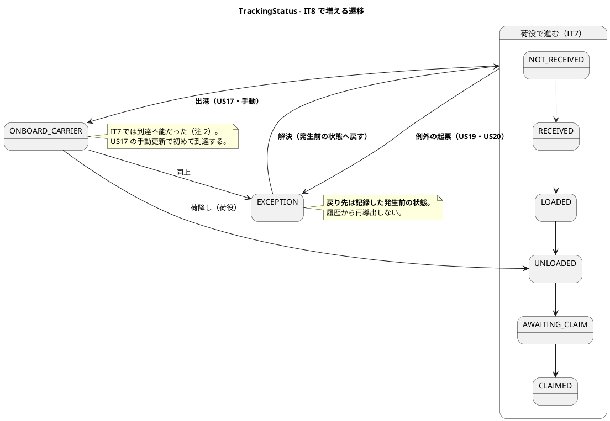
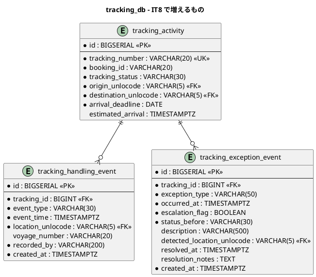
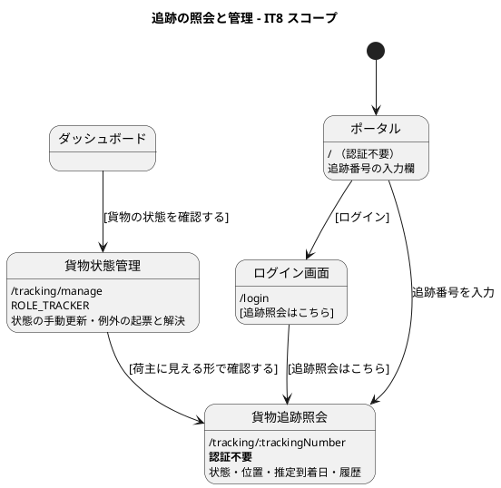

# イテレーション 8 計画

| 項目 | 内容 |
| :--- | :--- |
| イテレーション | IT8 |
| 期間 | 2026-08-24 〜 2026-09-06（2 週間） |
| 対象ストーリー | US17（貨物状態の手動更新）・US18（追跡情報の照会）・US19（遅延例外）・US20（破損・紛失例外） |
| 計画 SP | 9 |
| 局面 | **終盤（1 本目）／アウトサイドイン**（[開発戦略](development_strategy.md#終盤-アウトサイドインit8it12--release-10-後半20)） |
| 前提 | [IT7 完了報告書](iteration_report-7.md)・[IT7 ふりかえり](retrospective-7.md) |

## ゴール

**荷主が自分で貨物を追えるようになる。** 追跡番号を入れれば、ログインなしで現在の状態・位置・履歴・到着予定が見える。あわせて追跡管理者が、荷役では捕捉できない状態変化（出港・入港）を手で反映し、遅延・破損・紛失を例外として起票できるようになる。

**IT7 までは、追跡の状態を見られるのは DB とデモだけだった。**

### 成功基準

> **通知の「送信」は行いません。** メールの実体は入れず、**通知したという事実を記録し、荷主の画面で見える形**で代替します（US12・US15-5 と同じ形）。**代替であることを画面・マニュアル・完了報告書に明記します。**

| # | 基準 | 測り方 |
| :--- | :--- | :--- |
| 1 | **荷主がログインなしで追跡できる** | kind 統合環境で、荷役を記録 → 公開の追跡画面に**状態・位置・履歴・到着予定**が出るまでを 1 本で通す。ポータルとログイン画面の両方から辿れること |
| 2 | **例外が起票され、状態が戻せる** | 遅延・破損・紛失を起票すると状態が `EXCEPTION` になり、解決すると**例外発生前の状態に戻る**。「戻す」実装を消すと赤になること |
| 3 | **紛失だけが緊急として扱われる** | `LOST` で緊急フラグが立ち、他の種別では立たないことを対で固定する |
| 4 | **「〜しない」と書いた性質が、検査で固定されている**（[IT7 Try 1](retrospective-7.md)） | この IT で書いた否定形・保証形のコメントを数え、**同じ数の検査**があること。壊して赤を確認する |
| 5 | **値が層をまたいで生き延びる**（[IT7 Try 2](retrospective-7.md)） | 例外の緊急フラグ・解決の記録を、応答・イベント・画面のどこで潰しても赤になること |
| 6 | ドメイン層のカバレッジ 90% 以上 | 5 サービス + shared |

## 局面とアプローチ

**終盤の 1 本目（アウトサイドイン）。** [開発戦略](development_strategy.md)は終盤を「既存の集約・サービスを**業務シナリオ起点**で結合し、一気通貫を担保する」と定めている。IT8 で作るのは新しいドメインの塊ではなく、**現場の仕事が回る形への束ね直し**である。

受け入れテストから書く。デモ項目を先に E2E に翻訳し（Red）、画面と導線 → 既存サービスの拡張 → 新規ドメイン要素の順に埋める。

**[ADR-022](../adr/022-domain-event-contract.md) のイベント契約と [ADR-019](../adr/019-route-assignment-api.md) の ACL の型をそのまま写す。新しい結合方式を発明しない。** 発明が必要になったら ADR を起票してから実装する。

## 前イテレーションからの反映

### ふりかえりの Try（[retrospective-7.md](retrospective-7.md)）

| Try | 本 IT での落とし込み |
| :--- | :--- |
| 1. 「〜しない」と書いたコメントは、その場で壊して赤を確認する | **成功基準 4 に据えた**。IT7 は 3 件が「書いただけ」だった。**最も重い 1 件（追跡の巻き戻り）は、送り直す手段を同じ IT で自分が用意したために経路が実在した** |
| 2. 値が通る層を数え、端から端まで 1 本は通す | **成功基準 5 に据えた**。例外の緊急フラグは「表示のためだけに運ぶ値」で、IT7 の `offRoute` と同じ形 |
| 3. ADR のコンプライアンス表に「検査の場所」を書く | タスク 1.1・4.1 の完了条件。「〜を確かめる」ではなく「`XxxTest#yyy` が確かめる」と書く |
| 4. 画面を開いたロールが「何をできるか」を E2E で 1 本ずつ持つ | タスク 5.2。**IT7 は追跡管理者が `/handling` を開いても何もできなかった** |
| 5. 「たまに落ちる」を許さない | 常時。同じ失敗を 2 回見たら、そこで原因を追う |
| 6. 契約に「値の語彙」を含める | 返済枠 0.1。**3 本目のイベントが来る前**にやるのが最も安い |
| 7. レビューは 5 視点を独立に回す | クローズ時。IT7 は 3 視点が独立に同じ欠陥を指摘した |

### 引き継ぎ（返済枠・SP 対象外）

> **「余力次第」にしない。** IT7 は Day 1-3 に固めて 12 / 12 返せた。同じ形を続ける。

> **10 / 10 完了**（`d03fbedb8`・`74405f248`・`0b664ea44`）。0.11 は予告どおり行っていません。

| # | 内容 | 見積 | 由来 |
| :--- | :--- | :--- | :--- |
| 0.1 | **契約に値の語彙と交換機の引数を含める**。本番コードを契約から導く（パス・システム主体がリテラルのまま） | 6h | IT7 Try 6・レビュー #22・#23 |
| 0.2 | **認可を呼んでいることの検査**。利用者ヘッダを受け取るメソッドは必ず認可を呼ぶ | 4h | IT7 レビュー #24 |
| 0.3 | **`ONBOARD_CARRIER` / `EXCEPTION` の扱いを決める**。「未知の種別」と「到達不能な値」が同じ「何も起きない」に落ちる状態を解消する | 3h | IT7 レビュー・**US17 / US20 の前提** |
| 0.4 | `TrackingEventRoundTripTest` を契約ごとに割る（2 契約で 330 行。US17 で 3 契約目） | 2h | IT7 レビュー #27 |
| 0.5 | 種別の妥当性検査が 2 か所（入口とユースケース） | 2h | IT7 レビュー #16 |
| 0.6 | `CargoSnapshot` の正準コンストラクタが public で検査を素通りできる | 1h | IT7 レビュー #28 |
| 0.7 | `restore` が null を返す静的ファクトリ（呼び出し側から見えない） | 2h | IT7 レビュー #29 |
| 0.8 | 荷役の重複記録の検出 | 3h | IT7 レビュー #25 |
| 0.9 | 引取の確認ダイアログ（種別が残るため、別の貨物に「引取」のまま記録する事故） | 3h | IT7 レビュー #12 |
| 0.10 | `publishesExactlyOneKindOfEvent` を ArchUnit と併せて迂回できなくする | 2h | IT7 レビュー #30 |
| **小計** | | **28h** | |

> **0.11（作業者に利用者 ID が出る）は IT8 でも行いません。** 氏名を出すには authms への照会が要り、**サービス間の呼び出しが 1 本増えます**。表示のためだけに結合を増やす判断は、通知の宛先（荷主の連絡先）をどう引くかと合わせて決めるべきで、そちらは US19 の中で扱います。**落とすことをここに書きます**——書かないと「忘れていた」と読まれます。

### IT7 から「着手前に決めること」として引き継いだもの

[IT7 ふりかえり](retrospective-7.md)が挙げた 3 件。**Try と持ち越しは全件落とし込んだが、この 3 件は運用側の判断で、計画のタスクにならない。**

| # | 内容 | IT8 での扱い |
| :--- | :--- | :--- |
| 1 | 追跡管理者に人を割り当てるなら、IT8 完了まで荷役の履歴しか使えない | **IT8 で解消する。** `/tracking/manage` を実装し、ダッシュボードから未解決例外へ辿れるようにする（タスク 2.3・2.4） |
| 2 | **予定外の作業が業務として処理されない**（待ち行列は US28・IT10） | **IT8 で見え方が変わる。** 公開追跡が開くと、予定外のまま放置された貨物の状態を荷主が見る。**リスク 9 に挙げ、公開画面に何を出すかを [ADR-024] で決める**。待ち行列そのものは IT10 |
| 3 | 引取済の貨物が精算に乗らないまま溜まる（US23・IT12） | **IT8 では扱わない。** ただし [ADR-024]（決めること C）で `CargoDeliveredEvent` の置き場を決めるので、そのときに引取済の一覧が要る時期も合わせて記録する |

## 対象ストーリーと受入基準

### US17: 貨物状態を手動更新する（2 SP）

| # | 受入基準 | 本 IT での扱い |
| :--- | :--- | :--- |
| US17-1 | 追跡番号を指定して現在の貨物情報を確認できる | 実装 |
| US17-2 | 新しい状態・位置・日時を入力して追跡情報を更新できる | 実装。**戻る向きには更新できない**（[ADR-024] で決める。IT7 の巻き戻り対策と同じ規則） |
| US17-3 | 更新後、追跡イベントが履歴に記録される | 実装。**`tracking_handling_event` を新設**（IT7 まで履歴を持っていない） |
| US17-4 | 状態変更の種類に応じて荷主への通知が送信される | **代替**。通知の記録を残し、荷主の画面で見える形にする |

### US18: 追跡情報を照会する（3 SP）

| # | 受入基準 | 本 IT での扱い |
| :--- | :--- | :--- |
| US18-1 | 追跡番号を入力して貨物情報を照会できる | 実装 |
| US18-2 | 現在の状態・位置（港湾名）・推定到着日が表示される | 実装。**推定到着日の入手経路は [ADR-024] で決める**（trackingms は旅程を持っていない）。分からなければ「未定」と出す——0 や現在時刻で埋めない |
| US18-3 | 追跡イベント履歴が時系列で表示される | 実装。荷役の記録と手動更新の両方が並ぶ |
| US18-4 | 追跡番号が存在しない場合、「追跡番号が見つかりません」と表示される | 実装。**総当たりへの対策を [ADR-024] で決める**（認証が無い唯一の入口。番号は `TRK-yyyyMMdd-nnnn` で、日付が既知なら 4 桁しかない） |
| US18-5 | ログインなしでも追跡番号があれば照会できる | 実装。**ポータルとログイン画面の両方から辿れること**（IT7 の「認証不要の画面は入口も認証の外に置く」） |

### US19: 遅延例外を処理する（2 SP）

| # | 受入基準 | 本 IT での扱い |
| :--- | :--- | :--- |
| US19-1 | 追跡番号と例外種別「遅延」・発生状況を記録できる | 実装 |
| US19-2 | 記録後、貨物状態が「例外発生」に更新される | 実装 |
| US19-3 | 荷主に遅延発生の通知が送信される | **代替**（US17-4 と同じ） |
| US19-4 | 対応内容（**新しい到着予定日**・対応方針）を入力して荷主に対応報告を送信できる | 実装（記録まで）。**解決すると例外発生前の状態に戻る**。新しい到着予定日を持つ（注 7） |
| US19-5 | 例外対応履歴が記録される | 実装 |

### US20: 破損・紛失例外を処理する（2 SP）

| # | 受入基準 | 本 IT での扱い |
| :--- | :--- | :--- |
| US20-1 | 追跡番号と例外種別「破損」「紛失」・発生状況を記録できる | 実装。**荷役作業員にも開く**（US20 のアクターは「追跡管理者または荷役作業員」） |
| US20-2 | 記録後、貨物状態が「例外発生」に更新される | 実装（US19-2 と同じ） |
| US20-3 | 「紛失」は緊急フラグが立ち、管理職へ escalation 通知 | 実装（フラグと記録まで）。**通知の送信は代替** |
| US20-4 | 荷主に破損・紛失発生の通知が送信される | **代替** |
| US20-5 | 対応内容（補償方針等）を入力して荷主に報告を送信できる | 実装（記録まで） |

> **`MISROUTE`（誤配）と `CUSTOMS_HOLD`（税関保留）は IT8 では起票しません。** 前者は US28（IT10）、後者は US29（IT9）です。**列挙には値を持たせますが、起票する経路を作りません**——[ADR-024] に明記し、検査で固定します（[ADR-023](../adr/023-handling-activity-validation.md) 決定 5 と同じ形）。

## 設計

### ドメインモデル図（IT8 スコープ）

> **`TrackingActivityEvent` は IT8 で初めて作ります。** IT7 まで追跡は「いまの状態」しか持っておらず、**履歴がありません**。US18-3 が要求する時系列は、ここから作ります。

> **`TrackingLocation` は作りません。** 設計は BC 固有の位置情報型を挙げていますが、地点は共有カーネル（`Location`）で、trackingms はすでにそれを使っています。**いま型を増やす理由がありません**（注 3）。

### 状態遷移図（IT8 スコープ）

> **`UNKNOWN` は IT8 でも使いません。** 状態が読めない行のためのもので、業務の操作では到達しません。

### ER 図（IT8 スコープ）

> **`status_before` と `estimated_arrival` は[データモデル](../design/data-model.md)に無い列です**（注 1・注 4）。前者を持たないと解決時の復帰を履歴から再導出することになり、後者を持たないと推定到着日を毎回旅程から引き直すことになります（旅程は Booking Context にあり、ACL の往復が増えます）。**同じ変更でデータモデルに反映します。**

> **`recorded_by` も設計にありません**（注 5）。手動更新は「誰が変えたか」が分からないと監査に使えません。荷役の記録が `operator_name` を持つのと同じ理由です。

### 画面遷移図（IT8 スコープ）

> **認証不要の画面は、入口も認証の外に置きます。** ログイン画面とポータルの両方に導線が要ります（IT6 で学んだ形）。

## タスク

### 0. 返済枠（SP 対象外）

上の「引き継ぎ」表のとおり（0.1〜0.10・28h）。**Day 1-2 に置き、独立したコミットにする。**

**0.3（`ONBOARD_CARRIER` / `EXCEPTION` の扱い）は最初に行う。** US17 と US20 がこの 2 値に到達させるため、後回しにすると「未知の種別」と「到達不能な値」が混ざったまま実装することになる。

### 1. Phase 1: 業務シナリオを受け入れテストに翻訳する（1 SP 相当・12h）

| # | 内容 | 見積 | 完了条件 |
| :--- | :--- | :--- | :--- |
| 1.1 | **[ADR-024] を書く**（下の「決めること」9 項目） | 8h | [x] **完了**（`d648fb69d`）。**決定は 11 件**になった（起票できる種別・多重起票の扱いが加わった）。コンプライアンス表は検査の場所をメソッド名まで書いた |
| 1.2 | デモ項目 8 件を E2E に翻訳する（Red） | 4h | [x] **完了**（`6f734d13c`）。`e2e/tracking.spec.ts` の 10 件すべてが落ちることを確認した。**この赤は実装が済むまで push しない**——CI は E2E を回すため |

#### ADR-024 で決めること

**9 つある。番号は ADR 側で振り、計画からは名前で参照する**（IT7 の計画は番号を重複させた）。

| 決めること | なぜ先に決めるか |
| :--- | :--- |
| 手動更新の向き | 戻る向きを許すと、IT7 で塞いだ巻き戻りが手動経路から再発する |
| 例外の起票と解決（発生前状態の持ち方） | 履歴から再導出すると、ユニット緑のまま誤復帰する |
| 推定到着日の入手経路 | **trackingms は旅程を持っていない**（後述）。ここが最も「新しい結合方式の発明」が起きやすい |
| 公開照会が返す項目と、総当たりへの対策 | 認証の外にある唯一の業務経路 |
| 照会ログ | UC15 の最低保証。総当たりを検知する材料でもある |
| 通知の代替と、Release 0.2 の「メール無効化」制約の畳み方 | 3 ストーリーの受入基準にまたがる |
| 起票しない種別（`MISROUTE` / `CUSTOMS_HOLD`）と、画面での見せ方 | 一覧に行だけ出て押せない形を作らない |
| **`TrackingExceptionDetectedEvent` を発行するか** | 発行するなら 3 本目の契約。**発行しないならそれを検査に落とす**（[ADR-022](../adr/022-domain-event-contract.md) 決定 1 と同じ形） |
| **`ROLE_SHIPPER` への予約参照開放**（[ADR-008](../adr/008-no-user-shipper-link-in-it2.md) が US18 で約束） | 後述。**US18 の受入基準だけでは果たせない** |

### 2. Phase 2: 画面と導線（2 SP 相当・20h）

**アウトサイドインなので画面を先に作る。** モックに対して動く形をまず立て、そのニーズから API を決める。

| # | 内容 | 見積 | 完了条件 |
| :--- | :--- | :--- | :--- |
| 2.1 | `/tracking/:trackingNumber`（公開）とポータルの入力欄 | 6h | **ログイン画面とポータルの両方から辿れる**。見つからないときの文言 |
| 2.2 | `/tracking`（番号なしの入口）の扱いを決めて実装する | 3h | `ui_design.md` は全ロールに開く導線として定義している。**`navigation.ts` は `available: false`**。実装するか、`/tracking/:trackingNumber` へ寄せるかを決める |
| 2.3 | `/tracking/manage`（手動更新・例外の起票と解決） | 7h | **ロールごとに何ができるかを E2E で 1 本ずつ**（Try 4） |
| 2.4 | **未解決例外の件数と、そこから一覧への遷移**（横断規約） | 2h | [リリース計画の「状態軸の到達性」](release_plan.md)。**件数を出すだけで対象へ到達できない実装は完了としない** |
| 2.5 | **ナビゲーションの 4 点一致**。`ui_design.md`・`navigation.ts`・`dashboard-panels.ts`・`navigation.test.ts` | 2h | 追跡管理者のダッシュボードが「準備中」だけにならないこと |

### 3. Phase 3: 既存サービスの拡張（2 SP 相当・18h）

| # | 内容 | 見積 | 完了条件 |
| :--- | :--- | :--- | :--- |
| 3.1 | `GET /api/v1/public/tracking/{trackingNumber}`（**認証不要**） | 5h | [ADR-007] のフィルタから除外する唯一の業務経路。**返さない項目**を検査で固定する |
| 3.2 | `PUT /api/v1/tracking/{trackingNumber}/status`（US17） | 4h | 認可は**入力検証より先**。パスは[アーキテクチャ設計](../design/architecture_backend.md)に合わせる |
| 3.3 | `POST .../exceptions` / `PUT .../exceptions/{id}/resolve` | 5h | US20-1 は `ROLE_HANDLER` にも開く（US20 のアクターは 2 つ） |
| 3.4 | 照会ログ（UC15・UC14 の最低保証） | 4h | 誰が・いつ・どの番号を照会したか。**総当たりの検知材料になる** |

### 4. Phase 4: 新規ドメイン要素（3 SP 相当・30h）

| # | 内容 | 見積 | 完了条件 |
| :--- | :--- | :--- | :--- |
| 4.1 | `TrackingActivityEvent`（履歴）と `tracking_handling_event` | 6h | 荷役のイベントを受けたときにも履歴が積まれる。**IT7 の購読経路に足す** |
| 4.2 | 手動更新（US17-2・US17-3） | 5h | **戻る向きには更新できない**。規則は `canAdvanceTo` を使い、手動用に書き直さない |
| 4.3 | `ExceptionType` と、種別ごとの要件（緊急フラグ） | 4h | 5 行すべてにテスト。**種別を 1 つ足したら赤**（IT7 の `HandlingType` と同じ形） |
| 4.4 | 例外の起票と解決（US19・US20） | 8h | **発生前の状態を列に持つ**。解決で戻ることを固定し、**戻す実装を消すと赤** |
| 4.5 | `tracking_exception_event` と永続化 | 4h | 読み戻しで**全項目が戻る**（集約ごと比べる）。**US19-4 の「新しい到着予定日」を持つ** |
| 4.6 | 推定到着日（US18-2）。**入手経路は [ADR-024] の決定に従う** | 3h | 旅程が無ければ「未定」——0 や現在時刻で埋めない |

### 5. Phase 5: 通知の代替（0.5 SP 相当・6h）

| # | 内容 | 見積 | 完了条件 |
| :--- | :--- | :--- | :--- |
| 5.1 | 通知の記録（US17-4・US19-3・US20-3/4） | 4h | 荷主の画面で見せる。**送っていないことを画面に書く** |
| 5.2 | Release 0.2 の「メール無効化」制約の畳み方を記録する | 2h | 解除するのか据え置くのかを、リリース計画にも反映する |

### 6. Phase 6: 結合の検査（8h）

| # | 内容 | 見積 | 完了条件 |
| :--- | :--- | :--- | :--- |
| 6.1 | **kind 統合環境で成功基準 1 を通す**。**先にイメージを作り直す** | 5h | 荷役 → 公開照会が 1 本で通る |
| 6.2 | E2E（モック + 実バックエンド）。**「条件が揃わなければスキップ」を作らない** | 3h | 前提は種データで用意する |

### 見積もり合計

| 区分 | 見積 |
| :--- | :--- |
| 0. 返済枠 | 28h |
| 1. Phase 1 受け入れテストと ADR | 12h |
| 2. Phase 2 画面と導線 | 20h |
| 3. Phase 3 既存サービスの拡張 | 18h |
| 4. Phase 4 新規ドメイン要素 | 30h |
| 5. Phase 5 通知の代替 | 6h |
| 6. Phase 6 結合の検査 | 8h |
| 7. マニュアル | 10h |
| 8. レビュー手直し | 12h |
| **合計** | **144h** |

> **IT7 は 147h の見積もりで 10 SP、IT8 は 144h で 9 SP です。**
>
> **新しいサービスを作らないぶんは減りますが、画面が 3 つ増えます**（公開照会・状態管理・番号なしの入口）。IT7 は handlingms をゼロから作った一方、画面は 1 つでした。この読みが外れたときのために、**落とす順序を先に決めます**。
>
> | 順 | 落とすもの | 見積 | 落としてよい理由 |
> | :--- | :--- | :--- | :--- |
> | 1 | 0.9 引取の確認ダイアログ | 3h | 入れ方を誤ると他の種別でも押す癖がつく。急いで入れるより次 IT で設計する |
> | 2 | 0.8 荷役の重複記録の検出 | 3h | いま重複しても業務が止まる形ではない |
> | 3 | 0.7 `restore` の null | 2h | 呼び出し側は現状すべて正しく扱っている |
> | 4 | 2.2 `/tracking`（番号なしの入口） | 3h | 追跡番号を持つ人は `/tracking/:trackingNumber` へ直接来られる。**落とすなら `navigation.ts` を `available: false` のままにする**（メニューに出して 404 にしない） |
>
> **Phase 4（例外の起票と解決）・3.1（公開照会）・2.4（件数から一覧への到達）・0.3（到達不能な値の扱い）は削りません。**
>
> 0.3 を削ると、US17 と US20 が到達させる 2 値の扱いが決まらないまま実装に入ります。2.4 は[リリース計画の横断規約](release_plan.md)で「件数を出すだけで対象へ到達できない実装は完了としない」と定めたものです。

## スケジュール

### Week 1（Day 1-5）

| 日 | 内容 | 区分 |
| :--- | :--- | :--- |
| Day 1 | **0.3 到達不能な値の扱い**、0.1 契約の語彙と交換機の引数、0.2 認可の検査 | 返済枠 |
| Day 2 | 0.4〜0.10 | 返済枠 |
| Day 3 | 1.1 ADR-024（決めること 9 項目）、1.2 受け入れテスト（Red） | Phase 1 |
| Day 4 | 2.1 公開照会の画面、2.2 `/tracking` の扱い | Phase 2 |
| Day 5 | 2.3 状態管理の画面、2.4 件数から一覧、2.5 ナビの 4 点一致 | Phase 2 |

### Week 2（Day 6-10）

| 日 | 内容 | 区分 |
| :--- | :--- | :--- |
| Day 6 | 3.1 公開照会 API、3.2 手動更新 API | Phase 3 |
| Day 7 | 3.3 例外の API、3.4 照会ログ | Phase 3 |
| Day 8 | 4.1 履歴、4.2 手動更新、4.3 例外の種別 | Phase 4 |
| Day 9 | 4.4 起票と解決、4.5 永続化、4.6 推定到着日 | Phase 4 |
| Day 10 | 5.1-5.2 通知の代替、6.1 kind、6.2 E2E、7.1-7.3 マニュアル | 仕上げ |

> **画面を先に作るのは、アウトサイドインだからです。** モックに対して動く形をまず立て、そのニーズから API を決めます。IT7（中盤・インサイドアウト）とは順序が逆です。

## リスク

| # | リスク | 影響 | 対応 |
| :--- | :--- | :--- | :--- |
| 1 | **認証の外に業務データを出す**（US18） | 追跡番号を総当たりされると、他人の貨物の状態・港・日程が読める | [ADR-024] 決定 4 で対策を決める。**返す項目を絞る**（荷主名・金額・予約番号は返さない）。番号は `TRK-yyyyMMdd-nnnn` で日付が既知なら 4 桁しかない点を踏まえる |
| 2 | **IT7 の状態の誤りが荷主に見える** | これまで DB とデモでしか見えなかったものが外から見える | 成功基準 1 を kind で通す。**IT7 で入れた巻き戻り対策が効いていること**を、公開画面から確かめる |
| 3 | **例外の解決で戻る先を、履歴から再導出したくなる** | 発生前状態を持たないと、ユニット緑のまま誤復帰する | 列に持つ（注 1）。**再導出する実装に変えると赤になる**検査を置く |
| 4 | **通知が 3 ストーリーの受入基準にまたがる** | 代替の範囲がぶれる | [ADR-024] 決定 5 で一度に決める。**送らないことを画面・マニュアル・報告書に明記** |
| 5 | **`EXCEPTION` が「いまの状態」を上書きする** | 例外中の貨物が、どこまで進んでいたか分からなくなる | 発生前状態を持つ（注 1）。公開画面にも「例外発生（受領済みの貨物）」の形で出す |
| 6 | 追跡管理者の画面が初めて実装される | 準備中だったものが一度に増える | Phase 5 を 2 日取る。**ロールごとに何ができるかを E2E で 1 本ずつ**（Try 4） |
| 7 | US20 のアクターが 2 つ（追跡管理者・荷役作業員） | 認可の書き分けを間違えやすい | 0.2（認可の検査）を Day 1 に置く |
| 8 | **推定到着日のために新しい結合を発明する** | 終盤の方針（新しい結合方式を発明しない）に反する | [ADR-024]（決めること A）で向きとポート名まで決めてから実装する |
| 9 | **予定外の荷役が、初めて荷主から見える** | IT7 で記録した `offRoute` の貨物は、待ち行列（US28・IT10）が無いまま放置されている。公開画面が開くと、その状態を荷主が見る | 公開画面に何をどう出すかを [ADR-024]（返す項目）で決める。**IT7 のふりかえりで「運用ルールで決める」とした宿題**（下の引き継ぎ） |

## 設計への反映が必要な箇所（注）

**整合性検証で 12 件、着手時にさらに 1 件見つかりました（計 13 件）。** うち 4 件は「計画を設計に合わせる」もので、すでに直しています（API パス・タスクの並び・件数からの到達・US19-4 の項目）。

| # | 箇所 | 内容 |
| :--- | :--- | :--- |
| 1 | `data-model.md` / `domain-model.md` | **例外の発生前状態を持つ列が無い**（`status_before`）。US19-4 の「例外発生前の状態に復帰する」を履歴から再導出すると、発生前状態を永続化していない形になり、ユニット緑のまま誤復帰する |
| 2 | `data-model.md` | **`transport_status` が IT7 の改名に追随していない。** 実装は `tracking_status`（`V3__rename_transport_status.sql`）。**IT7 で直し漏れた**——実装と設計の同時反映を掲げながら、この 1 箇所が残っていた |
| 3 | `ui_design.md` | **状態バッジの定義が `TransportStatus` のまま**で、値も `IN_TRANSIT` / `DELIVERED` / `MISROUTED`。実装の `ONBOARD_CARRIER` / `CLAIMED` / `EXCEPTION` / `UNKNOWN` が無い。**IT8 は公開画面で状態を出すので必須** |
| 4 | `domain-model.md` | **`TrackingLocation` を作らない**（注のとおり）。**既存の記述（要素表・クラス図の 5 箇所）を消す**。宣言だけして設計を直さないと正典ドリフトになる |
| 5 | `domain-model.md` | 集約のメソッド名が設計（`addEvent` / `addException`）と計画（`updateManually` / `raiseException`）で違う。**どちらに寄せるかを ADR-024 で決め、同じ変更で設計を直す** |
| 6 | `data-model.md` | `tracking_activity` に `estimated_arrival`、`tracking_handling_event` に `recorded_by`、3 テーブルに `created_at` を足す |
| 7 | `data-model.md` / `domain-model.md` | **US19-4 の「新しい到着予定日」を持つ項目が無い**。受入基準にあり、`ui_design.md` のワイヤーも表示する前提 |
| 8 | `architecture_backend.md` | 公開追跡の API を一覧に追加。**認証不要であることと、返さない項目**を書く |
| 9 | `ui_design.md` | 貨物状態管理・貨物追跡照会の項目表を**差分更新**する（すでに表はある。追加ではない） |
| 10 | `ui_design.md` | 権限マトリクスの `/tracking/manage` が `ROLE_TRACKER` のみ。**US20-1 は荷役作業員にも開く** |
| 11 | `test_strategy.md` | 公開エンドポイントの検査観点（総当たり・返さない項目・照会ログ）を追加する |
| 13 | `domain-model.md` / `ui_design.md` / [ADR-023](../adr/023-handling-activity-validation.md) / IT7 の記録 | **精算のストーリー番号が誤り。** 5 箇所が精算を `US26` と書いていたが、[リリース計画](release_plan.md)では US26 は「システムにログインする」（IT2 実装済み）で、精算は **US23**。`ui_design.md` は予約金額・実料金の入る時期を `US18` と書いていたが、料金算出は **US21・US22（IT11）**。US19 を「通知基盤」と呼んでいた誤りと同じ形で、**正典を見ずに記憶で番号を書いた**もの。着手時に修正済み |
| 12 | `domain-model.md` のイベント一覧 | `TrackingExceptionDetectedEvent` の扱い。**発行するなら 3 本目の契約、しないなら検査に落とす** |

### 計画では決められないこと（ADR-024 で決める）

| # | 内容 | なぜ計画で決めないか |
| :--- | :--- | :--- |
| A | **推定到着日の入手経路。** trackingms は旅程を持たず、`CargoRoutedEvent` も発行されていない（[ADR-022](../adr/022-domain-event-contract.md) 決定 1）。**イベントを足すか、ACL を trackingms → bookingms に引くか** | 「終盤で新しい結合方式を発明しない」に照らすと、**ここが最も発明の起きやすい箇所**。ADR で向きとポート名まで決める |
| B | **`ROLE_SHIPPER` への予約参照開放。** [ADR-008](../adr/008-no-user-shipper-link-in-it2.md) は「紐付けを設計する US18（IT8）まで開かない。US18 で紐付けと同時に広げ直す」と約束している | **US18 の受入基準だけでは果たせない。** US18 は「ログインなしで追跡番号から照会する」ことであり、利用者と荷主を結ぶキーは要らない。**約束したストーリーと、約束の中身が噛み合っていない**（US19 を「通知基盤」と呼んでいた誤りと同じ形）。開くのか、別ストーリーへ送るのかを決める |
| C | **`CargoDeliveredEvent` の置き場。** [リリース計画](release_plan.md)は US17 の担務を「**DELIVERED 判定と発行の置き場**（実装は US21）」と定義している | 置き場だけ作るのか、IT8 では作らないのかが未決。**作らないなら検査に落とす**（[ADR-023](../adr/023-handling-activity-validation.md) 決定 5 と同じ形） |
| D | **Release 0.2 の「メール無効化」制約の畳み方。** 「荷主向けの追跡番号メール通知は US18 が出るまで無効化する」 | US18 は IT8。通知を代替のまま据え置くなら、制約の書き方も直す |

## デモ項目

イテレーションの終わりに、この順で動かして見せます。**デモの前にイメージを作り直します。**

| # | 見せるもの | 役割 | 対応 |
| :--- | :--- | :--- | :--- |
| 1 | 荷役を記録し、**荷主がログインなしで**状態・位置・履歴を見る | 荷役作業員 → 荷主 | US15・US18 |
| 2 | 存在しない追跡番号で「見つかりません」と出る | 荷主 | US18-4 |
| 3 | 追跡管理者が**出港**を手で反映し、公開画面に出ることを示す | 追跡管理者 | US17 |
| 4 | 戻る向きの手動更新が断られることを示す | 追跡管理者 | US17-2 |
| 5 | **遅延**を起票し、状態が「例外発生」になることを示す | 追跡管理者 | US19-1・US19-2 |
| 6 | 解決すると**発生前の状態に戻る**ことを示す | 追跡管理者 | US19-4 |
| 7 | **紛失**を起票し、緊急フラグが立つことを示す（破損では立たない） | 追跡管理者 | US20-3 |
| 8 | 通知が**送られていない**ことを画面が言っていることを示す | 荷主 | US17-4・US19-3・US20-4 |

## DoD（完了の定義）

- [ ] 対象ストーリーの受入基準を満たす（**スコープ外にしたものは理由とともに完了報告書へ**）。US17-4・US19-3・US20-3/4 の通知は代替
- [ ] 成功基準 1〜6 を満たす（成功基準の表に達成の根拠を記載）
- [ ] 全テストが緑（単体・統合・契約・E2E）。**CI のジョブすべて success**
- [ ] **`TZ=UTC` でも緑**
- [ ] **ドメイン層のカバレッジが 90% 以上**
- [ ] SonarQube Quality Gate が PASS（**両プロジェクト**）
- [ ] **決定の数だけ検査があり、検査の場所が ADR に書かれている**（Try 3）
- [ ] **「〜しない」と書いたコメントの数だけ、検査がある**（Try 1・成功基準 4）
- [ ] **値が層をまたいで生き延びる**（Try 2・成功基準 5）
- [ ] **壊して赤を確認した**（手動更新の向き・例外の復帰・緊急フラグ・起票しない種別・公開の返さない項目）
- [ ] **画面を開いたロールが「何をできるか」を E2E で 1 本ずつ持つ**（Try 4）
- [ ] **同じ失敗を 2 回見たら原因を追った**（Try 5。再実行で流していない）
- [ ] **サービス間の呼び出しを実際に 1 往復させた**
- [ ] **実環境で確かめる前にイメージを作り直した**
- [ ] **ナビゲーションの 4 点が一致している**。ロール別・状態別の到達性を確かめた
- [ ] **認証不要の画面は、入口も認証の外に置いた**（ポータル・ログイン画面）
- [ ] **件数から対象一覧へ辿れる**（[横断規約](release_plan.md)。件数を出すだけは完了としない）
- [ ] **認証の外へ出す項目を絞り、返さないことを検査で固定した**
- [ ] **照会ログが残る**（UC14・UC15 の最低保証）
- [ ] **デモ項目 8 件をこの順で通した**
- [ ] **JIG / jig-erd の出力を再生成した**
- [ ] ユーザーマニュアルを更新し、**キャプチャを再生成して目視した**
- [ ] **「設計への反映が必要な箇所（注）」12 件をすべて反映した**
- [ ] **[ADR-024] で「決めること」A〜D に答えを出した**
- [ ] `docs/index.md` / `development/index.md` / `mkdocs.yml` を同期した

## 進捗

| 区分 | 状態 |
| :--- | :--- |
| 返済枠（0.1〜0.10） | 未着手 |
| Phase 1 受け入れテストと ADR | **完了** |
| Phase 2 画面と導線 | **完了** |
| Phase 3 既存サービスの拡張 | **完了** |
| Phase 4 新規ドメイン要素 | **4.6（推定到着日・`CargoRoutedEvent`）を残して完了** |
| Phase 5 通知の代替 | **完了**（5.1 は Phase 3 と同じ変更で入った。5.2 は [ADR-024] 決定 9 とリリース計画に反映済み） |
| Phase 6 結合の検査 | 未着手 |
| ユーザーマニュアル | 未着手 |
| レビュー手直しの枠 | クローズ時（`developing-review`） |
