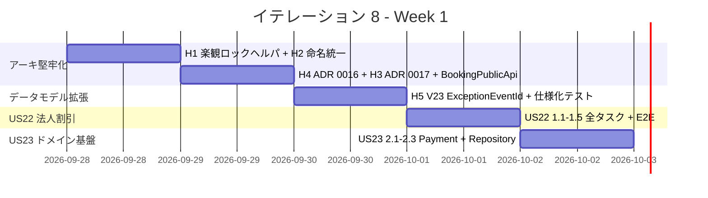
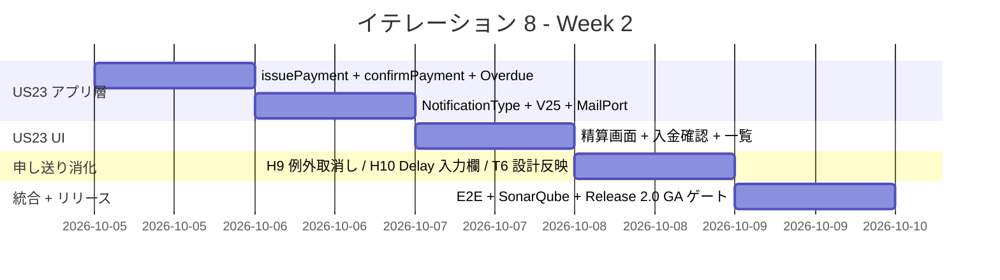
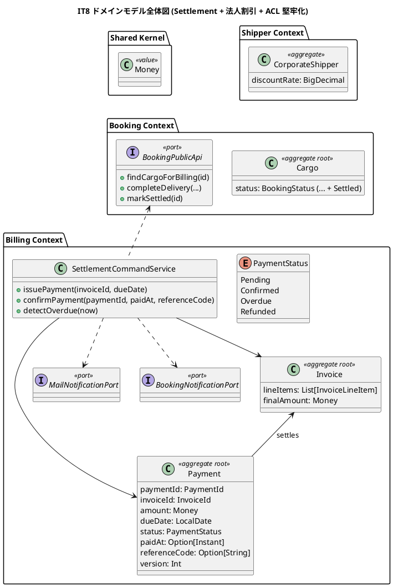
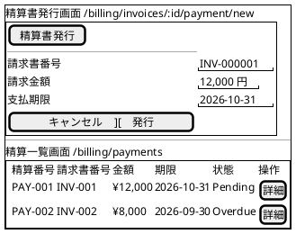
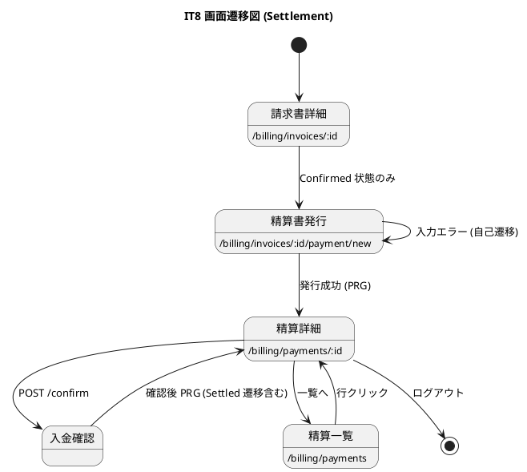

# イテレーション 8 計画

## 概要

| 項目 | 内容 |
|------|------|
| **イテレーション** | IT8 |
| **期間** | 2026-09-28 〜 2026-10-11（Week 17-18、2 週間） |
| **ゴール** | US22 法人割引 + US23 精算（計 9 SP）を完成、Release 2.0 GA に到達、IT7 申し送り（Try 8 件 + Review 高優先 12 件）の高優先 0.x 12 件を消化、Phase 4 全完了 |
| **目標 SP** | 9 |

---

## ゴール

### イテレーション終了時の達成状態

1. **US22 法人割引適用**: 請求書発行時に法人荷主の契約割引率を自動取得・適用し、`Invoice.lineItems` に `Discount` カテゴリ明細を追加できる。請求書詳細画面で割引内訳が表示される。
2. **US23 精算処理**: 請求書から精算書発行 → 入金確認 → 精算完了の業務フローを完成し、`Payment` 集約・`payment` テーブル・通知（PaymentRequested / PaymentConfirmed / OverdueAlerted）を実装する。
3. **IT7 申し送り 12 件消化**: H1 楽観ロック共通化、H2 Lost/Loss 命名統一、H3 BookingPublicApi ACL、H4 ADR 0016 (tx 境界)、H5 TrackingExceptionEvent PK ID 付与、H7 ExceptionType 同値テスト、H9 解決済例外取消し、H10 newEstimatedArrival 仮値解消、H11 README 更新、H12 recordException パターン、T3 routeDeviation 自動判定、T6 設計ドキュメント反映。
4. **Release 2.0 GA リリースゲート**: 全ストーリー (US01-US26、26 件) 完了、Unit テスト 400+ 件 PASS、Playwright E2E 40+ 件 PASS、SonarQube Quality Gate 通過、ADR 0014-0017 承認、設計ドキュメント反映完了。

### 成功基準

- [ ] US22 + US23 全タスク完了（受入基準 100% PASS）
- [ ] 0.x 申し送り 12 件中 12 件完了（高優先度）
- [ ] ベロシティ実績 9 SP 達成（IT4-IT7 平均 11.5 SP に対し 9 SP）
- [ ] Unit テスト全 PASS、coverage 80% 以上維持、ArchUnit 5 ルール pass
- [ ] Flyway V23-V25 適用（PaymentId / payment テーブル / TrackingExceptionEvent.id）
- [ ] ADR 0016 (HandlingOrchestrator tx 境界) / ADR 0017 (BookingPublicApi) 承認
- [ ] Release 2.0 GA リリースゲート全件 PASS
- [ ] Playwright E2E US22 / US23 各 1-2 シナリオ追加（4 件）
- [ ] SonarQube 実機再スキャン Quality Gate 通過

---

## ユーザーストーリー

### 対象ストーリー

| ID | ユーザーストーリー | SP | 優先度 |
|----|-------------------|----|----|
| US22 | 法人割引を適用する | 3 | 中 |
| US23 | 精算を処理する | 6 | 必須 |
| **合計** | | **9** | |

### ストーリー詳細

#### US22: 法人割引を適用する

**ストーリー**:
> 経理担当者として、法人荷主の場合に、契約割引率を基本料金に自動適用して割引後の請求金額を確定したい。なぜなら、法人契約条件に基づく正確な割引を自動化し、手計算ミスを防ぐからだ。

**対応 UC**: UC17

**受入基準**:

1. 荷主種別が「法人」の場合、料金算出時に契約割引率が自動的に取得・表示される
2. 割引率（0〜30%）が基本料金に適用され、割引後の金額が表示される
3. 個人荷主の場合は割引が適用されない
4. 割引率は `Shipper.discountRate` (法人荷主の契約フィールド) から自動取得される
5. `Invoice.lineItems` に `LineItemCategory.Discount` 明細が `-amount` として追加される
6. 請求書詳細画面で「割引適用前金額」「割引率」「割引額」「割引適用後金額」が表示される

#### US23: 精算を処理する

**ストーリー**:
> 経理担当者として、確定した輸送料金をもとに精算書を発行し、荷主への通知・入金確認・精算完了処理を行いたい。なぜなら、精算業務を一元管理し、入金状況を追跡して確実に精算を完了できるからだ。

**対応 UC**: UC18

**受入基準**:

1. 「確定」状態の請求書から精算書（請求番号・請求金額・支払い期限）を発行できる
2. 精算書が荷主にメール通知される（PaymentRequested 通知）
3. 決済機関との連携により入金確認ができる（IT8 はモック実装、IT9 で外部連携拡張可）
4. 入金確認後、精算状態が「精算済」に更新され予約状態も `Settled` になる
5. 支払い期限超過時、経理担当者に未払い通知が送信される（OverdueAlerted 通知）

### タスク

#### 0. IT7 申し送り（Review 高優先 12 件中 12 件 + Try 2 件）

| # | タスク | 見積もり | 状態 |
|---|--------|---------|------|
| 0.1 | 楽観ロック try/catch を `withOptimisticLock[A](label)` ヘルパに抽出（H1 / TrackingCommandService 3 箇所 + 他コマンドサービス候補） | 3h | [ ] |
| 0.2 | ExceptionType.Lost / NotificationType.LossEscalated / escalateLoss の命名統一（H2、ユビキタス言語注記 or 改名） | 2h | [ ] |
| 0.3 | ADR 0017 起票「Booking 公開 Port (BookingPublicApi) を切る」+ `BookingPublicApi` trait 新設、`BookingAdapter` を Port 経由に変更（H3） | 5h | [ ] |
| 0.4 | ADR 0016 起票「HandlingOrchestrator のトランザクション境界（単一 DB.localTx vs Outbox/Domain Events）」+ 採用方針決定（H4 / T2） | 4h | [ ] |
| 0.5 | Flyway V23: `tracking_exception_event` に `id BIGINT AUTO_INCREMENT PK` 追加 + `TrackingExceptionEvent` に `id: Option[Long]` を追加、`updateExceptionResolution` を PK 直接更新に変更（H5 / T8） | 4h | [ ] |
| 0.6 | `TrackingExceptionSpec` に 同値クラス代表値テスト追加（CustomsHold → InException / Damage デフォルト escalationFlag=false / 解決済再解決 AlreadyResolved or 上書き仕様化）（H7 / M6） | 3h | [ ] |
| 0.7 | 追跡詳細画面に「対応取消し」「補足コメント追記」動線を追加 + Controller `cancelExceptionResolution` / `appendResolutionComment` アクション（H9 / 業務代表者指摘） | 5h | [ ] |
| 0.8 | 例外記録モーダルに Delay 選択時のみ「新到着予定日 datetime-local + 対応方針 select (定型 4 種) + 詳細理由 textarea」を JS 表示制御で追加。`logDelayNotification` を意味ある値に置換（H10 / T7 / P8） | 4h | [ ] |
| 0.9 | トップレベル README.md に IT2 以降の Phase 進捗 + Release マイルストーン反映（H11 / 設計ドキュメントへのリンク委譲） | 2h | [ ] |
| 0.10 | `recordException` 戻り値の `: @unchecked` パターン補正 + EitherValues 移行（H12 / TrackingCommandServiceSpec） | 2h | [ ] |
| 0.11 | `HandlingCargoQueryPort` (handling 用 ACL Port) + `BookingCargoForHandlingAdapter` 新設、`HandlingOrchestrator.register` で `Itinerary.isOnRoute` 経由 routeDeviation 自動判定 + ユニットテスト 3 件追加（T3 / 0.14 持ち越し回収） | 5h | [ ] |
| 0.12 | 設計ドキュメント反映（T6 / docs/design/data-model.md + domain-model.md + ui_design.md）: V18-V22 + TrackingExceptionEvent + ItineraryLeg + InvoiceLineItem + RecipientConfirmationType + 例外記録 UI を正式反映 | 5h | [ ] |

**小計**: 44h

#### 1. US22 法人割引適用（3 SP）

| # | タスク | 見積もり | 状態 |
|---|--------|---------|------|
| 1.1 | `BillingCargoSnapshot` に `corporateDiscountRate: Option[BigDecimal]` を追加、`BookingCargoQueryAdapter` で `Shipper.discountRate` から取得（CorporateShipper のみ） | 3h | [ ] |
| 1.2 | `BillingCommandService.generate` で snapshot から DiscountRate を取り `Invoice.issue` に渡す（command.discountRate より優先、UI 入力なし） | 2h | [ ] |
| 1.3 | `Invoice.lineItems` に `LineItemCategory.Discount` 明細を `name="法人契約割引 (XX%)"`、`amount = -baseAmount × discountRate` で追加 | 2h | [ ] |
| 1.4 | `billing/detail.scala.html` を拡張し「割引適用前金額」「割引率」「割引額」「割引適用後金額」を明示表示 | 2h | [ ] |
| 1.5 | BillingCommandServiceSpec / InvoiceSpec に法人割引適用シナリオ 3 件追加（割引 0% / 15% / 30%）、Playwright E2E 1 件追加 | 4h | [ ] |

**小計**: 13h

#### 2. US23 精算処理（6 SP）

| # | タスク | 見積もり | 状態 |
|---|--------|---------|------|
| 2.1 | Payment 集約新設: `Payment(paymentId: PaymentId, invoiceId, amount: Money, dueDate, status: PaymentStatus, paidAt: Option[Instant], referenceCode: Option[String], version: Int)` + `PaymentStatus` enum (Pending / Confirmed / Overdue / Refunded) + `Payment.Snapshot` (ADR 0014) | 4h | [ ] |
| 2.2 | Flyway V24: `payment` テーブル (V17 で先行作成済、必要なら ALTER で `due_date` / `reference_code` / `version` 補正) + sequence 確認 | 2h | [ ] |
| 2.3 | `PaymentRepository` trait + `ScalikeJdbcPaymentRepository`（楽観ロック / withOptimisticLock 適用） | 4h | [ ] |
| 2.4 | `SettlementCommandService.issuePayment(invoiceId, dueDate)`: Confirmed Invoice → Payment 発行 + 荷主メール送信ポート連携 + PaymentRequested 通知ログ | 4h | [ ] |
| 2.5 | `SettlementCommandService.confirmPayment(paymentId, paidAt, referenceCode)`: 入金確認 → Payment.Confirmed + Cargo.Settled 遷移 + PaymentConfirmed 通知 | 3h | [ ] |
| 2.6 | `SettlementCommandService.detectOverdue(now)` (Cron スケジューラ想定、IT8 はバッチ未着手で API のみ): 期限超過 Payment を Overdue 化 + OverdueAlerted 通知 | 3h | [ ] |
| 2.7 | NotificationType に PaymentRequested / PaymentConfirmed / OverdueAlerted 追加、ペイロード + JSON + Flyway V25 (CHECK 拡張) | 3h | [ ] |
| 2.8 | 精算管理画面: `/billing/invoices/:id/payment/new` (発行) / `/billing/payments` (一覧) / `/billing/payments/:id` (詳細) / `/billing/payments/:id/confirm` (入金確認) | 6h | [ ] |
| 2.9 | `MailNotificationPort` (handling と同じ ACL パターン) + `MailNotificationAdapter` (Pekko Mail or print logger)、ADR 0018 候補 | 3h | [ ] |
| 2.10 | SettlementCommandServiceSpec / PaymentSpec / RepositoryIT 計 8 件、Playwright E2E 3 件 (発行 / 入金 / 期限超過) | 6h | [ ] |

**小計**: 38h

#### タスク合計

| カテゴリ | SP | 理想時間 |
|---------|----|----|
| IT7 申し送り（0.x） | - | 44h |
| US22 法人割引 | 3 | 13h |
| US23 精算 | 6 | 38h |
| **合計** | **9** | **95h** |

**1 SP あたり**: 約 10.6h（IT7 申し送り含む / 機能タスクのみなら 5.7h）
**進捗率**: 0% (0/9 SP)

> **IT8 スコープ外で IT9 / Phase 5 へ申し送り**:
>
> - US10 経路条件再算出 (IT9 予備、3 SP)
> - 入金外部 API 連携 (現状 SettlementCommandService.confirmPayment 手動入力、IT9 で決済機関ゲートウェイ抽象化)
> - OverdueAlerted バッチスケジューラ (Pekko Scheduler / Cron 設定、IT9)
> - SonarQube 実機再スキャン (T5、IT8 Definition of Done で実行)
> - Playwright E2E US19/US20 4 シナリオ (T4、IT8 Definition of Done で追加)
> - L1-L15 低優先指摘 (IT9 以降または恒久バックログ)

---

## スケジュール

### Week 1（Day 1-5）



| 日 | タスク |
|----|--------|
| Day 1 | 0.1 withOptimisticLock 抽出 / 0.2 Lost/Loss 命名統一 / 0.10 EitherValues 移行 |
| Day 2 | 0.3 ADR 0017 BookingPublicApi / 0.4 ADR 0016 tx 境界 / 0.9 README 更新 |
| Day 3 | 0.5 V23 TrackingExceptionEvent.id / 0.6 同値クラステスト / 0.11 routeDeviation 自動判定 |
| Day 4 | US22 1.1-1.5 全タスク (法人割引 3 SP) |
| Day 5 | US23 2.1 Payment 集約 + Snapshot / 2.2 V24 / 2.3 Repository |

### Week 2（Day 6-10）



| 日 | タスク |
|----|--------|
| Day 6 | 2.4 issuePayment / 2.5 confirmPayment / 2.6 detectOverdue |
| Day 7 | 2.7 通知 + V25 / 2.9 MailNotificationPort + ADR 0018 |
| Day 8 | 2.8 精算管理画面 (発行/一覧/詳細/入金確認) |
| Day 9 | 0.7 H9 例外取消し / 0.8 H10 Delay 入力欄 / 0.12 設計ドキュメント反映 |
| Day 10 | 2.10 統合テスト + Playwright E2E + SonarQube 再スキャン + Release 2.0 GA ゲート確認 |

---

## 設計

### ドメインモデル

IT7 までで確立した 8 コンテキスト（Auth / Shipper / Estimation / Booking / Routing / Tracking / Handling / Billing）に対し、IT8 は **Settlement (精算)** 概念を Billing Context 内に新設し、`Payment` 集約 + `PaymentStatus` enum で精算ライフサイクルを管理する。さらに **Booking 公開 Port (BookingPublicApi)** を新設して ACL アダプターの依存先を application 直接呼出から公開インターフェース化する。



#### 不変条件（IT8 追加分）

1. **Payment 金額一致**: `Payment.amount == Invoice.finalAmount`（発行時固定）
2. **PaymentStatus 遷移**: Pending → Confirmed | Overdue、Confirmed → Refunded、Overdue → Confirmed（救済）/ Refunded
3. **Settled 連動**: Payment.Confirmed → Cargo.deliver()→Settled (BookingPublicApi 経由)
4. **InvoiceLineItem.Discount 不変条件**: amount < 0、name に「法人契約割引 (XX%)」形式

### データモデル

#### V23: tracking_exception_event.id 確認 + ExceptionType.Loss → Lost 統一 (H2/H5)

```sql
-- V20 で既に id BIGSERIAL PK は存在するため、ドメイン側のみ TrackingExceptionEvent.id: Option[Long] を追加。
-- もし V20 で id がない場合は ALTER TABLE で追加。
-- H2: exception_type の CHECK は 'Lost' のまま (変更なし)、ドメイン enum 命名統一のみ。
```

#### V24: payment テーブル補正

V17 で既に payment テーブル作成済。IT8 で `due_date DATE NOT NULL` / `reference_code VARCHAR(100)` / `version INTEGER NOT NULL DEFAULT 0` の有無を確認し、不足分を ALTER。

#### V25: notification_log CHECK 拡張

`PaymentRequested` / `PaymentConfirmed` / `OverdueAlerted` の 3 種追加。

### ユーザーインターフェース

#### ビュー

新規画面（4 画面）+ 既存画面拡張（2 画面）:



#### 画面一覧（IT8 追加・拡張）

| URL | 画面 | 認可 |
|-----|------|------|
| /billing/invoices/:id/payment/new | 精算書発行フォーム | Pricer / MasterAdmin |
| /billing/payments | 精算一覧 | Pricer / MasterAdmin |
| /billing/payments/:id | 精算詳細 | Pricer / MasterAdmin |
| /billing/payments/:id/confirm | 入金確認 POST | Pricer / MasterAdmin |
| /tracking/:tn/exceptions/:idx/cancel | 例外対応取消し (H9) | Tracker / MasterAdmin |
| /billing/invoices/:id | 請求書詳細拡張 (US22 割引内訳明示) | Pricer / MasterAdmin |

#### インタラクション

画面遷移図:



### ディレクトリ構成

```
apps/cargo-tracker/app/cargotracker/billing/
├── application/
│   ├── commandservices/
│   │   ├── BillingCommandService.scala (既存、US22 で snapshot.corporateDiscountRate 参照に拡張)
│   │   └── SettlementCommandService.scala (NEW IT8 / US23)
│   └── notifications/
│       └── NotificationPayloadJson.scala (PaymentRequested 等追加)
├── domain/
│   └── model/
│       ├── aggregates/
│       │   ├── Invoice.scala (既存)
│       │   └── Payment.scala (NEW IT8 / US23)
│       ├── enums/
│       │   ├── PaymentStatus.scala (既存、Refunded 既に enum 化済)
│       │   └── LineItemCategory.scala (既存、Discount 既に enum 化済)
│       ├── ports/
│       │   └── MailNotificationPort.scala (NEW IT8)
│       ├── repositories/
│       │   ├── InvoiceRepository.scala (既存)
│       │   ├── PaymentRepository.scala (NEW IT8)
│       │   └── BillingCargoQueryPort.scala (既存)
│       └── valueobjects/
│           ├── BillingCargoSnapshot.scala (corporateDiscountRate 追加)
│           ├── InvoiceLineItem.scala (既存)
│           └── PaymentId.scala (NEW IT8 / opaque type, PAY-NNNNNN)
├── infrastructure/
│   ├── acl/
│   │   └── BookingCargoQueryAdapter.scala (Shipper.discountRate 取得拡張)
│   └── repositories/
│       ├── ScalikeJdbcInvoiceRepository.scala (既存)
│       └── ScalikeJdbcPaymentRepository.scala (NEW IT8)
└── interfaces/
    └── web/
        ├── InvoiceController.scala (既存)
        └── PaymentController.scala (NEW IT8)

apps/cargo-tracker/app/cargotracker/booking/
└── application/
    └── ports/
        └── BookingPublicApi.scala (NEW IT8 / H3 / ADR 0017)
```

### API 設計

| メソッド | エンドポイント | 説明 |
|---------|---------------|------|
| GET | /billing/invoices/:id/payment/new | 精算書発行フォーム |
| POST | /billing/invoices/:id/payment | 精算書発行 |
| GET | /billing/payments | 精算一覧 |
| GET | /billing/payments/:id | 精算詳細 |
| POST | /billing/payments/:id/confirm | 入金確認 |
| POST | /tracking/:tn/exceptions/:idx/cancel | 例外対応取消し |

### ADR

| ADR | タイトル | ステータス |
|-----|---------|-----------|
| 0014 | 集約 Snapshot ADT 導入 | 承認・適用済（IT7） |
| 0015 | Billing Money を shared.domain.Money に一本化 | 承認・適用済（IT7） |
| 0016 | HandlingOrchestrator のトランザクション境界 | 提案 → IT8 で承認予定 |
| 0017 | BookingPublicApi 公開 Port 化 | 提案 → IT8 で承認予定 |
| 0018 | MailNotificationPort 抽象化 (Pekko Mail / print logger) | 候補（必要なら IT8 で起票） |

---

## リスクと対策

| リスク | 影響度 | 対策 |
|--------|--------|------|
| US23 精算は 6 SP だが Payment 集約 + 4 通知 + 4 画面 + メール送信で実装量大 | 高 | Day 5-8 の 4 日間を確保、メール送信は print logger フォールバックで OK |
| BookingPublicApi 化で既存 BookingCommandService の API 整理が広範囲に波及 | 中 | ADR 0017 で IT8 範囲は最小限 (findCargoForBilling + markSettled) に限定 |
| `Cargo.deliver` → Settled 遷移を `markSettled` で別途設計するか deliver 拡張するか不明 | 中 | ADR 0017 で「Settled は別メソッド markSettled を追加、deliver は Delivered のまま」と決定 |
| Payment 集約の楽観ロック実装で V17 既存 payment テーブルが version カラム未保有なら ALTER 必要 | 低 | Day 5 で確認、V24 で必要なら追加 |
| Phase 4 完了 + Release 2.0 GA リリースゲート達成のための Playwright E2E 件数増加 | 中 | Day 10 にまとめて 4-5 件追加、テンプレ流用で短縮 |

---

## 完了条件

### Definition of Done

- [ ] US22 + US23 全タスク完了、受入基準 100% PASS
- [ ] 0.x 申し送り 12 件完了（H1-H5 / H7 / H9-H12 / T3 / T6）
- [ ] Unit テスト 400+ 件 PASS、coverage 80% 以上
- [ ] Playwright E2E 40+ 件 PASS（US22 1 件 + US23 3 件 + US19/US20 4 件追加）
- [ ] ArchUnit 5 ルール pass
- [ ] scalafmt / scalafix 通過
- [ ] Flyway V23-V25 適用、Testcontainers IT で確認
- [ ] ADR 0016 / 0017 承認、（必要なら 0018 承認）
- [ ] 設計ドキュメント反映完了（data-model / domain-model / ui_design）
- [ ] SonarQube 実機再スキャン Quality Gate 通過、MAJOR Code Smell 0 件確認
- [ ] README.md 進捗反映完了
- [ ] dev サーバー起動・動作確認完了（IT7 P1 教訓踏襲）

### デモ項目

1. 法人荷主予約 → 引取完了 → 請求書発行 → 法人契約割引が自動適用される（明細「法人契約割引 (15%)」表示）
2. 確定請求書 → 精算書発行 → 荷主メール通知 (PaymentRequested) → 経理画面に Pending 表示
3. 入金確認 → Payment.Confirmed → 予約 Settled 遷移 → 精算管理画面の状態更新
4. 期限超過 Payment への OverdueAlerted 通知発火（手動 detectOverdue 呼出）
5. 例外記録 (Delay) → 新到着予定日 + 対応方針入力 → DelayNotified 通知に意味ある値が記録される (H10)
6. 解決済例外の対応取消し → 補足コメント追記で監査ログが汚染されない (H9)
7. routeDeviation 自動判定: 経路外 UN/LOCODE で荷役記録 → `routeDeviation=true` で記録される (T3)
8. Release 2.0 GA リリースゲート全件達成: 26 ストーリー完了 + 400+ Unit テスト + 40+ E2E + SonarQube Quality Gate 通過

---

## 関連ドキュメント

- [リリース計画](./release_plan.md)
- [IT7 完了報告書](./iteration_report-7.md)
- [IT7 ふりかえり (T1-T8)](./retrospective-7.md)
- [IT7 実装レビュー (H1-H12 / 中 M1-M17 / 低 L1-L15)](../review/it7_implementation_review_20260623.md)
- [ADR 0014 Snapshot ADT](../adr/0014-aggregate-snapshot-adt.md)
- [ADR 0015 Money 統一](../adr/0015-billing-money-shared-domain.md)
- [テンプレート: イテレーション計画](../template/イテレーション計画.md)

---

## 更新履歴

| 日付 | 更新内容 | 更新者 |
|------|---------|--------|
| 2026-06-23 | IT8 計画策定（US22 + US23 + 申し送り 12 件、Phase 4 完了 + Release 2.0 GA） | AI Agent |
