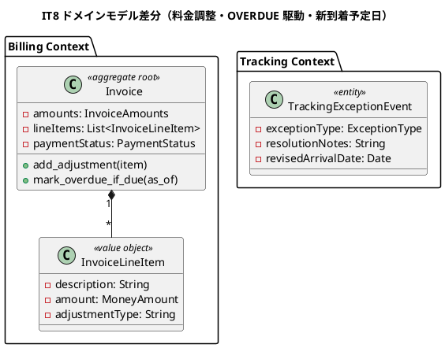
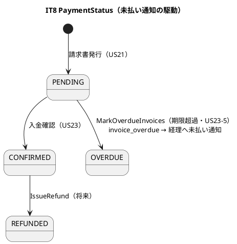
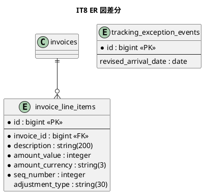

# イテレーション 8 計画 - 受入基準の残消化と品質ハードニング

## ゴール

release_plan の予備（バッファ）イテレーションとして、IT7 でクローズ時に未達と正直に記録した受入基準の残（US23 受入基準5「支払期限超過の未払い通知」・US21 受入基準6「例外発生時の料金調整」）を実装し、MVP の全受入基準を完全充足する。あわせて IT6/IT7 のふりかえり Try（新到着予定日の構造化・プロセス DoD 化）を消化して品質をハードニングする。新規 BC・新規ストーリーはなく、既存 Billing/Tracking Context の延長で完結する。

## 対象（受入基準の残・Try 消化）

| 項目 | 内容 | 由来 | 見積 |
|:---|:-----|:---|:--|
| US23-5 | 支払期限超過時に経理担当者へ未払い通知（OVERDUE 駆動バッチ） | IT7 残・T41 | 3 |
| US21-6 | 例外（遅延・破損等）発生時の料金調整（減額・補償費用の明細） | IT7 残・T42 | 3 |
| T37 | 遅延対応の新到着予定日を構造化し公開追跡の推定到着日へ反映 | IT6 残 | 2 |
| T39 | 複数集約更新ユースケースの順序型化（状態ガード→外部→保存→同期失敗検知） | IT7 Try | 1 |
| **合計** | | | **9** |

> IT8 は予備イテレーション（release_plan「7 イテレーション + 予備 1 回」）。直近ベロシティ 14-18 SP に対し 9 SP と軽量で、品質ハードニングに余力を配分する。T38（明細検算）・T40（越境識別子永続化）はプロセス改善 Try として DoD に組み込む（コード変更ではなくチェック項目化）。

## 受入条件

[user_story.md](../requirements/user_story.md) 準拠。IT7 で部分実装済みの 2 基準を完全充足する。

**US23-5 支払期限超過時の未払い通知**（として: 経理担当者）

- [ ] 支払期限（発行日 + 30 日）を超過した PENDING 請求書を検出できる
- [ ] 検出した請求書を OVERDUE 状態に遷移させる
- [ ] 経理担当者へ未払い通知が送信される（`invoice_overdue` イベント）
- [ ] 定期実行（Rake タスク / cron）で駆動できる（Solid Queue 未導入のため rails runner ベース）

**US21-6 例外発生時の料金調整**（として: 経理担当者）

- [ ] 例外（遅延・破損等）が発生した貨物の請求書に料金調整（減額・補償費用）を明細として追加できる
- [ ] 減額（マイナス）・補償費用（プラス）の両方を入力できる
- [ ] 調整後の請求金額が再計算され明細（`invoice_line_items`）に記録される
- [ ] 調整の根拠（種別・金額・理由）が請求書詳細に表示される

**T37 新到着予定日の構造化**（US19 遅延対応・US18 公開追跡）

- [ ] 遅延例外の対応報告で「新到着予定日」を構造化フィールドとして入力できる（現状 `resolution_notes` 自由テキスト）
- [ ] 新到着予定日が公開追跡ページの推定到着日に反映される

## タスク分解（アウトサイドイン・ハードニング）

MVP の受入基準充足が主眼のため、受入テスト（request/system）起点で不足を埋める。既存ドメインの延長のため部分的にドメイン層も補強する。

### 設計トピックの確定（着手前）

- [ ] 【T39】複数集約更新の順序パターン（状態ガード→外部呼び出し→各集約保存→同期失敗検知）を開発ガイドに明文化し、SettleInvoice（IT7 で是正済み）を参照実装として位置づける
- [ ] 【T40】集約が保持する越境識別子・状態は必ずカラムで永続化する設計ルールを DoD に明記（[[feedback_domain-state-no-rederivation]] の拡張・「消失も禁止」）
- [ ] 【T38】ドメイン計算の全内訳を UI 明細に 1:1 対応させ「合計が検算可能」を実装 DoD に明記（IT7 で請求明細は是正済み・ルール化）

### US23-5 未払い通知（Billing Context）

- [ ] `Invoice#mark_overdue_if_due`（IT7 実装済み）を駆動する `MarkOverdueInvoices` アプリサービス（PENDING かつ期限超過を検出→OVERDUE 遷移→保存→`invoice_overdue` 発行）のユニット spec
- [ ] リポジトリに `pending_overdue(as_of:)` クエリ（PENDING かつ due_date < as_of）を追加
- [ ] `invoice_overdue` 購読ハンドラ（経理担当者へ未払い通知・`INVOICE_OVERDUE`・正負の同値をテスト・T34）
- [ ] `lib/tasks` に Rake タスク（`billing:mark_overdue`）を追加し rails runner / cron から駆動可能に

### US21-6 料金調整（Billing Context）

- [ ] `InvoiceLineItem`（値オブジェクト・description/amount/adjustment_type）と `invoice_line_items` の永続化（IT7 で migration 済み・未使用テーブルを活用）
- [ ] `Invoice#add_adjustment`（減額/補償を明細に追加し total を再計算・CONFIRMED 前のみ）のユニット spec
- [ ] `AdjustFreight` ユースケース（請求書に料金調整を追加→total 更新→保存）
- [ ] BillingService#adjust 公開・請求書詳細に調整明細行と根拠を表示・調整入力フォーム（経理）

### T37 新到着予定日（Tracking Context）

- [ ] `tracking_exception_events` に `revised_arrival_date`（date）カラムを追加
- [ ] `ResolveException` で新到着予定日を構造化入力として受け取り永続化
- [ ] 公開追跡ページの推定到着日を「確定経路の最終 leg 到着時刻 → 例外の新到着予定日があれば優先」に変更

### 受入・E2E

- [ ] US23-5 の request/spec（期限超過→OVERDUE→未払い通知）
- [ ] US21-6 の request spec（料金調整→明細・total 反映）
- [ ] T37 の request spec（新到着予定日→公開追跡反映）

## スケジュール

| Week | 主な作業 |
|:-----|:---------|
| Week 15 | 設計トピック確定（T38/T39/T40 の DoD 化）→ US23-5 未払い通知（MarkOverdueInvoices・invoice_overdue・Rake タスク）→ US21-6 料金調整（InvoiceLineItem・add_adjustment・AdjustFreight・UI） |
| Week 15 後半 | T37 新到着予定日（revised_arrival_date・ResolveException 拡張・公開追跡反映）→ 受入 spec の green 化・品質ゲート（SonarQube 含む）→ Release 1.1 発行（受入基準完全充足） |

## 設計（IT8 スコープに絞った図）

> 新規集約はなく既存の延長のため、ドメインモデル図（差分）・状態遷移図（PaymentStatus の OVERDUE 駆動）・ER 図（invoice_line_items 活用・revised_arrival_date 追加）を掲載。画面遷移図は既存画面（請求書詳細・公開追跡）の拡張のため省略し、拡張箇所を注記する。

### ドメインモデル図（差分・Billing 料金調整 + Tracking 新到着予定日）

### 状態遷移図（PaymentStatus・OVERDUE 駆動）

### ER 図（差分）

## リスク

| リスク | 対策 |
|--------|------|
| Solid Queue 未導入で定期実行基盤がない | Rake タスク（`billing:mark_overdue`）+ rails runner / cron で駆動。将来 Solid Queue 導入時にジョブ化（ADR 起票候補） |
| 料金調整で total と明細の整合が崩れる | `add_adjustment` で total を明細合算から再計算し、IT7 の「明細検算可能」DoD（T38）で担保。CONFIRMED 後の調整は禁止 |
| 新到着予定日カラム追加が既存 tracking_exception_events の復元を壊す | nullable カラムで追加し、既存レコードは nil（推定到着日は従来どおり CargoItinerary から導出） |
| OVERDUE 駆動の冪等性（多重実行で二重通知） | 既に OVERDUE の請求書は対象外（PENDING のみ検出）。`invoice_overdue` は状態遷移時のみ発行 |

## 設計への反映が必要（validating 検証で確定予定）

1. **invoice_line_items の用途明確化**: data-model に料金調整明細（adjustment_type）としての利用を明記。
2. **PaymentStatus OVERDUE 駆動**: domain-model に MarkOverdueInvoices バッチと invoice_overdue イベントを追記。
3. **tracking_exception_events.revised_arrival_date**: data-model に追加。
4. **invoice_overdue イベント**: domain-model・architecture_backend のイベント表に追加（経理宛通知）。
5. **公開追跡の推定到着日ロジック**: ui_design/domain-model に「例外の新到着予定日を優先」を追記（IT6 設計反映項目6 の更新）。

## Definition of Done

- [x] US23-5・US21-6 の受け入れ基準をすべて満たす（IT7 で未達とした 2 基準を完全充足。OVERDUE 請求書も入金確認/調整可）
- [x] T37 新到着予定日が公開追跡に反映される
- [x] MarkOverdueInvoices・AdjustFreight・invoice_overdue 通知の spec が green（通知は正負の同値・T34）
- [x] **料金内訳の全項目が UI 明細に 1:1 対応し合計が検算可能**（T38・IT7 で是正済み・ルール化）
- [x] **集約の越境識別子・状態はカラムで永続化**（T40・shipper_id/base_amount/revised_arrival_date）
- [x] 複数集約更新は状態ガード→外部→保存→同期失敗検知の順序（T39・SettleInvoice を参照実装。IT8 の 2 UC は単一集約）
- [x] `bundle exec rspec`（416 examples）全 green / rubocop（0）/ brakeman（0）/ bundler-audit（0）/ packwerk（privacy 0）green・**CI success**
- [x] ドメイン層カバレッジ 85% 以上・全体 95.94%（新規 91.5%）
- [x] **SonarQube Quality Gate PASS**（違反 0・重複 0.0%・新規カバレッジ 91.5%）
- [x] 上記「設計への反映が必要」の 5 点を `docs/design/` に反映済み（adjustment_type・revised_arrival_date・invoice_overdue）
- [ ] **Release 1.1 を発行**（受入基準完全充足・`ruby/take-1/v1.1.0`）→ クローズ手順で発行
- [x] （追加）レビュー高優先 4 件を対応（OVERDUE 塩漬け解消・符号のドメイン化・境界値テスト・運用ドキュメント）※補償費用の増減方向は業務確認として IT9 引き継ぎ

## デモ項目（イテレーションレビュー）

1. 支払期限を過ぎた請求書に対し `billing:mark_overdue` を実行すると OVERDUE に遷移し、経理担当者へ未払い通知が送られる。
2. 例外が発生した貨物の請求書に減額・補償費用を入力すると、明細に調整行が追加され請求金額が再計算される。
3. 遅延例外の対応報告で新到着予定日を入力すると、公開追跡ページの推定到着日に反映される。

## 更新履歴

| 日付 | 更新内容 | 更新者 |
|------|---------|--------|
| 2026-07-29 | 初版作成（IT8 予備: US23-5 未払い通知・US21-6 料金調整・T37 新到着予定日・T38/T39/T40 プロセス Try・受入基準完全充足で Release 1.1） | - |

## 関連ドキュメント

- [リリース計画](release_plan.md)（予備イテレーション）
- [開発戦略](development_strategy.md)
- [イテレーション 7 ふりかえり](retrospective-7.md)（Try T38-T42）
- [イテレーション 7 完了報告書](iteration_report-7.md)（受入基準の残）
- [イテレーション 6 ふりかえり](retrospective-6.md)（T36/T37）
- [ユーザーストーリー](../requirements/user_story.md)（US21/US23）
- [ドメインモデル](../design/domain-model.md)（Billing / Tracking Context）
- [データモデル](../design/data-model.md)（invoice_line_items/tracking_exception_events）
- [ADR-0002](../adr/0002-domain-events-and-notification.md)（ドメインイベント駆動通知）
