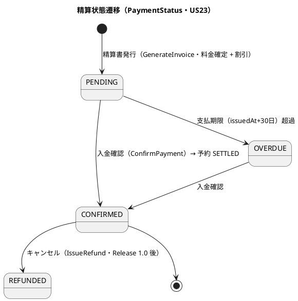
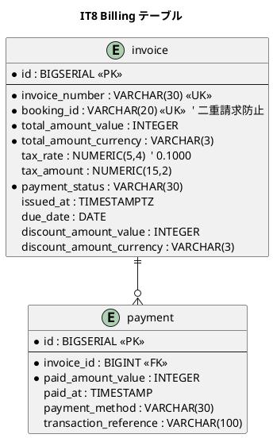
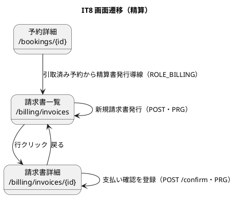

# イテレーション 8 計画

## 概要

本イテレーション（IT8）は**最終イテレーション**として、**輸送料金算出（US21・5SP）**・**法人割引適用（US22・3SP）**・**精算処理（US23・5SP）** を実装し、**Billing Context（精算）を新設**する。引取済み（CLAIMED）の貨物に対し、輸送実績（重量・貨物種別）から基本料金を算出し、法人荷主には Shipper から取得した契約割引率を適用、精算書（請求書）を発行して荷主に通知、入金確認で予約を精算済み（SETTLED）にする。これをもって **Phase 3（精算・例外処理）が完了し、全 25 ユーザーストーリーを実装した Release 1.0（全機能）** に到達する。

- **局面**: 終盤（IT7-8）／アプローチ: **アウトサイドイン**（精算フローの受入シナリオ・請求画面のニーズから application → domain へ。金額計算・割引ルールは domain をテストファーストで固める）
- **対象 BC**: **Billing Context（新設）**・Shipper Context（法人割引率参照 ACL）・Booking Context（DELIVERED/CLAIMED 前提・SETTLED 遷移）・Notification（精算書通知）
- **前提**: `internal/billing` は空スキャフォールド（新規構築）。Shipper に `DiscountRate`/`CorporateContract`/`IsCorporate` は実装済み（US03）で sqlc `FindShipperByCode` が discount_rate/shipper_type を返す。既存 booking の `Money` は int64 ベース（Add/Multiply 未実装）。ACL 先例は `ShipperExistenceAdapter`（shipper_code でクロス BC 参照・BC 独立性維持）。

---

## ゴール

### イテレーション終了時の達成状態

- 経理担当者が、引取済み（CLAIMED）の予約に対して**輸送実績（重量・貨物種別）から基本料金を算出**し、確認して確定できる（US21）。
- 法人荷主の場合、**Shipper から契約割引率（0〜30%）を取得して基本料金に適用**し、割引後料金と根拠（割引率・基本料金・割引後料金）が精算書に記載される。個人荷主は割引なし（US22）。
- 経理担当者が、確定料金から**精算書（請求番号・請求金額・支払期限）を発行**して荷主に通知でき、**入金確認で精算状態が精算済み（CONFIRMED）・予約状態も SETTLED** になる。支払期限超過は OVERDUE（US23）。

### 成功基準

- [ ] US21/US22/US23 の受け入れ基準を満たす（料金算出・確定・法人割引・精算書発行・通知・入金確認・SETTLED・OVERDUE）。
- [ ] `Invoice` 集約・`Money`（int64・Add/Multiply）・`DiscountRate`・`DiscountPolicy`・`PaymentStatus`（PENDING/CONFIRMED/OVERDUE/REFUNDED）・料金計算・法人 30% 上限を domain 層ユニットテストで隔離検証。
- [ ] 法人割引率を Shipper ACL（`ShipperContractProvider`）で参照し、`make arch`（go-arch-lint）が BC 間直接依存なしで green。
- [ ] Billing ドメイン層カバレッジ 90% 以上・SonarQube Quality Gate PASS（new_coverage 80%+・violations 0・重複 3% 未満）。
- [ ] `make check` green・`make arch` green。
- [ ] **フルフロー E2E（料金算出→割引→精算書発行→入金確認→SETTLED）とリポジトリ統合テストを開発フェーズ内で実施**（IT7 T5）。
- [ ] **Release 1.0 完了条件**: 全 25 US 実装・全 IT のデモ項目 E2E が回帰実行で green。

### IT7 ふりかえり Try の反映（返済枠）

- [ ] **T1（IT7 由来・プロセス）フィードバック到達の実装時チェックリスト化**: 精算書通知・未払い通知・割引根拠が経理担当者/荷主の画面に出ることを実装直後（コミット前）に確認する。
- [ ] **T2（IT7 由来・プロセス）受入基準を成功基準テストに 1:1 マッピング**: US21/22/23 の各受入行に対応するテスト（サービス層含む）を計画時に列挙し実装で埋める。
- [ ] **T3（IT7 由来・高・ADR-0008）返済枠を序盤独立コミット枠で先着手**: 追跡番号採番原子化（DB 採番・単一 tx・UNIQUE 衝突リトライ）を **IT8 Day 1 で先に返済**する（2 IT 連続繰越の解消）。invoice_number 採番も同じ原子採番パターンで実装し先例を統一する。
- [ ] **T3b（IT6 由来・ADR-0008）荷役履歴リプレイ**: 余力次第。最終 IT のため超過時は **Release 1.0 後のバックログへ明示**（スコープ外宣言）。
- [ ] **T5/T7（IT7 由来・ADR-0009）エスカレーション再評価・TrackingExceptionDetectedEvent 配信**: Release 1.0 のコア（精算）に直交するため、**Release 1.0 後のバックログへ明示的にスコープ外**とする（IT8 では着手しない）。
- [ ] **T6/T8（IT5-7 由来・中）協議依頼/通知待ち・管理職ワークリスト**: 3 IT 連続繰越。最終 IT のため **Release 1.0 後のバックログへ明示的にスコープ外宣言**して繰越の連鎖を断つ。

---

## ユーザーストーリー

### 対象ストーリー

| ID | ユーザーストーリー | SP | 対応 UC | BC | 優先度 |
|----|-------------------|----|---------|----|--------|
| US21 | 輸送料金を算出する | 5 | UC17 | billing | 中 |
| US22 | 法人割引を適用する | 3 | UC17 | billing / shipper | 中 |
| US23 | 精算を処理する | 5 | UC18 | billing / booking | 中 |
| **合計** | | **13** | | | |

> ベロシティ注記: IT1 15・IT2 8・IT3 17・IT4 11・IT5 7・IT6 14・IT7 13 SP（7 IT 平均 ≒ 12.1）。IT8 は 13 SP と平均並み。Billing BC 新設だが、Shipper の割引率・共有カーネル CargoType・既存 Money 構造を再利用し、料金計算・割引・精算の作り込みに集中する。IT7 Try T3（採番原子化）を Day 1 の独立返済枠として含む。

### ストーリー詳細（受け入れ基準の要点）

#### US21: 輸送料金を算出する（経理担当者 / UC17）

- 「引取済（CLAIMED）」状態の予約に対して料金算出を開始できる。
- 輸送実績（重量・貨物種別・経路実績）が表示される。
- 基本料金が自動計算される。算出結果を確認して確定操作ができる。
- 確定後、輸送料金が「確定」状態で登録される。
- （例外時の料金調整入力は Release 1.0 後のバックログとして本 IT ではスコープ外・注6）。

#### US22: 法人割引を適用する（経理担当者 / UC17）

- 荷主種別が「法人」の場合、料金算出時に契約割引率が自動取得・表示される（Shipper ACL）。
- 割引率（0〜30%）が基本料金に適用され、割引後の金額が表示される。
- 個人荷主の場合は割引が適用されない。
- 割引計算の根拠（割引率・基本料金・割引後料金）が精算書に記載される。

#### US23: 精算を処理する（経理担当者 / UC18）

- 「確定」状態の輸送料金をもとに精算書（請求番号・請求金額・支払期限）を発行できる。
- 精算書が荷主にメール通知される（NotificationPort 再利用）。
- 入金確認により精算状態が「精算済（CONFIRMED）」に更新され、予約状態も「精算済（SETTLED）」になる。
- 支払期限（issuedAt + 30 日）超過時、経理担当者に未払い通知が送信される（OVERDUE）。

---

## タスク（アウトサイドイン順）

### 0. 返済枠（IT7 T3・ADR-0008・Day 1 独立コミット枠）

- 追跡番号採番を DB 採番テーブル/シーケンスによる原子採番へ移行し、発行フローを単一トランザクション境界で行い UNIQUE 衝突リトライを追加。invoice_number も同じ原子採番パターンで実装し先例を統一する。ADR-0008 を「解決済み」に更新。

### 1. 精算フローの受入シナリオ・画面（US21/US23 の入口）

- **interfaces**: `/billing/invoices`（請求書一覧・PENDING/CONFIRMED/OVERDUE フィルタ・期限超過赤ハイライト）・`/billing/invoices/{id}`（詳細・金額内訳・割引根拠・消費税 10%）・`POST /billing/invoices`（発行）・`POST /billing/invoices/{id}/confirm`（入金確認・PRG）。ROLE_BILLING（注4）。
- **受入 E2E**: 料金算出→割引→精算書発行→入金確認→SETTLED のフローを Playwright で検証。

### 2. Billing ドメイン（domain・テストファースト）

- `Money`（int64・最小通貨単位・`Add`/`Multiply`・通貨一致検証・注1）。`InvoiceId`・`BillingBookingId`・`BillingShipperId`（`IsCorporate`）・`DiscountRate`（0〜30% 検証）・`DiscountPolicy`（`CalculateRate(shipperType, amount)`）。
- `PaymentStatus`（PENDING/CONFIRMED/OVERDUE/REFUNDED）・`DiscountPolicyType`（CORPORATE_STANDARD/VOLUME_DISCOUNT/SEASONAL/NONE）。
- `Invoice` 集約: `CalculateFinalAmount`（基本料金 × (1 - 割引率) + 消費税 10%）・`ApplyDiscount`・`ConfirmPayment`・`MarkOverdue`。料金計算は **距離係数を区間数/所要日数ベースの簡易モデル（スタブ）** とする（距離データ源が無いため・注2）。
- 貨物種別係数（GENERAL 1.0 / HAZARDOUS 1.8 / REFRIGERATED 1.5）は共有カーネル CargoType から。

### 3. application・ACL（US21/US22/US23）

- **application**: `GenerateInvoiceService`（US21+US22・料金算出 + 割引適用 + 発行）・`ConfirmPaymentService`（US23・入金確認 + Booking SETTLED 連携）。
- **ACL**: `ShipperContractProvider`（shipper_code で discount_rate/shipper_type を取得・注3）・`CargoBillingSnapshotProvider`（Booking の重量/貨物種別/CLAIMED 状態を取得）。実装は合成ルートで注入（BC 独立性・`ShipperExistenceAdapter` 先例踏襲）。
- 精算書通知・未払い通知は NotificationPort（ログ実装）。Booking の SETTLED 遷移は合成ルートアダプタ経由。

### 4. 永続化（data）

- migration: `invoice`（invoice_number UK・booking_id UK・金額 INTEGER・tax_rate/tax_amount・payment_status・issued_at/due_date・discount_amount）・`payment` テーブル追加（data-model 準拠）。`invoice_line_item` は明細が必要なら追加、不要なら最小構成（注7）。sqlcgen は per-BC 分離。
- 統合テスト: `invoice`/`payment` リポジトリの testcontainers 統合テスト（発行・入金確認・OVERDUE 判定・二重請求防止 UK）。

### 5. Release 1.0 完成

- 全 IT のデモ項目 E2E を回帰実行し green を確認。`developing-release` でのリリース手順は本 IT クローズ後に実施。

---

## スケジュール

### Week 1（Day 1-5）

- Day 1: **返済枠 T3（採番原子化・ADR-0008）** を先に返済。請求書一覧/詳細の受入 E2E スケルトン・画面ルート。
- Day 2-3: Money（Add/Multiply）・DiscountRate・DiscountPolicy・Invoice 集約（料金計算・割引・消費税）を domain テストファースト。
- Day 4-5: GenerateInvoiceService・ShipperContractProvider/CargoBillingSnapshotProvider ACL・料金算出 + 割引適用。migration（invoice/payment）+ sqlc。

### Week 2（Day 6-10）

- Day 6-7: ConfirmPaymentService（入金確認・Booking SETTLED 連携）・OVERDUE 判定・精算書/未払い通知。統合テスト。
- Day 8: 請求書一覧/詳細画面・割引根拠・消費税表示・入金確認 PRG。フルフロー E2E。
- Day 9: 設計ドキュメント是正（注1〜7）・カバレッジ補強。
- Day 10: 品質ゲート（make check / SonarQube）・全 IT デモ E2E 回帰・ロール別到達性（ROLE_BILLING）。Release 1.0 完成確認。

---

## 設計判断（要 validating-design 確認）

1. **Money を int64（最小通貨単位）で新規実装**（注1）: domain-model は "decimal.Decimal 使用" と記すが、`shopspring/decimal` は go.mod・コードに不在、既存 booking Money は int64、data-model の金額は INTEGER。依存を増やさず既存と一貫させるため **Billing の Money を int64 ベース**（Add/Multiply/通貨一致検証付き）で実装。domain-model・tech_stack を int64 方針に是正。
2. **距離係数はスタブ**（注2）: 距離データ源（距離カラム・VO）がコード・設計に存在しない。料金計算の距離係数は区間数/所要日数ベースの簡易モデルとし、精緻化は Release 1.0 後。domain-model・ui_design に明示。
3. **法人割引率は Shipper ACL**（注3）: `ShipperContractProvider`（shipper_code で discount_rate/shipper_type 取得）を billing/application に定義し、合成ルートで shipper の `FindShipperByCode` を変換注入（`ShipperExistenceAdapter` 先例踏襲・BC 独立性）。
4. **ロールは ROLE_BILLING**（注4）: `ROLE_ACCOUNTANT` は未定義。UI 文書準拠で ROLE_BILLING を使用。
5. **discount_policy 物理テーブルは作らない**（注5）: DiscountPolicy はドメイン値オブジェクト。管理画面 `/admin/discount-policies`（US-ADM-01）は IT8 スコープ外。割引率は Shipper ACL から取得。
6. **BC 独立性（Billing→Shipper/Booking）**: `BillingShipperId`/`BillingBookingId` は業務識別子で参照。ACL ポートは合成ルートで注入し、Billing は Shipper/Booking を直接 import しない（ADR-0005/0007 踏襲）。

---

## 設計（IT8 スコープに絞って掲載）

### ドメインモデル

```plantuml
@startuml
title IT8 ドメインモデル（Billing）

package "Shared Domain" {
  enum CargoType { GENERAL / HAZARDOUS / REFRIGERATED }
}

package "Billing Context" {
  class Invoice <<AggregateRoot>> {
    invoiceId : InvoiceId
    cargoBookingId : BillingBookingId
    shipperId : BillingShipperId
    baseAmount : Money
    discountRate : DiscountRate
    finalAmount : Money
    taxAmount : Money
    paymentStatus : PaymentStatus
    issuedAt / dueDate / paidAt
    +calculateFinalAmount()
    +applyDiscount(policy)
    +confirmPayment(paidAt)
    +markOverdue(now)
  }
  class Money <<VO>> { amount:int64; currency; +Add(); +Multiply() }
  class DiscountRate <<VO>> { rate 0..0.30 }
  class DiscountPolicy <<VO>> { +CalculateRate(shipperType, amount):DiscountRate }
  class BillingShipperId <<VO>> { +IsCorporate() }
  enum PaymentStatus { PENDING / CONFIRMED / OVERDUE / REFUNDED }
  Invoice *-- Money
  Invoice *-- DiscountRate
  Invoice *-- PaymentStatus
  Invoice ..> DiscountPolicy
}

Invoice ..> "Shipper (ACL)" : ShipperContractProvider（割引率）
Invoice ..> "Booking (ACL)" : CargoBillingSnapshot（重量/種別/CLAIMED）
Invoice ..> "Booking" : SETTLED 遷移（入金確認後）
@enduml
```

### 状態遷移図（PaymentStatus・精算フロー）



### データモデル（ER 図・IT8 追加分）



### 画面遷移図



### API 設計

| メソッド | パス | 説明 | ロール |
|---------|------|------|--------|
| GET | `/billing/invoices` | 請求書一覧（US21/US23） | 経理担当者（ROLE_BILLING） |
| GET | `/billing/invoices/{id}` | 請求書詳細（US22/US23） | 同上 |
| POST | `/billing/invoices` | 精算書発行（料金算出 + 割引・US21/US22） | 同上 |
| POST | `/billing/invoices/{id}/confirm` | 入金確認（US23・PRG） | 同上 |

### ADR

- ADR-0008（BC 間同期の整合性境界）を採番原子化の返済で「解決済み」に更新。金額計算の int64 方針・距離係数スタブは必要に応じ `creating-adr` で軽量 ADR 起票を判断。

---

## 検証結果（validating-iteration-plan / validating-design）

### 一致を確認した項目

- **ユーザーストーリー**（user_story.md）: US21→UC17・US22→UC17・US23→UC18、受入基準・アクター（経理担当者）が一致。
- **ドメインモデル**（domain-model.md 6 章）: `Invoice` 集約・`Money`・`DiscountRate`・`DiscountPolicy`・`BillingBookingId`/`BillingShipperId`（IsCorporate）・`PaymentStatus`・料金計算式（種別係数 GENERAL 1.0/HAZARDOUS 1.8/REFRIGERATED 1.5）・法人 30% 上限・DELIVERED 後発行・支払期限 30 日 OVERDUE が一致。
- **データモデル**（data-model.md）: `invoice`（invoice_number UK・booking_id UK 二重請求防止・金額 INTEGER・tax_rate/tax_amount・payment_status・discount_amount）・`payment` テーブルが一致。
- **開発戦略**（development_strategy.md L204）: 終盤・アウトサイドイン・US21/US22/US23・billing/shipper が一致（軸 A）。
- **過去計画の連続性**（軸 C）: BC 独立性は `ShipperExistenceAdapter`（shipper_code クロス BC 参照）先例を踏襲し `ShipperContractProvider`/`CargoBillingSnapshotProvider` を合成ルート注入。共有カーネル CargoType 再利用。NotificationPort 再利用。前 IT レビュー（it7_go_review）の T1/T2 を返済枠に反映。

### 検証で検出した不整合（注として是正）

- **Money の decimal 方針 vs 既存 int64**（軸 B）: domain-model は decimal.Decimal だが未使用・既存 Money は int64・data-model は INTEGER → 注1 で int64 に是正。
- **距離係数のデータ源なし**: 距離カラム/VO が不在 → 注2 でスタブ明示。
- **法人割引率の Shipper ACL 未記載**: 注3 で追記。
- **ROLE_ACCOUNTANT 未定義**: 注4 で ROLE_BILLING に統一。
- **discount_policy 物理テーブル未定義**: 注5（値オブジェクト・管理画面 US-ADM-01 は本 IT スコープ外）。
- **前 IT レビュー反映**（it7_go_review_20260727.md）: T1/T2 を返済枠に、ADR-0009 の再評価/イベント配信/ワークリストは最終 IT のため Release 1.0 後バックログへスコープ外宣言（繰越連鎖の決着）。

### 注（設計ドキュメントを IT8 で是正 / 実装と同時反映）

- **注1**: domain-model・tech_stack の金額方針を int64（最小通貨単位）に是正（`shopspring/decimal` 不使用・既存 Money と一貫）。
- **注2**: 料金計算の距離係数はスタブ（区間数/所要日数ベース）である旨を domain-model・ui_design に明示。
- **注3**: 法人割引率の Shipper ACL（`ShipperContractProvider`）を data-model/domain-model の BC 参照方針に沿って追記。
- **注4**: ui_design・実装のロールを `ROLE_BILLING` に統一（`ROLE_ACCOUNTANT` 未定義）。
- **注5**: `discount_policy` 物理テーブルは作らない旨（DiscountPolicy は値オブジェクト）を data-model に明記。
- **注6**: US21 の「例外時の料金調整」は Release 1.0 後バックログとして本 IT ではスコープ外を受入基準に明示。
- **注7**: `invoice_line_item` の要否（金額内訳明細）を実装時に判断し data-model と整合。

---

## リスクと対策

| リスク | 影響度 | 対策 |
|--------|--------|------|
| Money を int64 で実装し丸め・通貨不一致でバグ | 高 | 通貨一致検証・整数演算で丸め誤差を排除。料金計算・割引・消費税をテーブル駆動テストで網羅（T2） |
| 距離係数スタブが料金の妥当性を損なう | 中 | スタブである旨を明示（注2）。区間数/所要日数ベースで最低限の妥当性を確保。精緻化は Release 1.0 後 |
| 返済枠 T3（採番原子化）が精算実装を圧迫 | 中 | Day 1 の独立コミット枠で先に返済し、以降は billing に集中。超過時も T3 のみは完遂しコア精算を優先 |
| BC 横断（Billing→Shipper/Booking）で直接依存混入 | 高 | ACL ポート（ShipperContractProvider/CargoBillingSnapshotProvider）を先に定義し `make arch` で担保 |
| Release 1.0 の全 IT デモ E2E 回帰が不安定 | 中 | クリティカルパス + 各 IT デモに限定。フレイキーは待機条件明示・統合テストで補完 |

---

## 完了条件

### Definition of Done

- [ ] US21/US22/US23 の受け入れ基準をすべて満たす。
- [ ] Billing ドメイン層カバレッジ 90% 以上。
- [ ] `make check`（build/test/lint/govulncheck/arch）green・`make arch` green（BC 直接依存なし）。
- [ ] SonarQube Quality Gate PASS（new_coverage 80%+・violations 0・重複 3% 未満）。
- [ ] 料金計算・法人割引・消費税・OVERDUE をテーブル駆動テストで検証（T2）。
- [ ] **フルフロー E2E（料金算出→割引→発行→入金確認→SETTLED）とリポジトリ統合テストを開発フェーズ内で実施**（IT7 T5）。
- [ ] **フィードバック到達**（IT7 T1）: 精算書通知・未払い通知・割引根拠が経理担当者/荷主の画面に届くことを確認。
- [ ] **返済枠 T3（採番原子化・ADR-0008）を返済**し ADR-0008 を解決済みに更新。
- [ ] migration と data-model・domain-model・ui_design・tech_stack の是正（注1〜7）を実装と同時反映。
- [ ] ロール別到達性: 請求管理が ROLE_BILLING のナビ/ダッシュボードから到達できる。
- [ ] **Release 1.0 完了条件**: 全 25 US 実装・全 IT のデモ項目 E2E が回帰実行で green。
- [ ] Release 1.0 後バックログ（ADR-0009 のエスカレーション再評価・イベント配信・ワークリスト・T3b/T5/T7/T6/T8）を明示的にスコープ外宣言。

### デモ項目（E2E 受け入れ基準）

1. 経理担当者が引取済み予約の料金を算出 → 基本料金表示 → 確定（US21）。
2. 法人荷主の予約で契約割引率が適用され割引後料金・根拠が精算書に記載される（US22）。
3. 精算書を発行 → 荷主通知 → 入金確認 → 精算状態 CONFIRMED・予約状態 SETTLED（US23）。
4. 支払期限超過の請求書が OVERDUE 表示・未払い通知（US23）。

---

## 更新履歴

| 日付 | 内容 |
|------|------|
| 2026-07-27 | 初版作成。IT8（US21/US22/US23・13SP）で Billing Context を新設し Phase 3 完了・Release 1.0（全機能）到達。終盤・アウトサイドイン。IT7 Try（T1 フィードバック到達チェックリスト・T2 受入 1:1・T3 採番原子化を Day 1 独立返済枠で先着手）を反映。ADR-0009 のエスカレーション再評価・イベント配信・ワークリスト（T5/T6/T7/T8）は最終 IT のため Release 1.0 後バックログへスコープ外宣言。設計ギャップ（Money int64・距離係数スタブ・Shipper ACL・ROLE_BILLING・discount_policy テーブル不要）を注1〜7 として明記。 |
| 2026-07-27 | 開発完了（US21/US22/US23 実装完了・**全 25 US 実装・Release 1.0 到達**）: **T3 採番原子化（ADR-0008）を Day1 で返済**（sequence_counter 原子採番・追跡番号/請求番号に統一・ADR-0008 解決済み）。Billing ドメイン（Money int64 94.4%・Invoice/DiscountPolicy/料金計算/割引/消費税/OVERDUE）、application（GenerateInvoice/ConfirmPayment/MarkOverdue・ACL・81%）、infrastructure（invoice/payment migration 000017 + sqlc + リポジトリ + ShipperContractAdapter・統合テスト）、interfaces（請求書一覧/詳細/入金確認・ROLE_BILLING）、main 配線（cargoBillingSnapshot/bookingSettler/invoiceNumberIssuer アダプタ・Cargo.Settle）。設計是正（注1〜5/7）。`make check` green・SonarQube Quality Gate PASS（new_coverage 80.1%・violations 0・重複 0.2%）。**残（環境依存）**: 全 IT デモ E2E 回帰実行（要 app+DB・CI/staging）。ADR-0009 の再評価/イベント配信/ワークリスト（T5/T6/T7/T8）・T3b 荷役履歴リプレイは Release 1.0 後バックログ（スコープ外宣言済み）。 |

---

## 関連ドキュメント

- [リリース計画](release_plan.md)
- [開発戦略](development_strategy.md)
- [IT7 ふりかえり](retrospective-7.md)
- [ADR-0005 BC 間参照・ACL](../adr/0005-bc-reference-and-shared-sqlcgen.md)
- [ADR-0008 BC 間同期の整合性境界](../adr/0008-bc-sync-consistency-boundary.md)
- [ドメインモデル設計](../design/domain-model.md)
- [データモデル設計](../design/data-model.md)
- [UI 設計](../design/ui_design.md)
- [ユーザーストーリー](../requirements/user_story.md)
