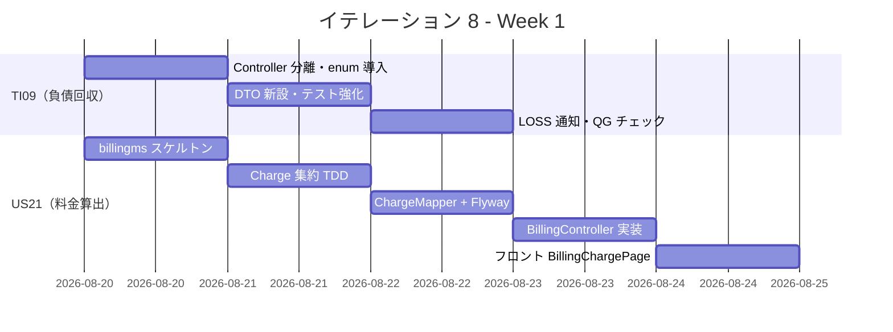
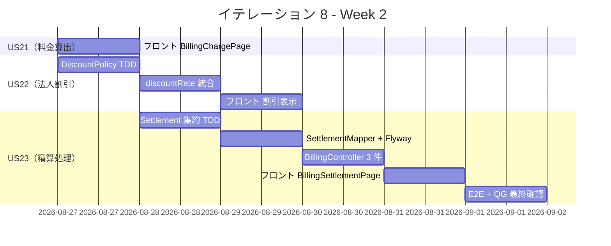
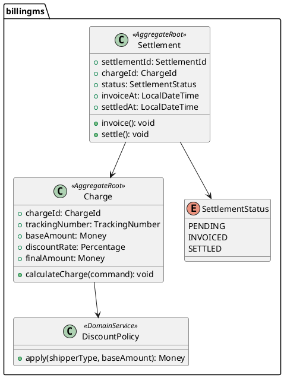

# イテレーション 8 計画

## 概要

| 項目 | 内容 |
|------|------|
| **イテレーション** | 8 / 8 |
| **期間** | Week 15-16（2026-08-20 〜 2026-09-02） |
| **ゴール** | IT7 技術的負債（TrackingController 分離・ExceptionType enum・テスト仕様化）を回収しつつ、精算機能（US21 輸送料金算出・US22 法人割引・US23 精算処理）を実装して Release 1.1 を達成する |
| **目標 SP** | 13 |

---

## ゴール

### イテレーション終了時の達成状態

1. **IT7 技術的負債回収（TI09）**: `TrackingExceptionController` 分離・`ExceptionType enum` 導入・LOSS 通知最小実装・テスト仕様化強化を完了し、TrackingController の SRP 違反を解消する
2. **輸送料金算出（US21）**: 距離・重量・品目カテゴリに基づく料金計算ロジックを billingms に実装し、経理担当者が料金を確認できる
3. **法人割引適用（US22）**: 法人荷主に対する割引率（5〜20%）を適用する料金計算を実装する
4. **精算処理（US23）**: 精算（請求書発行・入金確認）フローを実装し、経理担当者が精算状態を管理できる

### 成功基準

- [ ] `TrackingController` を `TrackingExceptionController` に分離し 330 行 → 各 150 行以下に削減
- [ ] `ExceptionType enum` で String 流通を排除（`DELAY` / `DAMAGE` / `LOSS` を型安全に管理）
- [ ] LOSS 緊急通知の最小実装（管理者への通知ログ明示化 or バッジ表示）
- [ ] `POST /api/v1/billing/quotes/{quoteId}/charges` で料金計算が可能
- [ ] 法人荷主に対して割引率が自動適用される
- [ ] `POST /api/v1/billing/charges/{chargeId}/settle` で精算が完了できる
- [ ] SonarQube Quality Gate PASS（new_coverage 80% 以上）
- [ ] E2E テスト全通過（既存 13 + 新規追加分）

---

## ユーザーストーリー

### 対象ストーリー

| ID | ユーザーストーリー | SP | 優先度 |
|----|-------------------|----|--------|
| TI09 | IT7 技術的負債回収（TrackingController 分離・ExceptionType enum・テスト仕様化） | 2 | 必須 |
| US21 | 輸送料金を算出する | 5 | 必須 |
| US22 | 法人割引を適用する | 3 | 中 |
| US23 | 精算を処理する | 5 | 必須 |
| **合計** | | **15** | |

> **フィーチャバッファ**: 13 SP コミット（US22 3 SP はバッファとして後回し可能）

### ストーリー詳細

#### TI09: IT7 技術的負債回収（2 SP）

**ストーリー**:
> 開発チームとして、IT7 で蓄積した技術的負債（TrackingController 肥大化・ExceptionType String 流通・LOSS 通知虚偽表示）を解消したい。なぜなら、IT8 の精算実装を安全に行うための基盤を整えるためだ。

**受入条件**:

- [ ] `TrackingExceptionController` を分離し `TrackingController` が単一責任を持つ（各 150 行以下）
- [ ] `ExceptionType enum`（`DELAY` / `DAMAGE` / `LOSS`、`isEscalated()` メソッド付き）を導入し String 流通を排除
- [ ] `TrackingExceptionResponse` DTO を新設し `TrackingExceptionRecord` の REST 直露出を解消
- [ ] `registerException` テストに `ArgumentCaptor` を追加してコマンド内容を検証
- [ ] LOSS 選択時に管理者通知ログ（`WARN` レベル以上）を出力する
- [ ] `AggregateTestFixture` で LOSS→`escalated=true`・`resolveException` 不変条件を検証

#### US21: 輸送料金を算出する（5 SP）

**ストーリー**:
> 経理担当者として、確定した予約（trackingNumber 紐付き）に対して輸送料金を算出したい。なぜなら、貨物引き渡し後に正確な請求書を発行するためだ。

**受入条件**:

- [ ] `POST /api/v1/billing/quotes/{quoteId}/charges` で料金計算を実行できる
- [ ] 料金は距離（km）× 重量（kg）× 品目カテゴリ係数で算出される
- [ ] 危険物（`HAZMAT`）は係数 1.5 倍、冷凍貨物（`REFRIGERATED`）は 1.3 倍が適用される
- [ ] `GET /api/v1/billing/quotes/{quoteId}/charges` で算出済み料金を確認できる
- [ ] フロント S20 料金確認画面（`BillingChargePage.tsx`）で金額が表示される

#### US22: 法人割引を適用する（3 SP）

**ストーリー**:
> 経理担当者として、法人荷主に対して契約に基づく割引率を適用した料金を算出したい。なぜなら、法人顧客との契約条件を正確に反映するためだ。

**受入条件**:

- [ ] 法人荷主（`CORPORATE`）に対して割引率（5〜20%）が自動適用される
- [ ] 割引率は荷主マスターの `discountRate` フィールドから取得される
- [ ] 割引後金額・割引前金額・割引率が料金明細に記録される
- [ ] 個人荷主には割引が適用されない（割引率 0%）

#### US23: 精算を処理する（5 SP）

**ストーリー**:
> 経理担当者として、算出された料金に対して請求書を発行し、入金を確認して精算を完了したい。なぜなら、貨物輸送の収益を正確に管理するためだ。

**受入条件**:

- [ ] `POST /api/v1/billing/charges/{chargeId}/invoice` で請求書を発行できる
- [ ] `PATCH /api/v1/billing/charges/{chargeId}/settle` で入金確認・精算完了できる
- [ ] 精算状態は `PENDING` → `INVOICED` → `SETTLED` と遷移する
- [ ] `GET /api/v1/billing/charges` で精算一覧（フィルタ: 状態・期間）を取得できる
- [ ] フロント S21 精算管理画面（`BillingSettlementPage.tsx`）で精算操作が可能

---

## タスク

### タスク 0: IT7 技術的負債回収 TI09（2 SP）

| # | タスク | 見積もり | 担当 | 状態 |
|---|--------|---------|------|------|
| 0.1 | `TrackingExceptionController` を分離（エンドポイント 3 件移行） | 4h | - | [ ] |
| 0.2 | `ExceptionType enum` 導入・`TrackingExceptionRecord` の String フィールドを enum に変更 | 2h | - | [ ] |
| 0.3 | `TrackingExceptionResponse` DTO 新設・MapStruct マッピング実装 | 2h | - | [ ] |
| 0.4 | `registerException` テストに `ArgumentCaptor` 追加・`AggregateTestFixture` ユニットテスト追加 | 4h | - | [ ] |
| 0.5 | LOSS 通知ログ出力（`WARN` レベル）+ SonarQube QG チェック | 2h | - | [ ] |

**小計**: 14h（理想時間）

### タスク 1: US21 輸送料金算出（5 SP）

| # | タスク | 見積もり | 担当 | 状態 |
|---|--------|---------|------|------|
| 1.1 | `billingms` Gradle モジュール作成・Spring Boot スケルトン + ArchUnit 設定 | 4h | - | [ ] |
| 1.2 | `Charge` 集約（コマンド・イベント・ハンドラー）+ `ChargeCalculationService` TDD | 4h | - | [ ] |
| 1.3 | `ChargeMapper`（MyBatis）+ `charges` テーブル Flyway マイグレーション | 4h | - | [ ] |
| 1.4 | `BillingController` エンドポイント 2 件（POST charges / GET charges/{id}）実装 | 4h | - | [ ] |
| 1.5 | フロント `BillingChargePage.tsx`（S20）実装 + Vitest テスト | 4h | - | [ ] |

**小計**: 20h（理想時間）

### タスク 2: US22 法人割引適用（3 SP）

| # | タスク | 見積もり | 担当 | 状態 |
|---|--------|---------|------|------|
| 2.1 | `DiscountPolicy` ドメインサービス（法人/個人分岐・割引率適用）TDD | 4h | - | [ ] |
| 2.2 | 荷主マスター `discountRate` フィールド追加 + `ChargeCalculationService` に統合 | 4h | - | [ ] |
| 2.3 | フロント 割引表示（割引前・割引後・割引率）コンポーネント追加 + テスト | 4h | - | [ ] |

**小計**: 12h（理想時間）

### タスク 3: US23 精算処理（5 SP）

| # | タスク | 見積もり | 担当 | 状態 |
|---|--------|---------|------|------|
| 3.1 | `Settlement` 状態遷移（`PENDING` → `INVOICED` → `SETTLED`）集約 TDD | 4h | - | [ ] |
| 3.2 | `SettlementMapper`（MyBatis）+ `settlements` テーブル Flyway マイグレーション | 4h | - | [ ] |
| 3.3 | `BillingController` エンドポイント 3 件（POST invoice / PATCH settle / GET charges）実装 | 4h | - | [ ] |
| 3.4 | フロント `BillingSettlementPage.tsx`（S21）実装 + Vitest テスト | 4h | - | [ ] |
| 3.5 | E2E テスト（精算フロー）+ SonarQube QG PASS 確認 | 4h | - | [ ] |

**小計**: 20h（理想時間）

### タスク合計

| カテゴリ | SP | 理想時間 | 状態 |
|---------|----|---------|------|
| TI09: IT7 技術的負債回収 | 2 | 14h | [ ] |
| US21: 輸送料金算出 | 5 | 20h | [ ] |
| US22: 法人割引適用 | 3 | 12h | [ ] |
| US23: 精算処理 | 5 | 20h | [ ] |
| **合計** | **15** | **66h** | |

**1 SP あたり**: 約 4.4h
**フィーチャバッファ**: US22 3 SP（66h の 18%）
**コミット SP**: 13（US22 バッファ除く）
**進捗率**: 0% (0/13 SP)

---

## スケジュール

### Week 1（2026-08-20〜08-26）



| 日 | タスク |
|----|--------|
| Day 1（08-20） | TI09: TrackingExceptionController 分離・ExceptionType enum 導入 |
| Day 2（08-21） | TI09: DTO 新設・ArgumentCaptor テスト・AggregateTestFixture 追加 |
| Day 3（08-22） | TI09: LOSS 通知ログ + SonarQube QG 確認、US21: billingms スケルトン作成 |
| Day 4（08-25） | US21: Charge 集約（コマンド・イベント）TDD |
| Day 5（08-26） | US21: ChargeMapper + Flyway マイグレーション + BillingController 実装 |

### Week 2（2026-08-27〜09-02）



| 日 | タスク |
|----|--------|
| Day 6（08-27） | US21: フロント BillingChargePage 実装、US22: DiscountPolicy TDD |
| Day 7（08-28） | US22: discountRate 統合 + フロント割引表示、US23: Settlement 集約 TDD |
| Day 8（08-29） | US23: SettlementMapper + Flyway マイグレーション |
| Day 9（09-01） | US23: BillingController 3 件 + フロント BillingSettlementPage |
| Day 10（09-02） | E2E テスト・SonarQube QG 最終確認・Release 1.1 タグ付け |

---

## 設計

### ドメインモデル（billingms）



### API 設計

| メソッド | エンドポイント | 説明 |
|---------|---------------|------|
| POST | `/api/v1/billing/quotes/{quoteId}/charges` | 料金算出 |
| GET | `/api/v1/billing/quotes/{quoteId}/charges` | 料金取得 |
| POST | `/api/v1/billing/charges/{chargeId}/invoice` | 請求書発行 |
| PATCH | `/api/v1/billing/charges/{chargeId}/settle` | 精算完了 |
| GET | `/api/v1/billing/charges` | 精算一覧（フィルタ対応） |

### データベーススキーマ（billingms）

```sql
-- V001: charges テーブル
CREATE TABLE charges (
    charge_id        VARCHAR(36) PRIMARY KEY,
    tracking_number  VARCHAR(50) NOT NULL,
    shipper_id       VARCHAR(36) NOT NULL,
    shipper_type     VARCHAR(20) NOT NULL,  -- INDIVIDUAL / CORPORATE
    base_amount      DECIMAL(10,2) NOT NULL,
    discount_rate    DECIMAL(5,2) NOT NULL DEFAULT 0.00,
    final_amount     DECIMAL(10,2) NOT NULL,
    calculated_at    TIMESTAMP NOT NULL,
    created_at       TIMESTAMP NOT NULL DEFAULT CURRENT_TIMESTAMP
);

-- V002: settlements テーブル
CREATE TABLE settlements (
    settlement_id   VARCHAR(36) PRIMARY KEY,
    charge_id       VARCHAR(36) NOT NULL REFERENCES charges(charge_id),
    status          VARCHAR(20) NOT NULL DEFAULT 'PENDING',
    invoice_at      TIMESTAMP,
    settled_at      TIMESTAMP,
    created_at      TIMESTAMP NOT NULL DEFAULT CURRENT_TIMESTAMP
);
```

---

## リスクと対策

| リスク | 影響度 | 対策 |
|--------|--------|------|
| billingms の新規マイクロサービス作成が想定より時間がかかる | 高 | IT7 の bookingms/trackingms スケルトンを参考に同一パターンで実装。不明点は早期に spike |
| US22 法人割引が SP 不足でバッファ消費になる | 中 | US22 を最初からバッファとして計画。US21/US23 優先で着手。残時間に応じて実装 |
| SonarQube QG がカバレッジ未達で失敗する | 中 | TI09 で既存テストを強化してから新機能実装。billingms のカバレッジ目標 80% 以上を設定 |
| Release 1.1 E2E が既存シナリオとの組み合わせで失敗する | 低 | 精算フロー E2E を最終日に集中実施。リグレッションは Day 9 に確認 |

---

## 完了条件

### Definition of Done

- [ ] TI09 全タスク完了（TrackingController 分離・enum 導入・LOSS 通知・テスト仕様化）
- [ ] US21 / US23 受入条件を全て満たす
- [ ] US22 受入条件を全て満たす（バッファ実施時）
- [ ] Backend / Frontend 全テストがパス
- [ ] SonarQube Quality Gate PASS（new_coverage 80% 以上、violations 0）
- [ ] E2E テスト全通過（既存 13 シナリオ + 精算フロー新規追加）
- [ ] `git tag Release-1.1` を打ち、GitHub Release を作成

### デモ項目

1. TrackingController 分離後の API 動作確認（例外登録・解決エンドポイント）
2. 輸送料金算出（距離・重量・品目カテゴリ係数適用）
3. 法人割引適用（割引前・後の金額表示）
4. 精算フロー（PENDING → INVOICED → SETTLED）
5. SonarQube QG PASS ダッシュボード確認

---

## 更新履歴

| 日付 | 更新内容 | 更新者 |
|------|---------|--------|
| 2026-05-20 | 初版作成 | AI Agent |

---

## 関連ドキュメント

- [イテレーション 7 完了報告書](./iteration_report-7.md)
- [イテレーション 7 ふりかえり](./retrospective-7.md)
- [リリース計画](./release_plan.md)
