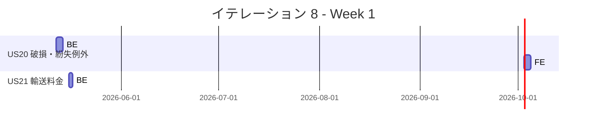
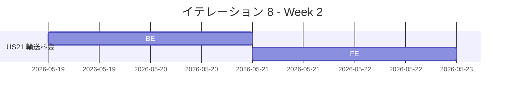
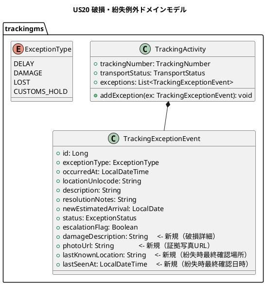
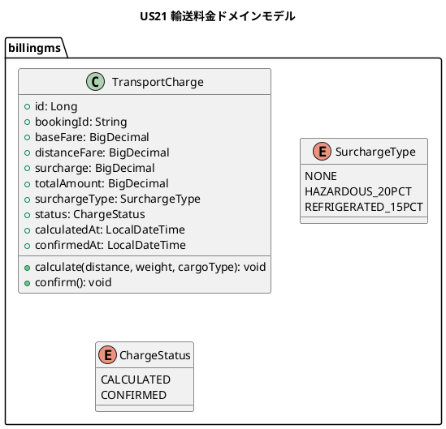
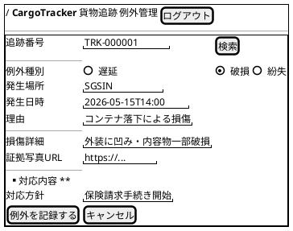
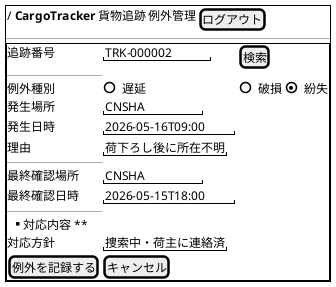
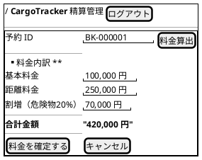
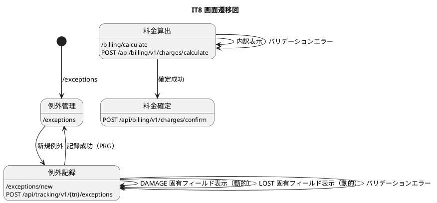

# イテレーション 8 計画

## 概要

| 項目 | 内容 |
|------|------|
| **イテレーション** | 8 |
| **期間** | Week 15-16（2026-05-12〜2026-05-22） |
| **ゴール** | 破損・紛失例外処理と輸送料金算出の API + 画面を実装する |
| **目標 SP** | 16（US20 8 SP + US21 8 SP） |

---

## ゴール

### イテレーション終了時の達成状態

1. **破損・紛失例外処理（US20）**: 追跡管理者が破損・紛失例外を記録し、貨物状態が「例外発生」に更新され、対応内容を入力できる
2. **輸送料金算出（US21）**: 経理担当者が予約 ID から輸送料金を算出し、内訳を確認して料金を確定できる

### 成功基準

- [ ] US20: 例外種別「破損（DAMAGE）」「紛失（LOST）」を選択して例外を記録できる
- [ ] US20: 例外記録後に貨物状態が「例外発生（EXCEPTION）」に更新される
- [ ] US20: 例外の対応内容（処理方針・補償方針）を入力して更新できる
- [ ] US21: 予約 ID を入力して輸送料金を算出できる
- [ ] US21: 料金の内訳（基本料金・距離料金・危険物割増）が表示される
- [ ] US21: 算出した料金を確定（保存）できる
- [ ] 全ユニットテスト（BE + FE）がパス
- [ ] BE テストカバレッジ 80% 以上（JaCoCo）

---

## ユーザーストーリー

### 対象ストーリー

| ID | ユーザーストーリー | BE | FE | SP | 優先度 |
|----|-------------------|----|----|-----|--------|
| US20 | 破損・紛失例外を処理する | 5 | 3 | 8 | 必須 |
| US21 | 輸送料金を算出する | 5 | 3 | 8 | 中 |
| **合計** | | **10** | **6** | **16** | |

### ストーリー詳細

#### US20: 破損・紛失例外を処理する

**ストーリー**:
> 追跡管理者として、配送中に発生した破損・紛失例外を記録・処理したい。なぜなら、損害情報を速やかに荷主・関係者に伝える必要があるからだ。

**受入条件**:

- [ ] 例外種別「破損（DAMAGE）」「紛失（LOST）」を選択して例外を記録できる
- [ ] 例外記録後に貨物状態が「例外発生（EXCEPTION）」に更新される
- [ ] 例外の対応内容（処理方針・補償方針）を入力して更新できる

#### US21: 輸送料金を算出する

**ストーリー**:
> 経理担当者として、確定した輸送ルートと貨物情報から輸送料金を算出したい。なぜなら、精算処理の基礎データが必要だからだ。

**受入条件**:

- [ ] 予約 ID を入力して輸送料金を算出できる
- [ ] 料金の内訳（基本料金・距離料金・危険物割増）が表示される
- [ ] 算出した料金を確定（保存）できる

### タスク

#### 1. US20: 破損・紛失例外を処理する（8 SP）

| # | タスク | 見積もり | 担当 | 状態 |
|---|--------|---------|------|------|
| 1.1 | **[TDD]** BE: IT7 で構築した `TrackingExceptionEvent` を活用し、DAMAGE・LOST 種別での例外記録ロジックを実装する | 1h | - | [ ] |
| 1.2 | **[TDD]** BE: DAMAGE 時に損傷詳細フィールド（damageDescription・photoUrl）を追加・保存する | 1.5h | - | [ ] |
| 1.3 | **[TDD]** BE: LOST 時に最終確認場所・最終確認日時フィールドを追加・保存する | 1h | - | [ ] |
| 1.4 | BE: DB マイグレーション（tracking_exception_event テーブルに damage_description・photo_url・last_known_location・last_seen_at カラム追加） | 0.5h | - | [ ] |
| 1.5 | **[TDD]** FE: 例外記録画面で DAMAGE・LOST 選択時に種別固有フィールドを動的表示する | 2h | - | [ ] |
| 1.6 | FE: US20 の FE テストを追加する | 1h | - | [ ] |

**小計**: 7h（理想時間）

#### 2. US21: 輸送料金を算出する（8 SP）

| # | タスク | 見積もり | 担当 | 状態 |
|---|--------|---------|------|------|
| 2.1 | **[TDD]** BE: `billingms` マイクロサービスの雛形を構築する（Spring Boot アプリケーション・DB 接続・MyBatis 設定） | 1.5h | - | [ ] |
| 2.2 | **[TDD]** BE: `TransportCharge` ドメインモデルを実装する（基本料金・距離料金・割増料金・合計） | 1.5h | - | [ ] |
| 2.3 | **[TDD]** BE: 料金算出ロジックを実装する（距離 x 重量 x 基本単価、HAZARDOUS +20%、REFRIGERATED +15%） | 1.5h | - | [ ] |
| 2.4 | **[TDD]** BE: 料金算出 API（POST /api/billing/v1/charges/calculate）と料金確定 API（POST /api/billing/v1/charges/confirm）を実装する | 1.5h | - | [ ] |
| 2.5 | BE: DB マイグレーション（transport_charge テーブル作成） | 0.5h | - | [ ] |
| 2.6 | **[TDD]** FE: 料金算出画面（予約 ID 入力・内訳表示・確定ボタン）を実装する | 2h | - | [ ] |
| 2.7 | FE: US21 の FE テストを追加する | 1h | - | [ ] |

**小計**: 9.5h（理想時間）

#### タスク合計

| カテゴリ | SP | 理想時間 | 状態 |
|---------|----|----|------|
| US20: 破損・紛失例外処理 | 8 | 7h | [ ] |
| US21: 輸送料金算出 | 8 | 9.5h | [ ] |
| **合計** | **16** | **16.5h** | |

**1 SP あたり**: 約 1.0h
**進捗率**: 0% (0/16 SP)

---

## スケジュール

### Week 1（Day 1-5: 2026-05-12〜2026-05-16）



| 日 | タスク |
|----|--------|
| Day 1 | US20: BE DAMAGE・LOST 記録ロジック（1.1, 1.2） |
| Day 2 | US20: BE LOST フィールド・DB マイグレーション（1.3, 1.4） |
| Day 3 | US20: FE 動的フィールド表示（1.5） |
| Day 4 | US20: FE テスト追加（1.6） |
| Day 5 | US21: BE billingms 雛形・ドメインモデル（2.1, 2.2） |

### Week 2（Day 6-8: 2026-05-19〜2026-05-22）



| 日 | タスク |
|----|--------|
| Day 6 | US21: BE 料金算出ロジック・API（2.3, 2.4） |
| Day 7 | US21: BE DB マイグレーション（2.5）、FE 料金算出画面開始（2.6） |
| Day 8 | US21: FE テスト追加（2.7）、統合確認 |

---

## 設計

### ドメインモデル

#### US20: 破損・紛失例外処理



> **注**: IT7 で構築済みの `TrackingExceptionEvent` エンティティに DAMAGE・LOST 固有フィールドを追加拡張する。既存の DELAY 処理には影響しない。

#### US21: 輸送料金算出



### データモデル

#### US20: tracking_exception_event テーブル拡張

```prisma
model tracking_exception_event {
  // ... 既存フィールド（IT7 で作成済み）
  damage_description    String?   // <- 新規追加（破損詳細）
  photo_url             String?   // <- 新規追加（証拠写真URL）
  last_known_location   String?   // <- 新規追加（紛失時最終確認場所）
  last_seen_at          DateTime? // <- 新規追加（紛失時最終確認日時）
}
```

#### US21: transport_charge テーブル（新規）

```prisma
model transport_charge {
  id              BigInt    @id @default(autoincrement())
  booking_id      String    @unique
  base_fare       Decimal   // 基本料金
  distance_fare   Decimal   // 距離料金
  surcharge       Decimal   // 割増料金
  total_amount    Decimal   // 合計金額
  surcharge_type  String    @default("NONE")  // NONE / HAZARDOUS_20PCT / REFRIGERATED_15PCT
  status          String    @default("CALCULATED")  // CALCULATED / CONFIRMED
  calculated_at   DateTime
  confirmed_at    DateTime?
  created_at      DateTime  @default(now())
  updated_at      DateTime  @updatedAt
}
```

### ユーザーインターフェース

#### ビュー

**US20: 例外記録画面拡張（既存 TrackingExceptionPage を再利用）**





**US21: 輸送料金算出画面（新規）**



#### インタラクション



### API 設計

#### US20 拡張 API（既存 API 再利用）

| メソッド | エンドポイント | 説明 |
|---------|---------------|------|
| POST | `/api/tracking/v1/{trackingNumber}/exceptions` | 例外記録（IT7 既存）。DAMAGE・LOST 種別と固有フィールドを追加 |
| PUT | `/api/tracking/v1/{trackingNumber}/exceptions/{id}/response` | 対応内容更新（IT7 既存） |

#### US21 新規 API

| メソッド | エンドポイント | 説明 |
|---------|---------------|------|
| POST | `/api/billing/v1/charges/calculate` | 予約 ID から輸送料金を算出する |
| POST | `/api/billing/v1/charges/confirm` | 算出した料金を確定（保存）する |
| GET | `/api/billing/v1/charges/{bookingId}` | 予約 ID の料金情報を取得する |

### ADR

| ADR | タイトル | ステータス |
|-----|---------|--------------|
| ADR-006 | billingms を独立マイクロサービスとして構築する（bookingms への料金計算混入を避ける） | 提案 |

---

## リスクと対策

| リスク | 影響度 | 対策 |
|--------|--------|------|
| US21: billingms 新規構築で Spring Boot + MyBatis + DB セットアップの工数が予想を超える | 高 | trackingms の雛形をコピーして構築時間を短縮。最悪 bookingms に料金計算ロジックを仮配置し、後続 IT で分離する |
| US20: IT7 の TrackingExceptionEvent 拡張が既存 DELAY 処理に影響する | 中 | 新フィールドはすべて nullable として追加。既存テストが通過することを確認してから実装 |
| US21: bookingms から予約情報（経路距離・貨物種別）を取得する連携が必要 | 中 | 初期実装では REST 同期呼び出し（billingms → bookingms API）で対応。Phase 2 完了後にイベント駆動への移行を検討 |
| ベロシティ 16 SP は IT7（24 SP）より少ないが billingms 新規構築のオーバーヘッドがある | 低 | IT7 実績（23 SP 平均）から見て 16 SP は達成可能。billingms 雛形の工数を 1.5h と控えめに見積もり |

---

## 完了条件

### Definition of Done

- [ ] US20: 破損・紛失例外が記録され、EXCEPTION 状態に遷移する
- [ ] US20: 破損時の損傷詳細・紛失時の最終確認情報が保存される
- [ ] US21: 予約 ID から料金が算出され、内訳が表示される
- [ ] US21: 料金確定後に transport_charge テーブルに保存される
- [ ] 全ユニットテスト・BE テストカバレッジ 80%+
- [ ] ESLint / SonarQube Quality Gate PASS
- [ ] ドキュメント更新完了

### デモ項目

1. 「破損」を選択すると損傷詳細フィールドが表示され、例外記録後に EXCEPTION へ遷移することを確認する（US20）
2. 「紛失」を選択すると最終確認場所・日時フィールドが表示され、例外記録後に EXCEPTION へ遷移することを確認する（US20）
3. 予約 ID を入力して料金算出すると、基本料金・距離料金・割増料金の内訳が表示され、確定できることを確認する（US21）

---

## 更新履歴

| 日付 | 更新内容 | 更新者 |
|------|---------|--------|
| 2026-05-11 | 初版作成（IT8 計画） | - |

---

## 関連ドキュメント

- [イテレーション 7 完了報告書](./iteration_report-7.md)
- [リリース計画](./release_plan.md)
- [ユーザーストーリー](../requirements/user_story.md)
