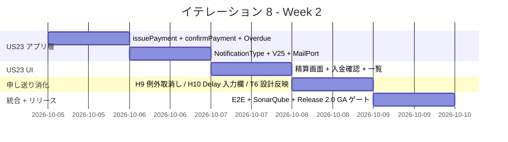
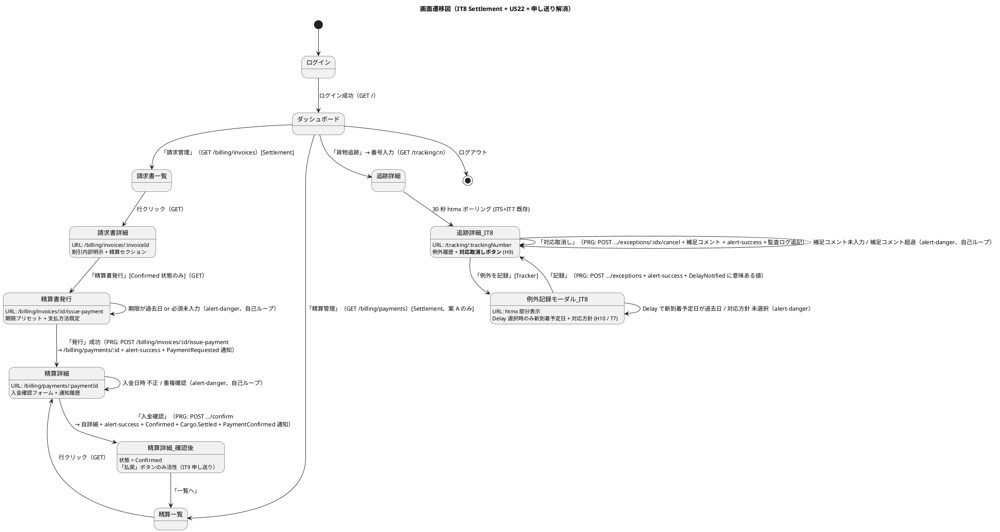

# イテレーション 8 計画

## 概要

| 項目 | 内容 |
|------|------|
| **イテレーション** | IT8 |
| **期間** | 2026-09-28 〜 2026-10-11（Week 17-18、2 週間） |
| **ゴール** | US22 法人割引 + US23 精算（計 9 SP）を完成、Release 2.0 GA に到達、IT7 申し送り（Try 8 件 + Review 高優先 12 件）の 15 件 (H1-H12 + T3 / T6 + ADR 0019/0020 起票) を消化、Phase 4 全完了 |
| **目標 SP** | 9 |

---

## ゴール

### イテレーション終了時の達成状態

1. **US22 法人割引適用**: 請求書発行時に法人荷主の契約割引率を自動取得・適用し、`Invoice.lineItems` に `Discount` カテゴリ明細を追加できる。請求書詳細画面で割引内訳が表示される。
2. **US23 精算処理**: 請求書から精算書発行 → 入金確認 → 精算完了の業務フローを完成し、`Payment` 集約・`payment` テーブル・通知（PaymentRequested / PaymentConfirmed / OverdueAlerted）を実装する。
3. **IT7 申し送り 12 件消化**: H1 楽観ロック共通化、H2 Lost/Loss 命名統一、H3 BookingPublicApi ACL、H4 ADR 0016 (tx 境界)、H5 TrackingExceptionEvent PK ID 付与、H7 ExceptionType 同値テスト、H9 解決済例外取消し、H10 newEstimatedArrival 仮値解消、H11 README 更新、H12 recordException パターン、T3 routeDeviation 自動判定、T6 設計ドキュメント反映。
4. **Release 2.0 GA リリースゲート**: 全ストーリー (US01-US26、26 件) 完了、Unit テスト 400+ 件 PASS、Playwright E2E 40+ 件 PASS、SonarQube Quality Gate 通過、ADR 0014-0017 承認、設計ドキュメント反映完了。

### 成功基準

- [ ] US22 + US23 全タスク完了（受入基準 100% PASS）
- [ ] 0.x 申し送り 12 件中 12 件完了（高優先度）
- [ ] ベロシティ実績 9 SP 達成（IT4-IT7 平均 11.5 SP に対し 9 SP）
- [ ] Unit テスト全 PASS、coverage 80% 以上維持、ArchUnit 5 ルール pass
- [ ] Flyway V23-V25 適用（PaymentId / payment テーブル / TrackingExceptionEvent.id）
- [ ] ADR 0016 (HandlingOrchestrator tx 境界) / ADR 0017 (BookingPublicApi) 承認
- [ ] Release 2.0 GA リリースゲート全件 PASS
- [ ] Playwright E2E US22 / US23 各 1-2 シナリオ追加（4 件）
- [ ] SonarQube 実機再スキャン Quality Gate 通過

---

## ユーザーストーリー

### 対象ストーリー

| ID | ユーザーストーリー | SP | 優先度 |
|----|-------------------|----|----|
| US22 | 法人割引を適用する | 3 | 中 |
| US23 | 精算を処理する | 6 | 必須 |
| **合計** | | **9** | |

### ストーリー詳細

#### US22: 法人割引を適用する

**ストーリー**:
> 経理担当者として、法人荷主の場合に、契約割引率を基本料金に自動適用して割引後の請求金額を確定したい。なぜなら、法人契約条件に基づく正確な割引を自動化し、手計算ミスを防ぐからだ。

**対応 UC**: UC17

**受入基準**:

1. 荷主種別が「法人」の場合、料金算出時に契約割引率が自動的に取得・表示される
2. 割引率（0〜30%）が基本料金に適用され、割引後の金額が表示される
3. 個人荷主の場合は割引が適用されない
4. 割引率は `Shipper.discountRate` (法人荷主の契約フィールド) から自動取得される
5. `Invoice.lineItems` に `LineItemCategory.Discount` 明細が `-amount` として追加される
6. 請求書詳細画面で「割引適用前金額」「割引率」「割引額」「割引適用後金額」が表示される

#### US23: 精算を処理する

**ストーリー**:
> 経理担当者として、確定した輸送料金をもとに精算書を発行し、荷主への通知・入金確認・精算完了処理を行いたい。なぜなら、精算業務を一元管理し、入金状況を追跡して確実に精算を完了できるからだ。

**対応 UC**: UC18

**受入基準**:

1. 「確定」状態の請求書から精算書（請求番号・請求金額・支払い期限）を発行できる
2. 精算書が荷主にメール通知される（PaymentRequested 通知）
3. 決済機関との連携により入金確認ができる（IT8 はモック実装、IT9 で外部連携拡張可）
4. 入金確認後、精算状態が「精算済」に更新され予約状態も `Settled` になる
5. 支払い期限超過時、経理担当者に未払い通知が送信される（OverdueAlerted 通知）

### タスク

#### 0. IT7 申し送り（Review 高優先 12 件中 12 件 + Try 2 件）

| # | タスク | 見積もり | 状態 |
|---|--------|---------|------|
| 0.1 | 楽観ロック try/catch を `withOptimisticLock[A](label)` ヘルパに抽出（H1 / TrackingCommandService 3 箇所 + 他コマンドサービス候補） | 3h | [x] **完了** (2026-06-24): `shared.application.OptimisticLockOps.withOptimisticLock` 新設 + TrackingCommandService 3 箇所 (updateStatus / recordException / resolveException) 置換、Unit 5 件 Green、既存 10 件 Regression なし |
| 0.2 | ExceptionType.Lost / NotificationType.LossEscalated / escalateLoss の命名統一（H2、ユビキタス言語注記 or 改名） | 2h | [x] **完了** (2026-06-24): 改名採択 = `LossEscalated` → `LostEscalated` / `escalateLoss` → `escalateLost` (NotificationType / NotificationPayload / NotificationPayloadJson / BookingCommandService / TrackingController 計 5 ファイル)、Flyway V26 で CHECK 制約更新 + 既存データ UPDATE、domain-model.md にユビキタス言語注記追加、Unit 51 件 Regression なし |
| 0.3 | ADR 0017 起票「Booking 公開 Port (BookingPublicApi) を切る」+ `BookingPublicApi` trait 新設、`BookingAdapter` を Port 経由に変更（H3） | 5h | [x] **完了** (2026-06-24): ADR 0017 起票・承認 + `booking/application/api/BookingPublicApi.scala` 新設 (logHandlingNotification / completeDelivery の 2 メソッド) + `BookingCommandService` を `extends BookingPublicApi` 化 + `BookingAdapter` の Inject 型を `BookingCommandService` → `BookingPublicApi` 切替 + Module.scala に bind 追加。Unit 110 件 Green。US23 では `markSettled` を本 trait に追加する想定 |
| 0.4 | ADR 0016 起票「HandlingOrchestrator のトランザクション境界（単一 DB.localTx vs Outbox/Domain Events）」+ 採用方針決定（H4 / T2） | 4h | [x] **完了** (2026-06-24): ADR 0016 起票・承認 = **案 A 採用** (単一 DB.localTx + ベストエフォート補償ログ)。理由: IT8 スコープ吸収可能 / 業務同期要件適合 / 即時整合 / 障害復旧単純。実装 (各 Repository の implicit DBSession 拡張 + Orchestrator TX 統合) は IT8 後半余力 or IT9 申し送り |
| 0.5 | Flyway V23: `tracking_exception_event` に `id BIGINT AUTO_INCREMENT PK` 追加 + `TrackingExceptionEvent` に `id: Option[Long]` を追加、`updateExceptionResolution` を PK 直接更新に変更（H5 / T8） | 4h | [x] **完了** (2026-06-24): V20 既に `id BIGSERIAL PRIMARY KEY` 保持のため V23 migration 追加不要。`TrackingExceptionEventId` opaque type 新設 + `TrackingExceptionEvent.id: Option[TrackingExceptionEventId]` 追加 + Repository の `appendException` を `updateAndReturnGeneratedKey` 化し採番 id を集約反映 + `updateExceptionResolution` を `WHERE id = ?` PK 直接更新に変更 + `loadExceptions` も id 取得・ORDER BY id 化。Unit 32 件 Green (Testcontainers IntegrationSpec 1 件 ABORT は本変更と無関係) |
| 0.6 | `TrackingExceptionSpec` に 同値クラス代表値テスト追加（CustomsHold → InException / Damage デフォルト escalationFlag=false / 解決済再解決 AlreadyResolved or 上書き仕様化）（H7 / M6） | 3h | [x] **完了** (2026-06-24): +6 件 = CustomsHold/Damage InException 遷移 + Delay/Damage/CustomsHold デフォルト escalationFlag=false 対称テスト + 解決済再解決の「上書き許容」仕様明示 (取消し動線は 0.7 別途追加)。EitherValues 化も同時適用。Unit 11 件 Green |
| 0.7 | 追跡詳細画面に「対応取消し」「補足コメント追記」動線を追加 + Controller `cancelExceptionResolution` / `appendResolutionComment` アクション（H9 / 業務代表者指摘） | 5h | [ ] |
| 0.8 | 例外記録モーダルに Delay 選択時のみ「新到着予定日 datetime-local + 対応方針 select (定型 4 種) + 詳細理由 textarea」を JS 表示制御で追加。`logDelayNotification` を意味ある値に置換（H10 / T7 / P8） | 4h | [ ] |
| 0.9 | トップレベル README.md に IT2 以降の Phase 進捗 + Release マイルストーン反映（H11 / 設計ドキュメントへのリンク委譲） | 2h | [x] **完了** (2026-06-24): README.md に「プロジェクト進捗」セクション追加 (Phase 1-4 × Release × IT 表、累計 SP 81、開発ドキュメント / リリース報告書 / IT7 実装レビュー / ADR 一覧へのリンク委譲) |
| 0.10 | `recordException` 戻り値の `: @unchecked` パターン補正 + EitherValues 移行（H12 / TrackingCommandServiceSpec） | 2h | [x] **完了** (2026-06-24): TrackingCommandServiceSpec の `val Right(x) = ...: @unchecked` 14 箇所 + `val Left(x) = ...: @unchecked` 1 箇所 + InMemoryRepo 内 1 箇所 = 計 16 箇所を EitherValues `.value` / `.left.value` に置換、`@unchecked` 注釈ゼロ達成、Unit 10 件 Green |
| 0.11 | `HandlingCargoQueryPort` (handling 用 ACL Port) + `BookingCargoForHandlingAdapter` 新設、`HandlingOrchestrator.register` で `Itinerary.isOnRoute` 経由 routeDeviation 自動判定 + ユニットテスト 3 件追加（T3 / 0.14 持ち越し回収） | 5h | [x] **完了** (2026-06-24): `HandlingCargoQueryPort` trait 新設 (isOnRoute / findItineraryLocations) + `BookingCargoForHandlingAdapter` (CargoRepository ラップ) + Module bind + `HandlingOrchestrator` に Inject、Tracking/Handling 双方に routeDeviation 自動判定値伝播。HandlingOrchestratorSpec に Fake CargoQueryPort 追加 + 同値クラステスト 3 件追加 (経路上 false / 経路外 true / Itinerary 未紐付け true)。Unit 69 件 Green |
| 0.12 | 設計ドキュメント反映（T6 / docs/design/data-model.md + domain-model.md + ui_design.md）: IT7 差分 (V18-V22 + TrackingExceptionEvent + ItineraryLeg + InvoiceLineItem + RecipientConfirmationType + 例外記録 UI) + IT8 差分 (Payment テーブル列 `amount BIGINT` 単通貨整合 + `due_date` / `version` 追加 + `transaction_reference` → `reference_code` 統一、ui_design.md L82 画面一覧 + L209 画面遷移図 (精算フロー) の **両方** に Payment 系 4 画面 (`/billing/invoices/:id/issue-payment` / `/billing/payments` / `/billing/payments/:paymentId` / `/billing/payments/:id/confirm`) を追加、Accountant→Settlement / Admin→MasterAdmin Role 統一 (実装側 Role.scala: Sales / RouteDesigner / Tracker / Settlement / MasterAdmin 準拠)) を正式反映 | 6h | [ ] |
| 0.13 | CLAUDE.md に TDD コミット規律 (Red → Green の分離、もしくは Red→Green を経た事実をコミットメッセージに明記) を追記 (H6 / it7_implementation_review_20260623.md) | 1h | [x] **完了** (2026-06-24): CLAUDE.md に「TDD コミット規律」セクション追記 (原則 + Conventional Commits 例 + リファクタリング例外) |
| 0.14 | ADR 0020 起票「公開追跡画面 (`/public/tracking/...`) における例外表示方針」: 表示する/しない、表示する場合の情報粒度 (緊急バッジのみ / 詳細 / 対応状況) を業務ルール決定 (H8 / it7 業務代表者指摘) | 3h | [x] **承認** (2026-06-24): 段階的開示 = ステータスバッジ + 簡易メッセージ + 連絡先のみ公開、対応詳細は社内画面のみ |
| 0.15 | ADR 0019 起票「Billing Context の Payment は Invoice 集約内 (`paymentStatus` フィールド + `confirmPayment` メソッド) か別集約か」: domain-model.md L921-955 では Invoice 集約内、計画 2.1 は別集約案。本イテレーションで決定 (S3-1 / S3-2 / S3-3 整合) | 3h | [x] **承認** (2026-06-24): **案 B 採択** = Invoice 集約内 `paymentStatus` + `issuePayment` / `confirmPayment` / `markOverdue` メソッド。Payment 独立集約は作らない。下記 2.x は案 B 確定版に書き換え済 |

**小計**: 57h

#### 1. US22 法人割引適用（3 SP）

| # | タスク | 見積もり | 状態 |
|---|--------|---------|------|
| 1.1 | `BillingCargoSnapshot` に `corporateDiscountRate: Option[BigDecimal]` を追加、`BookingCargoQueryAdapter` で `Shipper.discountRate` から取得（CorporateShipper のみ） | 3h | [ ] |
| 1.2 | `BillingCommandService.generate` で snapshot から DiscountRate を取り `Invoice.issue` に渡す（command.discountRate より優先、UI 入力なし） | 2h | [ ] |
| 1.3 | `Invoice.lineItems` に `LineItemCategory.Discount` 明細を `name="法人契約割引 (XX%)"`、`amount = -baseAmount × discountRate` で追加 | 2h | [ ] |
| 1.4 | `billing/detail.scala.html` を拡張し「割引適用前金額」「割引率」「割引額」「割引適用後金額」を明示表示 | 2h | [ ] |
| 1.5 | BillingCommandServiceSpec / InvoiceSpec に法人割引適用シナリオ 3 件追加（割引 0% / 15% / 30%）、Playwright E2E 1 件追加 | 4h | [ ] |

**小計**: 13h

#### 2. US23 精算処理（6 SP）

> **ADR 0019 採択結果 (2026-06-24)**: **案 B (Invoice 集約内案)** を確定。`Payment` 独立集約は作らない。以下のタスクは案 B 確定版。

| # | タスク | 見積もり | 状態 |
|---|--------|---------|------|
| 2.1 | `Invoice` に `dueDate: Option[LocalDate]` / `paymentReference: Option[String]` フィールド追加 + `PaymentStatus` enum 拡張 (NotIssued / Pending / Overdue / Confirmed / Refunded) + `issuePayment(dueDate, referenceCode)` / `confirmPayment(paidAt)` / `markOverdue(now)` メソッド追加。`Invoice.Snapshot` (ADR 0014) もフィールド追加に追随 | 4h | [ ] |
| 2.2 | Flyway V23: `invoice` テーブルに `due_date DATE NULL` / `payment_reference VARCHAR(64) NULL` 追加 (corporate_discount_policy 新設と同一 migration に統合) | 2h | [ ] |
| 2.3 | `ScalikeJdbcInvoiceRepository.save` / `update` を新フィールド対応に拡張（withOptimisticLock 適用、PaymentRepository は新設しない） | 3h | [ ] |
| 2.4 | `BillingCommandService.issuePayment(invoiceId, dueDate, referenceCode)`: Confirmed Invoice → `Invoice.issuePayment` → MailNotificationPort 経由で荷主メール送信 + PaymentRequested 通知ログ | 4h | [ ] |
| 2.5 | `BillingCommandService.confirmPayment(invoiceId, paidAt)`: 手動入力された paidAt で `Invoice.confirmPayment` → BookingPublicApi 経由で `Cargo.markSettled` 遷移 + PaymentConfirmed 通知 | 3h | [ ] |
| 2.6 | `BillingCommandService.detectOverdue(now)` (Cron スケジューラ想定、IT8 はバッチ未着手で API のみ、IT9 で Pekko Scheduler 連携): 期限超過 Invoice を `Invoice.markOverdue` で Overdue 化 + OverdueAlerted 通知 | 3h | [ ] |
| 2.7 | NotificationType に PaymentRequested / PaymentConfirmed / OverdueAlerted 追加、ペイロード + JSON + Flyway V24 (CHECK 拡張) | 3h | [ ] |
| 2.8 | 請求書詳細画面 `/billing/invoices/:id` に「支払欄 (paymentStatus / dueDate / paidAt / paymentReference / [入金確認] ボタン)」統合 + `POST /billing/invoices/:id/issue-payment` + `POST /billing/invoices/:id/confirm-payment` の 2 アクション追加 (ui_design.md L90 準拠、独立した精算画面は作らない) | 5h | [ ] |
| 2.9 | `MailNotificationPort` (handling と同じ ACL パターン) + `MailNotificationAdapter` (Pekko Mail or print logger)、ADR 0018 候補 | 3h | [ ] |
| 2.10 | BillingCommandServiceSpec 拡張 (issuePayment / confirmPayment / detectOverdue 各 2 件) + InvoiceSpec 拡張 (issuePayment / confirmPayment / markOverdue 状態遷移 6 件) + ScalikeJdbcInvoiceRepositoryIT 拡張 (新フィールド永続化) + Playwright E2E 3 件 (発行 / 入金 / 期限超過) | 8h | [ ] |
| 2.11 | Flyway V25: `payment` テーブル drop (V17 で先行作成、案 B 採択により未使用となるため)。`invoice.paid_amount_value` / `invoice.paid_amount_currency` 列も削除 (finalAmount で代替) | 1h | [ ] |

**小計**: 39h (案 B 採択により Repository 新設不要で減、V25 drop 追加で +1h)

> **US23 受入基準 3「決済機関との連携により入金確認ができる」のスコープ調整 (S2-3)**:
> IT8 では `confirmPayment(referenceCode)` で **手動入力 referenceCode** を許可する形に縮小し、実際の決済機関 API 連携 (Stripe / GMO 等) は IT9 / Phase 5 に申し送り。本縮小はリスクセクションに明記、本受入基準は「外部 API は IT9 拡張、IT8 は手動入力で確認できる」と読み替える前提。ユーザー合意必須。

#### タスク合計

| カテゴリ | SP | 理想時間 |
|---------|----|----|
| IT7 申し送り（0.x、15 件） | - | 57h |
| US22 法人割引 | 3 | 13h |
| US23 精算 | 6 | 38h |
| **合計** | **9** | **108h** |

**1 SP あたり**: 約 12.0h（IT7 申し送り含む / 機能タスクのみなら 5.7h）
**進捗率**: 0% (0/9 SP)

> **IT8 スコープ外で IT9 / Phase 5 へ申し送り**:
>
> - US10 経路条件再算出 (IT9 予備、3 SP)
> - 入金外部 API 連携 (現状 SettlementCommandService.confirmPayment 手動入力、IT9 で決済機関ゲートウェイ抽象化)
> - OverdueAlerted バッチスケジューラ (Pekko Scheduler / Cron 設定、IT9)
> - SonarQube 実機再スキャン (T5、IT8 Definition of Done で実行)
> - Playwright E2E US19/US20 4 シナリオ (T4、IT8 Definition of Done で追加)
> - L1-L15 低優先指摘 (IT9 以降または恒久バックログ)

---

## スケジュール

### Week 1（Day 1-5）


| 日 | タスク |
|----|--------|
| Day 1 | 0.15 **ADR 0019 Payment 集約 vs Invoice 内 決定** (Day 1 必須、US23 全タスクの前提) / 0.14 ADR 0020 公開追跡画面例外表示方針 / 0.1 withOptimisticLock 抽出 / 0.2 Lost/Loss 命名統一 / 0.10 EitherValues 移行 |
| Day 2 | 0.3 ADR 0017 BookingPublicApi / 0.4 ADR 0016 tx 境界 / 0.9 README 更新 |
| Day 3 | 0.5 V23 TrackingExceptionEvent.id / 0.6 同値クラステスト / 0.11 routeDeviation 自動判定 |
| Day 4 | US22 1.1-1.5 全タスク (法人割引 3 SP) |
| Day 5 | US23 2.1 Payment 集約 + Snapshot / 2.2 V24 / 2.3 Repository |

### Week 2（Day 6-10）



| 日 | タスク |
|----|--------|
| Day 6 | 2.4 issuePayment / 2.5 confirmPayment / 2.6 detectOverdue |
| Day 7 | 2.7 通知 + V25 / 2.9 MailNotificationPort + ADR 0018 |
| Day 8 | 2.8 精算管理画面 (発行/一覧/詳細/入金確認) |
| Day 9 | 0.7 H9 例外取消し / 0.8 H10 Delay 入力欄 / 0.12 設計ドキュメント反映 |
| Day 10 | 2.10 統合テスト + Playwright E2E + SonarQube 再スキャン + Release 2.0 GA ゲート確認 |

---

## 設計

### ドメインモデル

IT7 までで確立した 8 コンテキスト（Auth / Shipper / Estimation / Booking / Routing / Tracking / Handling / Billing）に対し、IT8 は **Settlement (精算)** 概念を Billing Context 内に確立する。`Payment` をどう表現するかは **ADR 0019 で決定**: (A) `Payment` 集約案、または (B) `Invoice` 集約内 `paymentStatus + confirmPayment` 案 (domain-model.md L921-955 既存)。下記 PlantUML は **(A) 集約案** を主案として描き、(B) Invoice 内案の差分は注釈で示す。さらに **Booking 公開 Port (BookingPublicApi、ADR 0017)** と **MailNotificationPort (ADR 0018 候補)** を新設し、Billing Context からの依存方向を ACL ポート経由に統一する。

```plantuml
@startuml

title IT8 ドメインモデル全体図 (Settlement + 法人割引 + ACL 堅牢化)

package "Shared Kernel" {
  class Money <<value>> {
    amount: Long
    currency: "JPY"
    --
    + jpy(amount)
    + multiplyByRate(rate)
  }
  class PricingService <<service>> {
    + calculateActual(spec): Either[Error, Breakdown]
  }
  class Breakdown <<value>> {
    base: Money
    distance: Money
    weight: Money
    cargoType: Money
  }
}

package "Shipper Context" {
  class Shipper <<aggregate root>> {
    shipperId
    shipperType: Individual | Corporate
    discountRate: Option[BigDecimal]
  }
}

package "Booking Context" {
  class Cargo <<aggregate root>> {
    bookingId
    shipperId
    status: BookingStatus
    invoiceId: Option[InvoiceId]
    version
    --
    + deliver()
    + markSettled()
  }
  enum BookingStatus {
    Preliminary
    RouteProposed
    RouteAssigned
    Confirmed
    TrackingIssued
    InTransit
    Delivered
    InException
    Cancelled
    Settled    <<IT8 拡張>>
  }
  interface BookingPublicApi <<port, ADR 0017>> {
    + findCargoForBilling(id): Option[CargoSummary]
    + markSettled(id): Either[Error, Unit]
  }
  class CargoSummary <<value>> {
    bookingId
    shipperId
    shipperType
    discountRate: Option
    finalAmount: Money
  }
  BookingPublicApi -- CargoSummary
}

package "Billing Context" {
  class Invoice <<aggregate root>> {
    invoiceId
    cargoBookingId
    shipperId
    baseAmount: Money
    discountRate: DiscountRate
    finalAmount: Money
    paymentStatus
    issuedAt
    lineItems: List[InvoiceLineItem]
    version
    --
    + issue(snapshot)
    + applyCorporateDiscount(rate)
    + reconstruct(s)
  }
  class "Invoice.Snapshot" as InvSnap <<value>>
  class InvoiceLineItem <<entity>> {
    seqNumber
    category: LineItemCategory
    name
    amount: Money
  }
  enum LineItemCategory {
    Distance
    Weight
    CargoType
    Discount  <<IT8 US22 で本格活用>>
    Other
  }

  class Payment <<aggregate root, IT8 案 A>> {
    paymentId: PaymentId
    invoiceId: InvoiceId
    amount: Money
    dueDate: LocalDate
    status: PaymentStatus
    paidAt: Option[Instant]
    referenceCode: Option[String]
    version: Int
    --
    + issue(invoice, dueDate)
    + confirm(paidAt, ref)
    + markOverdue(now)
    + refund()
  }
  class "Payment.Snapshot" as PaySnap <<value>>
  class PaymentId <<value, opaque>> {
    "PAY-NNNNNN"
  }
  enum PaymentStatus {
    Pending
    Confirmed
    Overdue
    Refunded
  }

  class SettlementCommandService <<service>> {
    + issuePayment(invoiceId, dueDate)
    + confirmPayment(paymentId, paidAt, ref)
    + detectOverdue(now)
    + refundPayment(paymentId, reason)
  }
  class BillingCommandService <<service>> {
    + generate(GenerateInvoiceCommand)
    --
    法人荷主時に自動的に
    snapshot.corporateDiscountRate を適用
  }
  interface MailNotificationPort <<port, ADR 0018>> {
    + send(toEmail, subject, body)
  }
  interface BookingNotificationPort <<port>>
  interface BillingCargoQueryPort <<port>> {
    + findByBookingId(bid)
  }

  Invoice *-- "0..*" InvoiceLineItem
  InvoiceLineItem --> LineItemCategory
  Invoice .. InvSnap
  Payment *-- PaymentStatus
  Payment *-- PaymentId
  Payment .. PaySnap
  Invoice <-- Payment : 1 Invoice ←- 0..N Payment\n(発行～refund を時系列に保持)
}

package "Tracking Context (IT7 基盤、IT8 改修部分)" {
  class TrackingExceptionEvent <<entity>> {
    id: ExceptionEventId  <<IT8 H5 で追加>>
    exceptionType: ExceptionType
    location: TrackingLocation
    occurredAt
    description
    escalationFlag
    resolvedAt
    resolutionNotes
  }
  class ExceptionEventId <<value, opaque>> {
    "EXC-NNNNNN"
  }
  TrackingExceptionEvent --> ExceptionEventId
}

Shipper -[hidden]-> Cargo
Cargo -[hidden]-> Invoice
SettlementCommandService --> Payment
SettlementCommandService --> Invoice
SettlementCommandService ..> MailNotificationPort
SettlementCommandService ..> BookingNotificationPort
SettlementCommandService ..> BookingPublicApi : markSettled
BillingCommandService --> Invoice
BillingCommandService --> PricingService : calculateActual\nWithBreakdown
BillingCommandService ..> BillingCargoQueryPort
BillingCargoQueryPort -- CargoSummary
BookingPublicApi <.. BillingCargoQueryPort : Cargo + Shipper 統合 ACL

note right of Payment
  IT8 ADR 0019 案 A: 別集約として
  ライフサイクル管理。
  --
  案 B 採択時は本クラス・本依存を削除し、
  Invoice に status / paidAt / referenceCode /
  dueDate を追加、`Invoice.confirmPayment` を
  メソッド化する (domain-model.md L921-955)
end note

note right of BookingPublicApi
  IT8 ADR 0017 新規。
  Billing から Booking の internal API
  (BookingCommandService) を呼ばず、本 Port を経由。
  Adapter は infrastructure/acl に配置。
end note

note right of MailNotificationPort
  IT8 ADR 0018 候補 (新規)。
  IT8 は print logger 実装で十分、
  Pekko Mail / SendGrid 連携は IT9 申し送り。
end note

note bottom of ExceptionEventId
  IT8 H5 / V23 で追加。
  (type + occurred_at) 複合キー UPDATE を
  PK 直接更新に変更し並行解決の競合を解消。
end note

note bottom of LineItemCategory
  IT8 US22 で Discount を本格利用。
  amount は負値 (`-baseAmount × rate`) で保持。
end note

@enduml
```



#### 不変条件（IT8 追加分）

1. **Payment 金額一致 (案 A)**: `Payment.amount == Invoice.finalAmount`（発行時固定、IssuedAt 後の Invoice.finalAmount 変更は禁止）
2. **PaymentStatus 遷移**: Pending → Confirmed | Overdue、Confirmed → Refunded、Overdue → Confirmed（救済）/ Refunded（払戻し）。逆遷移 (Confirmed → Pending 等) は不可
3. **Settled 連動**: 1 件目の `Payment.Confirmed` 成立時、`BookingPublicApi.markSettled(bookingId)` で `Cargo.status = Settled` に遷移する（既に Settled なら冪等成功）
4. **InvoiceLineItem.Discount 形式**: `category == Discount` の明細は `amount < 0`、`name` は「法人契約割引 (XX.XX%)」形式を強制
5. **法人割引適用条件**: `BillingCargoQueryPort.findByBookingId` が返す CargoSummary の `shipperType == Corporate` かつ `discountRate.isDefined` の場合のみ Discount 明細を追加。Individual 荷主時は Discount 明細を生成しない
6. **PaymentId 命名規約**: `PAY-NNNNNN`（6 桁 0 埋め）、`payment_id_seq` シーケンス採番（ADR 0013 命名規約準拠）
7. **Overdue 判定タイミング**: `detectOverdue(now)` 内で `dueDate < now.toLocalDate && status == Pending` の Payment を Overdue 化。Confirmed 済は対象外（救済しない）
8. **Refund 制約**: Refunded は Confirmed の正常系に対して例外的にのみ実施、IT8 はバックエンド API のみ実装、UI は IT9 で追加（スコープ縮小）

#### PaymentStatus 遷移マトリクス（IT8 新設）

| 現状態＼操作 | issuePayment | confirmPayment | detectOverdue (期限超過) | refundPayment |
|------------|-------------|----------------|----------------------|---------------|
| (初期、Invoice 未払い) | **Pending** に遷移 | - | - | - |
| Pending | （冪等成功） | **Confirmed** に遷移 + Cargo.Settled | **Overdue** に遷移 + OverdueAlerted 通知 | エラー（未確定の払戻し不可） |
| Confirmed | エラー（多重発行禁止） | （冪等成功） | （変化なし、救済済） | **Refunded** に遷移 |
| Overdue | エラー | **Confirmed** に救済 + 救済ログ + Cargo.Settled | （冪等成功） | エラー（未確定の払戻し不可） |
| Refunded | エラー | エラー | エラー | （冪等成功） |

#### BookingStatus 拡張: Settled 追加（IT8）

```text
                                                                    Settled (IT8 NEW)
                                                                        ^
                                                                        |
                                              Payment.Confirmed         |
                                                  (BookingPublicApi.markSettled)
                                                        ^               |
Preliminary -> RouteProposed -> RouteAssigned -> Confirmed -> TrackingIssued -> InTransit -> Delivered ----+
   |                ^                              |             |             |              ^           |
   |                | reproposeRoute               | cancel      |             | resolveExc   |           |
   |  cancel        |                              |             |             |              |           |
   +--> Cancelled   |                              +--> Cancelled |             |             |           |
                    |                                              v             v             |
                    |                                          InException <---+               |
                    |                                                                          |
                    +- (CorporateShipper 割引 5-30% 自動適用、US22) ---+   reverse Settled       |
                                                                                  (refund 時)   |
                                                                                     <---------+
```

#### 法人割引適用ロジック (US22)

```text
BillingCommandService.generate(GenerateInvoiceCommand):
  1. snapshot = cargoQueryPort.findByBookingId(bid)
     // snapshot.shipperType, snapshot.corporateDiscountRate を取得
  2. base, breakdown = pricingService.calculateActualWithBreakdown(...)
  3. discountRate = if snapshot.shipperType == Corporate then
                       snapshot.corporateDiscountRate.getOrElse(BigDecimal(0))
                    else BigDecimal(0)
  4. lineItems = breakdown.items.map(toInvoiceLineItem) ++
                 (if discountRate > 0 then
                    List(InvoiceLineItem(
                      category = Discount,
                      name = f"法人契約割引 (${discountRate * 100}%.2f%%)",
                      amount = Money.jpy(-(base.amount * discountRate).toLong)
                    ))
                  else Nil)
  5. invoice = Invoice.issue(id, bid, snapshot.shipperId, base, discountRate, lineItems, now)
  6. invoiceRepository.save(invoice)
```

### データモデル

V22 まで適用済の IT7 状態に対し、IT8 で **V23 / V24 / V25** を追加する。命名規約（単数形テーブル / `id BIGSERIAL PK + 業務キー UK` / `version INT` / 監査カラム / FK は `id` 参照）は data-model.md に準拠する。なお `payment` テーブルは V17 で先行作成済 (IT6 / Billing Context タスク 3.2)、IT8 は ALTER で精算ライフサイクル運用に必要なカラムを補正する。

#### V23: tracking_exception_event 永続化 PK の値オブジェクト化（H5 / IT7 P10 解消）

```sql
-- IT7 P10 (TrackingExceptionEvent の永続化キーが暗黙) を解消する。
-- V20 で `id BIGSERIAL PRIMARY KEY` は既に存在するが、ドメイン側で値オブジェクト化されていない。
-- IT8 0.5: ドメイン側に opaque type ExceptionEventId を追加し、
-- Repository.appendException が PK を返却、updateExceptionResolution は PK 直接 UPDATE に変更。
--
-- SQL レベルの追加変更なし (V20 で十分)。
-- ただし、並行解決時のロック粒度を明確にするために
-- UNIQUE 制約を 1 件追加する:

ALTER TABLE tracking_exception_event
  ADD CONSTRAINT uk_tracking_exception_unique_unresolved
  EXCLUDE USING gist (
    tracking_id WITH =,
    exception_type WITH =
  ) WHERE (resolved_at IS NULL);
-- 同一 tracking_id × 同一 exception_type の "未解決" 例外を 1 件に制限。
-- Damage が 2 件同時に未解決という業務的にあり得ないケースを DB で防ぐ。
```

#### V24: payment テーブル補正（US23 + S4-1/2/3 整合）

```sql
-- IT8 US23: 精算ライフサイクル運用に必要なカラムを ALTER で追加。
-- V17 既存スキーマ:
--   payment (id BIGSERIAL PK, invoice_id BIGINT FK, amount BIGINT,
--            payment_method VARCHAR(30), paid_at TIMESTAMP,
--            reference_code VARCHAR(100), created_at TIMESTAMP)
-- IT8 で追加するカラム:
--   payment_number  VARCHAR(20)  -- 業務キー PAY-NNNNNN
--   due_date        DATE         -- 支払期限
--   status          VARCHAR(20)  -- Pending/Confirmed/Overdue/Refunded
--   version         INTEGER      -- 楽観ロック
--   updated_at      TIMESTAMP    -- 監査カラム
-- かつ paid_at / payment_method / reference_code を NULL 許容に変更
-- (発行時点 (Pending) ではこれらは未確定のため)。

ALTER TABLE payment
  ADD COLUMN payment_number VARCHAR(20),
  ADD COLUMN due_date DATE NOT NULL DEFAULT CURRENT_DATE,
  ADD COLUMN status VARCHAR(20) NOT NULL DEFAULT 'Pending'
    CHECK (status IN ('Pending', 'Confirmed', 'Overdue', 'Refunded')),
  ADD COLUMN version INTEGER NOT NULL DEFAULT 0,
  ADD COLUMN updated_at TIMESTAMP WITH TIME ZONE NOT NULL DEFAULT CURRENT_TIMESTAMP,
  ALTER COLUMN paid_at DROP NOT NULL,
  ALTER COLUMN payment_method DROP NOT NULL,
  ALTER COLUMN payment_method SET DEFAULT 'BankTransfer';

-- 業務キーの UK 化（既存行が空のため後付けで NOT NULL + UK）
UPDATE payment SET payment_number = 'PAY-' || LPAD(id::text, 6, '0') WHERE payment_number IS NULL;
ALTER TABLE payment
  ALTER COLUMN payment_number SET NOT NULL,
  ADD CONSTRAINT uk_payment_number UNIQUE (payment_number);

-- 業務キーのシーケンス採番（ADR 0013 命名規約準拠）
CREATE SEQUENCE payment_id_seq START WITH 1 INCREMENT BY 1;

CREATE INDEX idx_payment_status ON payment (status);
CREATE INDEX idx_payment_due_date ON payment (due_date) WHERE status = 'Pending';
COMMENT ON COLUMN payment.payment_number IS '業務キー PAY-NNNNNN（payment_id_seq 採番）';
COMMENT ON COLUMN payment.due_date IS '支払期限（issuedAt + 30 日が業務既定）';
COMMENT ON COLUMN payment.status IS 'PaymentStatus enum、Pending/Confirmed/Overdue/Refunded';

-- data-model.md L545-555 との整合
-- data-model.md の `paid_amount_value INTEGER + paid_amount_currency VARCHAR(3)` は ADR 0015 に合わせ
-- `amount BIGINT` 単通貨 (JPY) に統一する差分を 0.12 で data-model.md に反映する。
-- data-model.md の `transaction_reference` は V17 で既に `reference_code` に統一済。
```

#### V25: notification_log CHECK 拡張（US23）

```sql
-- IT8 US23: 精算通知 3 種を追加。
ALTER TABLE notification_log DROP CONSTRAINT ck_notification_log_type;
ALTER TABLE notification_log ADD CONSTRAINT ck_notification_log_type
    CHECK (type IN ('RouteNotified', 'BookingConfirmed', 'BookingCancelled',
                    'TrackingIssued', 'HandlingRecorded',
                    'ManualStatusUpdated', 'DeliveryCompleted',
                    'DelayNotified', 'DamageReported', 'LossEscalated', 'ExceptionResponded',
                    'PaymentRequested', 'PaymentConfirmed', 'OverdueAlerted'));
```

#### 既存テーブル一覧（参考）

| テーブル | バージョン | IT | IT8 での変更 |
|---------|----------|-----|-------------|
| user, shipper, cargo, voyage, carrier_movement, voyage_supported_cargo_type, estimate, route_candidate | V1-V8 | IT1-IT3 | - |
| route_candidate_selection / route_candidate_selection_leg | V9 | IT4 | - |
| cargo_itinerary_leg | V10 | IT4 | - |
| notification_log | V11 | IT4 | - |
| tracking_activity | V12 | IT5 | - |
| handling_activity | V13 | IT5 | - |
| tracking_handling_event | V14 | IT5 | - |
| handling_activity.recipient_confirmation | V15 | IT6 | - |
| notification_log CHECK 拡張 | V16 | IT6 | V25 で更に拡張 |
| invoice / invoice_line_item / **payment** / cargo.invoice_id / invoice_id_seq | V17 | IT6 | **V24 で payment ALTER + payment_id_seq 追加** |
| handling_activity.recipient_confirmation_type | V18 | IT7 | - |
| cargo_itinerary_leg.from/to_unlocode | V19 | IT7 | - |
| tracking_exception_event | V20 | IT7 | **V23 で EXCLUDE 制約 + ExceptionEventId 値オブジェクト化** |
| notification_log CHECK 拡張（DelayNotified 等 4 種）| V21 | IT7 | V25 で更に 3 種拡張 |
| invoice_line_item.category | V22 | IT7 (0.9) | - |
| **tracking_exception_event EXCLUDE 制約** | **V23** | **IT8** | NEW |
| **payment ALTER + payment_id_seq** | **V24** | **IT8** | NEW |
| **notification_log CHECK 拡張（PaymentRequested / PaymentConfirmed / OverdueAlerted）** | **V25** | **IT8** | NEW |

### ユーザーインターフェース

ui_design.md L88-91（請求書一覧 / 新規請求書発行 / 請求書詳細 / 割引ポリシー管理）の既存構成を踏まえ、IT8 は **精算 (Settlement) 系の 3 画面を新設** または **請求書詳細画面に統合** する。ADR 0019 案 A 採択時は前者、案 B 採択時は後者。下記ワイヤーフレームは **案 A** を主として描き、案 B 採択時の差分は注釈で示す。さらに ui_design.md の Role 表記 (Accountant / Admin) と実装側 Role (Settlement / MasterAdmin) の乖離を 0.12 で統一する。

#### ビュー

```plantuml
@startsalt
{+
  請求書詳細（拡張 / `/billing/invoices/:invoiceId`、US22 + US23）
  {+
    {/ <b>CargoTracker</b> | ダッシュボード | 請求管理 | [ログアウト] }
    {
      請求書番号    | "<b>INV-000001</b>"
      予約 ID       | "BK-000001"
      荷主          | "SH-000001 <color:blue>法人</color>"
    }
    ---
    {
      <b>料金内訳</b>
      | <b>種別</b>  | <b>明細</b>           | <b>金額</b>      |
      | Weight       | "重量料金"             | "10,000 円"      |
      | Distance     | "距離料金加算"          | "5,000 円"       |
      | CargoType    | "貨物種別加算 (Refrig)" | "3,000 円"       |
      | <color:red>Discount</color> | "<b>法人契約割引 (15.00%)</b>" | "<color:red>-2,700 円</color>" |
    }
    ---
    {
      基本料金合計  | "18,000 円"
      割引適用率    | "<color:red>15.00%</color>"
      割引額        | "<color:red>-2,700 円</color>"
      <b>請求金額</b> | "<b>15,300 円</b>"
    }
    ---
    {
      <b>精算状態</b>
      | <b>精算番号</b> | <b>金額</b> | <b>期限</b> | <b>状態</b> | <b>支払日</b> |
      | (なし)         | -          | -          | -          | -            |
    }
    ---
    [一覧に戻る] | [<b>精算書発行</b>]（Confirmed 状態のみ）
  }
}
----------------
{+
  精算書発行画面（新規 / `/billing/invoices/:invoiceId/issue-payment`、US23）
  {+
    {/ <b>CargoTracker</b> | ダッシュボード | 請求管理 | [ログアウト] }
    {
      [  精算書発行  ]
      ---------------------
      請求書番号    | "INV-000001"
      請求金額      | "15,300 円"
      支払期限      | "2026-10-31" :^2026-10-31, 2026-11-15, 2026-11-30^
      支払方法既定  | "銀行振込（BankTransfer）"
    }
    {  : Settlement/MasterAdmin のみ表示 }
    [キャンセル] | [<b>発行</b>]
  }
}
----------------
{+
  精算一覧画面（新規 / `/billing/payments`、US23、案 A 採択時のみ）
  {+
    {/ <b>CargoTracker</b> | ダッシュボード | 請求管理 | 精算管理 | [ログアウト] }
    {
      検索: | <b>状態</b> ^全件/Pending/Confirmed/Overdue/Refunded^ |  期限 | "2026-10-01" - "2026-10-31"
    }
    ---
    | <b>精算番号</b> | <b>請求書番号</b> | <b>金額</b> | <b>期限</b>  | <b>状態</b>      | <b>支払日</b> | <b>操作</b> |
    | PAY-000001      | INV-000001        | "¥15,300"  | 2026-10-31  | <color:gray>Pending</color>   | -        | [詳細] |
    | PAY-000002      | INV-000002        | "¥8,000"   | 2026-09-30  | <color:red>Overdue</color>    | -        | [詳細] |
    | PAY-000003      | INV-000003        | "¥12,000"  | 2026-09-15  | <color:green>Confirmed</color> | 2026-09-10 | [詳細] |
  }
}
----------------
{+
  精算詳細画面（新規 / `/billing/payments/:paymentId`、US23）
  {+
    {/ <b>CargoTracker</b> | ダッシュボード | 請求管理 | 精算管理 | [ログアウト] }
    {
      精算番号    | "<b>PAY-000001</b>"
      請求書番号  | "INV-000001"
      金額        | "¥15,300"
      期限        | "2026-10-31"
      状態        | "<color:gray>Pending</color>"
    }
    ---
    {  : <b>入金確認フォーム</b>（状態が Pending or Overdue のときのみ表示） }
    {
      入金日時      | "2026-10-25 14:30" : datetime-local
      決済参照番号  | "TXN-20261025-001" : ^任意^
      支払方法      | ^BankTransfer/Card/Convenience^
    }
    [キャンセル] | [<b>入金確認</b>]
    {  : Settlement/MasterAdmin のみ表示 }
    ---
    {  : <b>通知履歴</b> }
    | <b>送信日時</b>      | <b>種別</b>          | <b>送信先</b>            |
    | 2026-10-01 10:00    | PaymentRequested     | "shipper@example.com"   |
    | 2026-10-15 09:00    | OverdueAlerted       | "accounting@cargo.local" |
  }
}
@endsalt
```



> **案 B (ADR 0019 Invoice 内案) 採択時の差分**:
>
> - 精算一覧画面は **不要** (請求書一覧画面の状態カラムで代替)
> - 精算詳細画面は **不要** (請求書詳細画面に「入金確認フォーム」セクションを統合)
> - URL: `/billing/payments/...` → `/billing/invoices/:id/confirm-payment` 等に置換
> - 業務的フローはほぼ同じ、画面遷移が請求書 → 入金確認 → 請求書詳細 (Settled) に短縮される

#### 画面一覧（IT8 追加・拡張）

| 画面名 | URL | 説明 | アクセスロール | 関連 US |
|--------|-----|------|---------------|---------|
| 請求書詳細（拡張） | `/billing/invoices/:invoiceId` | 料金内訳に **Discount 明細を強調表示** + 精算状態セクション追加 | Settlement, MasterAdmin | **US22**, US23 |
| 精算書発行（新規） | `/billing/invoices/:invoiceId/issue-payment` | 期限プリセット + 支払方法既定 | Settlement, MasterAdmin | US23 |
| 精算一覧（新規、案 A） | `/billing/payments` | 状態フィルタ + 期限範囲 + CSV 出力 | Settlement, MasterAdmin | US23 |
| 精算詳細（新規、案 A） | `/billing/payments/:paymentId` | 入金確認フォーム + 通知履歴 | Settlement, MasterAdmin | US23 |
| 入金確認 POST | `/billing/payments/:paymentId/confirm` <br/> (案 B 時: `/billing/invoices/:id/confirm-payment`) | PRG、Confirmed 遷移 + Settled 連動 + PaymentConfirmed 通知 | Settlement, MasterAdmin | US23 |
| 払戻 POST（IT9 申し送り） | `/billing/payments/:paymentId/refund` | Refunded 遷移、IT8 はバックエンド API のみ | Settlement, MasterAdmin | US23（縮小） |
| 追跡詳細（拡張） | `/tracking/:trackingNumber` | 「対応取消し」「補足コメント追記」動線追加 (H9) | Tracker, MasterAdmin | US19/US20 補正 |
| 例外対応取消し POST | `/tracking/:trackingNumber/exceptions/:idx/cancel` | resolvedAt=NULL + 補足コメント追記、監査ログ汚染防止 | Tracker, MasterAdmin | H9 解消 |
| 公開追跡（拡張、ADR 0020 結果次第） | `/public/tracking/:trackingNumber` | 例外表示の有無は ADR 0020 で決定 | 未認証 | H8 解消 |

#### インタラクション



#### htmx パターン

| パターン | 採用箇所 | 実装 |
|---------|---------|------|
| htmx モーダル取得 | 「対応取消し」「補足コメント追記」(H9) | `hx-get="/tracking/:n/exceptions/:idx/cancel-form" hx-target="#modal"` で確認モーダル取得、送信は通常 POST + PRG |
| htmx Delay 専用フィールド表示制御 (H10) | 例外記録モーダル | 「例外種別」select の `hx-trigger="change"` で `hx-get="/tracking/:n/exceptions/new-fragment?type=Delay"` を取得、`hx-target="#delay-fields"` に挿入。Delay 以外はクリア |
| htmx 入金確認の即時反映 | 精算詳細画面 | 「入金確認」後の Cargo.Settled 連動完了を確認するため、PRG 後の精算詳細画面で `hx-get="/booking/cargoes/:bid/status" hx-trigger="load"` で `#cargo-status` 部分を取得 |
| htmx 精算一覧の絞り込み | 精算一覧画面 | 状態 select + 期限範囲入力で `hx-get="/billing/payments?status=...&from=...&to=..." hx-target="#payment-table" hx-trigger="change delay:300ms"` |
| 通常 POST + PRG | 精算書発行 / 入金確認 / 対応取消し / 法人割引適用 | フォーム送信 → SEE_OTHER → 詳細・一覧画面に flash success/error |
| htmx エラー処理（楽観ロック競合）| Payment.confirmPayment / Cargo.markSettled の競合 | `htmx:responseError` を listener で受け `alert-danger` を `#flash-area` に挿入、「再読込してください」表示。IT7 0.11 + IT8 0.1 (withOptimisticLock) 共通化済 |

#### フィードバックメッセージ

| トリガー | スタイル | メッセージ例 |
|---------|---------|------------|
| US22 法人割引適用成功（請求書発行）| `alert-info`（情報表示）| 「法人荷主のため割引率 <b>15.00%</b> が自動適用されました（割引額: -2,700 円）」 |
| US22 個人荷主で割引なし | `alert-info`（情報表示）| 「個人荷主のため割引は適用されません」（明示表示しない場合あり）|
| US23 精算書発行成功 | `alert-success` | 「精算書 <b>PAY-000001</b> を発行しました。荷主に支払案内を送信しました（PaymentRequested）」 |
| US23 入金確認成功 | `alert-success` | 「入金を確認しました。予約 BK-000001 は <b>Settled</b> 状態に遷移しました」 |
| US23 期限超過自動検出（detectOverdue）| `alert-warning` | 「精算 PAY-000002 の支払期限を超過しました。経理担当者に未払い通知を送信しました（OverdueAlerted）」 |
| US23 期限超過後の救済入金 | `alert-success` | 「Overdue 状態の精算 PAY-000002 を救済しました（Confirmed 遷移、救済ログ記録）」 |
| H9 例外対応取消し成功 | `alert-success` | 「例外対応を取消しました（補足: 「Lost と判定したが実は社内倉庫で再発見」）。監査ログに追記されました」 |
| H10 Delay 通知で意味ある値 | `alert-success` | 「Delay 例外を記録しました。新到着予定日 <b>2026-10-15</b> + 対応方針「代替航海 VY-003 で再輸送」を荷主に通知しました（DelayNotified）」 |
| 楽観ロック競合（H1 共通化後）| `alert-danger` | 「他のユーザーが先に更新しました。画面を再読み込みしてください」 |
| Payment.refund エラー（未確定の払戻し）| `alert-danger` | 「Pending 状態の精算は払戻しできません。先に入金確認するか、発行をキャンセルしてください」 |
| 精算書発行で期限が過去日 | `alert-danger` | 「支払期限は本日以降の日付を選択してください」 |
| ADR 0019 未決定で US23 着手 | （計画運用上の警告）| 「ADR 0019 (Payment 集約 vs Invoice 内) が承認されていません。Day 1 で必ず決定してください」 |

### ディレクトリ構成

IT7 までの構成に対し、IT8 で以下を追加・変更する。**案 A (Payment 集約) を主案として記載**。案 B 採択時は注釈に従い読み替える。

```text
apps/cargo-tracker/
├── app/
│   ├── cargotracker/
│   │   ├── billing/
│   │   │   ├── domain/model/
│   │   │   │   ├── aggregates/
│   │   │   │   │   ├── Invoice.scala                       # IT8 拡張: applyCorporateDiscount メソッド追加、Snapshot は IT7 既存
│   │   │   │   │   └── Payment.scala                       # IT8 新規 (案 A) / 案 B 時は不要
│   │   │   │   ├── enums/
│   │   │   │   │   ├── PaymentStatus.scala                 # IT8 拡張: Refunded 既存、案 B 時は Invoice 直属
│   │   │   │   │   └── LineItemCategory.scala              # IT7 既存、US22 で Discount 本格利用
│   │   │   │   ├── ports/
│   │   │   │   │   ├── BillingCargoQueryPort.scala         # IT7 既存、CargoSummary に discountRate 追加 (US22)
│   │   │   │   │   └── MailNotificationPort.scala          # IT8 新規 (ADR 0018 候補)
│   │   │   │   ├── repositories/
│   │   │   │   │   ├── InvoiceRepository.scala             # IT7 既存
│   │   │   │   │   └── PaymentRepository.scala             # IT8 新規 (案 A) / 案 B 時は不要
│   │   │   │   └── valueobjects/
│   │   │   │       ├── BillingCargoSnapshot.scala          # IT8 拡張: corporateDiscountRate 追加 (US22)
│   │   │   │       ├── InvoiceLineItem.scala               # IT7 既存
│   │   │   │       └── PaymentId.scala                     # IT8 新規 (opaque type PAY-NNNNNN)
│   │   │   ├── application/
│   │   │   │   ├── commandservices/
│   │   │   │   │   ├── BillingCommandService.scala         # IT8 拡張: corporateDiscountRate 自動適用 + lineItems 生成 (US22)
│   │   │   │   │   └── SettlementCommandService.scala      # IT8 新規 (案 A): issuePayment / confirmPayment / detectOverdue / refundPayment\n                                                            # 案 B 時は BillingCommandService に統合
│   │   │   │   └── notifications/
│   │   │   │       └── NotificationPayloadJson.scala       # IT8 拡張: PaymentRequested / PaymentConfirmed / OverdueAlerted JSON 化
│   │   │   ├── infrastructure/
│   │   │   │   ├── acl/
│   │   │   │   │   ├── BookingCargoQueryAdapter.scala      # IT8 拡張: ShipperRepository.findById で discountRate 取得 (US22)
│   │   │   │   │   ├── MailNotificationAdapter.scala       # IT8 新規 (Pekko Mail / print logger、ADR 0018)
│   │   │   │   │   └── BookingPublicApiAdapter.scala       # IT8 新規 (ADR 0017、SettlementCommandService が利用)
│   │   │   │   └── repositories/
│   │   │   │       ├── ScalikeJdbcInvoiceRepository.scala  # IT7 既存
│   │   │   │       └── ScalikeJdbcPaymentRepository.scala  # IT8 新規 (案 A、withOptimisticLock 適用)
│   │   │   └── interfaces/
│   │   │       └── web/
│   │   │           ├── InvoiceController.scala             # IT8 拡張: 詳細画面に精算状態セクション + 「精算書発行」ボタン
│   │   │           └── PaymentController.scala             # IT8 新規 (案 A): list/detail/issue/confirm/refund アクション
│   │   ├── booking/
│   │   │   ├── application/
│   │   │   │   └── commandservices/
│   │   │   │       └── BookingCommandService.scala         # IT8 拡張: markSettled 追加 (BookingPublicApi 経由で呼ばれる)
│   │   │   ├── domain/model/
│   │   │   │   ├── aggregates/Cargo.scala                  # IT8 拡張: markSettled / Settled 遷移
│   │   │   │   └── valueobjects/BookingStatus.scala        # IT8 拡張: Settled enum 追加
│   │   │   └── interfaces/                                  # IT8 新規 ports サブパッケージ
│   │   │       └── ports/
│   │   │           └── BookingPublicApi.scala              # IT8 新規 (ADR 0017、公開 Port trait)
│   │   ├── tracking/
│   │   │   ├── domain/model/
│   │   │   │   └── valueobjects/
│   │   │   │       └── ExceptionEventId.scala              # IT8 新規 (opaque type EXC-NNNNNN、H5 解消)
│   │   │   ├── application/commandservices/
│   │   │   │   └── TrackingCommandService.scala            # IT8 拡張: withOptimisticLock 共通化 (H1)、cancelExceptionResolution / appendResolutionComment 追加 (H9)
│   │   │   └── interfaces/web/
│   │   │       └── TrackingController.scala                # IT8 拡張: 対応取消し動線 (H9) + Delay 専用フィールド htmx 取得 (H10)
│   │   └── handling/
│   │       └── application/commandservices/
│   │           └── HandlingOrchestrator.scala              # IT8 拡張: ADR 0016 決定に応じて単一 DB.localTx 化 or Outbox 化、HandlingCargoQueryPort 経由 routeDeviation 自動判定 (T3)
├── conf/
│   ├── routes                                              # IT8 拡張: 8 エンドポイント追加 (精算 4 + 例外取消し 1 + 公開追跡 1 + Delay モーダル 1 + 例外コメント 1)
│   └── db/migration/default/
│       ├── V23__tracking_exception_event_exclude_uk.sql    # IT8 新規 (H5)
│       ├── V24__payment_alter_for_settlement.sql           # IT8 新規 (US23)
│       └── V25__notification_log_check_payment.sql         # IT8 新規 (US23)
├── test/
│   ├── cargotracker/arch/
│   │   └── HexagonalArchitectureSpec.scala                 # IT8 拡張: BookingPublicApi の依存方向ルール追加 (ADR 0017 検証)
│   ├── cargotracker/billing/
│   │   ├── application/commandservices/
│   │   │   ├── BillingCommandServiceSpec.scala             # IT8 拡張: 法人 / 個人 / 割引 0% / 15% / 30% 4 ケース追加
│   │   │   └── SettlementCommandServiceSpec.scala          # IT8 新規 (案 A): issue / confirm / detectOverdue / refund 各 2 件
│   │   └── infrastructure/repositories/
│   │       └── ScalikeJdbcPaymentRepositoryIntegrationSpec.scala  # IT8 新規 (案 A、Testcontainers + V24)
│   └── cargotracker/tracking/
│       └── application/commandservices/
│           └── TrackingCommandServiceSpec.scala            # IT8 拡張: 対応取消し + 補足コメント + EitherValues 移行 (H12)
└── docs/adr/
    ├── 0016-handling-orchestrator-transaction-boundary.md  # IT8 0.4 で起票
    ├── 0017-booking-public-api-port.md                     # IT8 0.3 で起票
    ├── 0018-mail-notification-port.md                      # IT8 2.9 候補
    ├── 0019-payment-aggregation-vs-invoice-status.md       # IT8 0.15 で起票 (Day 1 必須)
    └── 0020-public-tracking-exception-visibility.md        # IT8 0.14 で起票
```

### API 設計

| メソッド | エンドポイント | 説明 | 関連 US / 案 | 認証 |
|---------|---------------|------|-------------|------|
| GET | `/billing/invoices/:invoiceId` | 請求書詳細（料金内訳 + 精算状態） | US22, US23 共通 | Settlement / MasterAdmin |
| GET | `/billing/invoices/:invoiceId/issue-payment` | 精算書発行フォーム | US23 | Settlement / MasterAdmin |
| POST | `/billing/invoices/:invoiceId/issue-payment` | 精算書発行（PRG）。Pending Payment 作成 + PaymentRequested 通知 | US23 | Settlement / MasterAdmin |
| GET | `/billing/payments` | 精算一覧 (status / 期限フィルタ) | US23（案 A）| Settlement / MasterAdmin |
| GET | `/billing/payments/:paymentId` | 精算詳細（入金確認フォーム + 通知履歴） | US23（案 A）| Settlement / MasterAdmin |
| POST | `/billing/payments/:paymentId/confirm` <br/> 案 B: `/billing/invoices/:id/confirm-payment` | 入金確認（PRG）。Confirmed 遷移 + Cargo.Settled + PaymentConfirmed 通知 | US23 | Settlement / MasterAdmin |
| POST | `/billing/payments/:paymentId/refund` | 払戻し（Refunded 遷移、IT8 はバックエンド API のみ、UI は IT9）| US23（縮小）| MasterAdmin |
| POST | `/billing/payments/detect-overdue` <br/> （バッチ未実装、API のみ） | 期限超過検出（Overdue 化 + OverdueAlerted 通知）。IT9 で Pekko Scheduler 連携 | US23（縮小）| MasterAdmin |
| GET | `/tracking/:trackingNumber/exceptions/:idx/cancel-form` | 対応取消し確認モーダル（htmx）| H9 解消 | Tracker / MasterAdmin |
| POST | `/tracking/:trackingNumber/exceptions/:idx/cancel` | 対応取消し（PRG）。resolvedAt=NULL + 補足コメント追記 | H9 解消 | Tracker / MasterAdmin |
| GET | `/tracking/:trackingNumber/exceptions/new-fragment` | 例外種別変更時の Delay 専用フィールド取得（htmx）| H10 / T7 | Tracker / MasterAdmin |
| GET | `/public/tracking/:trackingNumber` | 公開追跡（例外表示有無は ADR 0020 結果次第）| H8 解消 | 未認証 |

### ADR

| ADR | タイトル | ステータス | 関連タスク |
|-----|---------|-----------|------|
| [ADR 0014](../adr/0014-aggregate-snapshot-adt.md) | 集約 reconstruct / register に Snapshot ADT を導入 | 承認・適用済（IT7） | （IT7 完了済）|
| [ADR 0015](../adr/0015-billing-money-shared-domain.md) | Billing Money を `shared.domain.Money` に一本化 | 承認・適用済（IT7） | （IT7 完了済）|
| ADR 0016 | HandlingOrchestrator のトランザクション境界（単一 DB.localTx vs Outbox/Domain Events） | 提案 → IT8 で承認予定 | 0.4 |
| ADR 0017 | BookingPublicApi 公開 Port 化（H3 解消、Billing/Handling の application 層を Booking application に依存させない）| 提案 → IT8 で承認予定 | 0.3 |
| ADR 0018 | MailNotificationPort 抽象化（Pekko Mail / print logger、IT8 は logger 実装、Pekko Mail は IT9 申し送り）| 候補 → 必要なら IT8 で起票 | 2.9 |
| **ADR 0019** | **Payment は Invoice 集約内のステータス保持か別集約か** | **提案 → IT8 着手 Day 1 必須で決定**（domain-model.md 既存案 vs 計画案）| **0.15** |
| ADR 0020 | 公開追跡画面 (`/public/tracking/...`) における例外表示方針（H8 解消、業務代表者指摘）| 提案 → IT8 で承認予定 | 0.14 |

---

## リスクと対策

| リスク | 影響度 | 対策 |
|--------|--------|------|
| US23 精算は 6 SP だが Payment 集約 + 4 通知 + 4 画面 + メール送信で実装量大 | 高 | Day 5-8 の 4 日間を確保、メール送信は print logger フォールバックで OK |
| BookingPublicApi 化で既存 BookingCommandService の API 整理が広範囲に波及 | 中 | ADR 0017 で IT8 範囲は最小限 (findCargoForBilling + markSettled) に限定 |
| `Cargo.deliver` → Settled 遷移を `markSettled` で別途設計するか deliver 拡張するか不明 | 中 | ADR 0017 で「Settled は別メソッド markSettled を追加、deliver は Delivered のまま」と決定 |
| Payment 集約の楽観ロック実装で V17 既存 payment テーブルが version カラム未保有 (確認済、`amount BIGINT` のみ) | 中 | V24 で `due_date` / `version` を ALTER 追加。data-model.md L545-555 を整合させる差分も 0.12 に含める |
| **US23 受入基準 3 (決済機関連携) のスコープ調整**: IT8 では手動入力 referenceCode で代替し外部 API 連携は IT9 に申し送り (S2-3) | 中 | リスクとして明記、リリースノートに「IT8 は手動入力、IT9 で Stripe/GMO 連携拡張」を併記。ユーザー合意必須 |
| **ADR 0019 (Payment 集約 vs Invoice 内) の決定が US23 全タスクの前提**: domain-model.md は Invoice 内案、計画は別集約案。Day 1 で決定しないと US23 全体が手戻る | 高 | Day 1 のタスク 0.15 で必ず決定。決定後に 2.1-2.10 の主語を確定 |
| ui_design.md の Role 表記 (Accountant / Admin) と実装側 Role (Settlement / MasterAdmin) の乖離 (S5-2)、画面遷移図への Payment state 追加 (S6-1) | 中 | タスク 0.12 で ui_design.md を実装側 Role に統一 + 画面遷移図に Payment state 追記 |
| Phase 4 完了 + Release 2.0 GA リリースゲート達成のための Playwright E2E 件数増加 | 中 | Day 10 にまとめて 4-5 件追加、テンプレ流用で短縮 |

---

## 完了条件

### Definition of Done

- [ ] US22 + US23 全タスク完了、受入基準 100% PASS (US23 受入基準 3 は IT8 縮小スコープ「手動入力 referenceCode で確認できる」で読み替え)
- [ ] 0.x 申し送り 15 件完了（H1-H5 / H6 (規律) / H7-H12 / T3 / T6 / ADR 0019/0020）
- [ ] Unit テスト 400+ 件 PASS、coverage 80% 以上
- [ ] Playwright E2E 40+ 件 PASS（US22 1 件 + US23 3 件 + US19/US20 4 件追加）
- [ ] ArchUnit 5 ルール pass
- [ ] scalafmt / scalafix 通過
- [ ] Flyway V23-V25 適用、Testcontainers IT で確認
- [ ] ADR 0016 / 0017 / 0019 / 0020 承認、（必要なら 0018 承認）
- [ ] 設計ドキュメント反映完了（data-model / domain-model / ui_design）IT7 差分 + IT8 差分の両方
- [ ] SonarQube 実機再スキャン Quality Gate 通過、MAJOR Code Smell 0 件確認
- [ ] README.md 進捗反映完了
- [ ] CLAUDE.md に TDD コミット規律追記完了 (H6)
- [ ] dev サーバー起動・動作確認完了（IT7 P1 教訓踏襲）

### デモ項目

1. 法人荷主予約 → 引取完了 → 請求書発行 → 法人契約割引が自動適用される（明細「法人契約割引 (15%)」表示）
2. 確定請求書 → 精算書発行 → 荷主メール通知 (PaymentRequested) → 経理画面に Pending 表示
3. 入金確認 → Payment.Confirmed → 予約 Settled 遷移 → 精算管理画面の状態更新
4. 期限超過 Payment への OverdueAlerted 通知発火（手動 detectOverdue 呼出）
5. 例外記録 (Delay) → 新到着予定日 + 対応方針入力 → DelayNotified 通知に意味ある値が記録される (H10)
6. 解決済例外の対応取消し → 補足コメント追記で監査ログが汚染されない (H9)
7. routeDeviation 自動判定: 経路外 UN/LOCODE で荷役記録 → `routeDeviation=true` で記録される (T3)
8. Release 2.0 GA リリースゲート全件達成: 26 ストーリー完了 + 400+ Unit テスト + 40+ E2E + SonarQube Quality Gate 通過

---

## 関連ドキュメント

- [リリース計画](./release_plan.md)
- [IT7 完了報告書](./iteration_report-7.md)
- [IT7 ふりかえり (T1-T8)](./retrospective-7.md)
- [IT7 実装レビュー (H1-H12 / 中 M1-M17 / 低 L1-L15)](../review/it7_implementation_review_20260623.md)
- [ADR 0014 Snapshot ADT](../adr/0014-aggregate-snapshot-adt.md)
- [ADR 0015 Money 統一](../adr/0015-billing-money-shared-domain.md)
- [テンプレート: イテレーション計画](../template/イテレーション計画.md)

---

## 更新履歴

| 日付 | 更新内容 | 更新者 |
|------|---------|--------|
| 2026-06-23 | IT8 計画策定（US22 + US23 + 申し送り 12 件、Phase 4 完了 + Release 2.0 GA） | AI Agent |
| 2026-06-23 | validating-iteration-plan 検証結果反映 - 14 件不整合解消: 0.13 (TDD 規律)・0.14 (ADR 0020 公開追跡例外)・0.15 (ADR 0019 Payment 集約) 追加、0.12 を IT8 差分まで拡張、US23 2.x に ADR 0019 結果次第の二段構え注記、リスク 3 件追加 | AI Agent |
| 2026-06-23 | 設計セクションを iteration_plan-7 と同等レベルに拡充 (詳細 PlantUML 全集約図 + 不変条件 8 件 + PaymentStatus 遷移マトリクス + BookingStatus 拡張図 + V23/V24/V25 SQL DDL + 4 画面 salt ワイヤーフレーム + 画面遷移図 + htmx パターン 6 件 + フィードバック 12 件 + ディレクトリツリー + API 12 件 + ADR 7 件) | AI Agent |
| 2026-06-23 | 拡充後の validating-iteration-plan 検証反映 - 3 件新規不整合解消: S3-4 (Shipper-Cargo 連結を `CorporateShipper` → `Shipper` 修正)、S5-3 (Role 名 5 箇所 `Pricer` → 実装準拠 `Settlement` 修正、0.12 タスクも `Accountant→Settlement` に統一)、S5-4 (0.12 タスクに ui_design.md 画面一覧 + 画面遷移図 両方への Payment 系 4 画面追加を明示) | AI Agent |
| 2026-06-24 | IT8 Day 1 必須決定完了: ADR 0019 起票 (案 B 採択 = Invoice 集約内 paymentStatus + メソッド拡張、Payment 独立集約は作らない) + ADR 0020 起票 (公開追跡画面例外表示 = 段階的開示、バッジ + 簡易メッセージ + 連絡先のみ公開)。0.14 / 0.15 完了マーク、US23 2.x を案 B 確定版に書き換え (Repository 新設不要、V25 で payment テーブル drop 追加、UI は請求書詳細画面統合)。小計 38h → 39h | AI Agent |
