# イテレーション 8 計画

## 概要

| 項目 | 内容 |
|------|------|
| **イテレーション** | 8 / 8 |
| **期間** | Week 15-16（2026-08-20 〜 2026-09-02） |
| **ゴール** | IT7 技術的負債（TrackingController 分離・ExceptionType enum・テスト仕様化）を回収しつつ、精算機能（US21 輸送料金算出・US22 法人割引・US23 精算処理）を実装して Release 1.1 を達成する |
| **目標 SP** | 13 |

---

## ゴール

### イテレーション終了時の達成状態

1. **IT7 技術的負債回収（TI09）**: `TrackingExceptionController` 分離・`ExceptionType enum` 導入・LOSS 通知最小実装・テスト仕様化強化を完了し、TrackingController の SRP 違反を解消する
2. **輸送料金算出（US21）**: 距離・重量・品目カテゴリに基づく料金計算ロジックを billingms に実装し、経理担当者が料金を確認できる
3. **法人割引適用（US22）**: 法人荷主に対する割引率（5〜20%）を適用する料金計算を実装する
4. **精算処理（US23）**: 精算（請求書発行・入金確認）フローを実装し、経理担当者が精算状態を管理できる

### 成功基準

- [ ] `TrackingController` を `TrackingExceptionController` に分離し 330 行 → 各 150 行以下に削減
- [ ] `ExceptionType enum` で String 流通を排除（`DELAY` / `DAMAGE` / `LOSS` を型安全に管理）
- [ ] LOSS 緊急通知の最小実装（管理者への通知ログ明示化 or バッジ表示）
- [ ] 「引取済」状態の予約に対して料金算出・確定が可能（S23 請求詳細・算出）
- [ ] 法人荷主（`CORPORATE`）に対して割引率（0〜30%）が自動適用される
- [ ] `POST /api/v1/billing/invoices/{invoiceId}/settle` で精算が完了できる
- [ ] SonarQube Quality Gate PASS（new_coverage 80% 以上）
- [ ] E2E テスト全通過（既存 13 + 新規追加分）

---

## ユーザーストーリー

### 対象ストーリー

| ID | ユーザーストーリー | SP | 優先度 |
|----|-------------------|----|--------|
| TI09 | IT7 技術的負債回収（TrackingController 分離・ExceptionType enum・テスト仕様化） | 2 | 必須 |
| US21 | 輸送料金を算出する | 5 | 必須 |
| US22 | 法人割引を適用する | 3 | 中 |
| US23 | 精算を処理する | 5 | 必須 |
| **合計** | | **15** | |

> **フィーチャバッファ**: 13 SP コミット（US22 3 SP はバッファとして後回し可能）

### ストーリー詳細

#### TI09: IT7 技術的負債回収（2 SP）

**ストーリー**:
> 開発チームとして、IT7 で蓄積した技術的負債（TrackingController 肥大化・ExceptionType String 流通・LOSS 通知虚偽表示）を解消したい。なぜなら、IT8 の精算実装を安全に行うための基盤を整えるためだ。

**受入条件**:

- [ ] `TrackingExceptionController` を分離し `TrackingController` が単一責任を持つ（各 150 行以下）
- [ ] `ExceptionType enum`（`DELAY` / `DAMAGE` / `LOSS`、`isEscalated()` メソッド付き）を導入し String 流通を排除
- [ ] `TrackingExceptionResponse` DTO を新設し `TrackingExceptionRecord` の REST 直露出を解消
- [ ] `registerException` テストに `ArgumentCaptor` を追加してコマンド内容を検証
- [ ] LOSS 選択時に管理者通知ログ（`WARN` レベル以上）を出力する
- [ ] `AggregateTestFixture` で LOSS→`escalated=true`・`resolveException` 不変条件を検証

#### US21: 輸送料金を算出する（5 SP）

**ストーリー**:
> 経理担当者として、配送完了した予約に対して輸送実績（経路・重量・貨物種別・荷役実績）をもとに輸送料金を算出したい。なぜなら、実際の輸送内容に基づく正確な料金を算出し、精算に進めるからだ。

**受入条件**:

- [ ] 「引取済」状態の予約に対して料金算出を開始できる
- [ ] 輸送実績（経路・距離・重量・貨物種別・荷役作業実績）が表示される
- [ ] 基本料金が自動計算される
- [ ] 算出結果を確認して確定操作ができる
- [ ] 確定後、輸送料金が「確定」状態で登録される
- [ ] 例外（遅延・破損等）が発生している場合、料金調整（減額・補償費用）の入力ができる
- [ ] `GET /api/v1/billing/invoices` で算出済み料金一覧を確認できる（S22 請求一覧）
- [ ] フロント S23 請求詳細・算出画面（`BillingInvoiceDetailPage.tsx`）で料金が表示・確定できる

#### US22: 法人割引を適用する（3 SP）

**ストーリー**:
> 経理担当者として、法人荷主の場合に、契約割引率を基本料金に自動適用して割引後の請求金額を確定したい。なぜなら、法人契約条件に基づく正確な割引を自動化し、手計算ミスを防ぐからだ。

**受入条件**:

- [ ] 荷主種別が「法人」の場合、料金算出時に契約割引率が自動的に取得・表示される
- [ ] 割引率（0〜30%）が基本料金に適用され、割引後の金額が表示される
- [ ] 個人荷主の場合は割引が適用されない（割引率 0%）
- [ ] 割引計算の根拠（割引率・基本料金・割引後料金）が精算書に記載される
- [ ] 割引率は荷主マスターの `discountRate` フィールドから取得される

#### US23: 精算を処理する（5 SP）

**ストーリー**:
> 経理担当者として、確定した輸送料金をもとに精算書を発行し、荷主への通知・入金確認・精算完了処理を行いたい。なぜなら、精算業務を一元管理し、入金状況を追跡して確実に精算を完了できるからだ。

**受入条件**:

- [ ] 「確定」状態の輸送料金をもとに精算書（請求番号・請求金額・支払い期限）を発行できる（S24 精算書発行）
- [ ] 精算書が荷主にメール通知される
- [ ] 決済機関との連携により入金確認ができる
- [ ] 入金確認後、精算状態が「精算済」に更新され予約状態も「精算済」になる
- [ ] 支払い期限超過時、経理担当者に未払い通知が送信される（S25 督促一覧）
- [ ] `POST /api/v1/billing/invoices/{invoiceId}/issue` で精算書を発行できる
- [ ] `PATCH /api/v1/billing/invoices/{invoiceId}/settle` で精算完了できる

---

## タスク

### タスク 0: IT7 技術的負債回収 TI09（2 SP）

| # | タスク | 見積もり | 担当 | 状態 |
|---|--------|---------|------|------|
| 0.1 | `TrackingExceptionController` を分離（エンドポイント 3 件移行） | 4h | - | [ ] |
| 0.2 | `ExceptionType enum` 導入・`TrackingExceptionRecord` の String フィールドを enum に変更 | 2h | - | [ ] |
| 0.3 | `TrackingExceptionResponse` DTO 新設・MapStruct マッピング実装 | 2h | - | [ ] |
| 0.4 | `registerException` テストに `ArgumentCaptor` 追加・`AggregateTestFixture` ユニットテスト追加 | 4h | - | [ ] |
| 0.5 | LOSS 通知ログ出力（`WARN` レベル）+ SonarQube QG チェック | 2h | - | [ ] |

**小計**: 14h（理想時間）

### タスク 1: US21 輸送料金算出（5 SP）

| # | タスク | 見積もり | 担当 | 状態 |
|---|--------|---------|------|------|
| 1.1 | `billingms` Gradle モジュール作成・Spring Boot スケルトン + ArchUnit 設定 | 4h | - | [ ] |
| 1.2 | `Invoice` 集約（コマンド・イベント・ハンドラー）+ `ChargeCalculationService` TDD | 4h | - | [ ] |
| 1.3 | `InvoiceMapper`（MyBatis）+ `invoice` テーブル Flyway マイグレーション | 4h | - | [ ] |
| 1.4 | `BillingController` エンドポイント 2 件（GET invoices / POST invoices/{id}/calculate）実装 | 4h | - | [ ] |
| 1.5 | フロント S22 請求一覧（`BillingListPage.tsx`）+ S23 請求詳細・算出（`BillingDetailPage.tsx`）+ Vitest テスト | 4h | - | [ ] |

**小計**: 20h（理想時間）

### タスク 2: US22 法人割引適用（3 SP）

| # | タスク | 見積もり | 担当 | 状態 |
|---|--------|---------|------|------|
| 2.1 | `DiscountPolicy` ドメインサービス（法人/個人分岐・割引率 0〜30% 適用）TDD | 4h | - | [ ] |
| 2.2 | 荷主マスター `discountRate` フィールド参照 + `ChargeCalculationService` に統合 | 4h | - | [ ] |
| 2.3 | フロント 割引表示（割引前・割引後・割引率・割引根拠）コンポーネント追加 + テスト | 4h | - | [ ] |

**小計**: 12h（理想時間）

### タスク 3: US23 精算処理（5 SP）

| # | タスク | 見積もり | 担当 | 状態 |
|---|--------|---------|------|------|
| 3.1 | `Invoice` 状態遷移（`CALCULATED` → `INVOICED` → `PAID`/`OVERDUE`）集約 TDD | 4h | - | [ ] |
| 3.2 | `PaymentMapper`（MyBatis）+ `payment` テーブル Flyway マイグレーション | 4h | - | [ ] |
| 3.3 | `BillingController` エンドポイント 3 件（POST issue / PATCH settle / GET overdue）実装 | 4h | - | [ ] |
| 3.4 | フロント S24 精算書発行（`BillingIssuePage.tsx`）+ S25 督促一覧（`BillingOverduePage.tsx`）+ テスト | 4h | - | [ ] |
| 3.5 | E2E テスト（精算フロー）+ SonarQube QG PASS 確認 | 4h | - | [ ] |

**小計**: 20h（理想時間）

### タスク合計

| カテゴリ | SP | 理想時間 | 状態 |
|---------|----|---------|------|
| TI09: IT7 技術的負債回収（TrackingController 分離 等） | 2 | 14h | [ ] |
| US21: 輸送料金算出（Invoice 集約・S22/S23） | 5 | 20h | [ ] |
| US22: 法人割引適用（DiscountPolicy・0〜30%） | 3 | 12h | [ ] |
| US23: 精算処理（精算書発行・決済確認・S24/S25） | 5 | 20h | [ ] |
| **合計** | **15** | **66h** | |

**1 SP あたり**: 約 4.4h
**フィーチャバッファ**: US22 3 SP（66h の 18%）
**コミット SP**: 13（US22 バッファ除く）
**進捗率**: 0% (0/13 SP)

---

## スケジュール

### Week 1（2026-08-20〜08-26）

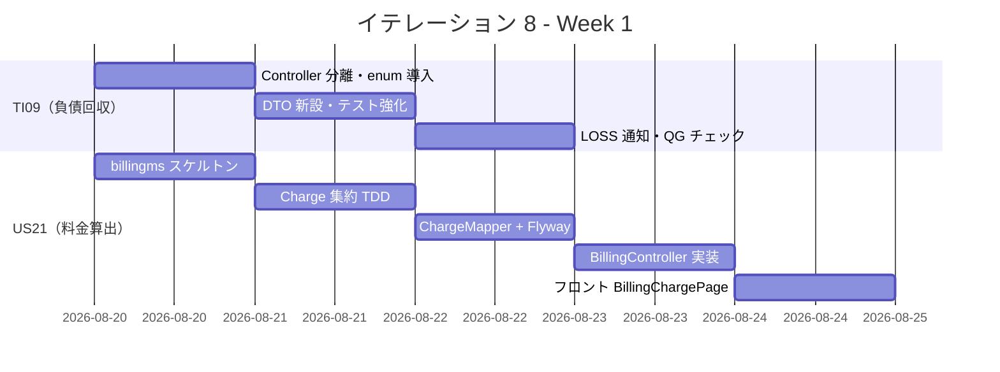

| 日 | タスク |
|----|--------|
| Day 1（08-20） | TI09: TrackingExceptionController 分離・ExceptionType enum 導入 |
| Day 2（08-21） | TI09: DTO 新設・ArgumentCaptor テスト・AggregateTestFixture 追加 |
| Day 3（08-22） | TI09: LOSS 通知ログ + SonarQube QG 確認、US21: billingms スケルトン作成 |
| Day 4（08-25） | US21: Charge 集約（コマンド・イベント）TDD |
| Day 5（08-26） | US21: ChargeMapper + Flyway マイグレーション + BillingController 実装 |

### Week 2（2026-08-27〜09-02）

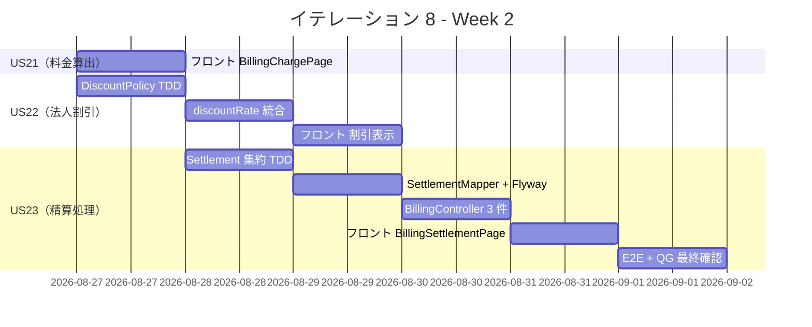

| 日 | タスク |
|----|--------|
| Day 6（08-27） | US21: フロント BillingChargePage 実装、US22: DiscountPolicy TDD |
| Day 7（08-28） | US22: discountRate 統合 + フロント割引表示、US23: Settlement 集約 TDD |
| Day 8（08-29） | US23: SettlementMapper + Flyway マイグレーション |
| Day 9（09-01） | US23: BillingController 3 件 + フロント BillingSettlementPage |
| Day 10（09-02） | E2E テスト・SonarQube QG 最終確認・Release 1.1 タグ付け |

---

## 設計

### ドメインモデル（billingms）

> `domain-model.md` の Billing Context に準拠する。`Invoice` 集約 1 本で料金確定〜精算完了まで管理し、`FareCalculator`（輸送料金算出）と `CorporateDiscountPolicy`（法人割引）を独立したドメインサービスとして実装する。`billingms` は `trackingms` の `CargoDeliveredEvent` を購読して Invoice を初期化する（Event 駆動 ACL）。

```plantuml
@startuml
title Billing Context（IT8 実装スコープ）

package "billingms" {
  class Invoice <<Aggregate Root>> {
    - invoiceId: InvoiceId
    - bookingId: BookingId
    - shipperId: ShipperId
    - basicAmount: Money
    - discountAmount: Money
    - adjustmentAmount: Money
    - totalAmount: Money
    - billingStatus: BillingStatus
    - paymentDue: LocalDate
    - paidAt: LocalDateTime (optional)
    - invoiceNumber: String (optional)
    - cancellationReason: String (optional)
    + handle(CalculateInvoiceCommand): void
    + handle(ApplyDiscountCommand): void
    + handle(IssueInvoiceCommand): void
    + handle(RecordPaymentCommand): void
    + handle(MarkOverdueCommand): void
  }

  enum BillingStatus {
    PENDING
    CALCULATED
    INVOICED
    PAID
    OVERDUE
    CANCELLED
  }

  class InvoiceId <<Value Object>> {
    - value: String  ' UUID
  }

  class BookingId <<Value Object>> {
    - value: String
  }

  class ShipperId <<Value Object>> {
    - value: String
  }

  class Money <<Value Object>> {
    - amount: BigDecimal
    - currency: Currency
    + add(other: Money): Money
    + multiply(rate: BigDecimal): Money
    + subtract(other: Money): Money
  }

  class CalculateInvoiceCommand {
    + @TargetAggregateIdentifier invoiceId: String
    + transportRecord: TransportRecord
    + cargoSpecification: CargoSpecification
  }

  class ApplyDiscountCommand {
    + @TargetAggregateIdentifier invoiceId: String
    + discountRate: BigDecimal
    + discountReason: String
  }

  class IssueInvoiceCommand {
    + @TargetAggregateIdentifier invoiceId: String
    + paymentDue: LocalDate
    + issuedAt: LocalDateTime
  }

  class RecordPaymentCommand {
    + @TargetAggregateIdentifier invoiceId: String
    + paymentId: String
    + paidAmount: Money
    + paymentMethod: String
    + externalReference: String
  }

  class MarkOverdueCommand {
    + @TargetAggregateIdentifier invoiceId: String
    + markedAt: LocalDateTime
  }

  class InvoiceCreatedEvent {
    + invoiceId: InvoiceId
    + bookingId: BookingId
    + shipperId: ShipperId
    + createdAt: LocalDateTime
  }

  class InvoiceCalculatedEvent {
    + invoiceId: InvoiceId
    + basicAmount: Money
    + adjustmentAmount: Money
    + totalAmount: Money
    + calculatedAt: LocalDateTime
  }

  class DiscountAppliedEvent {
    + invoiceId: InvoiceId
    + discountAmount: Money
    + discountRate: BigDecimal
    + discountReason: String
    + totalAmountAfterDiscount: Money
  }

  class InvoiceIssuedEvent {
    + invoiceId: InvoiceId
    + invoiceNumber: String
    + paymentDue: LocalDate
    + totalAmount: Money
    + issuedAt: LocalDateTime
  }

  class PaymentRecordedEvent {
    + invoiceId: InvoiceId
    + paymentId: String
    + paidAmount: Money
    + paidAt: LocalDateTime
    + paymentMethod: String
  }

  class InvoiceOverdueEvent {
    + invoiceId: InvoiceId
    + paymentDue: LocalDate
    + markedAt: LocalDateTime
  }

  class FareCalculator <<Domain Service>> {
    + calculate(transport: TransportRecord, cargoSpec: CargoSpecification): Money
    ' 距離 × 重量 × 品目係数 + 荷役費用
  }

  class CorporateDiscountPolicy <<Domain Service>> {
    + apply(basic: Money, contract: CorporateContract): Money
    + getDiscountRate(contract: CorporateContract): BigDecimal
    ' 割引率 0〜30%（法人契約のみ、個人は 0%）
  }

  class TransportRecord <<Value Object>> {
    - routeDistance: BigDecimal (km)
    - grossWeight: BigDecimal (kg)
    - handlingCount: int
    - handlingFee: Money
  }

  class CargoSpecification <<Value Object>> {
    - cargoType: CargoType
    - specialHandling: boolean
    - surchargeRate: BigDecimal
  }

  class CorporateContract <<Value Object>> {
    - shipperId: ShipperId
    - shipperType: ShipperType  ' CORPORATE / INDIVIDUAL
    - contractedDiscountRate: BigDecimal  ' 0.00〜0.30
  }

  enum CargoType {
    GENERAL
    REFRIGERATED
    HAZARDOUS
    OVERSIZED
  }

  enum ShipperType {
    CORPORATE
    INDIVIDUAL
  }

  Invoice *-- InvoiceId
  Invoice *-- BookingId
  Invoice *-- ShipperId
  Invoice *-- BillingStatus
  Invoice *-- Money
  Invoice ..> CalculateInvoiceCommand
  Invoice ..> ApplyDiscountCommand
  Invoice ..> IssueInvoiceCommand
  Invoice ..> RecordPaymentCommand
  Invoice ..> MarkOverdueCommand
  Invoice ..> InvoiceCreatedEvent
  Invoice ..> InvoiceCalculatedEvent
  Invoice ..> DiscountAppliedEvent
  Invoice ..> InvoiceIssuedEvent
  Invoice ..> PaymentRecordedEvent
  Invoice ..> InvoiceOverdueEvent
  FareCalculator ..> TransportRecord
  FareCalculator ..> CargoSpecification
  FareCalculator ..> Money
  CorporateDiscountPolicy ..> CorporateContract
  CorporateDiscountPolicy ..> Money
  TransportRecord *-- CargoSpecification
}

note bottom of FareCalculator
  料金算出式:
  基本料金 = 距離(km) × 重量(kg) × 品目係数
  荷役費用 = handlingCount × 基本荷役単価
  調整額 = specialHandling ? surchargeRate × 基本料金 : 0
end note

note bottom of CorporateDiscountPolicy
  IT6 ADR-0012 準拠: billingms は
  trackingms の CargoDeliveredEvent を
  購読して Invoice を自動生成する。
  荷主種別は ACL（CargoSnapshot ACL）
  で取得した CorporateContract に基づく。
end note
@enduml
```

| UC | 主集約 / サービス | 主コマンド | 主イベント | 状態遷移 |
|----|-----------------|-----------|-----------|---------|
| S22 請求一覧（US21） | billingms.`Invoice` | - | `InvoiceCreatedEvent` | `PENDING`（CargoDeliveredEvent 購読で自動生成）|
| UC 輸送料金算出（US21） | billingms.`Invoice` + `FareCalculator` | `CalculateInvoiceCommand` | `InvoiceCalculatedEvent` | `PENDING` → `CALCULATED` |
| UC 法人割引適用（US22） | billingms.`Invoice` + `CorporateDiscountPolicy` | `ApplyDiscountCommand` | `DiscountAppliedEvent` | `CALCULATED`（金額更新・状態変化なし）|
| S24 精算書発行（US23） | billingms.`Invoice` | `IssueInvoiceCommand` | `InvoiceIssuedEvent` | `CALCULATED` → `INVOICED` |
| S25 督促一覧（US23） | billingms.`Invoice` | `MarkOverdueCommand` | `InvoiceOverdueEvent` | `INVOICED` → `OVERDUE` |
| UC 入金確認（US23） | billingms.`Invoice` | `RecordPaymentCommand` | `PaymentRecordedEvent` | `INVOICED`/`OVERDUE` → `PAID` |

> **domain-model.md への反映が必要な変更点（IT8 完了時に同期）**:
>
> - `InvoiceCreatedEvent` を追加（billingms 自動生成トリガー）
> - `TransportRecord` / `CargoSpecification` / `CorporateContract` 値オブジェクトを追加
> - `CargoType` / `ShipperType` enum を追加
> - `FareCalculator` の算出式を注記に追加

### BillingStatus 状態遷移

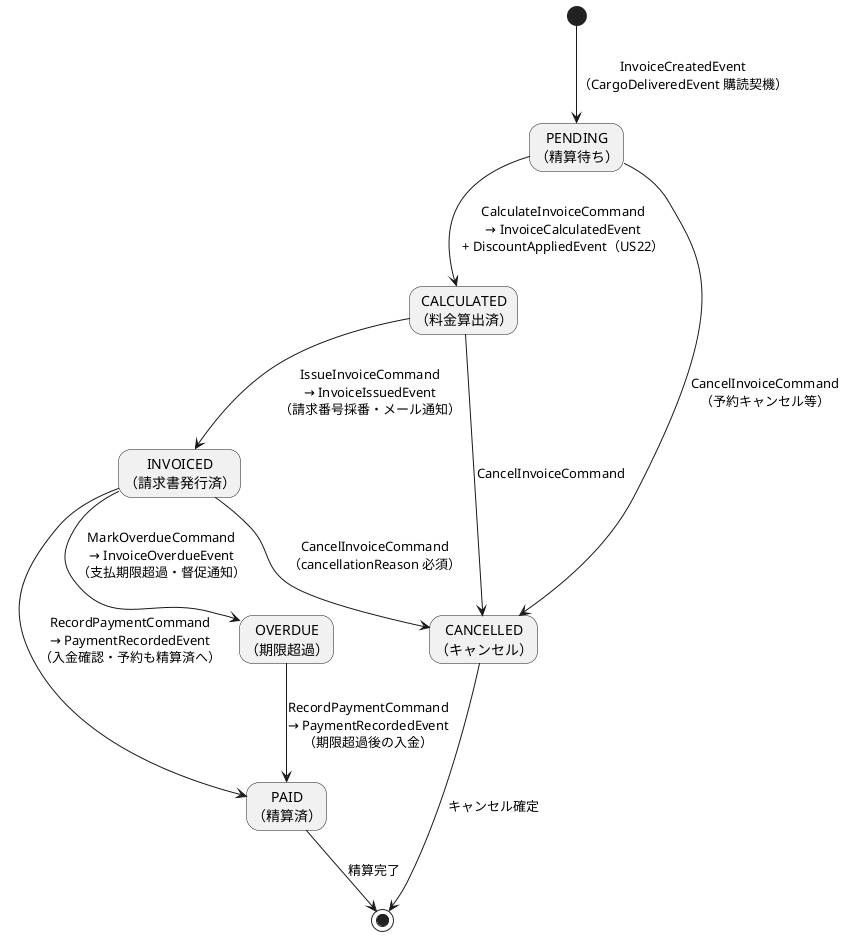

### Aggregate 間の Event 連携（クロスサービス）

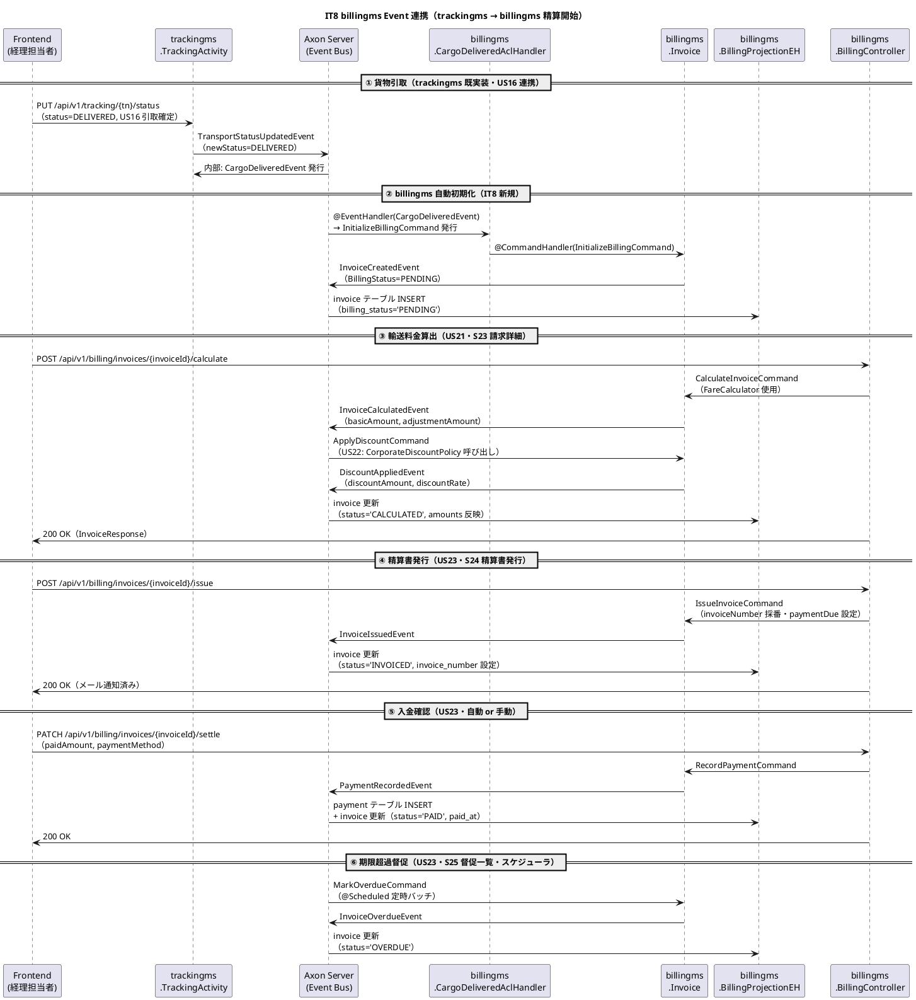

### データモデル

> `data-model.md` の `billingms（billing_read_db）` 定義に準拠する。PK は `invoice_id: VARCHAR(36)`（UUID）で BIGSERIAL は使用しない。`invoice_line` は行番号複合 PK。

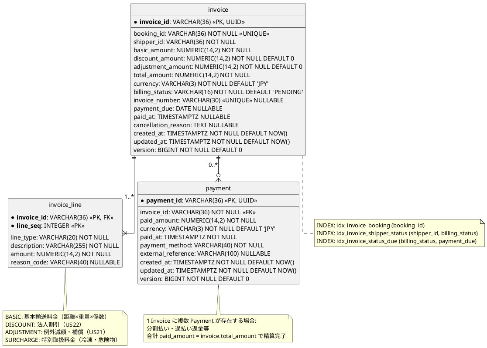

### API 設計

| メソッド | エンドポイント | 説明 | US |
|---------|---------------|------|----|
| `GET` | `/api/v1/billing/invoices` | 請求一覧（S22） | US21 |
| `GET` | `/api/v1/billing/invoices/{invoiceId}` | 請求詳細（S23） | US21 |
| `POST` | `/api/v1/billing/invoices/{invoiceId}/calculate` | 輸送料金算出・確定 | US21 |
| `POST` | `/api/v1/billing/invoices/{invoiceId}/issue` | 精算書発行（S24） | US23 |
| `PATCH` | `/api/v1/billing/invoices/{invoiceId}/settle` | 入金確認・精算完了 | US23 |
| `GET` | `/api/v1/billing/invoices/overdue` | 督促一覧（S25） | US23 |

#### GET /api/v1/billing/invoices レスポンス例（S22 請求一覧）

```json
{
  "invoices": [
    {
      "invoiceId": "b3c7d2e1-...",
      "bookingId": "B-2026-0512-001",
      "shipperId": "SHP-001",
      "totalAmount": { "amount": 125000, "currency": "JPY" },
      "billingStatus": "CALCULATED",
      "invoiceNumber": null,
      "paymentDue": null,
      "createdAt": "2026-08-25T10:00:00"
    }
  ],
  "total": 1
}
```

#### GET /api/v1/billing/invoices/{invoiceId} レスポンス例（S23 請求詳細）

```json
{
  "invoiceId": "b3c7d2e1-...",
  "bookingId": "B-2026-0512-001",
  "shipperId": "SHP-001",
  "basicAmount": { "amount": 150000, "currency": "JPY" },
  "discountAmount": { "amount": 30000, "currency": "JPY" },
  "adjustmentAmount": { "amount": -5000, "currency": "JPY" },
  "totalAmount": { "amount": 115000, "currency": "JPY" },
  "billingStatus": "CALCULATED",
  "lines": [
    { "lineType": "BASIC", "description": "基本輸送料金（1500km × 2000kg × 0.05）", "amount": 150000 },
    { "lineType": "DISCOUNT", "description": "法人割引（20%）", "amount": -30000, "reasonCode": "CORP_DISCOUNT" },
    { "lineType": "ADJUSTMENT", "description": "遅延補償（DELAY例外対応）", "amount": -5000, "reasonCode": "DELAY_COMPENSATION" }
  ]
}
```

### ユーザーインターフェース

#### ビュー（画面構成）

`ui_design.md` の画面一覧に準拠する。S22〜S25 が IT8 で新規実装される請求・精算画面。

| 画面 ID | 画面名 | パス | 実装内容 | US |
|--------|-------|------|---------|-----|
| S22 | 請求一覧 | `/billing` | IT8 で新規実装 — invoice 一覧・BillingStatus フィルタ・S23 への遷移 | US21 |
| S23 | 請求詳細・算出 | `/billing/:invoiceId` | IT8 で新規実装 — 輸送実績表示・料金算出・確定操作・invoice_line 明細 | US21/US22 |
| S24 | 精算書発行 | `/billing/:invoiceId/issue` | IT8 で新規実装 — 精算書プレビュー・支払期限設定・メール通知 | US23 |
| S25 | 督促一覧 | `/billing/overdue` | IT8 で新規実装 — 期限超過 Invoice 一覧・督促メール送信 | US23 |

#### ワイヤーフレーム（PlantUML salt）

共通ヘッダー（`{ / **CargoTracker** | メニュー... | [ログアウト] }`）とサイドナビは全画面共通のため省略する。

##### S22: 請求一覧

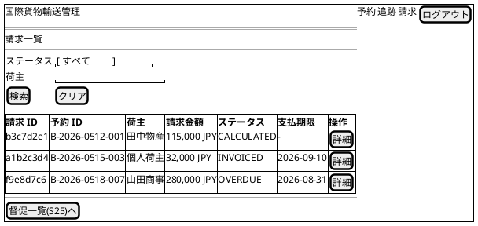

##### S23: 請求詳細・算出

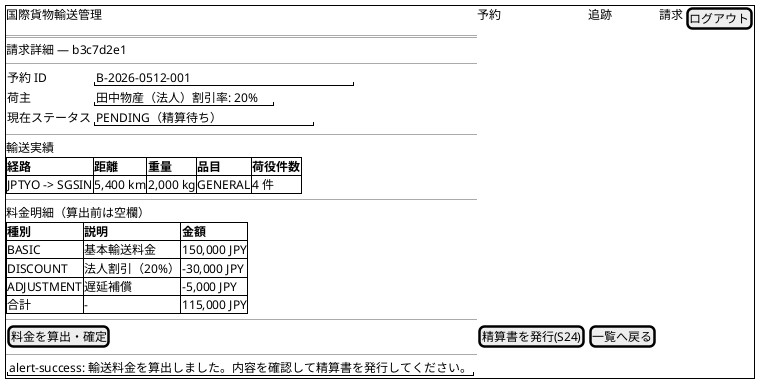

##### S24: 精算書発行

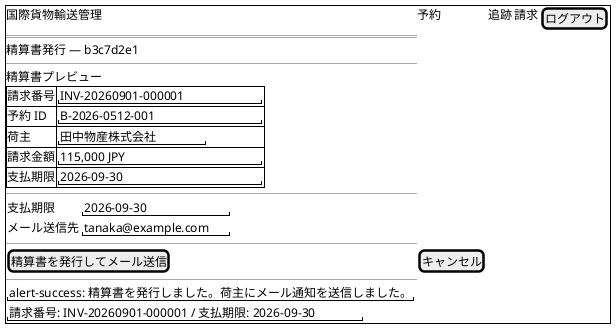

##### S25: 督促一覧

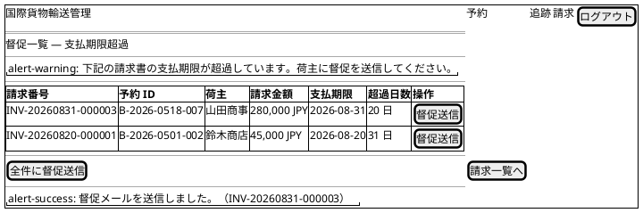

#### インタラクション（画面遷移と React Query パターン）

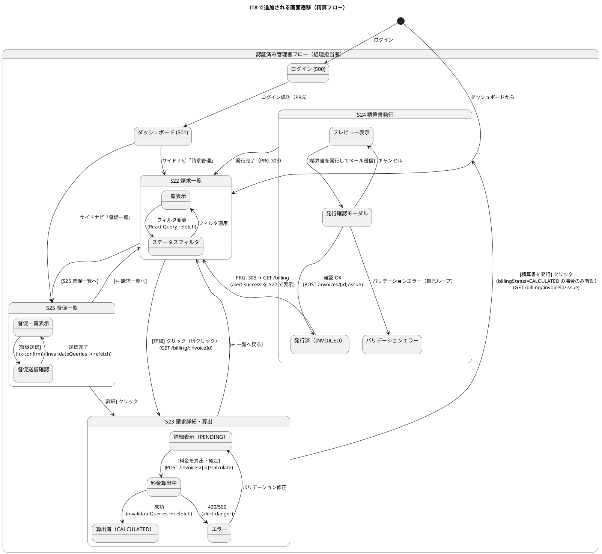

> **React Query / invalidateQueries 規約**:
>
> - 料金算出（`POST /calculate`）成功後は `invalidateQueries(['invoice', invoiceId])` で S23 を自動リフレッシュ（Read Model の Eventual Consistency 待ち: 最大 3 回指数バックオフ）
> - 精算書発行（`POST /issue`）成功後は PRG パターン: 303 リダイレクト → GET /billing（`invalidateQueries(['invoices'])`）で S22 一覧を自動リフレッシュ
> - 督促送信（`PATCH /overdue`）成功後は `invalidateQueries(['invoices', 'overdue'])` で S25 一覧を自動リフレッシュ
> - API エラー（400/500）は `alert-danger` で表示、ローディング中は `alert-info` でスピナー表示
> - 入金確認（`PATCH /settle`）は外部決済機関からの Webhook を想定し、管理者手動入力画面から `RecordPaymentCommand` を発行する

### ADR

| ADR | タイトル | ステータス |
|-----|---------|-----------|
| ADR-0014（既存） | shared モジュール Event クラス管理 | 承認済み |
| ADR-XXXX（新規検討） | billingms 新設 + Database-per-Service（billing_read_db） | 提案 |

> **ADR-0014 関連**: `CargoDeliveredEvent` を trackingms → billingms 間で共有するため、`shared` モジュールへの昇格が必要か検討する。IT7 の ADR-0014（shared モジュール Event クラス管理）の決定に従う。

### ディレクトリ構成（新規: billingms）

```
apps/backend/billingms/
├── src/main/java/com/example/cargotracker/billingms/
│   ├── BillingApplication.java
│   ├── domain/
│   │   ├── model/
│   │   │   ├── aggregates/
│   │   │   │   └── Invoice.java
│   │   │   ├── commands/
│   │   │   │   ├── CalculateInvoiceCommand.java
│   │   │   │   ├── ApplyDiscountCommand.java
│   │   │   │   ├── IssueInvoiceCommand.java
│   │   │   │   ├── RecordPaymentCommand.java
│   │   │   │   ├── MarkOverdueCommand.java
│   │   │   │   └── CancelInvoiceCommand.java
│   │   │   ├── events/
│   │   │   │   ├── InvoiceCreatedEvent.java
│   │   │   │   ├── InvoiceCalculatedEvent.java
│   │   │   │   ├── DiscountAppliedEvent.java
│   │   │   │   ├── InvoiceIssuedEvent.java
│   │   │   │   ├── PaymentRecordedEvent.java
│   │   │   │   ├── InvoiceOverdueEvent.java
│   │   │   │   └── InvoiceCancelledEvent.java
│   │   │   ├── valueobjects/
│   │   │   │   ├── InvoiceId.java
│   │   │   │   ├── BookingId.java
│   │   │   │   ├── ShipperId.java
│   │   │   │   ├── Money.java
│   │   │   │   ├── BillingStatus.java          (enum)
│   │   │   │   ├── CargoType.java              (enum)
│   │   │   │   ├── ShipperType.java            (enum)
│   │   │   │   ├── TransportRecord.java
│   │   │   │   ├── CargoSpecification.java
│   │   │   │   └── CorporateContract.java
│   │   │   └── services/
│   │   │       ├── FareCalculator.java
│   │   │       └── CorporateDiscountPolicy.java
│   │   └── ports/
│   │       └── InvoiceRepository.java
│   ├── application/
│   │   └── eventhandlers/
│   │       ├── CargoDeliveredAclHandler.java   (CargoDeliveredEvent 購読 → InitializeBillingCommand)
│   │       └── BillingProjectionEventHandler.java (Invoice* イベント → Read Model 更新)
│   ├── infrastructure/
│   │   ├── persistence/
│   │   │   ├── InvoiceMapper.java              (MyBatis)
│   │   │   ├── InvoiceRecord.java
│   │   │   ├── InvoiceLineMapper.java
│   │   │   ├── InvoiceLineRecord.java
│   │   │   ├── PaymentMapper.java
│   │   │   ├── PaymentRecord.java
│   │   │   └── MyBatisInvoiceRepository.java
│   │   └── config/
│   │       └── AxonJdbcConfig.java
│   └── interfaces/
│       └── rest/
│           ├── BillingController.java
│           └── dto/
│               ├── InvoiceResponse.java
│               ├── InvoiceListResponse.java
│               ├── InvoiceLineResponse.java
│               ├── CalculateInvoiceRequest.java
│               ├── IssueInvoiceRequest.java
│               └── RecordPaymentRequest.java
└── src/main/resources/
    ├── application.yml                         (ポート 8087)
    ├── application-local-h2.yml
    ├── application-local-docker.yml
    ├── application-heroku.yml
    ├── mybatis/mapper/
    │   ├── InvoiceMapper.xml
    │   ├── InvoiceLineMapper.xml
    │   └── PaymentMapper.xml
    └── db/migration/
        ├── V001__create_invoice_table.sql
        ├── V002__create_invoice_line_table.sql
        └── V003__create_payment_table.sql
```

> handlingms / trackingms と同一責務階層を踏襲（domain / application / infrastructure / interfaces）。`CargoDeliveredAclHandler` が trackingms の `CargoDeliveredEvent` を購読して Invoice を自動生成する点が特徴。`BillingProjectionEventHandler` は CQRS の Query 側 Read Model 更新を担う。`Invoice` 集約自体は Axon Event Store に永続化される。

---

## リスクと対策

| リスク | 影響度 | 対策 |
|--------|--------|------|
| billingms の新規マイクロサービス作成が想定より時間がかかる | 高 | IT7 の bookingms/trackingms スケルトンを参考に同一パターンで実装。不明点は早期に spike |
| US22 法人割引が SP 不足でバッファ消費になる | 中 | US22 を最初からバッファとして計画。US21/US23 優先で着手。残時間に応じて実装 |
| SonarQube QG がカバレッジ未達で失敗する | 中 | TI09 で既存テストを強化してから新機能実装。billingms のカバレッジ目標 80% 以上を設定 |
| Release 1.1 E2E が既存シナリオとの組み合わせで失敗する | 低 | 精算フロー E2E を最終日に集中実施。リグレッションは Day 9 に確認 |

---

## 完了条件

### Definition of Done

- [ ] TI09 全タスク完了（TrackingController 分離・enum 導入・LOSS 通知・テスト仕様化）
- [ ] US21 / US23 受入条件を全て満たす
- [ ] US22 受入条件を全て満たす（バッファ実施時）
- [ ] Backend / Frontend 全テストがパス
- [ ] SonarQube Quality Gate PASS（new_coverage 80% 以上、violations 0）
- [ ] E2E テスト全通過（既存 13 シナリオ + 精算フロー新規追加）
- [ ] `git tag Release-1.1` を打ち、GitHub Release を作成

### デモ項目

1. TrackingController 分離後の API 動作確認（例外登録・解決エンドポイント）
2. 輸送料金算出（「引取済」予約 → S23 料金算出・確定）
3. 法人割引自動適用（割引前・割引後・割引率の根拠表示）
4. 精算フロー（PENDING → CONFIRMED → SETTLED、S24 精算書発行・S25 督促一覧）
5. SonarQube QG PASS ダッシュボード確認

---

## 更新履歴

| 日付 | 更新内容 | 更新者 |
|------|---------|--------|
| 2026-05-20 | 初版作成 | AI Agent |
| 2026-05-20 | 整合性検証による修正: US21/US22/US23 ストーリー文・受入条件を user_story.md に合わせ修正（引取済状態・割引率 0〜30%・メール通知・督促通知）。エンティティ名を Charge/Settlement → Invoice（domain-model.md 準拠）に修正。DB スキーマを invoice/payment テーブル（data-model.md 準拠）に修正。画面 ID を S20/S21 → S22〜S25（ui_design.md 準拠）に修正。 | AI Agent |
| 2026-05-20 | 設計セクション全面拡充（IT6 計画レベルに準拠）: Invoice 集約詳細クラス図（コマンド・イベント・値オブジェクト全定義）・BillingStatus 状態遷移図（PENDING→CALCULATED→INVOICED→PAID/OVERDUE/CANCELLED）・Aggregate 間 Event 連携シーケンス図（CargoDeliveredEvent→billingms 自動初期化）・UC↔Aggregate マッピング表・詳細 ER 図（invoice/invoice_line/payment・制約・インデックス含む）・API 設計（JSON レスポンス例付き）・ワイヤーフレーム S22〜S25（PlantUML salt）・インタラクション図（React Query/invalidateQueries パターン）・ADR セクション・billingms ディレクトリ構成。タスク 3.1 の状態遷移を BillingStatus（CALCULATED→INVOICED→PAID/OVERDUE）に修正。 | AI Agent |

---

## 関連ドキュメント

- [イテレーション 7 完了報告書](./iteration_report-7.md)
- [イテレーション 7 ふりかえり](./retrospective-7.md)
- [リリース計画](./release_plan.md)
