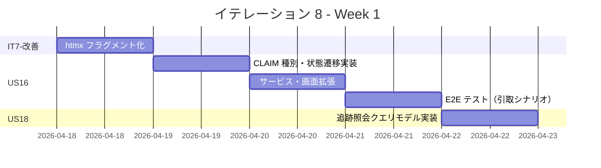
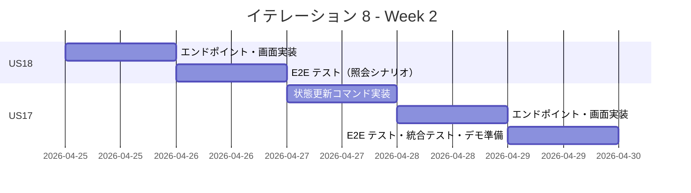
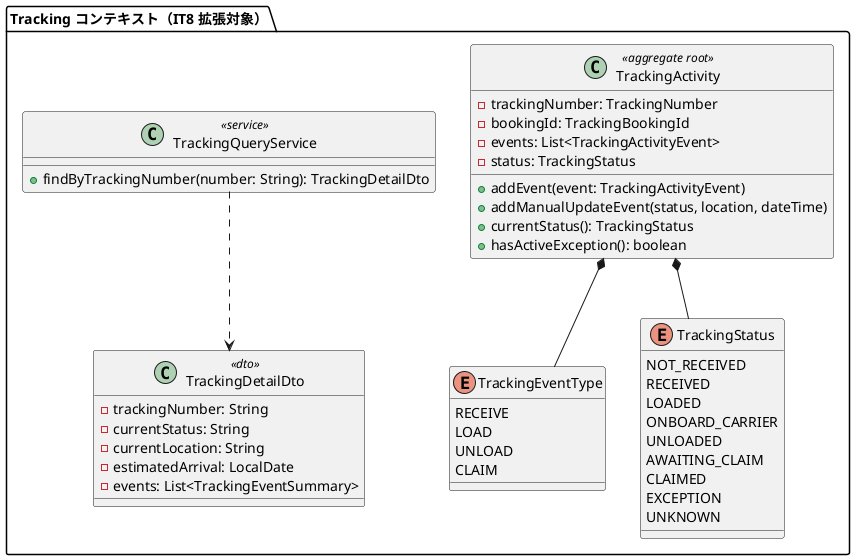
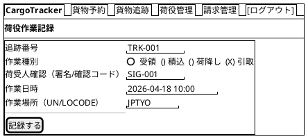
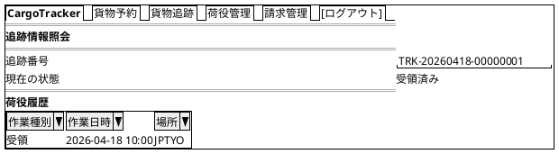
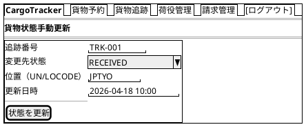
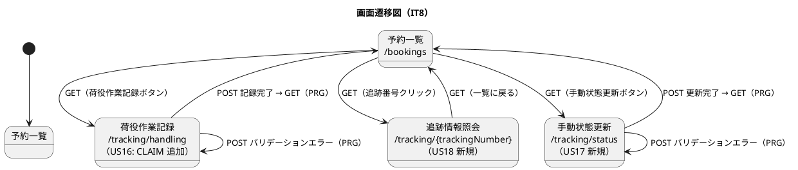

# イテレーション 8 計画

## 概要

| 項目 | 内容 |
|------|------|
| **イテレーション** | 8 |
| **期間** | Week 15-16（2026-04-18 〜 2026-05-01） |
| **ゴール** | 引取作業記録・追跡情報照会・貨物状態手動更新を完成させ、Phase 2 追跡機能を完結させる |
| **目標 SP** | 10 |

---

## ゴール

### イテレーション終了時の達成状態

1. **IT7-改善完了**: htmx フラグメントを `th:fragment` で実装し、`display:none` 廃止によって DOM の意味的整合性を向上させる
2. **US16 完了**: 追跡番号で貨物を特定し、引取作業を記録すると貨物状態が「引取済み」に更新される
3. **US18 完了**: 追跡番号を入力すると現在の輸送状況と荷役履歴が一覧表示される
4. **US17 完了**: 追跡管理者が追跡番号と変更先の状態を指定して貨物状態を手動更新できる

### 成功基準

- [ ] `display:none` 廃止・`th:fragment` 化が完了している
- [ ] 引取作業（CLAIM）を記録できる
- [ ] 記録後、貨物状態が「引取済み（CLAIMED）」に更新される
- [ ] 追跡番号で追跡情報（現在状態・荷役履歴）を照会できる
- [ ] 追跡管理者が貨物状態を手動で更新できる
- [ ] テストカバレッジ 80% 以上

---

## ユーザーストーリー

### 対象ストーリー

| ID | ユーザーストーリー | SP | 優先度 |
|----|-------------------|----|--------|
| IT7-改善 | IT7 申し送り事項対応（htmx フラグメント化） | 1 | 必須 |
| US16 | 引取作業を記録する | 3 | 必須 |
| US18 | 追跡情報を照会する | 3 | 必須 |
| US17 | 貨物状態を手動更新する | 3 | 中 |
| **合計** | | **10** | |

### ストーリー詳細

#### IT7-改善: htmx フラグメント化

**対応内容**:

- T4: `display:none` 使用箇所を `th:fragment` + `hx-select` パターンに置換（IT6・IT7 から持ち越し）

#### US16: 引取作業を記録する

**ストーリー**:
> 荷役作業員として、荷受人が貨物を引き取る際に、荷受人の確認（署名または確認コード）を取得して引取作業を記録したい。なぜなら、荷受人への正式な引き渡しを証明し、配送完了を記録できるからだ。

**受入条件**:

1. 作業種別「引取」を選択すると、荷受人確認フィールド（署名または確認コード）が表示される
2. 荷受人確認が取得されると引取作業が記録される
3. 記録後、貨物状態が「引取済み（CLAIMED）」に更新される
4. 貨物状態「引取済み」は配送完了を意味し、精算処理の開始条件となる
5. 追跡番号が存在しない場合、エラーメッセージが表示される

#### US18: 追跡情報を照会する

**ストーリー**:
> 荷主（または荷受人）として、追跡番号を入力して貨物の現在位置・状態・追跡イベント履歴・推定到着日を確認したい。なぜなら、輸送状況をいつでも自分で確認でき、到着準備や業務計画に役立てるからだ。

**受入条件**:

1. 追跡番号を入力して貨物情報を照会できる
2. 現在の状態・位置（港湾名）・推定到着日が表示される
3. 追跡イベント履歴（日時・場所・作業種別）が時系列で表示される
4. 追跡番号が存在しない場合、「追跡番号が見つかりません」と表示される
5. ログインなしでも追跡番号があれば照会できる（公開追跡 /public/tracking/{trackingNumber}）

#### US17: 貨物状態を手動更新する

**ストーリー**:
> 追跡管理者として、追跡番号を指定して貨物の状態・位置・更新日時を手動で更新したい。なぜなら、荷役作業員の記録だけでは捕捉できない状態変化（出港・入港等）を追跡情報に反映できるからだ。

**受入条件**:

1. 追跡番号を指定して現在の貨物情報を確認できる
2. 新しい状態・位置・日時を入力して追跡情報を更新できる
3. 更新後、追跡イベントが履歴に記録される
4. 追跡番号が存在しない場合、エラーメッセージが表示される
5. 状態変更の種類に応じて荷主への通知が送信される（※メールインフラ未整備のため IT10 以降で対応）

### タスク

#### 1. IT7-改善（1 SP）

| # | タスク | 見積もり | 担当 | 状態 |
|---|--------|---------|------|------|
| 1.1 | `display:none` 使用箇所の調査（billing/booking/routing 画面） | 1h | - | [ ] |
| 1.2 | `th:fragment` + `hx-select` パターンへの置換 | 2h | - | [ ] |

**小計**: 3h（理想時間）

#### 2. US16: 引取作業を記録する（3 SP）

| # | タスク | 見積もり | 担当 | 状態 |
|---|--------|---------|------|------|
| 2.1 | `TrackingEventType.CLAIM` 追加・`TrackingActivity` 状態遷移更新（UNLOADED → CLAIMED）（TDD） | 2h | - | [ ] |
| 2.2 | `TrackingApplicationService`: 引取作業記録処理追加（TDD） | 1h | - | [ ] |
| 2.3 | handling.html に CLAIM 種別を追加 | 1h | - | [ ] |
| 2.4 | E2E テスト: 引取作業記録シナリオ（handling.spec.ts 拡張） | 2h | - | [ ] |
| 2.5 | 統合テスト・バグ修正 | 2h | - | [ ] |

**小計**: 8h（理想時間）

#### 3. US18: 追跡情報を照会する（3 SP）

| # | タスク | 見積もり | 担当 | 状態 |
|---|--------|---------|------|------|
| 3.1 | `TrackingQueryService` + `TrackingDetailDto`（現在状態・位置・推定到着日・履歴）実装（TDD） | 2h | - | [ ] |
| 3.2 | GET /tracking/{trackingNumber} エンドポイント実装（認証あり） | 1h | - | [ ] |
| 3.3 | GET /public/tracking/{trackingNumber} エンドポイント実装（認証なし） | 1h | - | [ ] |
| 3.4 | Thymeleaf: 追跡情報照会画面（tracking-detail.html）実装・30 秒 htmx 自動更新 | 2h | - | [ ] |
| 3.5 | E2E テスト: 追跡情報照会シナリオ（tracking.spec.ts 拡張） | 2h | - | [ ] |

**小計**: 8h（理想時間）

#### 4. US17: 貨物状態を手動更新する（3 SP）

| # | タスク | 見積もり | 担当 | 状態 |
|---|--------|---------|------|------|
| 4.1 | `TrackingActivity.addManualUpdateEvent()` コマンド実装（状態・位置・日時を受け取る）（TDD） | 2h | - | [ ] |
| 4.2 | POST /tracking/status エンドポイント実装 | 1h | - | [ ] |
| 4.3 | Thymeleaf: 手動状態更新画面（tracking-status.html、位置・日時フィールド含む）実装 | 2h | - | [ ] |
| 4.4 | E2E テスト: 手動状態更新シナリオ（新規 status.spec.ts） | 2h | - | [ ] |

**小計**: 7h（理想時間）

#### タスク合計

| カテゴリ | SP | 理想時間 | 状態 |
|---------|----|------|------|
| IT7-改善 | 1 | 3h | [ ] |
| US16 引取作業記録 | 3 | 8h | [ ] |
| US18 追跡情報照会 | 3 | 8h | [ ] |
| US17 貨物状態手動更新 | 3 | 7h | [ ] |
| **合計** | **10** | **26h** | |

**1 SP あたり**: 約 2.6h
**進捗率**: 0% (0/10 SP)

---

## スケジュール

### Week 1（Day 1-5）



| 日 | タスク |
|----|--------|
| Day 1 | IT7-改善: htmx フラグメント化 |
| Day 2 | US16: CLAIM 種別・状態遷移実装（TDD） |
| Day 3 | US16: サービス拡張・handling.html 更新 |
| Day 4 | US16: E2E テスト・統合テスト |
| Day 5 | US18: 追跡照会クエリモデル実装（TDD） |

### Week 2（Day 6-10）



| 日 | タスク |
|----|--------|
| Day 6 | US18: エンドポイント・追跡情報照会画面実装 |
| Day 7 | US18: E2E テスト・バグ修正 |
| Day 8 | US17: 状態更新コマンド実装（TDD）・エンドポイント |
| Day 9 | US17: 手動状態更新画面実装 |
| Day 10 | US17: E2E テスト・統合テスト・バグ修正・デモ準備 |

---

## 設計

### ドメインモデル

> **注**: IT7 で構築した Tracking コンテキストを拡張する。US16 は `TrackingEventType.CLAIM` 追加と状態遷移更新、US18 は読み取りモデル（クエリサービス）追加、US17 は `overrideStatus()` コマンド追加。



### データモデル

> **注**: IT8 での DB マイグレーションは不要。既存の `tracking_activity` / `tracking_handling_event` テーブルで対応可能。US16 の CLAIM は `event_type = 'CLAIM'` として `tracking_handling_event` に記録する。US17 は `tracking_activity.transport_status` を直接更新する。

### ユーザーインターフェース

#### ビュー

##### 荷役作業記録画面 (/tracking/handling) — IT8 拡張

> **注**: 引取（CLAIM）選択時のみ荷受人確認フィールドを表示する（htmx による動的表示）。



##### 追跡情報照会画面 (/tracking/{trackingNumber}) — US18 新規



##### 手動状態更新画面 (/tracking/status) — US17 新規

> **注**: ui_design.md の画面一覧に未登録。IT8 完了時に ui_design.md を更新すること。



#### インタラクション



**フィードバックメッセージ**:

| 操作 | メッセージ | スタイル |
|------|----------|---------|
| 引取作業記録成功 | 「引取作業を記録しました。貨物状態: 引取済み」 | `alert-success` |
| 引取作業記録失敗（追跡番号不在） | 「追跡番号が見つかりません」 | `alert-danger` |
| 追跡番号照会失敗（不在） | 「追跡番号が見つかりません」 | `alert-danger` |
| 手動状態更新成功 | 「貨物状態を {status} に更新しました」 | `alert-success` |
| 手動状態更新失敗（追跡番号不在） | 「追跡番号が見つかりません」 | `alert-danger` |

### ディレクトリ構成

```
apps/backend/src/main/java/.../tracking/
├── domain/
│   └── model/
│       ├── TrackingActivity.java         (overrideStatus 追加)
│       ├── TrackingEventType.java        (CLAIM 追加)
│       └── TrackingStatus.java           (遷移ロジック更新)
├── application/
│   ├── TrackingApplicationService.java   (引取記録・状態更新追加)
│   └── TrackingQueryService.java         (US18 新規)
└── presentation/
    ├── TrackingThymeleafController.java  (追跡照会・状態更新エンドポイント追加)
    └── dto/
        └── TrackingDetailDto.java        (US18 新規)

apps/frontend/src/templates/tracking/
├── handling.html                         (CLAIM 種別追加)
├── tracking-detail.html                  (US18 新規)
└── tracking-status.html                  (US17 新規)

apps/e2e/tests/
├── tracking.spec.ts                      (US18 照会シナリオ追加)
├── handling.spec.ts                      (US16 引取シナリオ追加)
└── status.spec.ts                        (US17 手動更新シナリオ 新規)
```

### API 設計

| メソッド | エンドポイント | 認証 | 説明 |
|---------|---------------|------|------|
| POST | /tracking/handling | 要 | 荷役作業を記録する（CLAIM 種別・荷受人確認追加） |
| GET | /tracking/{trackingNumber} | 要 | 追跡情報を照会する（US18 新規） |
| GET | /public/tracking/{trackingNumber} | 不要 | 公開追跡照会（US18 受入条件 AC5） |
| POST | /tracking/status | 要 | 貨物状態を手動更新する（US17 新規） |

### データベーススキーマ

IT8 では新規マイグレーション不要。既存テーブルをそのまま利用する。

- `tracking_handling_event.event_type = 'CLAIM'` として引取作業を記録
- `tracking_activity.transport_status` を直接更新して手動状態変更を反映

---

## ストーリー間の依存関係

| 依存元 | 依存先 | 理由 |
|--------|--------|------|
| US17 | US16/US18 | 手動更新画面は追跡情報照会と合わせて動作確認が容易 |
| US18 | US14/US15 | IT7 で実装済みの追跡番号・荷役記録があるため照会データが存在する |

実装順序: IT7-改善 → US16（引取作業記録）→ US18（追跡情報照会）→ US17（手動状態更新）

## IT5 レビュー指摘事項の対応方針

IT7 で「IT8 以降で対応を検討する」とされた H-1〜H-3, H-5〜H-9 の対応方針を以下に示す。

| 指摘 # | 内容 | IT8 対応方針 |
|--------|------|-------------|
| H-1 | `assignItinerary` に `requireStatus` EnumSet パターン適用 | IT8 スコープ外（Tracking コンテキスト実装優先）。IT9 へ持ち越し |
| H-2 | `assignItinerary` 完了時に `CargoRoutedEvent` 発行 | IT8 スコープ外。IT9 へ持ち越し |
| H-3 | `assignRoute` を `executeBookingCommand` パターンに統合 | IT8 スコープ外。IT9 へ持ち越し |
| H-5 | `routeDetail` の未使用 `bookingId` 削除 | IT8 スコープ外。IT9 へ持ち越し |
| H-6 | `BookingThymeleafControllerTest` セットアップを `@BeforeEach` に集約 | IT8 スコープ外。IT9 へ持ち越し |
| H-7 | `route.html` にフィードバックメッセージ表示領域を追加 | IT8 スコープ外。IT9 へ持ち越し |
| H-8 | US09-AC1 費用情報を経路一覧テーブルに表示する | IT8 スコープ外（受入基準未達成だが Tracking 優先）。IT9 へ持ち越し |
| H-9 | US11-AC1 予約詳細画面に割り当て済み経路情報を表示する | IT8 スコープ外（受入基準未達成）。IT9 へ持ち越し |

> **注**: H-8・H-9 はユーザーストーリーの受入基準未達成であるため、IT9 では最優先で対応すること。

## IT7 申し送り事項の対応方針

| 優先度 | 項目 | IT8 対応方針 |
|--------|------|-------------|
| 高 | US16 実装 | IT8 スコープとして実装する（本イテレーション対応） |
| 高 | US18 実装 | IT8 スコープとして実装する（本イテレーション対応） |
| 高 | US17 実装 | IT8 スコープとして実装する（本イテレーション対応） |
| 中 | htmx フラグメント | IT7-改善として IT8 冒頭タスクで対応する（本イテレーション対応） |
| 低 | メール通知スコープ | US14/US15 の通知要件は IT10 リリース準備フェーズで判断する |

## リスクと対策

| リスク | 影響度 | 対策 |
|--------|--------|------|
| US18 のクエリモデル設計が複雑化する | 中 | 読み取り専用 DTO を使ったシンプルな CQRS パターンで実装する |
| US17 の手動更新が不正な状態遷移を引き起こす | 中 | `TrackingActivity.overrideStatus()` でバリデーションを行い、無効な遷移はエラーとする |
| htmx フラグメント化による既存 E2E テストへの影響 | 低 | IT7-改善完了後に既存 E2E テスト全件パスを確認してから US16 に進む |

---

## 完了条件

### Definition of Done

- [ ] コードレビュー完了
- [ ] ユニットテストがパス（Java テスト件数 > IT7 完了時）
- [ ] E2E テストがパス（E2E テスト数 > 78 件）
- [ ] SonarQube Quality Gate PASS
- [ ] 機能がローカル環境で動作確認済み
- [ ] ドキュメント更新完了

### デモ項目

1. htmx フラグメント化（`display:none` 廃止）の確認
2. 荷役作業記録フォームで引取作業（CLAIM）を選択して記録
3. 記録後、貨物状態が「引取済み（CLAIMED）」に更新されることを確認
4. 追跡番号を入力して追跡情報照会（現在状態・荷役履歴）を確認
5. 手動状態更新で指定した状態に変更されることを確認

---

## 更新履歴

| 日付 | 更新内容 | 更新者 |
|------|---------|--------|
| 2026-04-17 | 初版作成 | - |
| 2026-04-17 | 整合性検証結果に基づく修正: US16（ストーリー文・荷受人確認フィールド・受入条件補完）、US17（ストーリー文・位置・日時フィールド・受入条件補完・メソッド名 overrideStatus→addManualUpdateEvent）、US18（荷受人アクター追加・現在位置・推定到着日・公開追跡 AC5・htmx 自動更新タスク追加）、IT5 指摘事項対応方針セクション追加、API 設計に公開追跡エンドポイント追加 | - |

---

## 関連ドキュメント

- [イテレーション 8 ふりかえり](./retrospective-8.md)
- [イテレーション 7 計画](./iteration_plan-7.md)
- [イテレーション 7 ふりかえり](./retrospective-7.md)
- [リリース計画](./release_plan.md)
