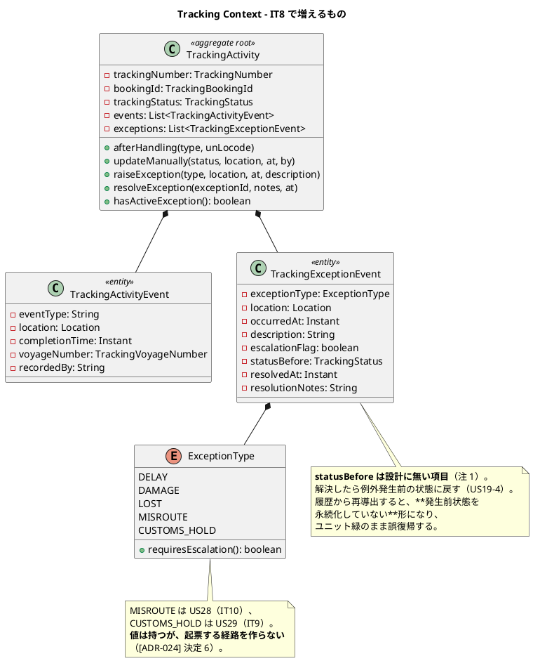
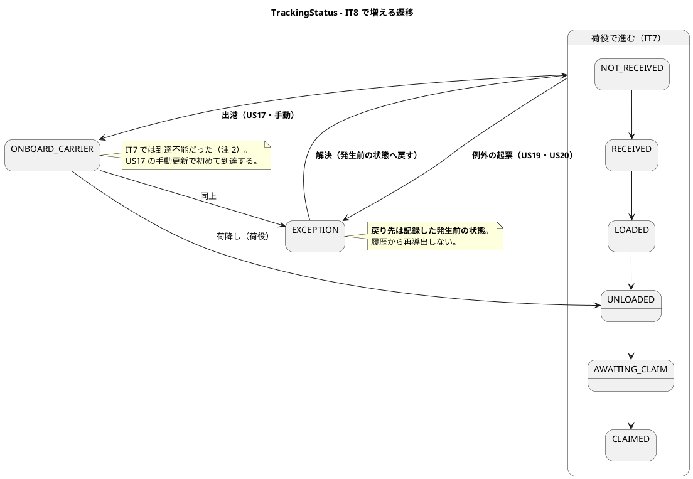
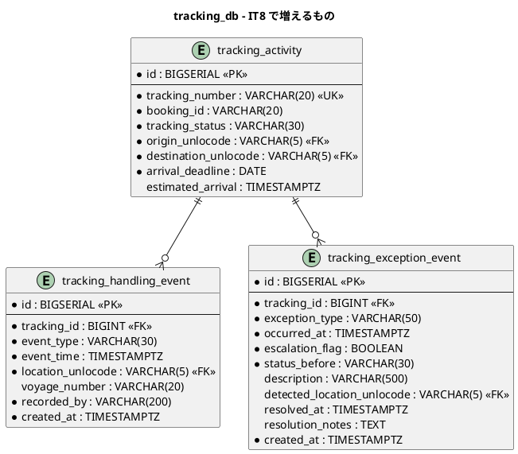
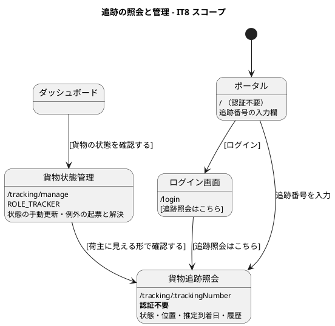

# イテレーション 8 計画

| 項目 | 内容 |
| :--- | :--- |
| イテレーション | IT8 |
| 期間 | 2026-08-24 〜 2026-09-06（2 週間） |
| 対象ストーリー | US17（貨物状態の手動更新）・US18（追跡情報の照会）・US19（遅延例外）・US20（破損・紛失例外） |
| 計画 SP | 9 |
| 局面 | **終盤（1 本目）／アウトサイドイン**（[開発戦略](development_strategy.md#終盤-アウトサイドインit8it12--release-10-後半20)） |
| 前提 | [IT7 完了報告書](iteration_report-7.md)・[IT7 ふりかえり](retrospective-7.md) |

## ゴール

**荷主が自分で貨物を追えるようになる。** 追跡番号を入れれば、ログインなしで現在の状態・位置・履歴・到着予定が見える。あわせて追跡管理者が、荷役では捕捉できない状態変化（出港・入港）を手で反映し、遅延・破損・紛失を例外として起票できるようになる。

**IT7 までは、追跡の状態を見られるのは DB とデモだけだった。**

### 成功基準

> **通知の「送信」は行いません。** メールの実体は入れず、**通知したという事実を記録し、荷主の画面で見える形**で代替します（US12・US15-5 と同じ形）。**代替であることを画面・マニュアル・完了報告書に明記します。**

| # | 基準 | 測り方 |
| :--- | :--- | :--- |
| 1 | **荷主がログインなしで追跡できる** | kind 統合環境で、荷役を記録 → 公開の追跡画面に**状態・位置・履歴・到着予定**が出るまでを 1 本で通す。ポータルとログイン画面の両方から辿れること |
| 2 | **例外が起票され、状態が戻せる** | 遅延・破損・紛失を起票すると状態が `EXCEPTION` になり、解決すると**例外発生前の状態に戻る**。「戻す」実装を消すと赤になること |
| 3 | **紛失だけが緊急として扱われる** | `LOST` で緊急フラグが立ち、他の種別では立たないことを対で固定する |
| 4 | **「〜しない」と書いた性質が、検査で固定されている**（[IT7 Try 1](retrospective-7.md)） | この IT で書いた否定形・保証形のコメントを数え、**同じ数の検査**があること。壊して赤を確認する |
| 5 | **値が層をまたいで生き延びる**（[IT7 Try 2](retrospective-7.md)） | 例外の緊急フラグ・解決の記録を、応答・イベント・画面のどこで潰しても赤になること |
| 6 | ドメイン層のカバレッジ 90% 以上 | 5 サービス + shared |

## 局面とアプローチ

**終盤の 1 本目（アウトサイドイン）。** [開発戦略](development_strategy.md)は終盤を「既存の集約・サービスを**業務シナリオ起点**で結合し、一気通貫を担保する」と定めている。IT8 で作るのは新しいドメインの塊ではなく、**現場の仕事が回る形への束ね直し**である。

受け入れテストから書く。デモ項目を先に E2E に翻訳し（Red）、画面と導線 → 既存サービスの拡張 → 新規ドメイン要素の順に埋める。

**[ADR-022](../adr/022-domain-event-contract.md) のイベント契約と [ADR-019](../adr/019-route-assignment-api.md) の ACL の型をそのまま写す。新しい結合方式を発明しない。** 発明が必要になったら ADR を起票してから実装する。

## 前イテレーションからの反映

### ふりかえりの Try（[retrospective-7.md](retrospective-7.md)）

| Try | 本 IT での落とし込み |
| :--- | :--- |
| 1. 「〜しない」と書いたコメントは、その場で壊して赤を確認する | **成功基準 4 に据えた**。IT7 は 3 件が「書いただけ」だった。**最も重い 1 件（追跡の巻き戻り）は、送り直す手段を同じ IT で自分が用意したために経路が実在した** |
| 2. 値が通る層を数え、端から端まで 1 本は通す | **成功基準 5 に据えた**。例外の緊急フラグは「表示のためだけに運ぶ値」で、IT7 の `offRoute` と同じ形 |
| 3. ADR のコンプライアンス表に「検査の場所」を書く | タスク 1.1・4.1 の完了条件。「〜を確かめる」ではなく「`XxxTest#yyy` が確かめる」と書く |
| 4. 画面を開いたロールが「何をできるか」を E2E で 1 本ずつ持つ | タスク 5.2。**IT7 は追跡管理者が `/handling` を開いても何もできなかった** |
| 5. 「たまに落ちる」を許さない | 常時。同じ失敗を 2 回見たら、そこで原因を追う |
| 6. 契約に「値の語彙」を含める | 返済枠 0.1。**3 本目のイベントが来る前**にやるのが最も安い |
| 7. レビューは 5 視点を独立に回す | クローズ時。IT7 は 3 視点が独立に同じ欠陥を指摘した |

### 引き継ぎ（返済枠・SP 対象外）

> **「余力次第」にしない。** IT7 は Day 1-3 に固めて 12 / 12 返せた。同じ形を続ける。

| # | 内容 | 見積 | 由来 |
| :--- | :--- | :--- | :--- |
| 0.1 | **契約に値の語彙と交換機の引数を含める**。本番コードを契約から導く（パス・システム主体がリテラルのまま） | 6h | IT7 Try 6・レビュー #22・#23 |
| 0.2 | **認可を呼んでいることの検査**。利用者ヘッダを受け取るメソッドは必ず認可を呼ぶ | 4h | IT7 レビュー #24 |
| 0.3 | **`ONBOARD_CARRIER` / `EXCEPTION` の扱いを決める**。「未知の種別」と「到達不能な値」が同じ「何も起きない」に落ちる状態を解消する | 3h | IT7 レビュー・**US17 / US20 の前提** |
| 0.4 | `TrackingEventRoundTripTest` を契約ごとに割る（2 契約で 330 行。US17 で 3 契約目） | 2h | IT7 レビュー #27 |
| 0.5 | 種別の妥当性検査が 2 か所（入口とユースケース） | 2h | IT7 レビュー #16 |
| 0.6 | `CargoSnapshot` の正準コンストラクタが public で検査を素通りできる | 1h | IT7 レビュー #28 |
| 0.7 | `restore` が null を返す静的ファクトリ（呼び出し側から見えない） | 2h | IT7 レビュー #29 |
| 0.8 | 荷役の重複記録の検出 | 3h | IT7 レビュー #25 |
| 0.9 | 引取の確認ダイアログ（種別が残るため、別の貨物に「引取」のまま記録する事故） | 3h | IT7 レビュー #12 |
| 0.10 | `publishesExactlyOneKindOfEvent` を ArchUnit と併せて迂回できなくする | 2h | IT7 レビュー #30 |
| **小計** | | **28h** | |

> **0.11（作業者に利用者 ID が出る）は IT8 でも行いません。** 氏名を出すには authms への照会が要り、**サービス間の呼び出しが 1 本増えます**。表示のためだけに結合を増やす判断は、通知の宛先（荷主の連絡先）をどう引くかと合わせて決めるべきで、そちらは US19 の中で扱います。**落とすことをここに書きます**——書かないと「忘れていた」と読まれます。

## 対象ストーリーと受入基準

### US17: 貨物状態を手動更新する（2 SP）

| # | 受入基準 | 本 IT での扱い |
| :--- | :--- | :--- |
| US17-1 | 追跡番号を指定して現在の貨物情報を確認できる | 実装 |
| US17-2 | 新しい状態・位置・日時を入力して追跡情報を更新できる | 実装。**戻る向きには更新できない**（[ADR-024] で決める。IT7 の巻き戻り対策と同じ規則） |
| US17-3 | 更新後、追跡イベントが履歴に記録される | 実装。**`tracking_handling_event` を新設**（IT7 まで履歴を持っていない） |
| US17-4 | 状態変更の種類に応じて荷主への通知が送信される | **代替**。通知の記録を残し、荷主の画面で見える形にする |

### US18: 追跡情報を照会する（3 SP）

| # | 受入基準 | 本 IT での扱い |
| :--- | :--- | :--- |
| US18-1 | 追跡番号を入力して貨物情報を照会できる | 実装 |
| US18-2 | 現在の状態・位置（港湾名）・推定到着日が表示される | 実装。**推定到着日は旅程の最終到着**（[ADR-024] 決定 4）。旅程が無ければ「未定」と出す |
| US18-3 | 追跡イベント履歴が時系列で表示される | 実装。荷役の記録と手動更新の両方が並ぶ |
| US18-4 | 追跡番号が存在しない場合、「追跡番号が見つかりません」と表示される | 実装。**総当たりへの対策を [ADR-024] で決める**（認証が無い唯一の入口） |
| US18-5 | ログインなしでも追跡番号があれば照会できる | 実装。**ポータルとログイン画面の両方から辿れること**（IT7 の「認証不要の画面は入口も認証の外に置く」） |

### US19: 遅延例外を処理する（2 SP）

| # | 受入基準 | 本 IT での扱い |
| :--- | :--- | :--- |
| US19-1 | 追跡番号と例外種別「遅延」・発生状況を記録できる | 実装 |
| US19-2 | 記録後、貨物状態が「例外発生」に更新される | 実装 |
| US19-3 | 荷主に遅延発生の通知が送信される | **代替**（US17-4 と同じ） |
| US19-4 | 対応内容を入力して荷主に対応報告を送信できる | 実装（記録まで）。**解決すると例外発生前の状態に戻る** |
| US19-5 | 例外対応履歴が記録される | 実装 |

### US20: 破損・紛失例外を処理する（2 SP）

| # | 受入基準 | 本 IT での扱い |
| :--- | :--- | :--- |
| US20-1 | 追跡番号と例外種別「破損」「紛失」・発生状況を記録できる | 実装。**荷役作業員にも開く**（US20 のアクターは「追跡管理者または荷役作業員」） |
| US20-2 | 記録後、貨物状態が「例外発生」に更新される | 実装（US19-2 と同じ） |
| US20-3 | 「紛失」は緊急フラグが立ち、管理職へ escalation 通知 | 実装（フラグと記録まで）。**通知の送信は代替** |
| US20-4 | 荷主に破損・紛失発生の通知が送信される | **代替** |
| US20-5 | 対応内容（補償方針等）を入力して荷主に報告を送信できる | 実装（記録まで） |

> **`MISROUTE`（誤配）と `CUSTOMS_HOLD`（税関保留）は IT8 では起票しません。** 前者は US28（IT10）、後者は US29（IT9）です。**列挙には値を持たせますが、起票する経路を作りません**——[ADR-024] に明記し、検査で固定します（[ADR-023](../adr/023-handling-activity-validation.md) 決定 5 と同じ形）。

## 設計

### ドメインモデル図（IT8 スコープ）

> **`TrackingActivityEvent` は IT8 で初めて作ります。** IT7 まで追跡は「いまの状態」しか持っておらず、**履歴がありません**。US18-3 が要求する時系列は、ここから作ります。

> **`TrackingLocation` は作りません。** 設計は BC 固有の位置情報型を挙げていますが、地点は共有カーネル（`Location`）で、trackingms はすでにそれを使っています。**いま型を増やす理由がありません**（注 3）。

### 状態遷移図（IT8 スコープ）

> **`UNKNOWN` は IT8 でも使いません。** 状態が読めない行のためのもので、業務の操作では到達しません。

### ER 図（IT8 スコープ）

> **`status_before` と `estimated_arrival` は[データモデル](../design/data-model.md)に無い列です**（注 1・注 4）。前者を持たないと解決時の復帰を履歴から再導出することになり、後者を持たないと推定到着日を毎回旅程から引き直すことになります（旅程は Booking Context にあり、ACL の往復が増えます）。**同じ変更でデータモデルに反映します。**

> **`recorded_by` も設計にありません**（注 5）。手動更新は「誰が変えたか」が分からないと監査に使えません。荷役の記録が `operator_name` を持つのと同じ理由です。

### 画面遷移図（IT8 スコープ）

> **認証不要の画面は、入口も認証の外に置きます。** ログイン画面とポータルの両方に導線が要ります（IT6 で学んだ形）。

## タスク

### 0. 返済枠（SP 対象外）

上の「引き継ぎ」表のとおり（0.1〜0.10・28h）。**Day 1-2 に置き、独立したコミットにする。**

**0.3（`ONBOARD_CARRIER` / `EXCEPTION` の扱い）は最初に行う。** US17 と US20 がこの 2 値に到達させるため、後回しにすると「未知の種別」と「到達不能な値」が混ざったまま実装することになる。

### 1. Phase 1: 受け入れテストを先に置く（1 SP 相当・10h）

| # | 内容 | 見積 | 完了条件 |
| :--- | :--- | :--- | :--- |
| 1.1 | **[ADR-024] を書く**（手動更新の規則・例外の起票と解決・推定到着日・公開照会の総当たり対策・通知の代替・起票しない種別） | 6h | **決定の数だけ検査を用意する**表を持つ。**「検査の場所」をメソッド名まで書く**（Try 3） |
| 1.2 | デモ項目を E2E に翻訳する（Red） | 4h | 落ちることを確認してから実装に入る |

### 2. Phase 2: 追跡の履歴と手動更新（2 SP 相当・16h）

| # | 内容 | 見積 | 完了条件 |
| :--- | :--- | :--- | :--- |
| 2.1 | `TrackingActivityEvent`（履歴）と `tracking_handling_event` | 6h | 荷役のイベントを受けたときにも履歴が積まれる。**IT7 の購読経路に足す** |
| 2.2 | `updateManually`（US17-2・US17-3） | 6h | **戻る向きには更新できない**。規則は `canAdvanceTo` を使い、手動用に書き直さない |
| 2.3 | `estimated_arrival`（US18-2） | 4h | 旅程の最終到着。**旅程が無ければ「未定」**——0 や現在時刻で埋めない |

### 3. Phase 3: 例外（3 SP 相当・22h）

| # | 内容 | 見積 | 完了条件 |
| :--- | :--- | :--- | :--- |
| 3.1 | `ExceptionType` と、種別ごとの要件（緊急フラグ） | 4h | デシジョンテーブルの 5 行すべてにテスト。**種別を 1 つ足したら赤**（IT7 の `HandlingType` と同じ形） |
| 3.2 | `raiseException` / `resolveException`（US19・US20） | 8h | **発生前の状態を列に持つ**。解決で戻ることを固定し、**戻す実装を消すと赤** |
| 3.3 | `tracking_exception_event` と永続化 | 5h | 読み戻しで**全項目が戻る**（集約ごと比べる） |
| 3.4 | 起票しない種別（`MISROUTE` / `CUSTOMS_HOLD`）の検査 | 5h | **値は持つが経路が無い**ことを固定する |

### 4. Phase 4: API と通知の代替（1.5 SP 相当・12h）

| # | 内容 | 見積 | 完了条件 |
| :--- | :--- | :--- | :--- |
| 4.1 | `GET /api/v1/public/tracking/{trackingNumber}`（US18・**認証不要**） | 5h | [ADR-007] のフィルタから除外する唯一の業務経路。**総当たり対策**（[ADR-024] 決定 4）。**検査の場所を ADR に書く** |
| 4.2 | `PUT /api/v1/tracking/{trackingNumber}` / `POST .../exceptions` / `PUT .../exceptions/{id}/resolve` | 5h | 認可は**入力検証より先**。`ROLE_TRACKER`（US20-1 は `ROLE_HANDLER` にも） |
| 4.3 | 通知の記録（代替）。`ShipperNotification` を持ち、荷主の画面で見せる | 2h | **送っていないことを画面に書く** |

### 5. Phase 5: 画面（1.5 SP 相当・14h）

| # | 内容 | 見積 | 完了条件 |
| :--- | :--- | :--- | :--- |
| 5.1 | `/tracking/:trackingNumber`（公開）とポータルの入力欄 | 6h | **ログイン画面とポータルの両方から辿れる**。見つからないときの文言 |
| 5.2 | `/tracking/manage`（手動更新・例外の起票と解決） | 6h | **ロールごとに何ができるかを E2E で 1 本ずつ**（Try 4） |
| 5.3 | **ナビゲーションの 4 点一致**。`ui_design.md`・`navigation.ts`・`dashboard-panels.ts`・`navigation.test.ts` | 2h | 追跡管理者のダッシュボードが「準備中」だけにならないこと |

### 6. Phase 6: 結合の検査（8h）

| # | 内容 | 見積 | 完了条件 |
| :--- | :--- | :--- | :--- |
| 6.1 | **kind 統合環境で成功基準 1 を通す**。**先にイメージを作り直す** | 5h | 荷役 → 公開照会が 1 本で通る |
| 6.2 | E2E（モック + 実バックエンド）。**「条件が揃わなければスキップ」を作らない** | 3h | 前提は種データで用意する |

### 7. ユーザーマニュアル（SP 対象外・10h）

| # | 内容 | 見積 |
| :--- | :--- | :--- |
| 7.1 | 第 9 章「貨物追跡」を新設（公開照会・状態の手動更新・例外の起票と解決） | 5h |
| 7.2 | 画面キャプチャを**生成 spec 経由で**撮る。**撮った画像を目視する**（IT7 で語間の空白を見つけた） | 3h |
| 7.3 | 索引の同期。**前 IT で「まだできません」と書いた箇所の棚卸し** | 2h |

### 8. レビュー手直しの枠（SP 対象外・12h）

IT4〜IT7 の実績（14・12・9・11 件）から、12h を見積もりに入れる。

### 見積もり合計

| 区分 | 見積 |
| :--- | :--- |
| 0. 返済枠 | 28h |
| 1. Phase 1 受け入れテストと ADR | 10h |
| 2. Phase 2 履歴と手動更新 | 16h |
| 3. Phase 3 例外 | 22h |
| 4. Phase 4 API と通知の代替 | 12h |
| 5. Phase 5 画面 | 14h |
| 6. Phase 6 結合の検査 | 8h |
| 7. マニュアル | 10h |
| 8. レビュー手直し | 12h |
| **合計** | **132h** |

> **IT7 は 147h の見積もりで 10 SP、IT8 は 132h で 9 SP です。**
>
> **新しいサービスを作らないぶんが減っています。** IT7 は handlingms をゼロから作りましたが、IT8 は trackingms の拡張と画面が中心です。この読みが外れたときのために、**落とす順序を先に決めます**。
>
> | 順 | 落とすもの | 見積 | 落としてよい理由 |
> | :--- | :--- | :--- | :--- |
> | 1 | 0.9 引取の確認ダイアログ | 3h | 入れ方を誤ると他の種別でも押す癖がつく。急いで入れるより次 IT で設計する |
> | 2 | 0.8 荷役の重複記録の検出 | 3h | いま重複しても業務が止まる形ではない |
> | 3 | 0.7 `restore` の null | 2h | 呼び出し側は現状すべて正しく扱っている |
> | 4 | 2.3 `estimated_arrival` の列 | 2h | 旅程から毎回引く形でも動く（ACL の往復が増えるだけ） |
>
> **Phase 3（例外）・4.1（公開照会）・0.3（到達不能な値の扱い）は削りません。** 0.3 を削ると、US17 と US20 が到達させる 2 値の扱いが決まらないまま実装に入ります。

## スケジュール

### Week 1（Day 1-5）

| 日 | 内容 | 区分 |
| :--- | :--- | :--- |
| Day 1 | **0.3 到達不能な値の扱い**、0.1 契約の語彙と交換機の引数、0.2 認可の検査 | 返済枠 |
| Day 2 | 0.4〜0.10 | 返済枠 |
| Day 3 | 1.1 ADR-024、1.2 受け入れテスト（Red） | Phase 1 |
| Day 4 | 2.1 履歴、2.2 手動更新 | Phase 2 |
| Day 5 | 2.3 推定到着日、3.1 例外の種別 | Phase 2・3 |

### Week 2（Day 6-10）

| 日 | 内容 | 区分 |
| :--- | :--- | :--- |
| Day 6 | 3.2 起票と解決、3.3 永続化 | Phase 3 |
| Day 7 | 3.4 起票しない種別、4.1 公開照会 | Phase 3・4 |
| Day 8 | 4.2 管理の API、4.3 通知の代替 | Phase 4 |
| Day 9 | 5.1 公開画面、5.2 管理画面 | Phase 5 |
| Day 10 | 5.3 ナビ、6.1 kind、6.2 E2E、7.1-7.3 マニュアル | 仕上げ |

## リスク

| # | リスク | 影響 | 対応 |
| :--- | :--- | :--- | :--- |
| 1 | **認証の外に業務データを出す**（US18） | 追跡番号を総当たりされると、他人の貨物の状態・港・日程が読める | [ADR-024] 決定 4 で対策を決める。**返す項目を絞る**（荷主名・金額・予約番号は返さない）。番号は `TRK-yyyyMMdd-nnnn` で日付が既知なら 4 桁しかない点を踏まえる |
| 2 | **IT7 の状態の誤りが荷主に見える** | これまで DB とデモでしか見えなかったものが外から見える | 成功基準 1 を kind で通す。**IT7 で入れた巻き戻り対策が効いていること**を、公開画面から確かめる |
| 3 | **例外の解決で戻る先を、履歴から再導出したくなる** | 発生前状態を持たないと、ユニット緑のまま誤復帰する | 列に持つ（注 1）。**再導出する実装に変えると赤になる**検査を置く |
| 4 | **通知が 3 ストーリーの受入基準にまたがる** | 代替の範囲がぶれる | [ADR-024] 決定 5 で一度に決める。**送らないことを画面・マニュアル・報告書に明記** |
| 5 | **`EXCEPTION` が「いまの状態」を上書きする** | 例外中の貨物が、どこまで進んでいたか分からなくなる | 発生前状態を持つ（注 1）。公開画面にも「例外発生（受領済みの貨物）」の形で出す |
| 6 | 追跡管理者の画面が初めて実装される | 準備中だったものが一度に増える | Phase 5 を 2 日取る。**ロールごとに何ができるかを E2E で 1 本ずつ**（Try 4） |
| 7 | US20 のアクターが 2 つ（追跡管理者・荷役作業員） | 認可の書き分けを間違えやすい | 0.2（認可の検査）を Day 1 に置く |

## 設計への反映が必要な箇所（注）

| # | 箇所 | 内容 |
| :--- | :--- | :--- |
| 1 | `data-model.md` / `domain-model.md` | **例外の発生前状態を持つ列が無い**（`status_before`）。US19-4 の「例外発生前の状態に復帰する」を履歴から再導出すると、発生前状態を永続化していない形になり、ユニット緑のまま誤復帰する |
| 2 | `domain-model.md` | **`ONBOARD_CARRIER` は IT7 まで到達不能だった。** US17 の手動更新で初めて到達する。遷移表に「手動更新で到達する」ことを書く |
| 3 | `domain-model.md` | **`TrackingLocation` を作らない。** 地点は共有カーネル（`Location`）で、trackingms はすでにそれを使っている。BC 固有の位置情報型を増やす理由がいまは無い。**作らないことを設計に書く** |
| 4 | `data-model.md` | `tracking_activity` に `estimated_arrival` を足す（US18-2）。持たないと旅程を毎回 ACL 経由で引く |
| 5 | `data-model.md` | `tracking_handling_event` に `recorded_by` を足す。手動更新は「誰が変えたか」が分からないと監査に使えない |
| 6 | `architecture_backend.md` | 公開追跡の API（`/api/v1/public/tracking/{trackingNumber}`）を一覧に追加。**認証不要であることと、返さない項目**を書く |
| 7 | `ui_design.md` | 貨物状態管理（`/tracking/manage`）と貨物追跡照会の画面項目表を追加する |
| 8 | `test_strategy.md` | 公開エンドポイントの検査観点（総当たり・返さない項目）を追加する |
| 9 | `domain-model.md` のイベント一覧 | `TrackingExceptionDetectedEvent` の扱いを決める。**IT8 で発行するか**（通知が代替なら発行しない選択もある） |
| 10 | `ui_design.md` | ポータル（`/`）の追跡番号入力欄。**IT8 で初めて実装する**——いまは「準備中」 |

## デモ項目

イテレーションの終わりに、この順で動かして見せます。**デモの前にイメージを作り直します。**

| # | 見せるもの | 役割 | 対応 |
| :--- | :--- | :--- | :--- |
| 1 | 荷役を記録し、**荷主がログインなしで**状態・位置・履歴を見る | 荷役作業員 → 荷主 | US15・US18 |
| 2 | 存在しない追跡番号で「見つかりません」と出る | 荷主 | US18-4 |
| 3 | 追跡管理者が**出港**を手で反映し、公開画面に出ることを示す | 追跡管理者 | US17 |
| 4 | 戻る向きの手動更新が断られることを示す | 追跡管理者 | US17-2 |
| 5 | **遅延**を起票し、状態が「例外発生」になることを示す | 追跡管理者 | US19-1・US19-2 |
| 6 | 解決すると**発生前の状態に戻る**ことを示す | 追跡管理者 | US19-4 |
| 7 | **紛失**を起票し、緊急フラグが立つことを示す（破損では立たない） | 追跡管理者 | US20-3 |
| 8 | 通知が**送られていない**ことを画面が言っていることを示す | 荷主 | US17-4・US19-3・US20-4 |

## DoD（完了の定義）

- [ ] 対象ストーリーの受入基準を満たす（**スコープ外にしたものは理由とともに完了報告書へ**）。US17-4・US19-3・US20-3/4 の通知は代替
- [ ] 成功基準 1〜6 を満たす（成功基準の表に達成の根拠を記載）
- [ ] 全テストが緑（単体・統合・契約・E2E）。**CI のジョブすべて success**
- [ ] **`TZ=UTC` でも緑**
- [ ] **ドメイン層のカバレッジが 90% 以上**
- [ ] SonarQube Quality Gate が PASS（**両プロジェクト**）
- [ ] **決定の数だけ検査があり、検査の場所が ADR に書かれている**（Try 3）
- [ ] **「〜しない」と書いたコメントの数だけ、検査がある**（Try 1・成功基準 4）
- [ ] **値が層をまたいで生き延びる**（Try 2・成功基準 5）
- [ ] **壊して赤を確認した**（手動更新の向き・例外の復帰・緊急フラグ・起票しない種別・公開の返さない項目）
- [ ] **画面を開いたロールが「何をできるか」を E2E で 1 本ずつ持つ**（Try 4）
- [ ] **同じ失敗を 2 回見たら原因を追った**（Try 5。再実行で流していない）
- [ ] **サービス間の呼び出しを実際に 1 往復させた**
- [ ] **実環境で確かめる前にイメージを作り直した**
- [ ] **ナビゲーションの 4 点が一致している**。ロール別・状態別の到達性を確かめた
- [ ] **認証不要の画面は、入口も認証の外に置いた**（ポータル・ログイン画面）
- [ ] **デモ項目 8 件をこの順で通した**
- [ ] **JIG / jig-erd の出力を再生成した**
- [ ] ユーザーマニュアルを更新し、**キャプチャを再生成して目視した**
- [ ] **「設計への反映が必要な箇所（注）」10 件をすべて反映した**
- [ ] `docs/index.md` / `development/index.md` / `mkdocs.yml` を同期した

## 進捗

| 区分 | 状態 |
| :--- | :--- |
| 返済枠（0.1〜0.10） | 未着手 |
| Phase 1 受け入れテストと ADR | 未着手 |
| Phase 2 履歴と手動更新 | 未着手 |
| Phase 3 例外 | 未着手 |
| Phase 4 API と通知の代替 | 未着手 |
| Phase 5 画面 | 未着手 |
| Phase 6 結合の検査 | 未着手 |
| ユーザーマニュアル | 未着手 |
| レビュー手直しの枠 | クローズ時（`developing-review`） |
