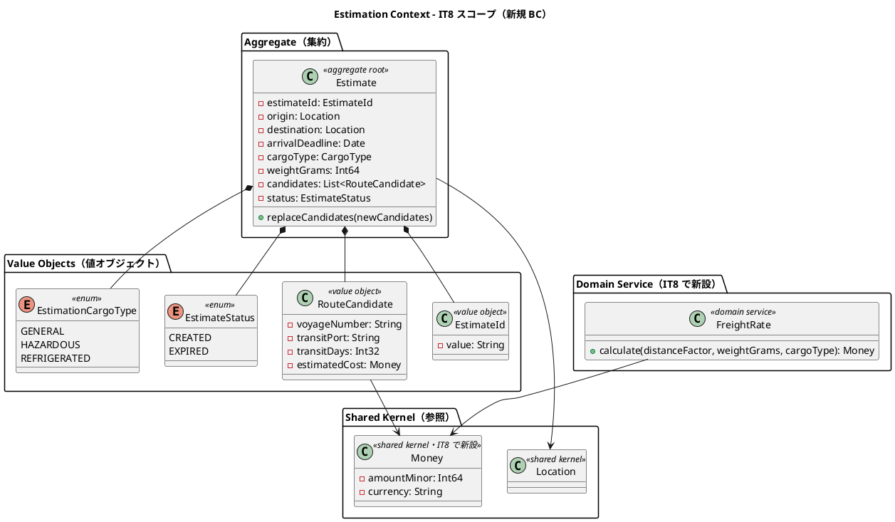
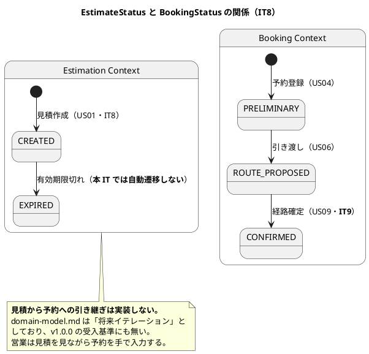
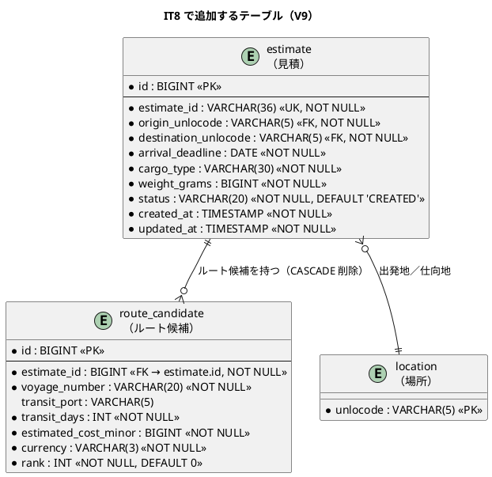
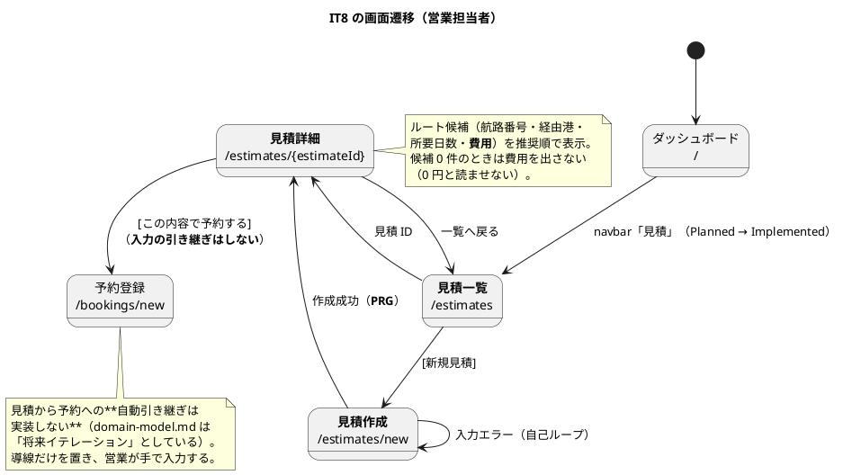

# イテレーション 8 計画

## 概要

| 項目 | 内容 |
| :--- | :--- |
| イテレーション | IT8（Week 15-16） |
| 期間 | 2026-08-04 〜 2026-08-17（2 週間） |
| 局面 | **終盤**（[開発戦略](development_strategy.md) 1 章。IT8-IT12） |
| TDD アプローチ | **アウトサイドイン**（受入テスト → HTTP → ユースケース → ドメイン）。ただし新 BC のドメイン層は中盤の規律を守る（下記） |
| 対象ストーリー | TS14・US01・TS12b |
| 計画 SP | **11** |
| 直近 3 IT の実効ベロシティ | 11.0 SP（IT5:11 / IT6:11 / IT7:11） |

---

## ゴール

### イテレーション終了時の達成状態

**営業担当者が輸送見積を作成でき、経路設計者は候補の費用を見て経路を選べる状態になる。**
併せて、終盤で 3 つの Bounded Context（Handling・Billing・Tracking の書き込み側）を
足す前に、**合成ルートの負債を返し**、IT7 で入れた防御の数値を**実測**する。

これにより IT9 の「経路の選択・確定（US09）」が**業務として正しい順序**で行える
——利用者代表の「確定は費用を見ずに行う操作ではない」に応える。

### なぜ US09（経路確定）を IT8 に入れないか

IT7 のレビューで利用者代表から次の指摘があった。

> **確定は費用を見ずに行う操作ではありません。**「所要日数は 3 日長いが運賃が半額」は
> 日常的に起きる判断で、これを見ずに確定させると、後から営業と運賃で揉めて経路を
> やり直すことになります。US09（選択・確定）と US01（見積・運賃）の順序は、
> **運賃が先か同時であるべき**です。ここは開発チームの都合ではなく業務の順序として。

US01 と US09 を同じ IT に入れると 10 SP となり、返済枠が 1 SP しか残らない。
**IT6 レビューの未返済 8 件と IT7 レビューの 22 件（中 13・低 9）を 1 SP では返せない。**
よって US01 を先に置き、US09・US11 を IT9 へ送る。

> **順序を守ることが、やり直しを防ぐ最も安い方法である。**
> 費用の無い状態で確定を作ると、費用が入った時点で確定の画面も判断ロジックも作り直す。

### 成功基準（IT8 クローズ時の評価）

| # | 基準 | 測り方 |
|:--:|------|-------|
| 1 | 営業担当者が見積を作成し、ルート候補と費用を確認できる | E2E シナリオ①（Playwright）+ HTTP 統合テスト |
| 2 | **経路割り当て画面の候補一覧に費用が出る** | `RoutePagesTest` + `RouteAssignHttpTest`（US08 受入基準 3 の未充足分を閉じる） |
| 3 | 運賃の計算が**ドメインの純粋関数**で表現され、端数処理が固定されている | `FreightRateTest`（境界: 0 kg・端数・貨物種別係数の 3 種） |
| 4 | 新 BC（Estimation）が `arch-lint` 規約 4 に違反しない | `arch-lint` + `routing`/`booking` への参照 0 件 |
| 5 | **予約一覧を状態で絞り込める** | `BookingHttpTest`。`operation.md` の日次手順が 20 件超でも成立する |
| 6 | **合成ルートが BC 別に畳まれ、BC 追加時に触る箇所が減る** | `Composition.flix` の `runWithoutDb` の入れ子が BC 数に比例しないこと |
| 7 | 追跡 API の負荷を**実測**し、目標との差を記録する | 実測値が `non_functional.md` に入ること。**「達成できる」と書かない** |
| 8 | レビュー高優先度の指摘が 0 件、または全件を本 IT 内で対応 | `docs/review/` の集計 |
| 9 | 縮退 0 件 | 実績表 |

> **成功基準 7 は「目標を満たすこと」ではない**。満たすかどうかは測ってみないと分からない。
> 基準は**測って記録すること**である。IT7 で「測る手段が無い基準は評価できない」と学んだが、
> ここは逆に「**測れば分かるのに、測る前から達成と書かない**」ための基準である。

### アプローチについて（局面と新 BC の噛み合わせ）

開発戦略の終盤は**アウトサイドイン**であり、主題は「複数コンテキストをまたぐ振る舞い」である。
一方 US01 は **Estimation Context の立ち上げ**であり、コンテキストをまたぐ振る舞いではない。

そのまま局面のアプローチを当てると噛み合わないため、**混ぜる**。

| 対象 | アプローチ | 理由 |
| :--- | :--- | :--- |
| 受入テスト（E2E シナリオ①・HTTP 統合） | **先に書く**（アウトサイドイン。タスク 2.1） | 「営業がその場で見積を答えられるか」を最初に固定する |
| ドメイン層（`Estimate`・`FreightRate`） | **中盤の規律を守る**（効果を要求しない・現在時刻は引数） | 新 BC のドメインは外部依存なしで組み上げる方が速く、テストも軽い |

IT7 でも同じ形を採った（`RouteFinder` は効果なしの純粋関数、画面は後）。
**局面はテストの入口を決めるものであり、ドメイン層の規律を上書きするものではない。**
この読み替えは[開発戦略](development_strategy.md)の終盤の節にも記した。

### 前イテレーションの Try の反映

| Try | 反映先 |
| :--- | :--- |
| T1 **横断的な仕組みを足したら「働いたとき誰が困るか」を全経路の表にする** | タスク 0.1。合成ルートの畳み込みは全ルートの実行経路を変えるため、この表を先に作る |
| T2 **設計図の向きを変えたら、その IT 内で ADR を起票する** | 実装タスクの DoD。US01 は Estimation → Routing の参照が生じうる（候補算出の再利用）。向きが決まった時点で ADR |
| T3 **共有カーネルへ関数を足したら、その IT 内に専用テストモジュールを作る** | 実装タスクの DoD。運賃は金額を扱うため `Money` 相当が共有カーネルへ入りうる |
| T4 **画面を作る前に「その利用者が毎朝どう使うか」を 3 行で書く** | ストーリー詳細（下記 US01 に記載済み） |
| T5 **実績は完了報告書へ書く。計画書は計画時点で凍結する** | クローズ手順。本書は計画時点で凍結し、実績は `iteration_report-8.md` へ |
| T6 **テストが「実装の欠陥」を示したら、まず観測手段そのものを疑う** | 実装タスクの DoD |
| T7 **数値を持つ防御は、その数値が守られているか測ってから恒久化する** | TS12b。タイムアウト時の過剰入場の恒久対策は**実測後に決める** |

---

## ユーザーストーリー

### 対象ストーリー

| ID | ストーリー | SP | 優先度 | 状態 |
| :--- | :--- | :--: | :--- | :--- |
| TS14 | IT6・IT7 レビューの返済（合成ルート・状態絞り込み・コード品質 30 件） | 5 | 高 | 未着手 |
| US01 | 輸送見積を作成する（運賃モデル・候補への費用表示） | 5 | 高 | 未着手 |
| TS12b | 追跡 API の負荷試験 | 1 | 高 | 未着手 |
| **合計** | | **11** | | |

### スコープの判断（着手前に確定させた 3 件）

#### 1. 返済枠を 5 SP として計上した

未返済は **30 件**ある（IT6 レビュー 8 件・IT7 レビュー 中 13 件 + 低 9 件）。
うち 2 件は「利用者に見える欠陥」または「BC 追加のたびに利子が付く負債」である。

| # | 内容 | なぜ今か |
| :--: | :--- | :--- |
| M11 | 合成ルートの肥大（`AppEff` 13 効果・`runWithoutDb` 7 段） | **終盤で BC が 3 つ増える**（Handling・Billing・Estimation）。増えてから畳むと 11 段になる。**今が最も安い** |
| M14 | 予約一覧に状態での絞り込みが無い | `operation.md` の日次手順が未着手 20 件超で成立しなくなる。通知（US12）が将来リリースである以上、**唯一の安全網** |

**「余力があれば返す」と書かない**。ADR-0008 が IT6 まで繰り越された前例があり、
IT7 では TS13 として 1 SP を計上して実際に返せた。同じ形にする。

#### 2. US01 を「運賃モデル + 費用表示 + 見積画面」の一体で扱う

分割案（運賃モデルだけ先に入れる）も検討したが採らない。
**運賃モデルは見積の受入基準から導かれる**ものであり、見積を作らずに運賃だけ定義すると
「誰も使わない計算式」になる。値の無い列を出さないのと同じ理由で、
**使われ方の決まっていない計算式も作らない**。

#### 3. `route_candidate` テーブルを本 IT で導入する

IT7 で「親が `estimate` であり経路割り当ての候補とは別の関心」として見送った
（[IT7 計画](iteration_plan-7.md) のスコープ判断 3）。本 IT で `estimate` と同時に作る。

**経路割り当て画面の候補は引き続き永続化しない**。あちらは都度算出であり、
見積のルート候補は「その時点の見積の内容」として保存する必要がある——
**保存する理由が違う**。

---

### ストーリー詳細

#### TS14: IT6・IT7 レビューの返済（5 SP）

**壊れ方の観点**（観点表の 6 軸）:

| 軸 | 想定する壊れ方 | 対応 |
|----|--------------|------|
| 軸 5（実行環境） | 合成ルートを畳む際に、ハンドラの適用順が変わって効果が解決されない | **全ルートを 1 度ずつ通す**（既存の HTTP 統合テストがそのまま回帰になる） |
| 軸 6（可視範囲） | 状態での絞り込みを足したとき、荷主が他人の予約を状態で引ける | 絞り込みは**可視範囲の内側**に適用する（`visibleShipperOf` の後） |
| 軸 3（表示経路） | 状態の選択肢に内部表現（`ROUTE_PROPOSED`）が出る | 表示名で出す（`statusLabel` を再利用） |
| 軸 1（境界） | 状態を選ばない（全件）と、存在しない状態を指定した場合 | 空は全件。未知の値は**全件へ倒さず 0 件**（黙って広げない） |

#### US01: 輸送見積を作成する（5 SP）

**として**: 営業担当者

**したい**: 荷主の輸送要件（出発地・目的地・希望期限・貨物種別・重量）を入力し、輸送料金と所要日数の見積を作成したい

**なぜなら**: 荷主が予算と納期を事前に把握でき、予約決定を迅速に行えるからだ

**対応 UC**: UC01

**この利用者は毎朝どう使うか**（Try T4）:

1. 荷主から電話・メールで「大阪からロサンゼルスへ 1.2 トン、4 月中旬まで」と引き合いが来る
2. **その場で**概算の運賃と所要日数を答えたい。折り返しにすると他社に取られる
3. 出した見積は後から「あのとき何と言ったか」を確認できる必要がある（見積一覧・詳細）

> **「その場で」が要件である**。入力項目が多いと電話中に入力しきれない。
> 予約登録（US04）と同じ項目数では重い。**見積は予約より少ない項目で成立する**
> （荷主の特定が要らない。寸法・個数・品名も要らない）。

**受入基準**（[ユーザーストーリー](../requirements/user_story.md) 原文）:

| # | 受入基準 | 本 IT |
|:--:|---------|:---:|
| 1 | 出発地・目的地・希望期限・貨物種別・重量を入力できる | ✅ |
| 2 | 航海スケジュール情報をもとにルート概算候補が表示される | ✅（`RouteFinder` を再利用） |
| 3 | ルート候補ごとに「経由港・所要日数・概算料金・航海番号」が表示される | ✅ |
| 4 | 見積情報が保存され、**見積番号が発行される** | ✅ |
| 5 | 希望期限に間に合うルートが存在しない場合、その旨が通知される | ✅ |
| 6 | 危険物が含まれる場合、**危険物申告情報の入力フォームが表示される** | ❌ **本 IT では未充足**（下記） |

> **受入基準 6 を本 IT で充足しない理由**:
> [データモデル](../design/data-model.md) の `estimate` テーブルは
> **危険物申告（クラス・UN 番号・正式輸送品名）の列を持たない**。
> 見積は概算であり、申告情報は予約時（US05・IT5 で実装済み）に取る設計になっている。
>
> **貨物種別としての危険物は扱う**。運賃の計算に係数 1.8 が掛かるためであり
> （[ドメインモデル](../design/domain-model.md) の料金計算ロジック）、
> 「危険物の見積が出せない」わけではない。
>
> 充足するには `estimate` に 3 列を足す必要があり、US05 で同じ検証を実装している。
> **本 IT の 5 SP には入らない**。IT9 以降で「見積に申告情報が要るか」を業務に確認してから判断する。
> 確認せずに列を足すと、IT7 の費用列と同じ——**使われ方の決まっていないものを作る**ことになる。

**併せて充足する US08 の未充足分**:

| # | US08 受入基準 | 本 IT |
|:--:|---------|:---:|
| 3 の一部 | 経路候補ごとに**費用**が表示される | ✅（経路割り当て画面に費用列を足す） |

**壊れ方の観点**（観点表の 6 軸）:

| 軸 | 想定する壊れ方 | 対応 |
|----|--------------|------|
| 軸 1（境界） | 重量 0・負値・極端な大きさ。運賃の端数処理 | **金額は整数最小単位で保持**（ADR-0006 の固定小数点方針）。端数処理を明示的に決めてテストで固定する |
| 軸 1（境界） | 希望期限が過去 | 予約と同じく「本日以降」。`Clock.today()` をアプリ層から渡す |
| 軸 2（外部） | 出発地・仕向地が UN/LOCODE でない・全角 | `SharedCalendarText.isUnLocode`（`CalendarTextTest` が全角の拒否を固定済み） |
| 軸 3（表示経路） | ルート候補 0 件のとき、見積が「費用 0 円」に見える | **候補 0 件と費用 0 円を区別する**。経路が無い旨を明示し、費用は出さない |
| 軸 4（並行） | 同じ内容の見積が二重に作られる | 見積は**複数作れてよい**（引き合いのたびに作る）。二重送信は PRG で防ぐ |
| 軸 5（探索） | 見積のルート候補算出が `RouteFinder` を呼ぶため、経路割り当てと同じ計算量になる | TS12 のタイムアウトが防壁。**TS12b の実測対象に含める** |
| 軸 6（可視範囲） | 荷主が他社の見積を見られる | 見積一覧は営業と荷主に開くが、**荷主は自分に紐づくものだけ**——ただし見積は荷主を持たない。**本 IT では荷主に開かない**（下記の注） |

> **注（設計への反映が必要）**: [UI 設計](../design/ui_design.md) の画面一覧は見積一覧・詳細の
> 主なユーザーを「営業担当者、荷主」としているが、**`estimate` テーブルは荷主を持たない**
> （[データモデル](../design/data-model.md)）。荷主に開くと**他社の見積が見える**。
> 本 IT では**営業担当者のみ**とし、UI 設計を同じ変更で直す。
> 荷主へ開くには見積に荷主を紐づける必要があり、それは別の判断である。

#### TS12b: 追跡 API の負荷試験（1 SP）

IT7 の TS12 から分割した**実測**作業である。

**測るもの**:

| 目標（[非機能要件](../design/non_functional.md) 2.2） | 実測 |
| :--- | :--- |
| 平常時 50 RPS | 記録する |
| ピーク時 200 RPS | 記録する |
| 追跡 API 1,000 RPS | 記録する。**他の目標より 1 桁高い** |

**併せて判断すること**（IT7 で限界として明文化したもの）:

> **タイムアウトで枠を返した時点で、処理はまだ走っている可能性がある。**
> `cancel(true)` は割り込み要求にすぎず、JDBC の待機や純粋な計算ループは応答しない。
> タイムアウトが多発する状況では「同時実行 ≤ N」が破れる。

恒久対策は 2 案ある。**どちらも「同時実行 200」の意味を変える**ため、実測してから決める。

1. 枠の解放をタスク側の末尾へ移し「実処理が終わったら返す」意味に変える
2. `Statement.setQueryTimeout` を併用し、DB 側で確実に切る

> **測らずに設計を変えない**（Try T7）。IT7 で「入れたこと」ではなく「働くこと」を
> 検証する規律を作ったが、**次は「効いているか」を数値で見る段階**である。

---

## タスク

### 0. 着手前の準備（返済枠・0 SP）

| # | タスク | 見積 |
|:--:|-------|:---:|
| 0.1 | **合成ルートを畳む前に、全ルート × 「実行経路が変わったとき何が壊れるか」の表を作る**。Try T1 | 2h |
| 0.2 | **引き継ぎ 30 件を「本 IT / IT9 以降 / 対応しない」に仕分け、本 IT 分がタスク表に 1:1 で存在することを数える**。Try T2（IT6・IT7 で有効だった） | 1h |
| 0.3 | 新 BC（Estimation）のテスト構成を既存 BC から写す（`test/estimation/` と `test/web/EstimationPagesTest.flix` の骨組みを先に作る。**エスケープ検証を含む**）。Try T7（IT6・IT7 から継続） | 1h |
| 0.4 | `estimate` / `route_candidate` テーブルの**実物の有無**を確認する（`data-model.md` に定義はあるが V1-V8 に無い）。Try T8 | 0.5h |

#### 0.1 の結果: 実行経路が変わったとき何が壊れるか（Try T1・着手前に作成）

合成ルートの畳み込み（1.1）は**全ルートの実行経路を変える**。
「この変更が働いたとき誰が困るか」を経路の種類ごとに数えた。

| # | 経路の種類 | 現在の通り方 | 畳んだとき壊れうる点 | 検知手段 |
|:--:|-----------|-------------|-------------------|---------|
| 1 | `TxMode.Write`（`POST /bookings` ほか） | `transactional` → 9 段のハンドラ → `runRoute` | **`Tx` が確立する前に JDBC ハンドラが `Tx.connection()` を呼ぶ**と実行時に落ちる | コンパイル（`Tx` が効果に現れる）+ 既存の HTTP 統合テスト |
| 2 | `TxMode.ReadOnly`（`GET /bookings` ほか） | `readOnly` → 同上 | 同上。加えて**読み取り専用の設定が抜けると書けてしまう** | `AppRoutesTest.testGetRoutesDoNotWrite` |
| 3 | `TxMode.NoTx`（`/health/live`・`/health/ready`） | `runWithoutDb` の `noDbViolation` 7 段 | **ハンドラを 1 つ落とすとコンパイルエラー**。落とさずに既定値を返す実装にすると、**未認証で静かに通る** | コンパイル + `RoutingHttpTest`。`noDbViolation` は `bug!` であり既定値を返さない |
| 4 | 静的ファイル（`/static/**`） | `SharedHttpStatic.handle` で早期リターン | ルーティング表を通らないため**影響を受けない** | `StaticFilesTest` |
| 5 | セッション Cookie の発行・破棄 | `withJdbcSession(cookieId, change -> Ref.put(...))` の**コールバックで `Ref` へ書く** | **`Ref` の配線が Session ハンドラと一緒に動かないと Cookie が出なくなる**。ログインが成立しても未認証に戻る | `LoginHttpTest`（`Set-Cookie` の検証） |
| 6 | 効果の持ち上げ（`lift` / `touchAll`） | `touchAll(false)` が**全効果を構文上使う** | BC 別の型別名へ分けても、`lift` は**全効果集合**を要求する。片方だけ分けると `Unused effect` で落ちる | コンパイル + `RouterLiftTest`（呼び出し回数 0） |
| 7 | 診断ルート（`/health/slow`。テストのみ） | `startServerWith` が表へ足す | 表の組み立てが変わると**本番の表に載りうる** | `RuntimeGuardTest.testDiagnosticRouteIsAbsentInProduction` |

**結論**: 1・2・3・6 は**コンパイルで捕まる**（効果が型に現れる設計の利点）。
実行時に静かに壊れうるのは **5（Cookie の配線）**だけである。
したがって 1.1 の受け入れは **`LoginHttpTest` が緑であること**を最重要とし、
既存の HTTP 統合テスト 217 件を回帰として通す。

> **IT7 の P1（防御が新しい単一障害点を作った）と同じ問いを立てた。**
> あのときは「この防御が働いたとき誰が困るか」を数えず、全経路へ一律に適用した。
> 今回は**変更が全経路に及ぶことが分かっている**ため、先に数えた。

#### 0.2 の結果: 引き継ぎの突合（Try T2・着手前に作成）

**引き継ぎは 30 件ではなく 28 件だった**。計画時に概数で書いていたため数え直した。

| 出所 | 未返済 | 内訳 |
| :--- | ---: | :--- |
| IT6 レビュー | 9 | M4・M6・M7・M8・M9・M10・L1・L3・L4（L6 は「対応しない」で確定済み） |
| IT7 レビュー（中） | 10 | M7・M8・M9・M10・M11・M12・M13・M14・M17・M18 |
| IT7 レビュー（低） | 9 | L1-L9 |
| **合計** | **28** | |

> **IT7 のレビュー統合レポートは「中 18 件 → 5 件対応・13 件を IT8 へ」と書いていたが、
> 実際は 8 件対応・10 件が残っていた**（M1・M2・M3・M4・M5・M6・M15・M16 を対応済み）。
> 集計の誤りであり、**数え直さなければ 3 件が行方不明になっていた**。

**本 IT で返す 15 件**（タスク表と 1:1 で対応する）:

| # | 出所 | 内容 | タスク行 |
|:--:|------|------|:---:|
| 1 | IT7 M11 | 合成ルートの肥大 | 1.1 |
| 2 | IT7 M14 | 予約一覧に状態での絞り込みが無い | 1.2 |
| 3 | **IT6 M4** | **予約一覧が荷主名で絞れない** | **1.2**（下記） |
| 4-9 | IT7 M7・M8・M9・M10・M17・M18 | dead code・`inject`・タプル→レコード・3 つ組・`transitDaysOf` の 0・失敗方向の分離 | 1.4 |
| 10-15 | IT6 M6・M7・M8・M9・M10・L1 | `escapeLike` 重複・表示重複・`versionOf` の位置・識別力のないテスト 2 件・文字列キー | 1.5 |

> **突合で 1 件の統合先を変えた。** IT6 の M4（荷主名で絞れない）は当初 1.5 に
> 分類していたが、**M14（状態で絞れない）と同じ SQL・同じ画面**である。
> 別々に直すと検索フォームを 2 回触ることになる。**1.2 に統合した**。
>
> IT6 のふりかえりは「関心が近くても経路が違えば別のテストが要る」と学んだが、
> **今回は経路も同じ**（`JdbcCargoRepo.searchSql` と予約一覧の検索フォーム）である。
> 統合してよい条件は「**経路が同じこと**」であり、関心の近さではない。

**IT9 へ送る 13 件**: IT7 の M12（候補 10 件超）・M13（貨物仕様）・L1-L9、
IT6 の L3・L4。いずれも利用者に見える欠陥ではない。

#### 0.4 の結果: テーブルの実物確認（Try T8・着手前に作成）

`data-model.md` に定義のある `estimate` / `route_candidate` は、
**V1-V8 のいずれにも存在しない**（`CREATE TABLE` は shipper・location・
tracking_activity・tracking_handling_event・users・user_roles・sessions・
cargo・voyage・carrier_movement の 10 件）。**V9 で新規作成する**。

> IT6 は `voyage` / `carrier_movement` が「設計にあるから実装にもある」と考え、
> マイグレーションが失敗して初めて気付いた（P6）。IT7・IT8 と着手前の確認を続けている。

### 1. TS14: レビューの返済（5 SP）

| # | タスク | 見積 |
|:--:|-------|:---:|
| 1.1 | **合成ルートを BC 別に畳む**。`BookingEff` / `RoutingEff` / `ShipperEff` の型別名と `withXxxAdapters` / `withoutXxxAdapters` のペアを BC 側に用意し、`Composition` を 1 行 × BC 数にする | 8h |
| 1.2 | **予約一覧に状態と荷主名での絞り込みを足す**（SQL で絞る。可視範囲の内側に適用）。IT7 M14 + IT6 M4 を統合（0.2 の突合結果） | 5h |
| 1.3 | `operation.md` の日次手順を、状態で絞れる前提へ書き換え、**担当ロールで実行できるか確かめる**（Try T4） | 1h |
| 1.4 | IT7 レビューの中 6 件（M7 dead code・M8 `inject`・M9 タプル→レコード・M10 3 つ組・M17 `transitDaysOf` の 0・M18 失敗方向の分離） | 8h |
| 1.5 | IT6 レビューの未返済 6 件（M6 `escapeLike` 重複・M7 表示重複・M8 `versionOf` の位置・M9/M10 識別力のないテスト・L1 文字列キー） | 6h |

> **タスク 0.2 の突合により、IT6 の M4（荷主名で絞れない）を 1.5 から 1.2 へ移した。**
> M14 と同じ SQL・同じ画面であり、別々に直すと検索フォームを 2 回触ることになる。

> **1.1 が最も価値が高い**。BC を 1 本足すたびに 4 箇所（`AppEff`・`touchAll`・
> `runWithoutDb`・`runInTransaction`）を直す必要があり、しかも 3 番目は入れ子が深い。
> **終盤で BC が 3 つ増える前に畳む**のが最も安い。

### 2. US01: 輸送見積を作成する（5 SP）

**アウトサイドイン**（終盤の局面）。受入テスト → 画面 → ルート → ユースケース → ドメインの順。

| # | タスク | 見積 |
|:--:|-------|:---:|
| 2.1 | **E2E シナリオ①の受入テストを先に書く**（見積作成 → 候補と費用を確認）。落ちることを確認する | 3h |
| 2.2 | `Money` と運賃の計算（`FreightRate`）。**金額は整数最小単位**（ADR-0006）。端数処理を明示的に決める | 5h |
| 2.3 | `Estimate` 集約・`EstimateId`・`EstimateStatus`・`RouteCandidate`（Estimation Context 固有） | 5h |
| 2.4 | `EstimateRepo` ポートと JDBC 実装。マイグレーション V9（`estimate` / `route_candidate`） | 5h |
| 2.5 | ルート候補の算出は **`RouteFinder` を再利用**する。Estimation → Routing の参照方法を決め、ADR を起票する（Try T2） | 4h |
| 2.6 | 見積の画面（一覧・作成・詳細）とルート登録。**営業担当者のみ**（荷主に開かない） | 6h |
| 2.7 | **経路割り当て画面に費用列を足す**（US08 受入基準 3 の未充足分） | 2h |
| 2.8 | navbar の「見積」を `Planned` → `Implemented` へ（`NavigationReachabilityTest` が落ちることで気付ける） | 1h |

### 3. TS12b: 追跡 API の負荷試験（1 SP）

| # | タスク | 見積 |
|:--:|-------|:---:|
| 3.1 | 負荷試験の手順を作る（k6 または JDK `HttpClient` の並行送信。**環境と手順を残す**） | 3h |
| 3.2 | 平常時 50 / ピーク 200 / 追跡 1,000 RPS を実測し、`non_functional.md` に**実測値**を記録する | 3h |
| 3.3 | タイムアウト時の過剰入場を**数値で観測**し、恒久対策 2 案から選ぶ（または「現状維持」を選ぶ理由を書く） | 2h |

### 4. 観測・規律・ドキュメント（0 SP・返済枠）

| # | タスク | 見積 |
|:--:|-------|:---:|
| 4.1 | 設計ドキュメントの同期（`domain-model.md` の Estimation Context 実装状況・`data-model.md` の実装状況・`ui_design.md` の見積画面のロール修正・`business_rule_traceability.md`） | 3h |
| 4.2 | ADR の起票（US01 の BC 間参照方向・タイムアウトの恒久対策） | 2h |

### タスク合計

| ストーリー | SP | 理想時間 |
|-----------|:--:|:---:|
| 0. 着手前の準備 | 0 | 4.5h |
| 1. TS14（レビューの返済） | 5 | 27h |
| 2. US01（輸送見積） | 5 | 31h |
| 3. TS12b（負荷試験） | 1 | 8h |
| 4. 観測・規律・ドキュメント | 0 | 5h |
| **合計** | **11** | **75.5h** |

> **IT5-IT7 は 11 SP / 62-63h で縮退 0 件だった。本 IT は 75.5h と 20% 多い。**
> 返済枠（27h）が大きいためである。返済は見積の精度が読みにくく、
> **縮退順序の 1 番目を返済枠の一部に置く**（下記）。

### 実績（クローズ時に記入）

| ストーリー | 計画 SP | 実績 SP | 状態 |
|-----------|:--:|:--:|------|
| TS14 | 5 | - | - |
| US01 | 5 | - | - |
| TS12b | 1 | - | - |
| **合計** | **11** | **-** | |

### 縮退順序（着手前に確定させる）

| 順 | 落とすもの | 理由 |
|:--:|-----------|------|
| 1 | タスク 1.5（IT6 レビューの未返済 6 件） | いずれもコード品質であり、利用者に見える欠陥ではない。**ただし 3 回目の繰越になる**——落とすなら理由を分析する |
| 2 | タスク 1.4 の一部（M17・M18） | 型表現とテストの失敗方向。今すぐ壊れない |
| 3 | タスク 2.6 の見積一覧（作成と詳細は残す） | 作成 → 詳細で「その場で答える」は成立する。一覧は後から参照する機能であり 1 IT 遅れても業務が止まらない |
| 4 | タスク 3.3（タイムアウトの恒久対策の決定） | **実測（3.2）は落とさない**。測った結果を次 IT で判断すればよい |

**タスク 1.1（合成ルートの畳み込み）・1.2（状態絞り込み）・2.7（費用列）は落とさない**。
1.1 は終盤で BC が増える前が最も安く、1.2 は運用手順の唯一の安全網であり、
2.7 は US08 の未充足分を閉じる 2h の作業である。

---

## スケジュール

### Week 1（Day 1-5）

| Day | 内容 |
|:---:|------|
| 1 | タスク 0（全ルートの表・引き継ぎの突合・テスト骨組み・テーブルの実物確認） |
| 2 | 1.1（合成ルートの畳み込み。全ルートの回帰を通す） |
| 3 | 1.2-1.3（状態絞り込みと運用手順の実行確認） |
| 4 | 2.1-2.2（受入テストを先に書く・運賃の計算） |
| 5 | 2.3（`Estimate` 集約） |

### Week 2（Day 6-10）

| Day | 内容 |
|:---:|------|
| 6 | 2.4（ポートと永続化・V9） |
| 7 | 2.5-2.6（`RouteFinder` の再利用・見積の画面） |
| 8 | 2.7-2.8（費用列・navbar）、3.1（負荷試験の手順） |
| 9 | 3.2-3.3（実測と判断）、1.4（IT7 レビューの返済） |
| 10 | 1.5（IT6 レビューの返済）、4.1-4.2（ドキュメント・ADR）、クローズ準備 |

---

## 設計

### ドメインモデル（Estimation Context の IT8 スコープ）



**設計上の判断**:

| # | 判断 | 根拠 |
|:--:|------|------|
| 1 | **`EstimationCargoType` を Booking の `CargoType` と共有しない** | IT6 で `CargoCapability` を、IT7 で `RouteSpec` を分けたのと同じ。**同じ綴りだが文脈が違う**（「この見積は何を運ぶか」と「この予約の貨物は何か」）。`arch-lint` 規約 4 |
| 2 | **`RouteCandidate` を Routing の `RouteCandidate` と共有しない** | あちらは「都度算出する候補」、こちらは「見積の内容として保存する候補」。**保存する理由が違う** |
| 3 | **`Money` は共有カーネルへ置く** | Estimation（見積）と Billing（精算）の両方が使う。金額の表現が BC ごとに分岐すると、端数処理も分岐する |
| 4 | **金額は整数最小単位で保持**（`amountMinor`） | [ADR-0006](../adr/ADR-0006-fixed-point-quantities.md)。浮動小数点の誤差を料金へ持ち込まない |
| 5 | **重量は `weightGrams`（Int64）** | Booking の `cargo.weight` と同じ規約。単位の分岐を作らない |

> **注（設計への反映が必要）**: 3 点ある。**いずれもタスク 4.1 で実装と同じ IT に反映する**
> （IT6・IT7 の K4 を継続する）。
>
> | # | 設計ドキュメントの記述 | 本 IT の判断 | 理由 |
> | :--: | :--- | :--- | :--- |
> | 1 | ユビキタス言語表が `CargoType`（Estimation）を「**Booking Context と共通**」としている | **共有しない**（`EstimationCargoType`） | この記述は Flix 実装前のものであり、**`arch-lint` 規約 4（BC 間の直接参照禁止）と矛盾する**。IT6 で `CargoCapability`、IT7 で `RouteSpec` / `RouteLeg` を分けた判断と揃える。**規約が正**であり、記述を直す |
> | 2 | `Money`・`FreightRate`・`EstimationCargoType` が要素表に無い | 要素表へ追加する | `Money` は Booking Context の値オブジェクトとして記載されているが、Estimation と Billing の双方が使うため**共有カーネルへ移す** |
> | 3 | `Estimate` の `weightKg: BigDecimal` / `EstimateId` の `value: UUID` | `weightGrams: Int64` / `EstimateId: String` | [ADR-0006](../adr/ADR-0006-fixed-point-quantities.md)（固定小数点）と、IT4 で `booking_id` を `UUID` から `VARCHAR` へ是正した判断に揃える |
>
> **1 は特に注意が要る**。「共通」と書かれた記述をそのまま実装すると、
> `estimation/**` が `booking/**` を参照して `arch-lint` が落ちる。
> **着手前に気付けたのは、この検証を通したからである。**

### 状態遷移（IT8 の範囲）



> **`EXPIRED` への遷移は本 IT で実装しない**。有効期限の業務ルール（何日で切れるか）が
> [ユーザーストーリー](../requirements/user_story.md) にも
> [ドメインモデル](../design/domain-model.md) にも定義されていない。
> **決まっていないものを実装が決めない**（IT7 の最低接続時間と同じ判断）。
> `EstimateStatus` の列挙は持つが、遷移は IT9 以降で業務に確認してから入れる。

### ER 図（本 IT で追加するテーブル）



**データモデルとの差分**（注: 設計への反映が必要）:

| 項目 | `data-model.md` | 本 IT | 理由 |
| :--- | :--- | :--- | :--- |
| `estimate.estimate_id` | `UUID` | **`VARCHAR(36)`** | `cargo.booking_id` を `UUID` から `VARCHAR(20)` へ是正したのと同じ（IT4）。H2 と PostgreSQL で `UUID` 型の扱いが揃わない |
| `estimate.weight_kg` | `NUMERIC(10,3)` | **`weight_grams BIGINT`** | ADR-0006（固定小数点）。`cargo.weight` と規約を揃える |
| `route_candidate.estimated_cost` | `NUMERIC(12,2)` | **`estimated_cost_minor BIGINT` + `currency`** | 同上。金額は整数最小単位で保持し、通貨を明示する |

### 画面遷移図（本 IT スコープ）



### インタラクション（htmx・PRG・フィードバック）

| 要素 | 方式 | 理由 |
| :--- | :--- | :--- |
| 見積作成 | **PRG**（`POST /estimates` → `302 /estimates/{id}`） | リロードによる二重送信を防ぐ（`architecture_frontend.md` の PRG 表） |
| 貨物種別に応じた追加入力 | **本 IT では実装しない** | 受入基準 6（危険物申告フォーム）が未充足のため。予約登録（`/bookings/new/cargo-type-fields`）が同じ形を実装済みであり、充足する際はそれを写す |
| 入力エラー | 自己ループ（画面を再描画し、入力値を保持） | 予約・荷主・航海と同じ |
| 費用の表示 | サーバ描画 | 金額の書式（3 桁区切り・通貨）を 1 箇所に閉じる |

**フィードバックメッセージ**:

| 状況 | スタイル | 文言 |
| :--- | :--- | :--- |
| 見積作成成功 | `alert-success` | 「見積 {estimateId} を作成しました」（PRG 後にフラッシュ表示） |
| ルート候補 0 件 | `alert-warning` | 「条件を満たす経路がありません。到着期限を延ばすか、営業所へご相談ください」＋**費用を出さない** |
| 航海が未登録 | `alert-info` | 「航海スケジュールが登録されていません」（経路割り当てと同じ書き分け） |

### ディレクトリ構成（本 IT で追加するモジュール）

```
apps/cargo-tracker/
├── src/estimation/                          # **新規 BC**
│   ├── domain/model/Estimate.flix           # 集約・EstimateId・EstimateStatus・RouteCandidate
│   ├── domain/model/FreightRate.flix        # 運賃の計算（純粋関数）
│   ├── domain/port/EstimateRepo.flix        # eff 宣言
│   ├── domain/port/RouteCandidatePort.flix  # Routing への ACL（2.5 で方向を決める）
│   ├── application/commandservices/CreateEstimate.flix
│   ├── infrastructure/repositories/JdbcEstimateRepo.flix
│   ├── infrastructure/acl/…                 # Routing の RouteFinder を使う経路
│   └── interfaces/web/EstimationPages.flix / EstimationRoutes.flix
├── src/shared/domain/model/Money.flix       # **共有カーネルへ新設**
├── src/composition/Composition.flix         # 変更（BC 別に畳む・TS14 1.1）
└── resources/db/migration/V9__add_estimate.sql
```

> **`estimation/**` から `booking/**`・`routing/**` への参照は 0 件とする**（`arch-lint` 規約 4）。
> ルート候補の算出で `RouteFinder` を使うため、**ACL ポートを Estimation 側に定義し、
> 実装（インフラ層）が Routing を呼ぶ**。IT7 の `BookingRouteRequest` と同じ形になる。
> **向きが決まった時点で ADR を起票する**（Try T2）。

### ADR

| ADR | 内容 | 起票 |
| :--- | :--- | :--- |
| ADR-0010 | Estimation → Routing の参照方向（`RouteFinder` の再利用） | タスク 2.5（本 IT） |
| ADR-0011 | タイムアウト時の過剰入場への対処（実測後に判断） | タスク 3.3（本 IT。「現状維持」を選ぶ場合もその理由を記録する） |

---

## リスクと対策

| # | リスク | 影響 | 対策 |
|:--:|-------|------|------|
| 1 | **合成ルートの畳み込みで全ルートが壊れる** | 高 | Day 2 に単独で行い、**既存の HTTP 統合テスト（217 件）をそのまま回帰として使う**。1 コミットに閉じる |
| 2 | 返済枠（27h）の見積が読みにくい | 中 | 縮退順序の 1・2 番目を返済枠に置いた。**Day 9-10 に配置**し、溢れたら落とす |
| 3 | 新 BC（Estimation）の立ち上げで BC 独立性を破る | 中 | タスク 0.3 で既存 BC の構成を写す。`arch-lint` が規約 4 を検査する |
| 4 | **負荷試験の環境が無い** | 中 | 本番相当の環境は無い。**ローカルでの相対値**として測り、「本番の値ではない」と明記する。測らないよりよい |
| 5 | 見積のルート候補算出が経路割り当てと同じ計算量を持つ | 中 | TS12 のタイムアウトが防壁。TS12b の実測対象に含める |
| 6 | 有効期限の業務ルールが未定義 | 低 | **実装が決めない**。列挙だけ持ち、遷移は IT9 以降 |

---

## 完了条件

### Definition of Done

**全タスク共通**:

- [ ] `sbt test`（フルテスト）が緑。**部分実行で済ませない**（新 BC の追加でポートが増える）
- [ ] `arch-lint` の全規約に違反しない（特に規約 4: `estimation/**` から他 BC への参照 0 件）
- [ ] 新しいアサートごとに「**この式が偽になる入力**」をコメントで 1 行残す
- [ ] 画面を追加・変更したら**全ロールで開いたときに何が見えるか**を確認する
- [ ] 外部から来る値が SQL の型変換へ届く経路を数え直す
- [ ] **横断的な仕組みを足したら「働いたとき誰が困るか」の表を作る**（Try T1）
- [ ] **設計図の向きを変えたら、その IT 内で ADR を起票する**（Try T2）
- [ ] **共有カーネルへ関数を足したら、専用テストモジュールを作る**（Try T3。`Money` が該当）
- [ ] **テストが「実装の欠陥」を示したら、まず観測手段を疑う**（Try T6）
- [ ] 実装と同じ IT で設計ドキュメントを同期する
- [ ] コミットは Conventional Commits 準拠。返済枠（TS14）は US01 と分けた独立コミットにする

**ストーリー個別**:

- [ ] US01: 受入基準 1-5 をすべて充足。US08 受入基準 3（費用）も閉じる
- [ ] TS14: 合成ルートが BC 別に畳まれ、予約一覧が状態で絞れる。`operation.md` の手順が実行できる
- [ ] TS12b: **実測値**が `non_functional.md` に記録される。「達成できる」と書かない

### デモ項目

[開発戦略](development_strategy.md) 4 章のとおり、**終盤のデモは E2E シナリオ**で示す。

| # | デモ | 受け入れ手段 |
|:--:|------|------------|
| 1 | 営業が見積を作成し、ルート候補と費用を確認できる | **E2E シナリオ①**（Playwright） |
| 2 | 経路割り当て画面の候補に費用が出る | HTTP 統合テスト |
| 3 | 候補 0 件のとき、費用を 0 円として見せない | 画面の単体テスト |
| 4 | 予約一覧を状態で絞り込める | HTTP 統合テスト |
| 5 | 荷主は自分の予約だけを、状態で絞っても見られる | HTTP 統合テスト（可視範囲の内側で絞ること） |
| 6 | 追跡 API の実測値が記録されている | `non_functional.md` の差分 |

---

## 前イテレーションからの引き継ぎ

### 本 IT で対応する

| # | 内容 | タスク行 |
|:--:|------|:---:|
| M11 | 合成ルートの肥大（`AppEff` 13 効果・`runWithoutDb` 7 段） | 1.1 |
| M14 | 予約一覧に状態での絞り込みが無い | 1.2・1.3 |
| M7・M8・M9・M10・M17・M18 | IT7 レビューの中 6 件 | 1.4 |
| IT6 の M6・M7・M8・M9・M10・L1 | IT6 レビューの未返済 6 件 | 1.5 |
| US08 受入基準 3 | 経路候補の費用 | 2.7 |
| TS12b | 追跡 API の負荷試験 | 3.1-3.3 |

### IT9 以降へ送る

| # | 内容 | 送り先 |
|:--:|------|:---:|
| M12 | 候補が 10 件を超えると選べない（件数上限・絞り込み・並べ替え） | **IT9**（US09 で選択を作るときに同時に） |
| M13 | 依頼条件に重量・容積・危険物クラス・設定温度が無い | **IT9**（同上） |
| N8 | 最低接続時間（同一港 24 時間・危険物 48 時間） | **IT9**（US09 と同時。候補の精度に直結する） |
| L1-L9 | コメントの旧名・型表現・候補数の上限・未検証の 500 経路ほか | IT9 以降で優先度判断 |
| — | 確定済み経路の差し替え | **IT9**（US09 の受入基準に含める） |
| — | `renderNotAvailable` の書き分け | IT9（可視範囲の方針と合わせて判断） |
| — | 一覧テーブルの `table-responsive` | IT9（横断的な UI 変更としてまとめて） |

### 判断が要る事項

| # | 事項 | 備考 |
|:--:|------|------|
| 1 | **v1.0.0 が 10 イテレーションに収まらない** | 残 40 SP に対し IT8-IT10 の枠は 33 SP。返済枠を含めると 45 SP ≒ 4.1 イテレーション。**リリース計画の改訂が要る**（下記） |
| 2 | 入口を持たないロール（荷役作業員・経理）の扱い | パイロット運用の対象から外す運用合意 |
| 3 | 間欠異常の新仮説 H7 | 観測を継続する |

> **事項 1 はリリース計画そのものの判断であり、本計画の外である。**
> [リリース計画](release_plan.md) の「スケジュールリスク」に挙げた
> 「予備イテレーションがない」が顕在化した形であり、**バッファのスコープ確保
> （US10・US12・US20・Phase 5 で 26 SP）は既に使い切っている**。

---

## 更新履歴

| 日付 | 内容 |
| :--- | :--- |
| 2026-08-04 | 初版作成。US09 を IT9 へ送り US01 を先に置いた（業務の順序）。返済枠を 5 SP として計上 |

---

## 関連ドキュメント

- [リリース計画](release_plan.md)
- [開発戦略](development_strategy.md)
- [IT7 計画](iteration_plan-7.md)・[IT7 完了報告書](iteration_report-7.md)・[IT7 ふりかえり](retrospective-7.md)
- [IT7 実装レビュー](../review/IT7実装_review_20260804.md)
- [ドメインモデル](../design/domain-model.md)・[データモデル](../design/data-model.md)・[UI 設計](../design/ui_design.md)
- [ADR-0006](../adr/ADR-0006-fixed-point-quantities.md)（固定小数点）・[ADR-0009](../adr/ADR-0009-routing-pulls-booking-via-acl.md)（ACL の方向）
