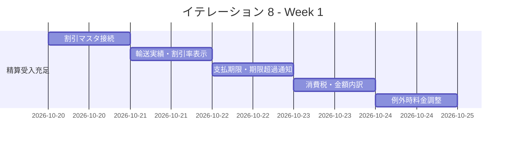
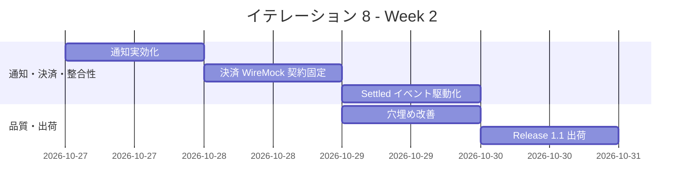
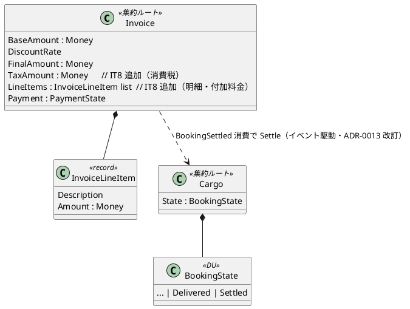

# イテレーション 8 計画

## 概要

| 項目 | 内容 |
|------|------|
| **イテレーション** | 8（予備・強化イテレーション） |
| **期間** | Week 15-16（2 週間・2026-10-20 〜 2026-10-31 計画） |
| **ゴール** | Release 1.1 の精算業務を実務品質へ引き上げる。IT7 で先送りした US21-23 の受入残（割引ポリシーマスタ接続・消費税/付加料金・支払期限・輸送実績表示・期限超過通知）を充足し、通知の実効化・決済 ACL の契約固定・Settled 同期のイベント駆動化・品質の穴埋めを行い、Release 1.1 を正式出荷可能な状態にする。 |
| **目標 SP** | 13（新規 US なし・IT6/IT7 レビュー/ふりかえりの先送り項目を SP 換算） |

---

## ゴール

### イテレーション終了時の達成状態

1. **精算業務の受入完全充足（US21/US22/US23）**: 割引ポリシーマスタ（US-ADM-01）の有効ポリシーが料金算出に接続され、消費税・付加料金を含む請求金額が算出・表示される。輸送実績・支払期限が精算書に表示され、期限超過通知が機能する。
2. **通知の実効化**: 精算書・例外・追跡の通知が荷主連絡先へ届く経路（実メール送信 or 送信抽象＋連絡先解決）を整備し、notification_log 止まりを解消する。
3. **決済 ACL の契約固定**: `PaymentGatewayPort` の実アダプタ契約を WireMock.Net で固定し、入金確認の成功/失敗系を受け入れテストで検証する（ADR-0014）。
4. **BC 連携の整合性強化**: 精算完了の Settled 同期を状態射影から `BookingSettled` イベント駆動の集約更新へ移行し、Booking 集約の遷移ガードを通す（ADR-0013 案 C）。
5. **品質の穴埋め**: `markOverdueIfDue`・通知失敗経路・US-ADM-01 有効期限フィルタ・返金導線・`Money.add` 到達不能テストなど、IT7 レビューの中・低指摘を解消する。

### 成功基準

- [ ] `DiscountPolicyRepository.FindEffective` の有効ポリシーが料金算出に適用され、登録した割引（法人/ボリューム/シーズン）が請求金額に反映されることを受け入れテストで検証する
- [ ] 請求金額に消費税（`tax_amount`）・付加料金が `invoice_line_item` として計上され、精算書詳細の金額内訳（基本料金／割引／小計／消費税／請求総額）が表示される
- [ ] 精算書に支払期限が表示され、期限超過で経理へ未払い通知が送られることが統合テストでパスする（US23 受入5）
- [ ] 料金算出フォームで輸送実績（重量・貨物種別・経路）・割引率が確定前に表示される（US21/US22 受入）
- [ ] `PaymentGatewayPort` の実アダプタ契約を WireMock.Net で固定し、入金成功/決済拒否の両系を受け入れテストで検証する
- [ ] 精算完了の Settled 同期が `BookingSettled` イベント駆動の集約更新で行われ、不正な前提状態（Delivered でない）では同期しないことを検証する
- [ ] ドメイン被覆 85%／全体 80% のカバレッジゲート・ArchUnit（Billing 含む BC 分離）が緑
- [ ] Release 1.1 出荷条件を充足（全テスト緑・カバレッジ維持・E2E 一気通貫・developing-release で品質ゲート通過）

> **アプローチ（強化イテレーション）**: 新規ドメインの立ち上げではなく、実装済みの Billing/Booking/Tracking を業務品質へ引き上げる補強である。受け入れテスト起点（アウトサイドイン）で受入残を Red にし、既存集約・ポート・合成層 ACL を拡張して Green にする。IT7 レビュー（[開発成果物_IT7_review_20260717.md](../review/開発成果物_IT7_review_20260717.md)）の高・中指摘と retro-7 Try を消化対象とする。

### 過去レビュー・ふりかえり指摘の反映（消化対象）

| 出典 | 指摘 | 反映先タスク | 対応方針 |
|------|------|-------------|----------|
| IT7 レビュー高#2 / retro-7 | 割引ポリシーマスタが料金算出に未接続 | 1.1 | 有効ポリシー解決を結線 |
| IT7 レビュー高#5 / US21 | 輸送実績が料金算出画面に非表示・距離手入力 | 1.2 | 実績サマリー表示・距離自動導出 |
| IT7 レビュー高#6 / US23 | 支払期限が未表示 | 1.3 | 精算書詳細・一覧に期限表示 |
| IT7 レビュー高#7 / retro-7 Try#5 | 消費税・付加料金が未実装 | 1.4 | invoice_line_item＋tax_amount |
| IT7 レビュー中#1 / US23 受入5 | markOverdueIfDue・期限超過通知が未テスト・未結線 | 1.3 | 期限超過バッチ/通知の結線とテスト |
| retro-7 Try#4 / retro-5/6 Try#2 | 通知が notification_log 止まり | 2.1 | 実メール送信 or 送信抽象＋連絡先解決 |
| retro-7 Try#2 / ADR-0014 | 決済 ACL の WireMock 契約固定 | 3.1 | 実アダプタ＋WireMock 受け入れ |
| retro-7 Try#3 / ADR-0013 案 C | Settled 同期のイベント駆動化 | 4.1 | BookingSettled 消費の集約更新 |
| IT7 レビュー中#5/#6 / US-ADM-01 | 有効期限フィルタ・割引率フォームバリデーション | 5.1 | 一覧フィルタ・入力側 max |
| IT7 レビュー中#3 / 低#4 | Money.add 到達不能テスト・返金導線 | 5.2 | テスト是正・IssueRefund Web 導線 |

---

## ユーザーストーリー

### 対象ストーリー

本 IT は新規ユーザーストーリーを持たない。IT7 で先送りした **US21/US22/US23/US-ADM-01 の受入残**の充足と、通知・決済・BC 連携の強化を対象とする。受入残は各ストーリー詳細の未達受入基準として扱う。

| 参照 US | 受入残（本 IT で充足） | 参照 SP 換算 |
|---------|----------------------|-------------|
| US21 輸送料金を算出する | 輸送実績表示・距離自動導出 | 3 |
| US22 法人割引を適用する | 割引ポリシーマスタ接続・確定前割引率表示 | 2 |
| US23 精算を処理する | 消費税・支払期限・期限超過通知・返金導線 | 5 |
| US-ADM-01 割引ポリシー管理 | 有効期限フィルタ・入力バリデーション | 1 |
| 非機能（通知・決済・整合性） | 通知実効化・決済契約固定・Settled イベント駆動化 | 2 |
| **合計** | | **13** |

---

## タスク

### 1. 精算業務の受入完全充足（US21/US22/US23・8 SP 相当）

| # | タスク | 見積もり | 担当 | 状態 |
|---|--------|---------|------|------|
| 1.1 | 割引ポリシーマスタ接続（`DiscountPolicyMaster.resolveApplicableRate` で有効ポリシーから率を解決し `Invoice.generateWithRate` に適用。マスタの discount_rate を権威化。法人/ボリューム/シーズンの実効化） | 4h | - | [x] |
| 1.2 | 料金算出画面に輸送実績（重量・貨物種別・経路）・確定前割引率を表示。距離を確定経路から自動導出（手入力を単価確認へ） | 4h | - | [x] |
| 1.3 | 支払期限の精算書詳細・一覧表示、`markOverdueIfDue` の結線（期限超過検出→経理未払い通知）・統合テスト | 4h | - | [x] |
| 1.4 | マイグレーション 0014 で `invoice.tax_amount`/`tax_rate` を追加。消費税・付加料金を `invoice_line_item`＋`tax_amount` で計上し、精算書詳細の金額内訳（基本料金／割引／小計／消費税／請求総額）を表示。domain-model の Invoice へ税を反映 | 4h | - | [x] |
| 1.5 | 例外時の料金調整（減額・補償費用）入力（US21 受入6）と受け入れテスト | 3h | - | [x] |

**小計**: 19h（理想時間）

### 2. 通知の実効化（通知強化・2 SP 相当）

| # | タスク | 見積もり | 担当 | 状態 |
|---|--------|---------|------|------|
| 2.1 | 荷主連絡先の実解決（Shipper メールを合成層 ACL で解決）と送信抽象（`MailSender` ポート）を導入。notification_log 記録＋送信を分離。精算/例外/追跡通知を共通化 | 4h | - | [x] |
| 2.2 | 通知失敗経路（Save 成功・通知失敗）の受け入れ/統合テスト（IT7 レビュー中#2） | 2h | - | [x] |

**小計**: 6h（理想時間）

### 3. 決済 ACL の契約固定（外部連携・2 SP 相当）

| # | タスク | 見積もり | 担当 | 状態 |
|---|--------|---------|------|------|
| 3.1 | `PaymentGatewayPort` の実アダプタ（HTTP）を合成層に実装し、契約（成功・決済拒否・障害）を固定した受け入れテスト。ADR-0014 を承認済みへ更新（注: WireMock.Net は高深刻度脆弱性の推移的依存を引き込むためセキュリティ優先で HttpListener に変更） | 5h | - | [x] |

**小計**: 5h（理想時間）

### 4. BC 連携の整合性強化（品質・1 SP 相当）

| # | タスク | 見積もり | 担当 | 状態 |
|---|--------|---------|------|------|
| 4.1 | 精算完了の Settled 同期を `BookingSettled` イベント駆動の集約更新へ移行（`Booking.Application.settle` 経由で Delivered→Settled ガードを通す）。射影 `syncBookingStatus` を廃止 or 補助化。ADR-0013 を改訂 | 4h | - | [ ] |
| 4.2 | booking_status の実値検証を E2E/統合テストに追加（IT7 レビュー高#1・射影の実値検証欠落の解消） | 2h | - | [ ] |

**小計**: 6h（理想時間）

### 5. 品質の穴埋め（改善・IT7 レビュー中/低）

| # | タスク | 見積もり | 担当 | 状態 |
|---|--------|---------|------|------|
| 5.1 | US-ADM-01 有効期限フィルタ・割引率フォームバリデーション（`max` 30%）・確定前割引率表示 | 3h | - | [ ] |
| 5.2 | `Money.add` 異通貨拒否テストの是正（第二通貨導入 or 契約明確化）・`IssueRefund` の Web 返金導線・採番の `last_insert_rowid()` 化 | 3h | - | [ ] |
| 5.3 | Release 1.1 正式出荷（`developing-release`: 品質ゲート→バージョンバンプ→CHANGELOG→tag）・リリース完了報告書の更新 | 3h | - | [ ] |

**小計**: 9h（理想時間）

#### タスク合計

| カテゴリ | SP | 理想時間 | 状態 |
|---------|----|----|------|
| 精算業務の受入完全充足 | 8 | 19h | [ ] |
| 通知の実効化 | 2 | 6h | [ ] |
| 決済 ACL の契約固定 | 2 | 5h | [ ] |
| BC 連携の整合性強化 | 1 | 6h | [ ] |
| 品質の穴埋め・出荷 | - | 9h | [ ] |
| **合計** | **13** | **45h** | |

**1 SP あたり**: 約 3.5h（改善・出荷タスク 9h を含む）
**進捗率**: 69% (9/13 SP・エピック1「精算業務の受入完全充足」＋エピック2「通知の実効化」＋エピック3「決済 ACL の契約固定」完了。割引ポリシーマスタ接続・支払期限/期限超過通知・輸送実績プレビュー/距離自動導出・消費税/金額内訳・例外時料金調整・MailSender 送信抽象/連絡先解決・通知失敗経路テスト・決済実 HTTP アダプタ/契約固定テスト・ADR-0014 承認)

---

## スケジュール

### Week 1（Day 1-5）

| 日 | タスク |
|----|--------|
| Day 1 | 1.1 割引ポリシーマスタ接続 |
| Day 2 | 1.2 輸送実績・確定前割引率表示・距離自動導出 |
| Day 3 | 1.3 支払期限表示・期限超過通知 |
| Day 4 | 1.4 消費税・付加料金・金額内訳 |
| Day 5 | 1.5 例外時料金調整 |

### Week 2（Day 6-10）

| 日 | タスク |
|----|--------|
| Day 6 | 2.1/2.2 通知実効化・通知失敗テスト |
| Day 7 | 3.1 決済 WireMock 契約固定 |
| Day 8 | 4.1/4.2 Settled イベント駆動化・booking_status 実値検証 |
| Day 9 | 5.1/5.2 US-ADM-01 フィルタ・バリデーション・返金導線・テスト是正 |
| Day 10 | 5.3 Release 1.1 出荷、統合テスト、デモ準備 |

---

## 設計

### ドメインモデル

> IT8 で `Invoice` に `TaxAmount`（消費税）・`LineItems`（明細・付加料金）を追加し、消費税・付加料金を型で表現する（domain-model へ反映）。Settled 同期は `BookingSettled` イベント消費の集約更新（`Booking.Application.settle`）へ移行し、状態射影 `syncBookingStatus` を廃止 or 補助に格下げする（ADR-0013 改訂）。
>
> **状態遷移図・画面遷移図の扱い（本 IT は既存の再利用）**: 本 IT は新規集約・新規画面を作らない強化イテレーションのため、`PaymentState`（Pending→Confirmed/Overdue→Refunded）・`BookingState`（Confirmed→Delivered→Settled）の状態遷移は [iteration_plan-7.md](./iteration_plan-7.md) の図を、精算/割引ポリシー画面の画面遷移は [ui_design.md](../design/ui_design.md) の精算フロー・管理フローを正として再利用する。本 IT の差分は (1) Settled 遷移の契機を射影から `BookingSettled` イベント駆動へ変更（遷移そのものは不変）、(2) 精算書詳細の金額内訳に消費税・付加料金の表示行を追加、(3) 割引ポリシー一覧に有効期限フィルタ・精算書詳細に返金ボタンを追加、の 3 点で、いずれも既存 state/画面の拡張に留まる。

### データモデル

> **注（マイグレーション要否）**: `invoice_line_item` テーブルはマイグレーション 0013 で作成済み（本 IT で明細＋付加料金の書き込み/読み出しを実装する）。一方 `invoice` テーブルには `tax_amount`/`tax_rate` カラムが未作成（0013 で省略）。消費税の計上には **マイグレーション 0014 で `invoice.tax_amount`（NUMERIC）・`tax_rate`（NUMERIC・デフォルト 0.10）を追加**する。data-model の当初設計（`tax_rate`/`tax_amount`）に合わせて反映し、IT7 実装状況注記を更新する。付加料金（燃油サーチャージ等）は `invoice_line_item` の明細行として表現する（ui_design の金額内訳に整合）。

### API 設計

| メソッド | エンドポイント | 説明 |
|---------|---------------|------|
| GET | /billing/invoices/new?bookingId= | 料金算出フォーム（輸送実績・割引率を事前表示） |
| POST | /billing/invoices/{invoiceId}/refund | 返金（IssueRefund・US23） |
| GET | /admin/discount-policies?effective= | 有効期限フィルタ付き一覧（US-ADM-01 受入2） |

### ADR

| ADR | タイトル | ステータス |
|-----|---------|-----------|
| [ADR-0013](../adr/0013-料金算出とBilling_Booking連携は合成層と状態射影で行う.md)（改訂予定） | Settled 同期をイベント駆動の集約更新へ移行（案 C） | 提案→改訂 |
| [ADR-0014](../adr/0014-決済ACLはPaymentGatewayPortとWireMockで契約固定する.md)（更新予定） | 決済 ACL の実アダプタ・WireMock 契約固定を実装 | 提案→承認 |

---

## リスクと対策

| リスク | 影響度 | 対策 |
|--------|--------|------|
| 消費税追加で既存テストのアサート（45,000/50,000）が破綻 | 中 | 税を明細で加算し、既存の基本料金/割引後金額のアサートは維持。総額アサートを新設。仕様（税率 10%）を先に確定 |
| Settled イベント駆動化で Cargo 集約再構成（leg 未整備）が失敗 | 中 | Delivered/Settled は itinerary を要するため、leg 未整備の予約では Delivered 実体化を要する。段階移行し、射影は補助として当面併存 |
| 決済 WireMock の外部連携が環境依存で flaky | 中 | WireMock.Net をインプロセスで起動し、契約（成功/拒否/タイムアウト）を固定。CI 前提を明示 |
| 13 SP は予備枠だが受入残・強化が広範 | 中 | 精算受入充足（テーマ1）を最優先。超過時は 3（決済実装）→ 4（イベント駆動化）を次 IT へ繰越（スタブ・射影のまま出荷可） |

---

## 完了条件

### Definition of Done

- [ ] コードレビュー完了（self-review + developing-review／出荷前）
- [ ] ユニット・受け入れ・統合・E2E テストがパス（精算受入残・通知・決済・Settled 同期）
- [ ] `dotnet build` 警告なし・ArchUnit（Billing 含む BC 分離）緑・カバレッジゲート合格
- [ ] 精算業務（割引マスタ接続・消費税・支払期限・輸送実績・期限超過通知）がローカルで動作確認済み
- [ ] ドキュメント更新完了（domain-model の Invoice 税・ADR-0013 改訂・ADR-0014 承認・data-model）
- [ ] Release 1.1 正式出荷（バージョンバンプ・CHANGELOG・tag・リリース完了報告書更新）

### デモ項目

1. ボリューム割引ポリシー登録 → 料金算出で自動適用（マスタ接続の実証）
2. 料金算出で輸送実績・割引率を確認 → 消費税込みの請求総額で精算書発行 → 支払期限表示
3. 期限超過 → 経理へ未払い通知。入金確認（WireMock 決済）→ Settled 同期（イベント駆動）
4. Release 1.1 正式出荷（全 27 US 完了・実務品質）

---

## 更新履歴

| 日付 | 更新内容 | 更新者 |
|------|---------|--------|
| 2026-07-17 | 初版作成（予備・強化イテレーション。IT7 レビュー/retro-7 Try の先送り消化・Release 1.1 出荷品質強化・13 SP） | - |

---

## 関連ドキュメント

- [イテレーション 8 ふりかえり](./retrospective-8.md)
- [開発成果物レビュー IT7](../review/開発成果物_IT7_review_20260717.md)
- [イテレーション 7 ふりかえり](./retrospective-7.md)
- [リリース計画](./release_plan.md)
- [ADR-0013](../adr/0013-料金算出とBilling_Booking連携は合成層と状態射影で行う.md) / [ADR-0014](../adr/0014-決済ACLはPaymentGatewayPortとWireMockで契約固定する.md)
