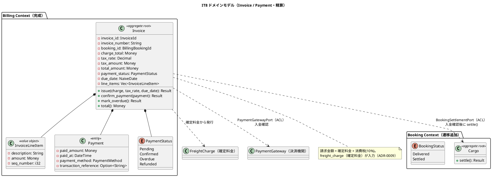
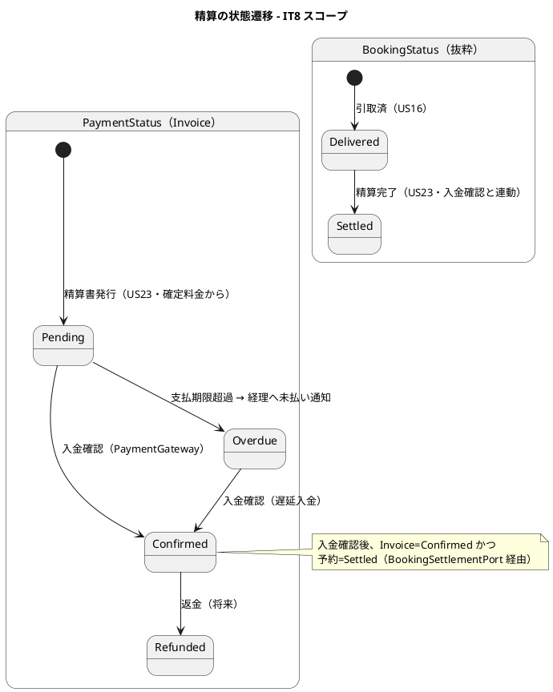
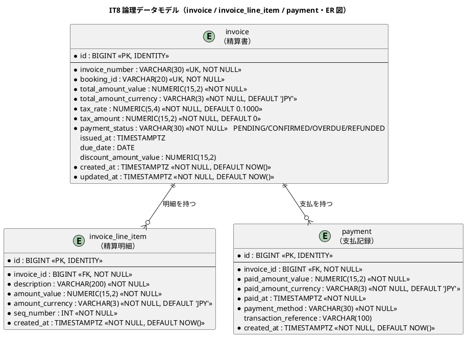
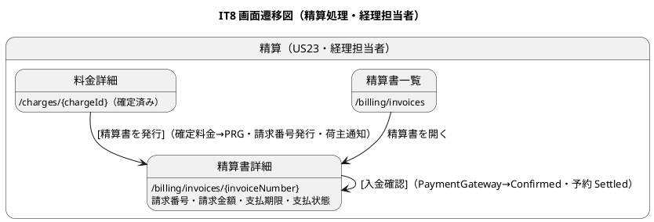
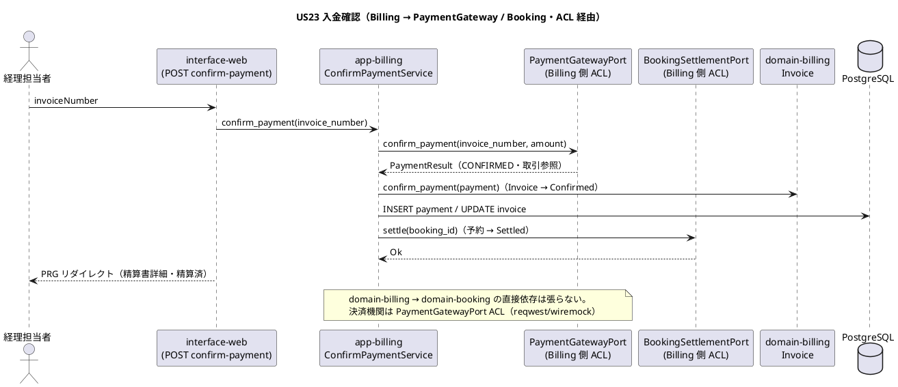

# イテレーション 8 計画

## 概要

| 項目 | 内容 |
|------|------|
| **イテレーション** | 8 |
| **期間** | Week 15-16（2 週間・2026-10-14 〜 2026-10-27） |
| **局面** | 終盤（アウトサイドイン・予備イテレーション兼安定化） |
| **ゴール** | 確定した輸送料金（`freight_charge`）をもとに精算書（`invoice`）を発行し、荷主通知・決済機関連携による入金確認・精算完了（予約状態 `Settled`）まで（US23）を成立させ、Billing Context を完成させる。加えて統合・E2E ハードニングと非機能要件の受け入れ確認を行い **Release 1.1 を完成**させる。IT7 ふりかえり Try 7 件を返済する |
| **目標 SP** | 5（US23・release_plan Phase 3 準拠）＋ 安定化・Try 返済枠（SP 外） |

---

## ゴール

### イテレーション終了時の達成状態

1. **精算処理（US23）**: 経理担当者が「確定（Confirmed）」状態の輸送料金をもとに精算書（請求番号・請求金額＝料金＋消費税・支払期限）を発行できる。精算書が荷主にメール通知（実配信・Try#3）される。決済機関（`PaymentGatewayPort` ACL）との連携で入金確認ができ、入金確認後に精算状態が「精算済（`Settled`）」に更新され、予約状態も `Settled` に遷移する。支払期限超過時、経理担当者に未払い通知が送信される。`domain-billing` の `Invoice` 集約（`invoice_number`・`Money` 合計・`tax`・`PaymentStatus`・`due_date`）と `Payment` をアウトサイドインで実装する。
2. **ハードニング**: 見積作成→予約→経路→追跡→荷役→例外→料金→精算までの主要業務シナリオを統合・E2E で通し、Release 1.1 の一貫性を担保する。フレイキー E2E の安定化・受入基準×テストの穴（IT4-7 で連続露見）の総点検を行う。
3. **非機能要件の受け入れ確認**: 可用性・セキュリティ（`cargo audit`／`cargo deny` 緑）・パフォーマンス（主要クエリ）の受け入れ確認を行い、Release 1.1 のリリース条件を満たす。
4. **IT7 Try 返済**: 通知実配信（Try#3）・distance 実距離化＋推定到着日厳密化（Try#4）・rank 一元化（Try#5）・per-handler DI 整理（Try#6）・dashboard 拡充＋荷役実績反映（Try#7）を返済する。

### 成功基準

- US23 の全受入基準に 1:1 対応するテストが存在し green。**状態変更系（入金確認→Settled・期限超過→未払い通知）は HTTP/E2E で 1:1 実証する（IT7 Try#1）**。通知系は notification テーブルを宛先・種別までアサートする。
- `domain-billing`・`app-billing` が `Invoice` 集約・`Payment`・`GenerateInvoiceService`・`ConfirmPaymentService` を備え、精算まで完成。
- `PaymentGatewayPort` ACL（外部決済機関）を wiremock 契約テストで検証（正常入金・失敗）。
- 予約状態 `Settled` 遷移を `Cargo::settle()` として実装し、精算完了と連動する。
- 精算書画面（`/billing/invoices`）を実装し、精算書の一覧・詳細・入金確認導線を提供する（IT7 Try#2 の可視化）。
- ワークスペース clippy `-D warnings` クリーン・fmt 準拠・`cargo audit`／`cargo deny` 緑・Release 1.1 リリース条件を満たす。

---

## ユーザーストーリー

### 対象ストーリー

| ID | ユーザーストーリー | SP | 対応 UC | アクター |
|----|-------------------|----|--------|--------|
| US23 | 精算を処理する | 5 | UC18 | 経理担当者 |
| **合計** | | **5** | | （＋ ハードニング・非機能・Try 返済・SP 外） |

### ストーリー詳細

#### US23: 精算を処理する（5 SP）

**として** 経理担当者 **したい** 確定した輸送料金をもとに精算書を発行し荷主への通知・入金確認・精算完了処理を行いたい **なぜなら** 精算業務を一元管理し入金状況を追跡して確実に精算を完了できるからだ。

**受け入れ基準**:

- [ ] 「確定」状態の輸送料金をもとに精算書（請求番号・請求金額・支払い期限）を発行できる
- [ ] 精算書が荷主にメール通知される
- [ ] 決済機関との連携により入金確認ができる
- [ ] 入金確認後、精算状態が「精算済」に更新され予約状態も「精算済」になる
- [ ] 支払い期限超過時、経理担当者に未払い通知が送信される

### タスク

#### 0. IT7 ふりかえり Try 返済枠（技術的負債返済・SP 外）

- [ ] **Try#3**: 通知の実配信（メール送信アダプター `infra-external`・SMTP/ログスタブ）と通知履歴の可視化 UI（公開追跡ページ・dashboard）を実装。精算書通知（US23）で実配信を初適用。
- [ ] **Try#4**: 確定経路（`SelectedRoute`）からの推定到着日導出で US18 照会を厳密化＋ distance を Routing 実績距離へ差し替え（料金 ACL の名目スタブを実データ化）。
- [ ] **Try#5**: rank 採番の責務を集約 `replace_candidates` に一元化（ACL は算出のみ・ADR-0007 負債返済）。
- [ ] **Try#6**: per-handler の service/ACL 組立を composition root（`AppState`／専用 factory）へ引き上げる（architect 指摘）。
- [ ] **Try#7**: dashboard 拡充（最新荷役・料金・精算状況の導線）＋荷役実績の料金反映（US21 受入の厳密化）。

> Try は受入基準外の負債返済・UX 改善で SP に含めない。US23 の受入完了と Release 1.1 リリース条件を最優先する。本 IT では **Try#3・#4・#6 を実施**し、**Try#5・#7 は Release 1.2 バックログへ繰り延べ可**とする（優先度: US23 > 非機能受け入れ > Try#3 > #4 > #6 >（繰り延べ可）#5 > #7）。

#### 1. 精算ドメイン・アプリ（US23・アウトサイドイン起点）

- [ ] `domain-billing` に `Invoice` 集約（`InvoiceId`・`invoice_number`・`booking_id`・`Money` 合計・`tax_rate`/`tax_amount`・`PaymentStatus`・`due_date`・`DiscountLine` 引き継ぎ）・`Payment`（支払記録）・`PaymentStatus`（Pending/Confirmed/Overdue/Refunded）・`InvoiceRepository` ポートを追加。消費税 10% 計算は純粋関数＋名前付き定数で単体テスト固定（金額リグレッション・IT6/IT7 Try 教訓）。
- [ ] `Cargo::settle()`（`Delivered`/引取済 → `Settled`）遷移を `domain-booking` に追加（網羅的 match・不正遷移拒否）。
- [ ] `app-billing`: `GenerateInvoiceService`（確定 `FreightCharge` → `Invoice` 生成・請求番号採番・支払期限設定・荷主へ精算書通知）・`ConfirmPaymentService`（`PaymentGatewayPort` ACL で入金確認→`Payment` 記録→`Invoice` を `Confirmed`／予約を `Settled` へ・`BookingSettlementPort` ACL）・期限超過検知（`Overdue`→経理へ未払い通知）。

#### 2. 外部連携 ACL（決済機関・US23）

- [ ] `PaymentGatewayPort`（Billing 側 ACL・出力ポート）を定義し、`infra-external` に reqwest 実装。wiremock 契約テスト（入金成功 CONFIRMED・失敗）で検証（test_strategy §4）。
- [ ] 予約状態連携 `BookingSettlementPort` ACL（Billing → Booking の `settle()` を app 層で結線・BC 独立）。

#### 3. インフラ（永続化）

- [ ] マイグレーション `20261014000001_it8_invoice_payment.sql`（`invoice`・`invoice_line_item`・`payment`）。data-model の Billing Context に準拠。
- [ ] `SqlxInvoiceRepository`（invoice＋明細＋payment をトランザクション保存・請求番号/予約 ID で再構築）。

#### 4. インターフェース（画面・htmx／PRG）

- [ ] 精算書一覧 `/billing/invoices`・精算書詳細 `/billing/invoices/{invoiceNumber}`・精算書発行（確定料金から）・入金確認 `.../confirm-payment`（`RoleGuard<BillingRole>`）。
- [ ] 通知実配信アダプター（Try#3）と通知履歴導線（dashboard・公開追跡）。
- [ ] HTTP フロー統合テストで US23（発行・通知・入金確認→Settled・期限超過→未払い通知）を検証。
- [ ] E2E デモ（精算書発行→入金確認→精算完了）を追加。ナビゲーション整合（請求管理メニュー・navbar/dashboard/検証テストの一致）。

#### 5. ハードニング・非機能

- [ ] 主要業務シナリオ（見積→予約→経路→追跡→荷役→例外→料金→精算）の E2E 通し・フレイキー安定化。
- [ ] 受入基準×テスト対応表の総点検（IT1-8 の穴を洗い出し補完）。
- [ ] `cargo audit`／`cargo deny` を CI 必須ゲートで緑・パフォーマンス確認（主要クエリ）・可用性/セキュリティ受け入れ。

#### タスク合計

精算 5 SP（US23）＋ ハードニング・非機能・Try 返済（SP 外）。

---

## スケジュール

### Week 1（Day 1-5）

- Day 1: US23 受入テスト作成（アウトサイドイン起点）＋ `PaymentGatewayPort` ACL 定義・wiremock 契約テスト
- Day 2: `domain-billing` `Invoice`／`Payment`／`PaymentStatus`／消費税計算 TDD＋ `Cargo::settle()` 遷移
- Day 3: `app-billing` `GenerateInvoiceService`（請求番号・支払期限・精算書通知）＋ `invoice`／`payment` マイグレーション・リポジトリ
- Day 4: `ConfirmPaymentService`（入金確認→Payment→Invoice Confirmed→予約 Settled）＋ Try#3 通知実配信アダプター
- Day 5: 精算書画面（一覧/詳細/発行/入金確認）＋ US23 HTTP フローテスト（Settled・未払い通知）

### Week 2（Day 6-10）

- Day 6: 期限超過→未払い通知＋ Try#4（distance 実距離化・推定到着日厳密化）
- Day 7: Try#6（DI 整理・composition root）＋ Try#5（rank 一元化）
- Day 8: Try#7（dashboard 拡充・荷役実績反映）＋ E2E（精算デモ）
- Day 9: ハードニング（主要業務シナリオ E2E 通し・フレイキー安定化・受入対応表総点検）
- Day 10: 非機能受け入れ（`cargo audit`／`cargo deny`・パフォーマンス）＋ developing-review 反映＋ Release 1.1 リリース準備・クローズ準備

---

## 設計

> 本 IT の対象スコープに絞り、設計の各トピックに PlantUML 図を掲載する。US23 は状態を持つ集約（Invoice の PaymentStatus・Cargo の Settled 遷移）であり、ドメインモデル図・状態遷移図・ER 図（データモデル）・画面遷移図（UI）・シーケンス図（US23 の入金確認 ACL）を掲載する。

### ドメインモデル（Billing Context 完成・US23）

> **BC 独立**: `domain-billing` は他 BC の domain クレートに依存しない。予約状態の `Settled` 連携は app 層が `BookingSettlementPort` ACL 経由で `Cargo::settle()` を呼ぶ（IT3-7 の ACL パターン踏襲）。決済機関連携は `PaymentGatewayPort` ACL に隔離（外部システム・reqwest/wiremock）。

### 状態遷移図（PaymentStatus・BookingStatus Settled・IT8 中核）

### データモデル（Invoice / Payment・IT8）

マイグレーション: `20261014000001_it8_invoice_payment.sql`（`invoice`・`invoice_line_item`・`payment`）。data-model は既に定義済み（INTEGER→NUMERIC(15,2) に統一・freight_charge と整合）。

> **注（設計への反映・金額型統一）**: data-model の invoice 金額は `INTEGER` 表記だが、`freight_charge`（NUMERIC(15,2)）・`Money`（Decimal）と整合させ `NUMERIC(15,2)` に統一する。data-model に反映する。

### ユーザーインターフェース

| 画面 | パス | ロール | US |
|------|------|--------|----|
| 精算書一覧 | `/billing/invoices` | 経理担当者（`ROLE_BILLING`） | US23 |
| 精算書詳細 | `/billing/invoices/{invoiceNumber}` | 経理担当者 | US23 |
| 精算書発行 | `/billing/invoices/new?chargeId={chargeId}` | 経理担当者 | US23 |
| 入金確認 | `/billing/invoices/{invoiceNumber}/confirm-payment` | 経理担当者 | US23 |

> **命名統一**: 既存 navbar の「請求管理」（`/billing/invoices` プレースホルダ）を本 IT で実画面へ差し替える。料金（`/charges`・IT7）と精算書（`/billing/invoices`）を業務段階で分離（ADR-0009）。

#### 画面遷移図（IT8 スコープ）

### API 設計

- 精算書発行（US23）: `GET /billing/invoices/new?chargeId={chargeId}`（確定料金確認）→ `POST /billing/invoices`（発行・PRG・請求番号採番・荷主通知）
- 精算書照会: `GET /billing/invoices`・`GET /billing/invoices/{invoiceNumber}`
- 入金確認（US23）: `POST /billing/invoices/{invoiceNumber}/confirm-payment`（PaymentGateway 連携→Payment 記録→Invoice Confirmed→予約 Settled・PRG）
- 認可は `RoleGuard<BillingRole>`（`ROLE_BILLING`）。

#### シーケンス図（US23 入金確認・BC 跨ぎ ACL）

### ADR

- **ADR 踏襲**: ADR-0009（料金/精算書の段階分割）で確定料金を精算書の入力とする。ADR-0010（Money・丸め）を消費税計算に適用。ADR-0003（Arc<dyn> 注入）・ADR-0007（ACL 隔離）を `PaymentGatewayPort`／`BookingSettlementPort` に適用。
- **ADR 候補（起票検討）**: 外部決済機関連携の契約テスト方針（wiremock・タイムアウト/失敗フォールバック）は test_strategy §4 準拠のため単独 ADR まで不要。予約状態の Settled 連携（Billing→Booking の ACL 方向）が既存パターンで説明可能なら ADR 不要。

### docs/design への反映が必要な設計要素（当該 IT で反映）

1. **`data-model.md` の invoice/payment 金額型を `NUMERIC(15,2)` に統一**（`INTEGER` 表記を freight_charge・Money と整合）。マイグレーション追加を反映。
2. **`domain-model.md` の Billing Context に `Invoice`・`Payment`・`PaymentStatus` の実装状況（IT8 実装済み）を明記**。`BookingStatus` の `Settled` 遷移（`Cargo::settle()`）を追記。**通知種別（`NotificationType` 相当）に `InvoiceIssued`（精算書発行）・`PaymentOverdue`（未払い）を追加**（validating 詳細#7）。
3. **`architecture_backend.md` の段階的実装計画**で Billing Context 完成（Phase 3）を反映。
4. **`ui_design.md`** に精算書画面（`/billing/invoices`）の salt/仕様を追加。

> **消費税の適用順序（明記）**: 請求金額 ＝ 確定料金（`freight_charge.total()`＝基本料金 − 例外調整 − 法人割引の**割引後金額**）に消費税 10% を適用する。すなわち「割引後の確定料金 × (1 + 0.10)」。消費税額は円未満四捨五入（`Money::rounded()`・ADR-0010）で 1 回だけ丸める。純粋関数＋名前付き定数 `TAX_RATE = 0.1000` で単体テスト固定（例: 確定料金 170,000 → 税 17,000 → 請求 187,000）。
>
> **期限超過判定の配置**: `Invoice::mark_overdue(as_of: NaiveDate)` をドメイン層に置き、`due_date` 超過かつ未入金（`Pending`）なら `Overdue` へ遷移する純粋な判定とする。app 層（`ConfirmPaymentService` または点検ユースケース）が現在日付を渡して駆動する。
>
> **Try 返済の実施判定（明確化）**: 本 IT で実施するのは **Try#3（通知実配信）・Try#4（distance 実データ化＋推定到着日）・Try#6（DI 整理）** の 3 件。**Try#5（rank 一元化）・Try#7（dashboard 拡充・荷役実績反映）は Release 1.2 バックログへ繰り延べ可**とし、US23 受入完了と非機能受け入れ（リリース条件）を最優先する。

---

## 受入基準 × テストケース対応表（Try#1・状態変更系の HTTP/E2E 1:1 実証）

### US23: 精算を処理する

| 受入基準 | 想定テスト | 通知/状態アサート |
|---------|-----------|------------|
| 確定料金から精算書発行（番号・金額・期限） | domain-billing::確定料金から精算書を発行する（消費税10%） / app-billing::請求番号・支払期限を採番する / interface-web::invoice_flow 発行 | - |
| 精算書を荷主にメール通知 | interface-web::invoice_flow 発行 | **notification に INVOICE_ISSUED 記録（宛先＝荷受人）・実配信アダプター経由（Try#3）** |
| 決済機関連携で入金確認 | infra::payment_gateway wiremock（CONFIRMED・失敗）/ app-billing::入金確認で Payment を記録する | - |
| 入金確認後 精算済・予約も精算済 | domain-billing::入金確認で Invoice が Confirmed / domain-booking::settle で Settled / **interface-web::invoice_flow 入金確認→invoice=CONFIRMED かつ cargo=SETTLED（HTTP 1:1）** | - |
| 期限超過→経理へ未払い通知 | domain-billing::期限超過で Overdue / **interface-web::invoice_flow 期限超過→未払い通知（HTTP 1:1）** | **notification に PAYMENT_OVERDUE 記録（宛先＝経理）** |

---

## リスクと対策

| リスク | 影響 | 対策 |
|--------|------|------|
| US23 が精算書発行＋入金確認＋状態連携で 5 SP を超過しやすい | スコープ超過 | アウトサイドインで受入テストを先に固定。消費税は名前付き定数の純粋関数で薄く。予約 Settled 連携は `BookingSettlementPort` ACL で最小結線 |
| 決済機関連携（外部 ACL）のテスト不安定 | フレイキー | wiremock で正常/失敗/タイムアウトをスタブ（test_strategy §4）。実配信はスタブ（送信＝記録の現行方針を通知実配信で一段実体化） |
| Try 返済枠がハードニング時間を圧迫 | Release 1.1 未完成 | US23 と非機能受け入れを最優先。Try#5/#7 は Release 1.2 バックログへ繰り延べ可（優先度順に消化） |
| `Cargo::settle()` 追加で BookingStatus の既存挙動が変わる | 回帰 | 網羅的 match で `Delivered→Settled` のみ許可・他は `InvalidStateTransition`。既存フローテストが回帰しないことを確認 |
| ハードニングで既存 IT の受入穴が多数露見 | 収束しない | 受入基準×テスト対応表の総点検を Day 9 に集中。重大のみ本 IT・軽微は Release 1.2 バックログへ |

---

## 完了条件

### Definition of Done

- [ ] US23 の全受入基準に対応するテストが存在し green（状態変更系は HTTP/E2E で 1:1 実証・通知系は notification 宛先・種別アサート・Try#1）
- [ ] `domain-billing` に `Invoice`／`Payment`／`PaymentStatus`・消費税計算・`app-billing` に発行/入金確認サービスを実装
- [ ] `PaymentGatewayPort` ACL を wiremock 契約テスト（正常/失敗）で検証・`domain-billing` は他 BC domain クレート非依存（BC 独立）
- [ ] `Cargo::settle()`（Delivered→Settled）実装・入金確認と連動・既存 Booking フローが回帰しない
- [ ] マイグレーション `20261014000001_it8_invoice_payment.sql` 適用・infra 統合テスト green
- [ ] 精算書画面（一覧/詳細/発行/入金確認）を `ROLE_BILLING` 限定で提供・navbar 請求管理を実画面へ差し替え・ナビ整合
- [ ] IT7 Try#3（通知実配信）・#4（distance/推定到着日実データ）・#6（DI 整理）を返済（Try#5/#7 は未達なら Release 1.2 へ繰り延べを明記）
- [ ] 主要業務シナリオ（見積→精算）の E2E 通し・フレイキー安定化・受入対応表総点検
- [ ] ワークスペース clippy `-D warnings` クリーン・fmt 準拠・`cargo audit`／`cargo deny` 緑（非機能受け入れ）
- [ ] data-model／domain-model／architecture_backend／ui_design へ設計反映
- [ ] developing-review（5 エージェント並列）の高優先度指摘をクローズ前に対応
- [ ] Release 1.1 のリリース条件を満たす（`creating-release-report` でリリース報告書作成の準備）

### デモ項目

1. 経理担当者が確定料金から精算書を発行 → 請求番号・請求金額（料金＋消費税）・支払期限・荷主へメール通知（US23）
2. 決済機関連携で入金確認 → 精算状態が精算済・予約状態も精算済（US23）
3. 支払期限超過の精算書 → 経理へ未払い通知（US23）
4. 見積→予約→経路→追跡→荷役→例外→料金→精算の主要業務シナリオ E2E 通し（ハードニング）

---

## 更新履歴

| 日付 | 内容 |
|------|------|
| 2026-07-24 | IT8 計画初版作成（opening-iteration・IT7 ふりかえり Try 反映） |
| 2026-07-24 | validating-iteration-plan／validating-design 反映: 通知種別に InvoiceIssued/PaymentOverdue 追加を設計反映項目に明記、消費税の適用順序（割引後確定料金×1.1・1 回丸め）と期限超過判定の配置（Invoice::mark_overdue）を明記、Try 実施判定（#3/#4/#6 実施・#5/#7 は Release 1.2 繰り延べ可）を明確化。両検証とも BC 独立性違反なし・着手可 |
| 2026-07-24 | 開発完了（US23）: Invoice/Payment/PaymentStatus・Cargo::settle・GenerateInvoice/ConfirmPayment/CheckOverdue サービス・PaymentGateway/BookingSettlement/InvoiceNotification ACL・invoice/payment マイグレーション＋リポジトリ・精算書画面を全層で TDD 実装。US23 全 5 受入基準を実装・検証（発行・荷主通知・入金確認・精算済/予約 Settled・期限超過→未払い通知）。単体（domain-billing 19・app-billing 12・domain-booking 29）＋統合（billing_flow 8・invoice_repository 2）＋決済契約（infra-external wiremock 3）green。**非機能受け入れ: cargo audit/deny 緑（推移的アドバイザリ 3 件を本番非露出の根拠付きで ignore）**。**Try#4（推定到着日を確定経路から導出）・Try#3 一部（通知履歴の可視化）を返済**。Try#3 の SMTP 実配信・Try#5（rank 一元化）・Try#6（DI 整理）・Try#7（dashboard 拡充）は Release 1.2 バックログへ繰り延べ（US23＋非機能を最優先・計画の Try 優先度方針どおり） |

---

## 関連ドキュメント

- [リリース計画](./release_plan.md)
- [開発戦略](./development_strategy.md)
- [イテレーション 7 ふりかえり](./retrospective-7.md)
- [イテレーション 7 計画](./iteration_plan-7.md)
- [ドメインモデル設計](../design/domain-model.md)
- [データモデル設計](../design/data-model.md)
- [UI 設計](../design/ui_design.md)
- [テスト戦略](../design/test_strategy.md)
- [ユーザーストーリー](../requirements/user_story.md)
- [ADR-0009 輸送料金と精算書の段階分割](../adr/0009-freight-charge-and-invoice-separation.md)
- [ADR-0010 Money の BC ローカル定義](../adr/0010-billing-money-value-object.md)
