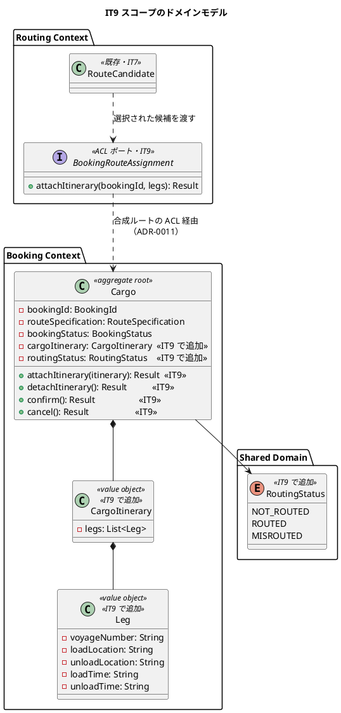
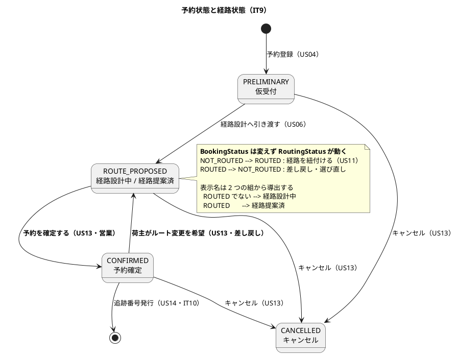
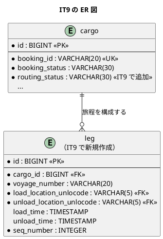
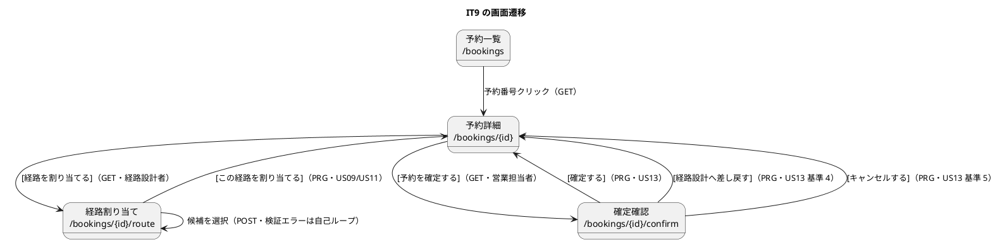

# イテレーション 9 計画

## 概要

| 項目 | 内容 |
| :--- | :--- |
| 期間 | 2026-08-04 〜（2 週間） |
| 局面 | **終盤**（[開発戦略](development_strategy.md) IT8-IT12。アウトサイドイン） |
| 計画 SP | **12**（US09 5・US11 3・US13 3・TS16 1） |
| 前提 | [IT8 完了報告書](iteration_report-8.md)・[IT8 ふりかえり](retrospective-8.md) |

**IT9 は「経路が決まってから予約が確定するまで」を通す**。IT7 で候補を出し、
IT8 で費用を出した。本 IT で**選び・紐付け・確定する**——業務フローの背骨がつながる。

---

## ゴール

### イテレーション終了時の達成状態

経路設計者が候補から 1 件を選んで予約に紐付け、営業担当者が荷主の承認を受けて
予約を確定できる。キャンセル・差し戻しも同じ画面から行える。

### 成功基準

| # | 基準 | 検証 |
| :--: | :--- | :--- |
| 1 | 経路設計者が候補を選択し、確定した経路が予約に紐付く | `RouteAssignHttpTest` |
| 2 | 営業担当者が予約を確定でき、状態が「予約確定」になる | `BookingConfirmHttpTest` |
| 3 | 荷主の希望で「経路設計中」へ差し戻せる・キャンセルできる | 同上 |
| 4 | **Routing が Booking の集約不変条件を迂回しない**（ADR-0011） | `arch-lint` + 統合テスト |
| 5 | `POST /login` に CSRF 検証が効く | `CsrfTest` |
| 6 | 全テスト緑・`arch-lint` 0 件・`trace-lint` 0 件・CI 緑 | クローズ手順 |

---

## IT8 ふりかえりの反映

[IT8 ふりかえり](retrospective-8.md) の Try 6 件を、本計画のどこで使うかを先に決める。
**Try を書いただけで使わなかった**のが IT8 の最大の問題だった（P1・P3）。

| Try | 本 IT での置き場所 |
| :--- | :--- |
| **T1** 合成ルートに置いた翻訳には、翻訳そのものを通すテストを必ず添える | タスク 0.2 で `composition/acl/` を導入し、**規約 4 の対象に含める**。テストは `WiringTest` の BC 別の節 |
| **T2** 「全部」を謳うテストは列挙をやめ正典から生成する | タスク 1.1 の DoD。新しいルートを足したら `WiringTest` は自動で対象に含む（IT8 で生成方式へ変更済み） |
| **T3** 着手時に計画の「壊れ方の観点」表を読み、該当行をコミットメッセージに引用する | **全実装タスクの DoD**。引用が無いコミットは DoD 未達とする |
| **T4** 画面に書いた「値の整形」は、桁・単位・端数を含むならドメインへ移す | タスク 2.3（状態の表示名の導出）で適用 |
| **T5** 受入テストに `contains("円")` のような型だけの検査を書かない | タスク 1.4・2.4 の DoD。単体テストが値を固定しているならその値で突合 |
| **T6** 測定は各条件 3 回とり、中央値と幅を記録する | 本 IT に測定タスクは無い。**IT10 の TS12b 残件で使う**（記録のみ） |

### 着手前に決めた事項（ユーザー判断・2026-08-04）

| # | 論点 | 決定 |
| :--: | :--- | :--- |
| 1 | ログイン CSRF の扱い | **TS16 として 1 SP 計上**。IT9 を 12 SP にする。「余力次第」と書かない（ADR-0008 が 3 IT 繰越した前例） |
| 2 | US11 の状態遷移と `domain-model.md` の食い違い | **ユーザーストーリーを正とする**。経路の紐付けは `BookingStatus` を変えず `RoutingStatus` を `ROUTED` にする。`CONFIRMED` は US13 でのみ到達 |

---

## ユーザーストーリー

### 対象ストーリー

| ID | ストーリー | SP | 優先度 | 状態 |
| :--- | :--- | :--: | :--- | :--- |
| US09 | 経路を選択・確定する | 5 | 高 | 未着手 |
| US11 | 経路情報を予約に紐付ける | 3 | 高 | 未着手 |
| US13 | 予約を確定する | 3 | 高 | 未着手 |
| TS16 | ログイン CSRF の検証 | 1 | 高 | 未着手 |
| **合計** | | **12** | | |

> **12 SP はベロシティ（11 SP × 4 連続）を 1 SP 上回る**。
> TS16 は 1 SP と小さく、かつ**着手順を先頭に置く**（脆弱性を残したまま
> 業務機能を積まない）。超過分のリスクは縮退順序で受ける。

### ストーリー詳細

#### US09: 経路を選択・確定する（5 SP）

**として**: 経路設計者
**したい**: 算出された経路候補から最適なものを選択し、経路を確定したい
**なぜなら**: 最適経路を正式に確定し、予約への紐付けに進めるからだ

**受け入れ基準**:

- [ ] 経路候補一覧（経由港・所要日数・費用・航海番号）を確認できる — **IT7・IT8 で充足済み**
- [ ] 最適な経路候補を 1 件選択できる
- [ ] 選択後、経路状態が「確定」になる
- [ ] 最適な候補がない場合、経路条件調整（US10）に進める — **US10 は将来リリース**。
      候補 0 件の案内（IT7 実装済み）で代替し、**その旨を画面に明記する**

**この利用者は毎朝どう使うか**（Try T4）:

1. 朝、`/bookings?status=ROUTE_PROPOSED` を開く（IT8 で入れた絞り込み。運用手順どおり）
2. 予約詳細 → [経路を割り当てる] で候補を見る。**「速いが高い」「遅いが安い」を比べる**
3. 1 件選んで確定する。**選び直しは起こる**——荷主が「もっと安く」と言えば戻ってくる

3 が受入基準に無い要求である。**確定は取り消せる必要がある**（US13 の差し戻しと同じ経路）。

#### US11: 経路情報を予約に紐付ける（3 SP）

**として**: 経路設計者
**したい**: 確定した経路情報を貨物予約に紐付けたい

**受け入れ基準**:

- [ ] 確定経路と予約番号を確認できる
- [ ] 経路情報を予約に紐付ける操作を実行できる
- [ ] 紐付け後、予約状態が「経路提案中」に更新される
      — **`BookingStatus` は `ROUTE_PROPOSED` のまま、`RoutingStatus` を `ROUTED` にする**。
      表示名を `(BookingStatus, RoutingStatus)` から導出し「経路提案済」と出す（着手前の決定 2）

#### US13: 予約を確定する（3 SP）

**として**: 営業担当者
**したい**: 荷主がルートを承認したことを確認して予約を正式確定したい

**受け入れ基準**:

- [ ] 予約番号を指定して予約内容と選択ルートを確認できる
- [ ] 確定操作を行うと予約状態が「予約確定」に更新される
- [ ] 経路設計者に追跡番号発行依頼の通知が送信される — **通知は US12 と同じく将来リリース**。
      本 IT は**予約一覧の絞り込み**（IT8）で代替し、`operation.md` に手順を書く
- [ ] 荷主がルート変更を希望する場合、予約を「経路設計中」に戻せる
- [ ] 荷主がキャンセルを希望する場合、予約をキャンセル状態に変更できる
- [ ] キャンセル時、荷主にキャンセル確認通知が送信される — **同上（将来リリース）**

#### TS16: ログイン CSRF の検証（1 SP）

IT8 レビュー（tester・スコープ外の発見）。`POST /login` は `anonymous()` として
登録され、`requiresCsrf` は `Anonymous` に `false` を返す。一方 `AuthPages` は
フォームに `_csrf` を描画している——**出しているが検証していない**。

`Auth.flix` のコメントは「未認証で状態を変更する経路は現時点で存在せず、
あれば設計の誤り」と書いているが、**ログイン自体がその反例**である。

### 壊れ方の観点（6 軸）

**着手時にこの表を読む**（Try T3）。該当行をコミットメッセージに引用する。

| 軸 | 想定する壊れ方 | 対応 |
| :--- | :--- | :--- |
| 軸 1（境界） | 候補 0 件・区間 1 件・区間 3 件以上で紐付けの挙動が変わる | 直行・積替 1 回・積替 2 回の 3 通りを受入テストに置く |
| 軸 2（同時実行） | 経路設計者 2 人が同じ予約に別の経路を紐付ける | **楽観的ロック**（ADR-0008 の版と同じ形）。`findForUpdate` で行を押さえる |
| 軸 3（表示経路） | `ROUTED` でないのに「経路提案済」と出る／確定済みなのに [確定] ボタンが押せる | 表示名は `(BookingStatus, RoutingStatus)` から導出し、**画面ごとに書き直さない**（T4） |
| 軸 4（状態遷移） | `CONFIRMED` から `ROUTE_PROPOSED` へ戻すとき、経路が残ったままになる | 差し戻しは `RoutingStatus` も `NOT_ROUTED` に戻す。**戻した後に選び直せる**ことをテストで固定 |
| 軸 5（実行環境） | Routing が `cargo` を直接 `UPDATE` し、Booking の不変条件を迂回する | **ADR-0011**。書き込みは Booking の集約を通す（タスク 0.2） |
| 軸 6（可視範囲） | 荷主が他社の予約を確定・キャンセルできる | `findVisible` の内側で操作する。**荷主ロールに確定操作を出さない** |

---

## タスク

### 0. 着手前の準備（0 SP）

| # | タスク | 見積 |
|:--:|-------|:---:|
| 0.1 | **IT8 ふりかえりの Try 6 件の置き場所を決める**（本書の表。作成済み） | 0.5h |
| 0.2 | **ADR-0011: 書き込み方向の ACL**。`composition/acl/` を設けて `arch-lint` 規約 4 の対象に含めるかを決め、規約側も更新する | 3h |
| 0.3 | **`leg` テーブルと `cargo.routing_status` の実物確認**（Try T8） | 0.5h |
| 0.4 | **SonarQube の Quality Gate を実行する**（IT8 の未達。`.env` の復号が要る） | 1h |

> **0.3 の結果（着手前に実施済み）**: `leg` テーブルは **V1-V9 のいずれにも存在しない**。
> `cargo.routing_status` も**存在しない**（V5 のコメントで「Routing Context 実装時」として
> 先送りされていた）。**V10 で両方を作る**。
>
> IT6 は `voyage` / `carrier_movement` が「設計にあるから実装にもある」と考え、
> マイグレーションが失敗して初めて気付いた。IT7・IT8・IT9 と着手前の確認を続けている。

> **0.4 は私（AI）だけでは実行できない**。`.env` が無く `.env.vault` の復号に
> パスワードが要る。**利用者に依頼する**（`npx gulp vault:decrypt && npx gulp sonar-local:check`）。

### 1. TS16 + US09: ログイン CSRF と経路の選択（6 SP）

**先頭に TS16 を置く**。脆弱性を残したまま業務機能を積まない。

| # | タスク | 見積 |
|:--:|-------|:---:|
| 1.1 | **`POST /login` に CSRF 検証を効かせる**。`requiresCsrf` を「状態を変える経路は Anonymous でも検証する」形へ。**攻撃を再現するテスト**（トークン無し・他セッションのトークン）で固定 | 4h |
| 1.2 | **受入テストを先に書く**（候補を選ぶ → 確定 → 紐付く）。落ちることを確認する | 3h |
| 1.3 | `CargoItinerary`・`Leg` 値オブジェクト（Booking Context）。**`RoutingStatus` は共有カーネル** | 5h |
| 1.4 | 経路の選択・確定（`RouteAssignment` 集約操作）。**楽観的ロック**（軸 2） | 6h |
| 1.5 | 経路割り当て画面にラジオ選択と [この経路を割り当てる] を足す（IT7 の「次のイテレーション」案内を外す） | 5h |

### 2. US11 + US13: 紐付けと予約確定（6 SP）

| # | タスク | 見積 |
|:--:|-------|:---:|
| 2.1 | **V10**（`leg` テーブル・`cargo.routing_status` 列）。0.3 の確認結果に基づく | 3h |
| 2.2 | `Cargo` 集約に `attachItinerary` / `detachItinerary` を足す。**不変条件は集約に置く**（端点が `RouteSpecification` と一致すること・区間が連結していること） | 5h |
| 2.3 | **状態の表示名を `(BookingStatus, RoutingStatus)` から導出する**（Try T4）。画面ごとに書き直さない | 3h |
| 2.4 | 予約確定・差し戻し・キャンセルの画面と操作（**営業担当者のみ**。荷主に出さない） | 6h |
| 2.5 | `operation.md` に「確定待ちの予約を朝に確認する」手順を足す（通知の代替。**担当ロールで実行できるか確かめる**） | 1h |

### 3. 観測・規律・ドキュメント（0 SP・返済枠）

| # | タスク | 見積 |
|:--:|-------|:---:|
| 3.1 | 設計ドキュメントの同期（`domain-model.md` の `RouteCargoCommand` 遷移の是正・`data-model.md` の V10・`ui_design.md`・`business_rule_traceability.md`） | 3h |
| 3.2 | IT8 レビューの中 6 件から **M4**（`transitDays` の `Option` 化）・**M5**（運賃計算の層）を返す | 4h |

### タスク合計

| ストーリー | SP | 理想時間 |
|-----------|:--:|:---:|
| 0. 着手前の準備 | 0 | 5h |
| 1. TS16 + US09 | 6 | 23h |
| 2. US11 + US13 | 6 | 18h |
| 3. 観測・規律・ドキュメント | 0 | 7h |
| **合計** | **12** | **53h** |

> **IT8（75.5h）より 30% 少ない**。返済枠が 27h → 7h に減ったためである。
> 12 SP に対し 53h は IT5-IT7（11 SP / 62-63h）より軽く、**見積が甘い可能性がある**。
> US09 の「選び直し」（受入基準に無い要求）と軸 2 の楽観的ロックは、
> 実装してみると膨らむ種類の作業である。縮退順序を先に決めておく。

### 縮退順序（着手前に確定させる）

| 順 | 落とすもの | 理由 |
|:--:|-----------|------|
| 1 | 3.2（IT8 レビュー中 2 件の返済） | 利用者に見える欠陥ではない。IT10 へ送れる |
| 2 | US13 の受入基準 5-6（キャンセル） | 差し戻し（基準 4）が通れば業務は回る。キャンセルは**予約が成立しなかった場合**であり頻度が低い |
| 3 | 2.5（`operation.md` の手順） | 手順が無くても機能は動く。ただし**通知が無い以上、手順が唯一の安全網**であることは IT7 で学んでいる。3 番目に置くのはそのため |

**TS16（1.1）・US09 の選択（1.4-1.5）・US11 の紐付け（2.2）は落とさない**。
TS16 は脆弱性であり、US09/US11 を落とすと IT9 のゴール自体が消える。

---

## 設計

### ドメインモデル（本 IT のスコープ）

> **`RoutingStatus` を共有カーネルに置く**。[ドメインモデル設計](../design/domain-model.md)
> の用語集が既に「Shared Domain」としている。Booking が持ち、Tracking も参照する。

### 状態遷移（本 IT のスコープ）

> **`RouteCargoCommand` が `ROUTE_PROPOSED → CONFIRMED` へ遷移するという
> [ドメインモデル設計](../design/domain-model.md) の記述は誤りである**（着手前の決定 2）。
> その形だと US13（営業が荷主の承認を確認して確定する）が成立しない。
> **設計ドキュメントを是正する**（タスク 3.1）。

### データモデル（本 IT のスコープ）

> **着手前に実物を確認した**（タスク 0.3）。`leg` テーブルと `cargo.routing_status` は
> **V1-V9 のいずれにも存在しない**。V10 で作る。
>
> `leg.voyage_number` の FK（`voyage.voyage_number`）は**張らない**。
> Booking と Routing はコンテキストが違い、参照整合性を DB で縛らない方針である
> （`cargo.shipper_id` と同じ扱い。[データモデル設計](../design/data-model.md) 5 節）。

### ユーザーインターフェース（本 IT のスコープ）

**インタラクション**:

- 遷移は **PRG**（成功時のみ）。検証エラーは 200 でフォームを返す（既存と同じ）
- 候補の選択は**ラジオボタン**。`hx-` は使わない（選択は状態を変えるため、
  CSRF トークンを伴う POST が要る。`arch-lint` 規約 8）
- **押せるのに 403 になるボタンを出さない**（観点表の軸 3-7）。
  [予約を確定する] は営業担当者のみ、[経路を割り当てる] は経路設計者のみ

### ナビゲーション整合性

本 IT で**新規画面は「確定確認」1 つ**である。navbar への追加は無い
（予約詳細からの遷移であり、独立した入口を持たない）。

`NavigationReachabilityTest` は変更しない。**ロール別の到達性は変わらない**——
営業担当者は `/bookings` から、経路設計者も `/bookings` から辿る（IT7 で開いた）。

### ADR

| # | 論点 | 状態 |
| :--: | :--- | :--- |
| ADR-0011 | **書き込み方向の ACL**（Routing → Booking）。`composition/acl/` を設けて規約 4 の対象に含めるか | タスク 0.2 で起票 |

---

## スケジュール

| Day | 内容 |
| :--: | :--- |
| 1 | タスク 0（ADR-0011・実物確認・SonarQube 依頼） |
| 2 | 1.1（TS16 ログイン CSRF）・1.2（受入テスト） |
| 3-4 | 1.3-1.4（`CargoItinerary`・選択と確定） |
| 5 | 1.5（画面） |
| 6 | 2.1-2.2（V10・集約操作） |
| 7 | 2.3（表示名の導出）・2.4（確定画面） |
| 8 | 2.4 続き・2.5（運用手順） |
| 9 | 3.1-3.2（ドキュメント同期・返済） |
| 10 | クローズ（レビュー・品質ゲート・ふりかえり・報告書） |

---

## リスクと対策

| # | リスク | 影響 | 対策 |
| :--: | :--- | :--- | :--- |
| 1 | **書き込み方向の ACL が Booking の不変条件を迂回する** | データが壊れる。読み取りの取り違えは「候補が出ない」で済むが、書き込みは戻せない | タスク 0.2 を**最初に**行う。ADR-0011 で方向を確定してから実装に入る |
| 2 | 12 SP がベロシティ（11 SP）を超える | 縮退が発生する | 縮退順序を着手前に確定済み。**TS16・US09 の選択・US11 の紐付けは落とさない** |
| 3 | 状態遷移の設計変更が既存テストを広く壊す | 手戻り | `statusLabel` を `(BookingStatus, RoutingStatus)` の導出へ変える時点で、既存テストの期待値がずれる。**2.3 を独立したコミットにする** |
| 4 | 楽観的ロックの実装が US25（航海更新）と別実装になる | 同じ規律が 2 つになる | `RoutingModel.versionOf` と同じ形（内容から指紋）を使う。**共通化は 3 回目まで待つ**（Rule of Three） |

---

## 完了条件

### Definition of Done

- [ ] 全受入基準を満たす（将来リリースへ送るものは**画面と計画の両方に明記**）
- [ ] 全テスト緑・`arch-lint` 違反 0 件・`trace-lint` 違反 0 件
- [ ] CI 緑
- [ ] **SonarQube Quality Gate が PASS**（IT8 の未達を解消する）
- [ ] 各実装コミットのメッセージに**壊れ方の観点の該当行を引用**（Try T3）
- [ ] 受入テストのアサーションが型だけの検査になっていない（Try T5）
- [ ] `docs/design/` への反映を実装と同じ IT で行う
- [ ] ADR-0011 を起票

### デモ項目

1. 経路設計者が候補から 1 件選び、予約に紐付ける（状態が「経路提案済」になる）
2. 営業担当者が予約を確定する（「予約確定」になる）
3. 荷主のルート変更希望で差し戻す（「経路設計中」に戻り、選び直せる）
4. ログインフォームから CSRF トークンを外すと拒否される

---

## 更新履歴

| 日付 | 更新内容 |
| :--- | :--- |
| 2026-08-04 | 初版作成。着手前の判断 2 件（TS16 の計上・状態遷移の正典）を反映 |

---

## 関連ドキュメント

- [IT8 ふりかえり](retrospective-8.md)
- [IT8 完了報告書](iteration_report-8.md)
- [IT8 実装レビュー](../review/IT8実装_review_20260804.md)
- [開発戦略](development_strategy.md)
- [リリース計画](release_plan.md)
