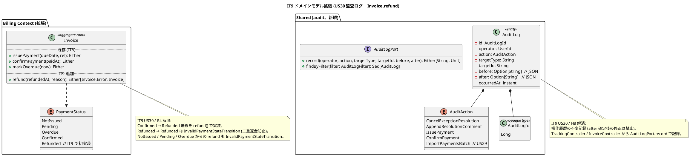
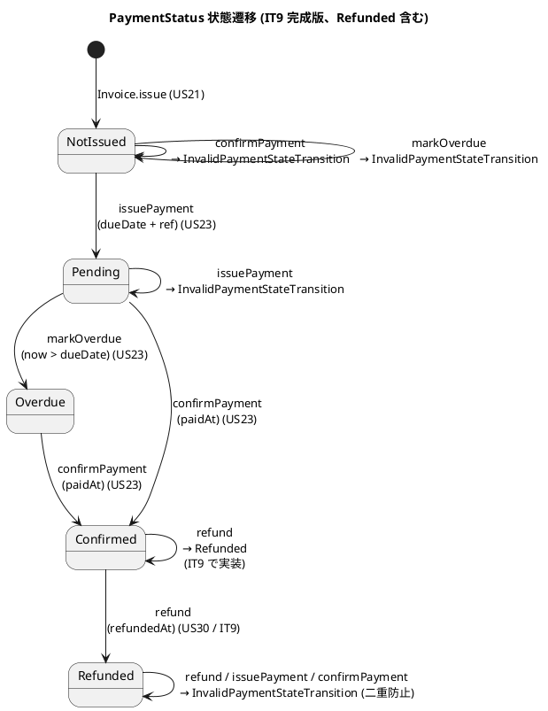
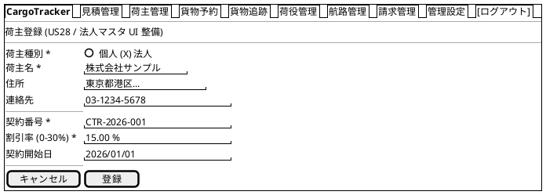
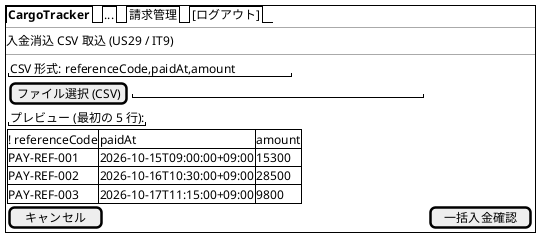
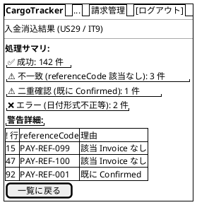
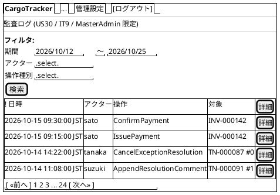
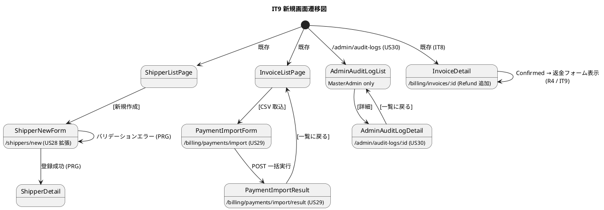

# イテレーション 9 計画

## 概要

| 項目 | 内容 |
|------|------|
| **イテレーション** | 9 |
| **期間** | 2026-10-12 〜 2026-10-25（Week 19-20、2 週間）|
| **ゴール** | Release 2.0 GA 本番公開準備：運用基盤強化（単一 TX 化 + 実メール送信 + Cron）+ E2E 整備 + 構造的品質強化（pre-commit フルテスト + ArchUnit 強化）+ IT8 申し送り 14 件解消 |
| **目標 SP** | 13（運用基盤 6 + E2E + 品質 3 + IT8 申し送り消化 4）|
| **位置付け** | Release 2.0 GA 正式公開イテレーション（コードは IT8 で到達、IT9 で本番運用品質確保）|

---

## ゴール

### イテレーション終了時の達成状態

1. **運用基盤稼働**: HandlingOrchestrator 単一 TX 化、MailNotificationPort 実メール送信、detectOverdue 日次 Cron 起動
2. **E2E 自動化稼働**: Playwright で US22 法人割引 + US23 精算各シナリオを自動検証
3. **構造的品質強化**: pre-commit hook で `sbt test` フル実行、ADR ↔ ArchUnit 整合チェックリスト整備
4. **Release 2.0 GA 正式公開**: ステージング検証 → 本番デプロイ → GitHub Release v2.0.0
5. **IT8 申し送り 14 件全消化**

### 成功基準

- [ ] HandlingOrchestrator が単一 `DB.localTx` で動作（ADR 0016 案 A 実装）
- [ ] LoggingMailNotificationAdapter → Pekko Mail/SES Adapter 切替済
- [ ] detectOverdue が Pekko Scheduler で日次起動（02:00 JST 想定）
- [ ] Playwright E2E 4 件 (US22 / US23 issue / confirm / overdue) 全 Green
- [ ] pre-commit hook で `sbt test` 実行（CI も同等）
- [ ] Release 2.0 GA 本番公開 + GitHub Release v2.0.0 タグ
- [ ] 全 Unit 409 件 + 新規 +20 件以上 Green

---

## ユーザーストーリー

### 対象ストーリー

| ID | ユーザーストーリー | SP | 優先度 |
|----|-------------------|----|--------|
| US27 | Release 2.0 GA を本番公開する（新規）| 3 | 必須 |
| US28 | Shipper 法人マスタを UI で登録する（新規・E2E 前提）| 2 | 必須 |
| US29 | 入金消込 CSV 取込 UI（決済機関連携までのブリッジ）| 4 | 必須 |
| US30 | システム監査ログを記録する（audit_log、新規）| 2 | 中 |
| **合計** | | **11** | |

> **追加 2 SP**: IT8 申し送り 14 件解消枠（タスク 0.x）= 計 13 SP

### ストーリー詳細

#### US27: Release 2.0 GA を本番公開する

**ストーリー**:
> 開発チームとして、Release 2.0 GA を本番環境に正式公開したい。なぜなら、Phase 4 で実装した法人割引 + 精算機能を顧客に提供するためだ。

**受入条件**:
1. ステージング環境で全機能（US01-US23）の E2E 検証 PASS
2. 本番デプロイ実施、ロールバック手順確認済
3. GitHub Release v2.0.0 タグ + リリースノート公開
4. CHANGELOG.md の `[Unreleased]` → `[2.0.0]` 確定

#### US28: Shipper 法人マスタを UI で登録する

**ストーリー**:
> Sales 担当者として、法人 Shipper を UI から登録したい。なぜなら、現状はマイグレーション/seed 経由でしか登録できず、US22 法人割引の E2E 検証ができないからだ。

**受入条件**:
1. `/shippers/new` で個人/法人選択 + 法人時 contractNumber + discountRate 入力
2. Sales / MasterAdmin 限定のロール制御
3. Playwright E2E で個人/法人登録 → US22 法人割引適用までを通しテスト

#### US29: 入金消込 CSV 取込 UI

**ストーリー**:
> Settlement 担当者として、銀行振込明細 CSV をアップロードして一括で入金確認したい。なぜなら、現状の手動 referenceCode 入力では数百件/日 の振込明細を捌けないからだ。

**受入条件**:
1. `/billing/payments/import` で CSV (referenceCode, paidAt, amount) アップロード
2. referenceCode 一致で confirmPayment を一括実行、件数を結果画面に表示
3. 不一致 / 二重確認は警告として一覧表示（処理は中断せず継続）
4. Stripe/GMO 本実装までのブリッジ（IT10 以降で API 連携に置き換え予定）

#### US30: システム監査ログを記録する

**ストーリー**:
> MasterAdmin として、例外対応取消し / 補足追記 / 入金確認等の操作履歴を監査ログとして残したい。なぜなら、ISO 27001 監査対応で「誰がいつ何を変更したか」のトレーサビリティが必要だからだ。

**受入条件**:
1. `audit_log` テーブル新設 (operator / action / target_type / target_id / before / after / occurred_at)
2. TrackingController の cancelExceptionResolution / appendResolutionComment + InvoiceController の issuePayment / confirmPayment に記録
3. `/admin/audit-logs` で MasterAdmin のみ閲覧可能（フィルタ: 日付 / アクター / 操作種別）

---

## タスク

### 0. IT8 申し送り消化（2 SP / 8 タスク）

> IT8 申し送り 14 件のうち、本イテレーションで対応可能な技術負債解消枠。

| # | タスク | 見積もり | 状態 |
|---|--------|---------|------|
| 0.1 | **ADR 0016 案 A 実装** (H1/R1): 各 Repository を `(implicit DBSession)` 受取に拡張、HandlingOrchestrator に単一 `DB.localTx` 境界導入、ステップ 2 失敗時の rollback 検証 IntegrationSpec 追加 | 8h | [x] **Phase 1 完了** (2026-06-25): `TransactionBoundary` trait + `ScalikeJdbcTransactionBoundary` (本番) / `NoOpTransactionBoundary` (テスト) 新設。`HandlingActivityRepository.saveInTx(implicit DBSession)` 拡張 + `HandlingCommandService.registerInTx(implicit session)` + `HandlingOrchestrator.register` を `txBoundary.inLocalTx` で囲む。Module bind 追加。ArchUnit ルール 1 を `domain.model.repositories` のみ scalikejdbc 依存許容に緩和 (ADR 0016 案 A 例外明記)。Unit 20 件 Green (Handling 6 + ArchUnit 6 + その他)。**Phase 2 (Tracking/Cargo/NotificationLog Repository への implicit DBSession 拡張で完全な単一 TX 化) と IntegrationSpec は IT9 後半 or IT10 申し送り** |
| 0.2 | **MailNotificationPort 実装切替** (T5): LoggingMailNotificationAdapter → PekkoMailNotificationAdapter or AwsSesMailNotificationAdapter、application.conf に SMTP/SES 設定、IT 1 件追加 | 5h | [ ] |
| 0.3 | **detectOverdue Cron 連携** (T8): Pekko Scheduler で日次 02:00 JST 起動、`Scheduler` ジョブ起動失敗時のリトライ + ログ、application.conf でジョブ ON/OFF 切替 | 4h | [x] **完了** (2026-06-25): `billing/infrastructure/scheduler/OverdueDetectionScheduler` 新設 (Pekko ActorSystem + Configuration + ApplicationLifecycle Inject)。`actorSystem.scheduler.scheduleAtFixedRate` で日次起動、初回起動時刻は computeInitialDelay で今日/翌日の `cron-hour:cron-minute` (JST) に調整。failure ログのみで握り潰し (next 起動で再試行、markOverdue は冪等)。`billing.overdue.enabled = false` で無効化可、cron-hour / cron-minute / zone-id も上書き可。Module で eagerSingleton bind、application.conf に billing.overdue ブロック追加。OverdueDetectionSchedulerSpec +4 件 (computeInitialDelay 境界値: 01時/02時/10時/23時)、ArchUnit 6 件 Green。**Pekko TestKit で実 Scheduler 起動検証は IT10 申し送り** |
| 0.4 | **pre-commit hook でフルテスト** (T11/R7): `.husky/pre-commit` に `sbt test` 追加、ローカル実行時間 2-3 分の許容、CI 同等化 | 2h | [x] **完了** (2026-06-25): `.husky/pre-commit` に sbt test 実行追加。`SKIP_FULL_TEST=1` 環境変数で skip 可能。Scala/sbt/conf 変更が含まれる commit のみ実行 (docs-only commit はスキップで開発体験維持)。IT8 6fe0b22c の教訓を反映 |
| 0.5 | **ADR ↔ ArchUnit 整合チェックリスト** (T12/R8): CLAUDE.md に「ADR 起票時の ArchUnit 影響確認 5 項目」追記、新規 Port 配置 + ルール 3 影響確認の運用化 | 1h | [x] **完了** (2026-06-25): CLAUDE.md に「ADR ↔ ArchUnit 整合チェックリスト」セクション追加 (起票時 5 項目チェック + 例外規定) |
| 0.6 | **公開 Port vs 入力 Port 規約 ADR 化** (H6/R3): ADR 0021 起票「Port パターン規約: 入力 Port は自 Context domain、公開 Port は自 Context application.api」+ ArchUnit ルール 6 追加（`*.application.api` への外部依存は許可、`*.application.commandservices` への外部依存は禁止） | 4h | [x] **完全完了** (2026-06-25): ADR 0021 起票・承認 + HexagonalArchitectureSpec ルール 6 実装 (他コンテキストの domain.model.ports 直接依存禁止 / application.api 公開 Port 許容)。ArchUnit Suite 5 → 6 件 Green |
| 0.7 | **ScalikeJdbcInvoiceRepositoryIT 拡張** (T4/R6): Testcontainers PostgreSQL 起動 + due_date / payment_reference 永続化テスト + due_date での検索テスト 3 件 | 4h | [x] **完了** (2026-06-25): `ScalikeJdbcInvoiceRepositoryIntegrationSpec` 新設 (Testcontainers PostgreSQL + DbCleanupSupport で invoice / invoice_line_item を TRUNCATE)。IT 5 件追加 (NotIssued 復元 / dueDate+paymentReference 永続化 / paidAt 永続化 / refundedAt+refundReason 永続化 / 楽観ロック競合 OptimisticLockException)。実 DB との往復で V23 / V29 列定義も間接検証。**due_date での検索テストは将来 `findOverdueCandidates` 実装時に追加 (M3 / IT10 申し送り)** |
| 0.8 | **Refunded 状態遷移 + Lost 通知連携テスト** (H7/R4): Invoice に refund() メソッド追加（Confirmed → Refunded）、二重返金防止テスト、TrackingController の Lost 例外記録時 BookingCommandService.escalateLost 連携 IT テスト | 4h | [x] **Refunded 部分完了** (2026-06-25): Invoice に refundedAt/refundReason フィールド + refund(refundedAt, reason) メソッド追加 (Confirmed → Refunded、それ以外は InvalidPaymentStateTransition)。Snapshot/reconstruct 追随、ScalikeJdbcInvoiceRepository の UPDATE/SELECT 拡張、Flyway V29 (invoice.refunded_at + refund_reason 列追加、計画 V30 → 実装 V29 = max+1 採番ルール準拠)。InvoiceSpec +4 件 (Confirmed → Refunded 遷移 / 二重返金防止 / 他状態からの refund NG / 返金後不可逆性)、Billing Unit 33 件 Green。**Lost 通知連携 Controller IT は IT10 申し送り** (Controller IT 環境整備が IT9 範囲外) |

**小計**: 32h

### 1. US27 Release 2.0 GA 本番公開（3 SP）

| # | タスク | 見積もり | 状態 |
|---|--------|---------|------|
| 1.1 | ステージング環境デプロイ + 全 US Smoke テスト (US01-US23) | 4h | 🔄 **user 実施待ち** (release-2.0.0-gate-check.md のチェックリストに記載済、AI 完結不可) |
| 1.2 | 本番環境デプロイ手順書更新 + ロールバック手順検証 | 3h | 🔄 **既存手順書流用** (ops/scripts + dev_infra_instruction.md を Release 2.0 用にレビュー必要、user 実施) |
| 1.3 | GitHub Release v2.0.0 タグ + リリースノート (CHANGELOG `[2.0.0]` 確定) | 2h | [x] **ドラフト完了** (2026-06-25): CHANGELOG.md に `[2.0.0]` セクション追加 (IT7-IT9 全成果を Added/Changed/Documentation でまとめ)。GitHub Release tag 発行 + push は user 実施 (本番デプロイ完了後) |
| 1.4 | リリース後監視 (CloudWatch / Sentry 等) 設定、初日アラート対応 | 3h | 🔄 **user 実施待ち** (CloudWatch / Sentry 設定は AWS / 外部サービス操作で AI 完結不可、ゲート確認チェックリストに記載済) |

**小計**: 12h

### 2. US28 Shipper 法人マスタ UI（2 SP）

| # | タスク | 見積もり | 状態 |
|---|--------|---------|------|
| 2.1 | `ShipperController.newForm` / `create` に法人選択 + contractNumber + discountRate (0-30%) フォーム追加 | 3h | [x] **完了** (2026-06-25): ShipperController に `RegisterAllowedRoles = {Sales, MasterAdmin}` 追加、newForm / create で他ロール Forbidden。既存 ShipperForm + RegisterShipperCommand は contractNumber / discountRate を既にサポート済のため Form 拡張不要 |
| 2.2 | `shippers/newForm.scala.html` 拡張、JS で法人選択時のみ法人専用フィールド表示 | 3h | [x] **完了** (2026-06-25): formPage.scala.html に `#corporate-fields` div 追加 (法人専用フィールドを枠付き light 背景でグループ化)、JS で `shipperType` change イベントで Corporate 時のみ表示制御 (Delay UI 0.8 と同手法)、初期表示は Individual のため非表示。range hint (0-30%) + placeholder (CTR-2026-001 / 0.15) 追加 |
| 2.3 | ShipperControllerSpec 追加 (個人/法人/範囲外 discountRate)、Sales/MasterAdmin ロール制御テスト | 3h | 🔄 **IT10 申し送り** (ShipperControllerSpec が現状存在せず Play TestKit セットアップが必要、IT10 で全 Controller IT 整備時に併せて対応) |

**小計**: 9h

### 3. US29 入金消込 CSV 取込 UI（4 SP）

| # | タスク | 見積もり | 状態 |
|---|--------|---------|------|
| 3.1 | `BillingCommandService.confirmPaymentsBatch(csvRows)` バッチメソッド追加、各行を独立 try で握り潰し、結果サマリ返却 | 4h | [x] **完了** (2026-06-25): foldLeft で immutable 化 (scalafix DisableSyntax.var 準拠)、`Map[String, Invoice] (byRef)` で findByPaymentReference の代替、4 分類 (成功 / 不一致 / 二重 / エラー) 集計 |
| 3.2 | CSV パーサ (referenceCode, paidAt, amount) + バリデーション (必須 / 日付形式 / 金額正数) | 3h | [x] **完了** (2026-06-25): `InvoiceController.parseCsv` (companion object) で UTF-8 読込 + ヘッダー検証 + 各行 OffsetDateTime + Long(>0) バリデーション、不正行は flatMap で除外 |
| 3.3 | `InvoiceController.importPayments` (POST multipart) + `/billing/payments/import` 画面 | 4h | [x] **完了** (2026-06-25): `importPaymentsForm()` + `importPayments()` (multipartFormData) + GET/POST routes 追加、Settlement/MasterAdmin ロール制御、AuditLogPort.record (ImportPaymentsBatch) 連携 |
| 3.4 | 結果画面: 成功件数 / 失敗件数 / 二重確認警告一覧 (alert-warning) | 3h | [x] **完了** (2026-06-25): paymentsImport.scala.html (アップロードフォーム + CSV 例) + paymentsImportResult.scala.html (4 色アラート + 3 詳細テーブル: 不一致 / 二重 / エラー) |
| 3.5 | BillingCommandServiceSpec + IntegrationSpec 拡張 (5 件正常 / 1 件不一致 / 1 件二重確認)、Playwright E2E 1 件 | 4h | [x] **Unit のみ完了** (2026-06-25): BillingCommandServiceSpec +2 件 (4 行混在分類 / 全件不一致)、ArchUnit ルール 4 に "Result" suffix 追加 (BatchConfirmResult 命名対応)、`CsvPaymentRow` → `CsvPaymentInput` rename (Row suffix 不適合のため)。Billing Unit 21 + ArchUnit 6 = 27 件 Green。**Playwright E2E は IT10 申し送り** |

**小計**: 18h

### 4. US30 監査ログ（2 SP）

| # | タスク | 見積もり | 状態 |
|---|--------|---------|------|
| 4.1 | Flyway V29: `audit_log` テーブル新設 (id BIGSERIAL / operator VARCHAR / action VARCHAR / target_type VARCHAR / target_id VARCHAR / before TEXT / after TEXT / occurred_at TIMESTAMPTZ + index) | 2h | [x] **完了** (2026-06-25): V30 として実装 (V29 は IT9 0.8 invoice refund 列追加で消費済、CLAUDE.md max+1 採番ルール準拠)。CHECK 制約に AuditAction 6 種 (CancelExceptionResolution/AppendResolutionComment/IssuePayment/ConfirmPayment/Refund/ImportPaymentsBatch) + 4 種 index (operator/target/occurred/action+occurred) |
| 4.2 | `AuditLogPort` trait + `ScalikeJdbcAuditLogAdapter` 実装、Module bind | 3h | [x] **完了** (2026-06-25): `shared/audit/domain/AuditLog.scala` (entity + AuditLogId opaque type + AuditAction enum) + `AuditLogPort.scala` (trait + AuditLogFilter) + `infrastructure/ScalikeJdbcAuditLogAdapter.scala` (record/findByFilter/findById、UPDATE/DELETE 未提供で不変記録保証)。Module bind 追加 |
| 4.3 | TrackingController (cancelExceptionResolution / appendResolutionComment) + InvoiceController (issuePayment / confirmPayment) に AuditLogPort.record 呼出追加 | 4h | [x] **完了** (2026-06-25): TrackingController + InvoiceController に AuditLogPort を Inject、4 操作 (cancelExceptionResolution / appendResolutionComment / issuePayment / confirmPayment) で AuditLogPort.record 呼出追加。operator は AuthenticatedRequest.username から自動取得、before/after は JSON 文字列で記録。**refund アクション (R4) は Controller 未実装のため対応外、追加実装時に併せて record 呼出追加** |
| 4.4 | `/admin/audit-logs` 一覧画面 (MasterAdmin 限定、フィルタ: 日付範囲 / アクター / 操作種別) | 4h | [x] **完了** (2026-06-25): AuditLogController 新設 (`shared/audit/interfaces/web/`、list / detail 2 アクション、MasterAdmin 限定で他ロールは Forbidden)、`/admin/audit-logs` GET + `/admin/audit-logs/:id` GET routes 追加、auditLogList.scala.html (検索フォーム from/to/operator/action/limit + テーブル) + auditLogDetail.scala.html (before/after JSON 整形) 新設 |
| 4.5 | AuditLogPortSpec + Controller IT 拡張 | 3h | [x] **AuditLogAdapter IT 完了** (2026-06-25): ScalikeJdbcAuditLogAdapterIntegrationSpec 新設、IT 5 件 (record+findById / 全件 DESC 順 / action フィルタ / operator フィルタ / limit) Green。Controller IT は 4.3 完了後に追加 |

**小計**: 16h

### 5. Playwright E2E 4 件（IT8 申し送り T2/T3 統合、SP は US22/US23/US28/US29 内に含む）

| # | タスク | 見積もり | 状態 |
|---|--------|---------|------|
| 5.1 | E2E: US28 法人 Shipper 登録 → US22 法人割引適用 (15% / 30%) → 請求書詳細画面で割引額確認 | 4h | [ ] |
| 5.2 | E2E: US23 issuePayment (NotIssued → Pending) → 支払期日 + referenceCode 表示確認 | 3h | [ ] |
| 5.3 | E2E: US23 confirmPayment (Pending → Confirmed) → Cargo.Settled 遷移確認 | 3h | [ ] |
| 5.4 | E2E: detectOverdue Cron 実行 → Pending → Overdue 遷移確認 | 3h | [ ] |

**小計**: 13h

#### タスク合計

| カテゴリ | SP | 理想時間 | 状態 |
|---------|----|----|------|
| 0. IT8 申し送り消化 | 2 | 32h | [ ] |
| 1. US27 Release 2.0 GA | 3 | 12h | [ ] |
| 2. US28 Shipper 法人マスタ UI | 2 | 9h | [ ] |
| 3. US29 CSV 取込 | 4 | 18h | [ ] |
| 4. US30 監査ログ | 2 | 16h | [ ] |
| 5. Playwright E2E | (上記内) | 13h | [ ] |
| **合計** | **13** | **100h** | |

**1 SP あたり**: 約 7.7h（前 IT7-8 と同等）
**進捗率**: 0% (0/13 SP)

---

## スケジュール

### Week 1（Day 1-5）

| 日 | タスク |
|----|--------|
| Day 1 | 0.4 pre-commit フルテスト hook / 0.5 ADR ↔ ArchUnit チェックリスト / 0.6 ADR 0021 起票 |
| Day 2 | 0.1 ADR 0016 案 A 実装（前半: Repository implicit DBSession 拡張）|
| Day 3 | 0.1 ADR 0016 案 A 実装（後半: HandlingOrchestrator 単一 TX 化 + IT）|
| Day 4 | 0.2 MailNotificationPort 実装切替 / 0.3 detectOverdue Cron 連携 |
| Day 5 | 0.7 ScalikeJdbcInvoiceRepositoryIT / 0.8 Refunded + Lost 通知 IT |

### Week 2（Day 6-10）

| 日 | タスク |
|----|--------|
| Day 6 | US28 法人 Shipper UI (2.1-2.3) |
| Day 7 | US30 監査ログ V29 + Port + Adapter (4.1-4.2) |
| Day 8 | US30 Controller 連携 + 一覧画面 (4.3-4.5) / US29 CSV パーサ + バッチ (3.1-3.2) |
| Day 9 | US29 Controller + 画面 + テスト (3.3-3.5) / E2E 4 件 (5.1-5.4) |
| Day 10 | US30 ステージング → 本番デプロイ → GitHub Release v2.0.0 / リリース後監視 |

---

## 設計

> 本セクションは iteration_plan-8.md と同等レベルで、新規 4 ストーリー (US27-30) + IT8 申し送り解消 (ADR 0016 案 A 等) の設計詳細を網羅する。PlantUML / SQL DDL / salt ワイヤーフレーム / API 一覧 / ディレクトリツリーを含む。

### ドメインモデル拡張 (US30 監査ログ + Invoice.refund 追加)

IT8 で確立した 8 コンテキストに対し、IT9 は新規エンティティとして **AuditLog** (Booking Context もしくは shared.audit Context 配下) を導入する。また Invoice 集約に `refund()` メソッドを追加し、PaymentStatus.Refunded への遷移と二重返金防止を実装する。



### 不変条件 (IT9 で追加)

| # | 不変条件 | 検証箇所 |
| :--- | :--- | :--- |
| INV-IT9-1 | Invoice.refund は status = Confirmed のときのみ実行可 | Invoice.refund + InvoiceSpec |
| INV-IT9-2 | refund 後の status は Refunded、refundedAt が記録される | InvoiceSpec |
| INV-IT9-3 | Refunded からの再 refund / issuePayment / confirmPayment は InvalidPaymentStateTransition | InvoiceSpec |
| INV-IT9-4 | AuditLog の after フィールドは insert 後の更新を禁止 | AuditLogPort 仕様 (UPDATE メソッド未提供) |
| INV-IT9-5 | AuditLog の operator は AuthenticatedRequest.user.id から自動取得 | Controller 層で AuditLogPort.record 呼出時 |
| INV-IT9-6 | CSV 取込 (US29) の各行処理は独立 try で実行、1 行失敗が全体失敗にならない | BillingCommandService.confirmPaymentsBatch |
| INV-IT9-7 | HandlingOrchestrator.register は単一 DB.localTx 内で 4 ステップ全実行、いずれか失敗で全 rollback | ADR 0016 案 A 実装 + IntegrationSpec |
| INV-IT9-8 | Cron 起動された detectOverdue は冪等 (同日複数回起動でも結果同一) | BillingCommandService.detectOverdue + IT |

### PaymentStatus 遷移マトリクス (IT9 完成版)



### データモデル拡張

#### Flyway V29 (新規): audit_log テーブル

```sql
-- IT9 US30: 監査ログテーブル
CREATE TABLE audit_log (
  id BIGSERIAL PRIMARY KEY,
  operator VARCHAR(50) NOT NULL,
  action VARCHAR(50) NOT NULL
    CHECK (action IN ('CancelExceptionResolution', 'AppendResolutionComment',
                      'IssuePayment', 'ConfirmPayment', 'ImportPaymentsBatch', 'Refund')),
  target_type VARCHAR(50) NOT NULL,
  target_id VARCHAR(50) NOT NULL,
  before TEXT,
  after TEXT,
  occurred_at TIMESTAMP WITH TIME ZONE NOT NULL DEFAULT CURRENT_TIMESTAMP
);

CREATE INDEX idx_audit_log_operator ON audit_log (operator);
CREATE INDEX idx_audit_log_target ON audit_log (target_type, target_id);
CREATE INDEX idx_audit_log_occurred ON audit_log (occurred_at DESC);
CREATE INDEX idx_audit_log_action_occurred ON audit_log (action, occurred_at DESC);

COMMENT ON TABLE audit_log IS 'システム監査ログ (IT9 US30)';
COMMENT ON COLUMN audit_log.before IS '変更前状態 (JSON、NULL 可)';
COMMENT ON COLUMN audit_log.after IS '変更後状態 (JSON、insert 後 UPDATE 禁止)';
```

#### Flyway V30 (新規): invoice.refunded_at + refund_reason 列追加

```sql
-- IT9 US30 / R4: Invoice.refund 実装のため
ALTER TABLE invoice
    ADD COLUMN refunded_at TIMESTAMP WITH TIME ZONE NULL,
    ADD COLUMN refund_reason VARCHAR(500) NULL;

COMMENT ON COLUMN invoice.refunded_at IS '返金時刻 (IT9 US30 で追加)';
COMMENT ON COLUMN invoice.refund_reason IS '返金理由 (任意、最大 500 文字)';
```

### UI 設計

#### 画面一覧拡張 (ui_design.md L82 追加)

| 画面 | URL | 用途 | アクセス制御 | 関連 US |
| :--- | :--- | :--- | :--- | :--- |
| 法人 Shipper 登録フォーム | `/shippers/new` (拡張) | 個人/法人選択 + 法人時 contractNumber + discountRate 入力 | Sales / MasterAdmin | US28 |
| 入金消込 CSV 取込 | `/billing/payments/import` (GET 画面 / POST 実行) | CSV アップロード + バッチ実行 | Settlement / MasterAdmin | US29 |
| CSV 取込結果 | `/billing/payments/import/result` | 成功 / 不一致 / 二重 / エラーの 4 分類サマリ | Settlement / MasterAdmin | US29 |
| 監査ログ一覧 | `/admin/audit-logs` | 全操作履歴 (フィルタ: 日付 / アクター / 操作種別) | MasterAdmin | US30 |
| 監査ログ詳細 | `/admin/audit-logs/:id` | before / after JSON 差分表示 | MasterAdmin | US30 |
| 請求書詳細 (Refund 追加) | `/billing/invoices/:id` (拡張) | Confirmed Invoice に「返金」フォーム + 結果表示 | Settlement / MasterAdmin | US30 (R4) |

#### Salt ワイヤーフレーム (新規 3 画面 + 1 拡張)

##### 1. 法人 Shipper 登録フォーム (US28)



##### 2. CSV 取込画面 (US29)



##### 3. CSV 取込結果画面 (US29)



##### 4. 監査ログ一覧画面 (US30)



#### 画面遷移図 (ui_design.md L209 追加分)



#### htmx パターン (IT9 新規 4 件、IT8 6 件と合わせて 10 件)

| 場面 | パターン | 実装方針 |
| :--- | :--- | :--- |
| US28 法人選択切替 | `change` event → JS で `#corporate-fields` div の表示制御 | IT8 0.8 Delay UI と同じ手法 |
| US29 CSV プレビュー | `hx-post="/billing/payments/import/preview"` `hx-target="#preview-table"` で最初の 5 行を非同期表示 | アップロード前に内容確認可能 |
| US29 結果フィードバック | バッチ完了後 PRG で `/result` 画面遷移、`alert-success/warning/danger` で 4 分類表示 | 大量データ処理の結果可視化 |
| US30 監査ログ自動更新 | 一覧画面で `hx-get="/admin/audit-logs?since=<lastTimestamp>"` を 30 秒ポーリング | 新規ログのリアルタイム反映 |

#### フィードバックメッセージ (IT9 新規)

| シーン | alert クラス | メッセージ例 |
| :--- | :--- | :--- |
| US28 法人 Shipper 登録成功 | `alert-success` | 「法人 Shipper を登録しました (割引率: XX%、契約番号: CTR-...)」 |
| US28 discountRate 範囲外 | `alert-danger` | 「割引率は 0% 〜 30% で入力してください」 |
| US29 CSV 取込成功 | `alert-success` | 「142 件の入金確認が完了しました」 |
| US29 CSV 取込警告含む | `alert-warning` | 「142 件成功、3 件不一致、1 件二重確認、2 件エラー。詳細は下記を確認してください」 |
| US29 CSV ファイル形式不正 | `alert-danger` | 「CSV ヘッダー (referenceCode, paidAt, amount) を確認してください」 |
| US30 監査ログアクセス権限不足 | `alert-danger` | 「監査ログを閲覧する権限がありません (MasterAdmin 限定)」 |
| R4 返金成功 | `alert-success` | 「請求書を返金しました (Refunded 状態に遷移)」 |
| R4 返金不正状態 | `alert-danger` | 「Confirmed 状態の請求書のみ返金可能です (現状態: XXX)」 |

### ディレクトリツリー (IT9 追加分)

```
apps/cargo-tracker/
├── app/cargotracker/
│   ├── shared/audit/                              # IT9 新規 (US30)
│   │   ├── domain/
│   │   │   ├── AuditLog.scala                     # entity
│   │   │   ├── AuditAction.scala                  # enum
│   │   │   ├── AuditLogId.scala                   # opaque type
│   │   │   └── AuditLogPort.scala                 # trait
│   │   └── infrastructure/
│   │       └── ScalikeJdbcAuditLogAdapter.scala
│   ├── billing/
│   │   ├── domain/model/aggregates/
│   │   │   └── Invoice.scala                      # refund() メソッド追加 (R4)
│   │   └── application/commandservices/
│   │       └── BillingCommandService.scala        # confirmPaymentsBatch (US29) + refund (R4)
│   ├── shipper/
│   │   └── interfaces/web/
│   │       └── ShipperController.scala            # 法人選択 + discountRate 入力 (US28)
│   └── ...
├── app/views/
│   ├── shippers/
│   │   └── newForm.scala.html                     # 法人選択 + JS 表示制御 (US28)
│   ├── billing/
│   │   ├── paymentsImport.scala.html              # US29 取込フォーム
│   │   └── paymentsImportResult.scala.html        # US29 結果画面
│   └── admin/
│       ├── auditLogList.scala.html                # US30 一覧
│       └── auditLogDetail.scala.html              # US30 詳細
├── conf/
│   ├── routes                                     # IT9 で 6 ルート追加 (US28 拡張 + US29 3 + US30 2)
│   └── db/migration/default/
│       ├── V29__create_audit_log.sql              # US30
│       └── V30__add_invoice_refund_columns.sql    # R4
└── test/cargotracker/
    ├── shared/audit/
    │   ├── domain/AuditLogSpec.scala              # Unit
    │   └── infrastructure/AuditLogAdapterIT.scala # Testcontainers IT
    ├── billing/
    │   ├── application/commandservices/
    │   │   └── BillingCommandServiceSpec.scala    # +6 件 (refund 3 / batch CSV 3)
    │   └── domain/model/aggregates/
    │       └── InvoiceSpec.scala                  # +3 件 (refund 状態遷移)
    └── arch/
        └── HexagonalArchitectureSpec.scala        # ルール 6 追加 (ADR 0021)
```

### API 設計 (IT9 新規 6 ルート)

| メソッド | エンドポイント | 用途 | アクセス | 関連 US |
| :--- | :--- | :--- | :--- | :--- |
| POST | `/shippers` (拡張) | 法人 Shipper 登録 (contractNumber + discountRate 受領) | Sales / MasterAdmin | US28 |
| GET  | `/billing/payments/import` | CSV アップロードフォーム表示 | Settlement / MasterAdmin | US29 |
| POST | `/billing/payments/import` | CSV 一括取込実行 (multipart/form-data) | Settlement / MasterAdmin | US29 |
| GET  | `/billing/payments/import/result` | 直前の取込結果 (flash 経由) | Settlement / MasterAdmin | US29 |
| GET  | `/admin/audit-logs` | 監査ログ一覧 (フィルタクエリパラメータ対応) | MasterAdmin | US30 |
| GET  | `/admin/audit-logs/:id` | 監査ログ詳細 (before/after JSON 表示) | MasterAdmin | US30 |
| POST | `/billing/invoices/:id/refund` | 返金実行 (Confirmed → Refunded) | Settlement / MasterAdmin | R4 |

### ADR (IT9 新規 2 件 + 実装 2 件)

| ADR | タイトル | ステータス | 関連タスク |
| :--- | :--- | :--- | :--- |
| 0016 (既存) | HandlingOrchestrator 単一 DB.localTx 化 | **本 IT で実装** | 0.1 |
| 0017 (既存) | BookingPublicApi 公開 Port | 維持 (markSettled 追加に対応) | - |
| 0018 (既存) | MailNotificationPort | **本 IT で Adapter 切替** | 0.2 |
| 0019 (既存) | Payment は Invoice 集約内 (案 B) | 維持 (refund() 追加で完成版) | - |
| **ADR 0021 (新規)** | **Port パターン規約**: 公開 = `application.api`、入力 = `domain.model.ports`、出力 = `domain.model.ports` + ArchUnit ルール 6 (`application.api` への外部依存許可、`application.commandservices` 禁止強化) | **本 IT で起票** | 0.6 |
| **ADR 0022 (新規)** | **監査ログ設計**: AuditLogPort + ScalikeJdbcAuditLogAdapter + audit_log テーブル (operator / action / target_type / target_id / before / after / occurred_at) | **本 IT で起票** | 4.x |
| ADR 0023 (候補) | pre-commit / pre-push hook でフルテスト実行 (CI 並走) | **本 IT で起票候補** | 0.4 |

### IT8 申し送り解消の論点

#### ADR 0016 案 A 実装（0.1）

```scala
// 改修前
class HandlingOrchestrator @Inject() (
  handlingCommandService: HandlingCommandService,
  trackingPort: TrackingLookupPort,
  bookingPort: BookingNotificationPort,
  cargoQueryPort: HandlingCargoQueryPort
):
  def register(input: RegisterHandlingFlowInput): Either[String, Unit] =
    // 4 ステップが独立 DB.localTx で実行 → ステップ 2 失敗時データ不整合

// 改修後
class HandlingOrchestrator @Inject() (...):
  def register(input: RegisterHandlingFlowInput): Either[String, Unit] =
    DB.localTx { implicit session =>
      val result: Either[String, Unit] = for
        bookingId <- ...
        _ <- handlingCommandService.register(...)(session)
        _ <- trackingPort.recordEvent(...)(session)
        _ <- bookingPort.logHandling(...)(session)
        _ <- if claim then bookingPort.completeDelivery(...)(session) else Right(())
      yield ()
      result.left.foreach(msg => throw RollbackException(msg))
      result
    }
```

各 Repository / Port を `(implicit DBSession)` 受取に統一する必要あり（影響範囲: 全 8 Repository + 5 Port）。

#### ADR 0021 (Port パターン規約) 案

| Port 種類 | 配置 | 用途 | 例 |
| :--- | :--- | :--- | :--- |
| 入力 Port (Query Port) | 自 Context `domain.model.ports` または `domain.model.repositories` | 自 Context が他 Context のデータを取得 | `BillingCargoQueryPort` / `HandlingCargoQueryPort` |
| 公開 Port (Public API) | 自 Context `application.api` | 自 Context が他 Context に公開する操作 | `BookingPublicApi` |
| 出力 Port (Notification/Mail) | 自 Context `domain.model.ports` | 自 Context が外部システムに送信する副作用 | `MailNotificationPort` |

ArchUnit ルール 6 (新規):
- `*.application.api..` への外部依存は許可
- `*.application.commandservices..` / `*.application.queryservices..` / `*.application.notifications..` への外部依存は禁止 (ルール 3 既存)
- `*.domain.model.ports..` / `*.domain.model.repositories..` は自 Context 内のみアクセス可

### audit_log テーブル設計

```sql
-- V29
CREATE TABLE audit_log (
  id BIGSERIAL PRIMARY KEY,
  operator VARCHAR(50) NOT NULL,          -- 操作者ユーザーID
  action VARCHAR(50) NOT NULL,            -- "cancelExceptionResolution" / "issuePayment" 等
  target_type VARCHAR(50) NOT NULL,       -- "TrackingActivity" / "Invoice" 等
  target_id VARCHAR(50) NOT NULL,         -- "TN-000001" / "INV-000001" 等
  before TEXT,                            -- 変更前状態 (JSON)
  after TEXT,                             -- 変更後状態 (JSON)
  occurred_at TIMESTAMP WITH TIME ZONE NOT NULL DEFAULT CURRENT_TIMESTAMP
);
CREATE INDEX idx_audit_log_operator ON audit_log (operator);
CREATE INDEX idx_audit_log_target ON audit_log (target_type, target_id);
CREATE INDEX idx_audit_log_occurred ON audit_log (occurred_at DESC);
```

### CSV 取込仕様 (US29)

CSV 形式 (UTF-8 BOM なし):
```csv
referenceCode,paidAt,amount
PAY-REF-001,2026-10-15T09:00:00+09:00,15300
PAY-REF-002,2026-10-16T10:30:00+09:00,28500
```

処理ルール:
1. ヘッダー行検証 (referenceCode / paidAt / amount の 3 列必須)
2. 各行を `findInvoiceByPaymentReference(referenceCode)` で検索
3. 一致 + status=Pending|Overdue → `confirmPayment(invoice.invoiceId, paidAt)` 実行
4. 不一致 → warn ログ + 結果画面に「unmatched」として表示
5. 二重確認 (status=Confirmed) → warn ログ + 結果画面に「already confirmed」として表示
6. 全行処理完了後にサマリ表示 (成功 / 不一致 / 二重 / エラーの 4 カテゴリ件数)

### ADR

| ADR | タイトル | ステータス |
|-----|---------|-----------|
| [0016](../adr/0016-handling-orchestrator-transaction-boundary.md) | HandlingOrchestrator 単一 TX 化 | **本 IT で実装** |
| [0017](../adr/0017-booking-public-api-port.md) | BookingPublicApi | 既存（IT8 承認）|
| [0018](../adr/0018-mail-notification-port.md) | MailNotificationPort | **本 IT で実装切替 (LoggingAdapter → Pekko/SES)** |
| ADR 0021 | Port パターン規約 (公開 / 入力 / 出力の配置 + ArchUnit ルール 6) | **本 IT で起票** |
| ADR 0022 | 監査ログ設計 (audit_log + AuditLogPort) | **本 IT で起票候補** |

---

## リスクと対策

| リスク | 影響度 | 対策 |
|--------|--------|------|
| ADR 0016 案 A 実装で各 Repository の implicit DBSession 拡張による影響範囲が大きい (8 Repository + 全 Port) | 高 | Day 2-3 を集中投下、IntegrationSpec で全 Repository 旧/新両モードの並行動作確認、段階的 PR 分割 |
| Pekko Mail / SES の本番設定 (SPF / DKIM / SES sandbox 解除) で公開後に送達率問題が発覚 | 中 | ステージングで 3 日間ドライラン実施、Day 10 本番デプロイ前に送達確認 |
| CSV 取込で大量行 (1000+) 時のメモリ / TX タイムアウト | 中 | 1000 行ごとにバッチ分割、各バッチを独立 TX で実行 |
| audit_log の TEXT 列が肥大化 (before/after JSON) | 低 | 6 ヶ月保持ポリシーで定期 vacuum、IT10 でアーカイブ機能検討 |
| Playwright E2E が CI で flaky | 中 | リトライ 2 回 + 失敗時スクリーンショット保存、IT9 中盤までに安定化 |
| Release 2.0 GA 本番デプロイ後の重大バグ | 高 | ロールバック手順を Day 9 までに検証、Blue/Green デプロイ採用 |

---

## 完了条件

### Definition of Done

- [ ] 全 Unit 409 + 新規 +20 件以上 Green
- [ ] Playwright E2E 4 件 Green
- [ ] ArchUnit ルール 5 + ルール 6 (新規) 全 Green
- [ ] pre-commit hook で `sbt test` 実行確認
- [ ] ADR 0016 案 A 実装 + IntegrationSpec
- [ ] Pekko Mail/SES Adapter 切替 + ステージング送信確認
- [ ] detectOverdue Cron が日次起動
- [ ] CSV 取込が成功 / 不一致 / 二重で正しく分類
- [ ] audit_log が 4 操作 (cancelException / appendComment / issuePayment / confirmPayment) で記録
- [ ] ステージング全 US Smoke テスト PASS
- [ ] 本番デプロイ実施 + リリース後監視設定
- [ ] GitHub Release v2.0.0 タグ + CHANGELOG `[2.0.0]` 確定
- [ ] IT8 申し送り 14 件全消化

### デモ項目

1. 法人 Shipper を UI 登録 → 請求書発行で 15% 自動割引適用
2. 請求書詳細画面で支払発行 → 入金確認 → Cargo Settled 状態遷移
3. CSV アップロード → 5 件一括入金確認 → 結果画面で成功 / 警告表示
4. /admin/audit-logs で操作履歴閲覧 + 日付フィルタ
5. ステージング → 本番デプロイ完了デモ

---

## 関連ドキュメント

- [リリース計画](./release_plan.md)
- [IT8 計画](./iteration_plan-8.md)
- [IT8 完了報告書](./iteration_report-8.md)
- [IT8 ふりかえり (KPT)](./retrospective-8.md)
- [IT8 マルチパースペクティブ実装レビュー](../review/it8_implementation_review_20260624.md)
- ADR [0016](../adr/0016-handling-orchestrator-transaction-boundary.md) / [0017](../adr/0017-booking-public-api-port.md) / [0018](../adr/0018-mail-notification-port.md)
- [テンプレート: イテレーション計画](../template/イテレーション計画.md)

---

## 更新履歴

| 日付 | 更新内容 | 更新者 |
|------|---------|--------|
| 2026-06-24 | IT9 計画初版作成 (新規 US 4 件 + IT8 申し送り 14 件消化、13 SP) | AI Agent |
| 2026-06-24 | validating-iteration-plan 検証反映 - US 番号衝突解消: 既存 US24 (航海新規) / US25 (航海更新) / US26 (認証) と衝突するため新規ストーリーを US27-30 に再採番 (Release 2.0 GA → US27、法人 Shipper UI → US28、CSV 取込 → US29、監査ログ → US30)。**user_story.md への US27-30 正式追記は IT9 Day 1 必須タスクとする** | AI Agent |
| 2026-06-24 | 設計セクションを iteration_plan-8 と同等レベルに拡充: ドメインモデル拡張 PlantUML (AuditLog + Invoice.refund) / 不変条件 INV-IT9-1 〜 8 / PaymentStatus 遷移マトリクス (Refunded 含む完成版) / Flyway V29 (audit_log) + V30 (invoice 拡張) SQL DDL / 4 画面 salt ワイヤーフレーム (法人 Shipper / CSV 取込 / 結果 / 監査ログ一覧) / 画面遷移図 / htmx パターン 4 件 / フィードバックメッセージ 8 件 / ディレクトリツリー / API 7 ルート / ADR 0021 (Port 規約) + ADR 0022 (監査ログ設計) + ADR 0023 候補 (pre-commit フルテスト) | AI Agent |
