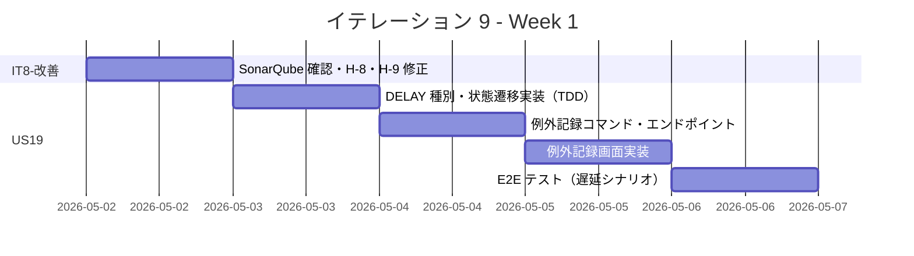
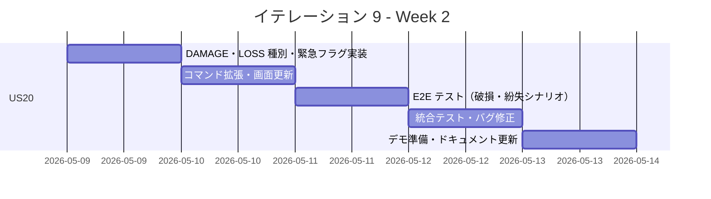
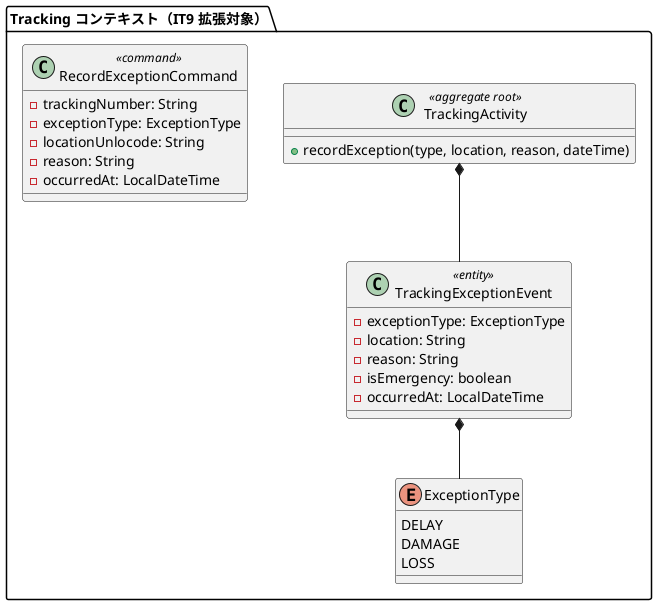
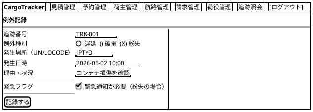
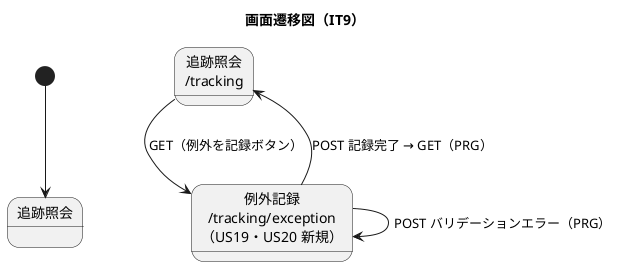

# イテレーション 9 計画

## 概要

| 項目 | 内容 |
|------|------|
| **イテレーション** | 9 |
| **期間** | Week 17-18（2026-05-02 〜 2026-05-15） |
| **ゴール** | IT8 申し送り事項（受入条件未達成の H-8・H-9 対応と SonarQube 確認）を解消し、遅延・破損・紛失の例外処理を実装して Phase 3 例外処理機能を完成させる |
| **目標 SP** | 12 |

---

## ゴール

### イテレーション終了時の達成状態

1. **IT8-改善完了**: H-8（費用情報表示）・H-9（割り当て済み経路情報表示）の受入条件未達成箇所を修正し、SonarQube Quality Gate を確認する
2. **US19 完了**: 追跡管理者が遅延発生を記録すると、貨物状態が「例外発生」に更新され、例外対応履歴が記録される
3. **US20 完了**: 追跡管理者が破損・紛失を記録すると、貨物状態が「例外発生」に更新され、紛失の場合は緊急フラグが設定される

### 成功基準

- [x] H-8: `route.html` の経路一覧テーブルに費用情報（estimatedCost）が表示される
- [x] H-9: `show.html` の予約詳細画面に割り当て済み経路情報（cargoItinerary legs）が表示される
- [ ] SonarQube Quality Gate が PASS している
- [ ] 遅延例外（EXCEPTION 状態）を記録できる
- [ ] 破損・紛失例外を記録できる
- [ ] 記録後、貨物状態が「例外発生（EXCEPTION）」に更新される
- [ ] 例外対応履歴が記録される
- [ ] テストカバレッジ 80% 以上

---

## ユーザーストーリー

### 対象ストーリー

| ID | ユーザーストーリー | SP | 優先度 |
|----|-------------------|----|--------|
| IT8-改善 | IT8 申し送り事項対応（H-8・H-9 受入条件充足・SonarQube 確認） | 2 | 必須 |
| US19 | 遅延例外を処理する | 5 | 必須 |
| US20 | 破損・紛失例外を処理する | 5 | 必須 |
| **合計** | | **12** | |

### ストーリー詳細

#### IT8-改善: 受入条件充足・SonarQube 確認

**対応内容**:

- H-8: `route.html` 経路一覧テーブルに概算費用（`estimatedCost`）カラムを追加する（US09-AC1 の受入条件充足）
- H-9: `show.html` 予約詳細画面に割り当て済み経路の legs 情報（航海番号・積み込み港・荷降ろし港・日時）を表示する（US11-AC1 の受入条件充足）
- SonarQube スキャン実行・Quality Gate 確認・Critical/Major イシュー修正

#### US19: 遅延例外を処理する

**ストーリー**:
> 追跡管理者として、輸送中に遅延が発生した場合、例外種別「遅延」として記録し、荷主への通知と対応内容を管理したい。なぜなら、遅延情報を速やかに荷主に伝え、対応策（代替ルート等）を迅速に提示できるからだ。

**受入条件**:

1. 追跡番号と例外種別「遅延」・発生状況（場所・日時・理由）を記録できる
2. 記録後、貨物状態が「例外発生（EXCEPTION）」に更新される
3. 荷主に遅延発生の通知が送信される（※メールインフラ未整備のため UI 上の通知記録のみ）
4. 対応内容（新しい到着予定日・対応方針）を入力して荷主に対応報告を送信できる
5. 例外対応履歴が記録される

#### US20: 破損・紛失例外を処理する

**ストーリー**:
> 追跡管理者（または荷役作業員）として、輸送中に破損または紛失が発生した場合、例外種別「破損」または「紛失」として記録し、関係者に緊急通知を送りたい。なぜなら、重大な例外は即座に全関係者に共有し、保険手続き・補償対応・代替措置を迅速に開始できるからだ。

**受入条件**:

1. 追跡番号と例外種別「破損」または「紛失」・発生状況を記録できる
2. 記録後、貨物状態が「例外発生（EXCEPTION）」に更新される
3. 例外種別「紛失」の場合、緊急フラグが設定されて記録される
4. 荷主に破損・紛失発生の通知が送信される（※メールインフラ未整備のため UI 上の通知記録のみ）
5. 対応内容（補償方針等）を入力して荷主に報告を送信できる

### タスク

#### 1. IT8-改善（2 SP）

| # | タスク | 見積もり | 担当 | 状態 |
|---|--------|---------|------|------|
| 1.1 | SonarQube スキャン実行・Quality Gate 確認・Critical/Major イシュー修正 | 1h | - | [ ] |
| 1.2 | H-8: `route.html` に概算費用カラム（`RouteCandidate.estimatedCost`）を追加（TDD） | 1h | - | [ ] |
| 1.3 | H-9: `show.html` に割り当て済み経路情報（cargoItinerary legs）表示を追加（TDD） | 1h | - | [ ] |
| 1.4 | E2E テスト: H-8・H-9 の受入条件を E2E で確認（booking.spec.ts 拡張） | 1h | - | [ ] |

**小計**: 4h（理想時間）

#### 2. US19: 遅延例外を処理する（5 SP）

| # | タスク | 見積もり | 担当 | 状態 |
|---|--------|---------|------|------|
| 2.1 | `ExceptionType.DELAY` 追加・`TrackingActivity` 状態遷移更新（ANY → EXCEPTION）（TDD） | 2h | - | [ ] |
| 2.2 | `TrackingCommandService`: 例外記録コマンド実装（`RecordExceptionCommand`）（TDD） | 1h | - | [ ] |
| 2.3 | GET/POST /tracking/exception エンドポイント実装 | 1h | - | [ ] |
| 2.4 | Thymeleaf: 例外記録画面（tracking/exception.html）実装（遅延・理由・対応内容フィールド） | 2h | - | [ ] |
| 2.5 | E2E テスト: 遅延例外記録シナリオ（exception.spec.ts 新規） | 2h | - | [ ] |

**小計**: 8h（理想時間）

#### 3. US20: 破損・紛失例外を処理する（5 SP）

| # | タスク | 見積もり | 担当 | 状態 |
|---|--------|---------|------|------|
| 3.1 | `ExceptionType.DAMAGE`・`ExceptionType.LOSS` 追加・緊急フラグ（isEmergency）実装（TDD） | 2h | - | [ ] |
| 3.2 | `TrackingCommandService`: 破損・紛失記録コマンド拡張（緊急フラグ対応）（TDD） | 1h | - | [ ] |
| 3.3 | exception.html に破損・紛失選択肢・緊急フラグ表示を追加 | 1h | - | [ ] |
| 3.4 | E2E テスト: 破損・紛失例外記録シナリオ（exception.spec.ts 拡張） | 2h | - | [ ] |
| 3.5 | 統合テスト・バグ修正 | 2h | - | [ ] |

**小計**: 8h（理想時間）

#### タスク合計

| カテゴリ | SP | 理想時間 | 状態 |
|---------|----|---------|------|
| IT8-改善 | 2 | 4h | [ ] |
| US19 遅延例外処理 | 5 | 8h | [ ] |
| US20 破損・紛失例外処理 | 5 | 8h | [ ] |
| **合計** | **12** | **20h** | |

**1 SP あたり**: 約 1.7h
**進捗率**: 0% (0/12 SP)

---

## スケジュール

### Week 1（Day 1-5）



| 日 | タスク |
|----|--------|
| Day 1 | IT8-改善: SonarQube 確認・H-8 費用情報・H-9 経路情報表示修正 |
| Day 2 | US19: ExceptionType.DELAY・状態遷移実装（TDD） |
| Day 3 | US19: 例外記録コマンド・エンドポイント実装 |
| Day 4 | US19: 例外記録画面（exception.html）実装 |
| Day 5 | US19: E2E テスト・統合テスト |

### Week 2（Day 6-10）



| 日 | タスク |
|----|--------|
| Day 6 | US20: ExceptionType.DAMAGE・LOSS・緊急フラグ実装（TDD） |
| Day 7 | US20: コマンド拡張・画面更新（破損・紛失選択肢） |
| Day 8 | US20: E2E テスト（破損・紛失・緊急フラグシナリオ） |
| Day 9 | 統合テスト・バグ修正 |
| Day 10 | デモ準備・ドキュメント更新 |

---

## 設計

### ドメインモデル

> **注**: IT7-8 で構築した Tracking コンテキストを拡張する。US19・US20 は `ExceptionType` 列挙型追加と `TrackingActivity` への例外記録メソッド追加。既存の `TrackingStatus.EXCEPTION` 状態に遷移させる。



### データモデル

> **注**: IT9 での DB マイグレーションが必要。`tracking_handling_event` に `exception_type`・`reason`・`is_emergency` カラムを追加するか、`tracking_exception_event` テーブルを新設するかを検討する。既存テーブルへの追加（NULL 許容）で対応する方針とする。

**追加カラム案（tracking_handling_event テーブル）**:

```sql
ALTER TABLE tracking_handling_event
  ADD COLUMN reason VARCHAR(500),
  ADD COLUMN is_emergency BOOLEAN DEFAULT FALSE;
```

> EXCEPTION イベントは `event_type = 'EXCEPTION'` として既存テーブルに記録し、`reason` と `is_emergency` でコンテキスト情報を保持する。マイグレーションは `V9__add_exception_fields.sql` として追加する。

### ユーザーインターフェース

#### ビュー

##### 例外記録画面 (/tracking/exception) — US19・US20 新規



#### インタラクション



**フィードバックメッセージ**:

| 操作 | メッセージ | スタイル |
|------|----------|---------|
| 遅延例外記録成功 | 「遅延例外を記録しました。貨物状態: 例外発生」 | `alert-success` |
| 破損例外記録成功 | 「破損例外を記録しました。貨物状態: 例外発生」 | `alert-success` |
| 紛失例外記録成功（緊急） | 「紛失例外を記録しました【緊急】。貨物状態: 例外発生」 | `alert-warning` |
| 例外記録失敗（追跡番号不在） | 「追跡番号が見つかりません」 | `alert-danger` |

### ディレクトリ構成

```
apps/cargo-tracker/src/main/java/.../tracking/
├── domain/model/
│   ├── valueobjects/
│   │   └── ExceptionType.java         (IT9 新規: DELAY・DAMAGE・LOSS)
│   └── aggregates/
│       └── TrackingActivity.java      (recordException() 追加)
├── application/internal/commandservices/
│   ├── TrackingCommandService.java    (recordException() 追加)
│   └── RecordExceptionCommand.java    (IT9 新規)
└── interfaces/web/
    └── TrackingThymeleafController.java (GET/POST /tracking/exception 追加)

apps/cargo-tracker/src/main/resources/templates/tracking/
└── exception.html                     (IT9 新規)

apps/cargo-tracker/src/main/resources/db/migration/
└── V9__add_exception_fields.sql       (IT9 新規)

apps/cargo-tracker/e2e/src/tests/
└── exception.spec.ts                  (IT9 新規: US19・US20)
```

### API 設計

| メソッド | エンドポイント | 認証 | 説明 |
|---------|---------------|------|------|
| GET | /tracking/exception | 要 | 例外記録フォームを表示する（IT9 新規） |
| POST | /tracking/exception | 要 | 例外を記録する（US19・US20） |

### データベーススキーマ

```sql
-- V9__add_exception_fields.sql
ALTER TABLE tracking_handling_event
  ADD COLUMN reason VARCHAR(500),
  ADD COLUMN is_emergency BOOLEAN NOT NULL DEFAULT FALSE;
```

---

## ストーリー間の依存関係

| 依存元 | 依存先 | 理由 |
|--------|--------|------|
| US20 | US19 | ExceptionType と例外記録基盤（US19）を拡張して破損・紛失を追加する |
| US19・US20 | IT8（US18） | 追跡情報照会で例外発生状態を確認するため US18 が必要 |

実装順序: IT8-改善 → US19（遅延例外）→ US20（破損・紛失例外）

## IT8 申し送り事項の対応方針

| 優先度 | 項目 | IT9 対応方針 |
|--------|------|-------------|
| 高 | H-8 費用情報表示 | IT9 冒頭で対応（route.html に estimatedCost カラム追加） |
| 高 | H-9 経路情報表示 | IT9 冒頭で対応（show.html の cargoItinerary 表示を確認・修正） |
| 中 | SonarQube 確認 | IT9 改善タスクで実施 |
| 中 | US18 推定到着日 | IT9 スコープ外（US19・US20 優先）。IT10 へ持ち越し |
| 低 | H2 長時間稼働問題 | 運用上の回避策（アプリ再起動）で対応継続。IT10 リリース準備時に根本対策を検討 |
| 低 | メール通知スコープ | IT10 リリース準備フェーズで判断 |

## IT5 レビュー指摘事項の対応方針（引き続き保留中）

| 指摘 # | 内容 | IT9 対応方針 |
|--------|------|-------------|
| H-1 | `assignItinerary` に `requireStatus` EnumSet パターン適用 | IT9 スコープ外。IT10 へ持ち越し |
| H-2 | `assignItinerary` 完了時に `CargoRoutedEvent` 発行 | IT9 スコープ外。IT10 へ持ち越し |
| H-3 | `assignRoute` を `executeBookingCommand` パターンに統合 | IT9 スコープ外。IT10 へ持ち越し |
| H-5 | `routeDetail` の未使用 `bookingId` 削除 | IT9 スコープ外。IT10 へ持ち越し |
| H-6 | `BookingThymeleafControllerTest` セットアップを `@BeforeEach` に集約 | IT9 スコープ外。IT10 へ持ち越し |
| H-7 | `route.html` にフィードバックメッセージ表示領域を追加 | IT8 改善で対応済みを確認する |

## リスクと対策

| リスク | 影響度 | 対策 |
|--------|--------|------|
| DB マイグレーションによる既存データへの影響 | 中 | NULL 許容カラム追加で後方互換性を保つ。開発環境のみ H2・本番は PostgreSQL |
| 例外種別の状態遷移が複雑になる | 中 | 既存の `EXCEPTION` 状態に集約し、ExceptionType で種別を区別する |
| H2 長時間稼働によるテスト不安定性 | 低 | アプリ再起動で回避。E2E テスト前に起動直後の状態から実行する |

---

## 完了条件

### Definition of Done

- [ ] コードレビュー完了
- [ ] ユニットテストがパス（Java テスト件数 > 301 件）
- [ ] E2E テストがパス（E2E テスト数 > 87 件）
- [ ] SonarQube Quality Gate PASS
- [ ] 機能がローカル環境で動作確認済み
- [ ] ドキュメント更新完了

### デモ項目

1. H-8 修正: `route.html` の経路一覧に費用情報が表示されることを確認
2. H-9 確認: `show.html` の予約詳細に割り当て済み経路情報が表示されることを確認
3. 追跡番号を指定して遅延例外を記録し、貨物状態が「例外発生」に更新されることを確認
4. 破損例外を記録し、貨物状態が「例外発生」に更新されることを確認
5. 紛失例外を記録し、緊急フラグが設定されて記録されることを確認

---

## 更新履歴

| 日付 | 更新内容 | 更新者 |
|------|---------|--------|
| 2026-04-20 | 初版作成 | - |

---

## 関連ドキュメント

- [イテレーション 9 ふりかえり](./retrospective-9.md)
- [イテレーション 8 計画](./iteration_plan-8.md)
- [イテレーション 8 ふりかえり](./retrospective-8.md)
- [リリース計画](./release_plan.md)
