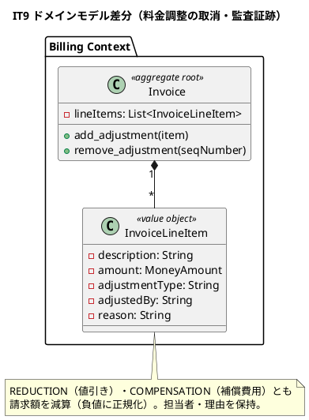
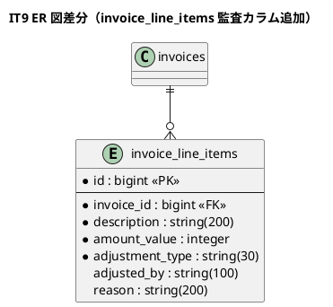

# イテレーション 9 計画 - 料金調整の実運用ハードニング

## ゴール

MVP（全受入基準充足・Release 1.1）後のハードニング・イテレーションとして、IT8 のマルチパースペクティブレビューとふりかえりで浮かんだ実運用上の課題を解消する。特に料金調整（US21-6）を経理業務として回せる形（補償費用の方向確定・取消・監査証跡・例外からの導線）に仕上げ、シードの BC privacy バイパスを解消し、設計規律（T43/T44）を DoD に明文化する。新規 BC・新規ストーリーはなく、既存 Billing/Tracking Context の延長で完結する。

## 対象（IT8 Try 消化・ハードニング）

| 項目 | 内容 | 由来 | 見積 |
|:---|:-----|:---|:--|
| T45 | 「補償費用」の増減方向を業務判断で確定し実装・設計へ反映 | IT8 レビュー高2 | 1 |
| T47a | 料金調整の取消・訂正（誤入力の是正） | IT8 user-rep 中 | 2 |
| T47b | 料金調整の監査証跡（担当者・日時・理由） | IT8 user-rep 中 | 2 |
| T47c | 例外画面（追跡管理）から該当請求書の料金調整への導線 | IT8 user-rep 中 | 1 |
| T46 | シードのデモ状態生成を公開経路（calculate_freight の発行日時）に置換し privacy バイパスを解消 | IT8 architect 中 | 1 |
| T43/T44 | プロセス DoD 明文化（現場ケース起点の状態機械設計・ドメイン不変条件の閉じ込め） | IT8 Try | - |
| **合計** | | | **7** |

> IT9 は release_plan（7 IT + 予備 1）を超える MVP 後のハードニング・イテレーション。development_strategy の局面表（IT1-7）外であり、終盤継続の品質改善局面として位置づける（正当な逸脱・計画に明記）。

## 業務判断（着手前に確定）— T45 補償費用の増減方向

IT8 レビューで「補償費用は当社が荷主へ負担するもので請求額を**減算**すべき（実装は加算）」と指摘された。業務判断として以下に確定する。

- **減額（REDUCTION）**: 当社都合の値引き（goodwill）。請求額を減算する。
- **補償費用（COMPENSATION）**: 遅延・破損に対し当社が荷主へ補償するクレジット。**請求額を減算する**（当社負担）。会計上、減額とは別種別として区別する。

→ 両種別とも請求額を減算する方向に統一する（`InvoiceLineItem` の符号正規化を COMPENSATION も負値に変更）。追加請求が必要な特殊ケース（特別取扱料等）は本 IT のスコープ外とし、将来 `SURCHARGE_LINE` 種別として別途検討する。

## 受入条件

**T45 補償費用の方向**（として: 経理担当者）

- [ ] 補償費用（COMPENSATION）を入力すると請求額が減算される
- [ ] 減額・補償費用のいずれも種別が明細に区別して記録される

**T47a 料金調整の取消**（として: 経理担当者）

- [ ] 追加した料金調整（未精算の請求書）を取り消せる
- [ ] 取消後、請求金額が調整前に再計算される

**T47b 監査証跡**（として: 経理担当者）

- [ ] 料金調整に担当者・理由が記録される
- [ ] 請求書詳細で調整の担当者・日時・理由を確認できる

**T47c 例外からの導線**（として: 追跡管理者/経理担当者）

- [ ] 例外管理一覧から該当貨物の請求書（あれば）へ遷移できる

## タスク分解（アウトサイドイン・ハードニング）

### 設計トピックの確定（着手前・T43/T44）

- [x] 【T43】状態機械のガードは「受入基準の文面」でなく「現場の典型ケース（期限後入金・部分入金・取消等）」を洗い出して設計する DoD を `docs/reference/コーディングとテストガイド.md` に明文化
- [x] 【T44】ドメイン不変条件（符号・正規化・下限）は必ず VO/集約に閉じアプリ層に置かない設計チェックを DoD に明記（IT8 で符号を InvoiceLineItem に閉じた実績を参照）

### T45 補償費用の方向確定（Billing Context）

- [x] `InvoiceLineItem` の符号正規化を COMPENSATION も負値に変更（減額・補償とも減算）のユニット spec
- [x] 既存の料金調整テスト（IT8）を新方向に更新・請求書詳細の表示を「補償費用（減算）」に整合

### T47a/b 取消・監査証跡（Billing Context）

- [x] `invoice_line_items` に `adjusted_by`（string・担当者）・`reason`（string・理由）カラムを追加
- [x] `InvoiceLineItem` に adjusted_by・reason を追加し永続化・復元
- [x] `Invoice#remove_adjustment(seq_number)`（明細除去・total 再計算・未精算のみ）のユニット spec
- [x] `AdjustFreight` に adjusted_by/reason を受け取る・`CancelAdjustment` ユースケース
- [x] BillingService#adjust（adjusted_by/reason）・#cancel_adjustment 公開
- [x] 請求書詳細に調整明細の担当者・日時・理由を表示・取消ボタン（未精算時）

### T47c 例外→請求導線（UI）

- [x] 例外管理一覧に「請求書へ」リンク（`BillingService#find_by_booking_id` で請求書があれば表示）
- [x] BillingService に予約番号から請求書番号を引く公開クエリを追加

### T46 シードの privacy バイパス解消（Billing 公開 API）

- [x] `BillingService#calculate_freight` に `issued_at:` 任意引数を通す（既存 clock 経由）
- [x] db/seeds.rb のデモ未払い請求を `calculate_freight(issued_at: 過去日)` で発行し、生 SQL の invoices 直接更新を除去

### 受入・回帰

- [x] T45/T47a/T47b/T47c/T46 の request/ユニット spec
- [x] seed 実行の冪等性・privacy（Packwerk）確認

## スケジュール

| Week | 主な作業 |
|:-----|:---------|
| Week 16 | 設計トピック確定（T43/T44 DoD 化）・業務判断（T45）→ InvoiceLineItem 符号変更（T45）→ 監査カラム追加・remove_adjustment・CancelAdjustment（T47a/b） |
| Week 16 後半 | 請求書詳細の監査/取消 UI・例外→請求導線（T47c）→ calculate_freight の issued_at 公開・seed 置換（T46）→ 受入 spec の green 化・品質ゲート（SonarQube）→ Release 1.2 |

## 設計（IT9 スコープに絞った図）

> 新規集約はなく既存 Invoice の延長のため、ドメインモデル図（差分）と ER 図（差分）を掲載。状態遷移図は IT8 の PaymentStatus から変更なしのため省略。画面遷移図は既存画面（請求書詳細・例外一覧）の拡張のため省略し、拡張箇所を注記する。

### ドメインモデル図（差分・料金調整の取消/監査）

### ER 図（差分）

## リスク

| リスク | 対策 |
|--------|------|
| 補償費用の方向変更が既存の請求データ・テストを壊す | 既存の IT7/IT8 テストを新方向へ更新。永続化済みの請求は少数（seed のみ）で影響限定。方向は計画の業務判断で確定してから着手 |
| 監査カラム追加が既存 invoice_line_items 復元を壊す | nullable カラムで追加。既存レコードは nil（監査なし）で復元可能 |
| 取消で total が二重計算される | `remove_adjustment` は明細合算から total を再計算（明細を正とする）。IT7 の「明細検算可能」DoD（T38）で担保 |
| seed の issued_at 公開が本番の calculate_freight を汚す | `issued_at:` は任意引数で既定は現在時刻（clock）。本番挙動は不変・シードのみ過去日を渡す |

## 設計への反映が必要（validating 検証で確定予定）

1. **補償費用の方向**: domain-model・ui_design に「減額・補償費用とも請求額を減算」を明記（US21-6 の解釈確定）。
2. **invoice_line_items の監査カラム**: data-model に adjusted_by・reason を追加。
3. **料金調整の取消**: domain-model に `remove_adjustment` を追記。
4. **例外→請求導線**: ui_design の例外管理一覧に請求書リンクを追記。

## Definition of Done

- [ ] T45（補償費用の方向確定）・T47a/b/c（取消・監査・導線）・T46（seed privacy 解消）を実装
- [ ] 料金調整の取消・監査証跡・補償費用減算の spec が green
- [ ] seed が生 SQL の invoices 直接更新を用いず公開 API 経由（Packwerk privacy 0・冪等）
- [ ] **状態機械のガードは現場ケース起点で設計**（T43 を DoD 明文化）
- [ ] **ドメイン不変条件は VO/集約に閉じる**（T44 を DoD 明文化・符号は InvoiceLineItem）
- [ ] `bundle exec rspec` 全 green / rubocop（0）/ brakeman（0）/ bundler-audit（0）/ packwerk（privacy 0）green・CI success
- [ ] ドメイン層カバレッジ 85% 以上・全体 80% 以上
- [ ] **SonarQube Quality Gate PASS**（違反 0・重複 3% 未満・新規カバレッジ 80% 以上）
- [ ] 上記「設計への反映が必要」の 4 点を `docs/design/` に反映済み
- [ ] **Release 1.2 を発行**（`ruby/take-1/v1.2.0`）

## デモ項目（イテレーションレビュー）

1. 補償費用を入力すると請求額が減算され、減額と種別が区別して明細に記録される。
2. 誤って追加した料金調整を取り消すと請求金額が調整前に戻る。
3. 料金調整に担当者・理由が記録され、請求書詳細で確認できる。
4. 例外管理一覧から該当貨物の請求書へ遷移できる。
5. `db:seed` が生 SQL を使わず公開 API 経由で未払いデモ請求を作成できる（Packwerk 違反なし）。

## 更新履歴

| 日付 | 更新内容 | 更新者 |
|------|---------|--------|
| 2026-07-29 | 初版作成（IT9 ハードニング: T45 補償費用方向・T47 取消/監査/導線・T46 seed privacy・T43/T44 DoD・Release 1.2） | - |

## 関連ドキュメント

- [リリース計画](release_plan.md)
- [イテレーション 8 ふりかえり](retrospective-8.md)（Try T43-T47）
- [イテレーション 8 完了報告書](iteration_report-8.md)
- [IT8 実装レビュー](../review/IT8実装_review_20260729.md)（補償費用方向・取消/監査の指摘）
- [ユーザーストーリー](../requirements/user_story.md)（US21-6）
- [ドメインモデル](../design/domain-model.md)（Billing・InvoiceLineItem）
- [データモデル](../design/data-model.md)（invoice_line_items）
