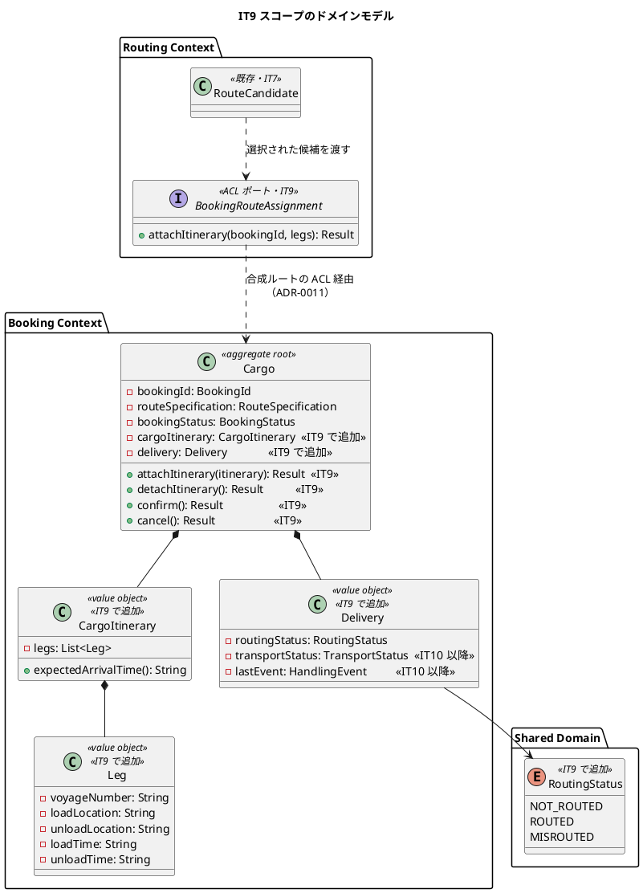
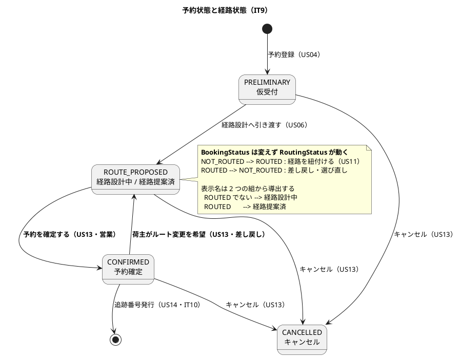
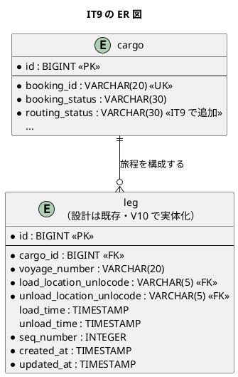
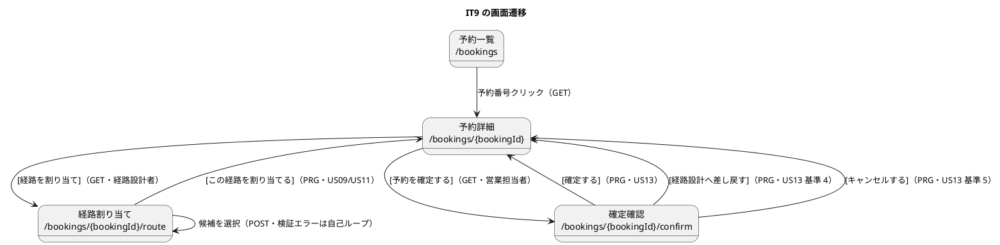
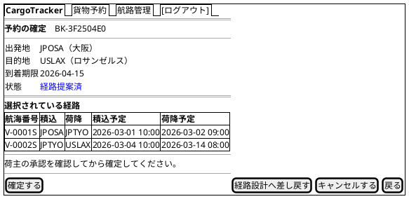

# イテレーション 9 計画

## 概要

| 項目 | 内容 |
| :--- | :--- |
| 期間 | 2026-08-04 〜（2 週間） |
| 局面 | **終盤**（[開発戦略](development_strategy.md) IT8-IT12。アウトサイドイン） |
| 計画 SP | **12**（US09 5・US11 3・US13 3・TS16 1） |
| 前提 | [IT8 完了報告書](iteration_report-8.md)・[IT8 ふりかえり](retrospective-8.md) |

**IT9 は「経路が決まってから予約が確定するまで」を通す**。IT7 で候補を出し、
IT8 で費用を出した。本 IT で**選び・紐付け・確定する**——業務フローの背骨がつながる。

---

## ゴール

### イテレーション終了時の達成状態

経路設計者が候補から 1 件を選んで予約に紐付け、営業担当者が荷主の承認を受けて
予約を確定できる。キャンセル・差し戻しも同じ画面から行える。

### 成功基準

| # | 基準 | 検証 |
| :--: | :--- | :--- |
| 1 | 経路設計者が候補を選択し、確定した経路が予約に紐付く | `RouteAssignHttpTest` |
| 2 | 営業担当者が予約を確定でき、状態が「予約確定」になる | `BookingConfirmHttpTest` |
| 3 | 荷主の希望で「経路設計中」へ差し戻せる・キャンセルできる | 同上 |
| 4 | **Routing が Booking の集約不変条件を迂回しない**（ADR-0011 で方式を決める） | `arch-lint` + 統合テスト |
| 5 | `POST /login` に CSRF 検証が効く | `CsrfTest` |
| 6 | 全テスト緑・`arch-lint` 0 件・`trace-lint` 0 件・CI 緑 | クローズ手順 |

---

## IT8 ふりかえりの反映

[IT8 ふりかえり](retrospective-8.md) の Try 6 件を、本計画のどこで使うかを先に決める。
**Try を書いただけで使わなかった**のが IT8 の最大の問題だった（P1・P3）。

| Try | 本 IT での置き場所 |
| :--- | :--- |
| **T1** 合成ルートに置いた翻訳には、翻訳そのものを通すテストを必ず添える | タスク 0.2 で置き場所を決める（`composition/acl/` の導入可否を含む）。**決めた置き場所によらず、翻訳を通すテストは必ず書く**。テストは `WiringTest` の BC 別の節 |
| **T2** 「全部」を謳うテストは列挙をやめ正典から生成する | タスク 1.1 の DoD。新しいルートを足したら `WiringTest` は自動で対象に含む（IT8 で生成方式へ変更済み） |
| **T3** 着手時に計画の「壊れ方の観点」表を読み、該当行をコミットメッセージに引用する | **全実装タスクの DoD**。引用が無いコミットは DoD 未達とする |
| **T4** 画面に書いた「値の整形」は、桁・単位・端数を含むならドメインへ移す | タスク 2.3（状態の表示名の導出）で適用 |
| **T5** 受入テストに `contains("円")` のような型だけの検査を書かない | タスク 1.4・2.4 の DoD。単体テストが値を固定しているならその値で突合 |
| **T6** 測定は各条件 3 回とり、中央値と幅を記録する | 本 IT に測定タスクは無い。**IT10 の TS12b 残件で使う**（記録のみ） |

> **Try の番号には出典を添える**。本 IT は IT6 の T8（設計にあるものを実物で確認する）と
> IT7 の T4（毎朝どう使うかを 3 行で書く）も使うが、**IT8 の T4 とは別物**である。
> 番号だけ書くと取り違える。

### 着手前に決めた事項（ユーザー判断・2026-08-04）

| # | 論点 | 決定 |
| :--: | :--- | :--- |
| 1 | ログイン CSRF の扱い | **TS16 として 1 SP 計上**。IT9 を 12 SP にする。「余力次第」と書かない（ADR-0008 が 3 IT 繰越した前例） |
| 2 | US11 の状態遷移と `domain-model.md` の食い違い | **ユーザーストーリーを正とする**。経路の紐付けは `BookingStatus` を変えず `RoutingStatus` を `ROUTED` にする。`CONFIRMED` は US13 でのみ到達 |

---

## ユーザーストーリー

### 対象ストーリー

| ID | ストーリー | SP | 優先度 | 状態 |
| :--- | :--- | :--: | :--- | :--- |
| US09 | 経路を選択・確定する | 5 | 高 | 未着手 |
| US11 | 経路情報を予約に紐付ける | 3 | 高 | 未着手 |
| US13 | 予約を確定する | 3 | 高 | 未着手 |
| TS16 | ログイン CSRF の検証 | 1 | 高 | 未着手 |
| **合計** | | **12** | | |

> **12 SP はベロシティ（11 SP × 4 連続）を 1 SP 上回る**。
> TS16 は 1 SP と小さく、かつ**着手順を先頭に置く**（脆弱性を残したまま
> 業務機能を積まない）。超過分のリスクは縮退順序で受ける。

### ストーリー詳細

#### US09: 経路を選択・確定する（5 SP）

**として**: 経路設計者
**したい**: 算出された経路候補から最適なものを選択し、経路を確定したい
**なぜなら**: 最適経路を正式に確定し、予約への紐付けに進めるからだ

**対応 UC**: UC07

**受け入れ基準**:

- [ ] 経路候補一覧（経由港・所要日数・費用・航海番号）を確認できる — **IT7・IT8 で充足済み**
- [ ] 最適な経路候補を 1 件選択できる
- [ ] 選択後、経路状態が「確定」になる
- [ ] 最適な候補がない場合、経路条件調整（US10）に進める — **US10 は将来リリース**。
      候補 0 件の案内（IT7 実装済み）で代替し、**その旨を画面に明記する**

**この利用者は毎朝どう使うか**（[IT7 の Try T4](retrospective-7.md)）:

1. 朝、`/bookings?status=ROUTE_PROPOSED` を開く（IT8 で入れた絞り込み。運用手順どおり）
2. 予約詳細 → [経路を割り当て] で候補を見る。**「速いが高い」「遅いが安い」を比べる**
3. 1 件選んで確定する。**選び直しは起こる**——荷主が「もっと安く」と言えば戻ってくる

3 が受入基準に無い要求である。**確定は取り消せる必要がある**（US13 の差し戻しと同じ経路）。

#### US11: 経路情報を予約に紐付ける（3 SP）

**として**: 経路設計者
**したい**: 確定した経路情報を貨物予約に紐付けたい
**なぜなら**: 予約と経路の関連を確立し、営業担当者が荷主にルート提案できるようにするからだ

**対応 UC**: UC09

**受け入れ基準**:

- [ ] 確定経路と予約番号を確認できる
- [ ] 経路情報を予約に紐付ける操作を実行できる
- [ ] 紐付け後、予約状態が「経路提案中」に更新される
      — **`BookingStatus` は `ROUTE_PROPOSED` のまま、`RoutingStatus` を `ROUTED` にする**。
      表示名を `(BookingStatus, RoutingStatus)` から導出し「経路提案済」と出す（着手前の決定 2）

#### US13: 予約を確定する（3 SP）

**として**: 営業担当者
**したい**: 荷主がルートを承認したことを確認して予約を正式確定したい
**なぜなら**: 荷主の同意を記録し、追跡番号発行・輸送手配に進めるからだ

**対応 UC**: UC11

**受け入れ基準**:

- [ ] 予約番号を指定して予約内容と選択ルートを確認できる
- [ ] 確定操作を行うと予約状態が「予約確定」に更新される
- [ ] 経路設計者に追跡番号発行依頼の通知が送信される — **通知は US12 と同じく将来リリース**。
      本 IT は**予約一覧の絞り込み**（IT8）で代替し、`operation.md` に手順を書く
- [ ] 荷主がルート変更を希望する場合、予約を「経路設計中」に戻せる
- [ ] 荷主がキャンセルを希望する場合、予約をキャンセル状態に変更できる
- [ ] キャンセル時、荷主にキャンセル確認通知が送信される — **同上（将来リリース）**

#### TS16: ログイン CSRF の検証（1 SP）

IT8 レビュー（tester・スコープ外の発見）。`POST /login` は `anonymous()` として
登録され、`requiresCsrf` は `Anonymous` に `false` を返す。一方 `AuthPages` は
フォームに `_csrf` を描画している——**出しているが検証していない**。

`Auth.flix` のコメントは「未認証で状態を変更する経路は現時点で存在せず、
あれば設計の誤り」と書いているが、**ログイン自体がその反例**である。

### 壊れ方の観点（6 軸）

**着手時にこの表を読む**（Try T3）。該当行をコミットメッセージに引用する。

| 軸 | 想定する壊れ方 | 対応 |
| :--- | :--- | :--- |
| 軸 1（境界） | 候補 0 件・区間 1 件・区間 3 件以上で紐付けの挙動が変わる | 直行・積替 1 回・積替 2 回の 3 通りを受入テストに置く |
| 軸 2（同時実行） | 経路設計者 2 人が同じ予約に別の経路を紐付ける | **楽観的ロック**（ADR-0008 の版と同じ形）。`findForUpdate` で行を押さえる |
| 軸 3（表示経路） | `ROUTED` でないのに「経路提案済」と出る／確定済みなのに [確定] ボタンが押せる | 表示名は `(BookingStatus, RoutingStatus)` から導出し、**画面ごとに書き直さない**（T4） |
| 軸 4（状態遷移） | `CONFIRMED` から `ROUTE_PROPOSED` へ戻すとき、経路が残ったままになる | 差し戻しは `RoutingStatus` も `NOT_ROUTED` に戻す。**戻した後に選び直せる**ことをテストで固定 |
| 軸 5（実行環境） | Routing が `cargo` を直接 `UPDATE` し、Booking の不変条件を迂回する | **ADR-0011**。書き込みは Booking の集約を通す（タスク 0.2） |
| 軸 6（可視範囲） | 荷主が他社の予約を確定・キャンセルできる | `findVisible` の内側で操作する。**荷主ロールに確定操作を出さない** |

---

## タスク

### 0. 着手前の準備（0 SP）

| # | タスク | 見積もり | 担当 | 状態 |
|:--:|-------|:---:|:---|:---|
| 0.1 | **IT8 ふりかえりの Try 6 件の置き場所を決める**（本書の表） | 0.5h | AI | ✅ 完了 |
| 0.2 | **ADR-0011: 書き込み方向の越境**（下記）。ADR-0009 の該当節の扱いを決めるまで実装に入らない | 6h | AI | 未着手 |
| 0.3 | **`leg` テーブルと `cargo.routing_status` の実物確認**（[IT6 の Try T8](retrospective-6.md)「設計にあるものを実物で確認する」） | 0.5h | AI | ✅ 完了 |
| 0.4 | **SonarQube の Quality Gate を実行する**（IT8 の未達） | 1h | **利用者** | 未着手 |

**小計**: 5h（0 SP）

> **0.3 の結果（着手前に実施済み）**: `leg` テーブルは **V1-V9 のいずれにも存在しない**。
> `cargo.routing_status` も**存在しない**（V5 のコメントで「Routing Context 実装時」として
> 先送りされていた）。**V10 で両方を作る**。
>
> IT6 は `voyage` / `carrier_movement` が「設計にあるから実装にもある」と考え、
> マイグレーションが失敗して初めて気付いた。IT7・IT8・IT9 と着手前の確認を続けている。

> **0.4 は私（AI）だけでは実行できない**。`.env` が無く `.env.vault` の復号に
> パスワードが要る。**利用者に依頼する**（`npx gulp vault:decrypt && npx gulp sonar-local:check`）。

#### 0.2 の論点: ADR-0009 が US09 の実現手段を既に決めている

**着手前の検証で判明した**（`validating-design` 軸 C）。
[ADR-0009](../adr/ADR-0009-routing-pulls-booking-via-acl.md) は次のように書いている。

> したがって US09 では **Routing が「選ばれた経路」をドメインイベントとして発行し、
> Booking の購読者が `Cargo` を更新する**。Routing が `cargo` / `leg` テーブルへ
> 書き込む形は採らない。
>
> **書き込み方向の越境を許すと、ここまでの BC 独立性の投資が一気に無駄になる**。
> 読み取りの ACL は「相手のスキーマに依存する」だけだが、
> 書き込みの ACL は「**相手の不変条件を壊しうる**」。

**本計画の初版はこれに触れずに同期 ACL ポートを提案していた**。
IT7 のふりかえりが「設計図の向きを変えたら ADR を書く」と学んだ直後に、
**既にある ADR を読まずに向きを変えようとした**——同じ失敗である。

ADR-0011 では次の 2 案を比較し、どちらかを選ぶ。**選ばなかった理由まで書く**。

| 案 | 内容 | 論点 |
| :--: | :--- | :--- |
| **A** | ADR-0009 のとおり**ドメインイベント**で連携する | **イベント基盤が実装に存在しない**（BC 連携は直接呼び出しのみ）。基盤の新設は US11 の 3 SP に収まらない可能性が高い |
| **B** | **Booking のアプリケーションサービスを呼ぶ**同期ポートにし、ADR-0009 の該当節を supersede する | ADR-0009 が守ろうとした「相手の不変条件を壊さない」は、**集約を通せば満たされる**（テーブルへ直接書かない）。イベントの非同期性は本 IT の要求に無い |

**どちらを選ぶにせよ、ADR-0011 は次の 3 つを明記する。**

1. **ADR-0009 の US09 該当節をどう扱うか**（supersede するなら、その旨と理由）
2. **ADR-0010 の適用範囲を「読み取りに限る」**と改訂する（IT8 レビュー・architect の推奨の前半）
3. `composition/acl/` を `arch-lint` 規約 4 の対象に含めるか——**本 IT で決める**。
   本計画の他の箇所で「決定済み」と書いている記述があれば、それは誤りである

> **見積を 3h → 6h へ増やした**。`arch-lint` の `CONTEXTS` と `contextOf` の改修、
> 既存の規約 5・規約 10 の例外との整合まで含むためである。

### 1. 返済枠（0 SP・**Day 2 に独立したコミットで行う**）

**[開発戦略](development_strategy.md)の規律**: 返済は**イテレーション序盤の
独立したコミット枠**として計画に明示する。「余力次第」と書かない。

初版は返済を末尾（Day 9）に置き、しかも縮退順序の 1 番目にしていた——
**それは「余力次第」と書いたのと同じ**である。ADR-0008 が IT6 まで
3 イテレーション繰り越した前例を、書き方を変えて再現するところだった。

| # | タスク | 見積もり | 担当 | 状態 |
|:--:|-------|:---:|:---|:---|
| 1.1 | IT8 レビュー **M4**（`transitDays` が「読めない」を表現できない。DB 列の nullable 化を伴う） | 2h | AI | 未着手 |
| 1.2 | IT8 レビュー **M5**（運賃計算が Routing では presentation 層にある） | 2h | AI | 未着手 |

**小計**: 4h（0 SP）

### 2. TS16 + US09: ログイン CSRF と経路の選択（6 SP）

**先頭に TS16 を置く**。脆弱性を残したまま業務機能を積まない。

| # | タスク | 見積もり | 担当 | 状態 |
|:--:|-------|:---:|:---|:---|
| 2.1 | **`POST /login` に CSRF 検証を効かせる**。`requiresCsrf` を「状態を変える経路は Anonymous でも検証する」形へ。**攻撃を再現するテスト**（トークン無し・他セッションのトークン）で固定 | 4h | AI | 未着手 |
| 2.2 | **受入テストを先に書く**（候補を選ぶ → 確定 → 紐付く）。落ちることを確認する | 3h | AI | 未着手 |
| 2.3 | `CargoItinerary`・`Leg`・`Delivery` 値オブジェクト（Booking Context）。**`RoutingStatus` は共有カーネル** | 5h | AI | 未着手 |
| 2.4 | 経路の選択・確定（集約操作）。**楽観的ロック**（軸 2） | 6h | AI | 未着手 |
| 2.5 | 経路割り当て画面にラジオ選択と [この経路を割り当て] を足す（IT7 の「次のイテレーション」案内を外す）。**L5 の社内語もここで解消** | 5h | AI | 未着手 |

**小計**: 23h（6 SP・1 SP あたり 3.8h）

### 3. US11 + US13: 紐付けと予約確定（6 SP）

| # | タスク | 見積もり | 担当 | 状態 |
|:--:|-------|:---:|:---|:---|
| 3.1 | **V10**（`leg` テーブル・`cargo.routing_status` 列）。0.3 の確認結果に基づく | 3h | AI | 未着手 |
| 3.2 | `Cargo` 集約に `attachItinerary` / `detachItinerary` を足す。**不変条件は集約に置く**（端点が `RouteSpecification` と一致すること・区間が連結していること。[ドメインモデル設計](../design/domain-model.md)のルール 3 に既存） | 5h | AI | 未着手 |
| 3.3 | **状態の表示名を `(BookingStatus, RoutingStatus)` から導出する**（IT8 の Try T4）。画面ごとに書き直さない | 3h | AI | 未着手 |
| 3.4 | 予約確定・差し戻し・キャンセルの画面と操作（**営業担当者のみ**。荷主に出さない） | 6h | AI | 未着手 |
| 3.5 | **予約詳細に「割り当て経路」欄**を出す（US11 受入基準 1）。あわせて `operation.md` に「確定待ちの予約を朝に確認する」手順を足す（通知の代替。**担当ロールで実行できるか確かめる**） | 3h | AI | 未着手 |

**小計**: 20h（6 SP・1 SP あたり 3.3h）

### 4. 観測・規律・ドキュメント（0 SP）

| # | タスク | 見積もり | 担当 | 状態 |
|:--:|-------|:---:|:---|:---|
| 4.1 | **設計ドキュメントの同期**（下表の 8 箇所）。**各実装コミットに同梱する**（戦略「実装と設計は同一コミット」） | 5h | AI | 未着手 |

**小計**: 5h（0 SP）

#### 4.1 の内訳（是正対象 8 箇所）

着手前の検証（`validating-iteration-plan`）で洗い出した。**1 箇所ずつ確認する**。

| # | ファイル | 現在の記述 | 是正内容 |
| :--: | :--- | :--- | :--- |
| 1 | `domain-model.md` | `RouteCargoCommand` … ROUTE_PROPOSED → CONFIRMED | 「`CargoItinerary` を割り当て `RoutingStatus` を ROUTED に。`BookingStatus` は変えない」 |
| 2 | `domain-model.md` | `ConfirmBookingCommand` … PRELIMINARY → CONFIRMED | 「ROUTE_PROPOSED → CONFIRMED」（US13） |
| 3 | `domain-model.md` | シーケンス図 `RouteCargoCommand → CONFIRMED`・「（US09・**IT8**）」 | 同上 + IT9 へ訂正 |
| 4 | `domain-model.md` | ビジネスルール 4「順に進む」 | US13 の差し戻し `CONFIRMED → ROUTE_PROPOSED` を例外として明記 |
| 5 | `domain-model.md` | `RoutingStatus` が Booking Context と Shared Kernel に**二重定義** | 共有カーネル 1 本へ |
| 6 | `data-model.md` | `leg.voyage_number` が `FK → voyage.voyage_number` | **FK を張らない**方針へ（`cargo.shipper_id` の実装と同じ）。Flyway 節に V10 を追加 |
| 7 | `ui_design.md` | 画面一覧に「予約の確定」が無い | 行を追加。予約詳細の [キャンセル] を確認画面への遷移に変更 |
| 8 | `business_rule_traceability.md` | BK-3（旅程の連結）などが未着手 | 本 IT で実装するルールを「済」へ |

> **`Location` 共有カーネルの不在は本 IT では直さない**。設計図は `Location` 型を
> 使っているが実装は `String` + `LocationCatalog` であり、**IT1 から一貫している**。
> 型の導入は全 BC に波及する独立した判断であり、**IT9 のスコープで決めない**。
> 3.1 では**乖離があることを注記する**に留める。

### タスク合計

| ストーリー | SP | 理想時間 |
|-----------|:--:|:---:|
| 0. 着手前の準備 | 0 | 8h |
| 1. 返済枠 | 0 | 4h |
| 2. TS16 + US09 | 6 | 23h |
| 3. US11 + US13 | 6 | 20h |
| 4. 観測・規律・ドキュメント | 0 | 5h |
| **合計** | **12** | **60h** |

> **IT8（75.5h）より 20% 少ない**。返済枠が 27h → 4h に減ったためである。
> 12 SP に対し 60h は IT5-IT7（11 SP / 62-63h）とほぼ同等だが、
> **ADR-0011 の結論しだいで US11 の実装量が変わる**（イベント基盤を作るなら 3 SP に収まらない）。
> タスク 0.2 を Day 1 に置き、**結論が出るまで実装に入らない**のはそのためである。
> US09 の「選び直し」（受入基準に無い要求）と軸 2 の楽観的ロックは、
> 実装してみると膨らむ種類の作業である。縮退順序を先に決めておく。

### 縮退順序（着手前に確定させる）

| 順 | 落とすもの | 理由 |
|:--:|-----------|------|
| 1 | US13 の受入基準 5-6（キャンセル） | 差し戻し（基準 4）が通れば業務は回る。キャンセルは**予約が成立しなかった場合**であり頻度が低い |
| 2 | 3.5 の `operation.md` の手順 | 手順が無くても機能は動く。ただし**通知が無い以上、手順が唯一の安全網**であることは IT7 で学んでいる |
| 3 | US09 の「確定済み経路の差し替え」（IT8 引き継ぎ） | 選び直しは差し戻し（US13 基準 4）でも実現できる。**ただし遠回りになる** |

> **返済枠（節 1）は縮退順序に入れない**。Day 2 に独立コミットで終える。
> 初版は返済を縮退 1 位に置いていたが、それは「余力次第」と同義であり
> [開発戦略](development_strategy.md)の規律に反する。

**TS16（1.1）・US09 の選択（1.4-1.5）・US11 の紐付け（2.2）は落とさない**。
TS16 は脆弱性であり、US09/US11 を落とすと IT9 のゴール自体が消える。

### 縮退の判定日

**Day 7 終了時に判定する**。この時点でタスク 2.4（確定・差し戻し・キャンセル）に
着手できていなければ、縮退順序の 1 番目（3.2）を落とす。

**判定日を決めておく理由**は、IT8 の見積が 20% 多かったにもかかわらず
縮退 0 件で収まったため、「今回も何とかなる」と判断を先送りしやすいからである。
**Day 9 で気付くと、落とす判断そのものが間に合わない**。

---

## 設計

### ドメインモデル（本 IT のスコープ）

> **`RoutingStatus` を共有カーネルに置く**。[ドメインモデル設計](../design/domain-model.md)
> の用語集が既に「Shared Domain」としている。Booking が持ち、Tracking も参照する。
>
> **`Delivery` 値オブジェクトを飛ばさない**。設計は `Cargo` が `Delivery` を持ち、
> `Delivery` が `routingStatus` を持つ形である。`Cargo` に `routingStatus` を直接
> 生やすと**集約の構造が設計と食い違う**——後から `transportStatus` を足すときに
> 置き場所が無くなる。本 IT では `routingStatus` だけを埋め、
> 残る 2 つは Tracking の結合（IT10 以降）で埋める。
>
> **`Leg` のフィールドは `String` である**。設計図は `Location` / `Date` 型を
> 使っているが、**`Location` 共有カーネル型は実装に存在しない**
> （`shared/domain/model/` は `CalendarText`・`FreightTariff`・`Money`・`Security` の 4 つ）。
> UN/LOCODE を `String` で扱い `LocationCatalog` 効果でマスタを引く形は IT1 から
> 一貫しており、**本 IT だけ型を変えない**。設計図と実装のこの乖離は既存のものであり、
> `Location` の導入は独立した判断として別 IT で扱う（タスク 3.1 で**乖離を注記**する）。

### 状態遷移（本 IT のスコープ）

> **`RouteCargoCommand` が `ROUTE_PROPOSED → CONFIRMED` へ遷移するという
> [ドメインモデル設計](../design/domain-model.md) の記述は誤りである**（着手前の決定 2）。
> その形だと US13（営業が荷主の承認を確認して確定する）が成立しない。
> **設計ドキュメントを是正する**（タスク 3.1）。

### データモデル（本 IT のスコープ）

> **着手前に実物を確認した**（タスク 0.3）。`leg` テーブルと `cargo.routing_status` は
> **V1-V9 のいずれにも存在しない**。ただし[データモデル設計](../design/data-model.md)には
> 両方とも定義済みであり、**V10 は「新設計」ではなく「既存設計の実体化」**である。
>
> **監査列（`created_at` / `updated_at`）を落とさない**。設計判断 7 が全テーブルに
> 付与すると定めている。
>
> `leg.voyage_number` の FK（`voyage.voyage_number`）は**張らない**。
> Booking と Routing はコンテキストが違い、参照整合性を DB で縛らない方針である。
> **実装の前例は `cargo.shipper_id`** であり、V5 が「Booking と Shipper は別コンテキスト
> であり FK を張らない」と明記している。
>
> **ただし `data-model.md` は `leg.voyage_number` を `FK → voyage.voyage_number` と
> 書いており、実装方針と食い違う**（`cargo.shipper_id` も設計図では `<<FK>>` だが
> 実装は FK 無しであり、同じ乖離が既に存在する）。タスク 3.1 で**設計側を実装に合わせる**。
>
> **`cargo.routing_status` は `NOT NULL DEFAULT 'NOT_ROUTED'` で追加する**。
> 既存行（IT4-IT8 で作られた予約）は経路を持たないため、既定値がそのまま正しい。
> **バックフィルは不要**だが、既定値を書かないと `ALTER TABLE` が失敗する。

### ユーザーインターフェース（本 IT のスコープ）

**ビュー（確定確認画面・新規）**:

**インタラクション**:

- 遷移は **PRG**（成功時のみ）。検証エラーは **200 でフォームを返す**（既存と同じ）。
  確定確認画面も**自己ループ**を持つ（版が古い場合・状態が変わっていた場合）
- 候補の選択は**ラジオボタン**。ここは
  [UI 設計](../design/ui_design.md)の既存仕様どおり **htmx（`hx-get`）で
  「選択中の航路詳細」を部分更新する**——**読み取りのみ**であり状態を変えないため、
  CSRF トークンは不要である（`arch-lint` 規約 8 は「状態を変える form」に限る）。
  **割り当ての実行は別の POST** であり、そちらは CSRF トークンを伴う
- **押せるのに 403 になるボタンを出さない**（壊れ方の観点・軸 3）。
  [予約を確定する] は営業担当者のみ、[経路を割り当て] は経路設計者のみ

**フィードバックメッセージ**（`ui_design.md` の表へ追記する。タスク 3.1）:

| 操作 | 種別 | 文言 |
| :--- | :--- | :--- |
| 経路の割り当て成功 | `alert-success` | 経路を割り当てました。予約 {予約番号} は経路提案済です |
| 予約の確定成功 | `alert-success` | 予約 {予約番号} を確定しました |
| 経路設計への差し戻し | `alert-warning` | 予約 {予約番号} を経路設計へ差し戻しました。経路を選び直してください |
| キャンセル成功 | `alert-warning` | 予約 {予約番号} をキャンセルしました |
| 版の不一致（同時編集） | `alert-danger` | 他の利用者がこの予約を更新しました。最新の内容を確認してください |

### ナビゲーション整合性

本 IT で**新規画面は「確定確認」1 つ**である。navbar への追加は無い
（予約詳細からの遷移であり、独立した入口を持たない）。

**ただし `ui_design.md` の画面一覧に行を足す**（タスク 3.1）。
画面一覧に無い画面は、次の担当者から見て存在しないのと同じである。

| 画面名 | URL パス | 説明 | 主要アクター | 対応 US |
| :--- | :--- | :--- | :--- | :--- |
| 予約の確定 | `/bookings/{bookingId}/confirm` | 予約内容と選択経路を確認し、確定・差し戻し・キャンセルを行う | 営業担当者 | US13 |

**[キャンセル] の導線が 2 箇所になる**点も整理する。`ui_design.md` は予約詳細に
[キャンセル]（ROLE_SALES）を置いているが、本 IT は確定確認画面に置く。
**確認画面を経ずにキャンセルできる導線は残さない**——押し間違いが取り返しの
つかない操作になる。予約詳細の [キャンセル] は確定確認画面への遷移に変える。

`NavigationReachabilityTest` は変更しない。**ロール別の到達性は変わらない**——
営業担当者は `/bookings` から、経路設計者も `/bookings` から辿る（IT7 で開いた）。

### ADR

| # | 論点 | 状態 |
| :--: | :--- | :--- |
| ADR-0011 | **書き込み方向の ACL**（Routing → Booking）。`composition/acl/` を設けて規約 4 の対象に含めるか | タスク 0.2 で起票 |

---

## スケジュール

| Day | 内容 |
| :--: | :--- |
| 1 | タスク 0（**ADR-0011 を書き切る**・実物確認・SonarQube 依頼） |
| 2 | **返済枠（1.1-1.2）を独立コミットで** ＋ 2.1（TS16 ログイン CSRF） |
| 3 | 2.2（受入テスト。落ちることを確認） |
| 4-5 | 2.3-2.4（`CargoItinerary`・`Delivery`・選択と確定） |
| 6 | 2.5（画面）・3.1（V10） |
| 7 | 3.2-3.3（集約操作・表示名の導出）**← 縮退の判定日** |
| 8 | 3.4（確定・差し戻し・キャンセル） |
| 9 | 3.5（割り当て経路欄・運用手順）・4.1 の残り |
| 10 | クローズ（レビュー・品質ゲート・ふりかえり・報告書） |

> **設計ドキュメントの同期（4.1）は Day 9 にまとめない**。
> [開発戦略](development_strategy.md)は「実装と設計は**同一コミット**で更新する」と定めている。
> 4.1 の 8 箇所はそれぞれ対応する実装タスクのコミットに同梱し、
> Day 9 に残るのは**取りこぼしの確認**だけにする。

---

## リスクと対策

| # | リスク | 影響 | 対策 |
| :--: | :--- | :--- | :--- |
| 1 | **書き込み方向の ACL が Booking の不変条件を迂回する** | データが壊れる。読み取りの取り違えは「候補が出ない」で済むが、書き込みは戻せない | タスク 0.2 を**最初に**行う。ADR-0011 で方向を確定してから実装に入る |
| 2 | 12 SP がベロシティ（11 SP）を超える | 縮退が発生する | 縮退順序を着手前に確定済み。**TS16・US09 の選択・US11 の紐付けは落とさない** |
| 3 | 状態遷移の設計変更が既存テストを広く壊す | 手戻り | `statusLabel` を `(BookingStatus, RoutingStatus)` の導出へ変える時点で、既存テストの期待値がずれる。**2.3 を独立したコミットにする** |
| 4 | 楽観的ロックの実装が US25（航海更新）と別実装になる | 同じ規律が 2 つになる | `RoutingModel.versionOf` と同じ形（内容から指紋）を使う。**`Cargo` は 2 件目**であり、[ADR-0008](../adr/ADR-0008-optimistic-locking-by-content-version.md) の「3 つを超えたときに共通化する」に従い**本 IT では共通化しない** |

---

## 完了条件

### Definition of Done

- [ ] 全受入基準を満たす（将来リリースへ送るものは**画面と計画の両方に明記**）
- [ ] 全テスト緑・`arch-lint` 違反 0 件・`trace-lint` 違反 0 件
- [ ] CI 緑
- [ ] **SonarQube Quality Gate が PASS**（IT8 の未達を解消する）
- [ ] 各実装コミットのメッセージに**壊れ方の観点の該当行を引用**（Try T3）
- [ ] 受入テストのアサーションが型だけの検査になっていない（Try T5）
- [ ] `docs/design/` への反映を実装と同じ IT で行う
- [ ] ADR-0011 を起票

### デモ項目

**[開発戦略](development_strategy.md)の要求どおり、対応するテスト関数名を併記する**。
デモで見せるものと自動で守るものを一致させる。

| # | デモ項目 | 対応するテスト |
| :--: | :--- | :--- |
| 1 | 経路設計者が候補から 1 件選び、予約に紐付ける（状態が「経路提案済」になる） | `RouteAssignHttpTest.testRouterSelectsAndAttachesRoute` |
| 2 | 営業担当者が予約を確定する（「予約確定」になる） | `BookingConfirmHttpTest.testSalesConfirmsBooking` |
| 3 | 荷主のルート変更希望で差し戻す（「経路設計中」に戻り、選び直せる） | `BookingConfirmHttpTest.testSendsBackToRoutingAndAllowsReselection` |
| 4 | ログインフォームから CSRF トークンを外すと拒否される | `CsrfTest.testLoginRejectsRequestWithoutToken` |

> **終盤の局面は E2E（Playwright）でデモする**のが戦略の定めである。
> 本 IT は HTTP 統合テストまでとし、**E2E シナリオの追加は IT10 以降**とする——
> 業務フローが US14（追跡番号発行）まで通って初めて、
> シナリオ 1 本が端から端まで書ける。**中途半端な E2E を先に書かない**。

---

## 前イテレーション（IT8）からの引き継ぎ

### 本 IT で扱うもの

| 出所 | 内容 | 置き場所 |
| :--- | :--- | :--- |
| ふりかえり 判断 1 | ADR-0010 の適用範囲と書き込み方向の ACL | タスク 0.2（ADR-0011） |
| ふりかえり 判断 2 | `POST /login` の CSRF | TS16 |
| レビュー 中 M4 | `transitDays` が「読めない」を表現できない | タスク 3.2 |
| レビュー 中 M5 | 運賃計算が Routing では presentation 層にある | タスク 3.2 |
| レビュー 低 L5 | 「次のイテレーションで利用できるようになります」が社内語 | タスク 1.5（当該文言を外すため実質対応） |

### IT8 計画が「IT9 で」と名指ししたもの（6 件）

**着手前の検証（`validating-design` 軸 C）で、計画から漏れていることが判明した**。
[開発戦略](development_strategy.md)は「返済しないと判断した場合は**スコープ外であることを
計画に明記する**」と定めている。**扱わないなら、そう書く**。

| # | 内容 | 判断 |
| :--: | :--- | :--- |
| IT7 M12 | 候補が 10 件を超えると選べない（件数上限・絞り込み・並べ替え） | **本 IT で扱う**（US09 の選択に直結する。候補が選べなければ US09 が成立しない）。タスク 2.5 に含める |
| IT7 M13 | 依頼条件に重量・容積・危険物クラス・設定温度が無い | **IT10 へ**。IT8 で `weightGrams` と `tariffClass` を `RouteRequest` へ足したため**部分的に解消済み**。残るのは容積と設定温度の表示 |
| IT7 N8 | 最低接続時間（同一港 24 時間・危険物 48 時間） | **IT10 へ**。候補の精度に関わるが、**業務ルールの値が未確定**（何時間が正しいかは利用者の判断）。決まってから実装する |
| — | 確定済み経路の差し替え | **本 IT で扱う**（US09 の「選び直しは起こる」。縮退順序 3 位） |
| — | `renderNotAvailable` の書き分け | **IT10 へ**。可視範囲の方針と合わせて判断する |
| — | 一覧テーブルの `table-responsive` | **IT10 へ**。横断的な UI 変更としてまとめる |

### 本 IT で扱わないもの（方針を明記する）

| 出所 | 内容 | 方針 |
| :--- | :--- | :--- |
| ふりかえり 判断 3 | **見積の有効期限を業務として決めるか** | **保留**。値の定義は利用者側の判断であり、決まってから実装する。US01 の追加ストーリーとして IT10 以降に起票する |
| レビュー 中 M6 | 見積側だけ「探索条件が成立しない」理由を画面に出していない | **IT10 へ**。利用者に見える欠陥だが、頻度が低い（DB の値が壊れた場合のみ） |

| レビュー 中 M9 | `test/web/EstimationPagesTest.flix` が無い | **IT10 へ**。共有 HTML DSL が escape するため実害は小さい |
| レビュー 低 L1-L4・L6-L8 | 負荷試験スクリプトの細部・港名表示・荷主ロールの絞り込み欄・0 区間の境界・辞書順比較 | **許容**。いずれも利用者に見える欠陥ではない。L8（`deadline < today` の辞書順比較）は US13 の期限判定に触れないことを 2.2 で確認する |
| 利用者代表 U1-U9 | 見積の「あとで見返す」を成立させる 9 件 | **IT10 以降**。とくに U7（見積→予約の導線）は US01 の価値を半分にする指摘であり、**ストーリーとして起票する**（本 IT の範囲外） |
| US01 受入基準 6 | 危険物申告フォーム | **ストーリーの修正を推奨**（利用者代表も削除に同意）。`user_story.md` の更新は IT10 の着手前に行う |

---

## 実績（クローズ時に記入）

| ストーリー | 計画 SP | 実績 SP | 状態 |
|-----------|:--:|:--:|------|
| US09 | 5 | - | - |
| US11 | 3 | - | - |
| US13 | 3 | - | - |
| TS16 | 1 | - | - |
| **合計** | **12** | **-** | |

> **実績の詳細は完了報告書へ書く**（IT7 の Try T5。本書は計画時点で凍結する）。

---

## 更新履歴

| 日付 | 更新内容 |
| :--- | :--- |
| 2026-08-04 | 初版作成。着手前の判断 2 件（TS16 の計上・状態遷移の正典）を反映 |
| 2026-08-04 | `validating-iteration-plan`（8 ステップ）・`validating-design`（3 軸）の検証結果を反映。設計 3 図の是正・確定確認画面のワイヤーフレーム追加・是正対象 8 箇所の明示・引き継ぎ節と実績節の追加・縮退の判定日の設定 |

---

## 関連ドキュメント

- [IT8 ふりかえり](retrospective-8.md)
- [IT8 完了報告書](iteration_report-8.md)
- [IT8 実装レビュー](../review/IT8実装_review_20260804.md)
- [開発戦略](development_strategy.md)
- [リリース計画](release_plan.md)
