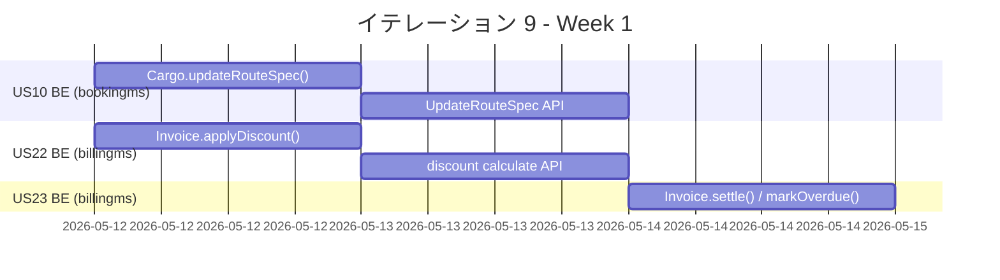
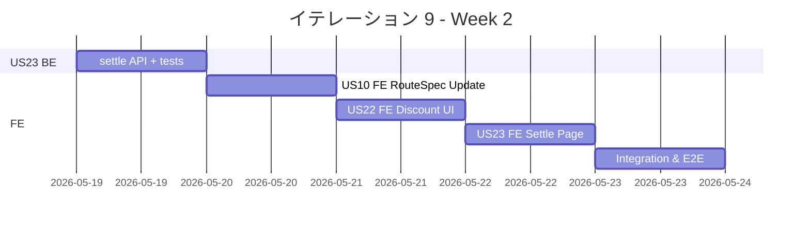
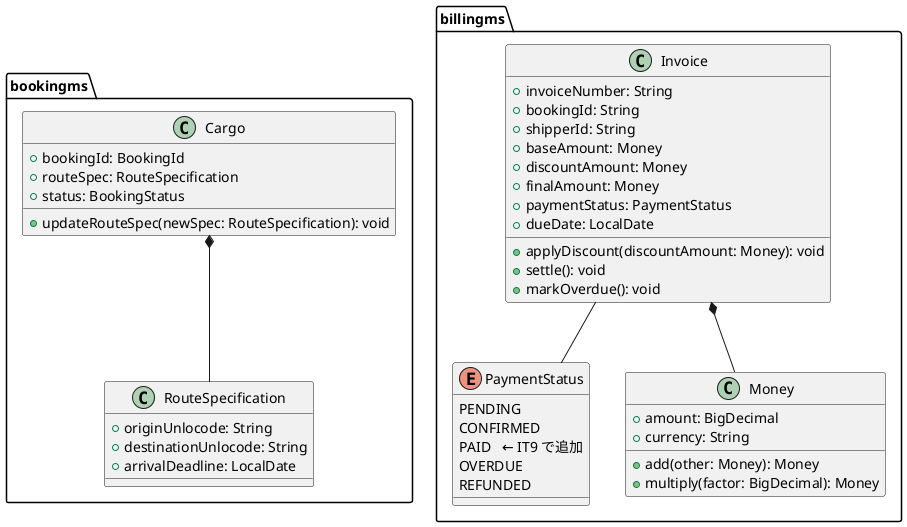
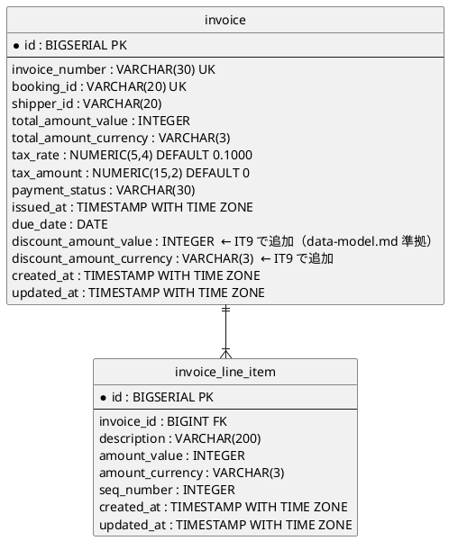
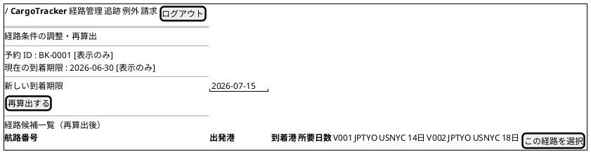
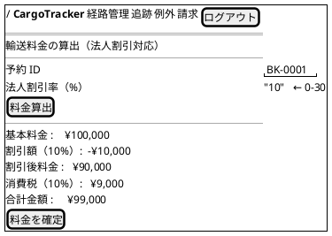
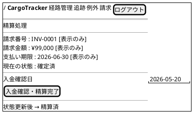
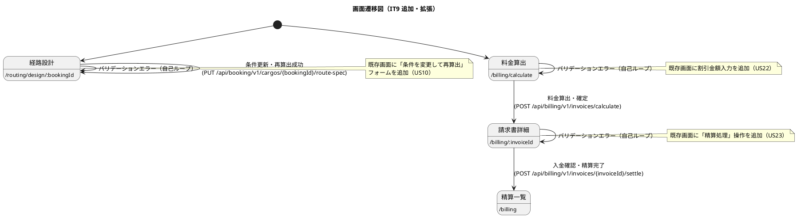

# イテレーション 9 計画

## 概要

| 項目 | 内容 |
|------|------|
| **イテレーション** | 9 |
| **期間** | Week 17-18（2 週間） |
| **ゴール** | 経路条件再算出（US10）・法人割引（US22）・精算処理（US23）の API + 画面を実装し Phase 2 を完了する |
| **目標 SP** | 21 |

---

## ゴール

### イテレーション終了時の達成状態

1. **経路条件再算出（US10）**: 到着期限・経由地等の条件を変更して経路候補を再算出できる
2. **法人割引（US22）**: 法人荷主の請求書に割引率を適用して割引後の金額を確定できる
3. **精算処理（US23）**: 確定請求書をもとに精算書を発行し、入金確認後に精算完了できる

### 成功基準

- [x] US10: 経路条件を更新して再算出できる
- [x] US22: 法人割引が自動適用された請求金額が確認できる
- [x] US23: 精算書発行・精算状態更新ができる
- [ ] bookingms テスト全通過（カバレッジ 80% 以上）
- [ ] billingms テスト全通過（カバレッジ 80% 以上）
- [ ] フロントエンド テスト全通過
- [ ] E2E テスト全シナリオ通過

---

## ユーザーストーリー

### 対象ストーリー

| ID | ユーザーストーリー | BE SP | FE SP | SP | 優先度 |
|----|--------------------|-------|-------|----|--------|
| US10 | 経路条件を調整して再算出する | 5 | 3 | 8 | 中 |
| US22 | 法人割引を適用する | 3 | 2 | 5 | 中 |
| US23 | 精算を処理する | 5 | 3 | 8 | 中 |
| **合計** | | **13** | **8** | **21** | |

### ストーリー詳細

#### US10: 経路条件を調整して再算出する

**ストーリー**:
> 経路設計者として、経路候補に最適なものがない場合に、条件（期限・経由地等）を調整して経路候補を再算出したい。なぜなら、条件を柔軟に調整することで実現可能な経路を見つけ、輸送を実現できるからだ。

**受入条件**:

1. 現在の制約条件（期限・経由地制限等）を確認できる
2. 条件を調整（期限延長・経由地追加・貨物種別変更等）して再算出を実行できる
3. 調整後の条件で新たな経路候補が算出・提示される
4. 調整後も条件を満たす経路がない場合、営業担当者に荷主との条件協議を依頼できる

#### US22: 法人割引を適用する

**ストーリー**:
> 経理担当者として、法人荷主の場合に、契約割引率を基本料金に自動適用して割引後の請求金額を確定したい。なぜなら、法人契約条件に基づく正確な割引を自動化し、手計算ミスを防ぐからだ。

**受入条件**:

1. 荷主種別が「法人」の場合、料金算出時に契約割引率が自動的に取得・表示される
2. 割引率（0〜30%）が基本料金に適用され、割引後の金額が表示される
3. 個人荷主の場合は割引が適用されない
4. 割引計算の根拠（割引率・基本料金・割引後料金）が精算書に記載される

#### US23: 精算を処理する

**ストーリー**:
> 経理担当者として、確定した輸送料金をもとに精算書を発行し、荷主への通知・入金確認・精算完了処理を行いたい。なぜなら、精算業務を一元管理し、入金状況を追跡して確実に精算を完了できるからだ。

**受入条件**:

1. 「確定」状態の輸送料金をもとに精算書（請求番号・請求金額・支払い期限）を発行できる
2. 精算書が荷主にメール通知される（ログ出力で代替）
3. 入金確認操作ができる
4. 入金確認後、精算状態が「精算済」に更新される
5. 支払い期限超過時、状態が「延滞」に更新される

### タスク

#### 1. US10 バックエンド（bookingms）（5 SP）

| # | タスク | 見積もり | 担当 | 状態 |
|---|--------|---------|------|------|
| 1.1 | ドメイン: `Cargo.updateRouteSpec()` メソッド追加（条件更新・ステータスを ROUTE_REQUIRED に戻す） | 2h | - | [x] |
| 1.2 | アプリ: `UpdateRouteSpecCommand` + `CargoCommandService.updateRouteSpec()` 実装 | 2h | - | [x] |
| 1.3 | プレゼン: `PUT /api/booking/v1/cargos/{bookingId}/route-spec` エンドポイント追加 | 2h | - | [x] |
| 1.4 | テスト: ドメイン・サービス・コントローラー単体テスト | 2h | - | [x] |
| 1.5 | DB: `booking` テーブルに `arrival_deadline` カラムが既存であることを確認（変更不要） | 1h | - | [x] |

**小計**: 9h（理想時間）

#### 2. US10 フロントエンド（3 SP）

| # | タスク | 見積もり | 担当 | 状態 |
|---|--------|---------|------|------|
| 2.1 | `RouteSpecUpdatePage.tsx`: 条件確認・条件変更フォーム・再算出ボタン実装 | 3h | - | [x] |
| 2.2 | `useBooking.ts` に `useUpdateRouteSpec` hook 追加 | 2h | - | [x] |
| 2.3 | `App.tsx` に `/booking/routing/:bookingId/respec` ルート追加 | 1h | - | [x] |

**小計**: 6h（理想時間）

#### 3. US22 バックエンド（billingms）（3 SP）

| # | タスク | 見積もり | 担当 | 状態 |
|---|--------|---------|------|------|
| 3.1 | ドメイン: `Invoice.applyDiscount(BigDecimal discountRate)` メソッド追加 | 2h | - | [x] |
| 3.2 | アプリ: `CalculateInvoiceCommand` に `discountRate` フィールド追加、サービスで割引適用 | 2h | - | [x] |
| 3.3 | プレゼン: `calculate` エンドポイントの `CalculateInvoiceRequest` に `discountRate` 追加 | 1h | - | [x] |
| 3.4 | DB: `invoice` テーブルに `discount_rate` カラム追加（V3 マイグレーション） | 1h | - | [x] |
| 3.5 | テスト: 割引計算・適用ロジックのユニットテスト | 2h | - | [x] |

**小計**: 8h（理想時間）

#### 4. US22 フロントエンド（2 SP）

| # | タスク | 見積もり | 担当 | 状態 |
|---|--------|---------|------|------|
| 4.1 | `InvoiceCalculatePage.tsx` に割引率入力フィールドを追加、割引後金額・根拠を表示 | 3h | - | [x] |
| 4.2 | `billing/types/billing.ts` に `discountRate` フィールド追加 | 1h | - | [x] |

**小計**: 4h（理想時間）

#### 5. US23 バックエンド（billingms）（5 SP）

| # | タスク | 見積もり | 担当 | 状態 |
|---|--------|---------|------|------|
| 5.1 | ドメイン: `Invoice.settle(LocalDate paidAt)` メソッド追加（CONFIRMED → PAID 遷移） | 2h | - | [x] |
| 5.2 | ドメイン: `Invoice.markOverdue()` メソッド追加（CONFIRMED → OVERDUE 遷移） | 1h | - | [x] |
| 5.3 | アプリ: `SettleInvoiceCommand` + `InvoiceCommandService.settle()` 実装 | 2h | - | [x] |
| 5.4 | プレゼン: `POST /api/billing/v1/invoices/{invoiceId}/settle` エンドポイント追加 | 2h | - | [x] |
| 5.5 | DB: `invoice` テーブルに `paid_at` カラム追加（V4 マイグレーション） | 1h | - | [x] |
| 5.6 | テスト: settle・markOverdue のユニットテスト・コントローラーテスト | 2h | - | [x] |

**小計**: 10h（理想時間）

#### 6. US23 フロントエンド（3 SP）

| # | タスク | 見積もり | 担当 | 状態 |
|---|--------|---------|------|------|
| 6.1 | `InvoiceSettlePage.tsx`: 精算書表示・入金確認ボタン実装 | 3h | - | [x] |
| 6.2 | `useBilling.ts` に `useSettleInvoice` hook 追加 | 2h | - | [x] |
| 6.3 | `billing/types/billing.ts` に `SettleInvoiceRequest`・`paidAt` 追加 | 1h | - | [x] |
| 6.4 | `App.tsx` に `/billing/settle/:invoiceId` ルート追加 | 1h | - | [x] |

**小計**: 7h（理想時間）

#### タスク合計

| カテゴリ | BE SP | FE SP | SP | 理想時間 | 状態 |
|---------|-------|-------|----|---------|------|
| US10 経路条件再算出 | 5 | 3 | 8 | 15h | [x] |
| US22 法人割引 | 3 | 2 | 5 | 12h | [x] |
| US23 精算処理 | 5 | 3 | 8 | 17h | [x] |
| **合計** | **13** | **8** | **21** | **44h** | |

**1 SP あたり**: 約 2.1h
**進捗率**: 100% (21/21 SP)

---

## スケジュール

### Week 1（Day 1-5）



| 日 | タスク |
|----|--------|
| Day 1 | US10 BE: Cargo.updateRouteSpec() ドメイン実装 |
| Day 2 | US10 BE: UpdateRouteSpec API エンドポイント実装 |
| Day 3 | US22 BE: Invoice.applyDiscount() + DB マイグレーション |
| Day 4 | US22 BE: calculate エンドポイント更新・テスト |
| Day 5 | US23 BE: settle/markOverdue ドメイン・DB マイグレーション |

### Week 2（Day 6-10）



| 日 | タスク |
|----|--------|
| Day 6 | US23 BE: settle API + コントローラーテスト |
| Day 7 | US10 FE: RouteSpecUpdatePage.tsx 実装 |
| Day 8 | US22 FE: InvoiceCalculatePage.tsx 割引率対応 |
| Day 9 | US23 FE: InvoiceSettlePage.tsx 実装 |
| Day 10 | 統合テスト・E2E テスト・バグ修正・デモ準備 |

---

## 設計

### ドメインモデル



### データモデル



### ユーザーインターフェース

#### ビュー

**US10: 経路条件再算出画面** (`/routing/design/:bookingId` — 既存経路設計画面に条件変更フォームを追加)



**US22: 法人割引適用画面** (既存 `/billing/calculate` の料金算出フォームに割引金額入力を追加)



**US23: 精算処理画面** (`/billing/:invoiceId` — 既存請求書詳細画面に精算処理操作を追加)



#### インタラクション



### ディレクトリ構成

```
apps/backend/bookingms/src/
  main/java/com/example/bookingms/
    domain/model/aggregates/
      Cargo.java                              ← updateRouteSpec() 追加
    application/internal/commandservices/
      UpdateRouteSpecCommand.java             ← 新規
      CargoCommandService.java                ← updateRouteSpec() 追加
    interfaces/rest/
      CargoController.java                    ← PUT /{bookingId}/route-spec 追加
      dto/
        UpdateRouteSpecRequest.java           ← 新規

apps/backend/billingms/src/
  main/java/com/example/billingms/
    domain/model/aggregates/
      Invoice.java                            ← applyDiscount(Money) / settle() / markOverdue() 追加
    domain/model/valueobjects/
      PaymentStatus.java                      ← PAID ステータス追加（domain-model.md も更新）
    application/internal/commandservices/
      CalculateInvoiceCommand.java            ← discountAmountValue フィールド追加
      SettleInvoiceCommand.java               ← 新規
      InvoiceCommandService.java              ← settle() 追加
    interfaces/rest/
      InvoiceController.java                  ← POST /{id}/settle 追加
      dto/
        CalculateInvoiceRequest.java          ← discountAmountValue フィールド追加
        SettleInvoiceRequest.java             ← 新規（支払日・支払方法）
        InvoiceResponse.java                  ← discountAmount フィールド追加
  resources/db/migration/
    V3__add_discount_amount.sql               ← 新規（discount_amount_value / currency）

apps/frontend/src/
  features/routing/
    pages/
      RouteDesignPage.tsx                     ← 既存。条件変更フォーム追加（US10）
    hooks/useRouting.ts                       ← useUpdateRouteSpec 追加
  features/billing/
    pages/
      InvoiceCalculatePage.tsx                ← discountAmount 対応（US22）
      InvoiceDetailPage.tsx                   ← 精算処理ボタン追加（US23）
    hooks/useBilling.ts                       ← useSettleInvoice 追加
    types/billing.ts                          ← SettleInvoiceRequest・discountAmount 追加
```

### API 設計

| メソッド | エンドポイント | 説明 |
|---------|---------------|------|
| `PUT` | `/api/booking/v1/cargos/{bookingId}/route-spec` | 経路条件を更新して再算出待ちにする |
| `POST` | `/api/billing/v1/invoices/calculate` | 法人割引金額込みで料金算出（既存を拡張） |
| `POST` | `/api/billing/v1/invoices/{invoiceId}/settle` | 精算完了（CONFIRMED → PAID）。domain-model.md に PAID を追記する。 |

### データベーススキーマ

```sql
-- V3: invoice テーブルに discount_amount を追加（data-model.md 準拠）
-- 注: data-model.md では discount_amount_value (INTEGER) + discount_amount_currency (VARCHAR(3)) 形式
ALTER TABLE invoice ADD COLUMN discount_amount_value INTEGER NOT NULL DEFAULT 0;
ALTER TABLE invoice ADD COLUMN discount_amount_currency VARCHAR(3) NOT NULL DEFAULT 'JPY';
-- 注: paid_at は data-model.md では別テーブル payment に存在するが、
-- IT9 のシンプル化実装では invoice.payment_status = 'PAID' で表現する。
```

---

## リスクと対策

| リスク | 影響度 | 対策 |
|--------|--------|------|
| PaymentStatus に PAID が未定義 | 中 | PAID を enum に追加し domain-model.md の PaymentStatus 定義も更新する |
| invoice カラム形式の乖離 | 中 | 既存実装（IT8）は `baseAmount/finalAmount` だが data-model.md は `total_amount_value/currency`。IT9 では既存実装を拡張する形で `discountAmount` を追加し、data-model.md への反映は後続イテレーションで対応する。 |
| H2 の ALTER TABLE 制限 | 低 | V3 の ALTER TABLE を個別文に分割（IT8 の実績パターンを踏襲） |
| billingms の V マイグレーション番号衝突 | 中 | 既存 V1/V2 を確認してから V3 を採番する（IT8 で V5 まで使用済みの trackingms とは別） |
| US23 外部連携（メール通知・決済機関）の実装範囲 | 中 | 本イテレーションではログ出力で代替し、受入基準に明記する |
| US10 の routingms 未実装 | 高 | US10 は bookingms の RouteSpecification 更新で実装。routingms 経路再算出は既存の `/api/booking/v1/cargos/routing-assignments` を活用する |

---

## 完了条件

### Definition of Done

- [ ] コードレビュー完了
- [ ] ユニットテストがパス
- [ ] E2E テストがパス
- [ ] ESLint エラーなし
- [ ] 機能がローカル環境で動作確認済み
- [ ] ドキュメント更新完了

### デモ項目

1. 経路条件（到着期限）を変更して経路候補を再算出する
2. 法人割引率（10%）を入力して割引後の料金を算出・確定する
3. 確定請求書に対して入金確認を行い精算済み状態になることを確認する

---

## 更新履歴

| 日付 | 更新内容 | 更新者 |
|------|---------|--------|
| 2026-05-11 | 初版作成 | - |

---

## 関連ドキュメント

- [イテレーション 8 完了報告書](./iteration_report-8.md)
- [リリース計画](./release_plan.md)
- [ユーザーストーリー](../requirements/user_story.md)
