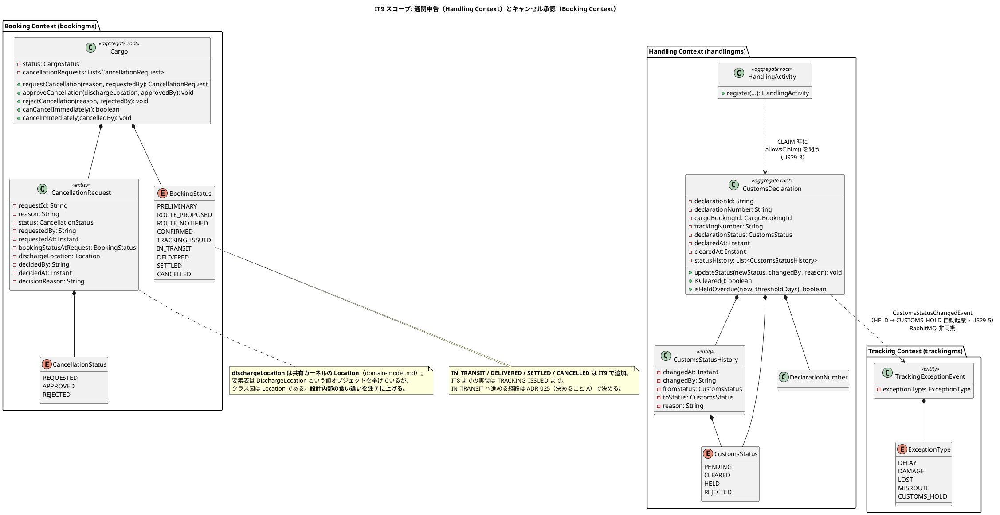
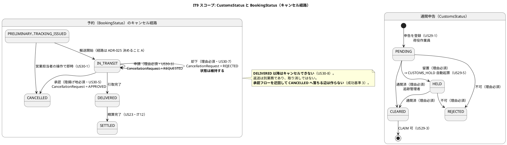
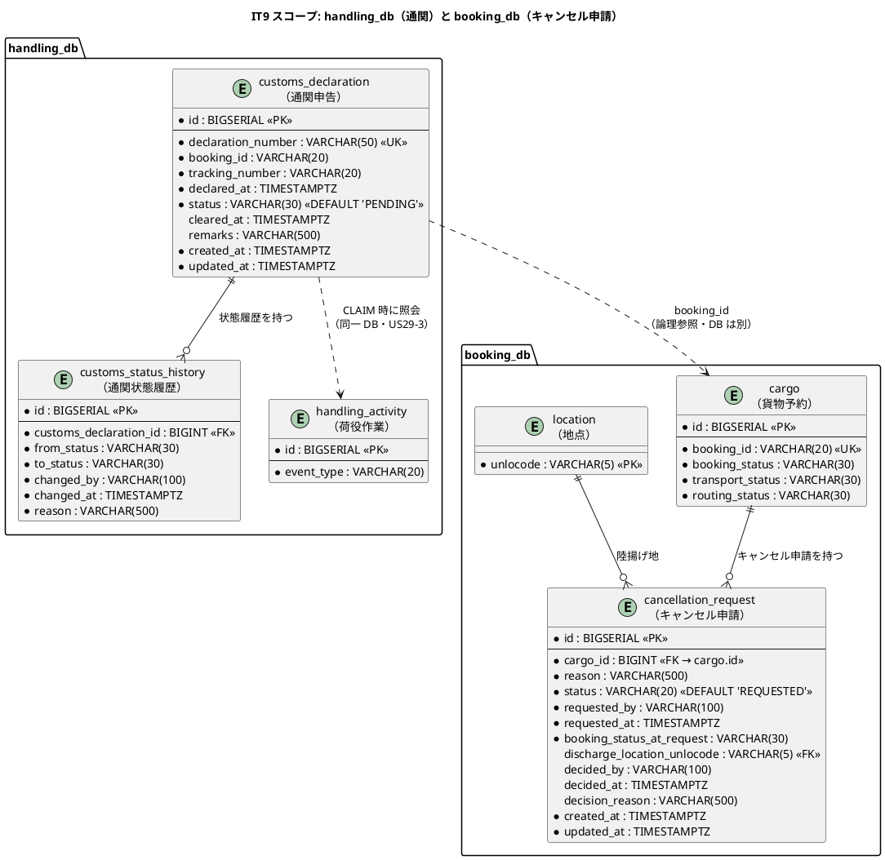
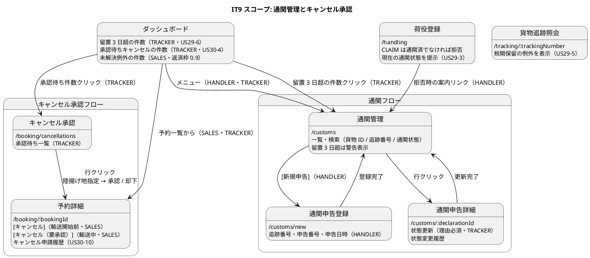

# イテレーション 9 計画

| 項目 | 内容 |
| :--- | :--- |
| イテレーション | IT9 |
| 期間 | 2026-09-07 〜 2026-09-20（2 週間） |
| 対象ストーリー | US29（通関申告を登録・管理する）・US30（輸送中の予約キャンセルを承認する） |
| 計画 SP | 10 |
| 局面 | **終盤（2 本目）／アウトサイドイン**（[開発戦略](development_strategy.md#終盤-アウトサイドインit8it12--release-10-後半20)） |
| 前提 | [IT8 完了報告書](iteration_report-8.md)・[IT8 ふりかえり](retrospective-8.md) |
| リリース | [Release 1.1](release_plan.md)（IT9〜IT10） |

## ゴール

**貨物が「通関を待っている」ことと「途中で降ろされる」ことを、システムが業務として扱えるようになる。**

IT8 までは、通関は運用ルール（引取時に書類を目視確認する）で埋めていた。輸送中のキャンセルは、そもそも受け付ける口が無かった。IT9 で **引取の前に通関という関門を置き、輸送中の予約に承認フローを与える**。

**この 2 つは「引取（CLAIM）を止められるか」「予約を止められるか」という、同じ形の問いである。** どちらも「進ませない」ことが価値であり、**進ませない実装を壊したときに赤になる**ことが本 IT の中心的な検証になる。

### 成功基準

> **通知の「送信」は行いません。** IT8 と同じ形で、**通知したという事実を記録し、画面で見える形**に代替します（[ADR-024](../adr/024-tracking-manual-update-and-exceptions.md) 決定 9）。**代替であることを画面・マニュアル・完了報告書に明記します。**

| # | 基準 | 測り方 |
| :--- | :--- | :--- |
| 1 | **通関が下りていない貨物は引き取れない** | kind 統合環境で、通関申告を「審査中」のまま CLAIM を試みて拒否され、**現在の通関状態が提示される**。ガードを消すと赤になること |
| 2 | **留置が例外として追跡に現れる** | 通関状態を「留置」にすると、trackingms に `CUSTOMS_HOLD` の例外が**自動起票**され、公開追跡と追跡管理者の一覧の両方に出る |
| 3 | **輸送中の予約は、承認なしにキャンセルされない** | 営業担当者の操作では申請までしか進まない。承認フローを迂回して `CANCELLED` に落とす経路が**無い**ことを、集約の検査で固定する |
| 4 | **陸揚げ地なしの承認ができない** | 承認 API を陸揚げ地なしで呼ぶと断られる。**却下しても `IN_TRANSIT` のまま**であることを対で固定する |
| 5 | **ADR の決定と検査が 1 対 1 で、壊すと赤になる**（[IT8 Try 1](retrospective-8.md)） | ADR-025 の決定ごとに検査を書き、**1 件ずつ実装を壊して赤を確認**した記録を残す。表に書くだけでは完了としない |
| 6 | **この IT で書いた「〜しない」「〜まで確かめる」が、検査に固定されている**（[IT8 Try 2](retrospective-8.md)） | 否定形・保証形のコメントを数え、同じ数の検査を持つ。**書いた変更の中で検査も書く** |
| 7 | **新しく足した値が、層をまたいで生き延びる**（[IT8 Try 4](retrospective-8.md)） | 通関状態・理由・陸揚げ地・申請者を、**集約 → 永続化 → 応答 → モック → 画面**のどこで潰しても赤になること。値ごとに 1 本 |
| 8 | **設計への反映が、検査で担保されている**（[IT8 Try 3](retrospective-8.md)） | `data-model.md` のテーブル名・列名と migration を突き合わせる検査を置く。**注を列挙して約束する形をやめる** |
| 9 | ドメイン層のカバレッジ 90% 以上 | 6 サービス + shared |

## 局面とアプローチ

**終盤の 2 本目（アウトサイドイン）。** 業務シナリオを受け入れテストに翻訳してから、画面 → API → ドメインの順に埋める。

**Phase の並びは[開発戦略](development_strategy.md)の終盤ワークフローをそのまま採る**——Phase 1 受け入れテスト（Red）→ Phase 2 画面と導線 → Phase 3 既存サービスの拡張 → **Phase 4 新規ドメイン要素（必要な深さだけ）**。戦略はこの Phase 4 に `CustomsDeclaration`・`CancellationRequest` を名指しで挙げており、**新しい集約を作ることは終盤のアプローチに含まれている**。局面を混ぜるのではない。

戦略は終盤の適用対象として「例外・通関・キャンセル承認（US19/20/29/30）は**状態軸の到達性**（件数 → 対象一覧）を同一 IT で実装する横断規約の適用対象」と定めている。**タスク 2.4・0.9 がこれに当たる。**

**[ADR-022](../adr/022-domain-event-contract.md) のイベント契約と [ADR-019](../adr/019-route-assignment-api.md) の ACL の型をそのまま写す。新しい結合方式を発明しない。** 発明が必要になったら ADR を起票してから実装する。

## 前イテレーションからの反映

### ふりかえりの Try（[retrospective-8.md](retrospective-8.md)）

| Try | 本 IT での落とし込み |
| :--- | :--- |
| 1. ADR のコンプライアンス表は、書いたあとに 1 件ずつ壊して赤を確認する | **成功基準 5 に据えた**。IT8 は 11 決定のうち 3 件が空振りだった。**表に検査名を書いた時点では未完了**とし、壊した記録（どの行を消してどの検査が赤になったか）を ADR-025 に残す |
| 2. 検査を書いたら、その場で実装を壊す | **成功基準 6 に据え、DoD に入れた**。IT8 の `takesOnlyTheFirstForwardedAddress` は、**検査が誤りを固定して直そうとした人が赤を見る**状態だった |
| 3. 設計への反映を、検査に落とす | **返済枠 0.1 と成功基準 8**。`data-model.md` の DDL と migration を突き合わせる検査を書く。**列挙して約束する形をやめる**——IT8 は 13 件中 12 件が未反映だった |
| 4. 新しく足した値は、層を数えてから実装する | **成功基準 7**。IT9 で足す値は多い（通関状態・申告番号・理由・陸揚げ地・申請者/承認者・日時）。**値ごとに層を数えてからタスクに入る** |
| 5. ドキュメントの「届く経路」を検査に含める | タスク 7.3。IT8 で索引・ナビは検査に落ちた。**キャプチャの有無を同じ形で足す** |
| 6. 統合テストは土台を継承する | タスク 4.0。**handlingms に 2 つ目の統合テストを足すのが本 IT**——土台を作る合図がここで鳴る。3 IT 連続で踏んでいる形なので、**書く前に土台を置く** |
| 7. レビューは 5 視点を独立に回す | クローズ時（`developing-review`）。IT7・IT8 とも複数視点が独立に指摘したものが最も重かった |
| 8. 実環境で通す枠を、Phase として計画に置く | **Phase 6 として確保**。IT8 はこれで 1 件、テストの届かない欠陥を捕まえた |
| 9. 品質ゲートは CI と同じコマンドで回す | **DoD に明記**。バックエンドは `./gradlew test` ではなく **`./gradlew build`**（SpotBugs・Checkstyle を含む）。IT8 は CI だけが赤になり 6 件出た |

### 引き継ぎ（返済枠・SP 対象外）

> **「余力次第」にしない。** IT7・IT8 とも Day 1-3 に固めて全返済した。同じ形を続ける。
>
> **IT8 の持ち越しは 14 件**（[retrospective-8.md](retrospective-8.md)）。うち #1・#2 は 2 IT 連続の持ち越しを含むため、**先頭に置く**。

| # | 内容 | 見積 | 由来 |
| :--- | :--- | :--- | :--- |
| 0.1 | **注の反映そのものを検査に落とす。** `data-model.md` のテーブル名・列名と migration を機械的に突き合わせる（`tracking_status` の 2 IT 連続の持ち越しは、これで最後にする） | 5h | 引き継ぎ #2・Try 3 |
| 0.2 | **正典ドリフトの残り 11 件**（`domain-model.md` のメソッド名・`TrackingLocation` の残存・イベント一覧、`architecture_backend.md` の API 一覧、`ui_design.md` の状態バッジと権限マトリクス、`test_strategy.md` の公開経路の観点） | 6h | 引き継ぎ #1・IT8 DoD 未達 |
| 0.3 | **モックが本物より甘い**（日時・地点の検証が無い、404 の本文形が違う、429 が無い）。**IT9 で画面が 4 つ増えるため、先に直さないと甘いモックが 4 画面ぶん増える** | 4h | 引き継ぎ #5 |
| 0.4 | 起票可否の判定が 2 か所（集約側は到達不能）。**US29 の `CUSTOMS_HOLD` 自動起票が 3 か所目を作る前に寄せる** | 3h | 引き継ぎ #9 |
| 0.5 | 2 回目の発行イベントで推定到着日が更新されない（経路を組み直した貨物は古い見込みを出し続ける） | 3h | 引き継ぎ #4 |
| 0.6 | 遅延の解決で新しい到着予定日を必須にする | 2h | 引き継ぎ #7 |
| 0.7 | `exceptionId` を受け取って使っていない（一覧を開いたまま別の担当者が解決した場合を検出できない） | 2h | 引き継ぎ #3 |
| 0.8 | 未解決例外の一覧に発生日時と並び順が無い（20 件になると使えない）。**`CUSTOMS_HOLD` が流入する前に直す** | 2h | 引き継ぎ #6 |
| 0.9 | 営業が例外に気づく手段が無い（ダッシュボードに件数と導線）。**件数から対象一覧へ辿れること**（[横断規約](release_plan.md)） | 4h | 引き継ぎ #8 |
| 0.10 | `TrackingStatus` の読み方だけ enum に集約されていない | 2h | 引き継ぎ #10 |
| 0.11 | **IT7・IT8 時点のコメントが取り残されている**（「IT8 で足す」「IT7 では使わない」）。**実装した IT で消すことを DoD へ** | 2h | 引き継ぎ #11 |
| 0.12 | マニュアル 09 章の画面キャプチャと記述漏れ 4 件 | 4h | 引き継ぎ #12 |
| 0.13 | 孤児化した javadoc・整形の不統一 | 2h | 引き継ぎ #13 |
| 0.14 | 追跡番号の形式（`TRK-` / `BKG-`）を 404 の文言に足す | 1h | 引き継ぎ #14 |
| **小計** | | **42h** | |

> **0.1 と 0.2 を分けています。** 0.2（正典を直す）だけを行うと IT8 と同じ「直したつもり」になります。**0.1（検査を置く）を先に済ませ、その検査が赤で 0.2 の対象を指し示す**形にします。**順序を逆にしません。**

### IT8 から「着手前に決めること」として引き継いだもの

[IT8 ふりかえり](retrospective-8.md)が挙げた 5 件。**運用側の判断であり、そのままではタスクにならない。**

| # | 内容 | IT9 での扱い |
| :--- | :--- | :--- |
| 1 | **公開画面に緊急フラグを出すか**（利用者代表とテスターで逆向きの指摘） | **[ADR-025](../adr/025-customs-declaration-and-cancellation-approval.md)（決めること E）で決め直す。** 落とすなら [ADR-024] 決定 3 を書き直す。**IT9 は `CUSTOMS_HOLD` を公開画面に出す IT なので、先送りできない** |
| 2 | 例外の連絡が追跡管理者から営業へ口頭である | **返済枠 0.9 で解消する。** 営業のダッシュボードに未解決例外の件数と導線を置く |
| 3 | 予定外の作業が業務として処理されない（待ち行列は US28・IT10） | **IT9 でも扱わない。** ただし `CUSTOMS_HOLD` が流入して未解決例外が増えるため、0.8（並び順と発生日時）を先に済ませる。待ち行列そのものは IT10 |
| 4 | **利用者と荷主の紐付けストーリーが計画に無い**（[ADR-024] 決定 10） | **IT9 では実装しない。** [リリース計画](release_plan.md)の見直しでストーリーとして起票する（本 IT のタスク 8.1）。**「起票する」ことをタスクにしないと、また次の IT へ流れる** |
| 5 | 引取済の貨物が精算に乗らないまま溜まる（US23・IT12 まで） | **IT9 では扱わない。** ただし US30 のキャンセル料は billingms 側であり、**IT9 では算定しない**ことを ADR-025（決めること B）に記録する |

## 対象ストーリーと受入基準

### US29: 通関申告を登録・管理する（5 SP）

**として**: 荷役作業員（申告の登録）、追跡管理者（状態の管理）
**したい**: 輸入港での税関申告を登録し、通関状態を管理したい
**なぜなら**: 通関が下りないと荷受人に引き渡せないため、どの貨物がどの段階にあるかが分からないと引き取り作業の計画が立たず、留置が長引けば保管料が発生するからだ
**対応 UC**: UC21

| # | 受入基準 | 本 IT での扱い |
| :--- | :--- | :--- |
| 29-1 | 追跡番号・申告番号・申告日時を入力して通関申告を登録できる（初期状態は「審査中」） | **実装。** `CustomsDeclaration` 集約（handlingms）。初期状態は `PENDING` |
| 29-2 | 通関状態を「通関済」「留置」「不可」に更新できる。更新時は理由の入力が必須で、監査ログに記録される | **実装。** `customs_status_history` に日時・変更者・理由。**理由なしの更新は集約で断る** |
| 29-3 | 通関状態が「通関済」でない貨物に対する引き取り（CLAIM）荷役は拒否され、現在の通関状態が提示される | **実装（成功基準 1）。** [ADR-023](../adr/023-handling-activity-validation.md) が残した拡張点にガードを差し込む。**ドメインの守りは画面から踏むテストと対にする** |
| 29-4 | 通関状態が「通関済」になると、荷主・荷受人に通関完了が通知される | **代替。** 通知した事実を記録し画面に出す（[ADR-024] 決定 9 と同じ形） |
| 29-5 | 通関状態が「留置」になると、例外種別「税関保留」の例外イベントが自動起票される | **実装（成功基準 2）。** `CustomsStatusChangedEvent`（handlingms → trackingms）。**[ADR-024] 決定 11 が「手で起票できるのは DELAY / DAMAGE / LOST だけ」と定めた前提を守る** |
| 29-6 | 「留置」のまま 3 日を超えた申告は、一覧で警告表示され、追跡管理者のダッシュボードに件数が現れる | **実装。** 判定は業務タイムゾーンの `Clock` で行う（過去 take の教訓）。**件数から対象一覧へ辿れること**（[横断規約](release_plan.md)） |
| 29-7 | 通関申告の一覧を貨物 ID・追跡番号・通関状態で検索できる | **実装** |
| 29-8 | 通関状態の変更履歴（日時・変更者・理由）が申告詳細から参照できる | **実装** |

### US30: 輸送中の予約キャンセルを承認する（5 SP）

**として**: 追跡管理者
**したい**: 輸送中の貨物に対するキャンセル申請について、陸揚げ地を指定したうえで承認または却下したい
**なぜなら**: 輸送開始後のキャンセルは貨物が船の上にあるため「どこで降ろすか」の判断が必要であり、営業担当者の操作だけで完結させると貨物が宙に浮くからだ
**対応 UC**: UC22

> **申請は営業担当者が行います**（US30-2）。正典のストーリー文のアクターは承認者（追跡管理者）であり、**申請側の営業担当者は受入基準の中に現れます**。画面の権限はこの 2 ロールで書き分けます。

| # | 受入基準 | 本 IT での扱い |
| :--- | :--- | :--- |
| 30-1 | 輸送開始前（仮予約・経路提案済・確認済・追跡番号発行済）の予約は、営業担当者の操作で即座にキャンセルできる | **実装。** `BookingStatus` に `CANCELLED` を追加。**`ROUTE_NOTIFIED` も含む**（設計の遷移順に沿う）。**[IT6 計画](iteration_plan-6.md)が US30 へ送った US13-5 をここで果たす** |
| 30-2 | 状態が「輸送中」の予約では、営業担当者には `[キャンセル（要承認）]` として申請ボタンのみが表示される | **実装。** ボタンの出し分けは**集約の述語（`canCancelImmediately()`）をそのまま呼ぶ**（過去 take の教訓） |
| 30-3 | キャンセル申請には理由の入力が必須である | **実装。** 集約で断る |
| 30-4 | 申請は追跡管理者に通知され、承認待ちの一覧に表示される | **一覧は実装、通知は代替。** `/booking/cancellations` |
| 30-5 | 追跡管理者は陸揚げ地（現在地の港または次の寄港地）を指定して承認できる | **実装（成功基準 4）。** 候補の引き方は ADR-025（決めること C） |
| 30-6 | 承認するとキャンセルが確定し、指定した陸揚げ地への荷降しが手配され、荷主に通知される | **状態遷移は実装、荷降し手配と通知は代替。** 「手配」は荷役の予定を作る業務であり、**IT9 では陸揚げ地を記録して画面に出すところまで**。ADR-025 に範囲を明記する |
| 30-7 | 却下すると予約は輸送中のまま維持され、却下理由が申請者と荷主に通知される | **実装（成功基準 4）＋通知は代替** |
| 30-8 | 状態が「配達完了」以降の予約はキャンセルできない | **実装。** `DELIVERED` / `SETTLED` を `BookingStatus` に追加して断る |
| 30-9 | キャンセル料が発生する場合、状態に応じた料率で算定され、精算に引き渡される | **IT9 では算定しない。** [リリース計画](release_plan.md)が US21（IT11）に含めると定義している。**申請時の予約状態（算定根拠）だけを `booking_status_at_request` に残す** |
| 30-10 | 申請・承認・却下の履歴（日時・実行者・理由）が予約詳細から参照できる | **実装** |

> **US13 の積み残しをここで果たします。** [IT6 計画](iteration_plan-6.md)は US13-5（キャンセル状態に変更できる）と US13-6（荷主へのキャンセル確認通知）を落とし、「`CANCELLED` 状態・キャンセル理由の記録・料率を US30（IT9）で一括して入れるほうが、状態と料率の設計が 1 回で済む」と理由を書きました。**US13-5 は 30-1 で果たし、US13-6 は通知の代替で果たします**（送信は行いません）。**料率だけは US21（IT11）に残ります**——IT6 の「一括」という言葉が指す範囲より狭いので、完了報告書に書き分けます。
>
> **[IT7 計画](iteration_plan-7.md)と [ADR-023](../adr/023-handling-activity-validation.md) 決定 5 の代替も、ここで本物に置き換えます。** IT7 は通関ガードが無いまま引取を通すため、荷役作業員の明示的な確認を記録する形で代替していました。**確認の記録を残すのか、ガードに置き換えて外すのかは ADR-025（決めること I）で決めます。**
>
> **US30 の前提が 1 つ欠けています。** `BookingStatus` の実装は `TRACKING_ISSUED` までで、**`IN_TRANSIT` が無く、荷役の進行を bookingms へ反映する経路も無い**（`transport_status` 列はあるが更新する購読者がいない）。**「輸送中かどうか」を bookingms がどう知るかは ADR-025（決めること A）で決めます。** ここを決めずに実装に入ると、終盤の方針（新しい結合方式を発明しない）に反する形が生まれます。

## 設計

### ドメインモデル図（IT9 スコープ）

### 状態遷移図（IT9 スコープ）

### ER 図（IT9 スコープ）

> **`customs_declaration`・`customs_status_history`・`cancellation_request` は [data-model.md](../design/data-model.md) にすでに定義があります。** IT9 で新規に決めるのではなく、**定義済みの DDL をそのまま migration に落とします**。突き合わせは返済枠 0.1 の検査が行います。
>
> **整合性検証で 4 件直しました**（設計が正）。`cancellation_request` の FK は `booking_id` ではなく **`cargo_id → cargo.id`**（サロゲートキー参照の規約）、`declaration_number` は `VARCHAR(50)`、`tracking_number` は `VARCHAR(20)`、`changed_by` / `requested_by` / `decided_by` は `VARCHAR(100)`。`remarks` と監査カラムの欠落も補いました。
>
> **「留置 3 日超」の判定は `customs_status_history` の最新 `changed_at` で行います**（[data-model.md](../design/data-model.md) の注）。`customs_declaration` 側に留置開始日時の列はありません。**CLAIM ガードは `booking_id` で最新の申告を参照して `status = 'CLEARED'` を検証します**（同注）。

### 画面遷移図（IT9 スコープ）

> **ロール別・状態別の到達性を DoD で確かめます**（過去 take の教訓）。**通関管理は荷役作業員と追跡管理者の両方に開き、権限で操作を分けます**（登録 = HANDLER、状態更新 = TRACKER）。**共有画面のリンクもロールで出し分けます**——荷役作業員に「状態更新」を見せて 403 にしない。

## タスク

### 0. 返済枠（SP 対象外）

Day 1-3 に固めて置く。IT7・IT8 と同じ形。詳細は[上の表](#引き継ぎ返済枠sp-対象外)（0.1〜0.14・42h）。

### 1. Phase 1: 業務シナリオを受け入れテストに翻訳する（1.5 SP 相当・14h）

| # | 内容 | 見積 | 完了条件 |
| :--- | :--- | :--- | :--- |
| 1.1 | **[ADR-025](../adr/025-customs-declaration-and-cancellation-approval.md) を書く**（決めること A〜G） | 6h | 決定ごとに**検査の場所**を書き、**1 件ずつ壊して赤を確認した記録**を残す（成功基準 5） |
| 1.2 | デモ項目を E2E に翻訳する（Red） | 8h | **「条件が揃わなければスキップ」を作らない**。前提は種データで用意する |

### 2. Phase 2: 画面と導線（2.5 SP 相当・26h）

| # | 内容 | 見積 | 完了条件 |
| :--- | :--- | :--- | :--- |
| 2.1 | 通関管理 `/customs`（一覧・検索・留置 3 日超の警告） | 7h | 検索 3 条件が効く。警告の判定は**業務タイムゾーンの Clock** |
| 2.2 | 通関申告登録 `/customs/new`（HANDLER） | 4h | |
| 2.3 | 通関申告詳細 `/customs/:declarationId`（状態更新・履歴） | 6h | **理由なしで送れない**ことを画面側でも固定する |
| 2.4 | キャンセル承認 `/booking/cancellations`（TRACKER） | 5h | **件数から一覧へ辿れる**（[横断規約](release_plan.md)） |
| 2.5 | 予約詳細のキャンセル申請とボタン出し分け・申請履歴 | 4h | **出し分けは集約の述語をそのまま呼ぶ**（別実装にしない） |
| 2.6 | ナビの 4 点一致（`ui_design.md` → navbar → dashboard → 検証テスト） | — | 2.1〜2.5 の完了条件に含む。**ロール別・状態別の到達性**を確かめる |

### 3. Phase 3: API と結合（2 SP 相当・22h）

| # | 内容 | 見積 | 完了条件 |
| :--- | :--- | :--- | :--- |
| 3.1 | 通関申告の API `/api/v1/customs`（登録・一覧・詳細・状態更新） | 8h | **認可は入力検証より先**（[ADR-016](../adr/016-authorize-before-validate.md)） |
| 3.2 | CLAIM ガードの配線（US29-3） | 5h | **画面から踏むテストと対にする**。拒否時に**現在の通関状態**を返す。文言は [ui_design.md](../design/ui_design.md) のフィードバック表（「通関が完了していないため引き取りできません（現在: 留置）」・`error`）に一致させる。**警告ダイアログは `role="alertdialog"`** |
| 3.3 | キャンセルの API `/api/v1/bookings/{bookingId}/cancellation`（申請）・`.../cancellation/approve`・`.../cancellation/reject`（[ui_design.md](../design/ui_design.md) の対応表） | 6h | 承認は**陸揚げ地必須**。却下は `IN_TRANSIT` 維持 |
| 3.4 | `CustomsStatusChangedEvent`（handlingms → trackingms）の契約と購読 | 3h | **[ADR-022] の型をそのまま写す**。交換機の引数を含めて契約から導く |

### 4. Phase 4: ドメイン（3 SP 相当・32h）

| # | 内容 | 見積 | 完了条件 |
| :--- | :--- | :--- | :--- |
| 4.0 | **handlingms の統合テスト土台を置く**（Try 6） | 3h | **2 つ目の統合テストを書く前**に置く。コンテナは 1 サービス 1 土台 |
| 4.1 | `CustomsDeclaration` 集約・`CustomsStatus`・`updateStatus` | 8h | 理由なしの状態変更を断る。**`isCleared()` は CLEARED のみ true**。**申告が無い貨物も CLAIM を拒否する**（名簿方式は未登録を素通りさせない——過去 take の教訓） |
| 4.2 | `CustomsStatusHistory`（監査履歴）と永続化。**`from_status` も NOT NULL**（初回は `PENDING`） | 5h | **保存して読み直してから履歴を検証する**形にする |
| 4.3 | 留置 3 日超の判定（`isHeldOverdue(now, thresholdDays)`） | 3h | **最新の HELD 遷移日時（`customs_status_history.changed_at`）から数える**（[data-model.md](../design/data-model.md) の注）。**日付単位で比較**する。テストも同じ Clock で「今日」を決める |
| 4.4 | `BookingStatus` の拡張（`IN_TRANSIT` / `DELIVERED` / `SETTLED` / `CANCELLED`）と遷移規則 | 6h | **既存行を壊さない**（復元では検査せず新規受け入れ時だけ検査する——過去 take の教訓） |
| 4.5 | `CancellationRequest` エンティティと `Cargo` のキャンセル操作 | 5h | **承認フローを迂回する経路が無い**ことを検査で固定（成功基準 3） |
| 4.6 | `CUSTOMS_HOLD` の自動起票（trackingms 側） | 2h | **手で起票できるのは 3 種だけ**という [ADR-024] 決定 11 を壊さない。`ExceptionType.parseRaisable("CUSTOMS_HOLD")` が断り続けること（`ExceptionTypeTest`）を**緑のまま**にし、自動起票は購読側の経路で行う。**返済枠 0.4（起票可否の判定を寄せる）を先に済ませてから触る** |

### 5. Phase 5: 通知の代替（0.5 SP 相当・6h）

| # | 内容 | 見積 | 完了条件 |
| :--- | :--- | :--- | :--- |
| 5.1 | 通関完了（US29-4）・承認/却下（US30-6・30-7）の通知記録 | 4h | **送っていないことを画面が言う**（IT8 と同じ形） |
| 5.2 | 代替であることをマニュアル・報告書・[リリース計画](release_plan.md)に反映 | 2h | |

### 6. Phase 6: 実環境で通す（10h）

| # | 内容 | 見積 | 完了条件 |
| :--- | :--- | :--- | :--- |
| 6.1 | **kind 統合環境で成功基準 1・2 を通す**。**先にイメージを作り直す** | 6h | 通関申告 → 留置 → 公開追跡に税関保留が出る、を 1 本で通す |
| 6.2 | **kind で成功基準 3・4 を通す** | 4h | 輸送中 → 申請 → 承認（陸揚げ地）→ キャンセル確定 |

### 7. ユーザーマニュアル（12h）

| # | 内容 | 見積 | 完了条件 |
| :--- | :--- | :--- | :--- |
| 7.1 | 10 章「通関管理」を新設（HANDLER・TRACKER の両導線） | 5h | |
| 7.2 | 04 章「貨物予約」にキャンセル申請、新設 11 章または 04 章内に承認手順 | 4h | |
| 7.3 | **キャンペーンではなく検査で届ける**——索引・`mkdocs.yml` ナビ・**キャプチャの有無**を検査に含める（Try 5） | 3h | `manual-coverage` の検査範囲を広げる |

### 8. 計画への差し戻し（4h）

| # | 内容 | 見積 | 完了条件 |
| :--- | :--- | :--- | :--- |
| 8.1 | **利用者と荷主の紐付けストーリーを起票する**（[ADR-024] 決定 10・IT8 引き継ぎ 4） | 4h | [リリース計画](release_plan.md)に US33 として追加し、GitHub Issue を作る。**「次の見直しで」と書くのをやめる** |

### 見積もり合計

| 区分 | 見積 |
| :--- | :--- |
| 0. 返済枠 | 42h |
| 1. Phase 1 受け入れテストと ADR | 14h |
| 2. Phase 2 画面と導線 | 26h |
| 3. Phase 3 API と結合 | 22h |
| 4. Phase 4 ドメイン | 32h |
| 5. Phase 5 通知の代替 | 6h |
| 6. Phase 6 実環境 | 10h |
| 7. マニュアル | 12h |
| 8. 計画への差し戻し | 4h |
| 9. レビュー手直し | 12h |
| **合計** | **180h** |

> **IT7 は 147h で 10 SP、IT8 は 144h で 9 SP、IT9 は 180h で 10 SP です。返済枠が 42h と過去最大**（IT8 の 28h から +14h）で、これが差の大部分を占めます。**IT8 は 13 件の注のうち 12 件を返せず、それが今回の 0.1・0.2 に積み上がりました**——落とした負債は据え置きではなく育つ（過去 take の教訓）。
>
> 読みが外れたときのために、**落とす順序を先に決めます**。
>
> | 順 | 落とすもの | 見積 | 落としてよい理由 |
> | :--- | :--- | :--- | :--- |
> | 1 | 0.13 孤児化した javadoc・整形 | 2h | 業務に影響しない。ただし**落とすことを完了報告書に書く** |
> | 2 | 0.10 `TrackingStatus` の読み方の集約 | 2h | 現状の読み方は正しく動いている。重複であって誤りではない |
> | 3 | 0.5 2 回目の発行での推定到着日 | 3h | 経路の組み直しは US28（IT10）で扱う。**IT10 の対象が増える形なので、落とすなら IT10 の枠に明記する** |
> | 4 | 7.2 のうち承認手順の章立て | 2h | 04 章内の節で代替する（章を新設しない） |
>
> **Phase 4 の 4.0（統合テスト土台）・0.1（設計反映の検査）・0.3（モックの甘さ）・0.8（例外一覧の並び順）・8.1（ストーリー起票）は削りません。**
>
> 4.0 を削ると 3 IT 連続で踏んだコンテナ競合を 4 回目に踏みます。0.1 を削ると IT8 と同じ「約束して反映しない」形になります。0.3 を削ると甘いモックが 4 画面ぶん増えます。0.8 を削ると `CUSTOMS_HOLD` が流入した一覧が使えなくなります。8.1 を削ると、**3 IT 連続で「次の見直しで起票する」と書き続けることになります**。

## スケジュール

### Week 1（Day 1-5）

| 日 | 内容 | 区分 |
| :--- | :--- | :--- |
| Day 1 | **0.1 設計反映の検査**（先）→ 0.2 正典ドリフト 11 件（後） | 返済枠 |
| Day 2 | 0.3 モックの甘さ、0.4 起票可否の一本化、0.5〜0.8 | 返済枠 |
| Day 3 | 0.9 営業の気づく手段、0.10〜0.14 | 返済枠 |
| Day 4 | 1.1 ADR-025（決めること A〜G）、1.2 受け入れテスト（Red） | Phase 1 |
| Day 5 | 2.1 通関管理、2.2 申告登録 | Phase 2 |

### Week 2（Day 6-10）

| 日 | 内容 | 区分 |
| :--- | :--- | :--- |
| Day 6 | 2.3 申告詳細、2.4 承認一覧、2.5 予約詳細、2.6 ナビ 4 点 | Phase 2 |
| Day 7 | 4.0 統合テスト土台、3.1 通関 API、3.2 CLAIM ガード | Phase 3/4 |
| Day 8 | 4.1〜4.3 通関ドメイン、3.4 イベント契約、4.6 自動起票 | Phase 4 |
| Day 9 | 4.4 BookingStatus 拡張、4.5 キャンセル承認、3.3 API | Phase 3/4 |
| Day 10 | 5.1-5.2 通知の代替、6.1-6.2 kind、7.1-7.3 マニュアル、8.1 起票 | 仕上げ |

> **画面を先に作るのはアウトサイドインだからです。** ただし **4.0（統合テスト土台）は 4.1 を書く前**に置きます（Try 6）。

## リスク

| # | リスク | 影響 | 対応 |
| :--- | :--- | :--- | :--- |
| 1 | **`IN_TRANSIT` を bookingms が知る経路が無い**（`transport_status` 列はあるが更新する購読者がいない） | US30 の前提が成り立たず、承認フローがテストでしか通らない | **ADR-025（決めること A）で向きとポート名まで決めてから実装する。** 終盤で新しい結合方式を発明しない |
| 2 | **CLAIM ガードが「未登録」を素通りさせる** | 申告を出し忘れた貨物ほど引き取れてしまう（名簿方式の落とし穴。過去 take で 3 IT 素通りした形） | `allowsClaim()` は **CLEARED のみ true**。**申告が無い貨物も拒否**する。**素通りを試すテストを書く** |
| 3 | **`BookingStatus` に 4 値を足すと既存行が読めなくなる** | IT8 までに作られた予約が復元できない | **復元では検査せず、新規受け入れ時だけ検査する**（過去 take の教訓）。`--rerun-tasks` で既存データの復元を通す |
| 4 | **留置 3 日超の判定が UTC で行われる** | 時差の分だけ「3 日目」の判定がずれる。日中しか動かさないと気づかない | **業務タイムゾーンの Clock** を使う。**テストも同じ Clock で「今日」を決める**。`TZ=UTC` で一度回す |
| 5 | **通関の監査履歴を「変更のたびに INSERT」でなく上書きにする** | 監査証跡が残らない。US29-8 が成り立たない | **保存して読み直してから履歴を検証する**形の検査を置く。**常に INSERT する save は更新で行を増やす**逆の失敗にも注意（`customs_declaration` 本体は UPDATE） |
| 6 | **承認フローを迂回して `CANCELLED` に落ちる経路ができる** | 輸送中の貨物が船の上で宙に浮く（US30 の存在理由そのもの） | 成功基準 3。**集約の検査で辺を塞ぎ、壊して赤を確認する** |
| 7 | **交換機のトポロジ変更が既存環境で宣言し直せない**（過去 take の教訓） | `CustomsStatusChangedEvent` の追加で kind の RabbitMQ が止まる | **既存の交換機の引数を変えない**。新しい routing key で載せる。変える必要が出たら移行手順を書く |
| 8 | 返済枠が 42h と過去最大 | Week 1 が返済で埋まり、実装が Week 2 に寄る | Day 1-3 に固定し、**Day 4 に食い込んだら落とす順序の表に従って削る**。**削ったことを完了報告書に書く** |
| 9 | **画面が 4 つ増える**（`/customs` 3 つ + `/booking/cancellations`） | ナビ・権限・到達性の確認漏れ | 2.6 を独立タスクにし、**ロール別・状態別の到達性**を DoD に置く。**共有画面のリンクもロールで出し分ける** |
| 10 | **US30-6 の「荷降しの手配」の範囲があいまい** | 実装が荷役の予定作成まで広がる | **ADR-025（決めること D）で「陸揚げ地を記録して画面に出すまで」と範囲を切る**。切ったことを受入基準の表と完了報告書に書く |

## 設計への反映が必要な箇所（注）

> **IT8 の反省を踏まえ、この節は「列挙して約束する」形をやめます。** 返済枠 0.1 で**突き合わせの検査**を置き、**検査が赤で指し示すもの**を直します。下の表は検査を書くまでの作業リストであり、**DoD の判定は表の消化ではなく検査が緑になったこと**で行います。

| # | 箇所 | 内容 | 検査 |
| :--- | :--- | :--- | :--- |
| 1 | `data-model.md` ↔ migration | IT8 持ち越しの 11 件を含む全テーブル・全列の突き合わせ | 0.1 で新設 |
| 2 | `domain-model.md` | `BookingStatus` の 4 値追加が実装に入る（設計が先行していた側）。**設計どおりに実装する**ので設計変更は不要。実装が追いついたことを確認する | 0.1 |
| 3 | `architecture_backend.md` | 通関 API・キャンセル API を一覧に追加 | 0.2 |
| 4 | `ui_design.md` | `CustomsStatus` バッジの定義・`/customs*` と `/booking/cancellations` の権限マトリクス | 0.2 |
| 5 | `test_strategy.md` | CLAIM ガード・承認フロー迂回の検査観点 | 0.2 |
| 6 | `domain-model.md` のイベント一覧 | `CustomsStatusChangedEvent` の追加。**`CargoCancelledEvent` を発行するかは ADR-025（決めること B）** | 1.1 |
| 7 | `domain-model.md` の**内部の食い違い** | 要素表は `DischargeLocation`（値オブジェクト）を挙げるが、Cargo 集約のクラス図は `dischargeLocation: Location`（共有カーネル）である。**どちらかに寄せる**。計画はクラス図（`Location`）に従う | 0.2 |
| 8 | `domain-model.md` の Cargo 集約 | US30-1（輸送開始前の即時キャンセル）に対応する操作がクラス図に無い（`canCancelImmediately()` の述語だけがある）。**`cancelImmediately(cancelledBy)` を足す** | 0.2 |
| 9 | `domain-model.md` の `CustomsDeclaration` | `trackingNumber: String` / `declarationNumber: String` が素の文字列。handlingms は既に `HandlingTrackingNumber` 値オブジェクトを持つ。**値オブジェクトに寄せるかを ADR-025 で決め、同じ変更で設計を直す** | 1.1 |

### 計画では決められないこと（ADR-025 で決める）

| # | 内容 | なぜ計画で決めないか |
| :--- | :--- | :--- |
| A | **bookingms が「輸送中」を知る経路。** `transport_status` 列はあるが、荷役の進行を反映する購読者がいない | **ここが最も発明の起きやすい箇所**（IT8 の推定到着日と同じ形）。**イベントを購読するか、ACL を引くか、向きとポート名まで決める** |
| B | **`CargoCancelledEvent` を発行するか。** [domain-model.md](../design/domain-model.md) は billingms・trackingms が購読すると書いているが、**billingms は未実装**（IT11） | **購読者がいないイベントは発行しない**という [ADR-024] 決定 8 の形を踏襲するか、置き場だけ作るか。**発行しないなら検査に落とす** |
| C | **陸揚げ地の候補をどこから引くか。** 「現在地の港または次の寄港地」（US30-5）のうち、**現在地は trackingms、旅程は bookingms** が持つ | サービスをまたぐ。**引かずに全港から選ばせる**のも選択肢（IT9 の範囲を切る判断） |
| D | **「荷降しの手配」（US30-6）の範囲** | 荷役の予定を作る業務まで広げると US15/US16 の設計に手が入る。**IT9 でどこまでを「手配した」と呼ぶかを決める** |
| E | **公開画面の緊急フラグ**（IT8 から持ち越し。利用者代表とテスターで逆向きの指摘） | **IT9 は `CUSTOMS_HOLD` を公開画面に出す IT なので先送りできない。** 落とすなら [ADR-024] 決定 3 を書き直す |
| F | **通関状態の変更を誰ができるか。** 受入基準は「追跡管理者」だが、**登録は荷役作業員**である | 同一画面に 2 ロールが入る。**共有画面のリンクをロールで出し分ける**方針と合わせて決める |
| G | **通関申告の重複登録を許すか。** [data-model.md](../design/data-model.md) は「CLAIM ガードは `booking_id` で**最新の申告**を参照する」と定めており、**複数申告があることを前提にしている**。一方で登録画面は 1 貨物 1 申告を想定した作りにできる | **参照側は決まっているが、登録側が決まっていない**。許すなら一覧に複数行が並び、許さないなら 2 通目を断る。**決めないと「最新の 1 件」を暗黙に選ぶ実装になる** |
| I | **[ADR-023](../adr/023-handling-activity-validation.md) 決定 5 の代替（荷受人の明示的な確認）を、通関ガード導入後も残すか** | IT7 は「通関の確認が仕組みでは行われないこと」を引取の操作のそばに書く代替を入れた。**ガードが入ると前提の文が誤りになる**。残す/外すのどちらでも、**画面の文言とマニュアルを同じ変更で直す**必要がある |
| H | **`CustomsDeclaration` の識別子と値オブジェクト**（注 9）。設計は `declarationId: String` / `trackingNumber: String`、実装の既存 VO は `CargoBookingId` / `HandlingTrackingNumber` | **既存 VO を使わないと、同じ意味の値が 2 つの型で流れる**（[ADR-012](../adr/012-value-object-granularity.md) の粒度方針）。設計を直すか実装を設計に合わせるかを決める |

## デモ項目

イテレーションの終わりに、この順で動かして見せます。**デモの前にイメージを作り直します。**

| # | 見せるもの | 役割 | 対応 |
| :--- | :--- | :--- | :--- |
| 1 | 荷役作業員が通関申告を登録し、「審査中」で一覧に出る | 荷役作業員 | US29-1・US29-7 |
| 2 | **審査中のまま引取（CLAIM）を試み、拒否されて現在の通関状態が出る** | 荷役作業員 | US29-3 |
| 3 | 申告が無い貨物でも引取が拒否されることを示す | 荷役作業員 | US29-3（素通り防止） |
| 4 | 追跡管理者が「留置」に更新し、**理由なしでは送れない**ことを示す | 追跡管理者 | US29-2 |
| 5 | **公開追跡に「税関保留」が現れる**ことを示す | 荷主 | US29-5 |
| 6 | 「通関済」に更新すると引取が通ることを示す | 追跡管理者 → 荷役作業員 | US29-3・US29-4 |
| 7 | 状態変更履歴（日時・変更者・理由）を申告詳細で示す | 追跡管理者 | US29-8 |
| 8 | 留置 3 日超の件数がダッシュボードに出て、**そこから一覧へ辿れる** | 追跡管理者 | US29-6 |
| 9 | 輸送開始前の予約が営業の操作で即座にキャンセルされることを示す | 営業担当者 | US30-1 |
| 10 | **輸送中の予約では申請ボタンしか出ない**ことを示す（理由必須） | 営業担当者 | US30-2・US30-3 |
| 11 | 追跡管理者が**陸揚げ地なしでは承認できない**ことを示す | 追跡管理者 | US30-5 |
| 12 | 陸揚げ地を指定して承認し、キャンセルが確定することを示す | 追跡管理者 | US30-5・US30-6 |
| 13 | **却下すると輸送中のまま維持される**ことを示す | 追跡管理者 | US30-7 |
| 14 | 配達完了以降はキャンセルできないことを示す | 営業担当者 | US30-8 |
| 15 | 通知が**送られていない**ことを画面が言っていることを示す | 荷主 | US29-4・US30-6・US30-7 |

## DoD（完了の定義）

- [ ] 対象ストーリーの受入基準を満たす。**果たせないもの（US29-4・US30-6・US30-7 の通知は代替、US30-9 のキャンセル料は US21）を [ADR-025] と完了報告書に記録する**
- [ ] 成功基準 1〜9 を満たす
- [ ] 全テストが緑。**品質ゲートは CI と同じコマンドで回す**——バックエンドは `./gradlew build`（`test` ではない。Try 9）
- [ ] **CI が緑**（GitHub Actions の run 番号を完了報告書に記録）
- [ ] **`TZ=UTC` でも緑**（`--rerun-tasks` で強制再実行）
- [ ] **ドメイン層のカバレッジが 90% 以上**（6 サービス + shared）
- [ ] SonarQube Quality Gate が **両プロジェクトで PASS**（Bug 0・Vulnerability 0）
- [ ] **ADR-025 の決定ごとに検査があり、1 件ずつ壊して赤を確認した記録がある**（Try 1・成功基準 5）
- [ ] **この IT で書いた「〜しない」「〜まで確かめる」の数だけ検査があり、壊して赤を確認した**（Try 2・成功基準 6）
- [ ] **新しく足した値が層をまたいで生き延びる**（Try 4・成功基準 7）。値ごとに 1 本
- [ ] **設計への反映が検査で担保されている**（Try 3・成功基準 8）。**注の表の消化ではなく、検査が緑になったことで判定する**
- [ ] **統合テストが土台を継承している**（Try 6）。handlingms に土台を置いた
- [ ] **ナビゲーションの 4 点が一致している**。**ロール別・状態別の到達性**を確かめた
- [ ] **共有画面のリンクをロールで出し分けた**（荷役作業員に状態更新を見せて 403 にしない）
- [ ] **件数から対象一覧へ辿れる**（[横断規約](release_plan.md)）
- [ ] **サービス間の呼び出しを実際に 1 往復させた**（kind で通関 → 留置 → 公開追跡）
- [ ] **実環境で確かめる前にイメージを作り直した**
- [ ] **デモ項目 15 件をこの順で通した**
- [ ] **IT7・IT8 時点のコメントが残っていない**（返済枠 0.11。実装した IT で消す）
- [ ] **JIG / jig-erd の出力を再生成した**
- [ ] ユーザーマニュアル 10 章を新設し、**キャプチャを再生成して目視した**。**索引・ナビ・キャプチャの有無が検査に入っている**（Try 5）
- [ ] **利用者と荷主の紐付けストーリーを起票した**（タスク 8.1）
- [ ] `docs/index.md` / `development/index.md` / `mkdocs.yml` を同期した

## 進捗

| 区分 | 状態 |
| :--- | :--- |
| 返済枠（0.1〜0.14） | 未着手 |
| Phase 1 受け入れテストと ADR | 未着手 |
| Phase 2 画面と導線 | 未着手 |
| Phase 3 API と結合 | 未着手 |
| Phase 4 ドメイン | 未着手 |
| Phase 5 通知の代替 | 未着手 |
| Phase 6 実環境 | 未着手 |
| ユーザーマニュアル | 未着手 |
| 計画への差し戻し | 未着手 |
| レビュー手直しの枠 | クローズ時（`developing-review`） |

## 更新履歴

| 日付 | 内容 | 担当 |
| :--- | :--- | :--- |
| 2026-08-24 | 初版作成（US29・US30／10 SP／返済枠 14 件） | 開発 |
| 2026-08-24 | 横断整合性検証（`validating-design`）の結果を反映——軸 A（Phase の並びを開発戦略の終盤ワークフローに一致させ、状態軸の到達性の横断規約を明記）、軸 C（[IT6](iteration_plan-6.md) が US30 へ送った US13-5・US13-6 を引き受け、[ADR-023](../adr/023-handling-activity-validation.md) 決定 5 の代替の畳み方を決めること I に追加、IT8 が固定した `parseRaisable` の検査を緑のまま保つ制約を 4.6 に明記）、軸 B（CLAIM 拒否の文言を `ui_design.md` のフィードバック表に一致） | 開発 |
| 2026-08-24 | 整合性検証（`validating-iteration-plan`）の結果を反映——ER 図 4 件（`cancellation_request` の FK を `cargo_id → cargo.id` へ、桁数 3 件、`remarks` と監査カラムの補完）、ドメインモデルの名称 3 件（`updateStatus` / `isCleared` / `isHeldOverdue`・`dischargeLocation: Location`・フィールド名）、ストーリー文とアクターを正典に一致、API パスを明記、注を 6 件 → 9 件、ADR-025 の決めることを G → H の 8 件へ | 開発 |

## 関連ドキュメント

- [リリース計画](release_plan.md) — Release 1.1（IT9〜IT10）
- [開発戦略](development_strategy.md) — 終盤（アウトサイドイン）
- [IT8 完了報告書](iteration_report-8.md) / [IT8 ふりかえり](retrospective-8.md) / [IT8 レビュー](../review/イテレーション8_review_20260823.md)
- [ユーザーストーリー](../requirements/user_story.md) — US29・US30
- [ドメインモデル設計](../design/domain-model.md) / [データモデル設計](../design/data-model.md) / [UI 設計](../design/ui_design.md)
- [ADR-016 認可は入力検証より先](../adr/016-authorize-before-validate.md) / [ADR-022 ドメインイベント契約](../adr/022-domain-event-contract.md) / [ADR-023 荷役作業の検証](../adr/023-handling-activity-validation.md) / [ADR-024 貨物状態の手動更新・例外・公開追跡照会](../adr/024-tracking-manual-update-and-exceptions.md)
- ADR-025（本 IT で起票予定） — 通関申告とキャンセル承認
