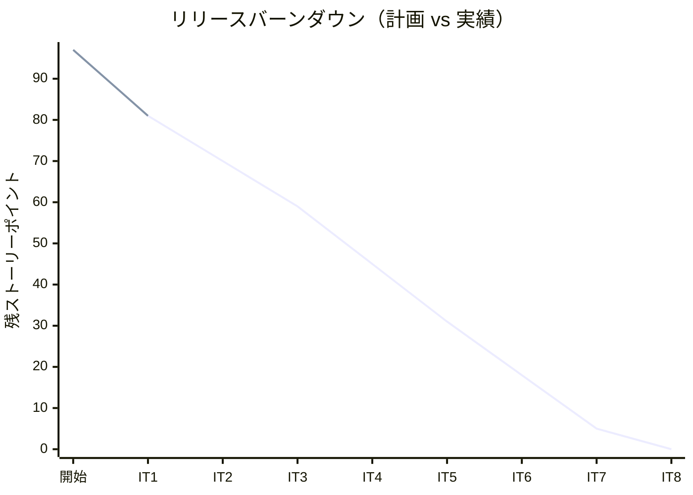
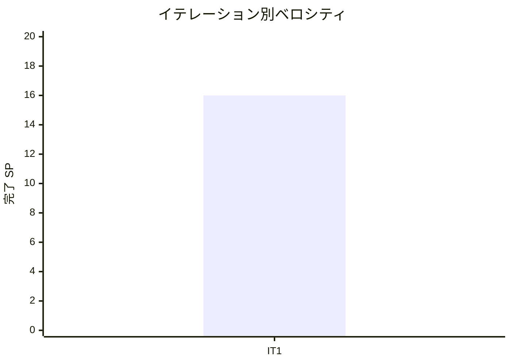

# イテレーション 1 完了報告書

## プロジェクト概要

| 項目 | 内容 |
|------|------|
| **プロジェクト** | 国際貨物輸送管理システム（Cargo Tracker / Rust 版） |
| **イテレーション** | 1（予約基盤・序盤／アウトサイドイン） |
| **ゴール** | 認証・ロール別アクセス制御を最初に確立し、荷主登録から貨物予約登録までの縦切りを通す |
| **計画期間** | Week 1-2（2026-07-21 〜 2026-08-03） |
| **実績期間** | 2026-07-18（前倒し・集中実装セッション） |
| **対象ストーリー** | US-AUTH-01・US02・US03・US04・US05 |

## 要員

| 名前 | 予定作業日数 | 実績作業日数 |
|---|---|---|
| 開発者 + AI ペア | 10 | 1（集中セッション） |

## 指標

### ベロシティ

| 項目 | 値 |
|------|-----|
| 計画 SP | 16 |
| 実績 SP | 16 |
| 達成率 | 100% |

### イテレーションバーンダウン（リリース全体・残 SP）

### ベロシティ（イテレーション別実績 SP）

> 実効ベロシティ想定は 10-12 SP。IT1 は認証・ナビ骨格の前倒し投資により 16 SP と重め。3 イテレーション後に再調整する。

## テスト結果

| メトリクス | 実績 |
|-----------|------|
| 単体テスト | 37 通過（domain/app/shared-kernel/server） |
| 統合テスト（testcontainers・実 PostgreSQL 16） | 8 通過（shipper 3 / cargo 3 / user 2） |
| HTTP フローテスト（tower oneshot・DB 連携） | 12 通過（auth 4 / shipper 3 / booking 3 / rest 2） |
| **合計** | **57 通過 / 0 失敗** |
| E2E テスト（Playwright） | 未実装（HTTP フローで代替検証） |
| カバレッジ | 未計測（`cargo-llvm-cov` は IT2 で導入予定） |
| ビルド / Lint | `cargo build` / `clippy -D warnings` / `fmt --check` 全 green |

### テスト増分（IT1 = 初回のため基準 0）

| イテレーション | 単体 | 統合 | HTTP フロー | 合計 | 増分 |
|---------------|------|------|-----------|------|------|
| IT1 | 37 | 8 | 12 | 57 | +57 |

### テスト累計推移

| イテレーション | 累計テスト数 |
|---------------|-------------|
| IT1 | 57 |

## SonarQube Quality Gate

未計測（`operating-qt` による品質ゲート確認は IT2 で CI 組み込み予定）。`cargo clippy --workspace -- -D warnings` と `cargo fmt --check` を暫定の品質ゲートとして全 green。

## 実施内容と評価

### ストーリー別完了状況

| ストーリー | 結果 | 予定 SP | ベロシティ加算 |
|---|---|---|---|
| US-AUTH-01 ログイン認証とロール別アクセス制御 | 完了 | 3 | 3 |
| US02 荷主を登録する | 完了 | 3 | 3 |
| US03 法人荷主を登録する | 完了 | 2 | 2 |
| US04 貨物予約を登録する | 完了 | 5 | 5 |
| US05 危険物・冷凍貨物の予約を登録する | 完了 | 3 | 3 |
| **合計** | | **16** | **16** |

### 受入条件の達成状況（要約）

- US-AUTH-01: ✅ ログイン/ログアウト・セッション・未認証リダイレクト・ロール別ナビ・403 認可（セッションタイムアウトは MemoryStore のため未検証）
- US02/US03: ✅ 個人/法人登録・ShipperCode 自動生成・Email 重複検出・割引率 0〜30% 検証
- US04/US05: ✅ 予約番号発行・Preliminary 生成・危険物申告/温度条件の必須検証・ShipperExistenceChecker ACL による荷主存在確認・予約詳細表示
- 見積整合性（US04-6）・イベント発行（US04-5）は IT6/IT2 依存としてインターフェース/骨格に留める

### 実装内容（レイヤー別）

- **ドメイン**: `shared-kernel`（ShipperId・Role）、`domain-shipper`（Shipper 集約・値オブジェクト・ShipperKind）、`domain-booking`（Cargo 集約・Cargo::book 不変条件・ACL ポート）
- **アプリケーション**: `app-shipper`（RegisterShipperCommandService・FindShipperQueryService）、`app-booking`（BookCargoCommandService）
- **インフラ**: `infra-persistence`（マイグレーション・SqlxShipperRepository・SqlxCargoRepository・SqlxShipperExistenceChecker・SqlxUserRepository（argon2）・SqlxShipperQueryAdapter）
- **プレゼンテーション**: `interface-web`（Askama SSR・tower-sessions・ロール別 navbar・ダッシュボード・ログイン・荷主/予約登録・予約詳細・全プレースホルダ）、`interface-rest`（/api/shippers）
- **合成ルート**: `cargo-tracker-server`（PgPool・セッション・静的アセット配信・seed/migrate バイナリ・livereload）

## 追加タスク（SP 外）

- 設計ドキュメント整合修正（cargo テーブル・割引率 15%→30%・クレート命名）
- ADR-0002（認証方式）起票
- 開発体験整備: seed バイナリ・migrate バイナリ・`gulp dev:*` タスク堅牢化・ライブリロード・静的アセットベンダリング
- 実起動で発見した 2 バグ修正（セッション Cookie Secure・デフォルト DATABASE_URL）
- developing-review（XP 5 視点マルチパースペクティブレビュー）

## E2E テスト結果

E2E（Playwright）は未実装。代替として HTTP レベルの tower `oneshot` フローテスト（testcontainers 上）で主要シナリオ（ログイン・荷主登録・予約登録・予約詳細・荷主検索）を検証。Playwright 着手は中盤（US08/10/13 優先）に計画。

## フェーズ・累計進捗

### Phase 1 進捗

| フェーズ | 内容 | SP | 完了 SP | 状態 |
|---------|------|-----|---------|------|
| Phase 1 | 予約基盤（IT1） | 16 | 16 | 完了 |

### 全フェーズ累計

| フェーズ | SP | 完了 SP | 進捗 |
|---------|-----|---------|------|
| Phase 1 | 16 | 16 | 100% |
| Phase 2 | 50 | 0 | 0% |
| Phase 3 | 31 | 0 | 0% |
| **合計** | **97** | **16** | **16%** |

## イテレーションレビュー（developing-review）

| アクションアイテム（高優先度） | 対応時期 |
|---|---|
| 認可を axum extractor + Role 型で宣言化 | IT2 冒頭 |
| interface→infra 直接依存の DIP 回復（composition root 集約・ADR） | IT2 前半 |
| 法人荷主(US03)・危険物/冷凍(US05) の HTTP フローテスト追加 | IT1 クローズ〜IT2 |

詳細は [IT1 開発成果物レビュー](../review/it1_development_review_20260718.md)（高 3 / 中 7 / 低 6）を参照。

## ふりかえり

詳細は [イテレーション 1 ふりかえり](./retrospective-1.md)（KPT）を参照。

## 更新履歴

| 日付 | 更新内容 | 更新者 |
|------|---------|--------|
| 2026-07-18 | IT1 完了報告書作成 | - |
