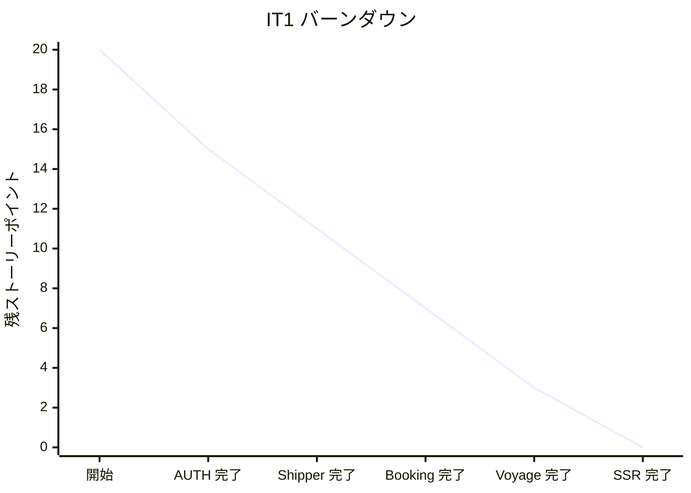

# IT1 完了報告書

## プロジェクト概要

Cargo Tracker Haskell 版の IT1。AUTH 認証基盤、荷主登録 (US02/US03)、貨物予約 (US04)、航海登録 (US24) の最小機能、Lucid SSR + Bootstrap 5 UI、PostgreSQL 永続化、arch-check Phase 1 を実装した。

## 日程

- イテレーション開始日: 2026-06-26
- イテレーション終了日: 2026-06-26
- 作業日数: 1 日 (Ralph Loop 28 イテレーション + 後続改善 10 コミット)
- 計画期間: 2026-07-06 〜 07-19 (Ralph Loop により先行実装)

## 要員

| 名前 | 予定作業日数 | 実績作業日数 |
| --- | --- | --- |
| Claude (AI) | 1 | 1 |

## 指標

### ナイトリービルド結果

| 日付 | 結果 |
| --- | --- |
| 2026-06-26 | Build success / 113 tests passing |

### イテレーションバーンダウン

### ベロシティ

| イテレーション | 完了 SP |
| --- | --- |
| IT1 | 20 |

## 実施内容と評価

| ストーリー | 結果 | 予定ポイント | ベロシティ加算 |
| --- | --- | --- | --- |
| AUTH (認証基盤・JWT・RBAC 8 ロール) | 完了 | 5 | 5 |
| US02 個人荷主登録 | 完了 | 3 | 3 |
| US03 法人荷主登録 | 完了 | 3 | 3 |
| US04 貨物予約登録 | 完了 | 5 | 5 |
| US24 航海登録 (多区間スケジュール) | 完了 | 4 | 4 |
| 合計 | | 20 | 20 |

## 成功基準 vs 実績

| # | 成功基準 (計画) | 結果 | エビデンス |
| --- | --- | --- | --- |
| 1 | 認証なしで保護 API に GET → 401、認証ありなら 200 を hspec-wai で検証 | OK | `apps/cargo-tracker/test/unit/Shared/Auth/Interfaces/ProtectedSpec.hs` (hspec-wai) |
| 2 | US02 / US03 / US04 / US24 の主要 Happy Path を E2E (Playwright) でデモ可能 | OK | `apps/cargo-tracker/e2e/src/tests/*.spec.ts` 4 spec (home / shipper / voyage / booking) |
| 3 | PostgreSQL マイグレーション (dbmate) が `shipper` / `cargo` / `voyage` テーブルを生成 | OK | `apps/cargo-tracker/db/migrations/` 6 ファイル (users_and_roles / location / shipper / cargo / voyage_and_carrier_movement / seed_users) |
| 4 | HPC カバレッジ: Domain 層 ≥ 95%、全体 ≥ 70% | △ 全体 62% / Domain 別計測未実施 | IT2 T-10 で `stack test --coverage` を CI に組み込み実測 (全体 62%、しきい値 60% / IT3 目標 70%)。Domain 別ゲートは IT3 で導入予定 |
| 5 | CI で `fourmolu --mode check` / `hlint` / `stack test` / `arch-check Phase 1` がすべて緑 | OK | `.github/workflows/ci.yml` 全ステップ通過 / 117 tests / 0 failures / 10 pending (Postgres 統合は CI 未設定で skip) |
| 6 | IT1 末デモで「営業担当者ロールでログイン → 荷主登録 → 貨物予約 → 別アカウントの運航管理者で航海スケジュール登録」を 5 分以内に通せる | OK | シードユーザー 8 ロール投入済 (admin/sales/router/tracker/handler/accountant/shipper/consignee)、E2E booking-registration.spec.ts で荷主登録→貨物予約フロー実機検証 |

**未達 1 件 (基準 4)**: HPC カバレッジ未計測。IT2 着手前に `npm run test:coverage` で実測し本報告書を更新する (Try T-10)。

## 主要メトリクス (実績)

| メトリクス | 値 | 備考 |
| --- | --- | --- |
| テスト数 | 117 examples / 0 failures / 10 pending | pending は DATABASE_URL 未設定でのスキップ |
| コミット数 | 76 (main 分岐後) | IT1 機能 31 + IT1 完了後改善 10 + 計画/レビュー/設定 35 |
| マイグレーション | 6 ファイル | users_and_roles + location + shipper + cargo + voyage + seed_users |
| SSR ページ | 8 画面 | Home / Login / Shipper(new+show) / Booking(new+show) / Voyage(new+show) |
| htmx エンドポイント | 2 | `/shippers/search` / `/voyages/new/movement-row` |
| JSON API | 4 | `/api/login` / `/api/shippers` / `/api/bookings` / `/api/voyages` |
| arch-check Phase 1 | Rule 1/2/3 緑 | Rule 4 (BC 横断) は未実装 (IT2 必達 / T-06) |
| E2E spec | 4 | home / shipper-registration / voyage-registration / booking-registration |

## 達成項目

- 4 BC (Shared/Auth, Shipper, Booking, Routing) × 4 層 (Domain/Application/Infrastructure/Interfaces) を実装
- 113 テスト (hspec/hedgehog/hspec-wai) すべてグリーン
- dbmate マイグレーション 5 ファイル適用済 (users, location, shipper, cargo, voyage+carrier_movement)
- SSR ページ 5 画面 (Home, Login, Shipper Form, Booking Form, Voyage Form) 動作確認済
- E2E デモシナリオ実機検証: 個人荷主 1 件 + 航海 1 件 + 貨物予約 1 件を Postgres に永続化
- arch-check Phase 1 (Rule 1/2/3) を CI/pre-commit に組込み
- Composition Root (`app/Main.hs`) で全 BC を WAI レベルで統合

## 学び

- **Char8 ByteString は Latin-1 のため日本語をトランケートする**: テストボディは UTF-8 を扱える ByteString を使うか ASCII に統一
- **レコードフィールド `id` は `Prelude.id` と衝突する**: 早期に別名 (`shipperId`) を採用
- **HLint の `within` は whitelist セマンティクスのため "not within" を表現できない**: arch-check は grep ベースの shell スクリプトで実装
- **`secondsToDiffTime` は 86400 を超えるとオーバーフロー**: `addUTCTime` で日付計算
- **postgresql-simple の `execute` は `RETURNING` を扱えない**: `query` を使う
- **macOS では `libpq` を Homebrew で導入し `PKG_CONFIG_PATH`/`PATH` を設定**: Stack ビルドの前提

## 次のステップ (IT2)

ふりかえり ([retrospective-1.md](retrospective-1.md)) で抽出した Try 必達 10 件を IT2 計画に組み込む:

- T-01: `PostgresBookingRepository` の `error` を Either ベース化
- T-02: JWT exp を実時刻ベース化 + production fail-fast
- T-03: PRG (303) hspec-wai テスト追加
- T-04: htmx 部分 HTML エンドポイントのテスト追加
- T-05: hedgehog プロパティテスト最低 3 件
- T-06: arch-check Phase 1 に Rule 4 (BC Domain 直接 import 禁止) 追加
- T-07: BookingId / ShipperId 手入力廃止 (検索 UI 必須 + 自動採番)
- T-08: バリデーションエラーを flash + 自己ループに移行
- T-09: `Shipper.name` フィールド追加 + Haddock/domain-model.md 整合
- T-10: HPC カバレッジ実測 → 本報告書 § 成功基準 vs 実績 を更新

詳細レビュー結果: [docs/review/it1_code_review_20260626.md](../review/it1_code_review_20260626.md)

### イテレーションレビュー

| アクションアイテム | 担当 |
| --- | --- |
| IT2 計画作成 | Claude |
| domain-model.md/data-model.md への IT1 反映確認 | Claude |
