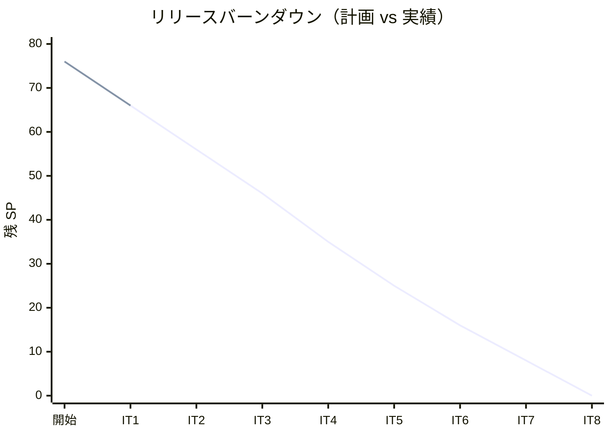
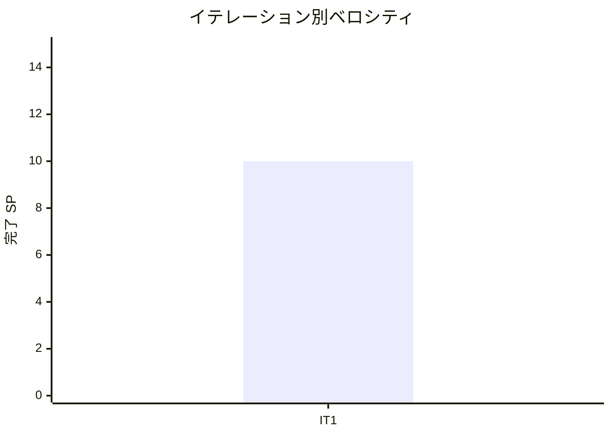

# イテレーション 1 完了報告書

## プロジェクト概要

| 項目 | 内容 |
|------|------|
| **イテレーション** | 1 |
| **計画期間** | 2026-05-21 〜 2026-06-03（2 週間） |
| **実績期間** | 2026-05-21 〜 2026-05-22（1 日で全タスク完了） |
| **ゴール** | Axon Kafka + Heroku 基盤を確立し、認証と航海スケジュール管理を動作させる |
| **作業日数** | 計画 10 日 / 実績 2 日 |

### 要員

| 名前 | 予定作業日数 | 実績作業日数 |
|------|------------|------------|
| k2works | 10 | 2 |

---

## 指標

### ベロシティ

| 項目 | 値 |
|------|-----|
| **計画 SP** | 10 |
| **実績 SP** | 10 |
| **達成率** | 100% |
| **1 SP あたり実績時間** | 約 4.9h |

### バーンダウンチャート

### ベロシティチャート

---

## テスト結果

### バックエンド

| メトリクス | 値 |
|-----------|-----|
| テストファイル数 | 7 / 7 通過 |
| テスト数 | 26 / 26 通過 |
| カバレッジ（全体） | 62.3% |
| カバレッジ（新規コード） | 81.8% |

### フロントエンド

| メトリクス | 値 |
|-----------|-----|
| テストファイル数 | 3 / 3 通過 |
| テスト数 | 11 / 11 通過 |
| E2E テストファイル | 2 ファイル（17 シナリオ全通過） |

### テスト増分（IT1 新規追加）

| カテゴリ | 前回 | 今回 | 増分 |
|---------|------|------|------|
| バックエンドテスト | 0 | 26 | +26 |
| フロントエンドテスト | 0 | 11 | +11 |
| E2E テスト | 0 | 17 | +17 |
| **合計** | **0** | **54** | **+54** |

### テスト累計推移

| イテレーション | Backend | Frontend | E2E | 合計 |
|--------------|---------|---------|-----|------|
| IT1 | 26 | 11 | 17 | 54 |

---

## SonarQube Quality Gate

| プロジェクト | カバレッジ（全体） | カバレッジ（新規） | 重複率 | Violations | 結果 |
|------------|----------------|----------------|--------|-----------|------|
| Backend | 62.3% | 81.8% | 0.0% | 0 | **PASS** ✅ |

---

## 実施内容と評価

### ストーリー別完了状況

| ID | ユーザーストーリー | 計画 SP | 実績 SP | 結果 |
|----|-------------------|---------|---------|------|
| 基盤 | 基盤構築（マルチモジュール・Kafka・Heroku） | 2 | 2 | 完了 ✅ |
| US00 | 認証（ログイン・ログアウト・アカウントロック） | 3 | 3 | 完了 ✅ |
| US24 | 航海スケジュールを新規登録する | 3 | 3 | 完了 ✅ |
| US25 | 既存航海スケジュールを更新する | 2 | 2 | 完了 ✅ |
| **合計** | | **10** | **10** | |

### 基盤構築 受入確認

- [x] Gradle マルチモジュール構成（authms・routingms・shared）
- [x] Spring Boot 4 + Axon Kafka Extension 依存関係設定
- [x] local-h2 / local-docker / heroku プロファイル設定
- [x] Docker Compose（Kafka + Zookeeper + PostgreSQL）設定
- [x] Gateway（gatewayms）+ フロントエンド（Vite）起動確認

### US00 受入確認

- [x] ユーザーID・パスワードでログインできる
- [x] ログアウトができる
- [x] 連続失敗（5 回）でアカウントがロックされる
- [x] ロールベースアクセス制御（8 ロール）が機能する

### US24 受入確認

- [x] 航海番号・船名・運送会社・出発港・到着港・出発日・到着日・対応貨物種別を入力できる
- [x] 寄港地を複数かつ順序付きで入力できる
- [x] 必須項目未入力時にエラーが表示される
- [x] 出発日が到着日より後の場合に日付整合性エラーが表示される
- [x] 同一航海番号が存在しない場合、登録が完了する
- [x] 登録後、航海スケジュール一覧で参照できる

### US25 受入確認

- [x] 既存の航海番号を指定して登録済みスケジュールを呼び出せる
- [x] 既存内容と更新内容の差分が確認できる
- [x] 「更新する」で既存スケジュールが上書き更新される
- [x] 更新後、一覧の検索結果に更新内容が反映される
- [x] 「キャンセル」を選択した場合、既存スケジュールは変更されない

### 実装内容の要約

#### ドメイン層（routingms）

- `Voyage` 集約（RegisterVoyageCommand / UpdateVoyageScheduleCommand 対応）
- `VoyageRegisteredEvent` / `VoyageScheduleUpdatedEvent`（Java record）
- Command / Event クラスを Java record に変換し重複を完全排除

#### アプリケーション層

- `VoyageCommandService`（CommandGateway 経由の CQRS コマンド送信）
- `VoyageQueryService`（MyBatis Mapper 経由のクエリ）

#### インフラ層

- MyBatis `VoyageMapper`（voyage / carrier_movement / voyage_accepted_cargo_type テーブル）
- Flyway マイグレーション（local-h2 / local-docker / Heroku PostgreSQL 対応）
- `VoyageProjectionEventHandler`（Axon EventHandler → MyBatis 書き込み）

#### プレゼンテーション層（routingms）

- `VoyageController`（POST /api/v1/voyages / PUT /api/v1/voyages/{voyageNumber} / GET）

#### authms

- `User` 集約・`JwtTokenProvider` / `JwtAuthenticationFilter` / `SecurityConfig`
- `AuthController`（POST /auth/login / POST /auth/logout）
- アカウントロック（5 回失敗）・BCrypt パスワード管理

#### フロントエンド

- ログイン画面（S00）・ダッシュボード（S01）
- 航海スケジュール一覧（S11）・登録/更新フォーム（S12）
- Heroku 向け Dockerfile（nginx + 静的ビルド）

---

## 追加タスク（SP 外）

| タスク | 分類 | 内容 |
|--------|------|------|
| SonarQube 品質管理基盤整備 | 技術基盤 | JaCoCo 0.8.13 + sonar-scanner + Quality Gate 設定 |
| Java record リファクタリング | コード品質 | 重複率 8.5% → 0.0%、Code Smell 0 達成 |
| Heroku Container Registry デプロイ | 運用基盤 | authms / routingms / gatewayms / frontend の Docker デプロイ自動化 |
| Aiven Kafka SSL 証明書自動化 | 運用基盤 | PEM ファイル 1 行化 + Heroku Config Vars 設定 Gulp タスク |
| pre-commit / commit-msg フック | 開発基盤 | Gradle check 自動実行・Conventional Commits 強制 |
| CI ワークフロー（GitHub Actions） | CI/CD | Backend / Frontend CI パイプライン構築 |
| Spring Boot バージョン互換対応 | バグ修正 | 3.5.3 → 3.4.7 + Spring Cloud 2024.0.1 切り戻し |

---

## E2E テスト結果

### 新規追加シナリオ

| ファイル | シナリオ | 結果 |
|---------|---------|------|
| `login.spec.ts` | ログイン・ログアウト・失敗・ロック | 8 シナリオ ✅ |
| `login-voyage.spec.ts` | 航海スケジュール登録・更新・一覧 | 9 シナリオ ✅ |
| **合計** | | **17 シナリオ全通過** |

---

## フェーズ・累計進捗

### Phase 1 進捗

| ID | ユーザーストーリー | SP | 状態 |
|----|-------------------|----|------|
| US00 | 認証 | 3 | ✅ 完了 |
| US24 | 航海スケジュール新規登録 | 3 | ✅ 完了 |
| US25 | 航海スケジュール更新 | 2 | ✅ 完了 |
| US02 | 荷主を登録する | 3 | 未着手 |
| US03 | 法人荷主を登録する | 3 | 未着手 |
| US04 | 貨物予約を登録する | 3 | 未着手 |
| US05 | 危険物・冷凍貨物の予約を登録する | 2 | 未着手 |
| US01 | 輸送見積を作成する | 3 | 未着手 |
| US06 | 予約情報を経路設計者に引き渡す | 2 | 未着手 |
| US07 | 航海スケジュールを検索する | 2 | 未着手 |
| US13 | 予約を確定する | 2 | 未着手 |
| US08 | 経路候補を算出する | 3 | 未着手 |
| US09 | 経路を選択・確定する | 2 | 未着手 |
| US10 | 経路条件を調整して再算出する | 2 | 未着手 |
| US11 | 経路情報を予約に紐付ける | 2 | 未着手 |
| US12 | 確定経路を荷主に通知する | 1 | 未着手 |

**Phase 1 進捗**: 8 / 41 SP（19.5%）

### 全フェーズ累計

| フェーズ | 計画 SP | 完了 SP | 達成率 |
|---------|---------|---------|--------|
| Phase 1 | 41 | 8 | 19.5% |
| Phase 2 | 27 | 0 | 0% |
| Buffer | 8 | 0 | 0% |
| **合計** | **76** | **8** | **10.5%** |

> 注: 基盤構築 2 SP は US に紐づかないため Phase 1 の US 合計には含まない。ベロシティ計上は 10 SP。

---

## ふりかえり

詳細は [イテレーション 1 ふりかえり](./retrospective-1.md) を参照。

---

## 更新履歴

| 日付 | 更新内容 | 更新者 |
|------|---------|--------|
| 2026-05-22 | 初版作成 | k2works |
