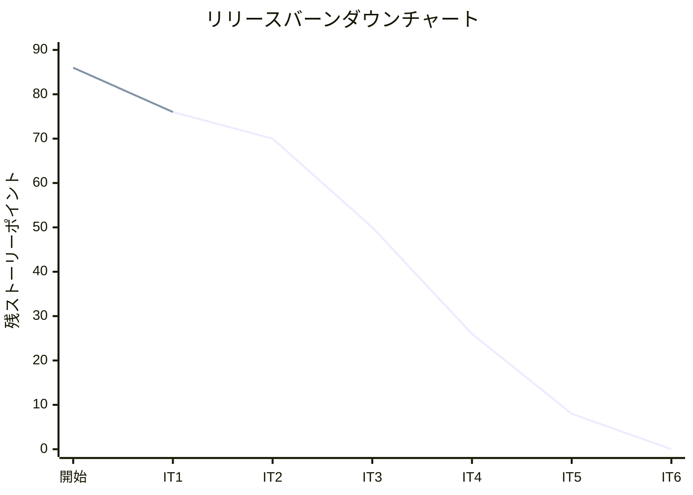
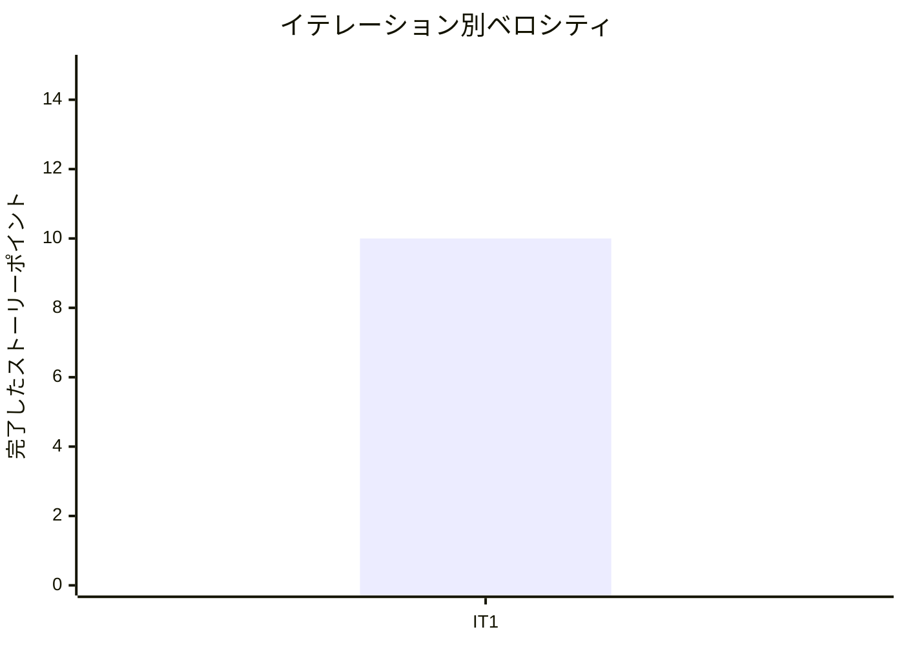

# イテレーション 1 完了報告書

## プロジェクト概要

### 日程

| 項目 | 値 |
|------|-----|
| イテレーション開始日 | 2026-04-04 |
| イテレーション終了日 | 2026-04-04 |
| 計画期間 | 2026-04-07 〜 2026-04-18（2 週間） |
| 実績作業日数 | 1 日（AI ペアプログラミングにより大幅短縮） |

### 要員

| 名前 | 予定作業日数 | 実績作業日数 |
|------|-------------|-------------|
| 開発者 + AI ペア | 10 | 1 |

---

## 指標

### ビルド結果

| 項目 | 結果 |
|------|------|
| Java テスト | 60 件全パス (failures=0, errors=0) |
| Playwright E2E テスト | 27 件全パス |
| 命令カバレッジ (JaCoCo) | 89% |
| ブランチカバレッジ (JaCoCo) | 65% |
| SonarQube Quality Gate | 未実行 |

### イテレーションバーンダウン

### ベロシティ

| 項目 | 値 |
|------|-----|
| 計画ベロシティ | 10-13 SP/イテレーション |
| IT1 実績ベロシティ | 10 SP |
| 1 SP あたり実績 | 約 4.0h |

---

## 実施内容と評価

| ストーリー | 結果 | 予定ポイント | ベロシティ加算ポイント |
|-----------|------|-------------|---------------------|
| US02: 荷主を登録する | 完了（注1） | 3 | 3 |
| US03: 法人荷主を登録する | 完了（注2） | 2 | 2 |
| US04: 貨物予約を登録する | 完了（注3） | 5 | 5 |
| **合計** | | **10** | **10** |

**注記**:

1. US02: 住所フィールド・重複メール確認は IT2 で対応
2. US03: 割引率上限 30%→15% の乖離は IT2 で修正
3. US04: 寸法・個数・品名フィールドは IT2 で対応

### 成果物一覧

| カテゴリ | 成果物 | 件数 |
|---------|--------|------|
| ドメインモデル | Shipper 集約（Shipper, CorporateShipper, 値オブジェクト 6 種） | 8 クラス |
| ドメインモデル | Cargo 集約（Cargo, BookingId, RouteSpecification 等） | 7 クラス |
| アプリケーション層 | CommandService / QueryService | 4 クラス |
| インフラ層 | MyBatis リポジトリ + マッパー XML | 4 ファイル |
| REST API | POST/GET エンドポイント | 6 エンドポイント |
| 画面 | Thymeleaf テンプレート（navbar, ダッシュボード, ログイン, 荷主 3 画面, 予約 3 画面） | 9 テンプレート |
| テスト | Java テスト（単体 + 統合 + E2E） | 60 件 |
| テスト | Playwright E2E テスト | 27 件 |
| アーキテクチャ | ArchUnit ヘキサゴナルルール | 6 件 |
| DB マイグレーション | Flyway マイグレーション（location, shipper, cargo） | 3 ファイル |
| ADR | ADR-010〜012 | 3 件 |

---

## レビュー結果サマリー

### コードレビュー（`developing-review`）

| 重要度 | 件数 | 主な指摘 |
|--------|------|----------|
| 高 | 8 件 | BC 間直接依存、受入基準乖離（住所・割引率・寸法）、例外クラス化、E2E 日付ハードコード |
| 中 | 8 件 | 境界値テスト不足、DTO 共通化、状態日本語化、荷主選択 UI |
| 低 | 3 件 | メソッド名改善、OpenAPI 説明追記、ShipperCode 衝突リスク |

### UI/UX レビュー（`developing-uiux-review`）

| 重要度 | 件数 | 主な指摘 |
|--------|------|----------|
| 高 | 8 件 | ログイン英語、ハンバーガーメニュー欠落、required/aria 未実装、ステータス色分け |
| 中 | 8 件 | 荷主名表示、UN/LOCODE ヒント、フラッシュメッセージ、割引率パーセント表示 |
| 低 | 5 件 | dt 幅調整、法人フィールド非表示、日付フォーマット、Bootstrap JS、ダッシュボードサマリー |

---

## イテレーションレビュー

### 達成したこと

- 荷主登録（個人・法人）の REST API + 画面が動作する
- 貨物予約登録の REST API + 画面が動作する
- ヘキサゴナルアーキテクチャ + Practical DDD パッケージ構成が確立した
- 87 件のテスト（Java 60 + Playwright 27）で回帰テスト基盤が整った

### 達成できなかったこと

- 一部受入基準の実装漏れ（住所、割引率上限、寸法/個数/品名）
- ブランチカバレッジ 80% 未達（実績 65%）
- SonarQube Quality Gate 未実行
- Bounded Context 間の依存分離（ACL 未導入）

### アクションアイテム（IT2 へ引き継ぎ）

| # | アクションアイテム | 優先度 |
|---|-------------------|--------|
| 1 | `ShipperId` を shared に移動 + ACL 導入 | 高 |
| 2 | 受入基準乖離の修正（住所・割引率・寸法等） | 高 |
| 3 | ログイン日本語化・ハンバーガーメニュー・required 属性 | 高 |
| 4 | ステータスバッジ色分け・状態日本語化 | 高 |
| 5 | ブランチカバレッジ向上（境界値テスト追加） | 中 |
| 6 | SonarQube スキャン実行・Quality Gate 確認 | 中 |
| 7 | E2E テスト日付の相対化 | 中 |

---

## 関連ドキュメント

- [イテレーション 1 計画](./iteration_plan-1.md)
- [イテレーション 1 ふりかえり](./retrospective-1.md)
- [リリース計画](./release_plan.md)
- [IT1 実装成果物レビュー](../review/IT1_review_20260404.md)
- [IT1 UI/UX レビュー](../review/IT1_uiux_review_20260404.md)
