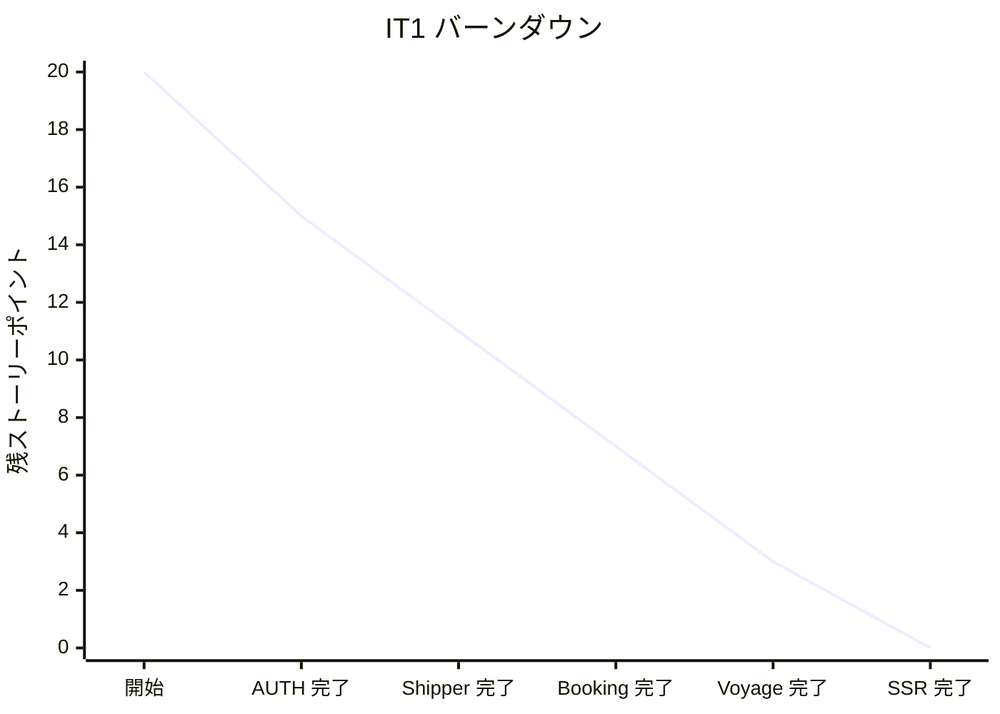

# IT1 完了報告書

## プロジェクト概要

Cargo Tracker Haskell 版の IT1。AUTH 認証基盤、荷主登録 (US02/US03)、貨物予約 (US04)、航海登録 (US24) の最小機能、Lucid SSR + Bootstrap 5 UI、PostgreSQL 永続化、arch-check Phase 1 を実装した。

## 日程

- イテレーション開始日: 2026-06-26
- イテレーション終了日: 2026-06-26
- 作業日数: 1 日 (Ralph Loop 28 イテレーション)

## 要員

| 名前 | 予定作業日数 | 実績作業日数 |
| --- | --- | --- |
| Claude (AI) | 1 | 1 |

## 指標

### ナイトリービルド結果

| 日付 | 結果 |
| --- | --- |
| 2026-06-26 | Build success / 113 tests passing |

### イテレーションバーンダウン

### ベロシティ

| イテレーション | 完了 SP |
| --- | --- |
| IT1 | 20 |

## 実施内容と評価

| ストーリー | 結果 | 予定ポイント | ベロシティ加算 |
| --- | --- | --- | --- |
| AUTH (認証基盤・JWT・RBAC 8 ロール) | 完了 | 5 | 5 |
| US02 個人荷主登録 | 完了 | 3 | 3 |
| US03 法人荷主登録 | 完了 | 3 | 3 |
| US04 貨物予約登録 | 完了 | 5 | 5 |
| US24 航海登録 (多区間スケジュール) | 完了 | 4 | 4 |
| 合計 | | 20 | 20 |

## 達成項目

- 4 BC (Shared/Auth, Shipper, Booking, Routing) × 4 層 (Domain/Application/Infrastructure/Interfaces) を実装
- 113 テスト (hspec/hedgehog/hspec-wai) すべてグリーン
- dbmate マイグレーション 5 ファイル適用済 (users, location, shipper, cargo, voyage+carrier_movement)
- SSR ページ 5 画面 (Home, Login, Shipper Form, Booking Form, Voyage Form) 動作確認済
- E2E デモシナリオ実機検証: 個人荷主 1 件 + 航海 1 件 + 貨物予約 1 件を Postgres に永続化
- arch-check Phase 1 (Rule 1/2/3) を CI/pre-commit に組込み
- Composition Root (`app/Main.hs`) で全 BC を WAI レベルで統合

## 学び

- **Char8 ByteString は Latin-1 のため日本語をトランケートする**: テストボディは UTF-8 を扱える ByteString を使うか ASCII に統一
- **レコードフィールド `id` は `Prelude.id` と衝突する**: 早期に別名 (`shipperId`) を採用
- **HLint の `within` は whitelist セマンティクスのため "not within" を表現できない**: arch-check は grep ベースの shell スクリプトで実装
- **`secondsToDiffTime` は 86400 を超えるとオーバーフロー**: `addUTCTime` で日付計算
- **postgresql-simple の `execute` は `RETURNING` を扱えない**: `query` を使う
- **macOS では `libpq` を Homebrew で導入し `PKG_CONFIG_PATH`/`PATH` を設定**: Stack ビルドの前提

## 次のステップ (IT2 候補)

- Playwright E2E シナリオ自動化
- Shipper Domain への name フィールド追加 (現状は email を placeholder)
- ロール別メニュー切替 (JWT セッション統合)
- 経路設計 (US07-09) 着手準備

### イテレーションレビュー

| アクションアイテム | 担当 |
| --- | --- |
| IT2 計画作成 | Claude |
| domain-model.md/data-model.md への IT1 反映確認 | Claude |
