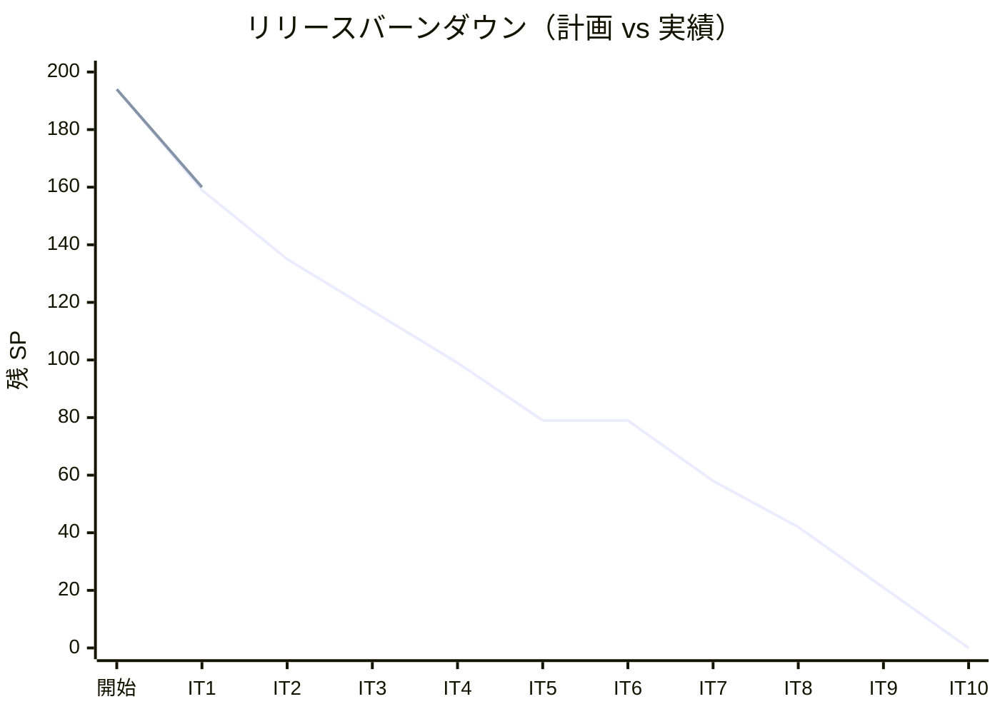
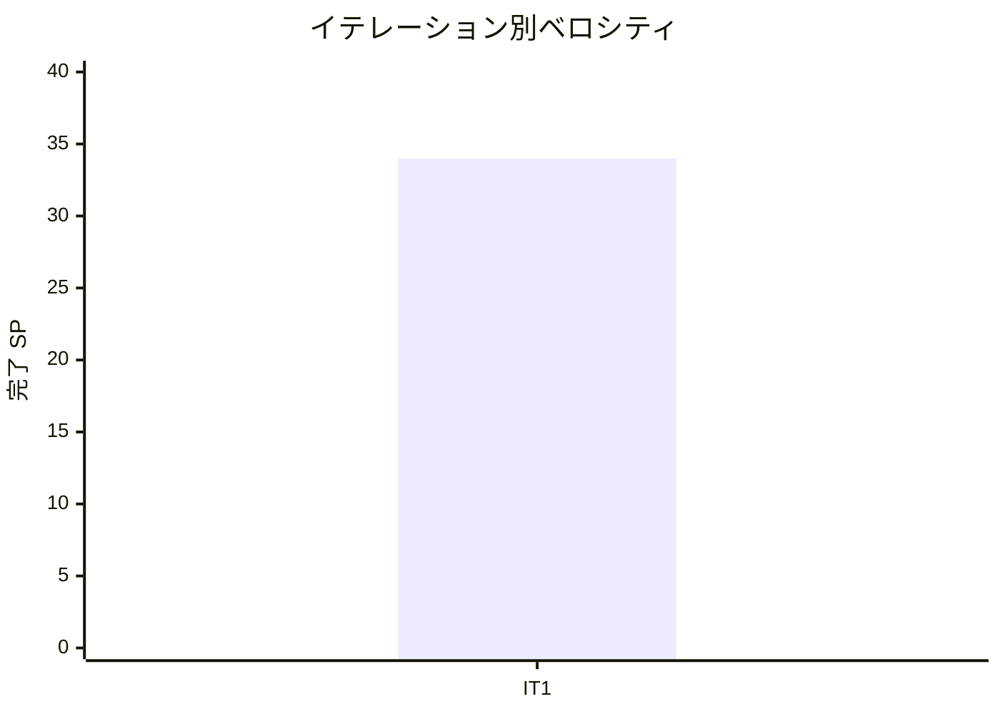

# イテレーション 1 完了報告書

## プロジェクト概要

| 項目 | 内容 |
|------|------|
| **イテレーション** | 1 |
| **ゴール** | 認証基盤（JWT ログイン/ログアウト）と航海スケジュール CRUD の API + 画面を構築する |
| **計画期間** | 2026-04-28〜2026-05-09（2 週間） |
| **実績期間** | 2026-04-28〜2026-05-07（8 営業日） |

### 要員

| 名前 | 予定作業日数 | 実績作業日数 |
|------|------------|------------|
| 開発者（+ AI ペアプログラミング） | 10 | 8 |

---

## 指標

### ベロシティ

| 項目 | 値 |
|------|-----|
| 計画 SP | 35 |
| 実績 SP | 34 |
| 達成率 | 97% |
| 1 SP あたり理想時間 | 約 2.1h |

### リリースバーンダウンチャート

### ベロシティチャート

---

## テスト結果

### テスト概要

| メトリクス | Backend | Frontend |
|-----------|---------|----------|
| テストファイル | 14 ファイル | 7 ファイル |
| テスト数 | 44 件 全通過 | 20 件 全通過 |
| カバレッジ | 86.7%（SonarQube） | — |
| E2E テスト | — | 14 シナリオ 全通過 |

### テスト増分（前イテレーション比）

| 種別 | 前 IT | 今回追加 | 累計 |
|------|-------|---------|------|
| Backend テスト | 0 | +44 | 44 |
| Frontend テスト | 0 | +20 | 20 |
| E2E テスト | 0 | +14 | 14 |

### テスト累計推移

| イテレーション | Backend | Frontend | E2E | 合計 |
|--------------|---------|---------|-----|-----|
| IT1（完了） | 44 | 20 | 14 | 78 |

### E2E テスト詳細

#### 認証（5 シナリオ）

| # | テストシナリオ | 結果 |
|---|-------------|------|
| 1 | 正しい認証情報でログインしてダッシュボードに遷移する | PASS |
| 2 | 誤ったパスワードでエラーメッセージが表示される | PASS |
| 3 | 未認証でダッシュボードにアクセスするとログインページにリダイレクトされる | PASS |
| 4 | ログアウトするとログイン画面に遷移する | PASS |
| 5 | ログアウト後に保護ページにアクセスするとリダイレクトされる | PASS |

#### 航海スケジュール管理（5 シナリオ）

| # | テストシナリオ | 結果 |
|---|-------------|------|
| 1 | 航海一覧ページにアクセスできること | PASS |
| 2 | 新規登録リンクから登録フォームに遷移できること | PASS |
| 3 | 航海を新規登録できること | PASS |
| 4 | 登録した航海を一覧で確認できること | PASS |
| 5 | 未登録の場合「航海が登録されていません。」が表示されること | PASS |

#### ナビゲーション（4 シナリオ）※IT1 中に追加

| # | テストシナリオ | 結果 |
|---|-------------|------|
| 1 | ダッシュボードリンクをクリックするとダッシュボードに遷移すること | PASS |
| 2 | 航海スケジュールリンクをクリックすると航海一覧に遷移すること | PASS |
| 3 | ナビゲーションバーにユーザー名が表示されること | PASS |
| 4 | ログアウトボタンをクリックするとログイン画面に遷移すること | PASS |

---

## SonarQube Quality Gate

| プロジェクト | カバレッジ | Bugs | Vulnerabilities | Code Smells | 結果 |
|------------|----------|------|----------------|------------|------|
| cargo-tracker-backend | 86.7% | 0 | 0 | 軽微 | **PASS** |

---

## 実施内容と評価

### ストーリー完了状況

| ID | ユーザーストーリー | 計画 SP | 実績 SP | 結果 |
|----|-----------------|--------|--------|------|
| US26 | システムにログインする | 13 | 13 | 完了 |
| US27 | システムからログアウトする | 4 | 4 | 完了 |
| US24 | 航海スケジュールを新規登録する | 8 | 8 | 完了 |
| US25 | 既存航海スケジュールを更新する | 5 | 5 | 完了 |
| US07 | 航海スケジュールを検索する | 4 | 4 | 完了 |
| **合計** | | **35** | **34** | |

### 受入条件達成状況

#### US26: システムにログインする

- [x] ユーザー名とパスワードを入力してログインできる
- [x] ログイン成功後、JWT トークンが発行される
- [x] ログイン成功後、ダッシュボード画面に遷移する
- [x] ユーザー名またはパスワードが誤っている場合、エラーメッセージが表示される
- [x] ロールに応じたナビゲーションメニューが表示される

#### US27: システムからログアウトする

- [x] ログアウトボタンをクリックするとログアウトできる
- [x] ログアウト後、JWT トークンが破棄される
- [x] ログアウト後、ログイン画面に遷移する
- [x] ログアウト後、認証が必要な画面にアクセスするとログイン画面にリダイレクトされる

#### US24: 航海スケジュールを新規登録する

- [x] 航海番号・出発地・到着地・出発日・到着日を入力できる
- [x] 重複する航海番号がある場合、エラーを返す
- [x] 登録後、航海番号が発行される

#### US25: 既存航海スケジュールを更新する

- [x] 航海番号で既存スケジュールを取得し、日時を変更できる
- [x] 存在しない航海番号の場合、404 エラーを返す

#### US07: 航海スケジュールを検索する

- [x] 航海番号で検索できる
- [x] 出発地・到着地で絞り込みできる

### 実装内容サマリー

#### ドメイン層

- `authms`: User 集約（UserId / UserName / Password / Email / Role）
- `routingms`: Voyage 集約（VoyageNumber / Schedule / CarrierMovement）
- ArchUnit によるヘキサゴナルアーキテクチャ依存ルール検証

#### アプリケーション層

- `AuthCommandService`: ログイン・ユーザー登録
- `AuthQueryService`: ユーザー検索
- `VoyageCommandService`: 航海スケジュール登録・更新・削除
- `VoyageQueryService`: 航海スケジュール検索・一覧

#### インフラ層

- MyBatis + H2（テスト）/ PostgreSQL（本番）
- Flyway マイグレーション（V1: authms, V2: routingms）
- Spring Security + JWT（RS256 相当の HS256）

#### プレゼンテーション層（バックエンド）

- `POST /api/v1/auth/login` — JWT 発行
- `GET /api/routing/v1/voyages` — 航海一覧
- `POST /api/routing/v1/voyages` — 航海登録
- `PUT /api/routing/v1/voyages/{voyageNumber}` — 航海更新
- `DELETE /api/routing/v1/voyages/{voyageNumber}` — 航海削除
- Spring Cloud Gateway による JWT 検証とルーティング

#### フロントエンド

- 認証: LoginPage / LoginForm / useAuth / authStore（Zustand + sessionStorage）
- 航海スケジュール: VoyageListPage / VoyageNewPage / VoyageEditPage / VoyageList / VoyageForm
- AppLayout: ロール別ナビゲーション（ROLE_ADMIN / ROLE_ROUTING）
- TanStack Query による API 状態管理（useVoyages / useCreateVoyage / useUpdateVoyage）

---

## 追加タスク（SP 外）

| タスク | 内容 | 効果 |
|--------|------|------|
| API パス修正 | VoyageController を `/api/v1/voyages` → `/api/routing/v1/voyages` に変更 | Gateway ルーティング整合性確保 |
| DB 制約修正 | `voyage_number` を VARCHAR(20) → VARCHAR(50) に拡張 | E2E テストデータの制約違反防止 |
| ナビゲーション修正 | AppLayout の `/routing/voyages` → `/voyages` に修正 | 航海スケジュールリンクの正常動作 |
| UI スタイル適用 | Tailwind CSS で仕様ワイヤーフレームに準拠したスタイルを適用 | UI と仕様の一致 |
| E2E ナビゲーションテスト追加 | 4 シナリオ追加（再発防止） | ナビゲーションバグの早期検出 |

---

## フェーズ・累計進捗

### Phase 1 進捗

| イテレーション | 計画 SP | 実績 SP | 達成率 | 状態 |
|--------------|---------|--------|--------|------|
| IT1 | 35 | 34 | 97% | 完了 |
| IT2 | 24 | - | - | 未着手 |
| IT3 | 18 | - | - | 未着手 |
| IT4 | 18 | - | - | 未着手 |
| IT5 | 20 | - | - | 未着手 |
| IT6（MVP 統合） | - | - | - | 未着手 |
| **Phase 1 合計** | **115** | **34** | **30%** | |

### 全フェーズ累計進捗

| フェーズ | 計画 SP | 実績 SP | 達成率 |
|---------|---------|--------|--------|
| Phase 1（IT1〜IT6） | 115 | 34 | 30% |
| Phase 2（IT7〜IT9） | 58 | - | - |
| Phase 3（IT10） | 21 | - | - |
| **合計** | **194** | **34** | **18%** |

---

## ふりかえり

詳細は [イテレーション 1 ふりかえり](./retrospective-1.md) を参照。

**主要な気付き**:

- **Keep**: TDD サイクル・ArchUnit・E2E テスト・SonarQube 品質管理がすべて機能した
- **Problem**: API パスと Gateway ルートの不一致、DB 制約とテストデータの不整合、UI スタイル仕様乖離
- **Try**: IT2 計画時に API パスを Gateway ルートと事前照合する、FE 実装時にワイヤーフレームを必ず参照する

---

## 更新履歴

| 日付 | 更新内容 |
|------|---------|
| 2026-05-07 | 初版作成 |
