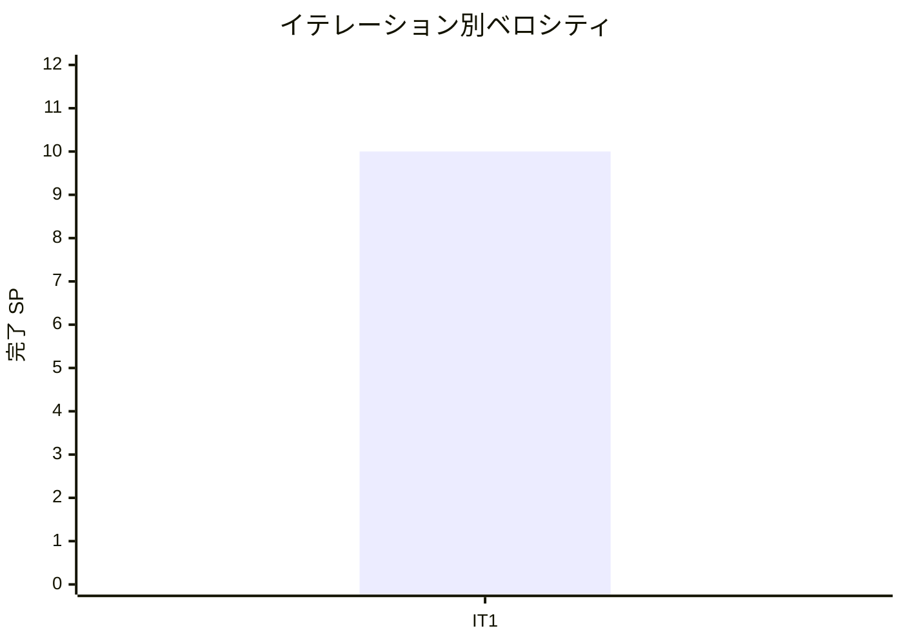

# イテレーション 1 完了報告書

## 1. プロジェクト概要

| 項目 | 内容 |
|------|------|
| イテレーション番号 | 1 |
| 計画期間 | 2026-03-31 〜 2026-04-13 |
| 実績期間 | 2026-03-31 〜 2026-04-01 |
| ゴール | Spring Boot プロジェクト基盤を構築し、荷主登録と貨物予約登録の CRUD を動作させる |

## 2. 要員

| 名前 | 予定作業日数 | 実績作業日数 |
|------|--------------|--------------|
| Copilot | 5 | 2 |

## 3. 指標

### ベロシティ

| 項目 | 値 |
|------|-----|
| 計画 SP | 10 |
| 実績 SP | 10 |
| 達成率 | 100% |

### イテレーションバーンダウン

```mermaid
xychart-beta
    title "IT1 バーンダウン"
    x-axis ["開始", "IT1"]
    y-axis "残 SP" 0 --> 70
    line "計画" [64, 54]
    line "実績" [64, 54]
```

### ベロシティ推移



## 4. テスト結果

| メトリクス | Backend | Frontend |
|-----------|---------|----------|
| テストファイル | 27 / 27 通過 | 該当なし |
| テスト数 | 113 / 113 通過 | 該当なし |
| カバレッジ | 91.2%（JaCoCo LINE） | 該当なし |
| E2E テスト | 9 / 9 シナリオ通過 | 9 / 9 シナリオ通過 |

### テスト増分（前イテレーション比）

| メトリクス | 増分 |
|-----------|------|
| Backend テストファイル | +27 |
| Backend テスト数 | +113 |
| E2E シナリオ | +9 |

### テスト累計推移

| イテレーション | Backend テストファイル | Backend テスト数 | E2E シナリオ |
|---------------|------------------------|------------------|--------------|
| IT1 | 27 | 113 | 9 |

## 5. SonarQube Quality Gate

| プロジェクト | カバレッジ | 重複率 | Violations | 結果 |
|------------|-----------|--------|-----------|------|
| cargo-tracker | 88.2%（new coverage） | 0.0% | 0（new violations） | PASS |

## 6. 実施内容と評価

### ストーリー別完了状況

| ストーリー | 結果 | 予定ポイント | ベロシティ加算ポイント |
|-----------|------|-------------|------------------------|
| US02 荷主を登録する | 完了 | 3 | 3 |
| US03 法人荷主を登録する | 完了 | 2 | 2 |
| US04 貨物予約を登録する | 完了 | 5 | 5 |
| 合計 |  | 10 | 10 |

### 受入条件達成状況

#### US02: 荷主を登録する

- [x] 氏名 / 社名・連絡先・メールアドレス・荷主種別を入力できる
- [x] 同一メールアドレス重複時に既存荷主を検知し、既存 ID を表示できる
- [x] 登録完了後に荷主 ID が発行される
- [x] 個人荷主を登録できる

#### US03: 法人荷主を登録する

- [x] 法人種別選択時に契約番号・割引率入力欄が表示される
- [x] 割引率 0〜30% のバリデーションがある
- [x] 法人荷主登録後に荷主 ID が発行される
- [x] 契約情報が後続の割引機能で参照可能な形で保持される

#### US04: 貨物予約を登録する

- [x] 既存荷主を選択して予約登録できる
- [x] 貨物仕様と輸送条件を入力できる
- [x] 登録完了後に予約番号が発行され、一覧 / 詳細で確認できる
- [x] 登録後イベント処理の実装パターンを確立した
- [x] Web UI と REST API の両方から予約情報を扱える

### レイヤー別実装要約

- **ドメイン**: `Shipper` / `Booking` 集約、値オブジェクト、ドメインイベントを実装しました。
- **アプリケーション**: 登録ユースケース、QueryService、ACL ポート、イベントハンドリングの基盤を整備しました。
- **インフラ**: MyBatis mapper、Flyway migration、default profile seed、H2 Console、Git Hooks、SonarQube 運用を追加しました。
- **プレゼンテーション**: 荷主 / 予約の Web UI、一覧・詳細表示、Web / REST 分離、Swagger UI を整備しました。
- **E2E / UI**: Playwright による認証、個人 / 法人荷主登録、予約登録の回帰シナリオを追加しました。

## 7. 追加タスク（SP 外）

- 荷主一覧・予約一覧の E2E 追加と、不足していた一覧取得実装の補完
- booking / shipper の Web・REST インターフェース分離
- Swagger UI / OpenAPI 導入
- default profile の seed data 追加
- UI / UX 改善（荷主→予約導線、荷主名表示、dropdown 補助情報）
- Husky / lint-staged による Git Hooks 整備
- SonarQube 指摘修正と Quality Gate PASS 化
- レビュー指摘に基づく OpenAPI 公開制御、API 認証、seed 分離、demo 表示改善

## 8. E2E テスト結果

### 新規追加・維持したシナリオ

- E01: 認証（ログイン / ログアウト / 認証失敗 / 未認証リダイレクト）
- E02: 個人荷主登録
- E03: 法人荷主登録
- E04: 貨物予約登録

### リグレッション結果

| 種別 | 結果 |
|------|------|
| Playwright E2E | 9 / 9 passed |
| backend テスト | 113 / 113 passed |
| SonarQube Quality Gate | PASS |

## 9. フェーズ・累計進捗

### 現在フェーズの進捗

| フェーズ | 計画 SP | 完了 SP | 達成率 | 状態 |
|---------|---------|---------|--------|------|
| Phase 1 | 51 | 10 | 19.6% | 進行中 |

### 全体累計進捗

| 項目 | 値 |
|------|----|
| 全体計画 SP | 64 |
| 累計完了 SP | 10 |
| 全体達成率 | 16% |

## 10. ふりかえりへのリンク

詳細は [イテレーション 1 ふりかえり](./retrospective-1.md) を参照。

## 11. 更新履歴

| 日付 | 更新内容 | 更新者 |
|------|---------|--------|
| 2026-04-01 | IT1 完了報告書を作成 | Copilot |
