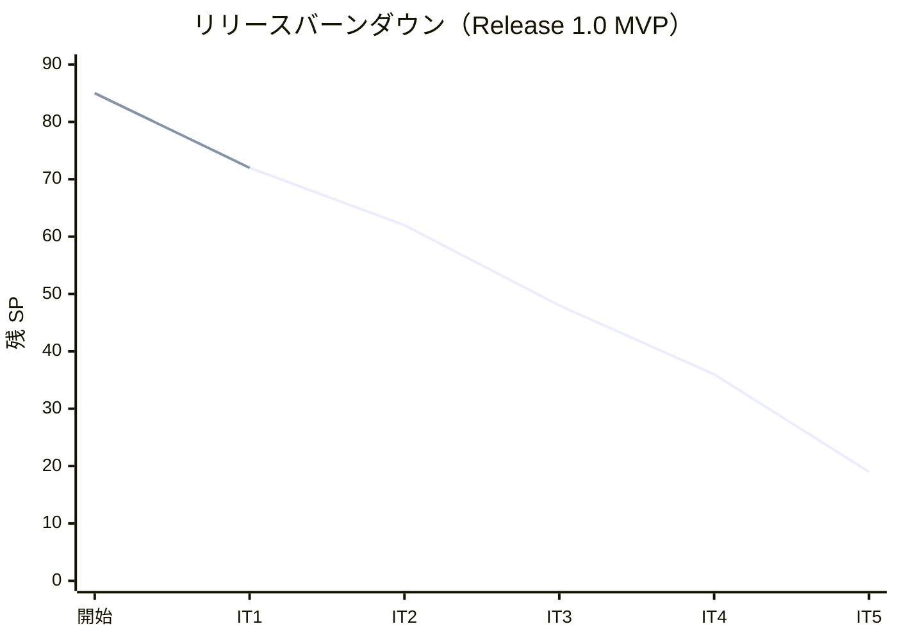

# イテレーション 1 完了報告書

## 1. プロジェクト概要

| 項目 | 内容 |
|------|------|
| イテレーション | IT1 |
| ゴール | 技術基盤（DbUp・UoW + post-commit）と認証を確立し、荷主登録と見積で最初の業務価値を届ける |
| 計画期間 | 2026-07-07 〜 2026-07-18（2 週間） |
| 実績期間 | 2026-07-08（AI エージェント協働による集中実装） |
| 局面（開発戦略） | 序盤 = アウトサイドイン（基盤 → 認証 → ウォーキングスケルトン → 縦切り） |

### 要員

| 名前 | 予定作業日数 | 実績作業日数 |
|------|------------|------------|
| 開発者 1 名 + AI エージェント | 10 | 1（集中実装） |

## 2. 指標

### ベロシティ

| 項目 | 値 |
|------|-----|
| 計画 SP | 13 |
| 実績 SP | 13 |
| 達成率 | **100%** |

### リリースバーンダウン（計画 vs 実績）

- 計画線: 85 → 72 → 62 → 48 → 36 → 19（IT5 で Release 1.0）
- 実績線: 85 → 72（IT1 完了時点。計画どおり 13 SP 消化）

### ベロシティ推移

- IT1 実績 13 SP。初回のため平均 = 13 SP。3 イテレーション実績で較正予定（IT3 終了時）。

## 3. テスト結果

| プロジェクト | テスト種別 | テスト数 | 結果 |
|------------|----------|---------|------|
| CargoTracker.Domain.Tests | 単体（ドメイン） | 28 | 全通過 |
| CargoTracker.Application.Tests | 単体（アプリ・Moq） | 4 | 全通過 |
| CargoTracker.Infrastructure.Tests | 統合（Testcontainers/SQLite） | 18 | 全通過 |
| CargoTracker.Web.Tests | 統合（WebApplicationFactory） | 16 | 全通過 |
| CargoTracker.Architecture.Tests | アーキテクチャ（ArchUnitNET） | 4 | 全通過 |
| CargoTracker.E2E.Tests | E2E（Playwright） | 4 | 全通過 |
| **合計** | | **74** | **全通過** |

### テスト増分・累計推移

| イテレーション | 増分 | 累計 |
|---------------|------|------|
| IT1 | +74 | 74 |

> 品質: ビルド警告 0、`dotnet format` クリーン、pre-commit（format/build）通過。カバレッジ計測（coverlet）は CI 未導入のため次イテレーションで組み込み予定（ふりかえり Try T4）。SonarQube 解析は本 IT では未実施。

## 4. 実施内容と評価

### ストーリー別完了状況

| ストーリー | 結果 | 予定 SP | ベロシティ加算 |
|-----------|------|---------|---------------|
| US26 システムにログインする | 完了 | 3 | 3 |
| US02 荷主を登録する | 完了 | 3 | 3 |
| US03 法人荷主を登録する | 完了 | 2 | 2 |
| US01 輸送見積を作成する | 完了 | 5 | 5 |
| **合計** | | **13** | **13** |

### 受入条件の達成状況

- **US26 認証**: ✅ Cookie 認証・失敗時エラー保持・未認証リダイレクト・匿名許可（公開追跡/health）・ログアウト・ロール別ナビ・パスワードハッシュ化（全条件）
- **US02/US03 荷主**: ✅ 個人/法人登録・割引率 0〜30% 検証・重複メール検証・法人フィールドの htmx 動的切替・住所
- **US01 見積**: ✅ 入力・スタブルート候補表示・見積番号発行・危険物選択時の申告フォーム表示（htmx）。⏳ 「期限に間に合うルートなし通知」はスタブ段階のため IT3 実データ化で対応

### 実装内容の要約（レイヤー別）

- **ドメイン**: AggregateRoot（イベント蓄積）、Shipper 集約（個人/法人・DiscountRate）、Estimate 集約（ルート候補）、Location/値オブジェクト群
- **アプリケーション**: Command/Query サービス分離（ADR-0005）、`IUnitOfWorkFactory`・`IDbConnectionFactory` ポート、外部経路 ACL ポート（スタブ）
- **インフラ**: Dapper リポジトリ（二方言安全 SQL）、UnitOfWork（post-commit イベント）、DbUp 起動時マイグレーション（0001-0004）、DateOnly/Guid TypeHandler
- **プレゼンテーション**: Cookie 認証 + グローバル認可、ログイン/荷主/見積の各画面、ロール制御ナビ、htmx 動的フォーム、ウォーキングスケルトン（全ルートのプレースホルダ）

## 5. 追加タスク（SP 外）

| カテゴリ | 内容 |
|---------|------|
| 技術基盤 | DbUp 二方言配線、post-commit イベント基盤、方言検出テスト、CQRS ADR（ADR-0005） |
| ADR | ADR-0004（Cookie 認証と軽量ユーザーストア）、ADR-0005（CQRS 段階適用） |
| XP レビュー対応 | マルチパースペクティブレビュー高優先 5 件対応（ArchUnit 実装・住所ドリフト・危険物申告・法人 htmx・M2 ポート是正） |
| 設計整合 | validating-design による横断検証・設計ドキュメント修正 |
| 開発基盤 | dev:app（live reload）、dev:e2e タスク、htmx.org 導入 |

## 6. E2E テスト結果

| シナリオ | 結果 |
|---------|------|
| ログイン → 荷主登録 → 一覧表示（住所含む） | 通過 |
| 荷主種別を法人に切替 → 契約番号フィールドが htmx 表示 | 通過 |
| ログイン → 見積作成 → 詳細でルート候補表示 | 通過 |
| 貨物種別を危険物に切替 → 申告フォームが htmx 表示 | 通過 |

## 7. フェーズ・累計進捗

### Release 1.0 MVP（Phase 1・IT1-5）

| イテレーション | 計画 SP | 実績 SP | 状態 |
|---------------|---------|---------|------|
| IT1 | 13 | 13 | 完了 |
| IT2 | 10 | - | 未着手 |
| IT3 | 14 | - | 未着手 |
| IT4 | 12 | - | 未着手 |
| IT5 | 17 | - | 未着手 |
| **累計** | **66** | **13** | 20% |

### プロジェクト全体

| フェーズ | 計画 SP | 実績 SP | 進捗 |
|---------|---------|---------|------|
| Release 1.0 MVP（IT1-5） | 66 | 13 | 20% |
| Release 1.1（IT6-7） | 19 | 0 | 0% |
| **全体** | **85** | **13** | **15%** |

## 8. ふりかえり

詳細は [イテレーション 1 ふりかえり（KPT）](./retrospective-1.md) を参照。主な Try: 設計横断更新チェック（T1）、ArchUnit 維持（T2）、E2E パターン整備（T3）、カバレッジ CI（T4）、中優先負債返済（T5）、ベロシティ較正（T6）。

## 9. 更新履歴

| 日付 | 更新内容 | 更新者 |
|------|---------|--------|
| 2026-07-08 | IT1 完了報告書 初版作成 | - |
