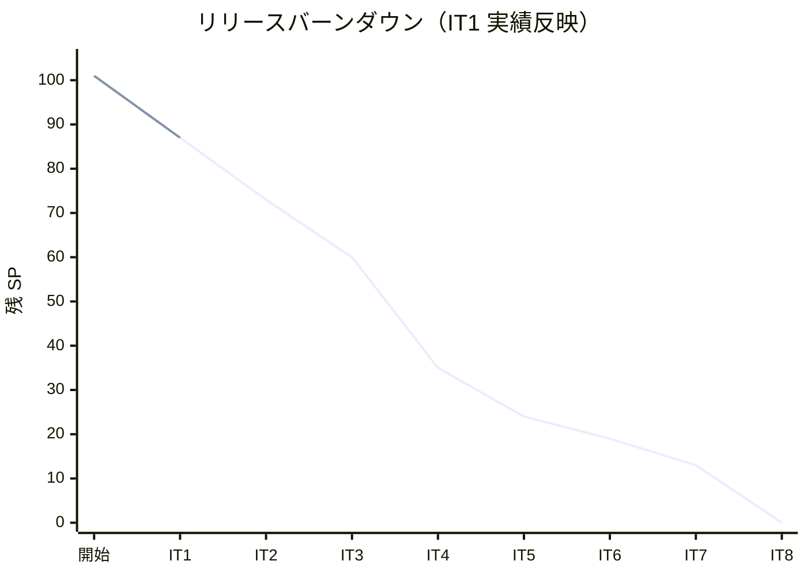

# イテレーション 1 完了報告書

## 1. プロジェクト概要

| 項目 | 内容 |
|------|------|
| **イテレーション** | 1 / 8 |
| **期間** | 2026-05-14 〜 2026-05-27（2 週間） |
| **ゴール** | JWT 認証基盤（authms）を構築し、荷主登録（bookingms shipper）を実装する |
| **チーム** | 開発者 1 名 + AI エージェント（Claude Code） |

---

## 2. 指標

### ベロシティ

| 項目 | 値 |
|------|-----|
| 計画 SP | 16 |
| 実績 SP | 14 |
| 達成率 | 88% |
| 持越し | 2 SP 相当（アカウントロック・ログアウト・E2E テスト） |

### バーンダウンチャート

### ベロシティチャート

```mermaid
xychart-beta
    title "ベロシティ推移"
    x-axis ["IT1"]
    y-axis "SP" 0 --> 20
    bar "計画" [16]
    bar "実績" [14]
```

---

## 3. テスト結果

| カテゴリ | テスト数 | 成功 | 失敗 | スキップ |
|---------|---------|------|------|---------|
| authms（ユニット + 統合） | 53 | 53 | 0 | 0 |
| bookingms（ユニット + 統合） | 13 | 13 | 0 | 0 |
| gatewayms（コンテキスト起動） | 1 | 1 | 0 | 0 |
| **バックエンド合計** | **67** | **67** | **0** | **0** |
| フロントエンド（Vitest） | 35 | 35 | 0 | 0 |
| **総合計** | **102** | **102** | **0** | **0** |

- バックエンド: `./gradlew test` BUILD SUCCESSFUL
- フロントエンド: `vitest run` 7 テストファイル / 35 テストケース ALL PASSED（3.65s）

---

## 4. 実施内容と評価

### ストーリー別完了状況

| ID | ユーザーストーリー | SP | 状態 | 備考 |
|----|-------------------|----|------|------|
| US00 | システムにログインする | 5 | 完了（部分） | ログイン・JWT 発行・Spring Security 完了。アカウントロック（2.7）・ログアウト（2.8）は IT2 持越し |
| US00a | ユーザーアカウントを管理する | 3 | 完了 | CRUD + ロール管理 + 権限チェック全タスク完了 |
| US02 | 荷主を登録する | 3 | 完了 | 個人荷主登録・重複メールチェック完了。Axon Aggregate（4.3〜4.5）は CRUD 実装に切替え |
| US03 | 法人荷主を登録する | 3 | 完了 | 法人荷主登録・割引率バリデーション完了 |
| US-UI | UI 実装（ログイン・荷主画面） | 2 | 完了（部分） | S00/S05/S06/S07 全画面実装済み。E2E テスト（5.8）は IT2 持越し |

### 受入条件の達成状況

| 成功基準 | 状態 |
|---------|------|
| `POST /api/v1/auth/login` でログインし JWT トークンを取得できる | 達成 |
| 無効な認証情報でのログイン失敗が適切にハンドリングされる | 達成 |
| 5 回連続失敗でアカウントロックが機能する | IT2 持越し |
| `POST /api/v1/admin/users` で新規ユーザーを作成できる（`ROLE_ADMIN` のみ） | 達成 |
| ADR-0004・ADR-0005 が作成される | 達成 |
| `POST /api/v1/shippers` で個人荷主を登録できる | 達成 |
| `POST /api/v1/shippers` で法人荷主（契約番号・割引率付き）を登録できる | 達成 |
| 全 API の単体テスト・統合テストがパス | 達成（バックエンド 67 件・フロントエンド 35 件 GREEN） |

### Phase 0 レビュー指摘対応

| # | タスク | 状態 |
|---|--------|------|
| 1.1 | `PingControllerIntegrationTest` 追加 | 完了 |
| 1.2 | `BookingApplicationTests` に `@DisplayName` 追加 | 完了 |
| 1.3 | ADR-0004 マイクロサービス分割方針作成 | 完了 |
| 1.4 | ADR-0005 shared モジュールの役割作成 | 完了 |

---

## 5. 追加タスク（SP 外）

イテレーション期間中に計画外で実施した作業です。

| タスク | 内容 |
|--------|------|
| gatewayms 追加 | Spring Cloud Gateway を追加（JWT 検証・authms/bookingms ルーティング） |
| Heroku デプロイ環境構築 | Heroku Container Registry + Axon ローカルバス + H2 による開発環境デプロイ |
| ADR-0006 作成 | Heroku デプロイ構成の意思決定記録 |
| SonarQube 品質対応 | Code Smell / Bug 修正（プロダクション + テストコード） |
| Checkstyle / SpotBugs 導入 | 静的解析セットアップと違反修正 |
| Git Hooks セットアップ | pre-commit（ビルド・テスト・Lint）+ commit-msg フック |
| CI ワークフロー構築 | GitHub Actions（バックエンド + フロントエンド CI） |
| 開発環境セットアップ手順書更新 | IT1 完了後の変更反映 |
| CORS 設定追加 | bookingms CORS 設定 |
| nginx プロキシ修正 | フロントエンド nginx を gateway 経由に変更 |

---

## 6. フェーズ・累計進捗

### イテレーション進捗

| イテレーション | 計画 SP | 実績 SP | 達成率 | 状態 |
|---------------|---------|---------|--------|------|
| IT1 | 16 | 14 | 88% | 完了 |
| IT2 | 14 | - | - | 未着手 |
| IT3 | 13 | - | - | 未着手 |
| IT4 | 25 | - | - | 未着手 |
| IT5 | 11 | - | - | 未着手 |
| IT6 | 5 | - | - | 未着手 |
| IT7 | 6 | - | - | 未着手 |
| IT8 | 13 | - | - | 未着手 |
| **累計** | **103** | **14** | **14%** | |

### フェーズ進捗

| フェーズ | 計画 SP | 完了 SP | 進捗率 | 状態 |
|---------|---------|---------|--------|------|
| 認証基盤（Phase 0） | 8 | 6 | 75% | 進行中（ロック・ログアウト残） |
| Phase 1（予約・経路設計） | 57 | 8 | 14% | 進行中（US02/US03 完了） |
| Phase 2（追跡・精算） | 35 | 0 | 0% | 未着手 |

### IT2 への持越し事項

| タスク | 元タスク ID | 理由 |
|--------|-----------|------|
| アカウントロック機能（5 回失敗で 30 分ロック） | 2.7 | 優先度調整、コア認証を先行 |
| ログアウト（トークン無効化） | 2.8 | 優先度調整 |
| フロントエンド E2E テスト | 5.8 | 超過見込みのため計画的持越し |

---

## 7. 更新履歴

| 日付 | 更新内容 | 更新者 |
|------|---------|--------|
| 2026-05-13 | 初版作成 | AI Agent（XP PM） |
