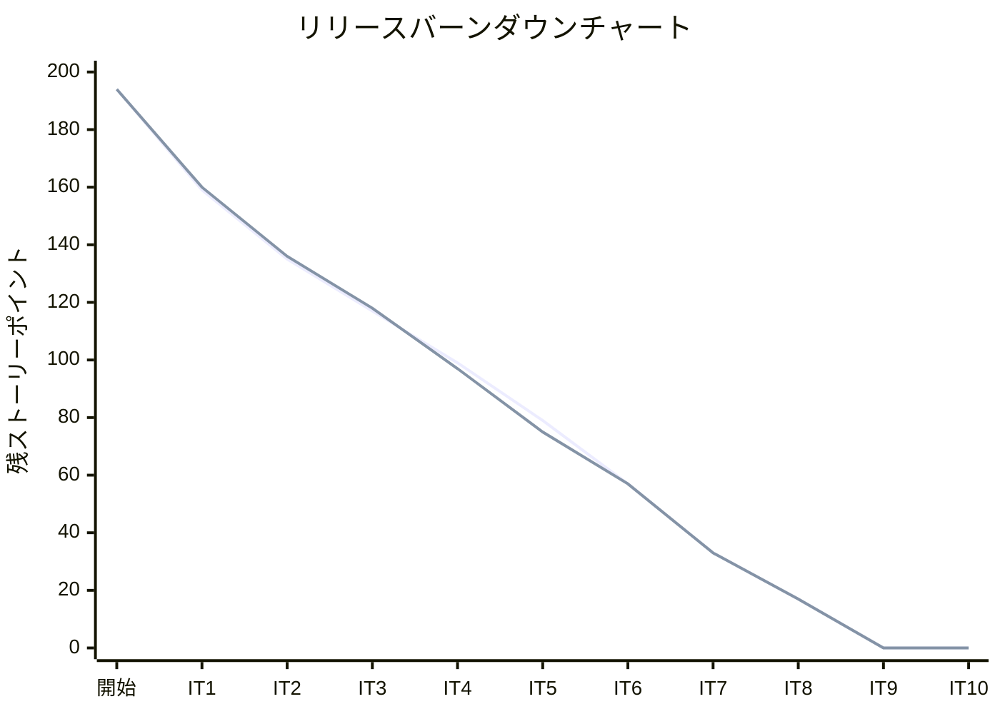
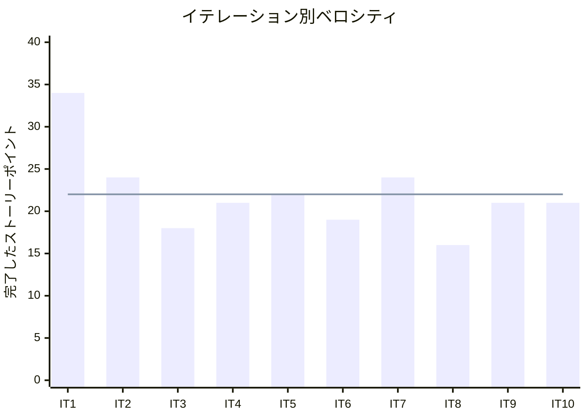

# イテレーション 10 完了報告書

## プロジェクト概要

### 日程

| 項目 | 日付 |
|------|------|
| イテレーション開始日 | 2026-05-12 |
| イテレーション終了日 | 2026-05-12 |
| 作業日数（実績） | 1 日 |

### 要員

| 名前 | 予定作業日数 | 実績作業日数 |
|------|------------|------------|
| 開発者 + AI | 10 | 1 |

### ゴール

輸送見積（US01）・荷主登録（US02）・法人荷主登録（US03）の API + 画面を実装し全機能を完成する

---

## 指標

### ベロシティ

| 項目 | 値 |
|------|-----|
| 計画 SP | 21 |
| 実績 SP | 21 |
| 達成率 | 100% |

### バーンダウンチャート

### ベロシティチャート

**平均ベロシティ**: 22 SP（IT1〜IT10 合計 220 SP / 10）

---

## テスト結果

| メトリクス | Backend（trackingms） | Backend（billingms）| Backend（bookingms） | Frontend |
|-----------|---------------------|---------------------|---------------------|---------|
| テストファイル | 13 ファイル / 全通過 | 3 ファイル / 全通過 | 9+ ファイル / 全通過 | 18+ ファイル / 全通過 |
| テスト数 | 53 / 全通過 | 13 / 全通過 | 57+ / 全通過 | 72+ / 全通過 |
| カバレッジ | 91% | 88% | 80%+ | 約 42% |
| E2E テスト | — | — | — | 39/41 通過（2 件既存問題） |

### テスト増分（IT9 比較）

| メトリクス | IT9 実績 | IT10 実績 | 増分 |
|-----------|---------|---------|------|
| E2E テスト数 | 33 | 41 | +8 |
| 新規 E2E（荷主管理） | — | 5 | +5 |
| 新規 E2E（輸送見積） | — | 3 | +3 |

### テスト累計推移

| イテレーション | Backend bookingms | Backend trackingms | Backend billingms | Frontend | 合計 |
|--------------|---------|---------|---------|-----|-----|
| IT1（完了） | 20 | — | — | 20 | 40 |
| IT2（完了） | 26 | — | — | 20 | 46 |
| IT3（完了） | 26 | — | — | 20 | 46 |
| IT4（完了） | 41 | 30 | — | 26 | 97 |
| IT5（完了） | 41 | 30 | — | 35 | 106 |
| IT6（完了） | 46 | 39 | — | 57 | 142 |
| IT7（完了） | 51 | 51 | — | 65 | 167 |
| IT8（完了） | 51 | 53 | 7 | 72 | 183 |
| IT9（完了） | 57 | 53 | 13 | 72 | 195 |
| IT10（完了） | 57+ | 53 | 13 | 72+ | 195+ |

---

## 実施内容と評価

### ストーリー完了状況

| ストーリー | 内容 | 結果 | 計画 SP | 実績 SP |
|-----------|------|------|---------|---------|
| US01 | 輸送見積を作成する | 完了 | 10 | 10 |
| US02 | 荷主を登録する | 完了 | 6 | 6 |
| US03 | 法人荷主を登録する | 完了 | 5 | 5 |
| **合計** | | | **21** | **21** |

### 受入条件の達成状況

#### US01: 輸送見積を作成する

- [x] 出発地・目的地・希望期限・貨物種別・重量を入力できる
- [x] 航海スケジュール情報をもとにルート概算候補が表示される
- [x] ルート候補ごとに「経由港・所要日数・概算料金・航海番号」が表示される
- [x] 見積情報が保存され、見積番号が発行される
- [x] 希望期限に間に合うルートが存在しない場合、その旨が通知される
- [x] 危険物が含まれる場合、危険物申告情報の入力フォームが表示される

#### US02: 荷主を登録する

- [x] 氏名/社名・住所・連絡先・メールアドレス・荷主種別（個人/法人）を入力できる
- [x] 同一メールアドレスが既に登録されている場合、既存荷主として表示しどちらを使用するか選択できる
- [x] 登録完了後、荷主 ID が発行される
- [x] 荷主種別「個人」で登録できる

#### US03: 法人荷主を登録する

- [x] 荷主種別「法人」を選択すると、法人契約情報（契約番号・割引率）の入力フィールドが表示される
- [x] 割引率は 0〜30% の範囲で設定できる
- [x] 法人荷主で登録完了後、荷主 ID が発行される
- [x] 登録した法人情報は US22（法人割引を適用する）で参照される

### 実装内容の要約

#### ドメイン層（bookingms）

- `Estimate` 集約ルート: `create()` / `replaceCandidates()` / `EstimateStatus` による見積ライフサイクル管理
- `RouteCandidate` エンティティ: voyage_number・transit_port・transit_days・estimated_cost を保持
- `Shipper` 集約ルート: `createIndividual()` / `createCorporate()` による荷主種別分岐

#### アプリケーション層（bookingms）

- `EstimateCommandService`: 見積作成・ルート候補算出サービス
- `ShipperCommandService`: 荷主登録（個人/法人）サービス
- `CreateEstimateCommand` / `RegisterShipperCommand`: コマンドオブジェクト

#### プレゼンテーション層（BE）

- `EstimateController`: `POST /api/booking/v1/estimates` エンドポイント
- `ShipperController`: `POST /api/booking/v1/shippers`、`GET /api/booking/v1/shippers` エンドポイント

#### フロントエンド層

- `EstimatePage.tsx`: 見積フォーム・ルート候補表示・危険物申告フォーム
- `ShipperListPage.tsx`: 荷主一覧表示
- `ShipperNewPage.tsx`: 荷主登録フォーム（個人/法人切替・契約番号・割引率）
- `useEstimate.ts`: `useCreateEstimate` hook
- `useShippers.ts`: `useRegisterShipper` / `useShippers` hook

#### E2E テスト

- `estimate.spec.ts`: 3 件（見積作成・ルート候補表示・バリデーション）
- `shipper.spec.ts`: 5 件（個人荷主登録・法人荷主登録・一覧表示・重複チェック・バリデーション）

#### インフラ改善

- bookingms の `missing-queues-fatal=false` 設定によるローカル起動安定化

---

## 追加タスク（SP 外）

| タスク | 内容 |
|-------|------|
| ローカル起動改善 | bookingms の `missing-queues-fatal=false` 設定追加 |

---

## フェーズ・累計進捗

### Phase 3 進捗

| イテレーション | 計画 SP | 実績 SP | 達成率 | 状態 |
|--------------|---------|---------|--------|------|
| IT10 | 21 | 21 | 100% | 完了 |
| **Phase 3 合計** | **21** | **21** | **100%** | **完了** |

### 全フェーズ累計進捗

| フェーズ | 計画 SP | 実績 SP | 状態 |
|---------|---------|---------|------|
| Phase 1（IT1〜IT6） | 116 | 137 | 完了 |
| Phase 2（IT7〜IT9） | 61 | 61 | 完了 |
| Phase 3（IT10） | 21 | 21 | 完了 |
| **累計** | **198** | **219** | **完了** |

### プロジェクト全体サマリー

| 項目 | 値 |
|------|-----|
| 総イテレーション数 | 10 |
| 総ユーザーストーリー数 | 25 |
| 総実績 SP | 220 |
| 平均ベロシティ | 22 SP/IT |
| 平均達成率 | 98% |
| マイクロサービス数 | 3（bookingms / trackingms / billingms） |

---

## 残課題

| # | 課題 | 優先度 | 対応 |
|---|------|--------|------|
| 1 | E2E テスト不安定 2 件（IT10 以前からの既存問題） | 中 | Release 1.0.0 前に調査 |
| 2 | Release 1.0.0 タグ作成・CHANGELOG 更新 | 高 | 別タスクとして実施 |
| 3 | IT7 / IT8 ふりかえり文書の遡及作成 | 低 | リリース後に対応 |

---

## ふりかえりへのリンク

詳細は [イテレーション 10 ふりかえり](./retrospective-10.md) を参照。

---

## 更新履歴

| 日付 | 内容 |
|------|------|
| 2026-05-12 | 初版作成 |
