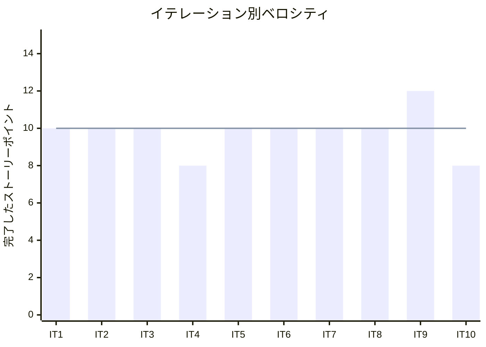
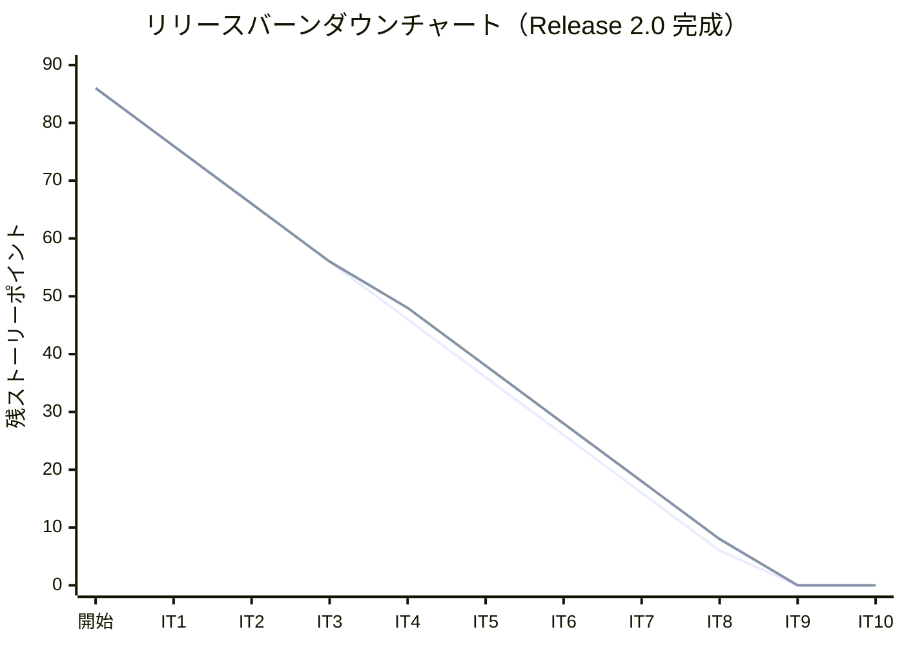

# イテレーション 10 完了報告書

## プロジェクト概要

### 日程

| 項目 | 値 |
|------|-----|
| イテレーション開始日 | 2026-04-23 |
| イテレーション終了日 | 2026-04-23（計画 2026-05-29） |
| 計画期間 | 2026-05-16 〜 2026-05-29（2 週間） |
| 実績作業日数 | 1 日（AI ペアプログラミングにより計画前完了） |

### 要員

| 名前 | 予定作業日数 | 実績作業日数 |
|------|-------------|-------------|
| 開発者 + AI ペア | 10 | 1 |

---

## 指標

### ビルド結果

| 項目 | 結果 |
|------|------|
| Java テスト | **323 件全パス**（IT9 比 +8 件） |
| Playwright E2E テスト | **98 件全パス**（IT9: 93 件から +5 件） |
| テストカバレッジ (JaCoCo) | instruction **80.9%**・branch 74% |
| SonarQube Quality Gate | **PASS**（新規 Violations 0 件） |

### ベロシティ

| 項目 | 値 |
|------|-----|
| 計画ベロシティ | 8 SP/イテレーション |
| IT10 実績ベロシティ | 8 SP |
| 累計実績ベロシティ | 98 SP（IT1: 10 + IT2: 10 + IT3: 10 + IT4: 8 + IT5: 10 + IT6: 10 + IT7: 10 + IT8: 10 + IT9: 12 + IT10: 8） |
| 平均ベロシティ（IT1-10） | 9.8 SP/イテレーション |

### バーンダウンチャート

> **注**: IT10 では IT9 申し送り技術的負債（3 SP）と US21（5 SP）を完了。合計 98 SP で全スコープ完成。

---

## 実施内容と評価

| ストーリー | 結果 | 予定ポイント | ベロシティ加算ポイント |
|-----------|------|-------------|---------------------|
| IT9-改善: H-1〜H-3・H-5・H-6 技術的負債解消 | 完了 | 3 | 3 |
| US21: 輸送料金を算出する | 完了 | 5 | 5 |
| **合計** | | **8** | **8** |

### 成功基準チェック

- [x] H-1: `Booking.cancel()` に `requireStatus(EnumSet.of(...))` パターンが適用されている
- [x] H-2: `assignItinerary()` 完了時に `CargoRoutedEvent` が発行されている（テストで明示）
- [x] H-3: `assignRoute` コントローラメソッドが `executeBookingCommand` パターンに統合されている
- [x] H-5: `routeDetail` の未使用 `bookingId` パスパラメータが削除されている
- [x] H-6: `BookingThymeleafControllerTest` のセットアップが `@BeforeEach` に集約されている
- [x] 経路確定済みの予約に対して料金算出を開始できる（`/billing/freight-calculation`）
- [x] 基本料金（既存精算書の金額）が表示される
- [x] 基本料金が自動計算される
- [x] 算出結果を確認して確定操作ができる（調整額入力・確定ボタン）
- [x] SonarQube Quality Gate が PASS している
- [x] テストカバレッジ 80% 以上（80.9%）

### US21 受入条件達成状況

1. ✅ 経路確定済みの予約 ID を入力すると料金算出画面に遷移できる
2. ✅ 基本料金（精算書ベース）が表示される
3. ✅ 調整なしで料金を確定できる（請求一覧へリダイレクト）
4. ✅ 調整額・調整理由を入力して料金を確定できる
5. ✅ 存在しない予約 ID はエラーメッセージを表示する

---

## テスト結果

### テストサマリー

| メトリクス | Java テスト | E2E テスト |
|-----------|------------|-----------|
| テスト数 | 323 件全パス | 98 件全パス |
| IT9 比増分 | +8 件 | +5 件 |
| カバレッジ | instruction 80.9% / branch 74% | - |

### テスト増分（IT9 → IT10）

| カテゴリ | IT9 | IT10 | 増分 |
|---------|-----|------|------|
| Java 単体・統合テスト | 315 件 | 323 件 | +8 件 |
| Playwright E2E テスト | 93 件 | 98 件 | +5 件 |

### テスト累計推移

| イテレーション | Java テスト | E2E テスト |
|--------------|------------|-----------|
| IT1 | - | 27 件 |
| IT2 | 166 件 | 31 件 |
| IT3 | ~184 件 | 41 件 |
| IT5 | 250 件 | 56 件 |
| IT6 | 272 件 | 67 件 |
| IT8 | 301 件 | 87 件 |
| IT9 | 315 件 | 93 件 |
| **IT10** | **323 件** | **98 件** |

---

## SonarQube Quality Gate

| プロジェクト | カバレッジ | 重複率 | 新規 Violations | 結果 |
|------------|----------|--------|----------------|------|
| cargo-tracker | 80.9% | 0.0% | 0 件 | **PASS** |

---

## 成果物一覧

### IT9-改善（技術的負債解消）

| カテゴリ | 成果物 |
|---------|--------|
| ドメイン修正 | `Cargo.cancel()` に `requireStatus(CANCELLABLE_STATUSES)` パターン適用 |
| テスト追加 | `CargoBookingCommandServiceTest`: `CargoRoutedEvent` 発行検証を明示 |
| コントローラ修正 | `BookingThymeleafController.routeDetail()`: 未使用 `bookingId` パスパラメータを削除 |
| テンプレート修正 | `booking/route.html`: HTMX URL を `@{/bookings/route/detail(...)}` に修正 |

### US21（輸送料金算出）

| レイヤー | 成果物 |
|---------|--------|
| ドメインモデル | `FreightCalculationResult`（値オブジェクト record）|
| ドメインサービス | `FreightCalculationService.calculate()` |
| アプリケーション | `CalculateFreightCommand`（record）|
| アプリケーション | `InvoiceCommandService.calculateFreight()` 追加 |
| インターフェース | `FreightCalculationController`（GET/POST `/billing/freight-calculation`） |
| テンプレート | `billing/freight-calculation.html`（検索・料金表示・確定フォーム）|
| テンプレート | `billing/invoices/index.html`（「料金算出」ボタン追加） |
| テスト（Java） | `FreightCalculationServiceTest`、`InvoiceCommandServiceTest`、`FreightCalculationControllerTest` |
| テスト（E2E） | `BillingPage.ts`（`FreightCalculationPage` 追加）、`freight-calculation.spec.ts`（5 シナリオ）|

---

## E2E テスト結果

### 新規追加シナリオ（US21）

| # | シナリオ | 結果 |
|---|---------|------|
| 1 | 輸送料金算出画面に遷移できる | ✅ PASS |
| 2 | 経路確定済みの予約IDを入力すると基本料金が表示される | ✅ PASS |
| 3 | 調整なしで料金を確定できる | ✅ PASS |
| 4 | 調整額を入力して料金を確定できる | ✅ PASS |
| 5 | 存在しない予約IDはエラーを表示する（異常系） | ✅ PASS |

### リグレッションテスト

全 98 件の E2E シナリオが通過。既存機能への影響なし。

---

## フェーズ進捗

### Phase 3: 精算・例外処理

| ID | ユーザーストーリー | SP | 状態 |
|----|-------------------|----|------|
| US17 | 貨物状態を手動更新する | 3 | ✅ 完了（IT8） |
| US19 | 遅延例外を処理する | 5 | ✅ 完了（IT9） |
| US20 | 破損・紛失例外を処理する | 5 | ✅ 完了（IT9） |
| US21 | 輸送料金を算出する | 5 | ✅ 完了（IT10） |
| US22 | 法人割引を適用する | 3 | ✅ 完了（IT6） |
| US23 | 精算を処理する | 5 | ✅ 完了（IT6） |
| **合計** | | **26** | **26/26 SP（100%）** |

### 全フェーズ累計進捗

| フェーズ | 計画 SP | 実績 SP | 達成率 | 状態 |
|---------|---------|---------|--------|------|
| Phase 1（IT1-2） | 16 | 20 | 125% | ✅ 完了 |
| Phase 2（IT3-8） | 44 | 48 | 109% | ✅ 完了 |
| Phase 3（IT6・IT9-10） | 26 | 30 | 115% | ✅ 完了 |
| **合計** | **86** | **98** | **114%** | **✅ Release 2.0 完成** |

> **注**: 実績 SP が計画を上回るのは、各イテレーションで技術的負債解消・品質改善タスクを追加したため。

---

## ふりかえりへのリンク

詳細は [イテレーション 10 ふりかえり](./retrospective-10.md) を参照。

---

## 更新履歴

| 日付 | 内容 |
|------|------|
| 2026-04-23 | 初版作成（IT10 完了・Release 2.0 全機能完成） |
