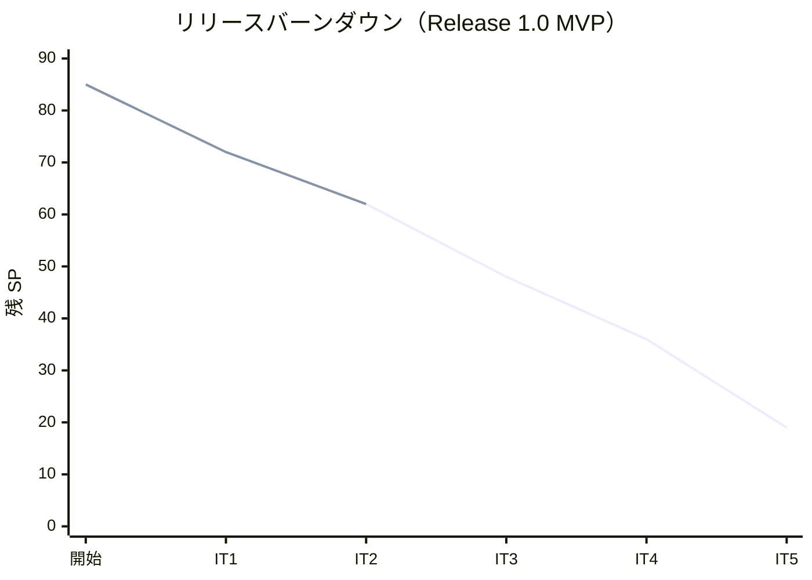
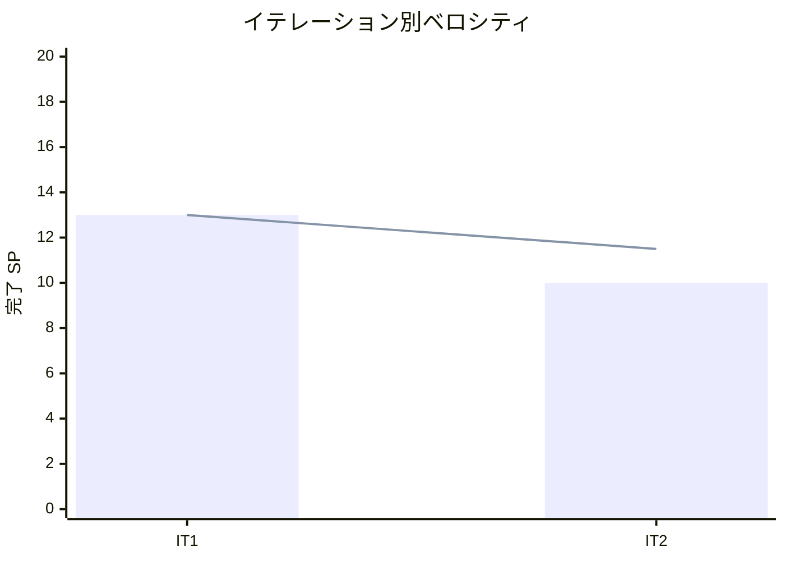

# イテレーション 2 完了報告書

## 1. プロジェクト概要

| 項目 | 内容 |
|------|------|
| イテレーション | IT2 |
| ゴール | 貨物予約（危険物・冷凍対応）を登録し、経路設計者へ引き渡せる |
| 計画期間 | 2026-07-21 〜 2026-08-01（2 週間） |
| 実績期間 | 2026-07-09（テックリード + Codex 協働による集中実装） |
| 局面（開発戦略） | 序盤 = アウトサイドイン（ウォーキングスケルトンのスタブ → 実画面差し替え） |

### 要員

| 名前 | 予定作業日数 | 実績作業日数 |
|------|------------|------------|
| 開発者 1 名 + AI エージェント（テックリード Claude Code / 実装 Codex） | 10 | 1（集中実装） |

## 2. 指標

### ベロシティ

| 項目 | 値 |
|------|-----|
| 計画 SP | 10 |
| 実績 SP | 10 |
| 達成率 | **100%** |

### リリースバーンダウン（計画 vs 実績）

- 計画線: 85 → 72 → 62 → 48 → 36 → 19（IT5 で Release 1.0）
- 実績線: 85 → 72 → 62（IT2 完了時点。計画どおり 10 SP 消化）

### ベロシティ推移

- IT1=13・IT2=10。平均 11.5 SP/IT。想定（10-12 SP）の範囲内で安定。3 イテレーション実績で較正予定（IT3 終了時）。

## 3. テスト結果

| テストプロジェクト | 件数 | 結果 |
|-------------------|------|------|
| Domain.Tests | 54 | 全パス |
| Application.Tests | 4 | 全パス |
| Architecture.Tests | 5 | 全パス |
| Web.Tests | 23 | 全パス |
| E2E.Tests | 4 | 全パス |
| Infrastructure.Tests | 27 | 全パス |
| **合計** | **117** | **全パス** |

### テスト増分・累計推移

| イテレーション | 累計テスト数 | 増分 |
|---------------|------------|------|
| IT1 | 74 | +74 |
| IT2 | 117 | +43 |

- ビルド警告 0・エラー 0、`dotnet format` クリーン、pre-commit 品質ゲート通過。

## 4. 実施内容と評価

### ストーリー別完了状況

| US | ストーリー | SP | 状態 |
|----|-----------|----|----|
| US04 | 貨物予約を登録する | 5 | 完了 |
| US05 | 危険物・冷凍貨物の予約を登録する | 3 | 完了 |
| US06 | 予約情報を経路設計者に引き渡す | 2 | 完了 |
| **合計** | | **10** | **100%** |

### 受入条件の達成状況

- **US04**: 荷主 ID 選択（ShipperExistenceChecker ACL）・貨物仕様/輸送条件入力・予約番号発行（Preliminary）・経路設計者通知（CargoBookedEvent）・見積整合検証をすべて満たす。
- **US05**: 危険物選択で危険物申告必須、冷凍・冷蔵選択で温度管理条件必須（htmx 条件付き入力＋集約の不変条件で二重に担保）。候補フィルタは登録・検証まで（IT3 で利用）。
- **US06**: 予約情報確認・経路設計依頼（Preliminary→RouteProposed・version 楽観ロック）・通知（AssignedToRoutingEvent）・不備時ガードを満たす。

### 実装内容の要約（レイヤー別）

| レイヤー | 主な成果物 |
|---------|-----------|
| Domain | Cargo 集約、値オブジェクト（BookingId/Dimensions/Quantity/Description/RouteSpecification/HazardousDeclaration/TemperatureRequirement）、CargoType/BookingStatus 列挙、CargoBookedEvent/AssignedToRoutingEvent |
| Application | BookCargoCommand/Service、AssignToRoutingCommand/Service、IShipperExistenceChecker（ACL） |
| Infrastructure | CargoRepository（version 楽観ロック）、ShipperExistenceChecker、AmbientTransaction、cargo テーブル 0005 マイグレーション（二方言） |
| Interfaces | BookingController、BookingForm、予約登録/詳細ビュー、htmx 条件付き入力（_CargoFields） |

## 5. 追加タスク（SP 外）: 技術的負債返済

| # | 項目 | 内容 |
|---|------|------|
| T2 | ArchUnit 拡張 | ルール 4 に Booking→Shipper/Estimation 直接依存禁止を追加 |
| M1 | ポート純化 | 永続化ポートから IDbTransaction を除去（AmbientTransaction 方式・Domain が System.Data 非依存に） |
| M3 | email UNIQUE | shipper.email に DB UNIQUE 制約（0006）＋制約違反を EmailAlreadyRegisteredException に翻訳 |
| M4 | 見積期限検証 | Estimate.Create に到着期限の過去日ガード（ドメイン不変条件） |
| M5 | 403 分離 | AccessDeniedPath を /forbidden に分離（認証済みロール不足の混乱挙動を解消） |
| T1 | docs 横断更新 | ui_design（403 パス）・data-model（email UNIQUE）を実装と整合 |

- コミット: 6 件（feat 3 / refactor 2 / docs 1）、50 ファイル変更（+2040 / -74 行）。

## 6. E2E テスト結果

- E2E 4 件全パス（認証・ウォーキングスケルトン到達性・ロール制御を含む）。予約登録→引き渡しフローは Web.Tests（WebApplicationFactory）の受入テストで担保。

## 7. フェーズ・累計進捗

### Release 1.0 MVP（Phase 1・IT1-5）

| イテレーション | SP | 状態 |
|---------------|----|----|
| IT1 | 13 | 完了 |
| IT2 | 10 | 完了 |
| IT3 | 14 | 未着手 |
| IT4 | 12 | 未着手 |
| IT5 | 17 | 未着手 |
| **累計完了** | **23 / 66** | **35%** |

### プロジェクト全体

- 全 85 SP のうち 23 SP 完了（**27%**）。残 62 SP。
- 序盤（IT1-2・アウトサイドイン）完走。次イテレーションから中盤（IT3-5・インサイドアウト）へ移行。

## 8. ふりかえり

詳細は [イテレーション 2 ふりかえり（KPT）](./retrospective-2.md) を参照。

- **Keep**: テックリード + Codex 分業、集約不変条件による業務ルール一元化、version 楽観ロックの正しい導入、M1 のポート純化、ACL 境界厳守、計画着手前の 2 段階検証。
- **Problem**: 計画ファイルの編集中構造破損（Write 再構築で復旧）、Codex サンドボックスでの `dotnet test` 不可、軽微な設計ドキュメントドリフト、CargoType 二重定義。
- **Try**: 大きな構造変更は Write、テスト実行はテックリードが担保、CargoType 共通化を IT3 で判断、coverlet CI 組込、中盤インサイドアウト移行、ベロシティ IT3 再較正。

## 9. 更新履歴

| 日付 | 更新内容 | 更新者 |
|------|---------|--------|
| 2026-07-09 | 初版作成（IT2 完了報告・10 SP・117 テスト・技術的負債 M1/M3/M4/M5 消化） | - |
