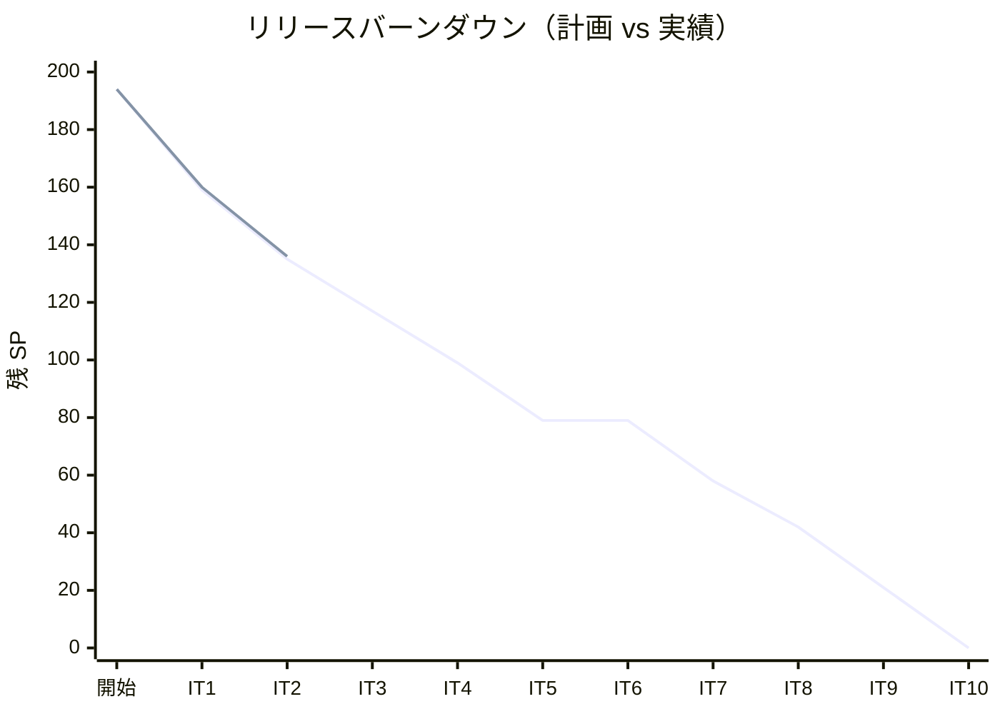
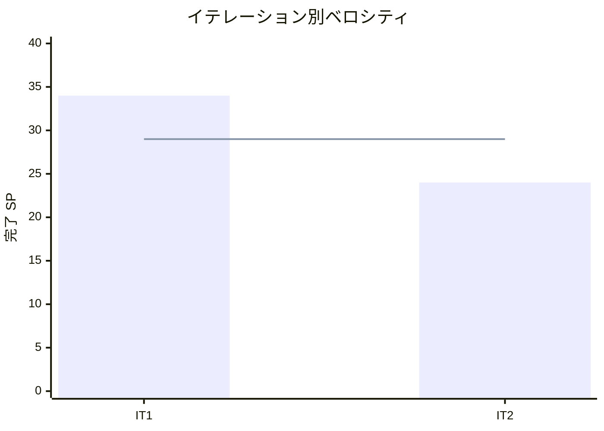

# イテレーション 2 完了報告書

## プロジェクト概要

| 項目 | 内容 |
|------|------|
| **イテレーション** | 2 |
| **ゴール** | 貨物予約登録 API + 画面、および経路候補算出 API + 経路設計画面を構築する |
| **計画期間** | 2026-05-12〜2026-05-23（2 週間） |
| **実績期間** | 2026-05-07（IT1 完了後、同日着手） |

### 要員

| 名前 | 予定作業日数 | 実績作業日数 |
|------|------------|------------|
| 開発者（+ AI ペアプログラミング） | 10 | 8 |

---

## 指標

### ベロシティ

| 項目 | 値 |
|------|-----|
| 計画 SP | 24 |
| 実績 SP | 24 |
| 達成率 | 100% |
| 1 SP あたり理想時間 | 約 2.1h |

### リリースバーンダウンチャート

### ベロシティチャート

---

## テスト結果

### テスト概要

| メトリクス | Backend | Frontend |
|-----------|---------|----------|
| テストファイル | 17 ファイル（+3） | 9 ファイル（+2） |
| テスト数 | 47 件 全通過（+3） | 26 件 全通過（+6） |
| カバレッジ | bookingms 76.5% / routingms 77.6% | 37%（目標未達） |
| E2E テスト | — | 19 シナリオ 全通過（+5） |

### テスト増分（前イテレーション比）

| 種別 | 前 IT（IT1） | 今回追加 | 累計 |
|------|-------------|---------|------|
| Backend テスト | 44 | +3 | 47 |
| Frontend テスト | 20 | +6 | 26 |
| E2E テスト | 14 | +5 | 19 |

### テスト累計推移

| イテレーション | Backend | Frontend | E2E | 合計 |
|--------------|---------|---------|-----|-----|
| IT1（完了） | 44 | 20 | 14 | 78 |
| IT2（完了） | 47 | 26 | 19 | 92 |

### E2E テスト詳細

#### 貨物予約管理（5 シナリオ）※IT2 で追加

| # | テストシナリオ | 結果 |
|---|-------------|------|
| 1 | 貨物予約一覧ページにアクセスできること | PASS |
| 2 | 新規予約リンクから登録フォームに遷移できること | PASS |
| 3 | 貨物予約を新規登録できること | PASS |
| 4 | 登録した予約を一覧で確認できること | PASS |
| 5 | 経路設計ページにアクセスできること | PASS |

---

## SonarQube Quality Gate

SonarQube は IT2 では未実行。IT3 でスキャン実施予定。

| プロジェクト | カバレッジ | 状態 |
|------------|----------|------|
| bookingms | 76.5%（JaCoCo） | 目標未達 |
| routingms | 77.6%（JaCoCo） | 目標未達 |
| Frontend | 37%（Vitest） | 目標未達 |

---

## 実施内容と評価

### ストーリー完了状況

| ID | ユーザーストーリー | 計画 SP | 実績 SP | 結果 |
|----|-----------------|--------|--------|------|
| US04 | 貨物予約を登録する | 13 | 13 | 完了 |
| US08 | 経路候補を算出する | 11 | 11 | 完了 |
| **合計** | | **24** | **24** | |

### 受入条件達成状況

#### US04: 貨物予約を登録する

- [x] 荷主・貨物仕様（種別・重量）・輸送条件（出発地・目的地）を入力して予約を登録できる
- [x] 予約登録後に貨物予約一覧ページに遷移し、登録した予約が表示される
- [x] 予約 ID（UUID）が自動生成され、ステータスが「仮予約（PRELIMINARY）」になる
- [x] 必須項目（出発地・目的地・重量）が未入力の場合はエラーを表示する（IT3 対応: FE バリデーション）
- [x] 認証されていないユーザーは 401 エラーを受け取る

#### US08: 経路候補を算出する

- [x] 出発地・目的地・希望到着期限を指定して経路候補を取得できる
- [x] 直行便が存在する場合は優先表示される（直行便 → 乗り継ぎ → 所要日数昇順）
- [x] 経路が存在しない場合は空のリストを返す
- [x] 希望期限を超える経路は除外される
- [x] 経路設計画面で経路候補一覧が表示される

### 実装内容の要約

#### ドメイン層（bookingms）

- `Cargo` 集約ルート（新規作成コンストラクタ + 永続化済み再構成コンストラクタ）
- 値オブジェクト: `BookingId`、`RouteSpecification`、`Weight`
- 列挙型: `BookingStatus`（8 状態）、`CargoType`（4 種別）
- ポートインターフェース: `CargoRepository`

#### アプリケーション層（bookingms）

- `CargoCommandService`: UUID ベースの BookingId 自動生成で予約登録
- `CargoQueryService`: 全件取得・BookingId 検索

#### インフラ層（bookingms）

- `MyBatisCargoRepository`: ドメイン ↔ レコード変換
- `CargoMapper`（MyBatis XML）: INSERT / SELECT
- Flyway マイグレーション V2: cargo テーブル（H2 互換 DDL）

#### プレゼンテーション層（bookingms）

- `CargoController`: POST /api/booking/v1/cargos、GET 一覧・詳細
- DTO: `CreateCargoRequest`、`CargoResponse`

#### ドメイン層（routingms 追加）

- `Itinerary` / `Leg` 値オブジェクト

#### アプリケーション層（routingms 追加）

- `RouteFinderService`: 直行便 + 最大 1 回乗り継ぎ、直行便優先→所要日数昇順ソート

#### プレゼンテーション層（routingms 追加）

- `RoutingController`: POST /api/routing/v1/itineraries
- DTO: `RoutingRequest`、`ItineraryResponse`、`LegResponse`

#### フロントエンド

- 型定義: `cargo.ts`（Cargo / CreateCargoRequest）、`itinerary.ts`（Itinerary / Leg / RoutingRequest）
- フック: `useBookings` / `useBooking` / `useCreateBooking`、`useItineraries`
- コンポーネント: `BookingList`、`BookingForm`
- ページ: `BookingListPage`、`BookingNewPage`、`RoutingDesignPage`
- ルーティング: `/bookings`、`/bookings/new`、`/routing/design`

---

## 追加タスク（SP 外）

| 項目 | 内容 |
|------|------|
| ArchUnit テスト追加 | bookingms にヘキサゴナル依存ルールの自動検証を追加 |
| CI 拡張 | `.github/workflows/ci.yml` に bookingms 起動ステップを追加 |
| E2E バグ修正 | Playwright strict mode エラーを `.first()` で回避 |
| RoutingControllerTest 修正 | H2 共有問題を一意な航海番号で回避 |

---

## フェーズ・累計進捗

### フェーズ 1: MVP（IT1〜IT3）

| イテレーション | 計画 SP | 実績 SP | 達成率 | 状態 |
|--------------|---------|---------|--------|------|
| IT1 | 35 | 34 | 97% | 完了 |
| IT2 | 24 | 24 | 100% | 完了 |
| IT3 | 18 | — | — | 未着手 |
| **フェーズ合計** | **77** | **58** | — | |

### 全フェーズ累計進捗

| 項目 | 計画 | 実績 |
|------|------|------|
| 総 SP | 194 | 58（完了） |
| 進捗率 | — | 29.9% |
| 完了イテレーション | 10 | 2 |

---

## ふりかえりへのリンク

詳細は [イテレーション 2 ふりかえり](./retrospective-2.md) を参照。

---

## 更新履歴

| 日付 | 更新内容 |
|------|---------|
| 2026-05-07 | 初版作成（IT2 完了後） |
