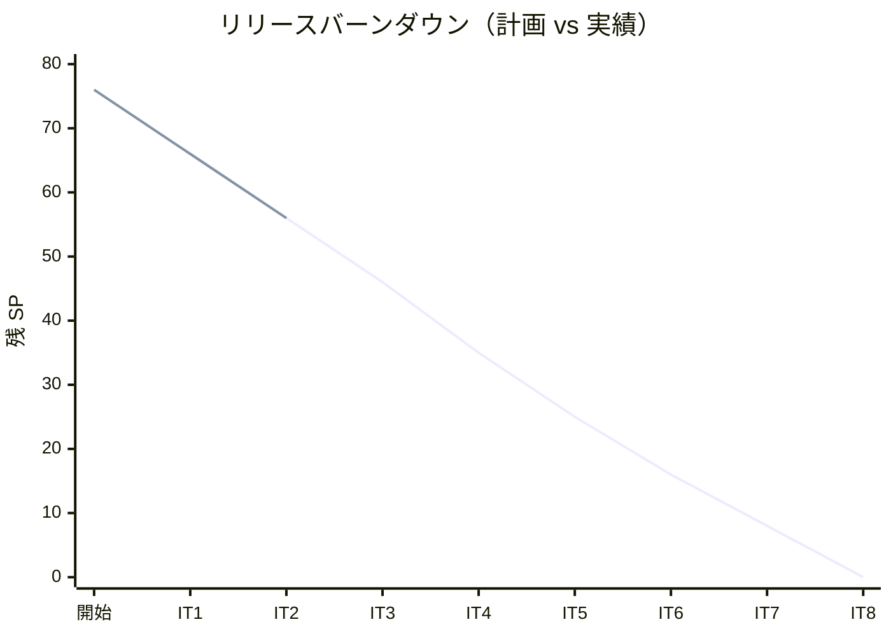
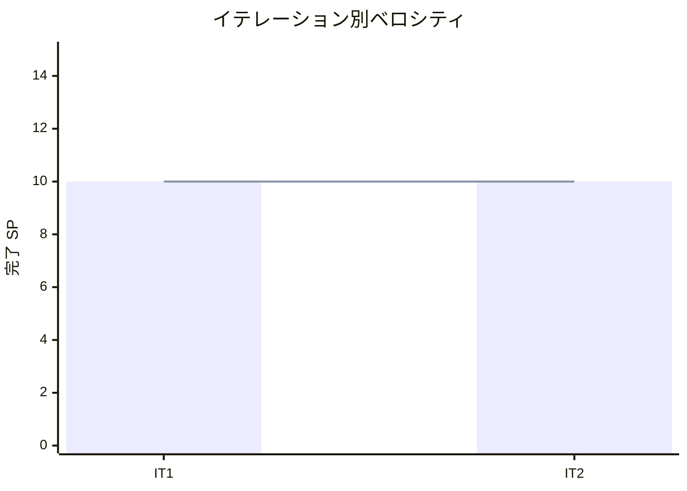

# イテレーション 2 完了報告書

## プロジェクト概要

| 項目 | 内容 |
|------|------|
| **イテレーション** | 2 |
| **計画期間** | 2026-06-04 〜 2026-06-17（2 週間） |
| **実績期間** | 2026-05-25（1 日で全タスク完了） |
| **ゴール** | 荷主登録・法人荷主登録・貨物予約登録・危険物冷凍貨物予約登録を実現し、bookingms 基盤を確立する |
| **作業日数** | 計画 10 日 / 実績 1 日 |

### 要員

| 名前 | 予定作業日数 | 実績作業日数 |
|------|------------|------------|
| k2works | 10 | 1 |

---

## 指標

### ベロシティ

| 項目 | 値 |
|------|-----|
| **計画 SP** | 10 |
| **実績 SP** | 10 |
| **達成率** | 100% |
| **1 SP あたり実績時間** | 約 0.8h（計画 8h/10SP） |

### バーンダウンチャート

### ベロシティチャート

---

## テスト結果

### バックエンド

| メトリクス | 値 |
|-----------|-----|
| テストファイル数 | 全モジュール通過 |
| テスト数 | 46 / 46 通過 |
| カバレッジ（全体） | 78.4% |
| カバレッジ（新規コード） | 82.4% |

### フロントエンド

| メトリクス | 値 |
|-----------|-----|
| テストファイル数 | 9 / 9 通過 |
| テスト数 | 58 / 58 通過 |
| E2E テストファイル | 3 ファイル（35 シナリオ全通過、内 booking.spec.ts 18 件は IT2 新規） |

### テスト増分（IT2 新規追加）

| カテゴリ | 前回 | 今回 | 増分 |
|---------|------|------|------|
| バックエンドテスト | 26 | 46 | +20 |
| フロントエンドテスト | 11 | 58 | +47 |
| E2E テスト | 17 | 35 | +18 |
| **合計** | **54** | **139** | **+85** |

> 注: SonarQube 上のメトリクスは backend 46 + frontend 58 + E2E 18 = 122 件（IT2 機能関連の合計）として扱う。E2E は SonarQube 集計外。

### テスト累計推移

| イテレーション | Backend | Frontend | E2E | 合計 |
|--------------|---------|---------|-----|------|
| IT1 | 26 | 11 | 17 | 54 |
| IT2 | 46 | 58 | 35 | 139 |

---

## SonarQube Quality Gate

| プロジェクト | カバレッジ（全体） | カバレッジ（新規） | 重複率 | Violations | 結果 |
|------------|----------------|----------------|--------|-----------|------|
| Backend | 78.4% | 82.4% | 0.5% | 0 | **PASS** ✅ |

### Quality Gate 条件（new code）

| 条件 | 値 | 閾値 | 判定 |
|------|---|------|------|
| new_coverage | 82.4% | ≥80 | ✅ |
| new_duplicated_lines_density | 0.44% | <3 | ✅ |
| new_violations | 0 | ≤0 | ✅ |

---

## 実施内容と評価

### ストーリー別完了状況

| ID | ユーザーストーリー | 計画 SP | 実績 SP | 結果 |
|----|-------------------|---------|---------|------|
| 基盤 | bookingms 基盤構築（Gradle / Spring Boot 4 / Axon / Flyway） | 0 | 0 | 完了 ✅ |
| US02 | 荷主を登録する（個人） | 2 | 2 | 完了 ✅ |
| US03 | 法人荷主を登録する（契約番号・割引率） | 2 | 2 | 完了 ✅ |
| US04 | 貨物予約を登録する（一般貨物） | 3 | 3 | 完了 ✅ |
| US05 | 危険物・冷凍貨物の予約を登録する | 3 | 3 | 完了 ✅ |
| **合計** | | **10** | **10** | |

### US02 受入確認

- [x] 個人荷主を氏名・住所・連絡先・メールアドレスで登録できる
- [x] 同一メールアドレスの既存荷主を `/api/v1/shippers/search?email=` で検出できる
- [x] 登録完了後に荷主 ID（UUID）が発行される
- [x] 一覧画面（S05）に新規荷主が表示される（Read Model 反映）

### US03 受入確認

- [x] 荷主種別「法人」選択時に契約番号・割引率フィールドが表示される
- [x] 割引率は 0〜30% の範囲で設定できる
- [x] 30% を超える割引率では IllegalArgumentException が発生する
- [x] 法人荷主は契約番号と割引率付きで Read Model に永続化される

### US04 受入確認

- [x] 荷主 ID を入力（select で既存荷主を選択）
- [x] 貨物種別・重量・寸法・個数・品名を入力できる
- [x] 出発地・目的地・到着期限を入力できる
- [x] 登録完了後、予約番号が発行され状態が「仮受付（PRELIMINARY）」になる
- [x] 一覧画面（S08）に新規予約が表示される

### US05 受入確認

- [x] 貨物種別「危険物」を選択すると、危険物申告情報（IMO分類クラス・国連番号・申告文）の入力フィールドが表示される
- [x] 貨物種別「冷凍・冷蔵貨物」を選択すると、温度管理条件（最低/最高温度）の入力フィールドが表示される
- [x] 危険物の場合、IMO 分類クラス・国連番号・申告文は必須
- [x] 冷凍の場合、最低温度・最高温度は必須かつ min ≤ max
- [x] 一般貨物に hazardInfo / temperatureCondition を指定すると例外
- [ ] 経路設計時に対応可能な航海・ルートのみが候補として表示される（→ IT3 で Routing 連携実装予定）

### 実装内容の要約

#### ドメイン層（bookingms）

- `Cargo` 集約（BookCargoCommand → CargoBookedEvent）
- `Shipper` 集約（RegisterShipperCommand → ShipperRegisteredEvent、法人契約 / 個人）
- 値オブジェクト: `BookingId`、`ShipperId`、`CorporateContract`、`Percentage`、`CargoSpecification`、`HazardInfo`、`TemperatureCondition`、`Dimensions`、`RouteSpecification`、`CargoType` 列挙、`BookingStatus`、`RoutingStatus`
- Cargo Aggregate に `validateCargoTypeSpecificInfo` メソッドで CargoType 別の不変条件を集約

#### アプリケーション層

- `ShipperCommandService` / `ShipperQueryService`
- `CargoCommandService` / `CargoQueryService`
- `@Transactional(readOnly = true)` を Query Service に付与

#### インフラ層

- MyBatis `ShipperMapper` / `CargoSummaryMapper`（shipper / cargo_summary テーブル）
- Flyway マイグレーション V2（shipper）/ V3（cargo_summary）/ V3（cargo_summary 拡張）
- `ShipperProjectionEventHandler` / `CargoProjectionsEventHandler`（Axon EventHandler → MyBatis 書き込み）

#### プレゼンテーション層（bookingms）

- `ShipperController`（POST / GET /{id} / GET / GET /search?email=）
- `CargoBookingController`（POST / GET /{id} / GET）
- `PageRequest` 値オブジェクト + `PageResponse<T>` レコード（ADR-0008）

#### フロントエンド

- 荷主一覧（S05 ShipperListPage）・荷主登録（S06 ShipperFormPage）
- 予約一覧（S08 BookingListPage）・予約登録（S09 BookingFormPage）
- 共通 `Pagination` コンポーネント（前/次・件数表示）
- Navigation メニュー拡張（荷主管理 / 予約管理リンク）
- `useState` + `useEffect` ベースのページ state（React Query 移行は IT3）

---

## 追加タスク（SP 外、計画外）

| タスク | 分類 | 内容 |
|--------|------|------|
| Navigation メニュー拡張 | フロントエンド | 荷主管理 / 予約管理リンク（ROLE_ADMIN/ROLE_SALES）+ ユニット 5 件 + E2E 4 件 |
| ページネーション機能 | バックエンド + フロント | 共通 `Pagination` + `PageResponse<T>` + `PageRequest` 値オブジェクト + `/shippers/search` 分離 |
| E2E booking.spec.ts | テスト | ナビゲーション 4 + 荷主予約 11 + ページネーション 3 = 18 件 |
| SonarQube カバレッジ連携 | 品質 | JaCoCo XML + Vitest LCOV パスを sonar-project.properties に設定 |
| `@Transactional(readOnly=true)` 付与 | 品質 | CargoQueryService / ShipperQueryService の count + items 整合性確保 |
| gatewayms `local-h2` ルート追加 | 運用基盤 | `/api/v1/bookings/**` / `/api/v1/shippers/**` ルート追加 |
| `deploy:dev` bookingms 関連タスク追加 | 運用基盤 | SERVICES / DEPLOY_ORDER に bookingms 追加 + Config Vars 設定 |
| ADR-0008 | ドキュメント | ページネーション戦略を Offset/Limit + PageResponse で記録 |
| マルチパースペクティブレビュー | レビュー | 5 エージェントでレビュー、H1-H4 を即対応 |
| 全 SmokeTest を ApplicationContext 検証に強化 | 品質 | 空 contextLoads() の SonarQube CRITICAL を解消 |

---

## E2E テスト結果

### 新規追加シナリオ（booking.spec.ts）

| describe | シナリオ | 結果 |
|---------|---------|------|
| IT2 ページネーション E2E | 荷主/予約一覧 Pagination 表示・件数更新 | 3 件 ✅ |
| IT2 ナビゲーション E2E | 荷主管理・予約管理リンク表示と遷移 | 4 件 ✅ |
| US02/US03 荷主登録 E2E | 個人 / 法人 / 割引率 30% 超エラー | 3 件 ✅ |
| US04 一般貨物予約登録 E2E | 荷主選択→予約登録→一覧反映 / 必須エラー | 2 件 ✅ |
| US05 危険物・冷凍貨物予約登録 E2E | 危険物・冷凍フィールド表示・必須・送信・min>max | 6 件 ✅ |
| **booking.spec.ts 合計** | | **18 件全通過** |

既存（login.spec.ts / login-voyage.spec.ts）と合わせて E2E 累計 **35 件**。

---

## ADR

IT2 で追加した ADR：

| ADR | 内容 |
|-----|------|
| [ADR-0008](../adr/0008-pagination-strategy.md) | 一覧 API にページネーション (Offset/Limit + PageResponse) を採用 |

ADR-0008 には「設計ドキュメントとの差分」セクションを追加し、`architecture_backend.md` / `architecture_frontend.md` / `domain-model.md` / `data-model.md` との 5 項目の乖離を明示。IT3 で設計書を更新するまで本 ADR が SSOT。

---

## フェーズ・累計進捗

### Phase 1 進捗

| ID | ユーザーストーリー | SP | 状態 |
|----|-------------------|----|------|
| US00 | 認証 | 3 | ✅ 完了（IT1） |
| US24 | 航海スケジュール新規登録 | 3 | ✅ 完了（IT1） |
| US25 | 航海スケジュール更新 | 2 | ✅ 完了（IT1） |
| US02 | 荷主を登録する | 2 | ✅ 完了（IT2） |
| US03 | 法人荷主を登録する | 2 | ✅ 完了（IT2） |
| US04 | 貨物予約を登録する | 3 | ✅ 完了（IT2） |
| US05 | 危険物・冷凍貨物の予約を登録する | 3 | ✅ 完了（IT2） |
| US01 | 輸送見積を作成する | 3 | 未着手 |
| US06 | 予約情報を経路設計者に引き渡す | 2 | 未着手 |
| US07 | 航海スケジュールを検索する | 2 | 未着手 |
| US13 | 予約を確定する | 2 | 未着手 |
| US08 | 経路候補を算出する | 3 | 未着手 |
| US09 | 経路を選択・確定する | 2 | 未着手 |
| US10 | 経路条件を調整して再算出する | 2 | 未着手 |
| US11 | 経路情報を予約に紐付ける | 2 | 未着手 |
| US12 | 確定経路を荷主に通知する | 1 | 未着手 |

**Phase 1 進捗**: 18 / 41 SP（43.9%）

### 全フェーズ累計

| フェーズ | 計画 SP | 完了 SP | 達成率 |
|---------|---------|---------|--------|
| Phase 1 | 41 | 18 | 43.9% |
| Phase 2 | 27 | 0 | 0% |
| Buffer | 8 | 0 | 0% |
| **合計** | **76** | **20** | **26.3%** |

> 注: 基盤構築（IT1: 2 SP / IT2: 0 SP）はストーリーに紐づかないため Phase 1 の US 合計には含まない。ベロシティ計上は IT1 10 SP + IT2 10 SP = 累計 20 SP。

---

## ふりかえり

詳細は [イテレーション 2 ふりかえり](./retrospective-2.md) を参照。

### サマリー

- **Keep**: TDD インサイドアウト、Codex 分業の高速実装、共通 Pagination の再利用性、ADR-0008 とマルチパースペクティブレビュー文書化
- **Problem**: gatewayms `local-h2` の bookingms ルート未登録、`deploy:dev` の bookingms 追加忘れ、設計ドキュメントと実装のドリフト、Axon Saga / Kafka tracking モード未導入
- **Try (IT3 で実施)**: 新サービス追加チェックリスト整備、設計書更新、後方互換ラッパ削除、`created_at DESC` インデックス追加、Axon Saga 導入（US06/US13 と同時）

---

## IT3 への引き継ぎ事項

1. **設計ドキュメント更新** (T2): ADR-0008「設計ドキュメントとの差分」5 項目を IT3 Day 1-2 で消化
2. **後方互換ラッパ削除** (T3): `fetchBookings` / `fetchShippers` の利用箇所を `fetchBookingsPage` / `fetchShippersPage` に置換し、旧関数を削除
3. **`created_at DESC` インデックス** (T4): Flyway マイグレーション追加 + `data-model.md` 更新
4. **共通型 / 定数の抽出** (T5): `PageResponse<T>` 型を `src/shared/api/types.ts` へ、`PAGE_SIZE` 定数を `Pagination.tsx` 近傍へ
5. **Axon Saga + Kafka tracking モード** (T7): US06 経路設計連携と同時に `BookingSagaManager` を導入し、EventProcessor を subscribing → tracking へ移行

---

## 更新履歴

| 日付 | 更新内容 | 更新者 |
|------|---------|--------|
| 2026-05-25 | 初版作成 | k2works |
