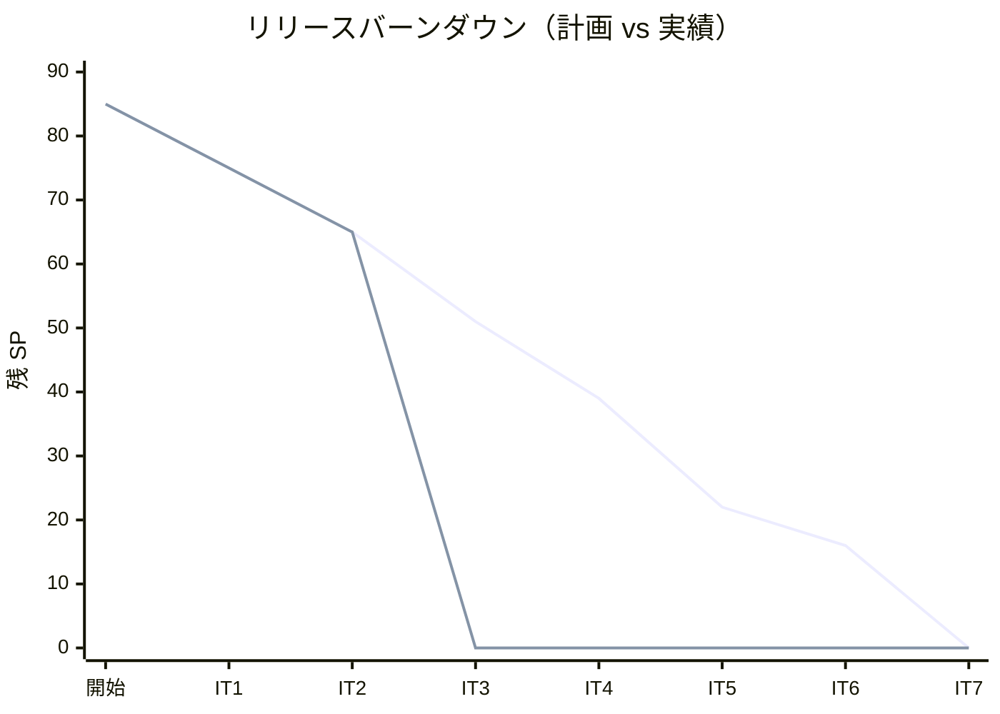
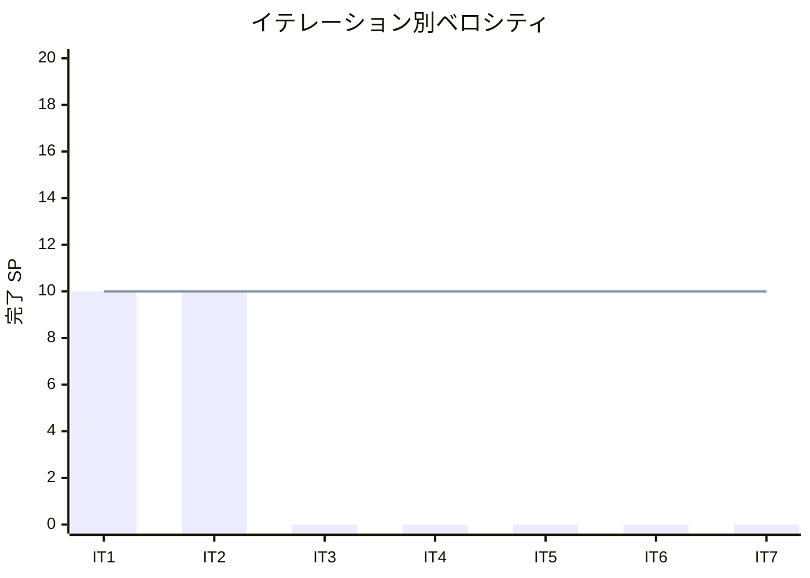

# イテレーション 2 完了報告書

## プロジェクト概要

国際貨物輸送管理システム（Cargo Tracker F# 版）のイテレーション 2 完了報告。
Booking Context（貨物予約）を縦貫通し、危険物・冷凍対応の予約登録から経路設計者への引き渡しまでを実現した。

## 日程

- イテレーション開始日: 2026-07-28（計画）
- イテレーション終了日: 2026-08-08（計画）
- 作業日数: 10 日（2 週間）

## 要員

| 名前 | 予定作業日数 | 実績作業日数 |
|------|-------------|-------------|
| 開発担当 + AI エージェント | 10 | 10 |

## 指標

### ビルド・テスト結果

| 項目 | 結果 |
|------|------|
| ユニットテスト（CargoTracker.Tests） | 60 件緑 |
| 統合テスト（CargoTracker.IntegrationTests） | 65 件緑 |
| アーキテクチャテスト（CargoTracker.ArchTests） | 8 件緑 |
| **合計** | **133 件緑・失敗 0** |
| ビルド警告 | 0（`-warnaserror`） |
| Fantomas フォーマット | クリーン |
| カバレッジ（全体 / ドメイン層） | 91.9% / 85.7%（閾値 80% / 85% クリア） |

### イテレーションバーンダウン（リリース）

### ベロシティ

## 実施内容と評価

| ストーリー | 結果 | 予定ポイント | ベロシティ加算ポイント |
|-----------|------|-------------|----------------------|
| US04 貨物予約を登録する | 完了 | 5 | 5 |
| US05 危険物・冷凍貨物の予約を登録する | 完了 | 3 | 3 |
| US06 予約情報を経路設計者に引き渡す | 完了 | 2 | 2 |
| **合計** | | **10** | **10** |

### 主な成果物

| 種別 | 成果物 |
|------|--------|
| ドメイン | Cargo 集約・BookingState DU（Preliminary/RoutingRequested/Cancelled）・CargoType DU（危険物/冷凍）・Weight・値オブジェクト群 |
| アプリケーション | BookCargo.book（荷主存在確認・危険物/冷凍検証）・submitForRouting（経路設計依頼）・3 ACL ポート |
| インフラ | cargo テーブル（マイグレーション 0004）・CargoRepository（Save/Update/FindById）・ShipperExistenceAdapter・shipper_uuid（0005） |
| Web | 貨物予約一覧 `/bookings`・登録 `/bookings/new`・詳細 `/bookings/{id}`・経路設計依頼 |
| ADR | ADR-0007（経路設計中状態は BookingState DU 拡張）・ADR-0008（荷主横断参照は ShipperId 永続化） |
| 品質基盤 | カバレッジゲート（coverage-gate.cjs）・Backend CI ワークフロー |

### 繰り越し・保留

| 項目 | 状態 | 理由 |
|------|------|------|
| 見積整合性チェック（US04 AC6） | 保留 | 任意項目。見積→予約の引き継ぎ導線実装時に ACL とあわせて実装 |
| post-commit イベント Web 結線（3.2） | 保留 | 消費者（Routing Context）が IT3。通知は RoutingRequestNotifier で充足 |
| Playwright E2E | 未実施 | ブラウザ環境未整備（IT1 からの継続繰り越し） |

### イテレーションレビュー

| アクションアイテム | 担当 |
|-------------------|------|
| IT2 確定の設計判断（RoutingRequested・shipper_uuid・Weight・cargo.shipper_id=Guid）を domain-model / data-model 本体へ反映 | 開発担当 |
| IT3 で post-commit の `RoutingRequested` 消費を結線しイベント基盤を実利用 | 開発担当 |
| 見積整合性チェックを見積→予約導線とあわせて実装 | 開発担当 |
| 中盤（インサイドアウト）へ局面移行し、Routing ドメインを FsCheck 先行で作り込む | 開発担当 |

## 総括

計画 10 SP を 100% 達成。IT1 に続き 2 イテレーション連続で計画どおり消化し、ベロシティは 10 SP/IT で安定。
Booking Context の縦貫通に加え、IT1 ふりかえり Try（カバレッジ CI ゲート・トランザクション原子性・Web スライス横展開）を全消化した。
設計判断は ADR-0007/0008 として記録済みで、次イテレーションでの設計ドキュメント本体反映を Try に設定した。
IT2 完了をもって序盤（アウトサイドイン）局面を終え、IT3 から中盤（インサイドアウト・Routing/Tracking/Handling）へ移行する。

---

## 関連ドキュメント

- [イテレーション 2 計画](./iteration_plan-2.md)
- [イテレーション 2 ふりかえり](./retrospective-2.md)
- [リリース計画](./release_plan.md)
