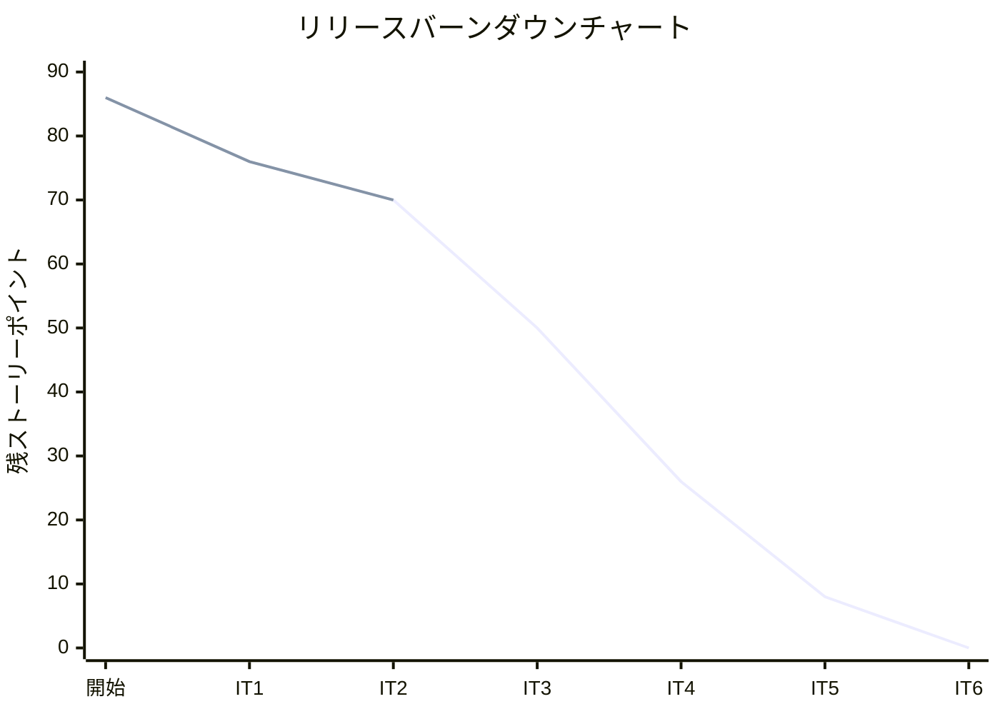
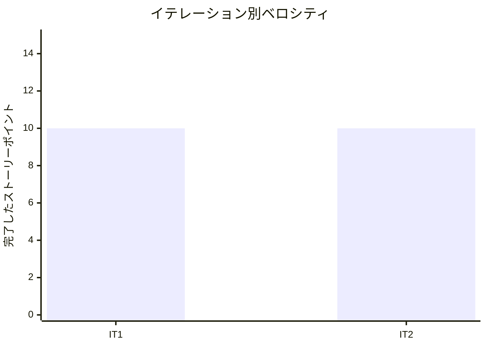

# イテレーション 2 完了報告書

## プロジェクト概要

### 日程

| 項目 | 値 |
|------|-----|
| イテレーション開始日 | 2026-04-04 |
| イテレーション終了日 | 2026-04-06 |
| 計画期間 | 2026-04-21 〜 2026-05-02（2 週間） |
| 実績作業日数 | 3 日（AI ペアプログラミングにより大幅短縮） |

### 要員

| 名前 | 予定作業日数 | 実績作業日数 |
|------|-------------|-------------|
| 開発者 + AI ペア | 10 | 3 |

---

## 指標

### ビルド結果

| 項目 | 結果 |
|------|------|
| Java テスト | 166 件全パス (failures=0, errors=0) |
| Playwright E2E テスト | 31 件全パス |
| 命令カバレッジ (JaCoCo) | 93% |
| ブランチカバレッジ (JaCoCo) | 81% |
| SonarQube Quality Gate | 未実行 |

### イテレーションバーンダウン

### ベロシティ

| 項目 | 値 |
|------|-----|
| 計画ベロシティ | 10-13 SP/イテレーション |
| IT2 実績ベロシティ | 10 SP |
| 累計実績ベロシティ | 20 SP（IT1: 10 + IT2: 10） |
| 1 SP あたり実績 | 約 4.0h |

---

## 実施内容と評価

| ストーリー | 結果 | 予定ポイント | ベロシティ加算ポイント |
|-----------|------|-------------|---------------------|
| IT1-改善: IT1 品質改善・リファクタリング | 完了 | 4 | 4 |
| US05: 危険物・冷凍貨物の予約を登録する | 完了 | 3 | 3 |
| US13: 予約を確定する | 完了 | 3 | 3 |
| **合計** | | **10** | **10** |

### 成果物一覧

| カテゴリ | 成果物 | 件数 |
|---------|--------|------|
| ドメインモデル（IT1 改善） | `ShipperId` を `shared.domain.model` に移動 + ACL 導入 | 1 クラス移動 |
| ドメインモデル（IT1 改善） | `DiscountRate` 上限 30% 修正、`Address` フィールド追加 | 2 値オブジェクト |
| ドメインモデル（US05） | `HazardousInfo` 値オブジェクト、`TemperatureRequirement` 値オブジェクト | 2 クラス |
| ドメインモデル（US05） | `CargoType` 列挙型（GENERAL / HAZARDOUS / REFRIGERATED） | 1 クラス |
| ドメインモデル（US13） | `Cargo` 集約に State パターン導入（`confirmBooking` / `cancelBooking`） | 1 クラス |
| ドメインモデル（US13） | `BookingStatus` 遷移ロジック（PRELIMINARY→CONFIRMED / CANCELLED） | 1 クラス |
| アプリケーション層 | `CargoBookingCommandService`（confirm/cancel）、`BookingThymeleafController` | 2 クラス |
| インフラ層 | MyBatis マッパー更新（hazardous_info / temperature_requirement / booking_status） | 3 ファイル |
| 画面（IT1 改善） | ログイン日本語化、ハンバーガーメニュー、required/aria-describedby、ステータス色分け | 5 テンプレート |
| 画面（US05） | 予約登録フォーム（貨物種別動的切替、危険物/冷凍フォーム） | 1 テンプレート |
| 画面（US13） | 予約詳細画面（確定・キャンセルボタン・モーダル） | 1 テンプレート |
| テスト | Java テスト（追加 106 件、IT2 完了時 166 件） | 166 件 |
| テスト | Playwright E2E テスト（追加 4 件、IT2 完了時 31 件） | 31 件 |
| DB マイグレーション | V5: cargo テーブル拡張（hazardous_class, un_number, min/max_temperature 等） | 1 ファイル |
| リファクタリング | `Shipper.individual()` / `corporateBase()` / `asCorporate()` ファクトリメソッド | 3 メソッド |
| リファクタリング | `RouteSpecification.fromUnLocodes()` ファクトリメソッド | 1 メソッド |

---

## レビュー結果サマリー

### コードレビュー（`developing-review`）

IT2 完了後のコードレビューで以下が指摘され、対応済み：

| 重要度 | 件数 | 主な指摘・対応 |
|--------|------|---------------|
| 高 | 対応済み | State パターンによるステータス遷移の集約内閉じ込め |
| 中 | 対応済み | ファクトリメソッドによる生成意図の明確化 |

### UI/UX レビュー（`developing-uiux-review`）

予約管理画面の UI/UX レビューを実施：

| 重要度 | 件数 | 主な指摘・対応 |
|--------|------|---------------|
| 高 | 対応済み | 重量単位・温度表示の改善、予約番号短縮表示 |
| 中 | 対応済み | モーダルボタン統一、ステータスバッジ色分け |

---

## IT1 申し送り事項の消化状況

| # | 内容 | 状態 |
|---|------|------|
| 1 | `ShipperId` を shared に移動 + ACL 導入 | 完了 |
| 2 | `DiscountRate` 上限を 30% に修正 | 完了 |
| 3 | 住所フィールドの追加 | 完了 |
| 4 | ログイン画面の日本語化 | 完了 |
| 5 | ナビバーのハンバーガーメニュー追加 | 完了 |
| 6 | フォームの required 属性 + aria-describedby | 完了 |
| 7 | ステータスバッジの色分け | 完了 |
| 8 | 状態・種別の日本語化 | 完了 |
| 9 | 例外クラス化 | 完了 |
| 10 | E2E テスト日付の相対化 | 完了 |

---

## イテレーションレビュー

### 達成したこと

- IT1 品質改善（ACL 導入・値オブジェクト修正・UI 日本語化・アクセシビリティ改善）を完全に消化した
- 危険物・冷凍貨物の特殊情報を含む予約登録が動作する（US05 完了）
- 予約確定・キャンセル操作とステータス遷移が正しく動作する（US13 完了）
- ブランチカバレッジを 65% → 81% に改善し、目標 80% を超えた
- Playwright E2E テストを 27 件 → 31 件に拡充した
- Phase 1（予約・荷主管理基盤 16 SP）が完全に完了した

### 達成できなかったこと

- SonarQube Quality Gate の確認（IT3 で対応予定）
- ドメインモデル・データモデル・UI 設計ドキュメントの完全同期（IT3 開始前に対応予定）

### アクションアイテム（IT3 へ引き継ぎ）

| # | アクションアイテム | 優先度 |
|---|-------------------|--------|
| 1 | SonarQube スキャン実行・Quality Gate 確認 | 高 |
| 2 | ドメインモデル・データモデル・UI 設計ドキュメントの同期 | 高 |
| 3 | IT3 コンテキスト（Routing, Scheduling）の ACL 設計先行検討 | 高 |
| 4 | E2E テスト用 H2 DB リセット機構の整備 | 中 |
| 5 | `MyBatisShipperRepository.toShipper()` フォールバックコードの整理 | 中 |
| 6 | テスト用ヘルパーメソッドの `TestFixtures` クラスへの集約 | 中 |

---

## 関連ドキュメント

- [イテレーション 2 計画](./iteration_plan-2.md)
- [イテレーション 2 ふりかえり](./retrospective-2.md)
- [リリース計画](./release_plan.md)
- [IT1 完了報告書](./iteration_report-1.md)
