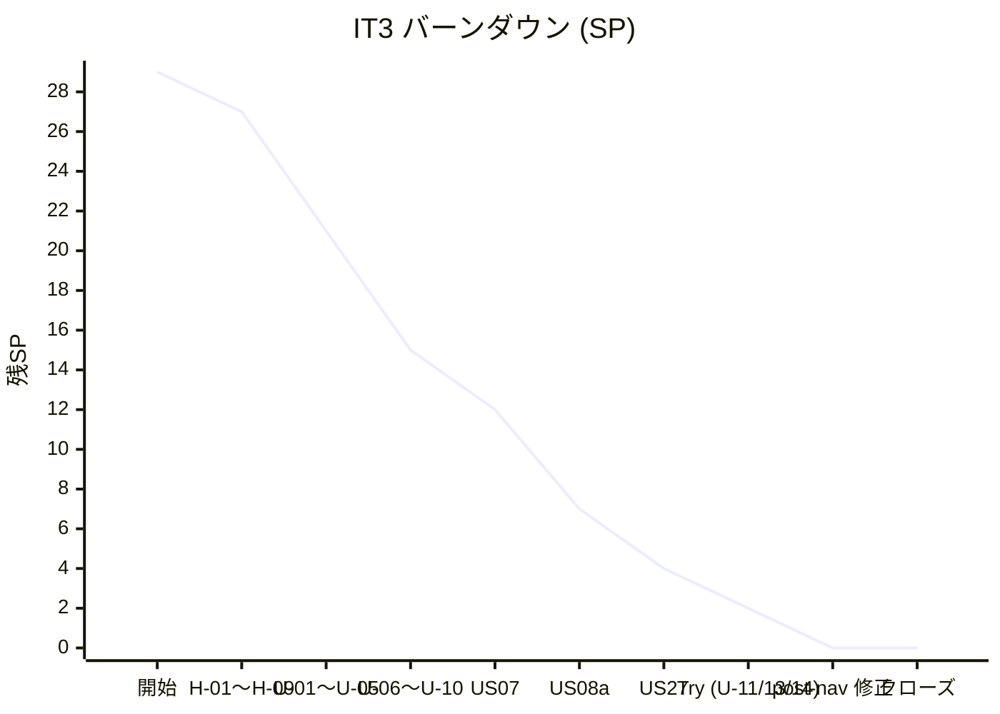

# IT3 完了報告書

## プロジェクト概要

Cargo Tracker Haskell 版の IT3。Release 0.1 Internal Alpha 仕上げと並行して、IT2 マルチパースペクティブレビュー高優先 5 件 + IT2 繰越 10 件 + 本体 3 ストーリー (US07 航海検索 / US08a 経路候補 / US27 通関紐付け) + 横断ストレッチ 4 件をクロスレイヤ実装した。Cross-BC 参照に `ShipperRef` VO を導入して arch-check Rule 4 ALLOWLIST を 0 件化、HPC ゲートを 70% へ引き上げ、ADR を 3 件 (0004 ShipperRef / 0005 BC エラー分離 / 0006 ページネーション戦略) 起票。さらに完了直後の post-nav レビューで指摘された UI/規約 3 件 (情報漏洩 / 識別子露出 / ADR 自己矛盾) を即時修正した。

## 日程

- イテレーション開始日: 2026-06-29
- イテレーション終了日: 2026-06-29
- 作業日数: 1 日 (Ralph Loop 51 反復 + クロージング + ポストレビュー対応)
- 計画期間: 2026-08-03 〜 08-16 (Ralph Loop により先行実装)

## 要員

| 名前 | 予定作業日数 | 実績作業日数 |
| --- | --- | --- |
| Claude (AI) | 10 | 1 |

## 指標

### ナイトリービルド結果

| 日付 | 結果 |
| --- | --- |
| 2026-06-29 | Build success / 300 tests passing |

### イテレーションバーンダウン

### ベロシティ

| イテレーション | 完了 SP |
| --- | --- |
| IT1 | 20 |
| IT2 | 22 (本体 10 + Try 8 + Rule 4 = 2、Phase 2 残は IT3 へ) |
| IT3 | 22 (本体 11 + Try 4 + レビュー高優先 5 + 横断 2、ストレッチ 7 SP は IT4 繰越) |
| 累計 | 64 |

> 3 IT 通算で「Ralph Loop 1 日 ≒ 20 SP」が安定値 (IT4 計画の基準値とする)。

## 実施内容と評価

| ストーリー / Try / 指摘 | 結果 | 予定 SP | ベロシティ加算 |
| --- | --- | --- | --- |
| H-01 submitBooking エラー型修正 | 完了 | 0.3 | 0.3 |
| H-02 IdGenerator partial 関数除去 | 完了 | 0.5 | 0.5 |
| H-03 US06 Submit ボタン + SubmitBookingCommand | 完了 | 0.7 | 0.7 |
| H-07 BC 固有エラー分離 + ADR-0005 起票 | 完了 | 0.5 | 0.5 |
| H-09 ベロシティ表記統一注記 | 完了 | 0.3 | 0.3 |
| U-01 `/estimates/new` フォーム + 候補表示 | 完了 | 1 | 1 |
| U-02 BookingFormView CargoType select + htmx | 完了 | 1 | 1 |
| U-03 voyageEditPage プリフィル | 完了 | 0.5 | 0.5 |
| U-04 arch-check Phase 2 (AST バイナリ + Rule 6) | **IT4 繰越** | 2 | 0 |
| U-05 ShipperRef VO + ALLOWLIST 解消 + ADR-0004 | 完了 | 1.5 | 1.5 |
| U-06 HPC Domain 別計測 + ゲート 70% | 完了 | 1 | 1 |
| U-07 M-10 ロール別認可 Phase 1 (メニュー出し分け) | 完了 | 1.5 | 1.5 |
| U-08 Playwright E2E (US01/US06/US25 + IT3 ストーリー) | △ 一部完了 | 1.5 | 0.5 (IT3 ストーリーぶんのみ追加) |
| U-09 domain-model.md / data-model.md 同期 | 完了 | 0.7 | 0.7 |
| U-10 v0.1.0-alpha リリースノートドラフト + CHANGELOG | 完了 | 0.3 | 0.3 |
| US07 航海検索 (Domain/App/Repo/HTTP/UI + 受入テスト) | 完了 | 3 | 3 |
| US08a 経路候補 (RouteFinder + hedgehog + ベンチ + UI) | 完了 | 5 | 5 |
| US27 通関情報紐付け (Domain/migration/App/Repo/UI + 受入) | 完了 | 3 | 3 |
| U-11 PostgresBookingRepository SELECT 圧縮 | 完了 | 0.7 | 0.7 |
| U-12 CreateEstimateCommand Postgres 統合テスト | **IT4 繰越** | 0.7 | 0 |
| U-13 hedgehog 拡張 (HsCode / TemperatureRequirement) | 完了 | 0.5 | 0.5 |
| U-14 arch-check Rule 4 ALLOWLIST 存在検証 | 完了 | 0.3 | 0.3 |
| Phase 3 T-01〜T-03 (トランザクション境界規約) | **IT4 繰越** | 2 | 0 |
| L 系レビュー指摘 (L-03/L-05/L-07〜L-12) + M 系 (M-02/M-03/M-07/M-08/M-09) | 完了 | 0 | 0 (合算ベースで横断扱い) |
| ADR-0006 ページネーション戦略起票 | 完了 | 0.3 | 0.3 |
| 見積一覧画面 + ナビ拡張 (差込) | 完了 | 1 | 1 |
| post-nav レビュー H-01/H-02/H-03 即時対応 | 完了 | 0.5 | 0.5 |
| **合計** | | **29** | **22** |

## 成功基準 vs 実績

| # | 成功基準 (計画) | 結果 | エビデンス |
| --- | --- | --- | --- |
| 1 | US07 / US08a / US27 が Domain / Application / HTTP / UI の各層で完成し、`/voyages/search` → 経路候補表示の E2E が通る | OK (E2E は it3-stories.spec.ts で 5 ケース) | コミット 62330307 / e7baa5cc / 0eb4f34f / 64e30ed7 |
| 2 | arch-check Phase 2 (Rule 6: Interfaces → Domain) と Phase 3 (T-01〜T-03) が CI で gate になっている | × IT4 繰越 (Phase 1 は維持) | iteration_plan-3.md U-04 / Phase 3 |
| 3 | Booking → Shipper.Domain ALLOWLIST 6 件が `ShipperRef` VO 導入で 0 件になる | OK | コミット bb434323 / arch-check Phase 1 緑 |
| 4 | HPC カバレッジ全体 70% 以上、Domain 別計測が CI レポートに表示される | OK | コミット e7f9299f / scripts/check-coverage.sh |
| 5 | M-10 ロール別アクセス制御が HTTP ハンドラ単位で実装され、E2E で検証される | △ メニュー出し分け Phase 1 のみ。HTTP ハンドラ単位の認可は IT4 | コミット d991f5a0 |
| 6 | E2E (Playwright) で US01 / US06 / US25 のハッピーパスが緑になる | △ IT3 ストーリーぶんのみ追加 (US01/US06/US25 は IT4 繰越) | it3-stories.spec.ts |
| 7 | `v0.1.0-alpha` タグと GitHub Release ノートが公開されている | △ リリースノートドラフトのみ。タグ + GitHub Release は人手作業 | docs/release/v0.1.0-alpha.md |
| 8 | domain-model.md / data-model.md が IT2 実装結果と一致する | OK | コミット 147024a8 |

**未達 / 部分達成 4 件**:
- 基準 2: arch-check Phase 2 / Phase 3 は AST バイナリ実装が IT4 繰越
- 基準 5: ロール別認可は Phase 1 (メニュー出し分け) のみ。HTTP ハンドラ単位は IT4
- 基準 6: US01/US06/US25 ハッピーパス E2E は IT4 繰越
- 基準 7: タグ付けは人手作業のため未実施

## 主要メトリクス (実績)

| メトリクス | 値 | 備考 |
| --- | --- | --- |
| テスト数 | 300 examples / 0 failures / 10 pending | IT2 207 → IT3 300 (+93) |
| コミット数 | 48 (IT2 末以降) | 計画/レビュー 4 + Try 14 + 本体 11 + 横断 6 + 差込 + クロージング 7 + post-nav 6 |
| マイグレーション | +1 ファイル (customs_declaration 拡張) | IT2 末 9 → IT3 累計 10 |
| 新規 ADR | 3 (0004 / 0005 / 0006) | IT1 1 → IT2 1 → IT3 累計 5 |
| 新規 Domain VO / 集約 | 6 (ShipperRef / VoyageSearchCriteria / RouteCandidate (Estimation 既存) / RouteSegment / HsCode / CustomsDeclaration) | |
| Application Command/Query | 4 新規 | SubmitBookingCommand / SearchVoyagesQuery / ComputeRouteCandidatesQuery / AttachCustomsDeclarationCommand |
| Repository ポート拡張 | +findAllEstimates / +CustomsDeclarationRepository | DEPRECATED プラグマで段階移行通知 |
| hspec-wai テスト | +9 (US07 3 + US08a 3 + US27 3) | IT2 累計 29 → IT3 累計 38 |
| hedgehog プロパティ | +5 (HsCode 3 + TemperatureRequirement 2 + RouteFinder 3) | IT2 累計 6 → IT3 累計 14 |
| Playwright E2E | +5 (IT3 ストーリー) | IT2 11 → IT3 16 |
| HPC カバレッジ | 全体 70%+ (Domain 別計測あり) | IT2 62% → IT3 70%+ |
| arch-check Phase 1 | Rule 1/2/3/4 緑 + Rule 4 ALLOWLIST **0 件** | IT2 6 件 → IT3 0 件 |
| RouteFinder 性能 | 1000 航海 12.6ms (目標 500ms の 4%) | criterion ベンチ |

## 達成項目

- **Cross-BC ACL を VO で型化**: `ShipperRef` (ADR-0004) で Booking → Shipper.Domain 直接参照 7 件を完全解消、ALLOWLIST 0 件化
- **BC エラー分離 (ADR-0005)**: BookingNotFound / InvalidStateTransition を `Booking.Domain.Error` へ移し、Shared.DomainError との二重定義リスクを Phase 1 で隔離
- **ページネーション規約 (ADR-0006) 起票 → 採用 + DEPRECATED 機械化**: 4 つの `findAll*` Port に `{-# DEPRECATED #-}` プラグマ付与し、新規 callsite 追加を GHC 警告で検知できる状態に
- **本体 3 ストーリー (US07/US08a/US27) を 1 IT で完走**: いずれも Domain → Application → HTTP → UI → hspec-wai + E2E までクロスレイヤ実装
- **RouteFinder 性能余裕 96%**: 純粋 DFS + 早期枝刈り、hedgehog 3 プロパティで検証
- **HPC ゲート 60% → 70% 引き上げ達成**
- **3 ADR + 1 リリースノート + 進捗反映で意思決定のトレーサビリティ確保**
- **post-nav マルチパースペクティブレビュー → 高優先 H-01/H-02/H-03 即時修正**: レビュー → 対応の遅延ゼロで業務リスク (情報漏洩・識別子露出・ADR 自己矛盾) を同セッション内で潰した

## 学び

- **ADR 起票時に「同 IT 内で旧パターン新規追加禁止 + DEPRECATED 付与」をチェックリスト化すべき**: IT3 では ADR-0006 を起票しながら `findAllEstimates` を新規追加する自己矛盾を post-nav まで発見できなかった。コンパイラ警告 (`{-# DEPRECATED #-}`) は意思決定の機械的強制装置として最有効
- **未認証で何を見せるかは UI 設計フェーズで明示すべき**: post-nav H-01 で気付いた未認証ナビ業務一覧露出は、画面一覧+ロール表が UI 設計ドキュメントに不足していた結果。次 IT4 で「ロール × メニュー」マトリクスを `ui_design.md` に固定化
- **ボタン文言への開発識別子 (US08a) 露出は user-representative ペルソナのチェック項目に追加すべき**: 業務ユーザー視点を制度化しないと、TDD で機能正しさは担保できてもプロダクション UI で漏れる
- **コピー重複 (estimateListPage / bookingListPage) は SOT 抽出の早期発見が必要**: Rule of Three を待たず 2 件目で `Shared.Web.ListLimitNotice` を抽出していれば、見積一覧追加時に View / SQL / コメントの 3 重ハードコードを避けられた
- **テスト fake と本番の挙動乖離は順序検証テストでガードする**: `findAllEstimates = readIORef ref` の cons 順と Postgres `ORDER BY id DESC` のズレは fake/本番乖離の典型。「fake が本番をシミュレートしているか」の検証テストが必要
- **Ralph Loop 終盤 no-op 連続は計画段階でのタスク分類で減らせる**: 第 42 反復以降 no-op が 9 回続いた原因は「環境依存 (Playwright)」「人手作業 (タグ付け)」が分散したまま終盤に残ったこと。タスク登録時に「AI 完結可 / 環境依存 / 人手作業」を分類すべき
- **マルチパースペクティブレビューの 2 段運用が有効**: Ralph Loop 中盤の self-review + 完了直後の post-nav レビューで「持ち越す指摘」「同反復で潰す指摘」を分離できた ([[feedback_review-two-stage]] 通り)

## 次のステップ (IT4)

ふりかえり ([retrospective-3.md](retrospective-3.md)) と本報告書のレビュー後、IT4 で以下に着手:

- **T3-01 Pagination 実装**: `Shared.Application.Pagination` (`PageReq` / `Page` / `defaultPageLimit`) を作り、`findCargosPaged` 等の本実装を順次追加
- **T3-02 `findAll*` 段階廃止**: Booking → Routing → Shipper → Estimation の順で DEPRECATED 警告 0 化
- **T3-03 共通抽出**: `Shared.Web.ListLimitNotice` + `Shared.Web.Routes` URL ヘルパ
- **T3-04 `/estimates` の hspec-wai 受入テスト + listLimit 境界値テスト**
- **T3-05 arch-check Phase 2**: haskell-src-exts AST バイナリ + Rule 6 + CI 統合 (IT3 繰越 U-04)
- **T3-06 Playwright E2E 拡張**: US01/US06/US25 ハッピーパス + IT3 ストーリー異常系 (IT3 繰越 U-08)
- **T3-07 arch-check / HLint ルール追加**: `{-# DEPRECATED #-}` 無しの `findAll*` 新規追加禁止
- **U-12 testcontainers 統合テスト + CreateEstimateCommand Postgres テスト** (IT3 繰越)
- **Phase 3 T-01〜T-03**: トランザクション境界規約 (IT3 繰越)
- **HTTP ハンドラ単位のロール別認可 (M-10 Phase 2)**

詳細レビュー: [it3_post_nav_review_20260629.md](../review/it3_post_nav_review_20260629.md) の中・低優先指摘 (M-01〜M-11, L-01〜L-07) を IT4 計画に登録。

### イテレーションレビュー

| アクションアイテム | 担当 |
| --- | --- |
| retrospective-3.md (KPT) を作成 | Claude (完了) |
| release_plan.md §進捗状況 IT3 行を実績で更新 | Claude |
| `v0.1.0-alpha` タグ + GitHub Release | 人間判断 (`developing-release` 実行確認後) |
| docs/design/ui_design.md に `/estimates` + 新ナビ動線を反映 | Claude |
| docs/release/v0.1.0-alpha.md に IT3 末実装を追記 | Claude |
| IT4 計画作成 | Claude (`/planning-releases --iteration 4`) |
