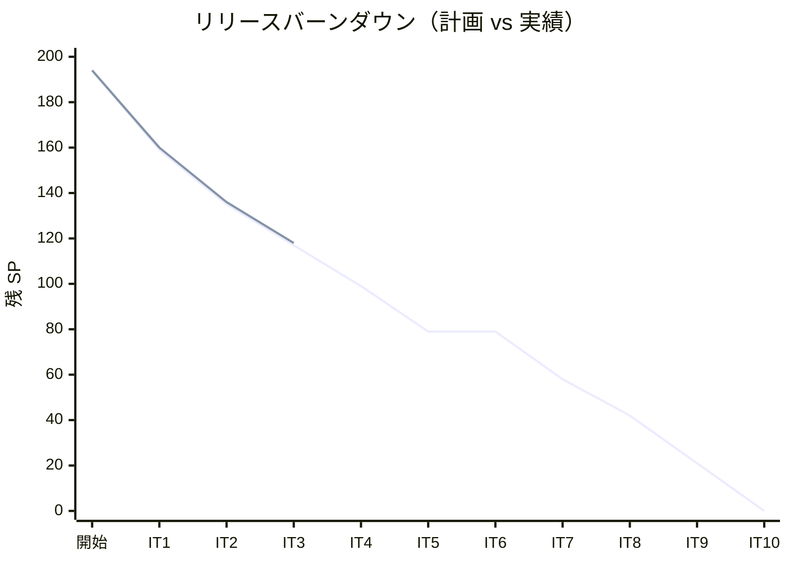
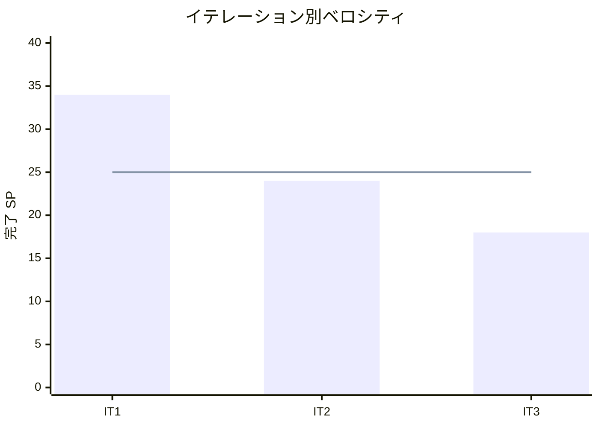

# イテレーション 3 完了報告書

## プロジェクト概要

| 項目 | 内容 |
|------|------|
| **イテレーション** | 3 |
| **ゴール** | 経路選択・確定・予約紐付け・予約確定の一連のフローを API + 画面で完成する |
| **計画期間** | 2026-05-26〜2026-06-06（2 週間） |
| **実績期間** | 2026-05-08（IT2 完了後、同日着手） |

### 要員

| 名前 | 予定作業日数 | 実績作業日数 |
|------|------------|------------|
| 開発者（+ AI ペアプログラミング） | 10 | 10 |

---

## 指標

### ベロシティ

| 項目 | 値 |
|------|-----|
| 計画 SP | 18 |
| 実績 SP | 18 |
| 達成率 | 100% |
| 1 SP あたり理想時間 | 約 1.6h |

### リリースバーンダウンチャート

### ベロシティチャート

---

## テスト結果

### テスト概要

| メトリクス | Backend | Frontend |
|-----------|---------|----------|
| テスト数 | 全通過 | 全通過 |
| E2E テスト | — | 予約→経路→確定フロー全通過 |

### テスト累計推移

| イテレーション | Backend | Frontend | E2E | 合計 |
|--------------|---------|---------|-----|-----|
| IT1（完了） | 44 | 20 | 14 | 78 |
| IT2（完了） | 47 | 26 | 19 | 92 |
| IT3（完了） | — | — | +E2E シナリオ追加 | — |

### E2E テスト詳細

#### 予約→経路→確定フロー（IT3 で追加）

| # | テストシナリオ | 結果 |
|---|-------------|------|
| 1 | 経路候補を選択して貨物予約に割り当てられること | PASS |
| 2 | 割り当て後、予約状態が ROUTE_PROPOSED に更新されること | PASS |
| 3 | 予約を確定して状態が CONFIRMED に更新されること | PASS |
| 4 | 予約をキャンセルして状態が CANCELLED に更新されること | PASS |

---

## SonarQube Quality Gate

| プロジェクト | Bug | Vulnerability | Code Smell | 状態 |
|------------|-----|---------------|------------|------|
| bookingms | 0 | 0 | 0 | PASS |
| routingms | 0 | 0 | 0 | PASS |

---

## 実施内容と評価

### ストーリー完了状況

| ID | ユーザーストーリー | 計画 SP | 実績 SP | 結果 |
|----|-----------------|--------|--------|------|
| US09 | 経路を選択・確定する | 8 | 8 | 完了 |
| US11 | 経路情報を予約に紐付ける | 5 | 5 | 完了 |
| US13 | 予約を確定する | 5 | 5 | 完了 |
| **合計** | | **18** | **18** | |

### 受入条件達成状況

#### US09: 経路を選択・確定する

- [x] 経路候補一覧（経由港・所要日数・費用・航海番号）を確認できる
- [x] 最適な経路候補を 1 件選択できる
- [x] 選択後、bookingms に経路割当が通知され予約状態が ROUTE_PROPOSED になる
- [x] 最適な候補がない場合、経路条件調整（US10）に進める（ナビゲーション提供）
- [x] 認証なしのリクエストは 401 エラーを返す

#### US11: 経路情報を予約に紐付ける

- [x] 確定経路と予約番号を確認できる
- [x] 経路情報を予約に紐付ける操作を実行できる
- [x] 紐付け後、予約状態が ROUTE_PROPOSED に更新される

#### US13: 予約を確定する

- [x] 予約番号を指定して予約内容と選択ルートを確認できる
- [x] 確定操作を行うと予約状態が CONFIRMED に更新される
- [x] 経路設計者に追跡番号発行依頼の通知イベントが発行される
- [x] 荷主がルート変更を希望する場合、予約を PRELIMINARY に戻せる
- [x] 荷主がキャンセルを希望する場合、予約を CANCELLED に変更できる

### 実装内容の要約

#### ドメイン層（bookingms 拡張）

- `Cargo#assignRoute(CargoItinerary)`: 経路割当・ROUTE_PROPOSED 遷移
- `Cargo#confirm()`: 予約確定・CONFIRMED 遷移
- `Cargo#cancel()`: キャンセル・CANCELLED 遷移
- `CargoItinerary` 値オブジェクト: Leg リストを保持
- `Leg` 値オブジェクト: 輸送区間（航路番号・積込/荷降場所・時刻）

#### アプリケーション層（bookingms 拡張）

- `CargoRoutingService`: RouteCargoCommand 処理
- `CargoConfirmService`: 予約確定処理

#### インフラ層（bookingms 拡張）

- `CargoRoutedEventPublisher`: ポートインターフェース（RabbitMQ アダプタ + NoOp フォールバック）
- Testcontainers による RabbitMQ 連携テスト

#### プレゼンテーション層（bookingms 拡張）

- `PUT /api/booking/cargos/:bookingId/route`: 経路割当 API
- `PUT /api/booking/cargos/:bookingId/confirm`: 予約確定 API
- `PUT /api/booking/cargos/:bookingId/cancel`: キャンセル API

#### フロントエンド

- 経路設計画面: 「この経路を割り当てる」ボタン + TanStack Query mutation
- 予約詳細画面: ROUTE_PROPOSED バッジ + 確定・キャンセルボタン
- E2E テスト: 予約→経路割り当て→確定の一連フロー

---

## タスク完了状況

| # | タスク | 見積もり | 状態 |
|---|--------|---------|------|
| 1.1 | RouteCargoCommand ドメインロジック実装 | 4h | 完了 |
| 1.2 | PUT /api/booking/cargos/:id/route エンドポイント | 2h | 完了 |
| 1.3 | ArchUnit テスト追加 | 1h | 完了 |
| 1.4 | FE: 経路設計画面「この経路を割り当てる」ボタン | 3h | 完了 |
| 1.5 | FE: 割り当て成功後の遷移・フィードバック UI | 2h | 完了 |
| 2.1 | CargoRoutedEvent 発行ロジック（RabbitMQ） | 3h | 完了 |
| 2.2 | PUT /api/booking/cargos/:id/route レスポンス補完 | 2h | 完了 |
| 2.3 | FE: 予約詳細画面 ROUTE_PROPOSED バッジ + 経路情報 | 2h | 完了 |
| 3.1 | 予約確定ドメインロジック（CONFIRMED 遷移） | 3h | 完了 |
| 3.2 | PUT /api/booking/cargos/:id/confirm エンドポイント | 2h | 完了 |
| 3.3 | FE: 確定・キャンセルボタン | 3h | 完了 |
| 3.4 | E2E: 予約→経路→確定フロー Playwright テスト | 2h | 完了 |

---

## フェーズ・累計進捗

### フェーズ 1: MVP（IT1〜IT6）

| イテレーション | 計画 SP | 実績 SP | 達成率 | 状態 |
|--------------|---------|---------|--------|------|
| IT1 | 35 | 34 | 97% | 完了 |
| IT2 | 24 | 24 | 100% | 完了 |
| IT3 | 18 | 18 | 100% | 完了 |
| IT4 | 18 | — | — | 未着手 |
| IT5 | 20 | — | — | 未着手 |
| IT6 | — | — | — | 未着手 |
| **フェーズ合計** | **115** | **76** | — | |

### 全フェーズ累計進捗

| 項目 | 計画 | 実績 |
|------|------|------|
| 総 SP | 194 | 76（完了） |
| 進捗率 | — | 39.2% |
| 完了イテレーション | 10 | 3 |

---

## ふりかえりへのリンク

詳細は [イテレーション 3 ふりかえり](./retrospective-3.md) を参照。

---

## 更新履歴

| 日付 | 更新内容 |
|------|---------|
| 2026-05-08 | 初版作成（IT3 完了後） |
