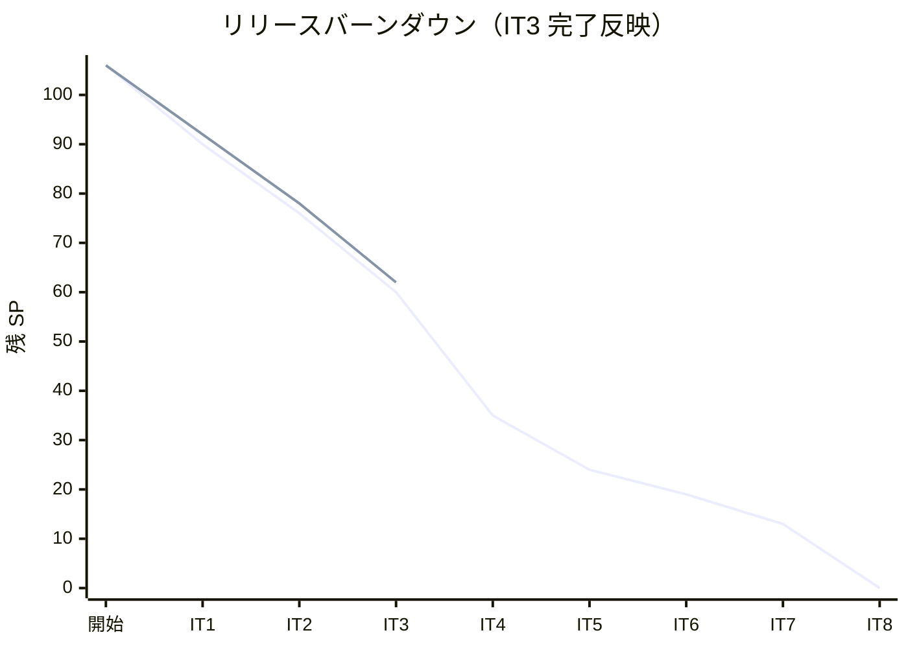

# イテレーション 3 完了報告書

## 1. プロジェクト概要

| 項目 | 内容 |
|------|------|
| **イテレーション** | 3 / 8 |
| **期間** | 2026-05-15 〜 2026-05-16（計画 2026-06-11〜06-24 を前倒し完了） |
| **ゴール** | 輸送見積（US01）・予約引き渡し（US06）・航海スケジュール検索（US07）・既存航海スケジュール更新（US25 持越し）と IT2 持越し品質基盤（PIT・ドキュメント）を完了させる |
| **チーム** | 開発者 1 名 + AI エージェント（Claude Code） |

---

## 2. 指標

### ベロシティ

| 項目 | 値 |
|------|-----|
| 計画 SP | 16 |
| 実績 SP | 16 |
| 達成率 | 100% |
| 持越し | 0 SP（US04-r1 / US05-r1 / US24-r1 は IT3 起票のみ・実装は IT4 以降） |

### バーンダウンチャート

### ベロシティチャート

```mermaid
xychart-beta
    title "ベロシティ推移"
    x-axis ["IT1", "IT2", "IT3"]
    y-axis "SP" 0 --> 20
    bar "計画" [16, 14, 16]
    bar "実績" [14, 14, 16]
```

---

## 3. テスト結果

| カテゴリ | テスト数 | 成功 | 失敗 | スキップ |
|---------|---------|------|------|---------|
| authms（ユニット + 統合 + Smoke）| 81 | 81 | 0 | 0 |
| bookingms（ユニット + 統合 + Smoke）| 65 | 65 | 0 | 0 |
| routingms（ユニット + 統合 + Smoke）| 28 | 28 | 0 | 0 |
| **バックエンド合計** | **174** | **174** | **0** | **0** |

IT3 での新規追加テスト:

- `QuotationTest`（5 件）: Quotation Aggregate ユニットテスト
- `QuotationProjectionsEventHandlerTest`（4 件）: 投影ハンドラ ArgumentCaptor テスト
- `CargoTest`（4 件、一部 IT2 から継続）: handOffToRouting 系テスト追加
- `OptimalRouteServiceTest`（6 件）: US08 PoC DFS 経路探索テスト
- `VoyageControllerIntegrationTest`（+4 件追加）: US07 絞り込み条件テスト

### コード品質メトリクス（SonarQube）

| プロジェクト | Quality Gate | new_coverage | new_violations | Bug | Vulnerability | Duplications |
|------------|-------------|-------------|----------------|-----|---------------|-------------|
| Backend (cargo-tracker-backend) | **PASS** ✅ | **87.9%** | 0 | 0 | 0 | 2.02% |

新規コードの hotspots 100% レビュー済み、Code Smell 14 件を IT3 内で解消。

---

## 4. 実施内容と評価

### ストーリー別完了状況

| ID | ユーザーストーリー | SP | 状態 | 備考 |
|----|-------------------|----|------|------|
| US25 | 既存航海スケジュールを更新する（IT2 繰越し） | 3 | 完了 | `UpdateVoyageScheduleCommand` → `VoyageScheduleUpdatedEvent`、差分確認 UI |
| US01 | 輸送見積を作成する | 5 | 完了 | `Quotation` Aggregate、見積番号・候補一覧・有効期限 |
| US06 | 予約情報を経路設計者に引き渡す | 3 | 完了 | `HandOffToRoutingCommand`、`ROUTING` 遷移、経路設計者一覧表示 |
| US07 | 航海スケジュールを検索する | 5 | 完了 | 出発地・目的地・期間・貨物種別絞り込み |
| **合計** | | **16** | | 全件完了 |

### IT2 持越しタスクの完了状況

| タスク | 状態 |
|--------|------|
| PIT 75% 主指標導入 + CI 統合 | 完了（bookingms 78% / routingms 77%） |
| `data-model.md` に `users.lock_until` / `failed_attempts` 反映 | 完了 |
| `apps/frontend/e2e/README.md` / 運用手順書 §7 更新 | 完了 |
| 業務的入力検証ストーリー（US04-r1 / US05-r1 / US24-r1）起票 | 完了（起票のみ・実装 IT4） |

### US08 先行スパイク（バッファ枠 4h）

| 成果物 | 内容 |
|--------|------|
| `OptimalRouteService.java` | DFS 全経路列挙 PoC（計算量 O(\|E\|^d)） |
| `TransitEdge.java` | 経由辺VO（出発地・到着地・航海番号・時刻・貨物種別） |
| `TransitPath.java` | 経路候補VO（辺のリスト） |
| `RouteSearchSpecification.java` | 経路探索仕様VO（出発・到着・期限・貨物種別） |
| `OptimalRouteServiceTest.java` | 6 テスト（直行・経由・期限・貨物種別・寄港地連続性・乗り継ぎ時間） |

### 受入条件の達成状況

| 成功基準 | 状態 |
|---------|------|
| `POST /api/v1/quotations` で輸送見積（金額・通貨・有効期限・候補一覧）が返却される（US01） | 達成 |
| `POST /api/v1/bookings/{id}/handoff` 成功後、`cargo_summary.booking_status` が `ROUTING` に更新される（US06） | 達成 |
| `GET /api/v1/voyages?origin=...&destination=...&departureFrom=...&cargoType=...` で航海候補が取得できる（US07） | 達成 |
| `PUT /api/v1/voyages/{voyageNumber}` で既存航海スケジュールを更新でき、`VoyageScheduleUpdatedEvent` が永続化される（US25） | 達成 |
| PIT カバレッジが CI で計測される（bookingms 78% / routingms 77%）| 達成 |
| ドキュメント陳腐化（e2e/README・手順書 §7・data-model.md）が解消される | 達成 |
| フロントエンド「見積→予約→引き渡し→航海検索」Playwright E2E GREEN | 達成 |
| Axon Server 停止時 smoke test（ADR-0009 regression 防止） | **IT4 持越し**（受入基準として残置） |

---

## 5. 追加タスク（SP 外）

| タスク | 内容 |
|--------|------|
| US08 先行スパイク（PoC） | DFS 経路探索実装、6 テスト、4 クラス新規追加 |
| SonarQube Code Smell 14 件解消 | `@SuppressWarnings("java:S1172")`、`MESSAGE_KEY` 定数化、`candidateRecord` リネーム等 |
| Checkstyle NeedBraces / LeftCurly 対応 | `isEligible()` / `explore()` メソッド抽出でネスト削減 |
| XP 5 エージェント並列レビュー実施 | H8 件・M10 件・L4 件の改善提案を `docs/review/us08_spike_review_20260516.md` に記録 |

---

## 6. フェーズ・累計進捗

### イテレーション進捗

| イテレーション | 計画 SP | 実績 SP | 達成率 | 状態 |
|---------------|---------|---------|--------|------|
| IT1 | 16 | 14 | 88% | 完了 |
| IT2 | 14 | 14 | 100% | 完了 |
| IT3 | 16 | 16 | 100% | 完了 |
| IT4 | 25 | - | - | 未着手 |
| IT5 | 11 | - | - | 未着手 |
| IT6 | 5 | - | - | 未着手 |
| IT7 | 6 | - | - | 未着手 |
| IT8 | 13 | - | - | 未着手 |
| **累計** | **106** | **44** | **42%** | |

### フェーズ進捗

| フェーズ | 計画 SP | 完了 SP | 進捗率 | 状態 |
|---------|---------|---------|--------|------|
| 認証基盤（Phase 0） | 8 | 8 | 100% | 完了 |
| Phase 1（予約・経路設計） | 57 | 36 | 63% | 進行中（US01/US06/US07/US25 完了） |
| Phase 2（追跡・精算） | 35 | 0 | 0% | 未着手 |

### IT4 への持越し事項

| タスク | 理由 |
|--------|------|
| PoC 処理方針 ADR（捨てる / プロモート）| 第 0 スプリント必須・H7 対応 |
| Javadoc BFS/DFS/Dijkstra 命名統一 | 第 0 スプリント必須・H1 対応 |
| CarrierMovement / TransitEdge 責務 ADR | 第 0 スプリント推奨・M7 対応 |
| `List<String>` → `Set<CargoType>` 型安全化 | H8, M5 対応・機械的リファクタリング |
| US04-r1 / US05-r1 / US24-r1 業務的入力検証 | IT3 起票のみ、SP 見積後 IT4 計画に組込み |
| Axon Server 停止時 smoke test | ADR-0009 regression 防止 |

---

## 7. レビューと品質保証

### XP 5 エージェント並列レビュー結果

| エージェント | 評価サマリー |
|------------|------------|
| xp-programmer | PoC として意図と構造が読み取りやすく責務分離も妥当。BFS/DFS 混同・isVisited セマンティクス欠陥・グラフ表現再設計が IT4 課題 |
| xp-tester | TDD サイクルに沿った不変条件検証が秀逸。境界値テスト欠如・固定値依存・異常系未網羅を本実装前に補強が必要 |
| xp-architect | PoC 目的は達成。型乖離・アルゴリズム名不一致・PoC/本実装境界の曖昧さが技術的負債蓄積リスク |
| xp-technical-writer | PoC スコープ Javadoc は良い。BFS/Dijkstra 記述と実装の致命的乖離、IT4 引き継ぎ情報追記が必要 |
| xp-user-representative | 経路探索骨格は PoC として妥当。候補比較・0 件挙動・乗り継ぎ最小時間が業務利用に不足 |

詳細: [US08 先行スパイク コードレビュー](../review/us08_spike_review_20260516.md)

### Quality Gate 通過

- Backend (cargo-tracker-backend) で SonarQube Quality Gate **PASS**
- new_coverage 87.9% / new_violations 0 / hotspots 100% / duplications 2.02% すべて OK

---

## 8. ふりかえり

[イテレーション 3 ふりかえり](./retrospective-3.md) を参照。

KPT サマリー:
- **Keep**: US08 先行スパイクの計画的実施 / SonarQube Quality Gate PASS 維持 / Checkstyle + SonarQube 規律強化 / ArgumentCaptor 投影テストパターン定着 / 多視点コードレビュー定例化 / ADR 先行完了
- **Problem**: BFS/DFS/Dijkstra 命名混乱 / PoC 本実装境界の曖昧さ / String 型によるドメイン型欠如 / 乗り継ぎ最小時間の業務未合意 / 計画と実施期間の大きな乖離
- **Try**: IT4 着手前 PoC 処理方針 ADR / Javadoc アルゴリズム名統一 / CarrierMovement/TransitEdge 責務 ADR / US08 ストーリー詳細化でユーザー合意 / 型安全化の計画化

---

## 9. 関連ドキュメント

- [リリース計画](./release_plan.md)
- [イテレーション 3 計画](./iteration_plan-3.md)
- [イテレーション 3 ふりかえり](./retrospective-3.md)
- [US08 先行スパイク コードレビュー](../review/us08_spike_review_20260516.md)
- [ADR-0007 Axon 5.1 Event Sourcing API](../adr/0007-axon-5-event-sourcing-api.md)
- [ADR-0009 Axon Server Connector](../adr/0009-axon-server-connector.md)
- [テスト戦略](../design/test_strategy.md)

---

## 10. 更新履歴

| 日付 | 更新内容 | 更新者 |
|------|---------|--------|
| 2026-05-16 | 初版作成 | AI Agent（XP PM） |
