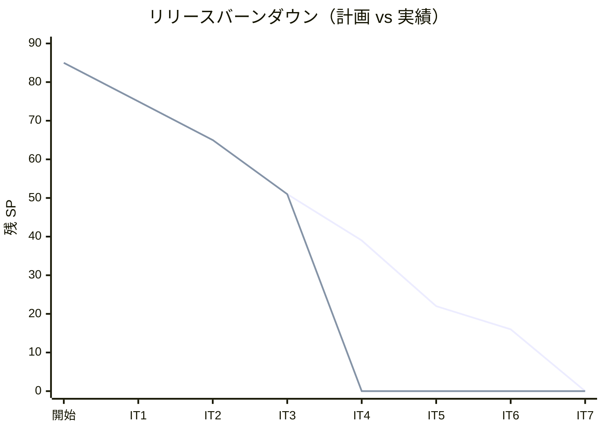
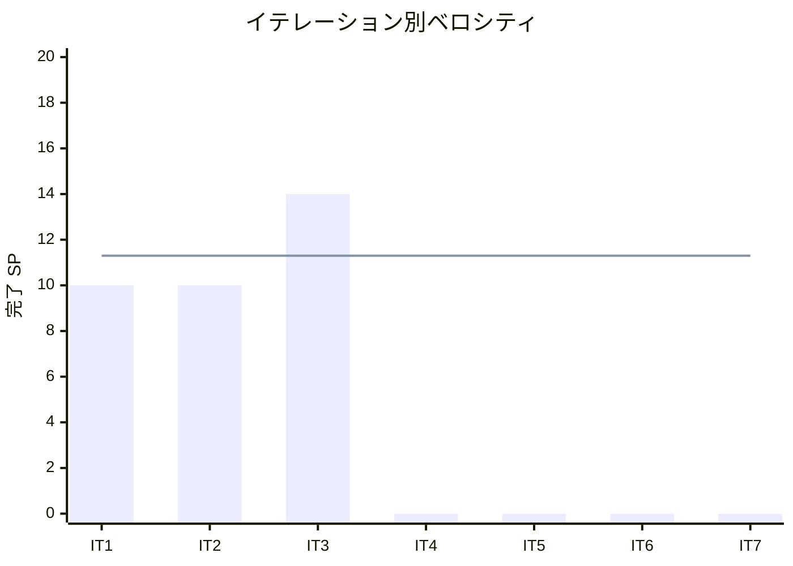

# イテレーション 3 完了報告書

## プロジェクト概要

国際貨物輸送管理システム（Cargo Tracker F# 版）のイテレーション 3 完了報告。
Routing Context（航海スケジュール・経路候補算出）を中盤インサイドアウトで確立し、航海の登録・更新・検索から経路候補の自動算出までを実現した。

## 日程

- イテレーション開始日: 2026-08-11（計画）
- イテレーション終了日: 2026-08-22（計画）
- 作業日数: 10 日（2 週間）
- 局面: 中盤（インサイドアウト）

## 要員

| 名前 | 予定作業日数 | 実績作業日数 |
|------|-------------|-------------|
| 開発担当 + AI エージェント | 10 | 10 |

## 指標

### ビルド・テスト結果

| 項目 | 結果 |
|------|------|
| ユニットテスト（CargoTracker.Tests） | 94 件緑 |
| 統合テスト（CargoTracker.IntegrationTests） | 85 件緑 |
| アーキテクチャテスト（CargoTracker.ArchTests） | 8 件緑 |
| **合計** | **187 件緑・失敗 0** |
| ビルド警告 | 0（`-warnaserror`） |
| Fantomas フォーマット | クリーン |
| カバレッジ（全体 / ドメイン層） | 93.0% / 88.4%（閾値 80% / 85% クリア） |

### イテレーションバーンダウン（リリース）

### ベロシティ

## 実施内容と評価

| ストーリー | 結果 | 予定ポイント | ベロシティ加算ポイント |
|-----------|------|-------------|----------------------|
| US24 航海スケジュールを新規登録する | 完了 | 3 | 3 |
| US25 既存航海スケジュールを更新する | 完了 | 3 | 3 |
| US07 航海スケジュールを検索する | 完了 | 3 | 3 |
| US08 経路候補を算出する | 完了 | 5 | 5 |
| **合計** | | **14** | **14** |

### 主な成果物

| 種別 | 成果物 |
|------|--------|
| ドメイン | Voyage 集約・Schedule（連結制約）・CarrierMovement・VoyageNumber/VesselName/CarrierName/CargoTypeTag・RouteComputation ドメインサービス |
| アプリケーション | VoyageRepository ポート・VoyageWorkflow（register/update/search/computeRoutes） |
| インフラ | voyage/carrier_movement（マイグレーション 0006・両方言）・VoyageRepository（親子トランザクション） |
| Web | 航路一覧 `/voyages`・登録 `/voyages/new`・更新 `/voyages/{n}/edit`・経路設計依頼一覧 `/routing/requests`・経路設計 `/routing/requests/{bookingId}` |
| ADR | ADR-0009（経路候補算出は Routing 自コンテキストで構成） |
| 設計反映 | data-model（voyage 拡張）・domain-model（Routing 新規要素）・開発戦略（US08 記述を ADR-0009 整合に修正） |

### デスコープ・保留

| 項目 | 状態 | 理由 |
|------|------|------|
| WireMock.Net 契約テスト（4.1） | デスコープ | ADR-0009 で US08 が ExternalRoutingServicePort 不使用に。実 HTTP 実装が無く前提を欠く。外部連携時に実施（YAGNI） |
| post-commit イベント dispatch 結線（2.4 残） | 保留 | 依頼一覧は状態クエリで実現。イベント dispatch は消費者確定（IT4）まで延期 |
| US25 明示的差分ビュー | 部分 | フォーム復元で更新は成立。変更前後の差分表示は改善 IT へ |

### イテレーションレビュー

| アクションアイテム | 担当 |
|-------------------|------|
| IT4 で経路候補を予約へ紐付ける導線を実装し、post-commit イベント dispatch を UnitOfWork へ結線 | 開発担当 |
| 経路候補の費用に「暫定」ラベルを追加（正式化は Billing IT7） | 開発担当 |
| US25 の差分確認ビューを強化 | 開発担当 |
| 外部経路サービス連携時に ExternalRoutingServicePort の HTTP 実装 + WireMock 契約テストを導入 | 開発担当 |

## 総括

計画 14 SP を 100% 達成。IT1-3 の 3 イテレーション連続で計画どおり消化（累計 34/34 SP）。
中盤インサイドアウトの狙いどおり、Schedule 連結制約と経路候補算出（RouteComputation）を FsCheck 込みでドメイン層に凝集させ、貧血モデルを回避した。
`validating-design` で開発戦略と ADR-0009 の矛盾（US08 の算出方式）を着手前に検出・解消し、実装中の手戻りを防げた。
ベロシティ較正の結果、リリース計画の改訂は不要と判断。IT5 の 17 SP 過積載は IT4 完了時に再評価する。
IT3 完了後も中盤（IT4-IT5）が継続し、IT4 は Routing と Booking をまたぐ経路確定・予約確定に進む。

---

## 関連ドキュメント

- [イテレーション 3 計画](./iteration_plan-3.md)
- [イテレーション 3 ふりかえり](./retrospective-3.md)
- [リリース計画](./release_plan.md)
- [ADR-0009](../adr/0009-経路候補算出はRouting自コンテキストで構成する.md)
