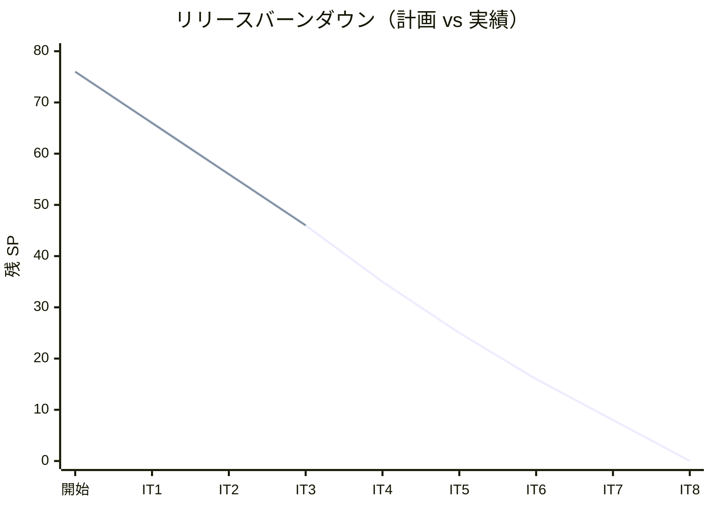
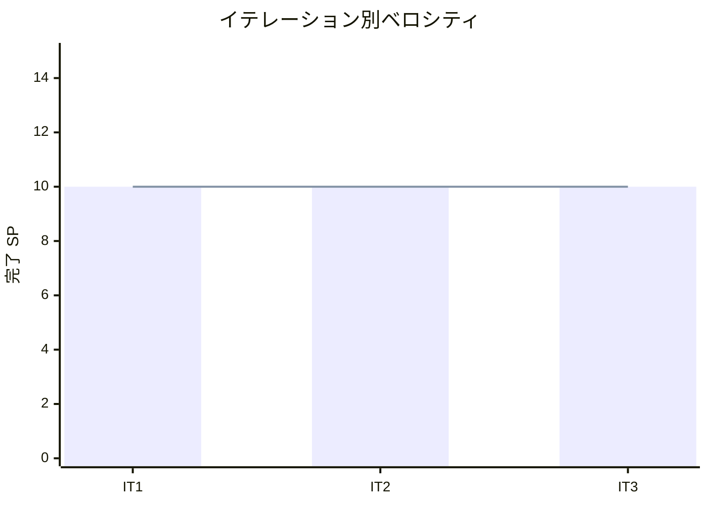

# イテレーション 3 完了報告書

## プロジェクト概要

| 項目 | 内容 |
|------|------|
| **イテレーション** | 3 |
| **計画期間** | 2026-06-18 〜 2026-07-01（2 週間） |
| **実績期間** | 2026-05-25 〜 2026-05-26 |
| **ゴール** | 輸送見積・予約引き渡し・航海スケジュール検索・予約確定を実現し、bookingms ⇔ routingms の cross-service イベント連携（Axon Saga + Kafka）を確立する |
| **作業日数** | 計画 10 日 / 実績 約 2 日 |

### 要員

| 名前 | 予定作業日数 | 実績作業日数 |
|------|------------|------------|
| k2works | 10 | 2 |

---

## 指標

### ベロシティ

| 項目 | 値 |
|------|-----|
| **計画 SP** | 10 |
| **実績 SP** | 10 |
| **達成率** | 100% |
| **1 SP あたり実績時間** | 約 0.8h（計画 8h/10SP） |

### バーンダウンチャート

### ベロシティチャート

---

## テスト結果

### バックエンド

| メトリクス | 値 |
|-----------|-----|
| テストクラス数 | 27 クラス（authms 3 / bookingms 11 / routingms 12 / gatewayms 1） |
| テストメソッド数 | 124 |
| カバレッジ（全体） | 80.0% |
| 行カバレッジ | 81.9% |

### フロントエンド

| メトリクス | 値 |
|-----------|-----|
| テストファイル数 | 19 / 19 通過 |
| テスト数 | 119 / 119 通過 |
| カバレッジ（全体） | 81.0% |
| 行カバレッジ | 84.0% |
| E2E テスト | 5 ファイル（33 シナリオ通過 + cross-service 1 シナリオは環境変数ゲートで通常スキップ） |

### テスト増分（IT3 新規追加）

| カテゴリ | 前回 | 今回 | 増分 |
|---------|------|------|------|
| バックエンドテスト | 46 | 124 | +78 |
| フロントエンドテスト | 58 | 119 | +61 |
| E2E テスト | 18 | 34 | +16 |
| **合計** | **122** | **約 277** | **+155** |

> 注: SonarQube 上のカバレッジは Backend（JaCoCo）と Frontend（Vitest LCOV）から算出。E2E は SonarQube 集計外。Backend テスト数の増分には routingms（US07 検索・cross-service 受信・Voyage 系）の計上が含まれる。

### テスト累計推移

| イテレーション | Backend | Frontend | E2E | 合計 |
|--------------|---------|---------|-----|------|
| IT1 | 26 | 11 | 17 | 54 |
| IT2 | 46 | 58 | 18 | 122 |
| IT3 | 124 | 119 | 34 | 約 277 |

---

## SonarQube Quality Gate

| プロジェクト | カバレッジ（全体） | 行カバレッジ | 重複率 | Code Smell | Bug / Vuln | 結果 |
|------------|----------------|------------|--------|-----------|-----------|------|
| Backend | 80.0% | 81.9% | 1.9% | 0 | 0 / 0 | **PASS** ✅ |
| Frontend | 81.0% | 84.0% | 0.0% | 0 | 0 / 0 | **PASS** ✅ |

### Quality Gate 条件（new code, Frontend）

| 条件 | 閾値 | 判定 |
|------|------|------|
| new_coverage | ≥80 | ✅ |
| new_duplicated_lines_density | <3 | ✅ |
| new_violations | ≤0 | ✅ |

> Frontend の Code Smell は本イテレーション中に 25 → 0 に解消。Backend のカバレッジは、`--tests` 部分実行で陳腐化していた JaCoCo レポートを全テスト再実行で再生成し、63.9% → 80.0% に是正（実コードのカバレッジは元から十分で、測定アーティファクトの修正）。

---

## 実施内容と評価

### ストーリー別完了状況

| ID | ユーザーストーリー | 計画 SP | 実績 SP | 結果 |
|----|-------------------|---------|---------|------|
| US07 | 航海スケジュールを検索する | 3 | 3 | 完了 ✅ |
| US01 | 輸送見積を作成する | 3 | 3 | 完了 ✅ |
| US06 | 予約情報を経路設計者に引き渡す | 2 | 2 | 完了 ✅ |
| US13 | 予約を確定する | 2 | 2 | 完了 ✅ |
| **合計** | | **10** | **10** | |

### US07 受入確認

- [x] 検索条件（出発地・目的地・出発期間・貨物種別）を入力して検索できる
- [x] 航海スケジュール一覧に航海番号・運送会社・出発日・到着日が表示される
- [x] 条件を満たす航海がない場合、その旨が表示され条件を緩和して再検索できる
- [x] 出発地・目的地は UN/LOCODE 形式で指定できる

### US01 受入確認

- [x] 出発地・目的地・希望期限・貨物種別・重量を入力できる
- [x] 航海スケジュール検索結果からルート候補を選択できる（フロント主導の cross-service 合成）
- [x] ルート候補ごとに「経路・所要日数・概算費用」が表示される
- [x] 見積情報が保存され、見積番号が発行される
- [x] 候補が空（期限内ルートなし）でも見積を作成でき、候補なしが荷主への通知材料となる

### US06 受入確認

- [x] 予約番号を指定して経路設計引き渡し（handoff）を実行できる
- [x] 引き渡し実行で予約状態が「経路設計中（ROUTING）」に更新される
- [x] `RouteDesignRequestedEvent` が Kafka(cargo-events) に発行され、routingms の経路設計待ちリスト（route_design_request）に伝搬する

### US13 受入確認

- [x] 予約を確定でき、状態が確定に遷移する
- [x] 予約をキャンセルでき、状態遷移ガード（不正遷移の拒否）が機能する
- [x] 確定・キャンセルが Read Model に反映される

### 実装内容の要約

#### routingms（航海検索・cross-service 受信）

- US07: `VoyageController` に `/api/v1/voyages/search` を追加（出発地・目的地・出発期間・貨物種別で絞り込み）
- cross-service 受信: `RouteDesignRequestEventHandler`（`@ProcessingGroup("route-design-requests")`）+ `route_design_request` read model（MyBatis + Flyway V5）
- Kafka tracking モード: `StreamableKafkaMessageSource` を source とする tracking プロセッサに割り当て（`KafkaEventProcessingConfig`）
- 経路設計依頼 参照 API: `RouteDesignRequestController` + `RouteDesignRequestQueryService`（US08 ワークベンチの先取り、cross-service 検証にも利用）

#### bookingms（見積・予約ライフサイクル・Saga）

- US01: `Quotation` 集約 + 見積 Read Model + 見積 API（`QuotationController`）
- US06: `RequestRouteDesignCommand` → `RouteDesignRequestedEvent`（経路設計情報込みに拡張）+ handoff API
- US13: 予約確定・キャンセルの状態遷移 + Read Model 更新 + API
- `BookingSagaManager`: CargoBooked → RouteDesignRequested → BookingCancelled の予約ライフサイクル Saga

#### shared（cross-service 契約）

- `RouteDesignRequestedEvent` を shared モジュールに移動し、bookingms / routingms で同一 FQCN を共有（ADR-0009）

#### フロントエンド

- US07: 航海スケジュール一覧の検索フィルタ
- US01: 見積一覧（QuotationListPage）・見積作成フォーム（QuotationFormPage）・見積詳細（QuotationDetailPage）
- US06/US13: 予約詳細ページ（handoff / confirm / cancel 操作）

---

## 追加タスク（SP 外、計画外）

| タスク | 分類 | 内容 |
|--------|------|------|
| 負債返済 T1 | 運用基盤 | 新サービス追加チェックリストを `docs/reference/` に整備 |
| 負債返済 T2 | ドキュメント | 設計ドキュメントを ADR-0008 と整合（architecture / domain-model / data-model） |
| 負債返済 T3 | フロントエンド | 後方互換ラッパ `fetchBookings` / `fetchShippers` を削除 |
| 負債返済 T4 | バックエンド | `created_at DESC` インデックスを Flyway で追加（perf） |
| 負債返済 T5 | フロントエンド | `PageResponse<T>` 型と `PAGE_SIZE` 定数をフロント共通化 |
| 負債返済 T6 | レビュー | レビュープロンプトテンプレート整備 |
| 負債返済 T7 | バックエンド | Axon Saga（`BookingSagaManager`）導入 + Kafka tracking モード移行 |
| cross-service 疎通の実証 | テスト | Testcontainers Kafka 統合テスト + 環境変数ゲート付き E2E（`npm run e2e:cross-service`） |
| 認証ヘッダ不整合の修正 | フロントエンド | `sessionStorage('token')` → `localStorage('auth_token')` に統一、`shared/api/auth` に集約 |
| Code Smell 25 → 0 | 品質 | FormEvent 非推奨置換・Context value の useMemo 安定化・認知的複雑度低減・props readonly 化ほか |
| カバレッジ 80% 達成 | 品質 | Frontend API クライアントのテスト追加（+32 件）、Backend JaCoCo 再生成 |
| tsbuildinfo を Git 管理から除外 | 運用基盤 | `*.tsbuildinfo` を .gitignore に追加 |

---

## ADR

IT3 で追加した ADR：

| ADR | 内容 |
|-----|------|
| [ADR-0009](../adr/0009-cross-service-event-saga.md) | cross-service イベント連携と Axon Saga 採用（承認済み） |

ADR-0009 では、cross-service ドメインイベントを shared モジュールに配置し同一 FQCN で送受信する方針、`route-design-requests` プロセッサを tracking モードで Kafka source に割り当てる方針を記録。

---

## フェーズ・累計進捗

### Phase 1 進捗

| ID | ユーザーストーリー | SP | 状態 |
|----|-------------------|----|------|
| US00 | 認証 | 3 | ✅ 完了（IT1） |
| US24 | 航海スケジュール新規登録 | 3 | ✅ 完了（IT1） |
| US25 | 航海スケジュール更新 | 2 | ✅ 完了（IT1） |
| US02 | 荷主を登録する | 2 | ✅ 完了（IT2） |
| US03 | 法人荷主を登録する | 2 | ✅ 完了（IT2） |
| US04 | 貨物予約を登録する | 3 | ✅ 完了（IT2） |
| US05 | 危険物・冷凍貨物の予約を登録する | 3 | ✅ 完了（IT2） |
| US07 | 航海スケジュールを検索する | 3 | ✅ 完了（IT3） |
| US01 | 輸送見積を作成する | 3 | ✅ 完了（IT3） |
| US06 | 予約情報を経路設計者に引き渡す | 2 | ✅ 完了（IT3） |
| US13 | 予約を確定する | 2 | ✅ 完了（IT3） |
| US08 | 経路候補を算出する | 5 | 未着手（IT4） |
| US09 | 経路を選択・確定する | 2 | 未着手（IT4） |
| US10 | 経路条件を調整して再算出する | 2 | 未着手（IT4） |
| US11 | 経路情報を予約に紐付ける | 2 | 未着手（IT4） |
| US12 | 確定経路を荷主に通知する | 2 | 未着手（IT4） |

**Phase 1 進捗（US ベース）**: 28 / 41 SP（68.3%）

### 全フェーズ累計

| フェーズ | 計画 SP | 完了 SP | 達成率 |
|---------|---------|---------|--------|
| Phase 1 | 41 | 28 | 68.3% |
| Phase 2 | 27 | 0 | 0% |
| Buffer | 8 | 0 | 0% |
| **合計** | **76** | **28（US）/ 30（ベロシティ）** | **約 39%** |

> 注: 基盤構築（IT1: 2 SP）はストーリーに紐づかないため Phase 1 の US 合計には含まない。ベロシティ計上は IT1 10 + IT2 10 + IT3 10 = 累計 30 SP。

---

## ふりかえり

詳細は [イテレーション 3 ふりかえり](./retrospective-3.md) を参照。

### サマリー

- **Keep**: 同期合成（見積）と非同期イベント（経路設計依頼）の使い分け、shared モジュールでの cross-service イベント共有、ProcessingGroup による processor 分離、Testcontainers Kafka での物理経路検証、IT2 の Try T1-T7 全消化
- **Problem**: 認証ヘッダが実質無効だった（storage/key 不整合）、JaCoCo レポートの陳腐化リスク、cross-service が E2E 未カバーだった、HMR による E2E 偽失敗、スケジュールの名目乖離
- **Try (IT4 で実施)**: 認証ヘッダ共通ラッパ規約のレビュー観点化、cross-service ストーリーのイベント駆動 E2E を DoD 化、JaCoCo フル再生成運用の明文化、US08 `OptimalRouteService` 実装、全体品質目標の Quality Gate 条件化

---

## IT4 への引き継ぎ事項

1. **US08 経路候補算出** (T4): routingms に `OptimalRouteService` を実装。`route_design_request` を入力に経路探索ロジックを構築（IT4 の主目標、Phase 1 完了・Release 1.0 MVP へ）
2. **cross-service E2E の DoD 化** (T2): 経路紐付け（US11、routingms → bookingms）など cross-service を伴うストーリーはイベント駆動 E2E を必須化
3. **認証ヘッダ規約** (T1): API クライアントの認証付与を `shared/api/auth` 経由に統一する規約をレビュー観点に追加
4. **JaCoCo フル再生成運用** (T3): `--tests` 部分実行後は必ずフル再実行してからスキャンする運用を明文化
5. **全体品質目標の Quality Gate 条件化** (T6): 全体カバレッジ 80%・全体 Code Smell 0 を SonarQube の追加条件として定義

---

## 更新履歴

| 日付 | 更新内容 | 更新者 |
|------|---------|--------|
| 2026-05-26 | 初版作成 | k2works |
