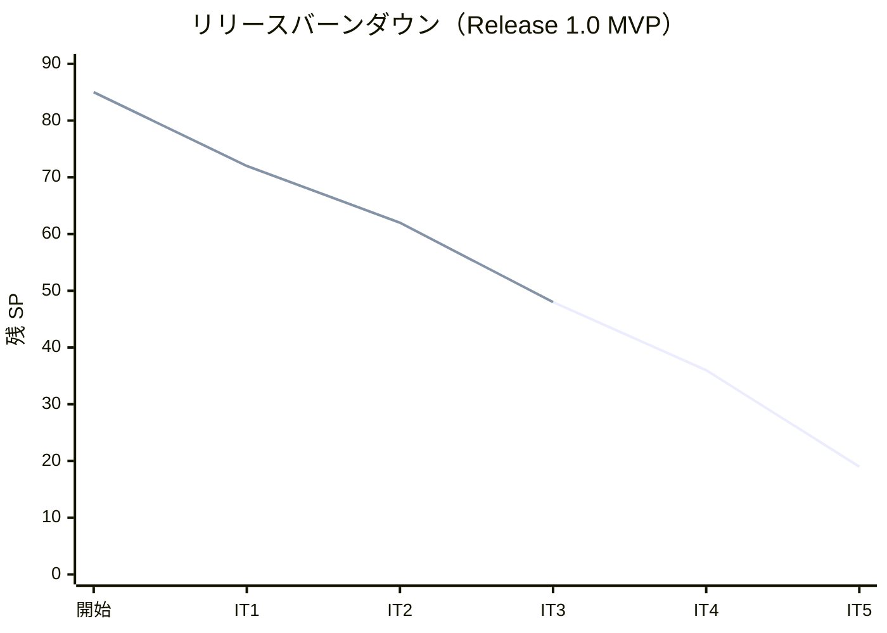
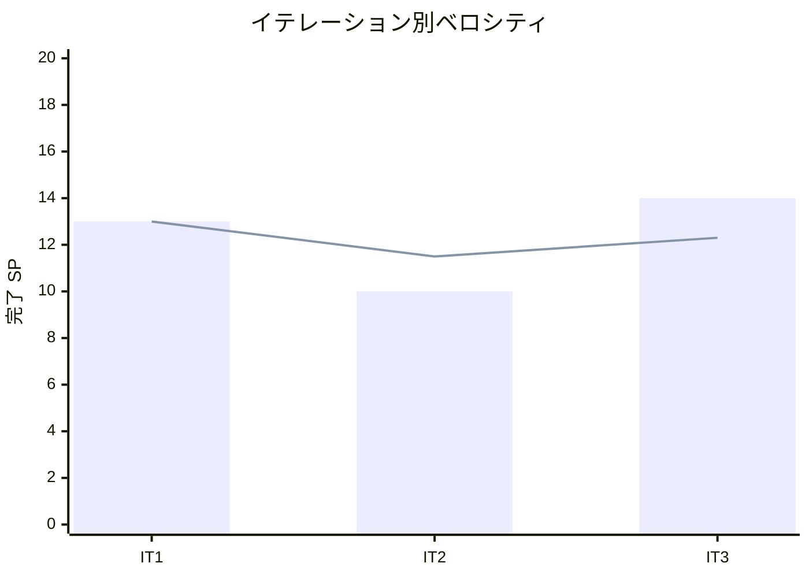

# イテレーション 3 完了報告書

## 1. プロジェクト概要

| 項目 | 内容 |
|------|------|
| イテレーション | IT3 |
| ゴール | 航海スケジュールを管理し、外部経路サービス ACL 経由で経路候補を算出できる |
| 計画期間 | 2026-08-04 〜 2026-08-15（2 週間） |
| 実績期間 | 2026-07-09（テックリード + Codex 協働、途中から テックリード直接実装） |
| 局面（開発戦略） | 中盤 = インサイドアウト（データ → ドメイン → アプリ → プレゼン） |

### 要員

| 名前 | 予定作業日数 | 実績作業日数 |
|------|------------|------------|
| 開発者 1 名 + AI エージェント（テックリード Claude Code / 実装 Codex・US08 以降 テックリード直接） | 10 | 1（集中実装） |

## 2. 指標

### ベロシティ

| 項目 | 値 |
|------|-----|
| 計画 SP | 14 |
| 実績 SP | 14 |
| 達成率 | **100%** |

### リリースバーンダウン（計画 vs 実績）

- 計画線: 85 → 72 → 62 → 48 → 36 → 19（IT5 で Release 1.0）
- 実績線: 85 → 72 → 62 → 48（IT3 開発完了時点。計画どおり 14 SP 消化）

### ベロシティ推移

- IT1=13・IT2=10・IT3=14。平均 12.3 SP/IT。3 イテレーション実績が揃い想定（10-12 SP・実効）と整合。計画は現状維持。

## 3. テスト結果

| テストプロジェクト | 件数 | 結果 |
|-------------------|------|------|
| Domain.Tests | 76 | 全パス |
| Application.Tests | 4 | 全パス |
| Architecture.Tests | 6 | 全パス |
| Web.Tests | 34 | 全パス |
| E2E.Tests | 4 | 全パス |
| Infrastructure.Tests | 37 | 全パス |
| **合計** | **161** | **全パス** |

### テスト増分・累計推移

| イテレーション | 累計テスト数 | 増分 |
|---------------|------------|------|
| IT1 | 74 | +74 |
| IT2 | 117 | +43 |
| IT3 | 161 | +44 |

- ビルド警告 0・エラー 0、`dotnet format` クリーン、pre-commit 品質ゲート通過。SQL 方言コンプライアンステストが `RETURNING` 混入を早期検出。

## 4. 実施内容と評価

### ストーリー別完了状況

| US | ストーリー | SP | 状態 |
|----|-----------|----|----|
| US24 | 航海スケジュールを新規登録する | 3 | 完了 |
| US25 | 既存航海スケジュールを更新する | 3 | 完了 |
| US07 | 航海スケジュールを検索する | 3 | 完了 |
| US08 | 経路候補を算出する | 5 | 完了 |
| **合計** | | **14** | **100%** |

### 受入条件の達成状況

- **US24**: 航海番号・船名・運送会社・港・日時・寄港地（seq 連鎖）・対応貨物種別の入力、必須/日付整合/連続性検証、重複拒否、登録番号発行、検索対象化をすべて満たす。
- **US25**: 既存呼び出し・差分確認・上書き更新（version 楽観ロック）・検索反映・キャンセル不変を満たす。
- **US07**: 予約情報参照（ACL）・検索条件絞り込み・制約条件・一覧表示・該当なし再検索・危険物/冷凍フィルタ・UN/LOCODE をすべて満たす。
- **US08**: 経路候補の自動算出・寄港地接続評価・所要日数/経由港/費用/航海番号表示・推奨順（直行優先）・期限超過通知をすべて満たす。※外部サービスは実 HTTP 未存在のためローカル算出で代替（WireMock.Net 契約は実連携時）。

### 実装内容の要約（レイヤー別）

| レイヤー | 主な成果物 |
|---------|-----------|
| Domain | Voyage 集約、値オブジェクト（VoyageNumber/Schedule/CarrierMovement/SupportedCargoType）、CandidateRoute/RouteLeg、RouteCandidateCalculator、VoyageRegistered/ScheduleUpdated イベント |
| Application | RegisterVoyage/UpdateSchedule Command/Service、IBookingLookup/IRouteCandidateService（ACL/ポート）、検索・依頼一覧 QueryService |
| Infrastructure | VoyageRepository（version 楽観ロック・二方言）、BookingLookup、VoyageRouteCandidateService、0007 マイグレーション |
| Interfaces | VoyageController（登録/更新）、RoutingController（依頼一覧/検索/候補算出）、Razor ビュー・htmx 部分更新 |

## 5. 追加タスク（SP 外）: 技術的負債返済

| # | 項目 | 内容 |
|---|------|------|
| 5.1 | ArchUnit 拡張 | Routing→他 BC 直接参照禁止（US24 で実装） |
| H1/H2 | AmbientTransaction | ADR-0006 起票（ADR-0002 の Transaction 公開を Supersede）＋ネスト非対応ガードとテスト |
| H4/T3 | CargoType/経路候補 | ADR-0007 起票（BC 独立定義・共有カーネルへ昇格しない・再判断トリガー明記） |
| H3 | 過去日ガード | Cargo.Create に到着期限≧当日の不変条件（Estimate と同パターン） |
| T4 | カバレッジ | coverlet 収集は CI・develop.js 組込済み。ドメイン 85% ハードゲートは実測後（繰り越し） |
| H5 | E2E | 予約/航海フローは Web.Tests で担保。Playwright E2E は IT4 繰り越し |

- コミット: 10 件（feat 4 / refactor 2 / fix 1 / docs 3）。

## 6. E2E テスト結果

- E2E 4 件全パス（認証・ウォーキングスケルトン・ロール制御）。航海登録→検索→経路候補算出フローは Web.Tests（WebApplicationFactory）で担保。Playwright E2E への航海/予約フロー追加は IT4 へ繰り越し（H5）。

## 7. フェーズ・累計進捗

### Release 1.0 MVP（Phase 1・IT1-5）

| イテレーション | SP | 状態 |
|---------------|----|----|
| IT1 | 13 | 完了 |
| IT2 | 10 | 完了 |
| IT3 | 14 | 開発完了 |
| IT4 | 12 | 未着手 |
| IT5 | 17 | 未着手 |
| **累計完了** | **37 / 66** | **56%** |

### プロジェクト全体

- 全 85 SP のうち 37 SP 完了（**44%**）。残 48 SP。
- 中盤（IT3-5・インサイドアウト）に入り、Routing BC の中核を確立。次は IT4（経路確定・予約確定）。

## 8. ふりかえり

詳細は [イテレーション 3 ふりかえり（KPT）](./retrospective-3.md) を参照。

- **Keep**: インサイドアウト移行の円滑さ、US08 のドメイン凝集、BC 独立の ADR 化、確立パターン再利用、負債の計画返済。
- **Problem**: Codex 利用上限で US08 以降テックリード直接実装、WireMock 契約未実施、T4 ゲート未設定、H5 繰り越し、一覧サマリとテスト粒度のずれ。
- **Try**: Codex 上限前提の分割・US08 重点レビュー・T4 段階導入・H5 E2E 拡張・外部依存方針の ADR 化。

## 9. 更新履歴

| 日付 | 更新内容 | 更新者 |
|------|---------|--------|
| 2026-07-09 | 初版作成（IT3 開発完了報告・14 SP・161 テスト・ADR-0006/0007・T4/H5 繰り越し） | - |
