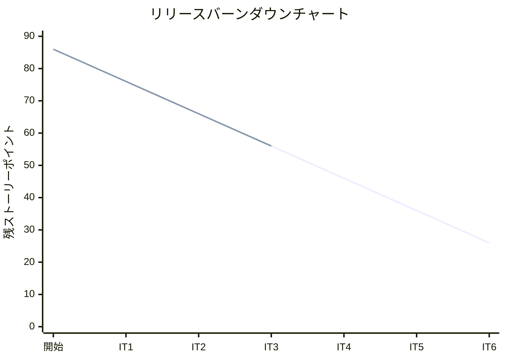
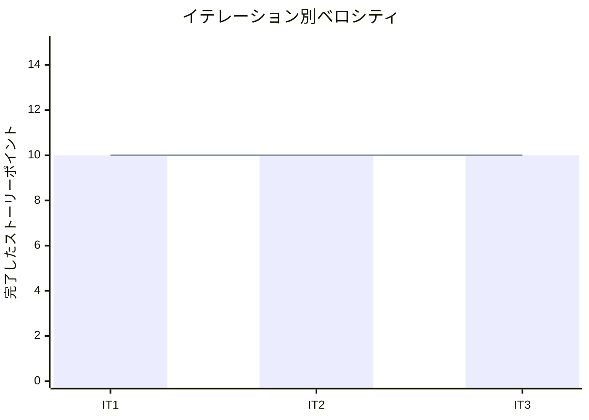

# イテレーション 3 完了報告書

## プロジェクト概要

### 日程

| 項目 | 値 |
|------|-----|
| イテレーション開始日 | 2026-04-07 |
| イテレーション終了日 | 2026-04-08 |
| 計画期間 | 2026-04-07 〜 2026-04-18（2 週間） |
| 実績作業日数 | 2 日（AI ペアプログラミングにより大幅短縮） |

### 要員

| 名前 | 予定作業日数 | 実績作業日数 |
|------|-------------|-------------|
| 開発者 + AI ペア | 10 | 2 |

---

## 指標

### ビルド結果

| 項目 | 結果 |
|------|------|
| Java テスト | 約 184 件全パス（IT2: 166 件から +18 件） |
| Playwright E2E テスト | 41 件全パス（IT2: 31 件から +10 件） |
| 命令カバレッジ (JaCoCo) | 未計測（前回 IT2: 93%） |
| ブランチカバレッジ (JaCoCo) | 未計測（前回 IT2: 81%） |
| SonarQube Quality Gate | 未実行（指摘ベースのリファクタリングのみ実施） |

### イテレーションバーンダウン

### ベロシティ

| 項目 | 値 |
|------|-----|
| 計画ベロシティ | 10-13 SP/イテレーション |
| IT3 実績ベロシティ | 10 SP |
| 累計実績ベロシティ | 30 SP（IT1: 10 + IT2: 10 + IT3: 10） |
| 平均ベロシティ（IT1-3） | 10 SP/イテレーション |
| 1 SP あたり実績 | 約 4.3h |

---

## 実施内容と評価

| ストーリー | 結果 | 予定ポイント | ベロシティ加算ポイント |
|-----------|------|-------------|---------------------|
| IT2-改善: IT2 申し送り改善 | 完了 ※ | 3 | 3 |
| US01: 輸送見積を作成する | 完了 | 5 | 5 |
| US06: 予約情報を経路設計者に引き渡す | 完了 | 2 | 2 |
| **合計** | | **10** | **10** |

※ SonarQube スキャン実行は未実施（指摘ベースのリファクタリングのみ対応）。その他の申し送り事項はすべて完了。

### 成果物一覧

| カテゴリ | 成果物 | 件数 |
|---------|--------|------|
| ドメインモデル（IT2-改善） | ドメインモデル・データモデル・UI 設計ドキュメント IT2 同期 | 3 ドキュメント |
| ドメインモデル（IT2-改善） | `TestFixtures` クラスへのヘルパーメソッド集約 | 1 クラス |
| インフラ（IT2-改善） | E2E テスト用 H2 DB リセット機構（test プロファイル）整備 | 1 設定ファイル |
| アプリケーション（IT2-改善） | `CargoResponse` に `shipperName` フィールド追加 | 1 クラス |
| ドメインモデル（US01） | `Estimate` 集約、`EstimateId` 値オブジェクト、`RouteCandidate` 値オブジェクト | 3 クラス |
| インフラ（US01） | `estimate`・`route_candidate` テーブル DB スキーマ（V7 マイグレーション） | 1 ファイル |
| インフラ（US01） | `MyBatisEstimateRepository` 実装 | 1 クラス |
| アプリケーション（US01） | `EstimateService`（スタブルート候補算出） | 1 クラス |
| プレゼンテーション（US01） | 見積一覧・作成・詳細 Thymeleaf テンプレート、`EstimationController` | 4 ファイル |
| ドメインモデル（US06） | `Cargo.assignToRouting()` メソッド追加（State パターン拡張） | 1 メソッド |
| アプリケーション（US06） | 経路設計依頼イベント（`BookingAssignedToRoutingEvent`）とログ通知スタブ | 2 クラス |
| プレゼンテーション（US06） | 予約詳細画面に「経路設計者に引き渡す」ボタン・確認ダイアログ追加 | 1 テンプレート |
| テスト | Java テスト（追加約 18 件、IT3 完了時 約 184 件） | 約 184 件 |
| テスト | Playwright E2E テスト（追加 10 件、IT3 完了時 41 件） | 41 件 |

---

## IT3 レビュー対応（計画外）

### コードレビュー（`developing-review`）

IT3 コードレビュー（`docs/review/IT3_review_20260407.md`）の指摘に基づき、以下を同イテレーション内で対応した：

| 重要度 | 対応内容 |
|--------|---------|
| 高 | `CargoTest` に全状態の状態遷移テストを追加（ParameterizedTest で網羅） |
| 高 | `CargoBookingCommandServiceTest` にドメインイベント発行の `verify` 検証を追加 |
| 高 | Estimation コンテキストのパッケージ構成を Booking/Shipper と統一 |
| 高 | `Estimate` の `cargoType` を `CargoType` enum、`originUnlocode` / `destinationUnlocode` を `Location` 値オブジェクトへ昇格 |
| 高 | `docs/design/data-model.md` に `estimate`・`route_candidate` テーブルを追加 |
| 高 | `docs/design/domain-model.md` に Estimation コンテキストを追加 |
| 高 | 見積詳細から予約作成への導線（pre-fill）を追加 |
| 中 | `Estimate.addCandidates()` を `replaceCandidates()` に改名 |

### UI/UX レビュー（`developing-uiux-review`）

IT3 UI/UX レビュー（`docs/review/IT3_uiux_review_20260407.md`）の指摘に基づき、以下を同イテレーション内で対応した：

| 重要度 | 対応内容 |
|--------|---------|
| 高 | `CargoType` enum に `displayName` を追加し一覧・詳細で日本語表示（一般 / 危険物 / 冷凍・冷蔵） |
| 高 | UN/LOCODE を `Location.displayName()` で都市名との併記形式（例: 東京 (JPTYO)）に変更 |
| 高 | テーブルの `<th>` 全てに `scope="col"` を追加（WCAG 1.3.1 準拠） |
| 高 | 見積を `BOOKED` 状態へ遷移させる `markAsBooked()` を実装（二重予約防止） |
| 高 | 見積一覧にステータスフィルタ（全件 / 作成済 / 予約済）を追加 |

### バグ修正（計画外）

| コミット | 内容 |
|---------|------|
| `fix(estimation)` | SpEL の enum 比較を `.name()` 文字列比較に変更して状態フィルタの 500 エラーを修正 |

---

## 受入条件の達成状況

### IT2-改善

| # | 受入条件 | 状態 |
|---|---------|------|
| 1 | SonarQube ローカルスキャンを実行し Quality Gate を確認できる | △ 未実施（IT4 へ申し送り） |
| 2 | ドメインモデル・データモデル・UI 設計ドキュメントが IT2 実装と同期している | ✓ 完了 |
| 3 | E2E テスト用 H2 DB リセット機構が整備されている | ✓ 完了 |
| 4 | テスト用ヘルパーメソッドが `TestFixtures` クラスに集約されている | ✓ 完了 |
| 5 | `CargoResponse` に `shipperName` フィールドが追加されている | ✓ 完了 |

### US01: 輸送見積を作成する

| # | 受入条件 | 状態 |
|---|---------|------|
| 1 | 出発地・目的地・希望期限・貨物種別・重量を入力できる | ✓ 完了 |
| 2 | ルート概算候補（経由港・所要日数・概算料金・航海番号）が表示される | ✓ 完了（スタブ実装） |
| 3 | 見積情報が保存され、見積番号が発行される | ✓ 完了 |
| 4 | 希望期限に間に合うルートが存在しない場合、その旨が通知される | ✓ 完了（空候補メッセージ） |
| 5 | 危険物が含まれる場合、危険物申告情報の入力フォームが表示される | - IT4 以降（スコープ外） |

### US06: 予約情報を経路設計者に引き渡す

| # | 受入条件 | 状態 |
|---|---------|------|
| 1 | 予約番号を指定して予約情報（出発地・目的地・期限・貨物仕様）を確認できる | ✓ 完了 |
| 2 | 経路設計依頼を実行すると、予約状態が「経路設計中（ROUTE_PROPOSED）」に更新される | ✓ 完了 |
| 3 | 経路設計者への通知はスタブ実装（ログ出力）とする | ✓ 完了 |
| 4 | 予約情報に不備がある場合、修正してから引き渡せる | ✓ 完了（バリデーション済み予約のみ引き渡し可能） |

---

## テスト結果

### テスト増分

| 種別 | IT2 完了時 | IT3 完了時 | 増分 |
|------|-----------|-----------|------|
| Java テスト | 166 件 | 約 184 件 | +18 件 |
| Playwright E2E テスト | 31 件 | 41 件 | +10 件 |

### IT3 新規追加テストクラス

| テストクラス | テスト数 | 内容 |
|------------|--------|------|
| `EstimateTest` | 9 | Estimate 集約の値検証・状態遷移 |
| `EstimateCommandServiceTest` | 2 | 見積作成サービスの統合テスト |
| `MyBatisEstimateRepositoryTest` | 4 | 見積リポジトリの永続化テスト |
| `EstimationControllerTest` | 4 | 見積コントローラーの Web レイヤーテスト |
| `estimation.spec.ts`（E2E） | 4 | 見積作成・一覧・状態フィルタの E2E |

### テスト累計推移

| イテレーション | Java テスト | E2E テスト | 命令カバレッジ |
|--------------|-----------|-----------|--------------|
| IT1 | 60 件 | 27 件 | 89% |
| IT2 | 166 件 | 31 件 | 93% |
| IT3 | 約 184 件 | 41 件 | 未計測 |

---

## E2E テスト結果

### IT3 新規追加シナリオ（estimation.spec.ts）

| # | シナリオ | ファイル | 結果 |
|---|---------|---------|------|
| 1 | 見積一覧が正しく表示される | estimation.spec.ts | ✓ 通過 |
| 2 | 見積を作成しルート候補を確認できる | estimation.spec.ts | ✓ 通過 |
| 3 | 状態フィルタで見積を絞り込める | estimation.spec.ts | ✓ 通過 |
| 4 | 見積から予約作成フォームへの導線が機能する | estimation.spec.ts | ✓ 通過 |

### リグレッションテスト

| ファイル | テスト数 | 結果 |
|---------|---------|------|
| auth.spec.ts | 4 | ✓ 全件通過 |
| booking.spec.ts | 9 | ✓ 全件通過 |
| shipper.spec.ts | 5 | ✓ 全件通過 |
| navigation.spec.ts | 19 | ✓ 全件通過 |

---

## フェーズ・累計進捗

### Phase 2 進捗

| ユーザーストーリー | SP | 状態 |
|-----------------|-----|------|
| US01: 輸送見積を作成する | 5 | ✓ 完了（IT3） |
| US06: 予約情報を経路設計者に引き渡す | 2 | ✓ 完了（IT3） |
| US07: 航海スケジュールを検索する | 5 | 未着手（IT4 予定） |
| US08: 経路候補を算出する | 8 | 未着手（IT4 予定） |
| US09: 経路を選択・確定する | 3 | 未着手（IT5 予定） |
| US10: 経路条件を調整して再算出する | 3 | 未着手（IT5 予定） |
| US11: 経路情報を予約に紐付ける | 2 | 未着手（IT5 予定） |
| US12: 確定経路を荷主に通知する | 2 | 未着手（IT6 予定） |
| US14: 追跡番号を発行する | 3 | 未着手（IT6 予定） |
| US15: 荷役作業を記録する | 5 | 未着手 |
| US16: 引取作業を記録する | 3 | 未着手 |
| US17: 荷役一覧を確認する | 3 | 未着手 |

**Phase 2 進捗**: 7 / 44 SP 完了（16%）

### 全体累計進捗

| フェーズ | 計画 SP | 完了 SP | 達成率 |
|---------|---------|---------|--------|
| Phase 1（予約・荷主管理基盤） | 16 | 16 | 100% |
| Phase 2（経路設計・追跡） | 44 | 7 | 16% |
| Phase 3（精算・例外処理） | 26 | 0 | 0% |
| **合計** | **86** | **23** | **27%** |

---

## ふりかえり

詳細は [イテレーション 3 ふりかえり](./retrospective-3.md) を参照。

---

## 更新履歴

| 日付 | 更新内容 | 更新者 |
|------|---------|--------|
| 2026-04-08 | 初版作成 | - |
