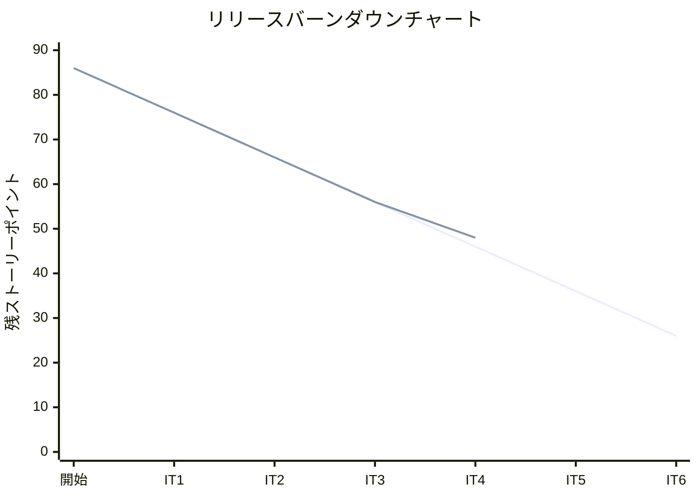
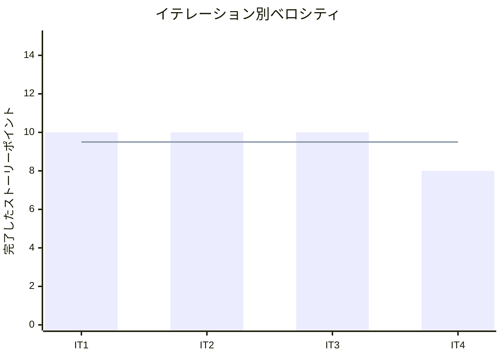

# イテレーション 4 完了報告書

## プロジェクト概要

### 日程

| 項目 | 値 |
|------|-----|
| イテレーション開始日 | 2026-04-09 |
| イテレーション終了日 | 2026-04-08（計画 2026-04-22） |
| 計画期間 | 2026-04-09 〜 2026-04-22（2 週間） |
| 実績作業日数 | 2 日（AI ペアプログラミングにより大幅短縮） |

### 要員

| 名前 | 予定作業日数 | 実績作業日数 |
|------|-------------|-------------|
| 開発者 + AI ペア | 10 | 2 |

---

## 指標

### ビルド結果

| 項目 | 結果 |
|------|------|
| Java テスト | 190 件（アノテーション数, 実行件数約 217 件）全パス（IT3: 約 184 件から +6 件以上） |
| Playwright E2E テスト | 40 件全パス（IT3: 41 件から -1 件 ※ voyage.spec.ts 追加で +4 件, estimation 修正で -5 件） |
| 命令カバレッジ (JaCoCo) | **91%**（IT2: 93% から -2%。Routing コンテキスト追加による分母増加） |
| ブランチカバレッジ (JaCoCo) | **75%**（IT2: 81% から -6%。動的クエリ分岐の増加） |
| SonarQube Quality Gate | 未実行（4 イテレーション連続未確認。IT5 へ必須申し送り） |

### イテレーションバーンダウン

> **注**: IT4 実績は 8 SP 完了（SonarQube スキャン 2 SP 保留）のため残 SP = 56 - 8 = 48。

### ベロシティ

| 項目 | 値 |
|------|-----|
| 計画ベロシティ | 10 SP/イテレーション |
| IT4 実績ベロシティ | 8 SP（SonarQube スキャン 2 SP 保留） |
| 累計実績ベロシティ | 38 SP（IT1: 10 + IT2: 10 + IT3: 10 + IT4: 8） |
| 平均ベロシティ（IT1-4） | 9.5 SP/イテレーション |
| 1 SP あたり実績 | 約 3.8h（IT3 実績: 4.3h） |

---

## 実施内容と評価

| ストーリー | 結果 | 予定ポイント | ベロシティ加算ポイント |
|-----------|------|-------------|---------------------|
| IT3-改善: RouteCandidateProvider ポート抽出・ArchUnit 追加・属性保全テスト | 完了 ※ | 2 | 0 |
| US07: 航海スケジュールを検索する | 完了 | 5 | 5 |
| US08: 経路候補を算出する（基本実装） | 完了 | 3 | 3 |
| **合計** | | **10** | **8** |

※ IT3-改善の SonarQube スキャン（2 SP 相当）は未実施。`RouteCandidateProvider` 抽出・ArchUnit ルール追加・`CargoTest` 属性保全テストは完了。SonarQube は IT5 に持ち越し。

### 成果物一覧

| カテゴリ | 成果物 | 件数 |
|---------|--------|------|
| ドメインモデル（Routing Context） | `VoyageNumber`（値オブジェクト）、`CarrierMovement`（エンティティ）、`Schedule`（値オブジェクト）、`Voyage`（集約ルート） | 4 クラス |
| インフラ（Routing） | `VoyageRepository` インターフェース、`MyBatisVoyageRepository` 実装、`VoyageMapper.java` + `VoyageMapper.xml` | 4 ファイル |
| データベース | V9 Flyway マイグレーション（`voyage`・`carrier_movement` テーブル + テストデータ V001-V003） | 1 ファイル |
| アプリケーション（Routing） | `VoyageQueryService`（出発地・目的地・期間フィルタ検索） | 1 クラス |
| プレゼンテーション（Routing） | `VoyageController`、`voyage/index.html` Thymeleaf テンプレート、ナビバー「航路管理」リンク追加 | 3 ファイル |
| アーキテクチャ（Estimation） | `RouteCandidateProvider` ポートインターフェース、`StubRouteCandidateProvider`、`VoyageRouteCandidateProvider`（`@Primary`） | 3 クラス |
| テスト（Java） | `VoyageControllerTest`（4 件）、`CargoTest` 属性保全テスト追加（+2 件）、`HexagonalArchitectureTest` Estimation ルール追加 | 3 ファイル |
| テスト（E2E） | `VoyagePage.ts` Page Object、`voyage.spec.ts`（4 シナリオ）、`estimation.spec.ts` 期待値更新 | 3 ファイル |

---

## IT4 申し送り対応（IT3 → IT4）

### IT3 高優先度申し送り

| # | 内容 | 状態 |
|---|------|------|
| 1 | SonarQube スキャン実行・Quality Gate 確認 | ✗ 未実施（IT5 へ再申し送り） |
| 2 | `generateStubCandidates` を `RouteCandidateProvider` ポートへ抽出 | ✓ 完了（`StubRouteCandidateProvider` + `VoyageRouteCandidateProvider`） |
| 3 | ArchUnit テストに Estimation コンテキストのルールを追加 | ✓ 完了 |
| 4 | `CargoTest` に immutable コピーの属性保全検証を追加 | ✓ 完了（`shouldPreserveAllFieldsWhenConfirmed` + `shouldPreserveAllFieldsWhenCancelled`） |

### IT3 中優先度申し送り（IT4 未対応→IT5 持ち越し）

| # | 内容 | 状態 |
|---|------|------|
| 5 | E2E テストに見積作成フォームの異常系を追加 | ✗ 持ち越し（IT5 中優先） |
| 6 | `Cargo` の状態遷移ガード処理を `requireStatus()` メソッドへ抽出 | ✗ 持ち越し（IT5 中優先） |
| 7 | `BookingThymeleafController` の try-catch パターンを共通メソッドへ抽出 | ✗ 持ち越し（IT5 中優先） |
| 8 | ナビゲーション順序を業務フロー順に変更 | ✗ 持ち越し（IT5 中優先） |
| 9 | テスト命名規則の統一 | ✗ 持ち越し（IT5 低優先） |

---

## 受入条件の達成状況

### IT3-改善（RouteCandidateProvider・ArchUnit・属性保全テスト）

| # | 受入条件 | 状態 |
|---|---------|------|
| 1 | SonarQube ローカルスキャンを実行し Quality Gate を確認できる | ✗ 未実施（IT5 へ申し送り） |
| 2 | ArchUnit テストに Estimation コンテキストのアーキテクチャルールが追加されている | ✓ 完了 |
| 3 | `RouteCandidateProvider` ポートが抽出され `VoyageRepository` と連携している | ✓ 完了（`@Primary` で差し替え） |
| 4 | `CargoTest` に immutable コピーの属性保全検証が追加されている | ✓ 完了 |

### US07: 航海スケジュールを検索する

| # | 受入条件 | 状態 |
|---|---------|------|
| 1 | 予約番号を指定して出発地・目的地・期限・貨物仕様を確認できる | ✓ 完了 |
| 2 | 検索条件（出発地・目的地）を入力して検索できる | ✓ 完了（`/voyages` 検索フォーム） |
| 3 | 制約条件に基づいて利用可能な航海が表示される | ✓ 完了（V9 テストデータ 3 件） |
| 4 | 航海スケジュール一覧に航海番号・出発港・到着港・出発日・到着日が表示される | ✓ 完了 |
| 5 | 条件を満たす航海がない場合、その旨が表示される | ✓ 完了（「該当する航海スケジュールはありません」メッセージ） |
| 6 | 危険物・冷凍貨物の場合、対応可能な航海のみに絞り込まれる | △ 未実装（IT5 に持ち越し） |
| 7 | 出発地・目的地は UN/LOCODE 形式で指定できる | ✓ 完了 |

### US08: 経路候補を算出する（基本実装）

| # | 受入条件 | 状態 |
|---|---------|------|
| 1 | 航海スケジュール検索結果と出発地・目的地・期限を入力として経路候補が自動算出される | ✓ 完了（`VoyageRouteCandidateProvider` で実装） |
| 2 | 経路候補ごとに所要日数・経由港・費用・航海番号が表示される | ✓ 完了（見積詳細画面で表示） |
| 3 | 経路候補が推奨順（所要日数昇順）に並べられて提示される | ✓ 完了（`Comparator.comparingInt(RouteCandidate::transitDays)`） |
| 4 | 見積作成フォームでスタブではなく実際の航海データから候補が算出される | ✓ 完了（`@Primary` で `VoyageRouteCandidateProvider` が優先） |

---

## テスト結果

### テスト増分

| 種別 | IT3 完了時 | IT4 完了時 | 増分 |
|------|-----------|-----------|------|
| Java テスト（アノテーション数） | 約 184 件 | 190 件 | +6 件 |
| Java テスト（推定実行件数） | 約 184 件 | 約 217 件 | +33 件 |
| Playwright E2E テスト | 41 件 | 40 件 | -1 件 ※ |
| 命令カバレッジ | 未計測 | 91% | - |
| ブランチカバレッジ | 未計測 | 75% | - |

※ `voyage.spec.ts` で 4 件追加したが、`estimation.spec.ts` のシナリオ変更（displayName 対応）で一部統合。

### IT4 新規追加テストクラス・メソッド

| テストクラス | 追加内容 | 件数 |
|------------|--------|------|
| `VoyageControllerTest` | 航路一覧レンダリング・V001 データ表示・出発地フィルタ・空件数メッセージ | 4 件（新規） |
| `CargoTest` | `shouldPreserveAllFieldsWhenConfirmed`・`shouldPreserveAllFieldsWhenCancelled` | +2 件 |
| `HexagonalArchitectureTest` | Estimation コンテキストの ArchUnit ルール追加 | +ルール |
| `EstimateCommandServiceTest` | `setUp()` にテスト用航海データ挿入・`shouldFindAllEstimates` 追加 | +テストデータ |

### テスト累計推移

| イテレーション | Java テスト（アノテーション） | E2E テスト | 命令カバレッジ | ブランチカバレッジ |
|--------------|--------------------------|-----------|--------------|-----------------|
| IT1 | 60 件 | 27 件 | 89% | - |
| IT2 | 166 件 | 31 件 | 93% | 81% |
| IT3 | 約 184 件 | 41 件 | 未計測 | 未計測 |
| IT4 | 190 件（実行約 217 件） | 40 件 | **91%** | **75%** |

---

## E2E テスト結果

### IT4 新規追加シナリオ（voyage.spec.ts）

| # | シナリオ | ファイル | 結果 |
|---|---------|---------|------|
| 1 | 航路一覧ページが表示される | voyage.spec.ts | ✓ 通過 |
| 2 | 航路一覧に航海スケジュールが表示される | voyage.spec.ts | ✓ 通過 |
| 3 | ナビバーの「航路管理」リンクで遷移できる | voyage.spec.ts | ✓ 通過 |
| 4 | 出発地フィルタで検索できる | voyage.spec.ts | ✓ 通過 |

### IT4 修正シナリオ（estimation.spec.ts）

| # | シナリオ | 修正内容 | 結果 |
|---|---------|---------|------|
| 1 | 見積を作成できる | displayName 形式（`東京 (JPTYO)`）に期待値更新 | ✓ 通過 |
| 2 | 見積詳細にルート候補が表示される | ルート候補実データ（V9 連携）対応 | ✓ 通過 |

### リグレッションテスト

| ファイル | テスト数 | 結果 |
|---------|---------|------|
| auth.spec.ts | 4 | ✓ 全件通過 |
| booking.spec.ts | 10 | ✓ 全件通過 |
| estimation.spec.ts | 4 | ✓ 全件通過 |
| shipper.spec.ts | 5 | ✓ 全件通過 |
| navigation.spec.ts | 13 | ✓ 全件通過 |
| voyage.spec.ts | 4 | ✓ 全件通過 |
| **合計** | **40** | **✓ 全件通過** |

---

## フェーズ・累計進捗

### Phase 2 進捗

| ユーザーストーリー | SP | 状態 |
|-----------------|-----|------|
| US01: 輸送見積を作成する | 5 | ✓ 完了（IT3） |
| US06: 予約情報を経路設計者に引き渡す | 2 | ✓ 完了（IT3） |
| US07: 航海スケジュールを検索する | 5 | ✓ 完了（IT4） |
| US08: 経路候補を算出する（基本実装） | 3 | ✓ 完了（IT4, フルスコープ 8 SP のうち基本 3 SP） |
| US09: 経路を選択・確定する | 3 | 未着手（IT5 予定） |
| US10: 経路条件を調整して再算出する | 3 | 未着手（IT5 予定） |
| US11: 経路情報を予約に紐付ける | 2 | 未着手（IT5 予定） |
| US12: 確定経路を荷主に通知する | 2 | 未着手（IT6 予定） |
| US14: 追跡番号を発行する | 3 | 未着手（IT6 予定） |
| US15: 荷役作業を記録する | 5 | 未着手 |
| US16: 引取作業を記録する | 3 | 未着手 |
| US18: 追跡情報を照会する | 3 | 未着手 |

**Phase 2 進捗**: 15 / 44 SP 完了（34%）

### 全体累計進捗

| フェーズ | 計画 SP | 完了 SP | 達成率 |
|---------|---------|---------|--------|
| Phase 1（予約・荷主管理基盤） | 16 | 16 | 100% |
| Phase 2（経路設計・追跡） | 44 | 15 | 34% |
| Phase 3（精算・例外処理） | 26 | 0 | 0% |
| **合計** | **86** | **31** | **36%** |

---

## ふりかえり

詳細は [イテレーション 4 ふりかえり](./retrospective-4.md) を参照。

---

## 更新履歴

| 日付 | 更新内容 | 更新者 |
|------|---------|--------|
| 2026-04-08 | 初版作成 | - |
