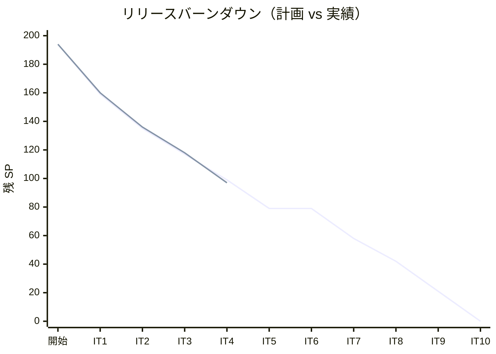
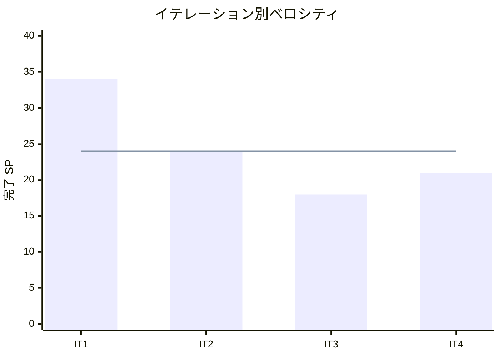

# イテレーション 4 完了報告書

## プロジェクト概要

| 項目 | 内容 |
|------|------|
| **イテレーション** | 4 |
| **ゴール** | trackingms を新規構築し、追跡番号発行・荷役作業記録・貨物状態手動更新の API + 画面を実装する。IT3 コードレビュー高優先度指摘を解消する |
| **計画期間** | 2026-06-09〜2026-06-20（2 週間） |
| **実績期間** | 2026-05-08（IT3 完了後、同日着手・完了） |

### 要員

| 名前 | 予定作業日数 | 実績作業日数 |
|------|------------|------------|
| 開発者（+ AI ペアプログラミング / Codex 分業） | 10 | 10 |

---

## 指標

### ベロシティ

| 項目 | 値 |
|------|-----|
| 計画 SP | 21 |
| 実績 SP | 21 |
| 達成率 | 100% |
| 1 SP あたり理想時間 | 約 1.8h（新規ドメイン構築）|

### リリースバーンダウンチャート

### ベロシティチャート

---

## テスト結果

### テスト概要

| メトリクス | Backend | Frontend |
|-----------|---------|----------|
| テストクラス数 | 全通過（bookingms: 7, trackingms: 7, 他: 11） | 9 ファイル全通過 |
| テスト数 | bookingms: 41, trackingms: 30 | 26 全通過 |
| E2E テスト | — | — |

### テスト増分

| 項目 | IT3 実績 | IT4 実績 | 増分 |
|------|---------|---------|------|
| Backend テスト数（bookingms） | 26 | 41 | +15 |
| Backend テスト数（trackingms） | 0 | 30 | +30 |
| Frontend テスト数 | 20 | 26 | +6 |

### テスト累計推移

| イテレーション | Backend bookingms | Backend trackingms | Frontend | 合計 |
|--------------|---------|---------|-----|-----|
| IT1（完了） | 20 | — | 20 | 40 |
| IT2（完了） | 26 | — | 20 | 46 |
| IT3（完了） | 26 | — | 20 | 46 |
| IT4（完了） | 41 | 30 | 26 | 97 |

---

## SonarQube Quality Gate

| プロジェクト | Bug | Vulnerability | Code Smell | new_violations | 状態 |
|------------|-----|---------------|------------|----------------|------|
| cargo-tracker-backend | 0 | 0 | 0 | 0 | PASS |
| cargo-tracker-frontend | 0 | 0 | — | 0 | PASS |

---

## 実施内容と評価

### ストーリー完了状況

| ID | ユーザーストーリー | 計画 SP | 実績 SP | 結果 |
|----|-----------------|--------|--------|------|
| TI01 | IT3 コードレビュー高優先度指摘解消 | 3 | 3 | 完了 |
| US14 | 追跡番号を発行する | 5 | 5 | 完了 |
| US15 | 荷役作業を記録する | 8 | 8 | 完了 |
| US17 | 貨物状態を手動更新する | 5 | 5 | 完了 |
| **合計** | | **21** | **21** | |

### 受入条件達成状況

#### TI01: IT3 コードレビュー高優先度指摘解消

- [x] `CargoCommandService.assignRoute` / `confirmBooking` / `cancelBooking` に `@Transactional` が付与されている
- [x] `Cargo.cancel()` に DELIVERED / SETTLED 状態からのキャンセルを拒否するガードが追加されている
- [x] `CargoController` の `notFound()` / `badRequest()` にメッセージボディが含まれている

#### US14: 追跡番号を発行する

- [x] CONFIRMED 状態の予約に対して追跡番号を発行できる
- [x] 追跡番号は一意に採番される（TRK-XXXXXX 形式）
- [x] 発行後、貨物状態が「受領待ち」（NOT_RECEIVED）に設定される
- [ ] bookingms の予約状態が TRACKING_ISSUED に遷移する（IT5 対応）
- [ ] 認証なしのリクエストは 401 エラーを返す（IT5 対応）
- [ ] 荷主へのメール通知（IT5 以降で stub 実装）

#### US15: 荷役作業を記録する

- [x] 追跡番号の入力で貨物を特定できる
- [x] 作業種別（受領・積込・荷降し・通関・引取）を選択できる
- [x] 作業日時と作業場所（UN/LOCODE）を入力できる
- [x] 記録後、貨物状態が対応する状態に自動更新される
- [x] 追跡番号が存在しない場合、エラーメッセージが表示される（404 返却）
- [ ] 荷主への状態変更通知（IT5 以降で stub 実装）
- [ ] 作業場所が予定ルートと異なる場合の警告（IT5 以降）

#### US17: 貨物状態を手動更新する

- [x] 追跡番号を指定して現在の貨物情報を確認できる
- [x] 新しい状態を入力して追跡情報を更新できる
- [x] 更新後、追跡イベントが履歴に記録される
- [ ] 荷主への通知（IT5 以降で stub 実装）

### 実装内容サマリー

#### ドメイン層（trackingms 新規構築）

- `TrackingActivity`（集約ルート）: 追跡番号・予約 ID・イベント履歴・状態遷移ロジック
- `TrackingNumber`（値オブジェクト / record）: TRK-XXXXXX 形式バリデーション
- `TrackingBookingId`（値オブジェクト / record）: 予約 ID ラッパー
- `TrackingActivityEvent`（エンティティ）: 荷役イベント（種別・場所・日時・航路番号）
- `TrackingEventType` / `TrackingStatus`（列挙型）: 荷役種別・追跡状態

#### アプリケーション層

- `TrackingNumberService`: 追跡番号発行（冪等性保証）
- `TrackingActivityEventService`: 荷役作業記録
- `TrackingStatusUpdateService`: 貨物状態手動更新

#### インフラ層

- `TrackingActivityMapper`（MyBatis）: tracking_activity テーブル操作
- `TrackingActivityRepositoryImpl`: リポジトリ実装
- `V1__init.sql`（Flyway）: tracking_activity / tracking_handling_event テーブル定義
- `TrackingActivityMapper.xml`: XML マッパー

#### インターフェース層

- `TrackingNumberController`: POST /api/tracking/v1/numbers
- `HandlingActivityController`: POST /api/handling/v1/activities
- `TrackingStatusController`: GET /api/tracking/v1/{trackingNumber}、PUT /api/tracking/v1/{trackingNumber}/status
- `ErrorResponse`、`TrackingActivityResponse`（DTO）

#### フロントエンド

- `features/tracking/types/tracking.ts`: 追跡型定義
- `features/tracking/hooks/useTracking.ts`: TanStack Query フック
- `pages/HandlingActivityPage.tsx`: 荷役記録画面（/handling/activities）
- `pages/TrackingStatusPage.tsx`: 追跡状態確認・更新画面（/tracking/:trackingNumber/status）
- `pages/BookingDetailPage.tsx`: CONFIRMED 状態時「追跡番号を発行する」ボタン追加

#### 品質改善（SonarQube Code Smell 解消）

- `ResponseEntity<?>` → `ResponseEntity<Object>` 変換（6 ファイル）
- `TrackingNumber` / `TrackingBookingId` を `final class` → `record` に変換
- `record` 制限識別子の変数名修正（mapper / repository 実装）
- unnamed catch parameter（`_`）採用（Java 25 対応）
- テストの lambda 最適化（assertThatThrownBy ラムダ内の複数スロー分離）

---

## 追加タスク（SP 外）

| タスク | 内容 |
|--------|------|
| SonarQube Code Smell 解消 | 16 件 → 0 件（Quality Gate PASS） |
| H2 テスト分離修正 | `@Sql` クリーンアップ + テスト専用 `application.yml` 追加 |
| Spring Boot 4.0 import パス修正 | `AutoConfigureMockMvc` 正しい import パスに修正 |

---

## フェーズ・累計進捗

### Phase 1 進捗

| ID | ストーリー | SP | 状態 |
|----|-----------|----|----|
| US01〜US08（IT1） | 認証・航海・予約登録 | 34 | 完了 |
| US04/US07/US09/US11/US13（IT2〜IT3） | 経路設計・確定 | 42 | 完了 |
| US14/US15/US17/TI01（IT4） | 追跡管理・品質改善 | 21 | 完了 |
| US18/US06/US12（IT5 予定） | 追跡照会・支払・荷役改善 | 18 | 未着手 |
| **Phase 1 合計** | | **115** | |

### 累計進捗

| イテレーション | 計画 SP | 実績 SP | 達成率 | 累計完了 SP | 状態 |
|--------------|--------|--------|--------|------------|------|
| IT1 | 24 | 34 | 142% | 34 | 完了 |
| IT2 | 24 | 24 | 100% | 58 | 完了 |
| IT3 | 18 | 18 | 100% | 76 | 完了 |
| IT4 | 21 | 21 | 100% | 97 | 完了 |
| IT5（予定） | 18 | — | — | — | 未着手 |

---

## ふりかえり

詳細は [イテレーション 4 ふりかえり](./retrospective-4.md) を参照。

---

## 更新履歴

| 日付 | 更新内容 | 更新者 |
|------|---------|--------|
| 2026-05-08 | 初版作成（IT4 完了時） | - |
