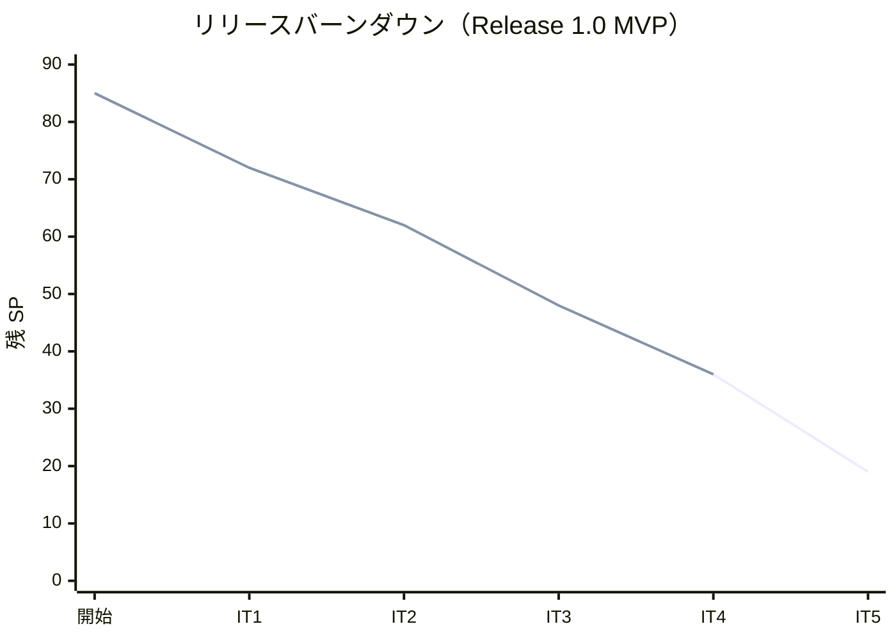
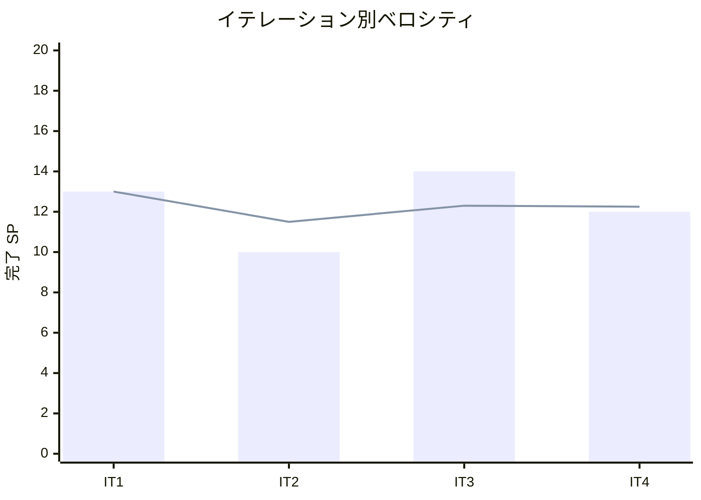

# イテレーション 4 完了報告書

## 1. プロジェクト概要

| 項目 | 内容 |
|------|------|
| イテレーション | IT4 |
| ゴール | 経路の選択・調整・紐付けから予約確定・荷主通知までの予約フローが完結する |
| 計画期間 | 2026-08-18 〜 2026-08-29（2 週間） |
| 実績期間 | 2026-07-13（Ralph Loop によるテックリード直接実装・反復消化） |
| 局面（開発戦略） | 中盤 = インサイドアウト（データ → ドメイン → アプリ → プレゼン） |

### 要員

| 名前 | 予定作業日数 | 実績作業日数 |
|------|------------|------------|
| 開発者 1 名 + AI エージェント（テックリード Claude Code・Ralph Loop で層単位に反復実装） | 10 | 1（集中実装） |

## 2. 指標

### ベロシティ

| 項目 | 値 |
|------|-----|
| 計画 SP | 12 |
| 実績 SP | 12 |
| 達成率 | **100%** |

### リリースバーンダウン（計画 vs 実績）

- 計画線: 85 → 72 → 62 → 48 → 36 → 19（IT5 で Release 1.0）
- 実績線: 85 → 72 → 62 → 48 → 36（IT4 開発完了時点。計画どおり 12 SP 消化）

### ベロシティ推移

- IT1=13・IT2=10・IT3=14・IT4=12。平均 12.25 SP/IT。4 イテレーション連続で計画=実績が一致し、想定（10-12 SP・実効）と整合。計画は現状維持。

## 3. テスト結果

| テストプロジェクト | 件数 | 結果 |
|-------------------|------|------|
| Domain.Tests | 93 | 全パス |
| Application.Tests | 3 | 全パス |
| Architecture.Tests | 6 | 全パス |
| Web.Tests | 48 | 全パス |
| E2E.Tests | 4 | 全パス |
| Infrastructure.Tests | 44 | 全パス |
| **合計** | **198** | **全パス** |

### テスト増分・累計推移

| イテレーション | 累計テスト数 | 増分 |
|---------------|------------|------|
| IT1 | 74 | +74 |
| IT2 | 117 | +43 |
| IT3 | 161 | +44 |
| IT4 | 198 | +37 |

- ビルド警告 0・エラー 0、`dotnet format` クリーン、全コミットで pre-commit 品質ゲート通過。統合テストが PostgreSQL `TIMESTAMP` への DateTimeOffset 書き込み（UTC オフセット）問題を早期検出し、`ToDatabaseTimestamp` 方式に統一して解決。

## 4. 実施内容と評価

### ストーリー別完了状況

| US | ストーリー | SP | 状態 |
|----|-----------|----|----|
| US09 | 経路を選択・確定する | 3 | 完了 |
| US10 | 経路条件を調整して再算出する | 3 | 完了 |
| US11 | 経路情報を予約に紐付ける | 2 | 完了 |
| US12 | 確定経路を荷主に通知する | 2 | 完了 |
| US13 | 予約を確定する | 2 | 完了 |
| **合計** | | **12** | **100%** |

### 受入条件の達成状況

- **US09**: 経路候補一覧の確認・最適候補の選択・確定経路の保存・選択記録・条件調整（US10）への分岐をすべて満たす。候補は都度算出のため選択時に同一条件で再算出しインデックスで確定対象を特定（決定的算出）。
- **US10**: 現在の制約条件確認・条件調整・再算出・新候補確認・該当なし時の再検索導線を満たす。IT3 の `RouteCandidateCalculator` を再利用し、検索フォーム再送で再算出を実現（※UC08 の「調整条件の記録」は要否を IT5 で確定＝ふりかえり Try T1）。
- **US11**: 確定経路と予約番号の確認・紐付け実行・`CargoItinerary`（Leg 連結制約）の保存・予約状態表示・紐付け記録をすべて満たす。Routing→Booking は ACL（`ISelectedRouteLookup`）経由で BC 独立を維持。
- **US12**: 紐付け経路情報の確認・通知内容確認・通知送信・送信記録登録・荷主承認可能状態への遷移を満たす。
- **US13**: 予約内容・選択ルート確認・確定操作（`RouteProposed → Confirmed`）・追跡番号発行依頼イベント発行・ルート変更差し戻し（`→ Preliminary`）・キャンセル（`→ Cancelled`）をすべて満たす。

### 実装内容の要約（レイヤー別）

| レイヤー | 主な成果物 |
|---------|-----------|
| Domain | Cargo 集約に CargoItinerary（Leg 連結制約）・Booking 固有 VoyageNumber・AssignItinerary/Confirm/ReturnToRouting/Cancel を追加、RouteNotification、Routing の SelectedRoute/RouteStatus、CargoRoutedEvent/BookingConfirmedEvent |
| Application | RouteCargo/ConfirmBooking/ReturnToRouting/CancelBooking/NotifyRouteToShipper Command/Service、Routing の SelectRoute Command/Service、ISelectedRouteLookup（Booking→Routing 確定経路読取 ACL） |
| Infrastructure | CargoRepository の旅程保存/読込、SelectedRouteRepository、RouteNotificationRepository、SelectedRouteLookup、0008（leg）/0009（selected_route）/0010（route_notification）マイグレーション（二方言） |
| Interfaces | RoutingController（経路選択・確定 SelectRoute）、BookingController（route/notify/confirm/return-routing/cancel）、Razor ビュー（候補選択・確定経路バナー・予約詳細の状態別アクション） |

## 5. 追加タスク（SP 外）: 技術的負債返済・レビュー反映

| # | 項目 | 内容 | 状態 |
|---|------|------|------|
| Day1 0.1 | 設計反映 | 状態遷移・コマンドの domain-model 整合、CargoItinerary/SelectedRoute/RouteNotification の domain-model/data-model 反映 | 完了（スタブ整理は繰り越し） |
| H2 | US09 導線 | 経路候補 → 選択・確定導線を実装（IT3 レビュー「IT4 対応」注記を実導線へ置換） | 完了 |
| M1 | 状態バッジ日本語化 | BookingStatusLabel で予約状態を日本語ラベル・状態別バッジ色に変換 | 完了 |
| M2 | 費用単位/概算表記 | 経路候補・確定経路の費用を「約 N 円（概算）」に統一 | 完了 |
| M9 | 差分ハイライト | 航海更新（US25）で既存内容から変更したセルをクライアント側で黄色強調 | 完了 |
| 6.1/SQ-1 | カバレッジゲート | ドメイン 85%/全体 80% ハードゲートの CI 段階導入 | 繰り越し（CI 設定前提） |
| 6.2 | Playwright E2E | 予約フローは Web.Tests で担保。Playwright への移植 | 繰り越し |
| SQ-2〜5 | SonarQube 指摘 | ModelState 精査・アクセシビリティ・未使用メンバー・GeneratedRegex | 繰り越し（スキャン実行前提） |
| 6.4/T5 | 外部経路サービス ADR | 契約方針（ローカル算出 or WireMock）の ADR 化 | 繰り越し |

- コミット: 11 件（feat 8 / refactor 2 / docs 1）＋進捗・ふりかえりドキュメント更新。

## 6. E2E テスト結果

- E2E 4 件全パス（認証・ウォーキングスケルトン・ロール制御）。**予約フロー全体（経路候補算出 → 選択・確定 → 予約紐付け → 荷主通知 → 予約確定）は Web.Tests（WebApplicationFactory）で一気通貫に担保**。Playwright E2E への移植は IT5 へ繰り越し（ふりかえり Try T4）。

## 7. フェーズ・累計進捗

### Release 1.0 MVP（Phase 1・IT1-5）

| イテレーション | SP | 状態 |
|---------------|----|----|
| IT1 | 13 | 完了 |
| IT2 | 10 | 完了 |
| IT3 | 14 | 完了 |
| IT4 | 12 | 開発完了 |
| IT5 | 17 | 未着手 |
| **累計完了** | **49 / 66** | **74%** |

### プロジェクト全体

- 全 85 SP のうち 49 SP 完了（**58%**）。残 36 SP。
- 中盤（IT3-5・インサイドアウト）で Booking↔Routing の予約フローを完結。次は IT5（追跡番号発行・荷役・追跡照会）で Release 1.0（MVP）を出荷。

## 8. ふりかえり

詳細は [イテレーション 4 ふりかえり（KPT）](./retrospective-4.md) を参照。

- **Keep**: インサイドアウト継続、BC 独立の徹底（ACL 経由・ArchUnit 終始緑）、状態遷移の着手前確定で手戻りゼロ、確立パターン再利用、レビュー指摘 H2/M1/M2/M9 の計画的消化。
- **Problem**: US10 の計画実装差異（専用コマンド・記録を作らず再利用で実現）、カバレッジ 85% ゲートの 2 IT 連続繰り越し、SonarQube/Playwright E2E の繰り越し、経路選択のインデックス依存。
- **Try**: T1 記録要否の確定・T2 カバレッジゲート決着・T3 SonarQube 消化・T4 Playwright E2E 移植・T5 選択堅牢化・T6 外部経路サービス ADR。

## 9. 更新履歴

| 日付 | 更新内容 | 更新者 |
|------|---------|--------|
| 2026-07-13 | 初版作成（IT4 開発完了報告・12 SP・198 テスト・BC 連携 ACL・状態遷移・レビュー H2/M1/M2/M9 消化・品質ゲート/E2E/ADR 繰り越し） | - |
