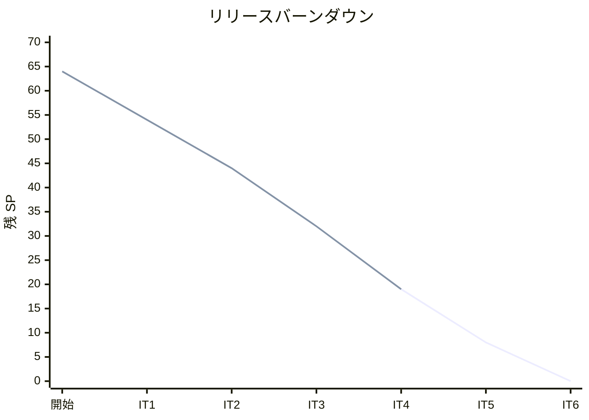
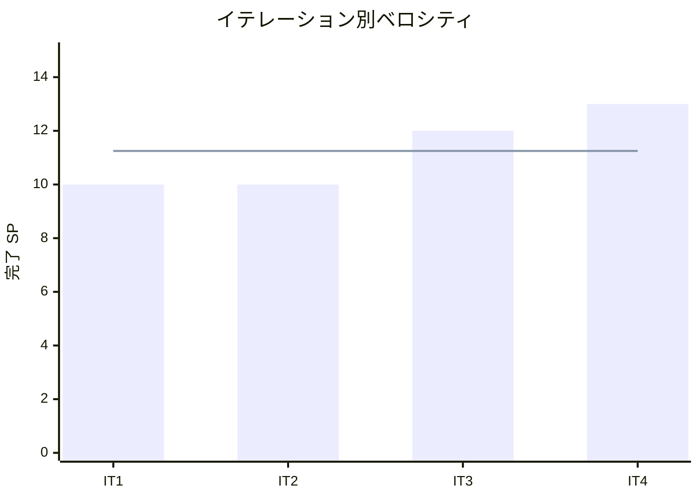

# イテレーション 4 完了報告書

## 1. プロジェクト概要

| 項目 | 内容 |
|------|------|
| イテレーション番号 | 4 |
| 計画期間 | 2026-05-12 〜 2026-05-25 |
| 実績期間 | 2026-04-02 |
| ゴール | 荷役・引取作業の記録と貨物追跡照会を完成させ、Phase 1 コア輸送管理フローを完結させる |

## 2. 要員

| 名前 | 予定作業日数 | 実績作業日数 |
|------|--------------|--------------|
| Copilot | 5 | 1 |

## 3. 指標

### ベロシティ

| 項目 | 値 |
|------|-----|
| 計画 SP | 13 |
| 実績 SP | 13 |
| 達成率 | 100% |

### リリースバーンダウン

### ベロシティ推移

## 4. テスト結果

| メトリクス | Backend | Frontend |
|-----------|---------|----------|
| テスト数 | 361 / 361 通過 | 該当なし |
| カバレッジ（instruction） | 90% | 該当なし |
| カバレッジ（分岐） | 71% | 該当なし |
| E2E テスト | リスト確認済み | — |

### テスト増分（前イテレーション比）

| メトリクス | IT3 実績 | IT4 実績 | 増分 |
|-----------|----------|----------|------|
| Backend テスト数 | 278 | 361 | +83 |
| カバレッジ（instruction） | 92.5%（LINE） | 90% | — |

### テスト累計推移

| イテレーション | Backend テスト数 | E2E シナリオ（目安） |
|---------------|------------------|---------------------|
| IT1 | 113 | 9 |
| IT2 | 239 | 17 |
| IT3 | 278 | 26 |
| IT4 | 361 | 26+ |

## 5. SonarQube Quality Gate

| プロジェクト | カバレッジ（instruction） | Violations（new） | 結果 |
|------------|--------------------------|-------------------|------|
| cargo-tracker | 90% | 0（解消済み） | PASS ✅ |

## 6. 実施内容と評価

### ストーリー別完了状況

| ストーリー | 結果 | 予定ポイント | ベロシティ加算ポイント |
|-----------|------|-------------|------------------------|
| US10 荷役作業を記録する | 完了 | 3 | 3 |
| US11 引取作業を記録する | 完了 | 3 | 3 |
| US12 貨物状態を手動更新する | 完了 | 2 | 2 |
| US13 追跡情報を照会する | 完了 | 5 | 5 |
| 合計 |  | 13 | 13 |

### 受入条件達成状況

#### US10: 荷役作業を記録する

- [x] 港湾オペレーターが積み込み（LOAD）・荷降ろし（UNLOAD）・通関（CUSTOMS）・積み替え（TRANSHIP）のイベント種別で荷役作業を登録できる
- [x] 荷役作業の登録には予約 ID・イベント種別・場所・日時が必要で、不正入力はバリデーションエラーになる
- [x] 登録済みの荷役作業を予約 ID で一覧確認できる
- [x] 荷役作業は REST API でも登録・照会できる

#### US11: 引取作業を記録する

- [x] 配達員が RECEIVE イベントで引取完了を記録できる
- [x] RECEIVE 登録時に引取確認コードが発行される
- [x] 同一予約に対する RECEIVE の重複登録は 409 Conflict を返す
- [x] 引取完了後の追跡情報で「引取済み」として表示される

#### US12: 貨物状態を手動更新する

- [x] 管理者が MANUAL_UPDATE で貨物状態をカスタムメモ付きで更新できる
- [x] MANUAL_UPDATE の登録にはメモ（必須）と管理者権限が必要で、未入力の場合はバリデーションエラーになる
- [x] 管理者以外が MANUAL_UPDATE を試みると拒否される

#### US13: 追跡情報を照会する

- [x] 追跡番号（TRK-XXXXXXXX）を使って `/tracking/{trackingNumber}` ページを公開照会できる
- [x] 追跡ページに荷役履歴（日時・場所・イベント種別）が表示される
- [x] 追跡ページに現在状態・出発地・目的地・推定到着日が表示される
- [x] 存在しない追跡番号は 404 ページを正しい HTTP ステータスで返す
- [x] 予約詳細画面の「追跡機能準備中」が追跡ページへのリンクに変わる

### レイヤー別実装要約

- **ドメイン**: `HandlingEvent`（LOAD / UNLOAD / CUSTOMS / TRANSHIP / RECEIVE / MANUAL_UPDATE）、`HandlingEventType`、`TrackingEventType`（BC 境界を保つ tracking 側の列挙型）を実装しました。
- **アプリケーション**: `RecordHandlingEventCommandService`、`TrackingQueryService`（tracking BC 内の型のみ参照）を実装しました。
- **インフラ**: Flyway migration（handling_events テーブル）、MyBatis マッパー、RECEIVE 重複防止ロジックを実装しました。
- **プレゼンテーション**: 荷役作業登録画面（handling/register.html）、引取記録画面（handling/receive.html）、手動更新画面（handling/manual-update.html）、荷役作業一覧（handling/list.html）、追跡照会画面（tracking/show.html）を実装しました。追跡画面には出発地・目的地・現在状態・推定到着日を追加しました。
- **E2E**: 引取・手動更新・追跡照会の受入テストを Playwright で追加しました。

## 7. レビュー対応サマリー

IT4 では実装完了後に 7 エージェント並列レビューを実施し、高優先度 12 件の指摘をすべて同イテレーション内に解消しました。

| カテゴリ | 指摘内容 | 対応コミット |
|---------|---------|-------------|
| BC 境界違反 | `TrackingQueryService` が handling BC の `HandlingEventType` を直接 import | `TrackingEventType` 新設・ArchUnit A10 ルール追加（`924fd31` / `2aa8622`） |
| HTTP ステータス | 404 ページを正しいステータスで返す | `TrackingWebController` 修正（`d80ebe6`） |
| ARIA 違反 | `role="note"` 削除 | receive.html / manual-update.html 修正（`0e5e223`） |
| UI 導線 | handling/list.html に引取記録・手動更新への導線追加 | `6c978fe` |
| UI 導線 | グローバルナビに荷役ドロップダウン追加 | `b872d04` |
| E2E テスト品質 | null ガード修正・未認証アクセス検証追加 | `a4b0642` |
| RECEIVE 重複 | 409 テスト追加 | `c5f92ba` |
| memo required | manual-update.html の memo に required 属性追加 | `9c8f58d` |
| OpenAPI | TrackingRestController にアノテーション追加 | `f4d1458` |
| US13 受入条件 2 | show.html に出発地・目的地・現在状態・推定到着日追加 | `132502e` |
| 引取確認コード | RECEIVE 時に引取確認コードを発行 | `a96f63c` |

## 8. E2E テスト結果

### 新規追加シナリオ

| 内容 | 結果 |
|------|------|
| 荷役作業（LOAD/UNLOAD/CUSTOMS/TRANSHIP）の受入テスト | リスト確認済み |
| 引取記録（RECEIVE）の受入テスト | リスト確認済み |
| 手動更新（MANUAL_UPDATE）の受入テスト | リスト確認済み |
| 追跡照会（show.html）の受入テスト | リスト確認済み |
| 未認証アクセス検証 | リスト確認済み |

> **注**: E2E テストはサーバー起動環境が必要なため Playwright 実行は未確認。TypeScript 型チェック（`--list`）でリストアップを確認済み。

### リグレッション結果

| 種別 | 結果 |
|------|------|
| backend テスト | 361 / 361 passed |
| SonarQube Quality Gate | PASS ✅ |

## 9. フェーズ・累計進捗

### 現在フェーズの進捗（Phase 1）

| ストーリー | 計画 SP | 完了 SP | 状態 |
|-----------|---------|---------|------|
| US02 荷主を登録する | 3 | 3 | 完了 ✅ |
| US03 法人荷主を登録する | 2 | 2 | 完了 ✅ |
| US04 貨物予約を登録する | 5 | 5 | 完了 ✅ |
| US01 輸送見積を作成する | 5 | 5 | 完了 ✅ |
| US06 最適ルートを検索する | 5 | 5 | 完了 ✅ |
| US05 危険物・冷凍貨物の予約登録 | 3 | 3 | 完了 ✅ |
| US07 ルートを選択して予約に紐付ける | 3 | 3 | 完了 ✅ |
| US08 予約を確定する | 3 | 3 | 完了 ✅ |
| US09 追跡番号を発行する | 3 | 3 | 完了 ✅ |
| US10 荷役作業を記録する | 3 | 3 | 完了 ✅ |
| US11 引取作業を記録する | 3 | 3 | 完了 ✅ |
| US12 貨物状態を手動更新する | 2 | 2 | 完了 ✅ |
| US13 追跡情報を照会する | 5 | 5 | 完了 ✅ |
| US14 遅延例外を処理する | 3 | - | 未着手 |
| US15 破損・紛失例外を処理する | 3 | - | 未着手 |
| **Phase 1 合計** | **51** | **48** | **94.1%** |

### 全体累計進捗

| 項目 | 値 |
|------|----|
| 全体計画 SP | 64 |
| 累計完了 SP | 48 |
| 全体達成率 | 75% |
| 完了イテレーション | IT1・IT2・IT3・IT4 |
| 実績ベロシティ平均 | 11.25 SP（IT1: 10 / IT2: 10 / IT3: 12 / IT4: 13） |

## 10. IT5 への引き継ぎ事項

- **残ストーリー**: US14（遅延例外処理・3 SP）・US15（破損・紛失例外処理・3 SP）で Phase 1 完結
- **ArchUnit A10 ルール**: tracking ↔ handling BC 境界の自動検証体制を IT5 でも維持すること
- **プロンプト改善**: エージェントへの指示に「スコープ外の機能追加禁止」を明示すること（IT4 の Try 反映）
- **分岐カバレッジ**: 現状 71% → IT5 目標 75% 以上
- **品質ベースライン**: backend 361 テスト Green・SonarQube Quality Gate PASS を維持条件とする

## 11. ふりかえりへのリンク

詳細は [イテレーション 4 ふりかえり](./retrospective-4.md) を参照。

## 12. 更新履歴

| 日付 | 更新内容 | 更新者 |
|------|---------|--------|
| 2026-04-02 | IT4 完了報告書を作成 | Copilot |
