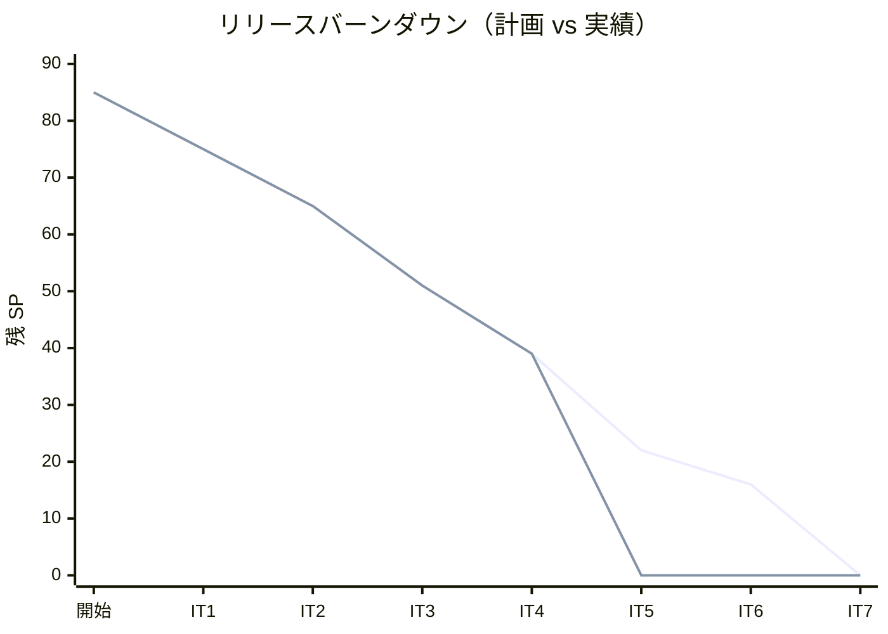
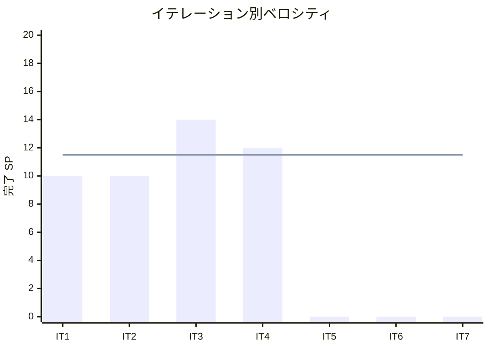

# イテレーション 4 完了報告書

## プロジェクト概要

国際貨物輸送管理システム（Cargo Tracker F# 版）のイテレーション 4 完了報告。
Booking Context の状態機械を経路確定へ拡張し、Routing が算出した経路候補を予約に確定・紐付けし、荷主通知と予約確定・差し戻し・キャンセルまで、経路確定〜予約確定の業務フローを一気通貫で実現した。

## 日程

- イテレーション開始日: 2026-08-25（計画）
- イテレーション終了日: 2026-09-05（計画）
- 作業日数: 10 日（2 週間）
- 局面: 中盤（インサイドアウト）

## 要員

| 名前 | 予定作業日数 | 実績作業日数 |
|------|-------------|-------------|
| 開発担当 + AI エージェント | 10 | 10 |

## 指標

### ビルド・テスト結果

| 項目 | 結果 |
|------|------|
| ユニットテスト（CargoTracker.Tests） | 128 件緑 |
| 統合テスト（CargoTracker.IntegrationTests） | 101 件緑 |
| アーキテクチャテスト（CargoTracker.ArchTests） | 13 件緑 |
| **合計** | **242 件緑・失敗 0** |
| ビルド警告 | 0（`-warnaserror`） |
| Fantomas フォーマット | クリーン |
| カバレッジ（全体 / ドメイン層） | 94.1% / 90.2%（閾値 80% / 85% クリア） |

### イテレーションバーンダウン（リリース）

### ベロシティ

## 実施内容と評価

| ストーリー | 結果 | 予定ポイント | ベロシティ加算ポイント |
|-----------|------|-------------|----------------------|
| US09 経路候補を選択する | 完了 | 3 | 3 |
| US10 経路条件を調整して再算出する | 完了 | 2 | 2 |
| US11 確定経路を予約に紐付ける | 完了 | 2 | 2 |
| US12 荷主に経路を通知する | 完了 | 2 | 2 |
| US13 予約を確定・差し戻し・キャンセルする | 完了 | 3 | 3 |
| **合計** | | **12** | **12** |

### 主な成果物

| 種別 | 成果物 |
|------|--------|
| ドメイン | `Leg`・`CargoItinerary`（連結制約）・`BookingState`（RouteProposed/Confirmed）・`ProposeRoute`/`ConfirmBooking`/`RestoreToRouting` 遷移・`BookingState.itinerary` |
| アプリケーション | `RouteAssignment`（proposeRoute/confirmBooking/restoreToRouting/cancel/notifyRouteToShipper）・`BookingEventDispatcher`/`ShipperNotifier` ポート |
| インフラ | leg 永続化（マイグレーション 0007・両方言）・notification_log（0008・両方言）・`StubBookingEventDispatcher`・`NotificationLogShipperNotifier` |
| Web | `RouteAcl`（Routing→Booking ACL）・経路候補の選択確定 `POST /routing/requests/{id}/propose`・期限調整再算出・予約詳細の確定経路表示 + 確定/差し戻し/キャンセル/通知 |
| ADR | ADR-0010（経路確定の Routing→Booking 連携は合成層の ACL 変換で行う） |
| 設計反映 | data-model（leg 0007・notification_log 0008）・domain-model（RestoreToRouting 遷移・CargoItinerary list 表記）・計画（US10 意味論・post-commit 方針） |
| リファクタ | IT3 レビュー M1（Result 畳み込みの `traverseResultM` 集約・Routing Application/Infrastructure） |

### レビュー（セルフレビュー）

xp-programmer / xp-tester の 2 視点でセルフレビューを実施し、高・中の指摘を反映した。

| 指摘 | 重要度 | 対応 |
|------|--------|------|
| post-commit dispatch の失敗が型で表現されず握りつぶし中間状態 | 高 | `Async.Catch` でベストエフォート化を明示（確定済み結果を巻き戻さない） |
| dispatch 非発火がドメイン検証エラー・永続化失敗の経路で未検証 | 高 | 両失敗経路の非発火テストを追加 |
| US10 緩和期限で見えた候補の確定と集約の元期限検証が乖離 | 高 | 現挙動（400 棄却）を受入テストで固定・意味論を計画に明記 |
| confirm/差し戻しの不正遷移マトリクスが未網羅 | 中 | 不正遷移テストを追加 |
| Leg 時刻の等値境界が未検証 | 中 | 等値境界テストを追加 |
| `NullBookingEventDispatcher` がデッドコード | 中 | 誤検知（テストで使用中）と確認、対応不要 |

### デスコープ・保留

| 項目 | 状態 | 理由 |
|------|------|------|
| イベント実消費（Tracking 追跡番号発行等） | 保留 | 消費側 BC が IT5+ 未着手。dispatch 配線は完了、Stub はログ出力にとどまる |
| US12 実送信・recipient 実アドレス解決 | 部分 | notification_log 記録の最小実装。実送信と荷主メール解決は後続 IT |
| US10 正式な期限変更コマンド | 保留 | 期限調整は探索専用。実変更は営業経由の別アクション（必要時に ADR で導入） |

### イテレーションレビュー（次イテレーションへの引き継ぎ）

| アクションアイテム | 担当 |
|-------------------|------|
| Tracking（IT5）で `BookingEventDispatcher` の実消費を結線し、リトライ/DLQ 方針を確立 | 開発担当 |
| US12 通知を実送信へ拡張し recipient を荷主メール解決へ | 開発担当 |
| US10 正式な期限変更コマンド（`RouteSpecification` 更新）を必要時に ADR 込みで導入 | 開発担当 |
| Web の「ワークフロー実行→PRG」共通ハンドラへ集約（DRY） | 開発担当 |
| 候補選択を index から同一性キー照合へ変更（並び順非決定性への堅牢化） | 開発担当 |

## 総括

計画 12 SP を 100% 達成。IT1-4 の 4 イテレーション連続で計画どおり消化（累計 46/46 SP）。
中盤インサイドアウトの狙いどおり、`Leg`/`CargoItinerary` の連結制約と状態機械拡張を FsCheck 込みでドメイン層に凝集させ、経路確定〜予約確定を型駆動で堅牢化した。
ADR-0010 の ACL 変換により Routing と Booking の BC 分離を保ったまま経路確定連携を実現し、ArchUnit を緑に維持。
retro-3 Try#1 の post-commit イベント dispatch を結線し、IT2 H6・IT3 M2 から継続していた負債を解消した（コミット後発火・失敗はベストエフォート）。
セルフレビューを中間適用し、US10 の潜在的矛盾・検証穴を正式レビュー前に是正できた。
ベロシティは 4 IT 連続 100% で安定期に入ったと判断でき、リリース計画の改訂は不要。IT5 の過積載は IT5 着手時に再評価する。
IT4 完了後も中盤（IT5）が継続し、Tracking Context（貨物追跡・輸送状態）へ進む。

---

## 関連ドキュメント

- [イテレーション 4 計画](./iteration_plan-4.md)
- [イテレーション 4 ふりかえり](./retrospective-4.md)
- [リリース計画](./release_plan.md)
- [ADR-0010](../adr/0010-経路確定のRouting_Booking連携は合成層のACL変換で行う.md)
