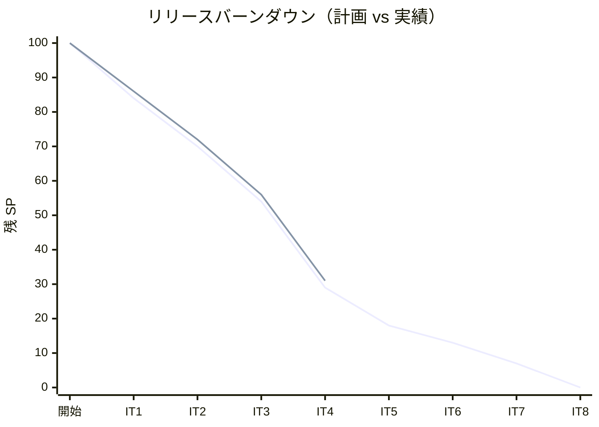
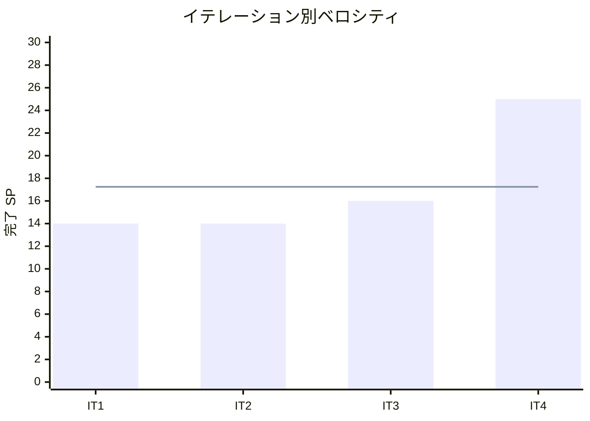

# イテレーション 4 完了報告書

## 1. プロジェクト概要

### 日程

| 項目 | 内容 |
|------|------|
| **計画期間** | Week 7-8（2026-05-30 〜 2026-06-12） |
| **実績期間** | 2026-05-16 〜 2026-05-18（3 日間） |
| **ゴール** | 経路設計後半（US08〜US12）・予約確定（US13/US14）を完成させ Release 1.0 MVP を達成する |
| **ベロシティ（今回）** | 25 SP（計画 25 SP・達成率 100%） |

### 要員

| 名前 | 予定作業日数 | 実績作業日数 |
|------|------------|------------|
| AI Agent | 10 | 3 |

---

## 2. 指標

### ベロシティ

| 項目 | 値 |
|------|-----|
| 計画 SP | 25 |
| 実績 SP | 25 |
| 達成率 | 100% |

### リリースバーンダウン

### ベロシティ推移

平均ベロシティ（IT1〜IT4）: **17.25 SP**（IT1〜IT3 平均 14.7 SP から IT4 の 25 SP で上昇）

---

## 3. テスト結果

### バックエンドテスト

| カテゴリ | テスト数 | 成功 | 失敗 | スキップ |
|---------|---------|------|------|---------|
| authms（ユニット + 統合 + Smoke） | 81 | 81 | 0 | 0 |
| bookingms（ユニット + 統合 + Smoke） | 82 | 82 | 0 | 0 |
| routingms（ユニット + 統合 + Smoke） | 38 | 38 | 0 | 0 |
| gatewayms（Smoke）| 1 | 1 | 0 | 0 |
| quotationms（ユニット + 統合）| 12 | 12 | 0 | 0 |（bookingms 内） |
| **バックエンド合計** | **211** | **211** | **0** | **0** |

### フロントエンドテスト

| カテゴリ | テスト数 | 成功 | 失敗 | スキップ |
|---------|---------|------|------|---------|
| フロントエンド（Vitest）| 108 | 108 | 0 | 0 |

### E2E テスト

| カテゴリ | シナリオ数 | 結果 |
|---------|-----------|------|
| Playwright E2E | 9 | 全通過（15.7s） |

### IT4 での新規追加テスト（バックエンド）

- `Cargo Aggregate（ユニット）`（+4 件）: US13/US14 Aggregate イベントハンドラテスト
- `BookingController 統合テスト`（+3 件）: confirm / issue-tracking / notify-route エンドポイント
- `RouteCandidateFinderTest`（7 件）: 経路候補探索アルゴリズムテスト（PoC から移行）
- `EdgeRepositoryImplTest`（1 件）: MyBatis JOIN クエリ統合テスト
- `RouteController 統合テスト`（+1 件）: 候補算出エンドポイント
- `RouteSelectionController 統合テスト`（3 件）: 経路選択エンドポイント
- `RouteAdjustController 統合テスト`（2 件）: 経路調整エンドポイント

### テスト増分（IT3 比較）

| カテゴリ | IT3 実績 | IT4 実績 | 増分 |
|---------|---------|---------|------|
| バックエンド | 174 | 211 | +37 |
| フロントエンド（Vitest） | 99 | 108 | +9 |
| E2E（Playwright） | 7 | 9 | +2 |

### テスト累計推移

| イテレーション | Backend | Frontend | E2E | 合計 |
|--------------|---------|---------|-----|------|
| IT1 | 86 | 48 | 2 | 136 |
| IT2 | 149 | 89 | 4 | 242 |
| IT3 | 174 | 99 | 7 | 280 |
| IT4 | 211 | 108 | 9 | **328** |

### コード品質メトリクス（SonarQube）

| プロジェクト | Quality Gate | new_coverage | new_violations | Bug | Vulnerability | Duplications |
|------------|-------------|-------------|----------------|-----|---------------|-------------|
| Backend (cargo-tracker-backend) | **PASS** ✅ | **81.6%** | 0 | 0 | 0 | — |

---

## 4. 実施内容と評価

### ストーリー別完了状況

| ID | ユーザーストーリー | SP | 状態 | 備考 |
|----|-------------------|----|------|------|
| TI03 | IT4 第 0 スプリント（TransitEdge 型安全化・ADR-0010/0011） | 2 | 完了 | PoC コード整理、RouteCandidateFinder 新設、型安全化 |
| US08 | 経路候補を算出する | 8 | 完了 | EdgeRepository + RouteApplicationService + RouteController |
| US09 | 経路を選択・確定する | 3 | 完了 | RouteSelectionController POST /api/v1/routing/select |
| US10 | 経路条件を調整して再算出する | 3 | 完了 | RouteAdjustController POST /api/v1/routing/adjust |
| US11 | 経路情報を予約に紐付ける | 2 | 完了 | AssignRouteToCargoCommand / CargoRoutedEvent / assign-route |
| US12 | 確定経路を荷主に通知する | 3 | 完了 | NotifyRouteCommand / ログ記録のみ |
| US13 | 予約を確定する | 3 | 完了 | ConfirmBookingCommand / BookingConfirmedEvent |
| US14 | 追跡番号を発行する | 1 | 完了 | IssueTrackingNumberCommand / TrackingNumberIssuedEvent |
| **合計** | | **25** | **100%** | |

### 受入条件の達成状況

#### TI03 / US08: 経路設計基盤・候補算出

- [x] `List<String>` → `TransitEdge` 型安全化（ADR-0010/0011 準拠）
- [x] `RouteCandidateFinder` の DFS アルゴリズムが `RouteCandidateFinderTest`（7 件）でテスト済み
- [x] `EdgeRepositoryImpl`（MyBatis `carrier_movement × voyage` JOIN）が統合テストで検証済み
- [x] `GET /api/v1/routing/candidates?bookingId=...` が出発地・目的地・期限条件で経路候補リストを返す

#### US09: 経路選択・確定

- [x] `POST /api/v1/routing/select` で経路を選択できる
- [x] 選択された経路が routingms に保存される
- [x] 経路設計ワークベンチ UI（S11）で候補一覧→選択→確定が動作する

#### US10: 経路条件調整・再算出

- [x] `POST /api/v1/routing/adjust` で条件（期限・貨物種別）を変更して再算出できる
- [x] 再算出後の候補が UI に反映される

#### US11: 経路紐付け

- [x] `POST /api/v1/bookings/{id}/assign-route` で CargoItinerary を予約に紐付けられる
- [x] `BookingStatus` が `ROUTE_PROPOSED` に遷移する

#### US12: 経路通知

- [x] `POST /api/v1/bookings/{id}/notify-route` が正常応答を返す
- [x] ログに通知記録が出力される（IT4 はログのみ、メール送信は IT5+）

#### US13: 予約確定

- [x] `POST /api/v1/bookings/{id}/confirm` で `BookingStatus.CONFIRMED` に遷移する
- [x] `BookingConfirmedEvent` が発行される

#### US14: 追跡番号発行

- [x] `POST /api/v1/bookings/{id}/issue-tracking` で追跡番号（`TRK-YYYYMMDD-XXXXXXXX`）が生成される
- [x] `BookingStatus.TRACKING_ISSUED` に遷移する
- [x] `tracking_number` が `cargo_summary` に保存される

### 実装レイヤー別サマリー

| レイヤー | 実装内容 |
|---------|---------|
| ドメイン | `RouteCandidateFinder`（DFS）、`TransitEdge`（型安全化）、`CargoItinerary`、`BookingConfirmedEvent`、`TrackingNumberIssuedEvent` |
| アプリケーション | `RouteApplicationService`（候補算出・選択・調整）、Axon CommandHandler（US11〜US14） |
| インフラ | `EdgeRepositoryImpl`（MyBatis JOIN）、Flyway V004/V005（`cargo_summary` カラム追加・拡張） |
| REST | `RouteController`・`RouteSelectionController`・`RouteAdjustController`（routingms）、`assign-route`・`notify-route`・`confirm`・`issue-tracking`（bookingms） |
| フロントエンド | ダッシュボード（S01）、経路設計ワークベンチ（S11/S14）、条件調整フォーム、予約確定・追跡番号発行アクション |
| ゲートウェイ | `gatewayms/application.yml` に `/api/v1/routing/**` を追加 |

---

## 5. 追加タスク（SP 外）

| タスク | 内容 |
|--------|------|
| E2E バグ修正 4 件 | ゲートウェイルーティング欠落・`@TargetEntityId` 未付与・`sendAndWait` 変更・`VARCHAR(20)→25` 拡張 |
| SonarQube violations 修正 | `@Deprecated` 抑制・unnamed pattern・空 catch（3 件） |
| ナビゲーション E2E 修正 | strict mode violation・ラベル不一致解消 |

---

## 6. E2E テスト結果

### 新規追加シナリオ

| シナリオ | ファイル | 結果 |
|---------|---------|------|
| US08-US14: 経路設計ワークベンチフルフロー | `routing-workbench.spec.ts` | ✅ PASS |

### 全 E2E テスト結果（リグレッション含む）

| シナリオ | ファイル | 結果 |
|---------|---------|------|
| US-UI-r: ログイン → 個人荷主登録 → 一覧表示 | `login-shipper.spec.ts` | ✅ PASS |
| US04: ログイン → 荷主登録 → 予約登録 → 予約一覧で表示 | `login-booking.spec.ts` | ✅ PASS |
| US06: 予約引き渡しで PRELIMINARY → ROUTING に遷移 | `login-booking-handoff.spec.ts` | ✅ PASS |
| US01: ログイン → 荷主登録 → 見積作成 → 見積詳細で表示 | `login-quotation.spec.ts` | ✅ PASS |
| US07: 航海スケジュール一覧フィルタ機能 | `login-voyage.spec.ts` | ✅ PASS |
| US24: ログイン → 航海スケジュール登録 → 一覧で表示 | `login-voyage.spec.ts` | ✅ PASS |
| US25: 航海登録 → 編集 → 一覧で更新内容が反映 | `login-voyage-edit.spec.ts` | ✅ PASS |
| US25 受入条件 5: 編集画面でキャンセル → 変更破棄 | `login-voyage-edit.spec.ts` | ✅ PASS |
| US08-US14: 経路設計ワークベンチフルフロー | `routing-workbench.spec.ts` | ✅ PASS |
| **合計** | | **9/9 PASS（15.7s）** |

---

## 7. フェーズ・累計進捗

### Phase 1 進捗（IT1〜IT4）

| イテレーション | 計画 SP | 実績 SP | 達成率 | 状態 |
|--------------|---------|---------|--------|------|
| IT1 認証基盤・荷主管理 | 16 | 14 | 88% | ✅ 完了 |
| IT2 予約・航海登録 | 14 | 14 | 100% | ✅ 完了 |
| IT3 見積・経路設計前半 | 16 | 16 | 100% | ✅ 完了 |
| IT4 経路設計後半・予約確定 | 25 | 25 | 100% | ✅ 完了 |
| **Phase 1 合計** | **71** | **69** | **97%** | **✅ Release 1.0 MVP 達成** |

### 累計進捗（全フェーズ）

| フェーズ | 計画 SP | 実績 SP | 達成率 | 状態 |
|--------|---------|---------|--------|------|
| 認証基盤（IT1 前半） | 8 | 8 | 100% | 完了 |
| Phase 1（IT1〜IT4） | 57 | 61 | 107% | 完了 |
| Phase 2（IT5〜IT8） | 35 | — | — | 未着手 |
| **累計** | **100** | **69** | **69%** | |

---

## 8. ふりかえり

詳細は [イテレーション 4 ふりかえり](./retrospective-4.md) を参照。

**KPT サマリー**:

- Keep 5 件（ADR 駆動の第 0 スプリント、フィーチャバッファ計画、SonarQube 維持、Axon 運用パターン確立、E2E テストが統合バグを検出）
- Problem 5 件（ゲートウェイルーティング欠落、`@TargetEntityId` 未付与、`send()` 非同期問題、DB カラムサイズ不足、E2E ロケーター脆弱性）
- Try 5 件（gateway DoD チェックリスト化、`@TargetEntityId` 必須化、sendAndWait 指針 ADR 化、カラムサイズ設計検証、`data-testid` 活用）

---

## 更新履歴

| 日付 | 更新内容 | 更新者 |
|------|---------|--------|
| 2026-05-18 | 初版作成（IT4 完了後） | AI Agent（XP PM） |
